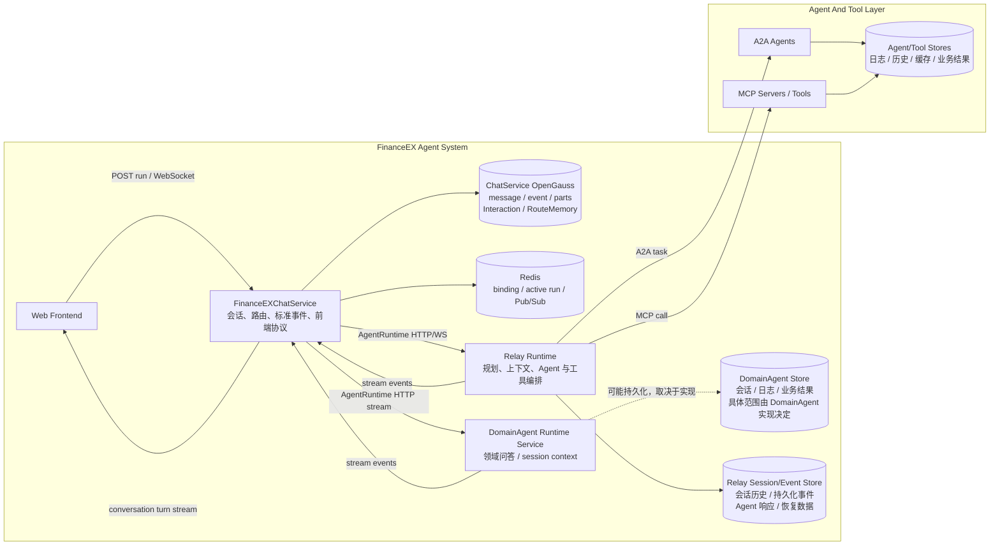
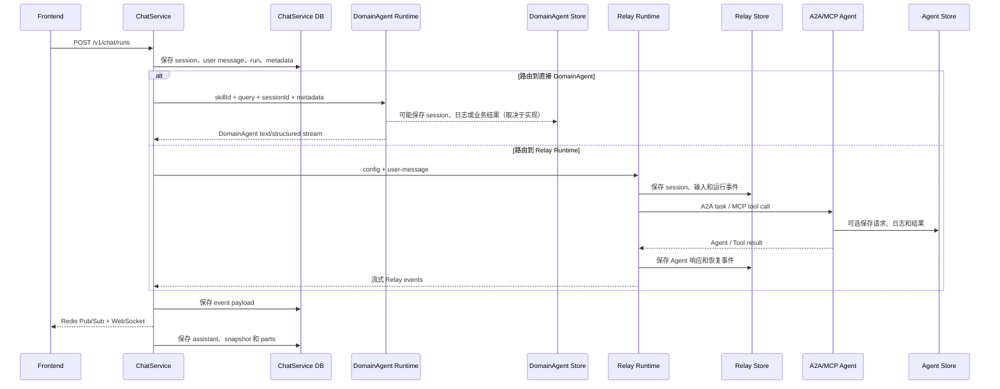
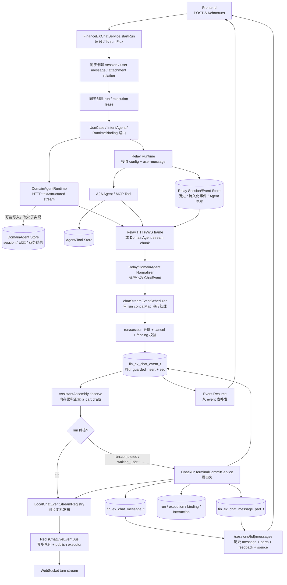
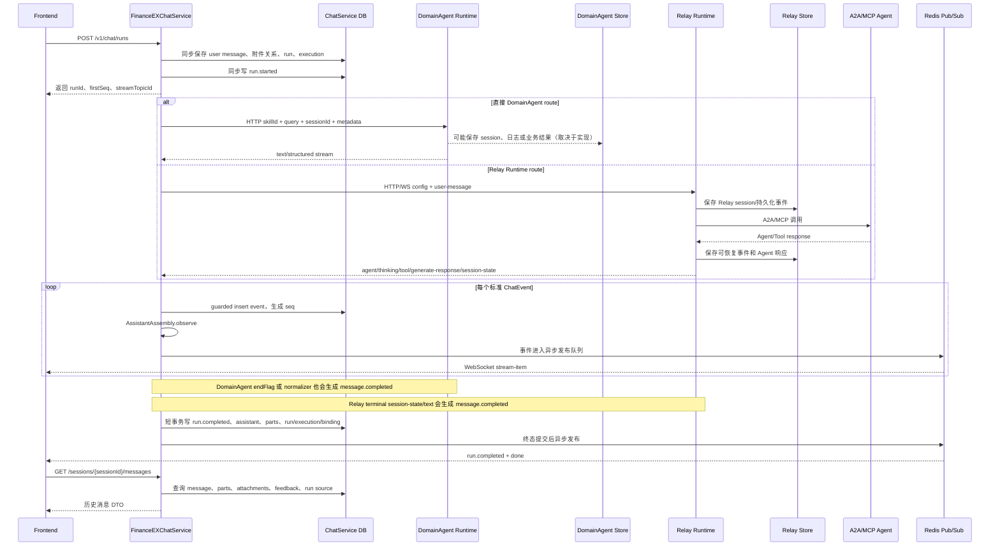
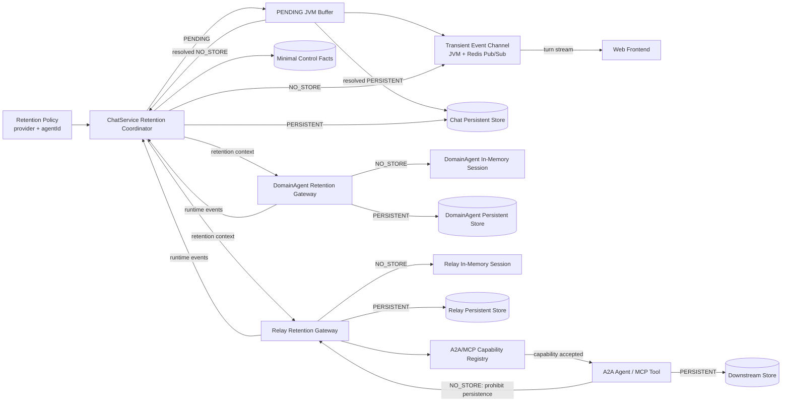
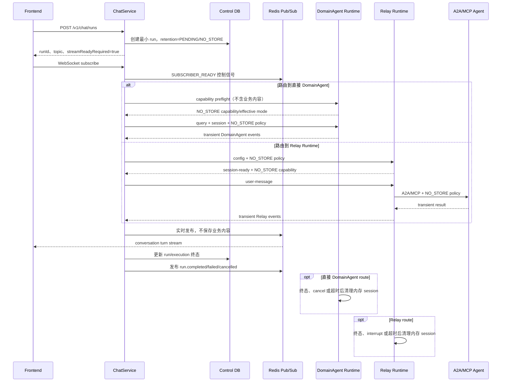

# 财经 Agent 数据安全与零留存设计

> 状态：设计提案，尚未实施
>
> 适用范围：FinanceEXChatService、直接调用的 DomainAgent Runtime、Relay Runtime、Relay 通过 A2A/MCP 调用的下游 Agent 与工具
> 结论：ChatService 与本轮实际经过的 Runtime/Agent/Tool 必须逐层执行 `NO_STORE`，才能称为端到端零留存

## 1. 背景

FinanceEX 的 Supervisor Agent、DomainAgent 以及 Relay 编排的下游 Agent 都可能处理资金、账务、税务、审批、金额、企业文档等敏感信息。敏感内容不只存在于最终回答中，还可能出现在用户问题、意图结果、思考过程、工具参数、工具结果、澄清问题、异常信息和附件引用中。

当前系统存在多个相互独立的数据保存边界：

- FinanceEXChatService 会保存用户消息、标准事件、assistant 正文、message parts、Interaction、RouteMemory 和意图识别记录。
- ChatService 可以通过同级的 `domain-agent` AgentRuntime provider 直接调用领域 Agent；DomainAgent 拥有自己的 session/context，并可能存在独立日志、缓存和业务存储。
- Relay Runtime 是 FinanceEX Agent System 的组成部分，负责复杂任务的规划、上下文维护和 Agent 编排。Relay 会保存会话历史、可恢复事件、Agent 响应结果等运行数据。
- Relay 可以通过 A2A 或 MCP 调用下游 Agent、MCP Server 和工具。这些下游组件还可能拥有自己的日志、缓存、会话和数据库。
- Redis 当前承担 RuntimeBinding、active run 和跨实例 Pub/Sub 等能力。若后续使用 Redis Stream、List 或 Value 保存完整事件，Redis 同样构成数据留存。

因此，只关闭 ChatService 的消息或事件落库不能实现端到端零留存。留存策略必须在调用链建立之前确定，并传播到直接 DomainAgent，或传播到 Relay 及其调用的每一个下游 Agent/Tool。

## 2. 设计目标

本设计的目标是：

1. 按 `provider + agentId` 配置 `PERSISTENT` 或 `NO_STORE`。
2. 在发送用户问题之前完成策略确认，不能在数据已经保存后再切换到更严格的策略。
3. `NO_STORE` 模式下，业务内容不进入数据库、Redis 持久化结构、本地文件、日志、样本或历史消息。
4. 保留 run、execution、binding 和 Interaction 的最小控制事实，以支持权限校验、状态查询、stop 和并发控制。
5. 保持在线实时输出，但明确放弃历史恢复、Event Resume、刷新补发、反馈和分享等依赖持久化的能力。
6. DomainAgent、Relay 或下游 Agent 无法确认支持 `NO_STORE` 时 fail closed，不得降级为持久化执行。

本设计不包含现有历史数据清理、数据库迁移脚本和具体代码实现。

## 3. 当前整体架构

ChatService、直接 DomainAgent Runtime 与 Relay Runtime 都位于 FinanceEX Agent System 的处理链路内。Relay 不是不可控的普通第三方接口，而是承担复杂任务运行、会话上下文和下游 Agent 编排的 Runtime 子系统；直接 DomainAgent 则承担领域问答和领域会话上下文。



### 3.1 ChatService 当前保存的数据

- `fin_ex_chat_message_t`：用户问题和最终 assistant 正文。
- `fin_ex_chat_message_part_t`：回答快照、思考、工具、进度、引用、卡片和 Agent 调用过程。
- `fin_ex_chat_event_t`：运行期间的标准 ChatEvent payload。
- `fin_ex_chat_interaction_request_t`：澄清、审批和确认的请求与回答。
- `fin_ex_route_memory_t`：成功路由问题和意图澄清链路。
- `fin_ex_intent_recognition_t`：意图请求、结果和可选原始响应。
- `fin_ex_chat_run_t.metadata_json`、会话标题、分享快照、反馈和附件关系也可能包含业务上下文。

### 3.2 Relay 当前保存的数据

Relay 维护自己的 Runtime session。根据 Relay 接口中的 `sessionMode=new/resume`、`session-init`、`version_id` 和增量恢复能力，Relay 存在独立于 ChatService 的会话与事件事实源。

Relay 的持久化范围至少包括：

- Runtime session 与历史消息。
- 支持增量恢复的持久化事件和版本信息。
- Agent 运行结果、最终响应及用于恢复上下文的数据。
- Relay 内部规划、Agent 调用和工具编排所需的运行状态。

并非所有 Relay 瞬时事件都必须持久化。例如 heartbeat、部分 streaming/thinking/tool 临时帧可能只在运行期间存在；但这不改变 Relay 具有独立持久化边界这一事实。

### 3.3 直接 DomainAgent 的数据

ChatService 也可以绕过 Relay，按 active RuntimeBinding、意图路由结果或前端显式目标直接调用 DomainAgent：

- `DomainAgentRuntime` 与 `RelayAgentRuntime` 是同级 AgentRuntime provider。
- ChatService 向 DomainAgent 发送服务端确定的 `skillId`、本轮 `query`、`sessionId` 和业务 metadata。
- DomainAgent 返回文本流或结构化片段，由 DomainAgent normalizer 转成与 Relay 相同的标准 ChatEvent。
- ChatService 使用 RuntimeBinding 保存 DomainAgent ID 和下游 runtimeSessionId，使后续提问可以直接续接该 DomainAgent。
- DomainAgent 内部 session、日志、缓存和业务结果是否持久化不由本仓库控制，因此必须作为独立数据安全边界管理。

### 3.4 Relay 下游 Agent 与工具的数据

Relay 可以通过两类方式调用下游能力：

- A2A：向其他 Agent 发起任务或多轮交互。
- MCP：调用 MCP Server 暴露的工具，并接收普通结果或 `structuredContent`。

下游 Agent 或 MCP Server 可能保存输入、工具参数、搜索结果、结构化结果、错误日志和会话状态。如果这些组件不执行相同的留存策略，即使 ChatService 与 Relay 均未保存，仍不能视为端到端零留存。

## 4. 当前数据流



当前直接 DomainAgent 链路至少包含 ChatService 与 DomainAgent 两个数据边界；Relay 链路还会继续经过 Relay Store 和 A2A/MCP 下游数据边界。任一本轮实际经过的组件继续保存敏感内容，都意味着零留存不成立。

### 4.1 当前详细数据处理流程图

下面的流程图描述当前 `PERSISTENT` 实现，不代表 NO_STORE 已经实现。图中的“同步”表示当前 run 的事件处理链会等待该步骤完成；整个 run 相对于创建 run 的 HTTP 请求仍是后台异步执行。



### 4.2 当前单轮时序与写入顺序



### 4.3 当前同步与异步边界

| 处理步骤 | 当前执行方式 | 写入内容 | 失败影响 |
| --- | --- | --- | --- |
| `POST /v1/chat/runs` 后台运行 | 相对 HTTP 异步；`startRun` 在 bounded elastic 上订阅 run Flux | 无直接业务写入 | HTTP 等到第一个已处理事件后返回 run 信息 |
| session、user message、附件关系 | run 后台线程内同步调用仓储 | session、用户正文、消息树关系、附件展示引用 | 失败时 run 尚未正常开始，请求失败 |
| run 与 execution lease | 同步数据库写入 | run 状态、路由摘要、metadata、owner、fencing token、lease | 初始化失败时写 `run.failed`，避免残留 RUNNING |
| AgentRuntime 下游调用 | Reactor 异步网络流；Relay 使用 HTTP/WS，DomainAgent 使用 HTTP 文本/结构化流 | 下游接收用户问题、session、metadata 和服务端路由目标 | 网络、握手或协议失败进入 `run.failed` |
| DomainAgent 内部上下文/业务写入 | 本仓库无法确认线程模型 | DomainAgent session、日志、缓存或业务结果，具体范围由 DomainAgent 实现决定 | 必须在 DomainAgent 实现仓确认，不能因为 ChatService 异步调用就推断下游异步落库 |
| Relay 内部历史/事件写入 | 本仓库无法确认线程模型 | Relay session、带 `version_id` 的持久化事件、可恢复历史和 Agent 响应 | Relay 接口文档证明存在持久化与恢复能力，但同步/异步需要在 Relay 实现仓确认 |
| ChatEvent 标准化 | 当前 Runtime adapter 的响应流内同步转换 | 内存 ChatEvent，不直接写数据库 | 非法协议帧可能被忽略或转失败事件 |
| ChatEvent 落库 | `publishOn(chatStreamEventScheduler)` 后，通过 `concatMap` 按顺序同步 guarded insert | event type、完整 payload、全局 seq、run/session/owner | insert 被 cancel/fencing guard 拒绝后停止后续事件写入 |
| AssistantAssembly | event 成功落库后同步内存更新 | delta 草稿、最后 snapshot、所有 snapshot/runtime part drafts | 不单独持久化；随 run 生命周期存在 |
| 本机实时发布 | event 落库后同步调用 local registry | 已带数据库 seq 的 ChatEvent | 本机订阅者即时收到 |
| Redis 跨实例实时发布 | `publish()` 先入有界队列，再由 publish executor 异步 `convertAndSend`，包含重试 | 已落库 ChatEvent 的序列化副本 | 失败记录 recovery marker，前端应使用数据库 Event Resume |
| `run.completed`/`run.waiting_user` | `ChatRunTerminalCommitService` 短事务同步提交 | terminal event、assistant、parts、run、execution、binding、Interaction 状态 | 事务失败转 `run.failed`；终态在提交成功后才发布 |
| IntentRecognition | 独立 executor 异步 best-effort | 意图、候选、路由和可选原始摘要 | 写失败仅告警，不阻断 run |
| RouteMemory | 独立 write executor 异步 best-effort | route 或 clarify 记录；完成路由时同任务 fold + append | 写失败只影响后续路由上下文 |
| 历史消息 Redis 缓存 | `LayeredChatMessageRepository` 调用内同步更新短期缓存，数据库仍是事实源 | 最近 ChatMessage 上下文 | 数据库必需模式下 DB 失败会移除刚写入缓存并抛错 |
| Event Resume/历史查询 | Controller 使用 bounded elastic 承接同步数据库读取 | 不新增业务数据 | 读取失败返回接口错误，不改变 run |

这里的“事件实时推送”不是先推前端再异步落库。当前顺序固定为：**事件数据库写成功 -> 内存 assistant 汇总 -> run/binding 状态推进 -> 本机/Redis 发布**。因此前端实时看到的 ChatEvent 都应具有数据库 seq，并可由 Event Resume 重放。

### 4.4 Runtime 下游消息与 ChatEvent 的处理映射

Relay 原始 frame 不直接作为 ChatService 顶层事件。adapter 先收敛为稳定 ChatEvent，payload 保留脱敏后的 Relay 原始字段并补充 `source=relay`、`sourceType` 和 `runtimeSessionId`。

| Relay 输入 | ChatService event | event 表 | 实时前端 | AssistantAssembly / 历史 part |
| --- | --- | --- | --- | --- |
| `agent,is_streaming=true` | `message.delta` | 保存每个 delta payload | 追加当前 assistant 草稿 | 只累加正文，不为每个 delta 建 part |
| `agent,is_streaming=false` | `message.snapshot` | 每个 snapshot 都保存 | 用 snapshot 替换当前草稿 | 每个 snapshot 建一个 `MESSAGE_SNAPSHOT` part；最后一个决定最终正文 |
| `generate-response` | `message.snapshot` | 保存完整最终响应 payload | 替换当前草稿 | 建 `MESSAGE_SNAPSHOT`，通常成为最终正文来源 |
| `relay-start/progress/end` 等 | `runtime.progress` | 保存 | 展示进度事件 | `PROGRESS` part |
| `session-ready/session-state` 等 | `runtime.metadata` | 保存用户阶段内的标准事件 | 可用于状态或调试展示 | `METADATA` part；仅 metadata 且无正文/可见 part 时不会单独创建 assistant |
| `agent-call` | `runtime.agent` | 保存 | 展示 Agent 调用 | `AGENT` part |
| `agent-reasoning/thinking-*` | `runtime.thinking` | 保存 | 展示思考过程 | `THINKING` part |
| `tool-call-streaming/tool-execution/tool-structured-result` | `runtime.tool` | 保存完整标准 payload | 展示工具过程/结果 | `TOOL` part |
| citations、sources、references 等 | `runtime.reference` | 保存 | 展示引用 | `REFERENCE` part |
| `approval-request`、展示卡片 | `runtime.card` | 保存 | 展示卡片或澄清 | `CARD` 或细分 Interaction part |
| 未识别合法 JSON object | `runtime.event` | 保存 | 可作为调试事件处理 | `RUNTIME_EVENT`，默认隐藏/debug |
| terminal text / 适配器补齐 | `message.completed` | 保存 | 标记正文输出结束，不直接渲染正文 | 不产生 part |
| ChatService 生命周期终态 | `run.completed/failed/cancelled/waiting_user` | 保存 | 更新 run 状态并触发 turn `done` | 决定是否保存或更新 assistant 历史 |

直接 DomainAgent 的文本流或结构化 chunk 也不会绕过 ChatService 事件链路。`DomainAgentResponseNormalizer` 将其转换为与 Relay 共用的标准 ChatEvent，之后使用相同的 event 落库、实时发布、AssistantAssembly 和历史 parts 组装流程。

| DomainAgent 输入 | ChatService event | event 表 | 实时前端 | AssistantAssembly / 历史 part |
| --- | --- | --- | --- | --- |
| `content` 普通文本 | `message.delta` | 保存每个标准化 delta | 追加当前 assistant 草稿 | 累加正文，不为每个 delta 建 part |
| `content` 中的 thinking 片段 | `runtime.thinking` | 保存 | 展示思考过程 | `THINKING` part |
| `state=THINKING` | `runtime.thinking` | 保存 | 展示思考状态 | `THINKING` part |
| `state=GENERATE` | `runtime.progress` | 保存 | 展示生成进度 | `PROGRESS` part |
| `processResult` | `runtime.progress` | 保存结构化 payload | 展示处理结果 | `PROGRESS` part |
| `searchList`、`sourcesDocuments/sourceDocuments` | `runtime.reference` | 保存 | 展示引用与来源 | `REFERENCE` part |
| `cardUrl/diyCardScene/cardList/openCard` | `runtime.card` | 保存 | 展示业务卡片 | `CARD` part |
| 下游 `sessionId` | `runtime.metadata` | 保存 `domainAgentSessionId/runtimeSessionId` | 可用于状态或调试展示 | `METADATA` part |
| `traceId/messageId/intent/skillId` | `runtime.metadata` | 保存 | 可用于状态或调试展示 | `METADATA` part |
| `endFlag=true` | `message.completed` | 保存 | 闭合正文阶段 | 不产生 part |
| 未识别结构化对象 | `runtime.event` | 保存 | 可作为调试事件处理 | `RUNTIME_EVENT`，默认隐藏/debug |

DomainAgent 当前主要输出 delta，并不天然产生 Relay `message.snapshot`；如果其后续协议增加快照事件，只要 normalizer 映射为 `message.snapshot`，就会自动进入“保存全部 snapshot、最后一个决定最终正文”的同一规则。

Relay 自身的保存与 ChatService event 表是两套独立事实源：

- Relay 带 `version_id` 的事件可以从 Relay 持久化存储做增量恢复，进程重启后版本继续递增。
- `heartbeat-response`、部分 thinking/tool streaming、`session-state` 等 Relay 瞬时事件没有 `version_id`，不属于 Relay 增量恢复集合。
- ChatService 收到并标准化后，会按自己的事件规则再次写入 `fin_ex_chat_event_t`。因此同一业务结果可能同时存在于 Relay Store 和 ChatService Store。
- Relay 的内部写入究竟是同步、异步还是批量刷盘，当前 ChatService 仓库与 `docs/relay.md` 没有给出实现细节，设计文档不能将其假定为异步。

直接 DomainAgent 也可能形成第二套独立事实源。ChatService 仓库只能确认 DomainAgent 返回内容会再次写入 ChatService event/message/parts；DomainAgent 是否保存 session、输入、响应、日志或业务结果，以及采用同步、异步还是批量写入，必须以 DomainAgent 服务自身实现和数据治理声明为准。

### 4.5 Assistant 正文组装规则

`AssistantAssembly` 只在当前 run 内存中存在，并且只观察已经成功写入 event 表的事件：

1. `message.delta`：读取 `payload.delta`，按事件顺序追加到 `deltaDraft`。
2. `message.snapshot`：读取 `payload.content` 覆盖当前 `snapshot`，并为每个 snapshot 追加一个 `MESSAGE_SNAPSHOT` part draft。
3. `runtime.*`：不拼入正文，而是转换为对应的结构化 part draft。
4. 最终正文：存在 snapshot 时使用最后一个 snapshot；没有 snapshot 时使用全部 delta 拼接结果。
5. 即使正文为空，只要存在进度、Agent、思考、工具、引用、卡片、澄清或拒答等用户可见 part，也会创建一条空正文 assistant 作为 parts 挂载点。
6. 只有 metadata 或默认隐藏的 runtime event、且没有正文时，不创建空 assistant 消息。

### 4.6 Message Parts 的最终保存

run 正常完成或进入 `WAITING_USER` 时，`SessionApplicationService` 将 part drafts 转换为 `ChatMessagePart`：

- 按接收顺序生成 `partOrder`。
- 保存 `partType/sourceType/contentText/title/status/channel/displayHint/visible/payload`。
- 所有 `MESSAGE_SNAPSHOT` 都会保存，默认 `visible=false`、`displayHint=collapsible`。
- 在所有过程 parts 末尾始终追加一个 `ANSWER` part，内容等于最终 assistant content，默认隐藏，供兼容和完整性校验使用。
- 普通完成创建新的 assistant 消息；Interaction 续接更新原 assistant 消息，并从已有 parts 之后继续追加顺序。
- assistant message 与每个 part 当前由 MyBatis 逐条写入；终态提交由外层短事务保证本地数据库一致性。

### 4.7 不同终态下的历史保存

| 终态 | assistant/history 行为 |
| --- | --- |
| `run.completed` | 保存最终正文、全部过程 parts、全部 `MESSAGE_SNAPSHOT` 和最终 `ANSWER`；更新 run 的 assistantMessageId |
| `run.waiting_user` | 保存当前正文和澄清/审批卡片 parts，保存 Interaction 请求，assistant metadata 标记 `WAITING_USER` |
| `run.cancelled` | stop 会从已经落库的 event 重建 partial assistant；存在正文或用户可见 parts 时保存，否则只保存取消终态 |
| `run.failed` | 默认不保存半截 assistant，只保留已落库事件和失败终态 |
| Interaction continuation completed | 复用原 assistantMessageId，更新正文并追加新的 response/runtime parts |

### 4.8 前端实时与历史展示的数据来源

前端有两条相互独立但使用同一 ChatEvent/消息语义的数据读取路径：

1. 实时 WebSocket/Event Resume：
   - 外层为 `conversation-turn-stream`，业务事件位于 `encodedItem.data`。
   - `message.delta` 追加草稿，`message.snapshot` 替换草稿。
   - `runtime.*` 作为进度、Agent、思考、工具、引用、卡片或调试信息展示。
   - `message.completed` 只闭合正文阶段；`run.*` 终态更新 run 状态并产生 turn `done`。
   - Event Resume 从 `fin_ex_chat_event_t` 按 `afterSeq` 补发，随后接续 Redis live topic。

2. 历史消息接口：
   - `ChatMessageDto.content` 返回最终正文，即最后一个 snapshot 或 delta 拼接结果。
   - `parts[]` 返回结构化过程数据和所有 snapshot，前端可按 `visible/displayHint/channel` 决定展示方式。
   - `attachments[]` 返回消息附件展示引用。
   - `feedback` 返回当前 ACTIVE 反馈及 `reasonCode/commentText`。
   - `assistantSource` 通过 run 的 `runtimeProvider` 批量补充，典型值为 `relay` 或 `domain-agent`。
   - 历史分页和消息树以数据库为事实源，不依赖 event 表重新动态组装 assistant。

## 5. 留存模式定义

### 5.1 PERSISTENT

保持当前完整能力：

- ChatService 保存事件、消息、parts、Interaction、RouteMemory 和意图记录。
- 直接 DomainAgent 可以按其正常策略保存 session、上下文、响应、日志和业务结果。
- Relay 保存 session、历史、持久化事件和 Agent 响应。
- 支持 WebSocket 实时输出、Event Resume、历史消息、反馈、分享和多轮恢复。
- A2A/MCP 下游可以按其正常策略保存数据。

### 5.2 NO_STORE

`NO_STORE` 表示服务端业务内容零留存：

- 不写 ChatService 业务内容数据库。
- 不写直接 DomainAgent 的 session、日志、缓存或业务结果存储。
- 不写 Relay Session/Event Store。
- 不使用 Redis Stream、List、Value、文件或队列保存完整事件。
- 不允许 A2A/MCP 下游保存输入、响应和工具结果。
- 允许 JVM 内存和 Redis Pub/Sub 在在线处理期间短暂承载数据。
- 允许数据库或 Redis 保存不包含业务内容的最小控制 ID 和状态。
- 任务结束、interrupt、过期或实例退出后释放内存上下文。

### 5.3 PENDING

`PENDING` 是 ChatService 内部的路由未决状态，不是最终策略。无 active binding 且尚未确定目标 Agent 时，用户问题和路由事件只能存在于 JVM 内存，并通过 Redis Pub/Sub 向已经在线的订阅者发送。

- `PENDING -> PERSISTENT`：通过短事务保存用户消息、已分配序号的前置事件和最终策略。
- `PENDING -> NO_STORE`：清空临时缓冲，后续继续实时传输但不保存。
- PENDING 阶段发生异常时按 NO_STORE 边界处理，不得为了排障回退落库。

## 6. 增强后的整体架构



## 7. 端到端留存协议

ChatService 在调用 AgentRuntime 前生成不可由前端覆盖的策略对象：

```json
{
  "mode": "NO_STORE",
  "policyId": "finance-sensitive-v1",
  "runId": "run_xxx",
  "sessionId": "session_xxx",
  "provider": "relay",
  "targetAgentId": "agent_xxx"
}
```

`provider` 可为 `domain-agent` 或 `relay`；策略按本轮实际 Runtime 和目标 Agent 解析，不能因二者最终都返回 ChatEvent 而共用一个未经区分的默认值。

### 7.1 策略来源与优先级

- 策略只来自后端配置，前端 metadata 和下游响应不能降低安全等级。
- 匹配优先级为：精确 `provider + agentId`、provider 通配规则、必填默认策略。
- 每个 run 保存最终生效模式的最小控制字段，用于 stop、stream-status 和审计策略是否正确执行。
- active RuntimeBinding 的后续 run 重新按当前配置解析策略，避免旧 binding 绕过新安全规则。

### 7.2 ChatService 到 Relay

- Relay WebSocket 必须在 `config` 阶段收到 retention context。只放在 `user-message.metadata` 太晚，因为 Relay 可能已经创建并保存 session。
- Relay HTTP adapter 应在请求顶层发送 retention context，使 Relay 在解析业务 body 前完成策略判断。
- Relay 的 `session-ready` 应回传实际生效的 `retention_mode`、`policy_id` 和 retention capability。
- ChatService 只有在 Relay 明确确认相同或更严格模式后才能发送 `user-message`。
- Relay 未确认、返回更弱策略或不支持时，ChatService 返回 `RETENTION_POLICY_UNSUPPORTED` 并关闭连接。

### 7.3 ChatService 到直接 DomainAgent

- DomainAgent 当前是与 Relay 同级的 AgentRuntime provider，ChatService 可能直接向它发送 `skillId/query/sessionId/metadata`，因此不能只改造 Relay 链路。
- ChatService 必须在发送用户问题前，通过可信 capability registry、无业务内容的 preflight，或等价的协议握手确认该 DomainAgent 支持 `NO_STORE`。
- retention context 应放在可信请求 header 或协议顶层保留字段中，不能仅放在可由前端提供的业务 metadata 中。
- DomainAgent 应返回实际生效的 `retention_mode/policy_id`；确认前不得处理业务 body，返回更弱模式时 ChatService 必须 fail closed。
- 直接 DomainAgent 的 session、日志、响应、缓存和业务结果都受同一策略约束。仅让 ChatService 不落 event/message/parts 不能构成零留存。
- 若 DomainAgent 还会调用其他服务、工具或数据处理组件，它必须继续传播 retention context，并在发送业务数据前校验下游能力。

### 7.4 Relay 到 A2A/MCP

- Relay 在调用任何 A2A Agent 或 MCP Tool 前查询 capability registry。
- A2A 请求通过协议 metadata/extension 传播 retention context。
- MCP 调用通过双方约定的 `_meta`、请求上下文或可信 header 传播 retention context。
- 只有明确声明并验证支持 `NO_STORE` 的 Agent/Tool 才能处理受限任务。
- 下游能力未知、协议无法传播或响应未确认时，Relay 必须在发送业务参数前拒绝调用。

## 8. Relay NO_STORE 设计要求

Relay 是零留存链路中的核心执行者，必须同时控制自身存储和下游调用：

- 不向 Relay Session/Event Store 写入用户问题、会话历史、Agent 响应、工具参数、工具结果和恢复事件。
- NO_STORE session 不启用增量恢复，`supports_incremental_recovery=false`。
- Runtime 上下文只保存在当前执行实例内存中；任务终态、interrupt、过期或实例退出后释放。
- 多实例 Relay 若需要继续内存 session，应使用 owner 路由；无法命中 owner 时返回不可恢复错误，不能把上下文写入共享存储兜底。
- A2A/MCP 结果仅在当前调用链中传递，不进入日志、审计 payload、缓存、失败样本或离线评估数据集。
- Relay 日志只记录 runId、sessionId、Agent ID、工具名、状态、耗时、字节数和错误码。
- 澄清或审批等待可以使用短期内存上下文或客户端加密 continuation token；Relay 重启后允许无法恢复。
- NO_STORE 结束后 Relay 应返回清理结果或可观测指标，便于确认内存 session 已释放。

## 9. 直接 DomainAgent NO_STORE 设计要求

- 不保存用户问题、metadata、会话上下文、流式响应、最终回答、业务结果和附件引用。
- 不把敏感正文写入访问日志、异常堆栈、请求采样、链路追踪 tag、缓存、失败样本或离线评估数据集。
- DomainAgent session 仅存在于处理实例内存中；终态、cancel、超时或实例退出后释放。
- 如果协议需要多轮 session，NO_STORE 只能使用 owner 内存路由或客户端加密 continuation token，不得以共享数据库持久化兜底。
- 对其继续调用的服务或工具执行 capability 检查并传播 retention context；无法确认下游能力时，在发送业务数据前失败。
- 返回实际生效的 retention mode 和清理状态，供 ChatService 校验和审计最小控制事实。
- DomainAgent 服务自身的数据库、日志、缓存和异步队列都必须纳入敏感标记验收，不能只验证 ChatService 数据库。

## 10. ChatService NO_STORE 设计要求

- 不写 `fin_ex_chat_event_t`、`fin_ex_chat_message_t`、`fin_ex_chat_message_part_t` 和消息附件关系。
- 不写 feedback、share、RouteMemory、IntentRecognition、Interaction 正文和用户回答。
- 新会话使用通用标题，不从用户问题生成标题。
- `fin_ex_chat_run_t`、execution、RuntimeBinding 和 Interaction 只保存 ID、状态、provider、Agent ID、runtimeSessionId、时间、拒答 code 和留存模式等最小控制事实。
- NO_STORE run 使用空的 ChatService MemoryContext，不把本轮内容加入短期或长期记忆。
- 实时事件只通过 JVM 和 Redis Pub/Sub 传输，不使用 Redis Stream 或其他可回放结构。
- 调用 IntentAgent、Relay 或 DomainAgent 前，必须先确认 WebSocket 已订阅 run topic，避免订阅建立前丢失首帧。
- 不支持 Event Resume、历史消息、feedback、share、EDIT_USER 和 REGENERATE_ASSISTANT。
- 默认拒绝附件并返回 `NO_STORE_ATTACHMENTS_NOT_ALLOWED`，避免聊天零留存但文件仍保存在文档系统。
- stop 只更新控制状态、发送下游 interrupt/cancel 并实时发布终态，不重建或保存 partial assistant。

## 11. NO_STORE 实时数据流



### 11.1 订阅握手

- `/v1/chat/runs` 对 PENDING/NO_STORE run 先返回 runId 和 topic，不立即发送业务请求。
- WebSocket 服务先完成 Redis channel 订阅，再写入仅包含 runId/instanceId 的短 TTL ready 控制信号。
- owner 实例收到 ready 后启动 IntentAgent 和 AgentRuntime。
- 超过 `subscriber-ready-timeout` 未就绪时，不调用下游，将 run 标记为失败。

### 11.2 实时通道失败

- Redis Pub/Sub 不可用、发布失败或没有有效订阅者时，立即停止下游并关闭 run。
- 不允许切换到 event 表、Redis Stream、本地文件或消息队列保存完整事件。
- 前端刷新、晚加入页签和跨设备打开只能收到连接建立后的新事件，不能补发此前内容。

## 12. Interaction 与等待用户输入

NO_STORE Interaction 仍需支持重复提交控制和权限校验，但不能保存问题与回答正文：

- 数据库只保存 interactionId、tenant/user/session、runId、provider、bindingId、runtimeSessionId、approvalId、类型、状态和过期时间。
- `run.waiting_user` 实时事件返回加密的 `interactionToken`。
- Token 包含续接所需的原始问题、澄清链路和 Runtime 上下文，并绑定 tenantId、userId、sessionId 和 interactionId。
- 前端通过 `CONTINUE_INTERACTION` 原样带回 token；服务端校验归属、过期时间和数据库原子 claim。
- Interaction 问题、用户答案和 token 明文均不得写日志或数据库。
- Token 丢失、页面刷新、DomainAgent/Relay owner 退出或 token 过期后，NO_STORE Interaction 不能恢复，用户必须创建新的 run。

## 13. 策略转换与路由边界

| 当前模式 | 候选模式 | 处理规则 |
| --- | --- | --- |
| `PENDING` | `PERSISTENT` | 原子保存允许持久化的数据，然后进入标准事件链路 |
| `PENDING` | `NO_STORE` | 清空临时缓冲，继续瞬时实时链路 |
| `NO_STORE` | `NO_STORE` | 允许继续调用支持 NO_STORE 的新 Agent |
| `NO_STORE` | `PERSISTENT` | 整个 run 仍保持 NO_STORE，不能放宽 |
| `PERSISTENT` | `PERSISTENT` | 保持标准链路 |
| `PERSISTENT` | `NO_STORE` | 禁止自动发送原问题，返回策略冲突并要求新建 NO_STORE run |

DomainAgent 拒答后重新路由时也必须执行该矩阵。用户确认切换不能覆盖安全策略。

## 14. 数据留存矩阵

| 数据类型 | ChatService PERSISTENT | ChatService NO_STORE | DomainAgent PERSISTENT | DomainAgent NO_STORE | Relay PERSISTENT | Relay NO_STORE | A2A/MCP NO_STORE |
| --- | --- | --- | --- | --- | --- | --- | --- |
| 用户问题与 metadata | 保存消息和允许字段 | 仅内存传递 | 可按实现保存 session/context | 仅内存处理 | 保存 session/history | 仅内存处理 | 禁止保存 |
| 流式事件与最终回答 | event + assistant | Pub/Sub 实时，不落库 | 可按实现保存响应和业务结果 | 只在当前响应链传递 | 保存可恢复事件和响应 | 不写 Session/Event Store | 禁止保存 |
| reasoning | event/part | 实时后丢弃 | 可按实现保存过程数据 | 禁止日志和样本化 | 可按 Relay 策略保存 | 仅当前调用链 | 禁止日志和样本化 |
| tool call/result | event/part | 实时后丢弃 | 可按实现保存调用和结果 | 仅当前调用链 | 保存运行/结果数据 | 仅当前调用链 | 禁止缓存和数据库 |
| 会话历史 | 支持 | 不支持 | 可维护持久 DomainAgent session | 仅内存 owner session | 支持 new/resume/recovery | 仅内存 owner session | 不建立持久会话 |
| Interaction 问题/答案 | 数据库存储 | 客户端加密 token | 可按协议持久续接 | 内存或加密 token | 可持久续接 | 内存或加密 token | 禁止保存 |
| RouteMemory/意图记录 | 保存 | 不写 | 不适用 | 不适用 | 不适用 | 不适用 | 不适用 |
| 日志和指标 | 脱敏摘要 | 仅 ID/状态/耗时 | 脱敏摘要 | 仅 ID/状态/耗时 | 脱敏摘要 | 仅 ID/状态/耗时 | 仅非业务控制字段 |
| RuntimeBinding/session 映射 | 保存完整控制关系 | 保存最小控制关系 | 可保存 DomainAgent session | 仅 owner 内存上下文 | 保存 Relay session 映射 | 仅 owner 内存上下文 | 按 capability 约束 |
| 附件与文档引用 | 按文档策略处理 | 默认拒绝 | 按 DomainAgent 策略处理 | 默认禁止持久化 | 按 Relay 策略处理 | 默认禁止持久化 | 默认禁止调用 |

## 15. 失败与恢复边界

- ChatService、直接 DomainAgent、Relay 或下游 Agent 未确认 NO_STORE：`RETENTION_POLICY_UNSUPPORTED`。
- WebSocket 未就绪：`NO_STORE_SUBSCRIBER_REQUIRED`。
- 瞬时实时通道不可用：`NO_STORE_LIVE_CHANNEL_UNAVAILABLE`。
- NO_STORE owner 实例退出：控制面标记 `NO_STORE_OWNER_LOST`，并根据 runtimeSessionId 尽力 interrupt 下游。
- Interaction token 缺失或过期：`INTERACTION_TOKEN_REQUIRED` 或 `INTERACTION_TOKEN_EXPIRED`。
- 不支持附件：`NO_STORE_ATTACHMENTS_NOT_ALLOWED`。
- PERSISTENT 任务尝试切换到 NO_STORE Agent：`RETENTION_POLICY_TRANSITION_NOT_ALLOWED`。

所有失败均 fail closed，不得把业务 payload 写入数据库作为补偿或排障手段。

## 16. 验收标准

### 16.1 端到端敏感标记验证

使用唯一敏感标记贯穿 ChatService、直接 DomainAgent、Relay 和 A2A/MCP 调用。NO_STORE run 结束后，在以下位置均检索不到该标记：

- ChatService 数据库全部业务表。
- 直接 DomainAgent 的 session、业务数据库、缓存和异步队列。
- Relay Session/Event Store。
- Redis keyspace、Stream、List 和 Value。
- ChatService、直接 DomainAgent、Relay、A2A Agent 和 MCP Server 日志。
- 本地文件、异常样本、离线评估集和缓存。
- Event Resume、历史消息、分享和反馈接口。

### 16.2 协议与能力验证

- Relay 在 config/session-ready 阶段确认最终 retention mode。
- 直接 DomainAgent 在接收业务正文前通过 capability/preflight 确认最终 retention mode。
- 不支持 NO_STORE 的 Agent/Tool 在收到业务参数前被拒绝。
- Relay 不生成可增量恢复的 NO_STORE 事件。
- A2A/MCP 请求携带不可被下游忽略或降级的 retention context。

### 16.3 回归边界

- PERSISTENT 模式继续支持 ChatService、直接 DomainAgent 和 Relay 各自契约允许的历史、恢复与审计。
- NO_STORE 模式可以在已连接页面实时输出并正确 stop。
- NO_STORE 不产生消息、parts、RouteMemory、IntentRecognition、Interaction 正文和 partial assistant。
- run/execution/binding 的最小控制事实足以支持权限校验、stream-status、并发控制和跨实例 stop。

## 17. 已知限制

- Redis Pub/Sub 是瞬时传输，不提供历史重放和消费确认。
- NO_STORE 页面刷新、晚订阅、跨设备打开和 owner 实例故障都会丢失已输出内容。
- 直接 DomainAgent、Relay 或下游 Agent 若没有真正实现 NO_STORE，本设计不能仅靠 ChatService 达成端到端零留存。
- 已上传文档已有独立存储生命周期，本设计通过默认拒绝附件避免把文档存储错误地纳入聊天零留存承诺。
- Java 字符串和网络缓冲区无法保证物理内存立即覆写；零留存指不建立可恢复、可查询的持久化副本，并及时释放对象引用和运行上下文。

## 18. 实施状态声明

本文描述的是增强设计提案，不代表当前 FinanceEXChatService、直接 DomainAgent Runtime、Relay Runtime、A2A Agent 或 MCP Server 已经实现端到端零留存。在完成全部组件改造、策略能力确认和验收测试前，不能对外宣称 NO_STORE 已生效。
