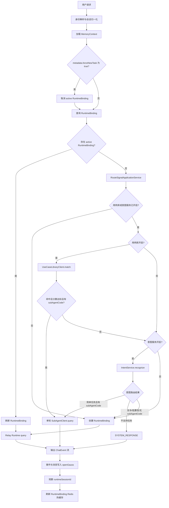
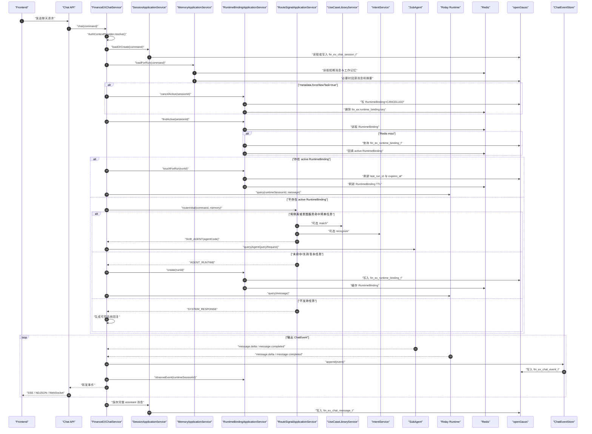
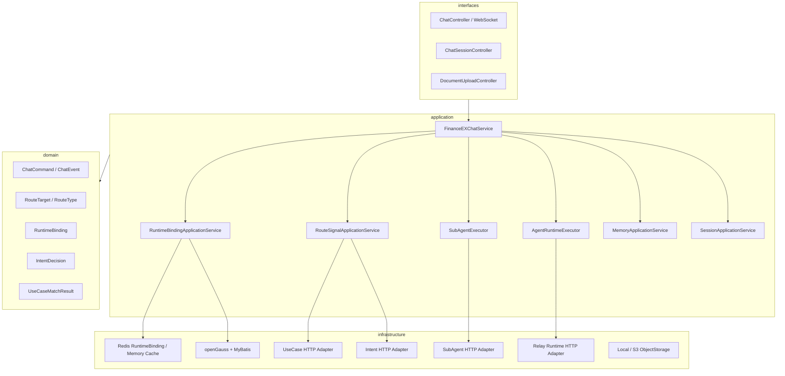

# FinanceEXChatService 正式版架构设计

## 架构目标

FinanceEXChatService 是前端聊天入口和 SuperAgent 主控服务。正式版只保留清晰的执行边界：

- 简单任务：用例库或意图服务命中后，按 `agentCode` 单轮调用一个 SubAgent。
- 复杂任务：进入 Relay Runtime，并由 Relay Runtime 负责多轮、规划、上下文和压缩。
- SuperAgent：负责身份、会话、上下文装配、路由、事件落库和 RuntimeBinding 续接。

## 全局流程图



## 全局顺序图



## 分层架构



## 路由规则

- active RuntimeBinding 优先级最高；存在时本轮直接续接 Relay Runtime。
- 用例库和意图服务是可选路由信号，默认关闭；关闭时不调用外部 API。
- 用例库开启时优先匹配；命中阈值默认 `0.85`，命中并返回 `subAgentCode` 后单轮调用 SubAgent。
- 用例库关闭或未命中后，只有意图服务开启才调用 `IntentService`。
- 意图服务返回简单任务、高置信且有 `candidateSubAgentCode` 时单轮调用 SubAgent。
- 两个信号均关闭、服务失败、复杂、低置信或缺少 SubAgent 的任务进入 Relay Runtime。
- SubAgent 没有续接机制；如果用户下一轮继续提问，除非已经进入 Relay Runtime，否则重新走路由信号。

## RuntimeBinding

RuntimeBinding 只维护前端 chat session 与 Relay Runtime session 的关系。

```text
Redis key:
fin_ex:runtime_binding:{tenantId}:{userId}:{sessionId}

openGauss table:
fin_ex_runtime_binding_t
```

字段包括：

```text
id
tenant_id
user_id
chat_session_id
provider
runtime_session_id
status
last_run_id
expires_at
metadata_json
created_at
updated_at
```

## 外部 API 接入

- 用例库服务：`financeex.use-case-library.enabled`、`financeex.use-case-library.base-url`、`financeex.use-case-library.match-path`
- 意图服务：`financeex.intent.enabled`、`financeex.intent.base-url`、`financeex.intent.recognize-path`
- SubAgent：`financeex.sub-agent.agents.{agentCode}.endpoint`
- Relay Runtime：`financeex.agent-runtime.base-url`、`financeex.agent-runtime.stream-path`

SubAgent 当前只支持单轮 HTTP 文本流调用。Relay Runtime 是唯一 Runtime 实现，项目内不再包含其他进程内 Runtime 实现。

## 命名规范

所有表名必须匹配：

```text
^fin_ex_.*_t$
```

当前表：

- `fin_ex_chat_session_t`
- `fin_ex_chat_message_t`
- `fin_ex_chat_event_t`
- `fin_ex_conversation_summary_t`
- `fin_ex_uploaded_document_t`
- `fin_ex_runtime_binding_t`

Redis key 必须以 `fin_ex` 开头：

- `fin_ex:runtime_binding:{tenantId}:{userId}:{sessionId}`
- `fin_ex:memory:short_term:messages:{tenantId}:{userId}:{sessionId}`
- `fin_ex:memory:working:variables:{sessionId}`
