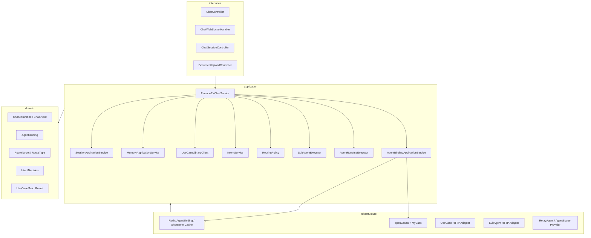

# FinanceEXChatService v2 系统架构设计

## 架构目标

FinanceEXChatService 是前端聊天入口和 SuperAgent 主控服务。v2 的核心变化是删除旧的直接调用体系，把简单任务路由到第三方 SubAgent，把复杂任务路由到统一 AgentRuntime。

```text
用户请求
 -> 会话和身份解析
 -> MemoryContext 装配
 -> AgentBinding 查询
    -> active binding：续接 SubAgent 或 AgentRuntime
    -> 无 binding：用例库 match
        -> 命中 SubAgent：SubAgentClient.query
        -> 未命中：IntentService
            -> 简单任务 + subAgentCode：SubAgentClient.query
            -> 复杂/不确定：AgentRuntime.query
```

## 分层架构



## 路由规则

- active `AgentBinding` 优先级最高，避免多轮任务被重新分类打断。
- 用例库命中阈值默认 `0.85`，命中并返回 `subAgentCode` 后直接调用 SubAgent。
- 用例库未命中才调用 `IntentService`。
- `IntentService` 返回简单任务且有 `candidateSubAgentCode` 时调用 SubAgent。
- 复杂、低置信、缺少 SubAgent 的任务进入 AgentRuntime。
- 不支持任务走 `SYSTEM_RESPONSE`，返回可控说明。
- 前端可通过 `metadata.forceNewTask=true` 取消当前 binding 并重新路由。

## AgentBinding

`AgentBinding` 维护前端 chat session 与下游 SubAgent/AgentRuntime session 的关系。Redis 是热缓存，openGauss 是事实源。

```text
Redis key:
fin_ex:agent_binding:{tenantId}:{userId}:{sessionId}

openGauss table:
fin_ex_agent_binding_t
```

字段包括：

```text
id
tenant_id
user_id
chat_session_id
binding_type
agent_code
provider
agent_session_id
runtime_session_id
status
last_run_id
expires_at
metadata_json
created_at
updated_at
```

状态包括 `ACTIVE`、`REQUIRES_USER_INPUT`、`COMPLETED`、`FAILED`、`CANCELLED`、`EXPIRED`。只有 `ACTIVE` 和 `REQUIRES_USER_INPUT` 会继续续接。

## AgentRuntime

`AgentRuntime` 只强制实现统一 `query(request)` 接口。不同 provider 通过防腐层适配：

- `relay-agent`：转发到远程完整 Agent 服务。
- `agentscope`：进程内 AgentScope 实现。
- `spring-ai`、`langchain`：保留枚举和扩展方向。

AgentRuntime 自己负责内部 session、上下文管理、压缩和规划。SuperAgent 只保存最小可见消息、摘要和 binding。

## 命名规范

所有表名必须匹配：

```text
^fin_ex_.*_t$
```

当前表：

- `fin_ex_chat_session_t`
- `fin_ex_chat_message_t`
- `fin_ex_chat_event_t`
- `fin_ex_conversation_summary_t`
- `fin_ex_uploaded_document_t`
- `fin_ex_agent_binding_t`

Redis key 必须以 `fin_ex` 开头：

- `fin_ex:agent_binding:{tenantId}:{userId}:{sessionId}`
- `fin_ex:memory:short_term:messages:{tenantId}:{userId}:{sessionId}`
- `fin_ex:memory:working:variables:{sessionId}`
