# FinanceEXChatService 系统架构设计

本文档描述调整后的目标架构：Java 服务负责前端协议、会话、消息、意图识别、轻量路由、工具和上下文管理；简单任务可以直接工具调用或直接模型响应；其他不确定、需要规划或需要多轮交互的任务进入统一 `AgentRuntime` 处理。`AgentRuntime` 的具体实现由配置选择，可以是 RelayAgent、AgentScope、Spring AI、LangChain 等。

> 当前代码已收敛到“简单任务直达 + 非 fast path 统一 AgentRuntime”的主链路；后续可以继续补齐生产级会话持久化、RuntimeSessionBinding 和真实 DirectModel 网关。

## 架构目标

- 面向前端提供统一聊天接入协议，支持 SSE、HTTP NDJSON Stream 和 WebSocket。
- Java 服务负责前端会话、用户可见消息、执行事件、权限、工具网关和 Agent 会话绑定。
- 保留 `IntentService` 作为稳定的意图识别服务；它可以由第三方服务或本地实现提供。
- `IntentService` 输出结构化意图信号，但不承担完整 Agent ReAct、复杂槽位追问或多步骤规划。
- `RoutingPolicy` 消费意图识别结果，只判断是否可以安全进入 fast path，或者进入 `AgentRuntime`。
- 简单高置信任务优先走 `DIRECT_TOOL` 或 `DIRECT_MODEL`，避免无意义进入 Agent。
- 复杂、不确定、低置信、需要规划或需要多轮交互的任务统一进入 `AgentRuntime`，具体实现由配置选择。
- RelayAgent、AgentScope、Spring AI、LangChain 是同级 runtime provider，没有默认业务身份差异。
- Java 服务保留最小上下文事实源，用于前端历史、审计、简单多轮、首次 handoff 给外部 Agent。
- 工具调用统一经过 Java 服务的 `ToolGatewayApplicationService`，集中完成最终鉴权、确认、参数校验、实现选择和审计。
- 短期消息支持 Redis 热缓存和 PostgreSQL 事实源，长期记忆预留外部服务扩展点。

## 核心结论

调整后的核心模型是：

```text
用户请求
 -> 会话和身份解析
 -> 上下文装配
 -> IntentService 意图识别
 -> RoutingPolicy 轻量路由裁决
    -> DIRECT_TOOL        -> DirectTaskExecutor -> ToolGateway
    -> DIRECT_MODEL       -> DirectModelResponder / ModelGateway
    -> AGENT_RUNTIME      -> AgentRuntimeExecutor -> Configured AgentRuntime Provider
```

缺槽位、确认、拒绝等交互不作为前置路由的核心职责。只有在高置信 `DIRECT_TOOL` fast path 中，`IntentService` 和 `RoutingPolicy` 可以做轻量参数完整性判断；复杂缺槽、追问、工具探索和拒绝解释交给 `AgentRuntime` 的 ReAct/规划过程处理。最终鉴权和工具参数校验始终由 `ToolGatewayApplicationService` 强制执行。

`AgentRuntime` 是复杂任务的统一执行抽象，provider 通过配置决定：

```text
relay-agent：远程完整 Agent 服务
agentscope：进程内 AgentScope 实现
spring-ai：Spring AI 实现
langchain：LangChain/LangGraph 下游实现
```

## 统一 AgentRuntime 抽象

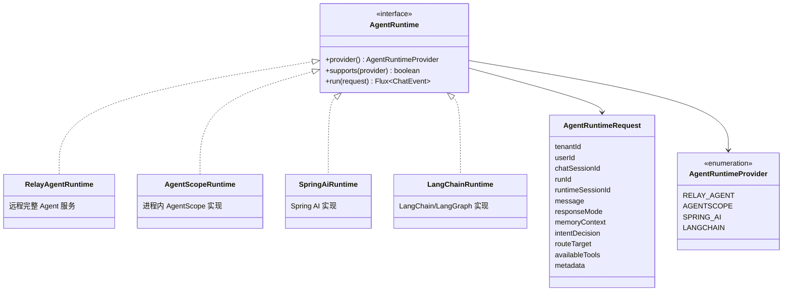

## 系统上下文

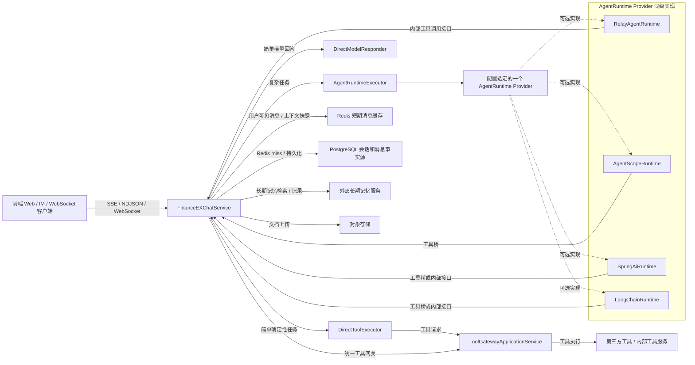

## 分层架构

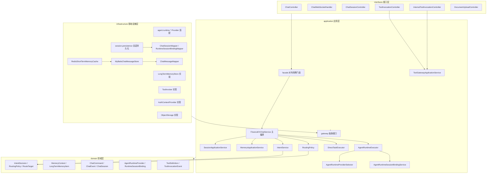

## 包职责

| 包 | 职责 |
| --- | --- |
| `interfaces` | HTTP、SSE、WebSocket、内部工具接口和 DTO 翻译 |
| `application.facade` | 前端或外部调用看到的应用门面 |
| `application.service` | 会话、记忆、意图识别编排、路由裁决、直达任务、AgentRuntime、工具调用编排 |
| `application.gateway` | 应用层依赖的外部能力抽象，目标包含统一 `AgentRuntime` |
| `domain` | 聊天、会话、记忆、意图结果、路由决策、runtime provider、工具等核心模型和策略 |
| `infrastructure.agent.runtime.*` | AgentRuntime 的具体 provider 适配，例如 relay、agentscope、springai、langchain |
| `infrastructure.session.persistence` | ChatSession、RuntimeSessionBinding 的 PostgreSQL / MyBatis 持久化适配 |
| `infrastructure.memory` | 短期消息、长期记忆、摘要和工作变量实现 |
| `infrastructure.tool` | 工具目录、工具调用和审计实现 |
| `infrastructure.security` | 用户身份和租户解析实现 |
| `infrastructure.storage` | 文档对象存储和文档元数据实现 |

## 前端聊天请求流程

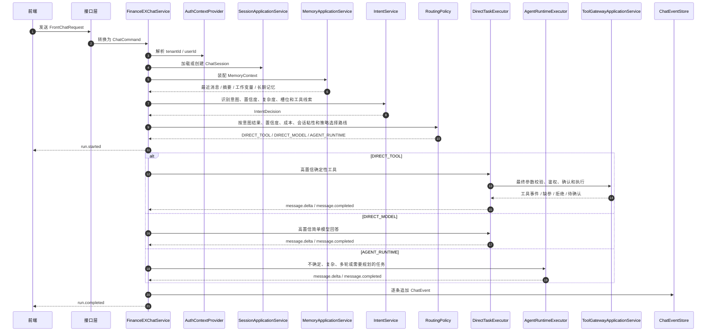

## 意图识别和路由决策模型

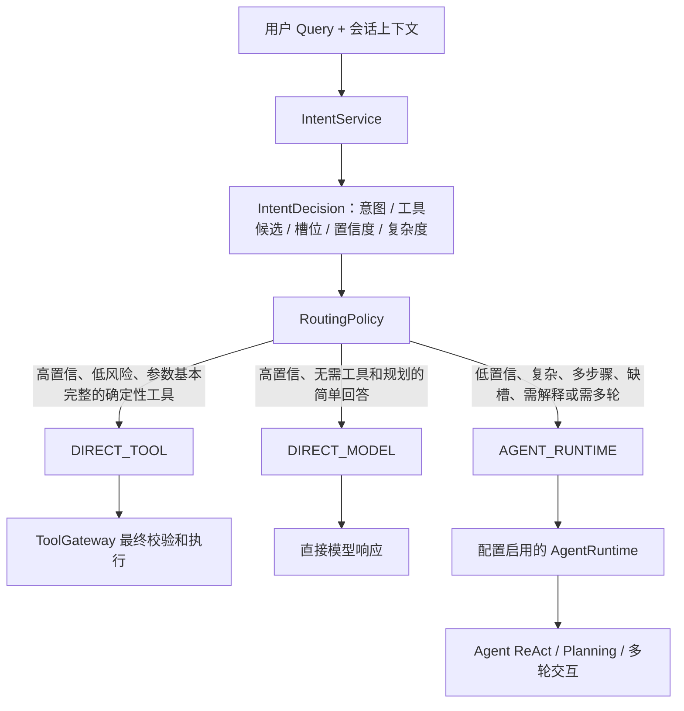

路由原则：

- `IntentService` 是稳定存在的意图服务，可以是第三方服务，也可以是本地实现。
- `IntentService` 输出结构化 `IntentDecision`，包括意图、复杂度、置信度、槽位、候选工具和原始识别结果。
- `IntentService` 不负责复杂任务拆解、多轮槽位收集、动态工具探索和拒绝解释。
- `RoutingPolicy` 只做路线裁决，判断是否可以进入 fast path，或者进入 `AgentRuntime`。
- 高置信、低风险、参数基本完整的确定性任务走 `DIRECT_TOOL`。
- 高置信、无需工具和规划的简单自然语言回答走 `DIRECT_MODEL`。
- 不确定、缺槽复杂、需要多步骤、需要解释、需要 Agent 状态的任务走 `AGENT_RUNTIME`。
- `AGENT_RUNTIME` 只表示“进入 Agent”，不表示使用哪个具体实现。
- 具体 Agent provider 由配置决定，而不是由简单/复杂路由决定。
- 鉴权、确认和工具参数校验的最终强制点是 `ToolGatewayApplicationService`。
- 如果 AgentRuntime 调用工具时遇到 `MISSING_ARGUMENTS`、`FORBIDDEN`、`NEED_CONFIRMATION`，这些结果作为 observation 交回 Agent，由 Agent 继续追问、解释、确认或停止。

`IntentDecision` 建议保留可解释的识别信号：

```text
IntentDecision
- intentCode
- intentName
- complexity
- confidence
- candidateToolName
- slots
- riskHint
- raw
- reason
```

`RoutingPolicy` 的输出保持克制：

```text
RouteTarget
- target: DIRECT_TOOL / DIRECT_MODEL / AGENT_RUNTIME
- reason
- confidence
- selectedToolName
- metadata
```

外部意图服务、本地语义模型或 embedding 匹配都可以作为 `IntentService` 的实现。只要意图结果不够确定，就进入 `AGENT_RUNTIME`，由具体 Agent provider 负责 ReAct、槽位追问和复杂工具规划。

## AgentRuntime Provider 选择

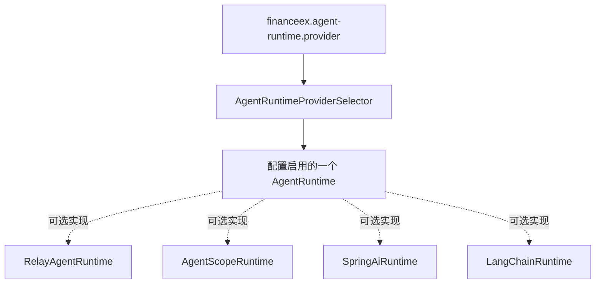

配置决定当前服务启动时启用哪个 AgentRuntime provider。例如：

```yaml
financeex:
  agent-runtime:
    provider: relay-agent
```

可选值可以规划为：

```text
relay-agent
agentscope
spring-ai
langchain
```

## AgentRuntime 执行流程

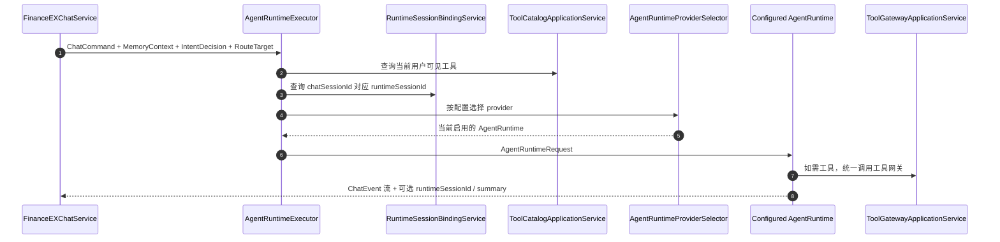

## AgentRuntime 会话绑定设计

某些 AgentRuntime 是完整 Agent 系统，会拥有自己的内部会话、记忆和规划状态。例如 RelayAgent、远程 LangGraph 服务等。Java 服务需要维护两层会话：

```text
ChatSession：Java 服务的前端会话
RuntimeSession：某个 AgentRuntime 自己的内部会话
```

绑定关系建议建模为：

```text
RuntimeSessionBinding
- tenantId
- userId
- chatSessionId
- provider
- runtimeSessionId
- status
- createdAt
- updatedAt
- lastRunId
- lastSummary
```

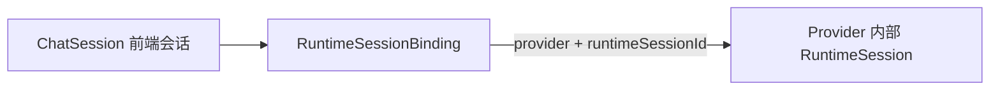

对于进程内、无独立会话的 provider，可以直接复用 `chatSessionId`，或者不生成 `runtimeSessionId`。对于远程完整 Agent provider，必须保存下游返回的 `runtimeSessionId`。

## 会话持久化边界

会话管理由 application 层编排，持久化实现放在 infrastructure 层。这样既能保证业务服务不直接依赖 PostgreSQL / MyBatis，也能让会话存储从第一版的内存实现平滑迁移到生产存储。

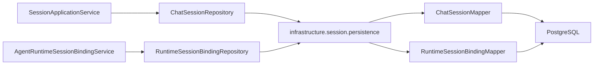

推荐的 infra 包结构：

```text
infrastructure.session.persistence
├── PostgresChatSessionRepository
├── PostgresRuntimeSessionBindingRepository
├── ChatSessionMapper
└── RuntimeSessionBindingMapper
```

其中 `SessionApplicationService` 只处理 Java 前端会话生命周期，`AgentRuntimeSessionBindingService` 只处理 `chatSessionId` 与 provider 内部 `runtimeSessionId` 的绑定关系。

### 首次进入某个外部 AgentRuntime

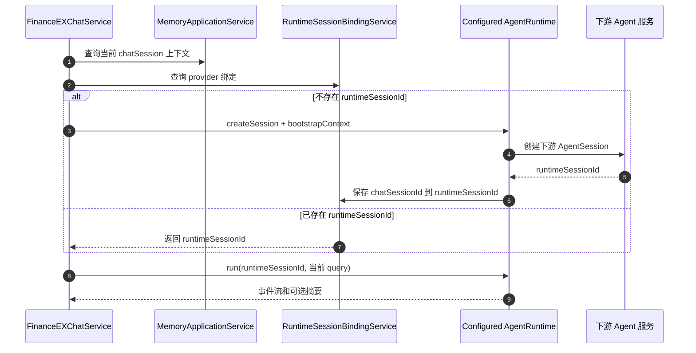

首次 handoff 给外部 AgentRuntime 时，Java 服务应该传入：

```text
tenantId
userId
chatSessionId
runId
当前 query
最近 N 条用户可见消息
会话摘要
工作变量
长期记忆召回结果
附件
可用工具列表
```

后续同一 `chatSessionId` 再进入同一个 provider 时，只需要传：

```text
tenantId
userId
chatSessionId
runtimeSessionId
runId
当前 query
必要的增量上下文
```

## 会话粘性路由

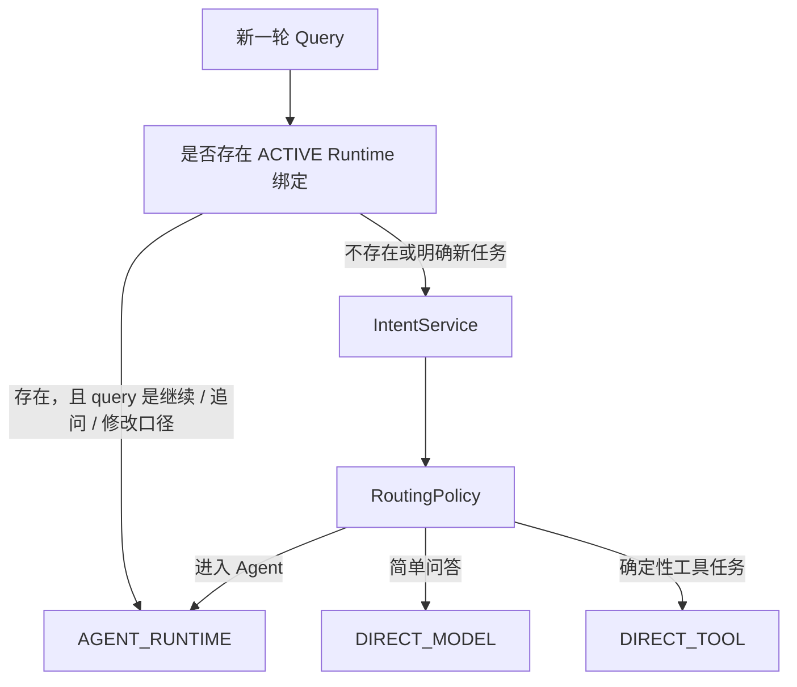

会话粘性的原因是：用户在复杂任务中说“继续”“再详细一点”“换个口径”时，下游 AgentRuntime 的内部记忆和计划状态通常比 Java 服务更完整。

## 记忆和上下文边界

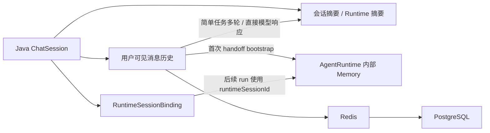

分工原则：

- Java 服务不是完整 Agent 记忆系统，但必须保存前端用户可见消息和必要摘要。
- 简单任务需要的上下文来自 Java 服务自己的消息历史和摘要。
- 复杂任务进入 AgentRuntime 后，runtime provider 可以维护自己的内部记忆。
- AgentRuntime 每次用户可见回复结束后，建议回传摘要或状态更新，Java 服务保存到 `RuntimeSessionBinding` 或会话摘要中。

## 短期消息读写流程

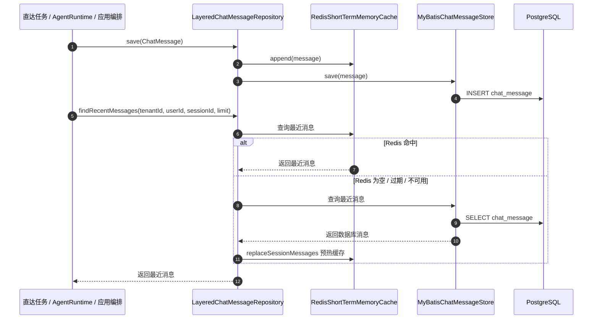

## 工具调用边界

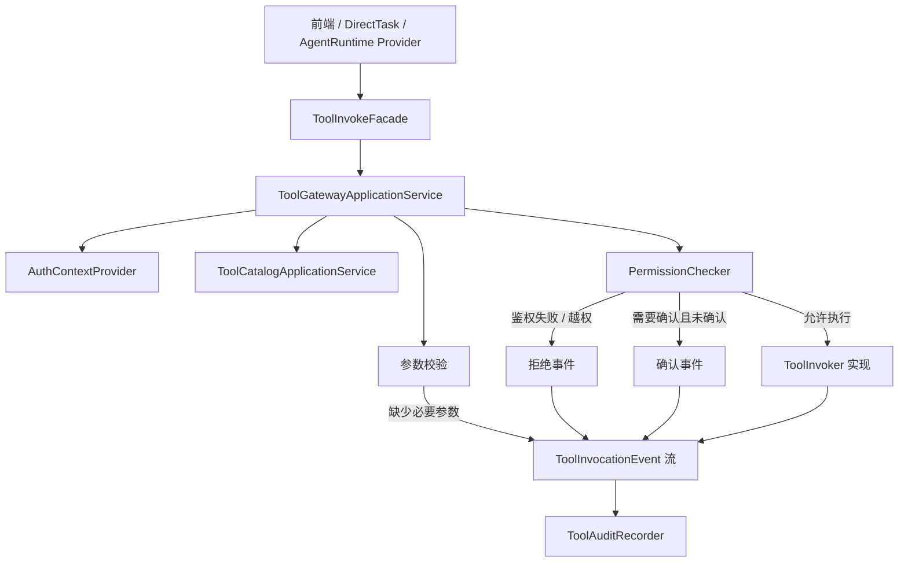

工具调用规则：

- 所有工具调用必须进入 `ToolGatewayApplicationService`。
- 直达工具调用、本地 Agent provider、远程 Agent provider 都使用同一个工具网关。
- 缺少必要参数、鉴权失败、越权、需要确认都作为工具事件返回，而不是由前置路由层硬编码兜底。
- 高风险或需要确认的工具先返回 `ToolConfirmationRequiredEvent`。
- AgentRuntime 收到工具事件后，将其作为 ReAct observation，用自然语言继续追问、解释或停止。
- 审计跟随工具事件流记录，便于还原执行过程。

## 数据存储状态

| 数据 | 当前实现 | 目标说明 |
| --- | --- | --- |
| 聊天消息 / 短期上下文 | Redis + PostgreSQL + MyBatis | Java 服务保留前端可见上下文事实源 |
| 会话元数据 | `InMemorySessionRepository` | 后续迁移到 PostgreSQL |
| 运行事件 | `InMemoryChatEventStore` | 后续迁移到 PostgreSQL 或事件日志 |
| Runtime 会话绑定 | 待新增 | 保存 `chatSessionId -> provider/runtimeSessionId` |
| 会话摘要 | `InMemorySummaryRepository` | 后续保存 Java 摘要和 AgentRuntime 摘要 |
| 工作变量 | `InMemoryWorkingMemoryStore` | 可迁移到 Redis 或 PostgreSQL |
| 长期记忆 | `MockExternalLongTermMemoryStore` | 外部长期记忆服务占位 |

## 部署依赖

| 依赖 | 当前配置 |
| --- | --- |
| JDK | Java 21 编译目标 |
| Web 框架 | Spring Boot WebFlux |
| AgentRuntime Provider | RelayAgent / AgentScope / Spring AI / LangChain 等 |
| 数据库 | PostgreSQL，默认 `jdbc:postgresql://localhost:5432/financeex` |
| ORM | MyBatis Spring Boot Starter |
| 缓存 | Redis，默认 `localhost:6379` |
| 模型网关 | OpenAI 兼容接口，默认 `http://localhost:8000/v1` |

## 关键配置方向

```yaml
financeex:
  agent-runtime:
    provider: relay-agent
    providers:
      relay-agent:
        enabled: true
        base-url: http://localhost:9000
      agentscope:
        enabled: false
        base-url: http://localhost:8000/v1
        model-name: finance-llm
      spring-ai:
        enabled: false
      langchain:
        enabled: false
  intent:
    provider: mock
    fast-path:
      direct-tool-enabled: true
      direct-model-enabled: true
      min-confidence: 0.85
  memory:
    short-term:
      redis:
        ttl: 3d
        max-cached-messages: 200
```

AgentRuntime 配置统一使用 `financeex.agent-runtime` 命名空间。

## 重构落地步骤建议

1. 补齐 `RuntimeSessionBinding` 的 PostgreSQL / MyBatis 持久化。
2. 首次进入外部完整 AgentRuntime 时执行 handoff，传入上下文快照并保存 `runtimeSessionId`。
3. AgentRuntime run 结束时回传用户可见结果和摘要，Java 服务保存到消息、事件和绑定摘要。
4. 将 `DIRECT_MODEL` 从当前 mock 响应升级为真实模型网关。
5. 预留 `SpringAiRuntime`、`LangChainRuntime` 的 provider 扩展点。
