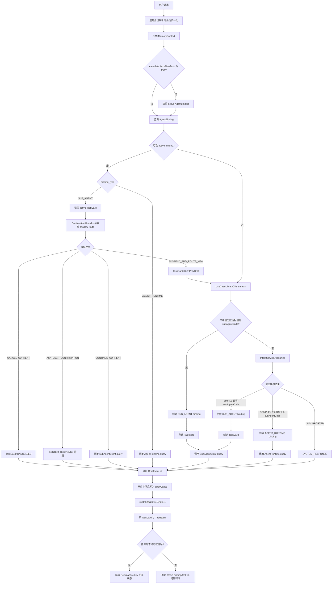
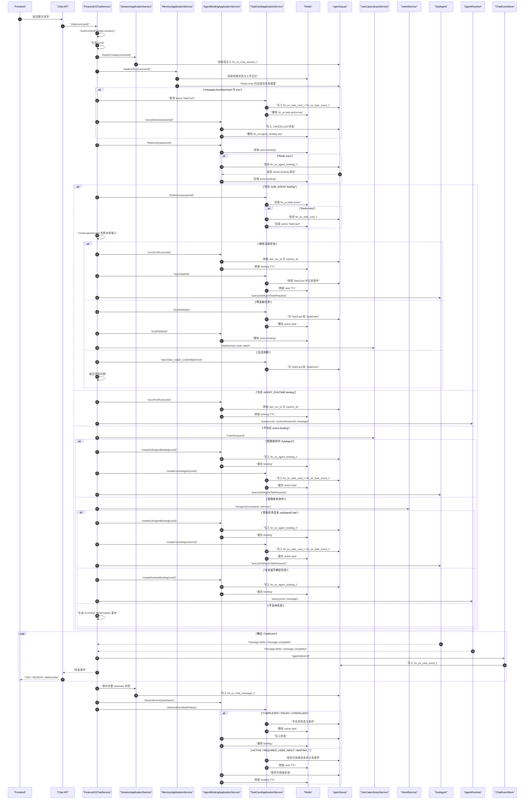
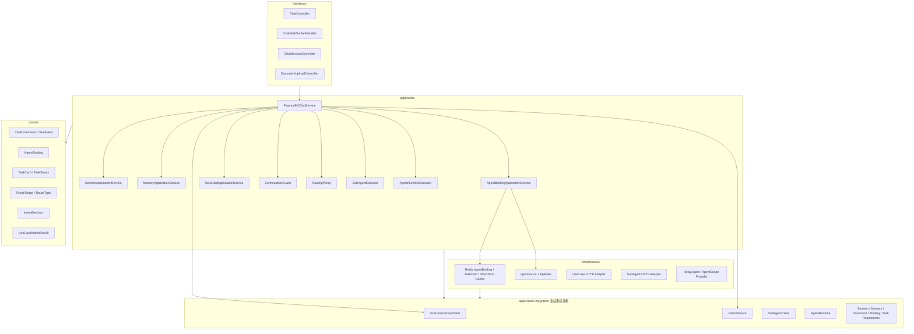

# FinanceEXChatService v2 系统架构设计

## 架构目标

FinanceEXChatService 是前端聊天入口和 SuperAgent 主控服务。v2 的核心变化是删除旧的直接调用体系，把简单任务路由到第三方 SubAgent，把复杂任务路由到统一 AgentRuntime。

```text
用户请求
 -> 应用身份解析和会话归一化
 -> MemoryContext 装配
 -> AgentBinding + TaskCard 查询
    -> active AgentRuntime binding：续接 AgentRuntime
    -> active SubAgent task：ContinuationGuard 判断续接/挂起/取消/澄清
    -> 无 binding：用例库 match
        -> 命中 SubAgent：创建 TaskCard + AgentBinding 后 SubAgentClient.query
        -> 未命中：IntentService
            -> 简单任务 + subAgentCode：创建 TaskCard + AgentBinding 后 SubAgentClient.query
            -> 复杂/不确定：AgentRuntime.query
```

## 全局流程图



## 全局顺序图



## 分层架构



`application.integration` 是 application 层的出站集成抽象，用来表达应用服务依赖外部能力的边界；它不是具体基础设施实现。Redis、openGauss/MyBatis、HTTP 客户端、对象存储和 AgentRuntime provider 的落地代码仍归属 `infrastructure`。

## 路由规则

- active `AgentBinding` 只是未完成任务索引；SubAgent binding 必须先读取 `TaskCard` 并经过 `ContinuationGuard`。
- `ContinuationGuard` 只在用户补参数、确认上一轮问题、解释当前任务或上传当前任务附件时续接原 SubAgent。
- 用户明显切换任务时，当前 `TaskCard` 置为 `SUSPENDED`，本轮重新走用例库/意图路由。
- 判断不清时先做 shadow route；仍无法确认时进入 `WAITING_USER_CONFIRMATION`，向用户澄清。
- 用例库命中阈值默认 `0.85`，命中并返回 `subAgentCode` 后直接调用 SubAgent。
- 用例库未命中才调用 `IntentService`。
- `IntentService` 返回简单任务且有 `candidateSubAgentCode` 时调用 SubAgent。
- 复杂、低置信、缺少 SubAgent 的任务进入 AgentRuntime。
- 不支持任务走 `SYSTEM_RESPONSE`，返回可控说明。
- 前端可通过 `metadata.forceNewTask=true` 取消当前 TaskCard 和 binding 并重新路由。

## 会话与执行标识

v2 同时保留多种 ID，它们的职责不同：

```text
sessionId         前端聊天会话，一段持续对话
runId             SuperAgent 单轮执行追踪 ID
taskId            SuperAgent 侧可续接业务任务 ID
agentSessionId    SubAgent 内部会话 ID
runtimeSessionId  AgentRuntime 内部会话 ID
```

`runId` 在每轮用户请求进入 `FinanceEXChatService` 时生成，贯穿该轮的所有 ChatEvent。它用于：

- 前端把同一轮 SSE/NDJSON/WebSocket 事件聚合成一次响应。
- `fin_ex_chat_event_t.run_id` 按运行轮次回查事件轨迹。
- `fin_ex_agent_binding_t.last_run_id` 记录最近触发该 binding 的运行轮次。
- 传给 SubAgent/AgentRuntime，方便跨服务日志关联。

`runId` 不参与多轮保持决策。SubAgent 多轮保持由 `TaskCard.taskStatus`、`requiredInputs`、`AgentBinding.status` 和 `agentSessionId` 共同决定；AgentRuntime 多轮保持由 `AgentBinding.status` 和 `runtimeSessionId` 决定。

## AgentBinding

`AgentBinding` 维护前端 chat session 与下游 SubAgent/AgentRuntime session 的关系。Redis 是热缓存，openGauss 是事实源。

```text
Redis key:
fin_ex:agent_binding:{tenantId}:{userId}:{sessionId}

openGauss table:
fin_ex_agent_binding_t
```

字段包括：

```text
id
tenant_id
user_id
chat_session_id
binding_type
agent_code
provider
agent_session_id
runtime_session_id
status
last_run_id
expires_at
metadata_json
created_at
updated_at
```

状态包括 `ACTIVE`、`REQUIRES_USER_INPUT`、`WAITING_EXTERNAL_SYSTEM`、`WAITING_USER_CONFIRMATION`、`SUSPENDED`、`COMPLETED`、`FAILED`、`CANCELLED`、`EXPIRED`、`UNKNOWN`。只有 `ACTIVE`、`REQUIRES_USER_INPUT`、`WAITING_EXTERNAL_SYSTEM`、`WAITING_USER_CONFIRMATION` 会进入 active 查询；`SUSPENDED` 保留事实但不作为当前路由。

## TaskCard

`TaskCard` 是简单 SubAgent 任务状态事实。它记录任务目标、任务领域、当前 SubAgent、下游 `agentSessionId`、任务状态、待补充参数、已收集参数、最近一次 Agent 回复和澄清问题。

```text
Redis key:
fin_ex:task:active:{tenantId}:{userId}:{sessionId}
fin_ex:task:card:{tenantId}:{userId}:{sessionId}:{taskId}

openGauss tables:
fin_ex_task_card_t
fin_ex_task_event_t
```

状态模型：

- 可续接：`ACTIVE`、`REQUIRES_USER_INPUT`、`WAITING_EXTERNAL_SYSTEM`、`WAITING_USER_CONFIRMATION`
- 可恢复但非当前活跃：`SUSPENDED`
- 终态：`COMPLETED`、`FAILED`、`CANCELLED`、`EXPIRED`
- 内部诊断：`UNKNOWN`

`UNKNOWN` 不直接面向用户。SubAgent 响应无法判断时，`rawNormalizedStatus=UNKNOWN`，对外任务状态统一转为 `WAITING_USER_CONFIRMATION`。

## SubAgent 契约

员工报销 SubAgent 固定编码为 `employee_reimbursement_agent`，默认配置：

```yaml
financeex.sub-agent.agents.employee_reimbursement_agent.interaction-mode: natural-language-contract
financeex.sub-agent.agents.employee_reimbursement_agent.endpoint: ${FINANCEEX_EMPLOYEE_REIMBURSEMENT_AGENT_ENDPOINT:}
```

`SubAgentTaskPromptBuilder` 会基于 `TaskCard`、用户本轮 query、附件和上下文生成增强任务 Prompt，要求自然语言 Agent 只处理当前任务并返回 JSON。`SubAgentResponseNormalizer` 会按以下顺序兜底：

- 直接解析 JSON。
- 提取 markdown JSON code block。
- 执行字段别名映射：`reply/message/content`、`status/taskStatus`、`sessionId/agentSessionId`。
- 对普通文本做状态推断，例如“请上传/请提供”映射为 `REQUIRES_USER_INPUT`，“已完成/提交成功”映射为 `COMPLETED`，“处理中/请稍后”映射为 `WAITING_EXTERNAL_SYSTEM`。
- 无法判断时进入 `WAITING_USER_CONFIRMATION`，由 SuperAgent 询问用户继续当前报销任务还是开始新任务。

## AgentRuntime

`AgentRuntime` 只强制实现统一 `query(request)` 接口。不同 provider 通过防腐层适配：

- `relay-agent`：转发到远程完整 Agent 服务。
- `agentscope`：进程内 AgentScope 实现。
- `spring-ai`、`langchain`：保留枚举和扩展方向。

AgentRuntime 自己负责内部 session、上下文管理、压缩和规划。SuperAgent 只保存最小可见消息、摘要和 binding。

## 命名规范

所有表名必须匹配：

```text
^fin_ex_.*_t$
```

当前表：

- `fin_ex_chat_session_t`
- `fin_ex_chat_message_t`
- `fin_ex_chat_event_t`
- `fin_ex_conversation_summary_t`
- `fin_ex_uploaded_document_t`
- `fin_ex_agent_binding_t`
- `fin_ex_task_card_t`
- `fin_ex_task_event_t`

Redis key 必须以 `fin_ex` 开头：

- `fin_ex:agent_binding:{tenantId}:{userId}:{sessionId}`
- `fin_ex:task:active:{tenantId}:{userId}:{sessionId}`
- `fin_ex:task:card:{tenantId}:{userId}:{sessionId}:{taskId}`
- `fin_ex:memory:short_term:messages:{tenantId}:{userId}:{sessionId}`
- `fin_ex:memory:working:variables:{sessionId}`
