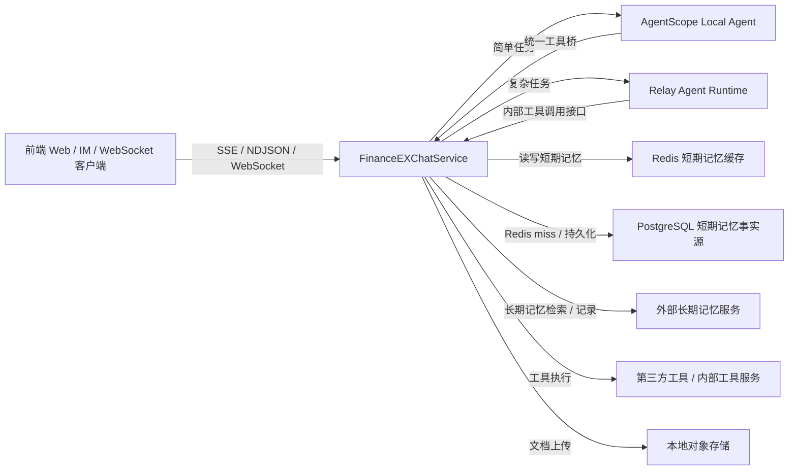
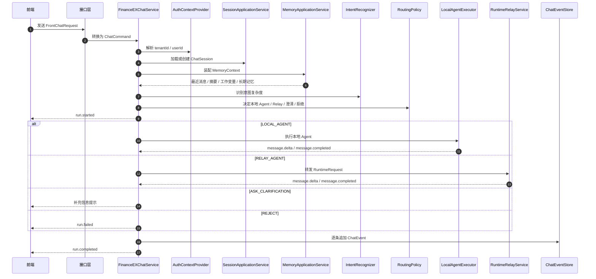
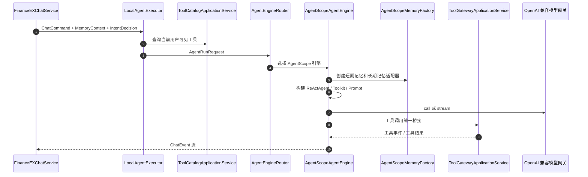
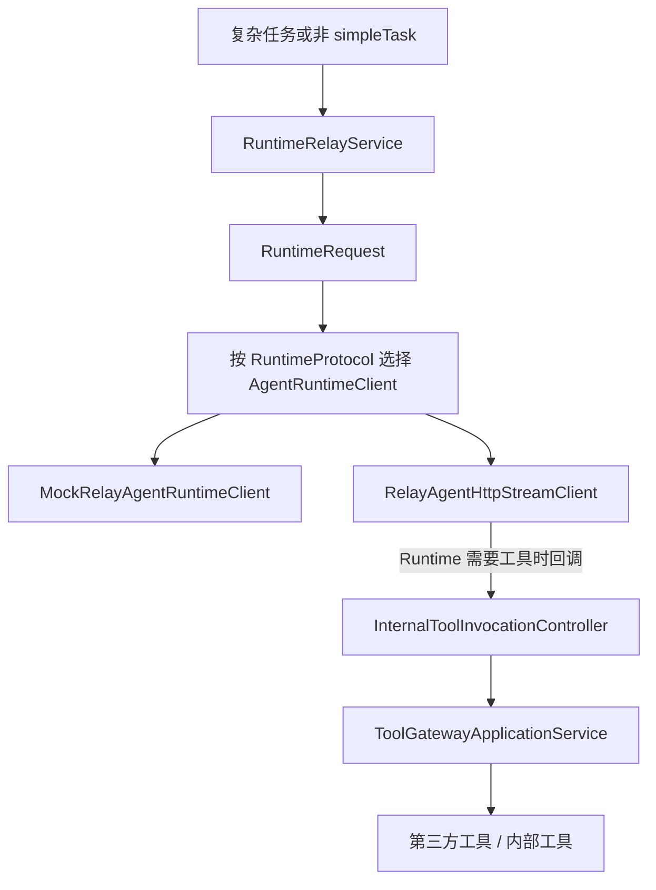
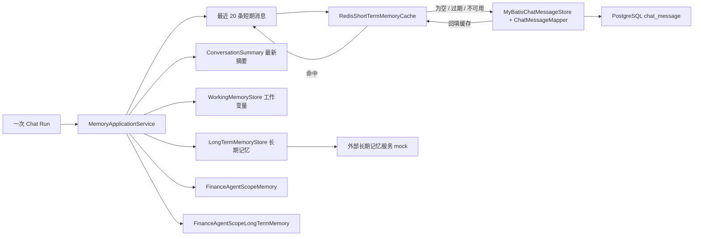
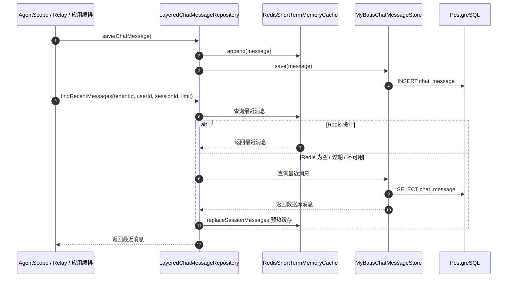
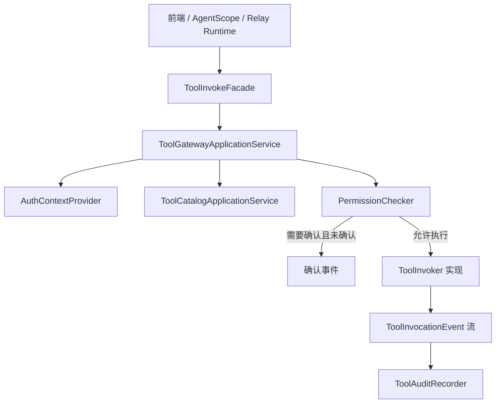
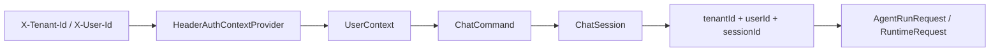

# FinanceEXChatService 系统架构设计

本文档基于当前代码实现整理，描述系统分层、核心链路、记忆体系、Agent 路由和工具调用边界。

## 架构目标

- 面向前端提供统一聊天接入协议，支持 SSE、HTTP NDJSON Stream 和 WebSocket。
- 使用 `tenantId + userId + sessionId` 作为会话和记忆隔离主键。
- application 层只编排业务流程，不直接依赖 AgentScope、Redis、PostgreSQL 或第三方 Runtime。
- AgentScope 作为本地 Agent 引擎实现，Relay Runtime 作为复杂任务外部执行入口。
- 工具调用统一经过应用层网关，集中完成权限、确认、实现选择和审计。
- 短期记忆支持 Redis 热缓存和 PostgreSQL 事实源，长期记忆预留外部服务扩展点。

## 系统上下文



## 分层架构

```mermaid
flowchart TB
    subgraph Interfaces["interfaces 接口层"]
        ChatController["ChatController"]
        ChatWS["ChatWebSocketHandler"]
        SessionController["ChatSessionController"]
        ToolController["ToolInvocationController"]
        InternalToolController["InternalToolInvocationController"]
        DocumentController["DocumentUploadController"]
    end

    subgraph Application["application 应用层"]
        Facade["facade 对外用例门面"]
        ChatService["FinanceEXChatService 主编排"]
        SessionService["SessionApplicationService"]
        MemoryService["MemoryApplicationService"]
        LocalExecutor["LocalAgentExecutor"]
        RuntimeRelay["RuntimeRelayService"]
        ToolGateway["ToolGatewayApplicationService"]
        Gateway["gateway 抽象接口"]
    end

    subgraph Domain["domain 领域层"]
        ChatModel["ChatCommand / ChatEvent / ChatSession"]
        MemoryModel["MemoryContext / LongTermMemoryItem"]
        Routing["RoutingPolicy / RouteTarget"]
        ToolModel["ToolDefinition / ToolInvocationEvent"]
    end

    subgraph Infrastructure["infrastructure 基础设施层"]
        AgentScopeImpl["AgentScopeAgentEngine"]
        RuntimeClient["RelayAgentHttpStreamClient / MockRuntime"]
        RedisMemory["RedisShortTermMemoryCache"]
        MyBatisStore["MyBatisChatMessageStore"]
        PGMapper["ChatMessageMapper"]
        LTM["MockExternalLongTermMemoryStore"]
        ToolInvoker["MockThirdPartyToolInvoker"]
        Security["HeaderAuthContextProvider"]
        Storage["LocalObjectStorage"]
    end

    Interfaces --> Facade
    Facade --> ChatService
    ChatService --> SessionService
    ChatService --> MemoryService
    ChatService --> LocalExecutor
    ChatService --> RuntimeRelay
    ChatService --> Routing
    ToolController --> ToolGateway
    InternalToolController --> ToolGateway
    Application --> Gateway
    Application --> Domain
    Infrastructure --> Gateway
    AgentScopeImpl --> ToolGateway
    RedisMemory --> MyBatisStore
    MyBatisStore --> PGMapper
```



## 包职责

| 包 | 职责 |
| --- | --- |
| `interfaces` | HTTP、SSE、WebSocket、内部工具接口和 DTO 翻译 |
| `application.facade` | 前端或外部调用看到的应用门面 |
| `application.service` | 会话、记忆、路由、Agent、Runtime、工具调用编排 |
| `application.gateway` | 应用层依赖的外部能力抽象 |
| `domain` | 聊天、会话、记忆、路由、工具等核心模型和策略 |
| `infrastructure.agent.agentscope` | AgentScope Java SDK 适配 |
| `infrastructure.memory` | 短期记忆、长期记忆、摘要和工作记忆实现 |
| `infrastructure.runtime` | Relay Runtime HTTP Stream 和 mock 实现 |
| `infrastructure.tool` | 工具目录、工具调用和审计 mock 实现 |
| `infrastructure.security` | 当前 Header 身份解析实现 |
| `infrastructure.storage` | 文档对象存储和文档元数据实现 |

## 前端聊天请求流程



## 本地 Agent 执行流程



## Relay Runtime 流程



## 记忆体系



### 当前存储实现状态

| 数据 | 当前实现 | 说明 |
| --- | --- | --- |
| 聊天消息 / 短期记忆 | Redis + PostgreSQL + MyBatis | Redis 是热缓存，PostgreSQL 是事实源 |
| 会话元数据 | `InMemorySessionRepository` | 当前版本内存实现，后续可替换为 PostgreSQL |
| 运行事件 | `InMemoryChatEventStore` | 当前版本内存实现，后续可替换为 PostgreSQL 或消息日志 |
| 会话摘要 | `InMemorySummaryRepository` | 目前只有摘要读取占位，未实现自动压缩 |
| 工作记忆变量 | `InMemoryWorkingMemoryStore` | 保存轻量运行变量，例如最近一次 runId |
| 长期记忆 | `MockExternalLongTermMemoryStore` | 外部长期记忆服务占位实现，当前不返回假记忆 |

## 短期记忆读写流程



## 工具调用边界



工具调用规则：

- 所有工具调用必须进入 `ToolGatewayApplicationService`。
- AgentScope 通过 `AgentScopeToolBridge` 调用工具。
- Relay Runtime 通过内部接口 `InternalToolInvocationController` 调用工具。
- 高风险或需要确认的工具先返回 `ToolConfirmationRequiredEvent`。
- 审计跟随工具事件流记录，便于还原执行过程。

## 会话隔离设计



当前版本的 userId 来自前端 Header 或 WebSocket query。后续替换为服务端 Session、SSO 或网关 Token 时，只需要替换 `UserIdResolver` / `AuthContextProvider` 实现。

## 部署依赖

| 依赖 | 当前配置 |
| --- | --- |
| JDK | Java 21 编译目标 |
| Web 框架 | Spring Boot WebFlux |
| Agent SDK | AgentScope Java 1.0.9 |
| 数据库 | PostgreSQL，默认 `jdbc:postgresql://localhost:5432/financeex` |
| ORM | MyBatis Spring Boot Starter |
| 缓存 | Redis，默认 `localhost:6379` |
| 模型网关 | OpenAI 兼容接口，默认 `http://localhost:8000/v1` |
| Relay Runtime | 默认 mock，真实 HTTP Stream 由 `financeex.runtime.enabled=true` 开启 |

## 关键配置

```yaml
spring:
  datasource:
    url: ${FINANCEEX_DB_URL:jdbc:postgresql://localhost:5432/financeex}
    username: ${FINANCEEX_DB_USERNAME:financeex}
    password: ${FINANCEEX_DB_PASSWORD:financeex}

financeex:
  memory:
    short-term:
      redis:
        ttl: 3d
        max-cached-messages: 200
    long-term:
      provider: mock-external
  agent:
    engine: AGENTSCOPE
  runtime:
    enabled: false
```

## 后续演进建议

- 将 `ChatSession`、`ChatEvent`、`ConversationSummary` 和 `WorkingMemoryStore` 逐步迁移到 PostgreSQL 或可审计事件存储。
- 接入真实外部长期记忆服务，替换 `MockExternalLongTermMemoryStore`。
- 接入真实工具目录和工具审计表，替换当前 mock / noop 实现。
- 引入数据库迁移工具，例如 Flyway 或 Liquibase，管理 `schema.sql` 的版本演进。
- 如需启用 AgentScope 原生 AutoContext 压缩，可在项目存储边界外再增加压缩事件和 offload 存储。
