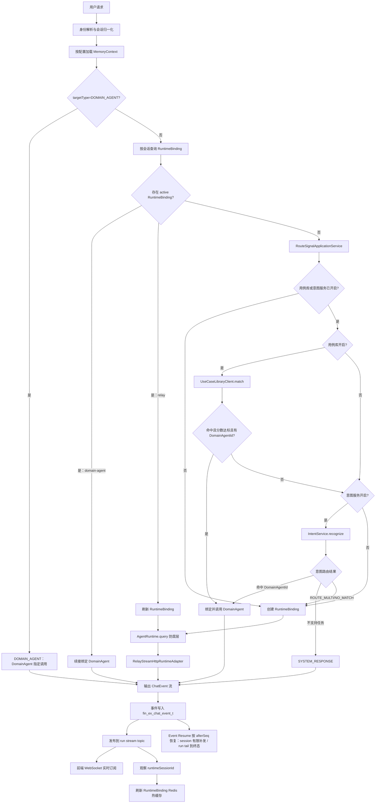
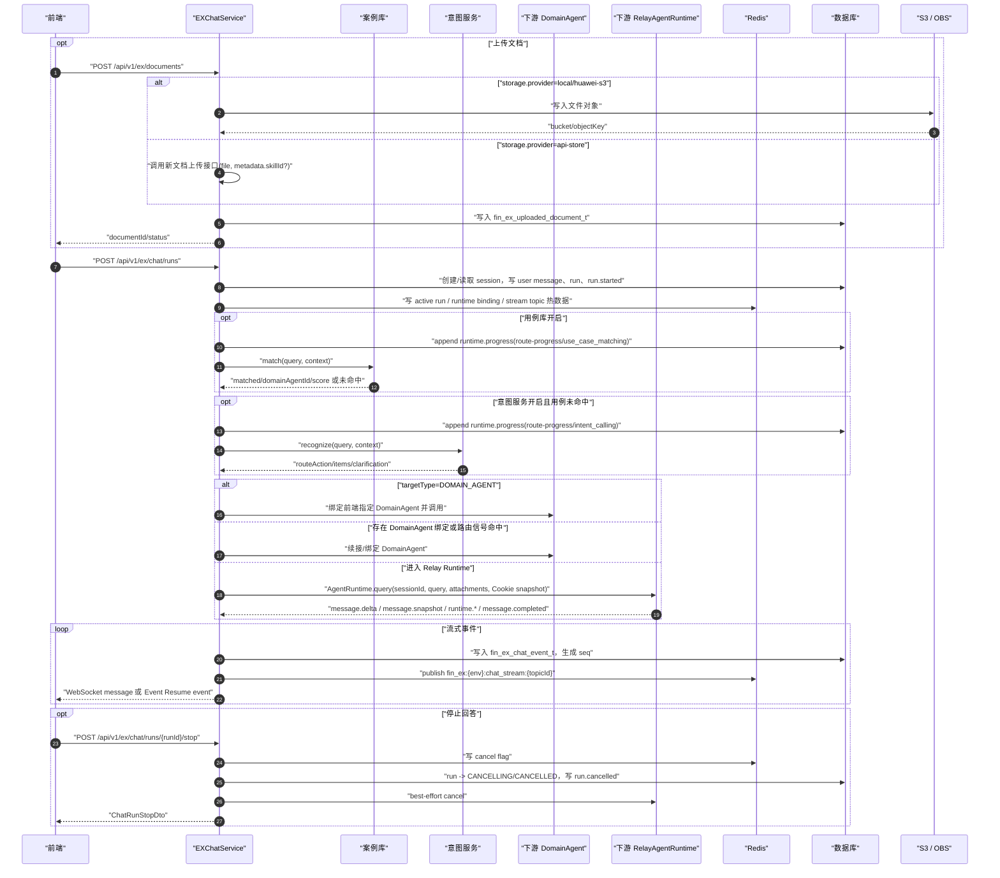
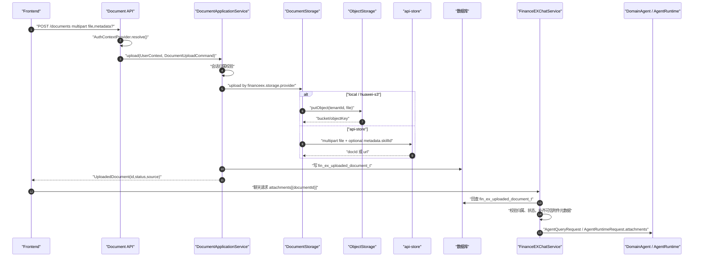
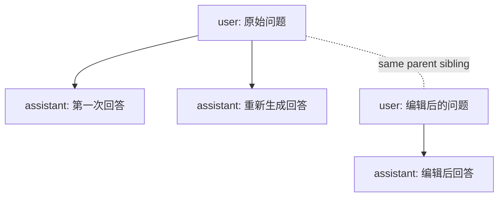
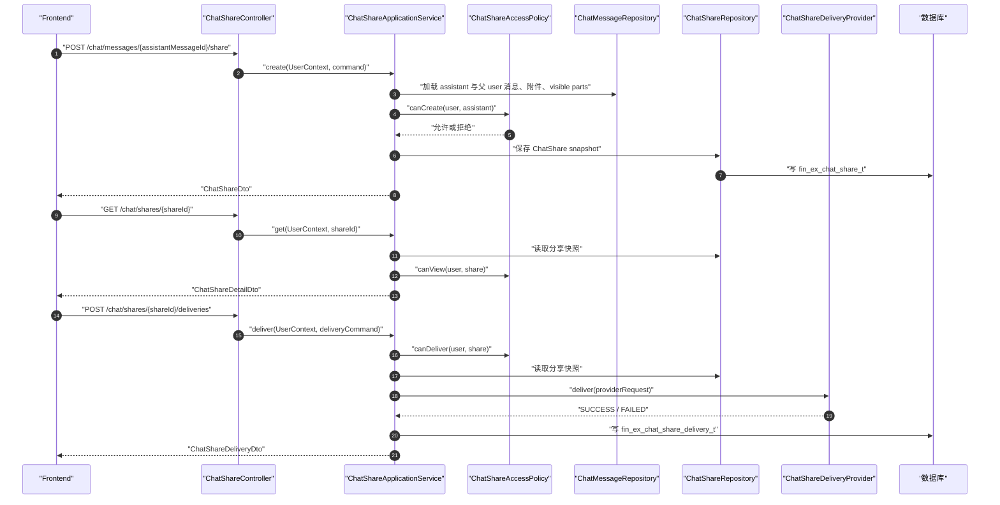
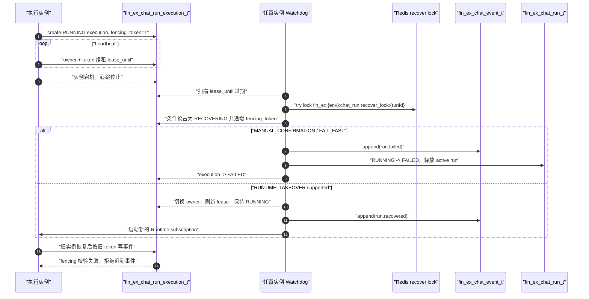
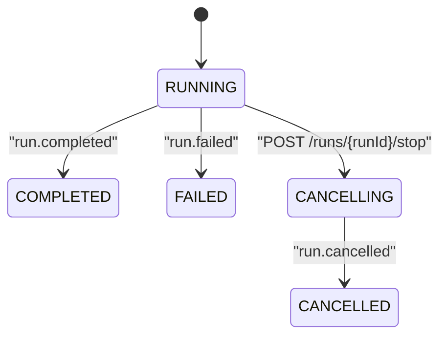

# FinanceEXChatService 正式版架构设计

## 架构目标

FinanceEXChatService 是前端聊天入口和 SuperAgent 主控服务。正式版只保留清晰的执行边界：

- DomainAgent 任务：用例库、意图服务或前端显式选择命中后，绑定会话级 DomainAgent，并由 DomainAgent 维护自己的下游会话上下文。
- Relay Runtime 任务：复杂任务和未命中任务进入 Relay Runtime，并由 Relay Runtime 负责多轮、规划、上下文和压缩。
- SuperAgent：负责身份、会话、可选记忆上下文装配、路由、事件落库和 RuntimeBinding 续接。

## 全局流程图



## 全局顺序图


## 简化版全局时序图

下面的简化图只保留核心外部参与方和事实源，适合做整体链路评审。它省略了应用层内部服务、DomainAgent 细节、WebSocket/Event Resume handler 细节和 Runtime adapter 细节；前端 WebSocket 接入仍然保留，只是不在本图展开。



## 文档库与附件使用

文档能力采用“统一后端入口 + DocumentStorage 防腐层 + 文档库资产”的模式。



设计原则：

- 前端上传仍先进入 FinanceEXChatService，方便统一鉴权、审计、限流和企业网关接入。
- 真实文件内容由 `DocumentStorage` 决定去向：`local/huawei-s3` 写入本服务对象存储，`api-store` 转发新文档上传接口。
- 聊天请求只引用 `documentId`，不携带文件正文。
- DomainAgent 或 Runtime 看到的是经过文档库回查后的可信附件元数据。
- `fin_ex_uploaded_document_t` 是文档库事实源，支持最近文档、库中文档选择和后续连接器文档扩展。

## 流式响应与断点恢复

正式版只保留后台 run 创建模式。`POST /chat/runs` 是唯一提问入口。
本页新创建的 run 默认通过 WebSocket topic 接实时事件；新页签、新浏览器或跨电脑恢复已经存在的 active run 时，使用 run 级事件恢复先补发历史事件，再持续接续 live 事件直到本轮 run 终态。会话级事件恢复 仍只负责有限缺失事件补发。

```text
POST /api/v1/ex/chat/runs
POST /api/v1/ex/chat/messages/{messageId}/feedback
DELETE /api/v1/ex/chat/messages/{messageId}/feedback
POST /api/v1/ex/chat/messages/{messageId}/share
GET  /api/v1/ex/chat/shares/{shareId}
DELETE /api/v1/ex/chat/shares/{shareId}
GET  /api/v1/ex/chat/shares?curPage=1&pageSize=20
POST /api/v1/ex/chat/sessions
GET  /api/v1/ex/chat/sessions?limit=20&cursor=...
GET  /api/v1/ex/chat/sessions/{sessionId}
GET  /api/v1/ex/chat/sessions/{sessionId}/messages?leafMessageId=...&limit=50
GET  /api/v1/ex/chat/sessions/{sessionId}/messages/{messageId}/variants
POST /api/v1/ex/chat/sessions/{sessionId}/path
POST /api/v1/ex/chat/sessions/{sessionId}/branches
GET  /api/v1/ex/chat/sessions/{sessionId}/events/resume?afterSeq={lastSeq}
GET  /api/v1/ex/chat/runs/{runId}/events/resume?afterSeq={lastSeq}
GET  /api/v1/ex/chat/sessions/{sessionId}/stream-status
WS   /api/v1/ex/chat/ws subscribe(topicId=streamTopicId)
POST /api/v1/ex/chat/runs/{runId}/stop
POST /api/v1/ex/chat/sessions/{sessionId}/archive
POST /api/v1/ex/chat/sessions/{sessionId}/restore
DELETE /api/v1/ex/chat/sessions/{sessionId}
DELETE /api/v1/ex/chat/sessions
```

`/chat/runs` 只返回 run 运行标识和 run 级 `streamTopicId`，不返回 WebSocket、Event Resume 或 stop URL。
这些 URL 属于前端 SDK、网关或部署配置，避免后端业务响应承担客户端路由配置职责。

删除会话是软删除语义。若目标会话存在 active run，删除接口会复用 run stop 编排先写入取消标记、
发布 `run.cancelled` 并释放本服务 active run，再把会话置为 `DELETED`。前端删除会话时不需要串行调用
stop；删除成功后应立即移除会话并取消本地订阅。

## 消息树与只读分支

当前版本引入会话内消息树，但不改变现有流式协议。`POST /chat/runs` 创建后台 run 时会先根据 `runMode` 解析消息树写入计划：

- `NEXT`：在 `parentMessageId` 或会话 `current_leaf_message_id` 后追加新的 user 消息，run 完成后追加 assistant 消息。
- `EDIT_USER`：校验 `editedMessageId` 是未锁定 user 消息，在原父节点下创建新的 user sibling，旧消息不变。
- `REGENERATE_ASSISTANT`：校验 `regeneratedMessageId` 是未锁定 assistant 消息，复用其父 user 消息，run 完成后创建新的 assistant sibling。

`current_leaf_message_id` 表示当前会话激活路径叶子。历史消息查询默认返回 root 到 current leaf 的路径；指定 `leafMessageId` 时返回 root 到该 leaf 的路径。`/messages` 会在有多个 sibling 版本的消息上返回 `versionInfo`，包含当前版本序号、版本总数和候选版本的 `switchLeafMessageId`。前端切换版本时可以先用 `GET /messages?leafMessageId={switchLeafMessageId}` 刷新聊天区，再用 `POST /path` 持久化当前选择；`/variants` 保留为查询完整候选内容和调试的接口。

复杂前端或联调排障可以调用 `GET /api/v1/ex/chat/sessions/{sessionId}/messages/tree` 读取完整可见消息树。该接口返回 `currentLeafMessageId`、`rootMessageIds` 和 `mapping`，但只包含业务可见的 user/assistant 消息，不返回 hidden system 或下游工具原始节点；普通聊天页继续使用 `/messages` active path。历史消息、tree 和 variants 返回的 `ChatMessageDto.attachments` 是消息附件展示快照，文件下载和预览仍由文档库接口独立鉴权。



从某条消息新建会话分支时，服务端使用只读物化快照方案：沿 `parent_message_id` 回溯 root，复制该路径到新 session，复制出的消息写入 `source_session_id/source_message_id`，并设置 `origin_type=BRANCH_SNAPSHOT`、`locked=true`。快照消息不能编辑、删除或重新生成；分支后续新增的 `NORMAL` 消息可以继续参与消息树版本管理。分支不继承源会话 RuntimeBinding，避免把源会话 Runtime session 错接到新分支。

## 单轮问答分享

分享功能不复用实时 event，也不在访问时回源读取原始会话路径，而是在创建时生成固定展示快照：



`ChatShareAccessPolicy` 是分享鉴权防腐层，默认规则为同租户可查看、仅创建者可撤销和发送。后续如果企业权限框架需要按组织、部门、用户白名单或外部 ACL 判断分享访问，只替换该 port 的 Spring bean，不修改 Controller、分享表或快照构造逻辑。

`snapshot_json` 只保存父 user 问题、assistant 回答、问题附件展示快照和 `visible=true` 的 parts；不保存 feedback、下游原始响应、隐藏/debug parts、Cookie、Authorization 或企业鉴权信息。附件快照只用于展示，不授予下载/预览权限。原会话后续编辑、重新生成、切换 path 或反馈变化都不会影响已经创建的分享。

分享发送通过 `ChatShareDeliveryProvider` 防腐层完成，首版 provider 为 `welink`。应用层只生成稳定的发送请求：分享人、标题、分享 URL、摘要、目标用户和目标群组；WeLink wire 字段如 `targetAccount/groupID` 只存在于 provider 实现中。WeLink 出站请求会设置 `Referer`，默认取 provider `base-url`，也可用 `financeex.share.delivery.providers.welink.referer` 覆盖；分享发送入口捕获到的标准 `Cookie` 请求头只作为出站 header 透传，不进入 wire body、发送记录或快照。发送失败不会回滚分享快照，只在 `fin_ex_chat_share_delivery_t` 中记录 `FAILED`、错误码和 provider 安全响应摘要，前端可按同一个 `shareId` 重试。分享发送使用 `financeex.share.delivery.max-concurrency` 做当前 JVM 内并发隔离，防止外部 provider 抖动时占满异步工作线程；WeLink provider 失败后默认最多重试 3 次，运行时最多按 10 次重试生效。

删除会话时，`SessionApplicationService` 会同步撤销当前用户创建的该会话 `ACTIVE` 分享，避免用户删除会话后外部仍访问其快照。

## 集成服务鉴权

外部 HTTP 调用统一通过 `AuthHeaderProviderRegistry` 获取服务对服务鉴权请求头。该能力是集成服务调用防腐层，不读取前端请求 ThreadLocal，也不要求前端传 token。默认 `financeex.integration-auth.enabled=false`，不会改变现有调用行为。

首版内置 `none` 和 `sgov` 两种 provider。`sgov` 只向出站 HTTP 请求注入 `Authorization` header，具体凭据获取由企业实现的 `SgovTokenResolver` bean 负责。本服务不会把 Authorization、服务 ID 或密钥写入请求 body、数据库、事件、metadata 或前端响应。

当前只预置以下 serviceCode：`welink-share`、`intent-service`、`use-case-library`。Relay Runtime、DomainAgent 和文档存储 adapter 默认不走该鉴权层，仍保持现有 Cookie 透传或普通调用行为；后续如需启用，只新增 `financeex.integration-auth.services.<serviceCode>.provider=sgov` 配置。


关键约束：

- `fin_ex_chat_event_t.seq` 是前端恢复游标，实时输出和补发输出使用同一份 seq；该序号由数据库 sequence/default 生成并随事件写入一起返回，应用层不再本地生成恢复游标。
- 数据库是事件事实源。生产默认使用 `financeex.chat-stream.live-source-mode=redis-only`，
  WebSocket 与 run 级 Event Resume live tail 只消费 Redis Pub/Sub，避免本机 local sink 与 Redis
  双源合并造成同一 topic seq 乱序；`LocalChatEventStreamRegistry` 保留为 `local-only/merge` 回退通道。
- 实时消费侧使用 `financeex.chat-stream.live-reorder-*` 做短窗口排序。排序只处理已经到达的事件，
  不合并事件、不改变 payload、不等待连续 seq，用于吸收 Redis listener 调度抖动带来的低 seq 迟到。
- 事件写入必须校验 `runId/sessionId/tenantId/userId` 一致；事件补发和 `latestSeq` 查询也必须携带 `tenantId/userId/sessionId/runId` owner 条件，不能按裸 runId 或 sessionId 查询。
- `fin_ex_chat_run_t` 是 run 生命周期事实源；Redis 只保存 active run 和 cancel flag。
- `fin_ex_chat_run_execution_t` 是 run 执行控制面事实源；实例 ID、心跳、租约、恢复状态和 `fencing_token` 都在该表中，避免把运维执行信息混入业务 run 表。
- 后台 run 不依赖创建 run 的原始浏览器连接，刷新页面后用 `afterSeq` 恢复。
- 前端 WebSocket 订阅消息格式：`{"type":"subscribe","topicId":"chat-run-{runId}","afterSeq":0}`。
- 前端 WebSocket 不触发 `AgentRuntime.query`，只补发和订阅 ChatEvent；它不接受聊天请求，仅支持 `connect`、`presence`、`subscribe`、`unsubscribe` 控制消息。
- 同一 WebSocket 连接允许同时订阅多个 session 的多个 run topic；协议层不会因切换会话自动释放旧 topic。订阅前按用户校验 `topicId -> run` 归属，live 流和 WebSocket envelope 投递前再按 `topicId + runId + sessionId` 校验，避免跨会话实时消息串线。
- stop 是 REST 生命周期接口，不是 WebSocket command；重复 stop 幂等返回当前 run 状态。
- 重新生成回答不再使用 run retry 接口，而是通过 `POST /chat/runs` 携带 `runMode=REGENERATE_ASSISTANT` 和 `regeneratedMessageId`，在同一 user 节点下生成新的 assistant sibling。
- 会话 state 接口聚合会话元数据、最近历史消息和 `activeStreamTopicId`，用于前端切换会话后的恢复判断。
- 新页签、新浏览器或跨电脑恢复 active run 时，前端应使用 `activeRunFirstSeq - 1` 打开 run 级事件恢复；该接口会先按数据库事实源补发历史事件，再接入 live topic 持续输出到 run 终态，不能把 `latestSeq` 当作当前渲染实例已消费游标。

### Run 控制面与故障恢复

后台 run 的业务状态和执行状态分离：

- `fin_ex_chat_run_t`：业务生命周期事实源，记录 run 状态、路由类型、Runtime 信息、first/last seq 和取消原因。
- `fin_ex_chat_run_execution_t`：运行控制面事实源，记录当前 owner 实例、心跳、租约、恢复状态、恢复租约和 `fencing_token`。

控制面初始化是 run 启动的必备步骤。若业务 run 已写入 `fin_ex_chat_run_t`，但创建
`fin_ex_chat_run_execution_t` 失败，服务端不会继续调用 Runtime/DomainAgent，而是直接追加
`run.failed` 终态事件，payload code 为 `RUN_EXECUTION_INIT_FAILED`，并释放 active run。
此时没有可用 execution claim，因此不能绕过 fencing 继续输出。



watchdog 是分层设计：`ChatRunWatchdogScheduler` 只负责按配置延迟、jitter 和周期触发；`ChatRunRecoveryOrchestrator` 负责候选拉取、容量检查、策略选择和指标日志；`ChatRunExecutionRepository` 负责数据库条件抢占；`StaleRunRecoveryStrategy` 负责具体恢复动作。默认策略链为 `MANUAL_CONFIRMATION,FAIL_FAST`，`RUNTIME_TAKEOVER` 仅在 Runtime 明确支持可靠恢复并提供 resume token 时使用。

所有治理类 `@Scheduled` 任务使用 `financeex.scheduler.pool-size` 配置的线程池调度器，避免 watchdog jitter 或慢巡检阻塞 run heartbeat、WebSocket 空闲清理和准入窗口清理。实例 ID 默认由 `GeneratedApplicationInstanceIdProvider` 在进程启动时生成；如需对接注册中心，提供新的 `ApplicationInstanceIdProvider` bean 即可替换默认实现。

恢复负载治理包含四层保护：每轮扫描候选上限、每轮最大 claim 上限、每租户 claim 上限、本机恢复和 takeover semaphore。没有恢复容量时不抢占，留给下一轮或其他实例处理，避免单实例在大批 stale run 场景下被恢复任务压垮。

### WebSocket 边界说明

当前系统只保留前端到 FinanceEXChatService 的 WebSocket：

- 前端 WebSocket：`/api/v1/ex/chat/ws`，只连接 FinanceEXChatService。它是用户级连接，按 run 级 `streamTopicId` 订阅已经写入事件事实源的 ChatEvent；它不接受聊天请求，也不直接调用 RelayAgent。

因此架构图中的 `AgentRuntime.query` 是应用层防腐层调用，不等价于前端 WebSocket。当前 `AgentRuntime.query` 默认使用 Relay HTTP 流式 adapter；如配置 `financeex.agent-runtime.relay.adapter=relay-websocket`，可切换为 FinanceEXChatService 到 RelayAgent 的出站 WebSocket 普通问答 adapter。

前端 WebSocket 的服务端入口按启动模式自动切换：

- Reactive WebFlux 应用：`ChatWebSocketConfig + ChatWebSocketHandler` 注册同一路径。
- Servlet/MVC 应用：`ChatServletWebSocketConfig + ChatServletWebSocketHandler` 注册同一路径。

两种 handler 都委托 `ChatWebSocketProtocolService` 执行 connect、presence、subscribe、
unsubscribe 和 recover-required 逻辑，避免协议实现分叉。企业框架自带
`spring-boot-starter-web` 时，Spring Boot 会默认选择 Servlet/MVC 启动，此时应使用
`server.servlet.context-path` 配置上下文根；纯 WebFlux 启动时才使用 `spring.webflux.base-path`。
Servlet/MVC WebSocket 会在 `HandshakeInterceptor.beforeHandshake` 阶段调用
`AuthContextProvider.resolve()`，并把不可变 `UserContext` 写入 WebSocket session attributes；
`afterConnectionEstablished` 和后续消息处理只读取该快照，不再访问企业 ThreadLocal。

MVC/Servlet 生产模式增加了长连接治理层：`financeex.websocket.allowed-origin-patterns`
限制握手来源，`max-connections-per-user`、`max-subscriptions-per-connection`、
`max-subscribers-per-topic`、`outbound-queue-size`、`live-buffer-capacity`、`idle-timeout`
以及 `servlet-send-*` 限制本机连接资源。Servlet WebSocket 的底层发送是阻塞调用，
服务端会先把 envelope 放入单连接有界队列，再由全局发送 executor 串行 drain 当前连接，
避免慢客户端把 Runtime、Redis fanout 或 scheduler 线程卡在 socket send 上。WebSocket 与 run 级事件恢复通过
`financeex.chat-stream.turn-heartbeat-interval` 发送 turn stream `heartbeat`，配合
`spring.mvc.async.request-timeout` 与 Tomcat 连接配置避免空闲断流。WebSocket 实时投递
出现慢客户端、发送队列溢出或乱序时关闭当前连接或返回 `RECOVER_REQUIRED`，可靠恢复仍走数据库事件 + Event Resume。
流式事件合并后的落库、run 状态推进和实时发布统一切到 `financeex.chat-stream.event-io-executor-*`
专用调度器，避免阻塞式 DB/Redis 调用占用 Reactor `parallel-*` timer 或 Servlet 请求线程。
Redis Pub/Sub 是默认实时 fanout 通道，跨实例发布使用 `financeex.websocket.redis-publish-*` 有界后台队列；同一 run topic
串行发布并做短重试，发布缺口会通过恢复控制消息转成 `RECOVER_REQUIRED`。
实时消费侧默认用 `financeex.chat-stream.live-reorder-window=20ms` 和
`financeex.chat-stream.live-reorder-max-events=128` 对短窗口内事件按 seq 排序，避免同一 topic 中
后写事件先到达时误触发 seq rollback；该阶段不改变事件粒度。
run 级 Event Resume 正常优先接入 Redis live topic；如果 live source 异常，会以恢复错误结束当前实时 tail，
前端退避后重新 resume；服务端不做循环 DB polling，避免 Redis 抖动时把压力转移到数据库。
前端接收的 `message.payload` / SSE `data` 是 `conversation-turn-stream`，真实 ChatEvent 位于
`stream-item.encodedItem.data`；`heartbeat` 和 `done` 只是传输层状态，不写入 `fin_ex_chat_event_t`，
也不推进 `afterSeq`。

文档上传同样按启动模式做接口层适配：Servlet/MVC 注册 `MvcDocumentUploadController`
并接收 `MultipartFile`，纯 WebFlux 注册 `ReactiveDocumentUploadController` 并接收
`FilePart`。两种 Controller 都委托 `DocumentUploadSupport`，由它先把上传流写入临时文件，
再通过 `DocumentFacade -> DocumentStorage` 按 `financeex.storage.provider` 选择 `local`、`huawei-s3`
或 `api-store`。前端看到的路径、字段和响应始终是同一套
`POST /api/v1/ex/documents` 契约。api-store 可通过 `financeex.storage.api-store.forward-cookie=true`
允许上传入口 Cookie 作为下游 upload HTTP header 透传；普通对象存储实现不使用该 Cookie，
且 Cookie 不进入 multipart form、文档元数据或前端响应。

## 分层架构


## 路由规则

- `targetType=DOMAIN_AGENT,targetId=...` 优先级最高；存在时进入 `DOMAIN_AGENT` 路由并绑定对应 DomainAgent，`routeSource=front-selected`。
- active RuntimeBinding 优先级次之；`provider=domain-agent` 时续接当前 DomainAgent，`provider=relay` 时续接 Relay Runtime。
- 用例库和意图服务是可选路由信号，默认关闭；关闭时不调用外部 API。
- 用例库开启时优先匹配；命中阈值默认 `0.85`，命中并返回 DomainAgent 路由目标后绑定为 DomainAgent。
- 用例库关闭或未命中后，只有意图服务开启才调用 `IntentService`。
- 外部路由在 run pipeline 内执行，`run.started` 会先落库和推送；调用用例库或意图服务前会先落 `runtime.progress(payload.sourceType=route-progress)`，避免慢路由阶段让前端长时间无反馈。
- 意图服务 adapter 的 HTTP 请求体和响应体转换由 infrastructure intent mapper 承载；当前对接 `/getIntentDecision`，以 `data.result.routeAction` 作为唯一裁决点。
- RouteMemory 是独立于普通短期/长期记忆的路由事实源。调用意图服务前，应用层会加载最近 TopK 成功 `ROUTE` 记录和当前未完成 `INTENT_CLARIFICATION` 的 `CLARIFY` 链路，统一组装为 `conversationContext.history`。
- `conversationContext.routeTrigger` 由 ChatService 生成：普通无绑定首次路由为 `first_turn`，DomainAgent 结构化拒答后的重路由为 `domain_reject`，用户回答意图澄清后为 `clarify_answer`。`AGENT_CLARIFICATION` 和 `DOMAIN_AGENT_SWITCH_CONFIRMATION` 不进入意图 history。
- 意图服务调用失败后默认最多重试 3 次；配置误设过大时运行时最多按 10 次生效，重试耗尽后仍按原有降级策略进入 Relay Runtime。
- 意图服务返回 `WAITING_CLARIFICATION` 或兼容的 `TaskComplexity.NEED_CLARIFICATION` 时生成 `run.waiting_user(waitingType=INTENT_CLARIFICATION)`，不创建 RuntimeBinding；用户通过统一 HITL 接口提交后继续意图澄清，直到得到最终路由。
- 意图服务返回 `routeAction=ROUTE_SINGLE` 时，直接取唯一 `items[0].intentId` 作为 DomainAgentId/skillId，绑定并调用 DomainAgent Runtime；`resourceInstruction.resourceId` 只作为诊断字段记录，不参与路由也不兜底，`confidence` 只用于记录和排障，不参与二次裁决。
- 意图澄清可能多轮连续发生。每次 `CLARIFY` 会在 `run.waiting_user` 与 HITL request 成功落库后追加一条 RouteMemory `CLARIFY` 记录；最终得到 `ROUTE_SINGLE/ROUTE_MULTI/NO_MATCH` 后折叠当前澄清链路，且只有 `ROUTE_SINGLE` 会在同一个 best-effort 写任务中执行 `fold -> appendRoute`。
- `financeex.intent-record.enabled=true` 时，只有实际调用过意图服务的 run 会异步写入 `fin_ex_intent_recognition_t`。记录内容包含本轮 query、routeAction、候选 items、最终路由是否采纳和意图服务耗时；DomainAgent、RuntimeBinding 续接、用例库已命中、意图服务关闭时不会记录。
- `routeAction=ROUTE_MULTI` 和 `routeAction=NO_MATCH` 都进入 Relay Runtime。两个信号均关闭或服务失败时，也进入 Relay Runtime。
- DomainAgent 绑定会一直续接，直到下游返回 `financeex.domain-agent.refusal.codes` 配置的明确拒答 code。意图/用例库绑定拒答后会在当前 run 内重新意图并自动切换；手动绑定拒答后若命中新 Agent，会生成 `DOMAIN_AGENT_SWITCH_CONFIRMATION` 等待用户确认。

## RuntimeBinding

RuntimeBinding 维护前端 chat session、当前消息树 leaf 与当前下游会话的关系。当前 provider 包括 `relay` 和 `domain-agent`。leaf 维度隔离可以避免编辑历史问题、切换版本或从历史消息新建分支时误用另一条路径的下游 session。

```text
Redis key:
fin_ex:{env}:runtime_binding:{tenantId:userId:sessionId}:{leafMessageId}
fin_ex:{env}:runtime_binding:index:{tenantId:userId:sessionId}

数据库表:
fin_ex_runtime_binding_t
```

字段包括：

```text
id
tenant_id
user_id
chat_session_id
provider
leaf_message_id
runtime_session_id
status
last_run_id
expires_at
metadata_json
created_at
updated_at
```

## ChatRun 与 Stop

ChatRun 维护单轮回答生命周期，表为 `fin_ex_chat_run_t`，Redis key 为：

```text
fin_ex:{env}:chat_run:active:{tenantId}:{userId}:{sessionId}
fin_ex:{env}:chat_run:cancel:{runId}
fin_ex:{env}:chat_stream:{streamTopicId}
```

状态流转：



stop 语义：

- 集群事实源优先：stop 先写 Redis cancel flag 与数据库 `CANCELLING` 状态，再发布 `run.cancelled`。
- JVM subscription registry 只是本机资源释放加速器；即使 stop 请求与输出流落在不同实例，输出实例也必须在追加事件前读取 Redis cancel flag。非终态事件不再逐条回源 run 表，最终写入正确性由数据库 guarded insert 同时校验 run 状态、session 归属和 execution fencing。
- 用户主动 stop 且已有 assistant 正文或用户可见 runtime parts 成功落库时，会从事件事实源重建并保存 partial assistant 历史消息，消息 metadata 标记 `partial=true`、`finishReason=USER_STOP`；只有 trace、domain-agent session 等内部 metadata 时不创建空 assistant。
- 下游尽力取消：Relay stream-http 通过 HTTP stopPath 取消；Relay WebSocket 本机命中 active 连接时直接发送 `{"type":"interrupt"}`，跨实例或本机连接已清理时用临时 WS `resume` 到 run 中已回填的 Relay `runtimeSessionId`，收到 `session-ready` 后发送 `interrupt`；DomainAgent 走 DomainAgent cancel adapter。这些下游取消失败只记录日志，不影响前端收到本服务 `run.cancelled` 终态。
- stop 不取消 RuntimeBinding；下一轮仍可续接 Runtime。如果需要全新的 Relay 会话，应创建新的 ChatService 会话。

## 外部 API 接入

- 用例库服务：`financeex.use-case-library.enabled`、`financeex.use-case-library.base-url`、`financeex.use-case-library.match-path`
- 意图服务：`financeex.intent.enabled`、`financeex.intent.base-url`、`financeex.intent.access-name`、`financeex.intent.recognize-path`、`financeex.intent.trace`、`financeex.intent.confidence-threshold`、`financeex.intent.timeout`、`financeex.intent.max-retries`。其中 `confidence-threshold` 仅保留给旧统计字段兼容，不参与 DomainAgent 路由裁决。
- 意图识别记录：`financeex.intent-record.enabled`、`max-query-length`、`max-raw-json-length`、`executor.*`。默认关闭；开启后使用 Servlet/MVC 友好的专用线程池 best-effort 写库，线程池拒绝、JSON 序列化失败或数据库写入失败都只记录 warn，不阻塞 `/chat/runs`。
- RouteMemory：`financeex.route-memory.top-k` 控制传给意图服务的最近成功 route 数量，`financeex.route-memory.max-clarification-rounds` 控制单条澄清链路的最大轮数，超过后降级 Relay Runtime，避免无限澄清。读写线程池分别由 `read-executor.*`、`write-executor.*` 控制；`read-timeout` 超时后会取消读取 future，并按 `circuit-breaker.*` 短暂熔断，熔断期间直接返回空 history。
- DomainAgent：`financeex.domain-agent.base-url`、`financeex.domain-agent.chat-path`、`financeex.domain-agent.cancel-path`
- DomainAgent 拒答重路由：`financeex.domain-agent.refusal.codes`、`financeex.domain-agent.max-reroutes`
- AgentRuntime fallback provider：`financeex.agent-runtime.default-provider`，没有 active binding 时的兜底 provider，默认 `relay`
- Relay HTTP Streamable adapter：`financeex.agent-runtime.base-url`、`financeex.agent-runtime.stream-path`、`financeex.agent-runtime.stop-path`
- Relay adapter 选择：`financeex.agent-runtime.relay.adapter`，默认 `relay-stream-http`；配置为 `relay-websocket` 时启用下游 Relay WebSocket 普通问答 adapter。
- Relay WebSocket adapter：`financeex.agent-runtime.relay.websocket.url`、`app-mode`、`connect-timeout`、`config-handshake-timeout`、`max-run-duration`、`heartbeat-interval`、`interrupt-ack-timeout`、`idle-timeout`、`max-frame-bytes`
- 下游 Cookie 透传：`financeex.agent-runtime.forward-cookie.enabled`、`max-length`、`allowed-adapters` 控制 run/stop 到 Relay Runtime 的 Cookie 透传；默认允许 `relay-stream-http` 和 `relay-websocket`。DomainAgent chat/cancel 也使用入口 Cookie 内存快照。文档上传另由 `financeex.document.forward-cookie-max-length` 与 `financeex.storage.api-store.forward-cookie` 控制，默认关闭 api-store upload Cookie 透传。
- 流式事件粒度：当前生产版本不合并 `message.delta`，按下游标准事件原粒度写入事件表并推送实时通道，避免 ChatService 内部背压误中断 run。`financeex.chat-stream.delta-coalesce-*` 仅作为后续 demand-aware 合并器兼容预留；`financeex.chat-stream.turn-heartbeat-interval` 只控制传输层 heartbeat，不影响事件表。
- Servlet WebSocket 发送治理：`financeex.websocket.servlet-send-executor-core-size`、`servlet-send-executor-max-size`、`servlet-send-queue-capacity`、`servlet-send-queue-max-bytes`、`servlet-send-use-virtual-threads`。默认使用有界平台线程池和单连接有界队列；JDK 21 虚拟线程可按企业压测结果开启。
- DomainAgent 大对象分片：`financeex.domain-agent.max-pending-frame-bytes` 限制尚未识别完成的单个 domain-agent frame 缓冲，`financeex.domain-agent.max-fragment-bytes` 限制 `runtime.card/runtime.reference/runtime.progress` 分片 payload 的单片大小。该机制避免 `diyCardScene/openCard/searchList/sourcesDocuments/processResult` 跨网络 chunk 时被误解析为 invalid-json，也避免为了完整 JSON 解析无限占用 JVM 内存。分片状态通过 `payload.fragment/itemId/delta/complete` 表达，不新增顶层 `.delta/.completed` 事件类型。
- Relay 响应映射：`financeex.agent-runtime.relay.answer-event-types`、`answer-content-fields`、`agent-context-as-answer`。默认把 Relay `type=agent,is_streaming=true` 的 `content/context` 映射为 assistant 正文增量 `message.delta`，把 `type=agent,is_streaming=false` 和 `type=generate-response,content非空` 映射为最终回答快照 `message.snapshot`，把 `steam-complete/stream-complete/[DONE]` 映射为 `message.completed`。

DomainAgent 当前通过 HTTP 文本流调用，并和 Relay Runtime 一样以 `AgentRuntime` provider 注册，使用 RuntimeBinding 保存下游会话 ID、绑定来源和意图摘要。DomainAgent 请求会把 `skillId/query/sessionId` 固定为服务端当前绑定和本轮问题，前端 metadata 只作为业务扩展，不能覆盖这些保留字段。当前上线版本内置 `RelayAgentRuntime` 与 `DomainAgentRuntime` 两个 provider；Relay provider 再通过 `RelayRuntimeProtocolAdapter` 选择下游协议：`relay-stream-http` 是默认 Relay HTTP 流式协议实现，`relay-websocket` 是可选 Relay WebSocket 普通问答实现。Relay WebSocket 始终使用短连接，每个 run 都重新建立下游 WS；首轮 `new` 的 `config.sessionId` 使用 ChatService `sessionId`，收到 `session-ready.session_id` 后回填 RuntimeBinding 中的 Relay 真实 `runtimeSessionId`，后续 `resume` 使用该值续接。新增下游协议时，应新增 adapter，而不是在 `RelayAgentRuntime` 主类里堆转换分支。

`Cookie` 是请求入口捕获的运行期内存快照，只会在 `AgentRuntimeRequest.forwardHeaders`、`DomainAgentRequest.forwardHeaders`、`DocumentUploadCommand.forwardHeaders` 或 cancel 请求中向可信 adapter 传递；这些字段被 JSON 序列化忽略，且 adapter 会把内部请求映射为专用 wire DTO 或受控 multipart，不能进入下游请求体、form 字段、文档元数据、run metadata、事件 payload 或日志。该设计保证企业登录态不会因后台 run、Event Resume/WS 恢复、文档库管理或故障治理被持久化或回放。

当前上线版本只保留 Relay Runtime provider，不包含其他历史 Runtime provider 分支、专用 memory 分支或专用 prompt assembler 配置。复杂任务通过 Relay Runtime adapter 执行，默认使用 `relay-stream-http`，可灰度切换 `relay-websocket` 普通问答；后续如需替换 Runtime，应新增 `AgentRuntime` provider，而不是把新协议写进主编排。

AgentRuntime 防腐层仍然保留。应用层普通问答只依赖 `AgentRuntime` 和 `AgentRuntimeRequest` 契约，等待用户输入后的续接只依赖 `AgentRuntimeInteraction` 和 `AgentRuntimeHitlResponseRequest` 契约。当前 `relay` provider 是 Runtime 类型，下游 API 接入协议由 `financeex.agent-runtime.relay.adapter` 决定；后续如果替换 Runtime 实现，应新增一个实现 `AgentRuntime` 的 provider，后续如果只新增 Relay 下游协议，应新增 `RelayRuntimeProtocolAdapter`，避免改动 `FinanceEXChatService` 主编排。

Relay stream-http adapter 负责请求 wire DTO 映射和响应 chunk 归一化；Relay WebSocket adapter 每个 run 都建立一条短生命周期下游连接，并把 `AgentRuntimeRequest.metadata()` 过滤后的非敏感字段放入 `user-message.metadata`，与 stream-http 使用同一套 Cookie、token、Authorization、secret、password 等敏感 key 过滤规则。应用层通过会话级 RuntimeBinding 显式传递 `runtimeSessionMode=NEW|RESUME`：同一 ChatService 会话只首次发送 `new`，此时 `config.sessionId` 使用 ChatService `sessionId`；Relay 返回 `session-ready.session_id` 后回填真实 `runtimeSessionId`，后续提问即使重新建连也全部发送 `resume`，并在 resume config 中声明 `supports_incremental_recovery=true`。

Relay WS 配置阶段只以 `session-ready` 作为唯一完成信号；adapter 会将 `session-ready` 映射为 `runtime.metadata`，payload 保留 Relay 原始 `session_id/session_mode` 等字段，并补充 `runtimeSessionId` 用于尽早回填真实会话 ID。其他配置阶段 frame 只用于握手判定，不会成为用户回答事件；若收到 `error/clear-session/session-mismatch` 则立即失败。`user-message` 后会丢弃 `relay-start` 前的前置 `session-state=idle/completed/ready/running/agent_thinking` 和迟到 `config`，并从 `relay-start`、首个业务帧或 `session-state=waiting_user_input/paused` 开始映射标准事件；普通问答阶段定时向 Relay 发送 `{ "type": "heartbeat" }` 保持连接活跃，`heartbeat-response` 不落库、不推送，任意业务帧或 heartbeat 回包都会刷新下游连接活跃时间。回答阶段内的 `session-state=idle/completed/waiting_user_input/paused` 会补齐 `message.completed`。普通问答不再用 `idle-timeout` 判定 60s 无业务帧失败；若超过 `heartbeat-response-timeout` 没有任何回包则失败闭合，`max-run-duration` 控制最长执行时间；`idle-timeout` 仅保留给 stop 临时控制连接等等待下一帧的场景。

协议级澄清只由 Relay `approval-request(operation_type=questionnaire)` 触发，ChatService 会固化 assistant、保存 HITL 请求并以 `run.waiting_user` 终止本轮；等待请求默认按 `financeex.chat-hitl.default-expire-duration=24h` 过期，配置为 `0` 或负数表示不过期，过期由 stream-status/提交响应路径懒标记，不启动额外清理线程。单独的 `waiting_user_input` 只闭合本次 Relay WS 连接，不生成 HITL 等待状态；`paused` 只表示 Relay 对 interrupt 的确认。HITL 续接通过 `AgentRuntimeInteraction` 防腐层，应用层发送通用响应上下文，Relay WS adapter 转换为 `approval-response`，不创建新的普通 user 消息。stop/delete 触发本地取消时，Relay WS adapter 会优先向本机 active run 对应下游短连接 best-effort 发送 `{"type":"interrupt"}`；若 stop 落到其他实例或本机连接已清理，则新建独立 clientId 的临时 WS，使用 run 中已回填的 Relay `runtimeSessionId` 发送 `config(sessionMode=resume, supports_incremental_recovery=true)`，收到 `session-ready` 后发送 `interrupt`，等待 `session-state=paused` 或 `interrupt-ack-timeout` 到期后释放临时连接。

前端通过 turn stream 的 `encodedItem.data` 消费 ChatService 标准顶层事件，同时可以按 Relay 文档解析 Relay payload：Relay JSON payload 保留原字段名和嵌套结构，仅额外补充 `source=relay`、`sourceType=<Relay原始type>`、`runtimeSessionId`。`FINANCEEX_RELAY_MAX_IN_MEMORY_SIZE` 只提高 Relay HTTP WebClient 单个响应 frame 的 codec 解码上限；`FINANCEEX_RELAY_WS_MAX_FRAME_BYTES` 控制 Relay WebSocket 单帧上限，二者都不承担超大事件拆分职责。`message.delta` 是 assistant 正文增量；`message.snapshot` 是最终回答快照；`runtime.progress/runtime.metadata/runtime.agent/runtime.thinking/runtime.tool/runtime.reference/runtime.card` 是过程、引用或卡片事件，run 完成后进入 `ChatMessageDto.parts` 回显。Relay `tool-structured-result` 统一映射为 `runtime.tool`，完整保留 `result_data/resultData`，不再拆成正文、引用、进度或卡片。Relay 或 domain-agent 未知 JSON object 才以 `runtime.event` 可控透传。不能把下游任意 `type` 直接作为 ChatService 顶层事件类型。

协议级等待用户输入的续接能力独立为 `AgentRuntimeInteraction`。应用层只在该接口声明支持时创建 `WAITING_USER`；当前只有 Relay WebSocket adapter 支持 questionnaire 澄清续接，续接时发送 Relay `approval-response`；非支持 adapter 只保存和推送对应 `runtime.card`。

## 命名规范

所有表名必须匹配：

```text
^fin_ex_.*_t$
```

当前表：

- `fin_ex_chat_session_t`
- `fin_ex_chat_message_t`
- `fin_ex_chat_message_attachment_t`
- `fin_ex_chat_run_t`
- `fin_ex_chat_run_execution_t`
- `fin_ex_chat_event_t`
- `fin_ex_uploaded_document_t`
- `fin_ex_message_feedback_t`：当前用户对 assistant 消息的点赞/点踩状态，支持 ACTIVE/CANCELLED。
- `fin_ex_chat_share_t`：单轮问答分享固定快照，支持 ACTIVE/REVOKED、过期和创建者撤销。
- `fin_ex_chat_share_delivery_t`：分享发送记录，保存发送 provider、目标、分享链接和 SUCCESS/FAILED 结果。
- `fin_ex_runtime_binding_t`

Redis key 必须以 `fin_ex:{env}` 开头。`{env}` 从 `spring.profiles.active` 第一个 profile 自动注入，
无 active profile 时为 `default`，非 `[a-z0-9_-]` 字符会规范化为 `_`：

- `fin_ex:{env}:runtime_binding:{tenantId:userId:sessionId}:{leafMessageId}`
- `fin_ex:{env}:runtime_binding:index:{tenantId:userId:sessionId}`
- `fin_ex:{env}:chat_run:active:{tenantId}:{userId}:{sessionId}`
- `fin_ex:{env}:chat_run:cancel:{runId}`
- `fin_ex:{env}:chat_run:recover_lock:{runId}`
- `fin_ex:{env}:chat_stream:{streamTopicId}`
- `fin_ex:{env}:memory:short_term:messages:{tenantId}:{userId}:{sessionId}`

同一会话的 active run 互斥由 Redis active key 和数据库 run 状态共同保护。创建 run 前会先查询
当前 active run，真正写入 `RUNNING` run 时通过 Redis set-if-absent 声明
`fin_ex:{env}:chat_run:active:{tenantId}:{userId}:{sessionId}`；声明失败时返回 `ACTIVE_RUN_EXISTS`。
run 进入 `COMPLETED/FAILED/CANCELLED` 后释放 active key。Redis 不可用时可退化为数据库
active run 检查，但生产集群应保证 Redis Cluster 可用以降低并发竞态窗口。

Redis 部署模式由 `financeex.redis.mode` 控制，默认 `standalone`；生产 Redis Cluster 设置为
`cluster` 并配置 `financeex.redis.cluster.nodes`。配置文件中的 Redis prefix 仍是逻辑前缀
`fin_ex:...`，不要手写 env，避免形成 `fin_ex:dev:dev:...` 这类双重环境段。RuntimeBinding 使用
Redis hash tag 保证同一会话 binding key 和索引集合落在同一 slot；env 位于 hash tag 外面，不影响
同 slot 设计，因此会话级清理不使用 `KEYS`，只通过索引集合删除明确 key。
ChatLiveEventBus 在本机出现 run topic 订阅者时动态订阅对应 Redis channel，Redis Pub/Sub 仍然只做
跨实例实时 fanout，可靠恢复继续依赖数据库事件 + Event Resume。同一 topic 的本机 live sink 写入需要串行化，
避免 Redis listener 并发投递时触发 Reactor sink `FAIL_NON_SERIALIZED`。

## 可选记忆上下文

- `financeex.memory.short-term.enabled=false` 时，不装配最近问答，也不访问 Redis 短期记忆缓存。
- `financeex.memory.short-term.recent-turns=5` 表示短期记忆开启后读取最近 5 轮问答，即最多 10 条消息。
- `financeex.memory.short-term.cache-enabled=true` 表示短期记忆开启时优先使用 Redis 热缓存，miss 后回源数据库。
- `financeex.memory.long-term.enabled=false` 时，不调用长期记忆服务。
- `financeex.memory.long-term.provider=disabled` 是默认安全 provider，开启长期记忆但未接真实服务时返回空结果。
