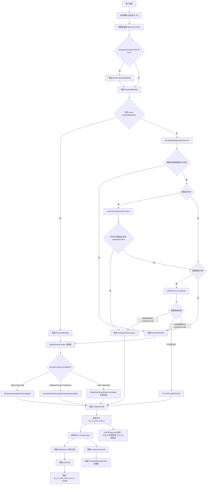
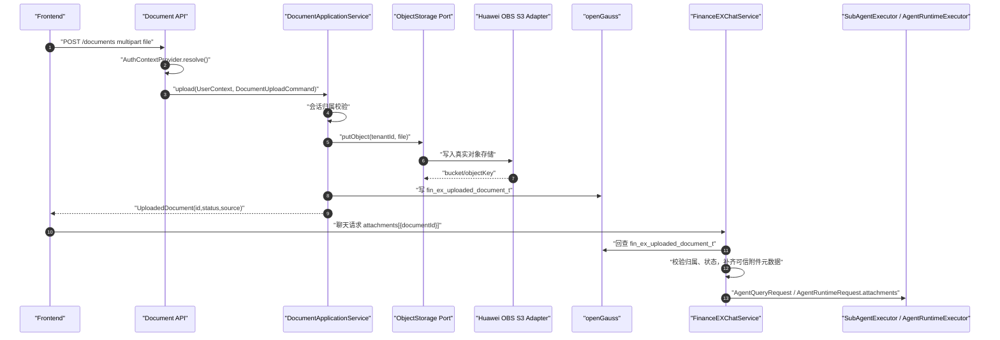
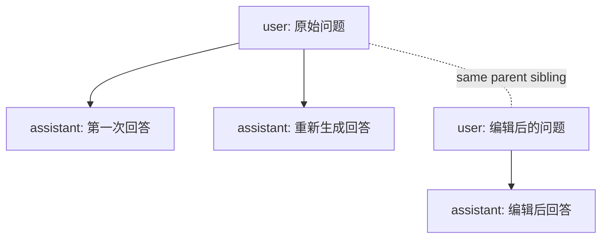
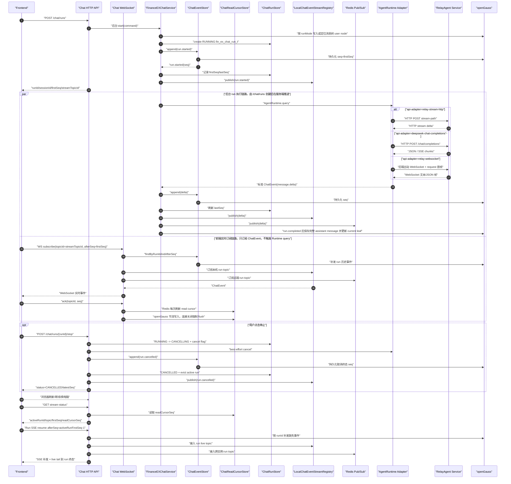
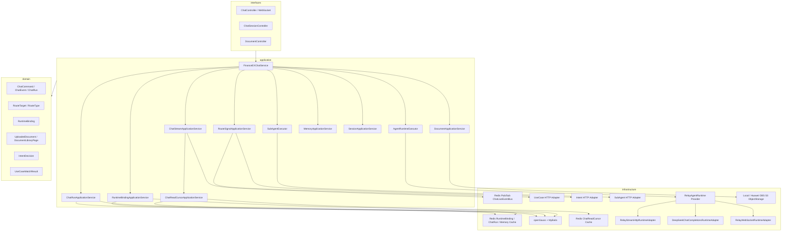
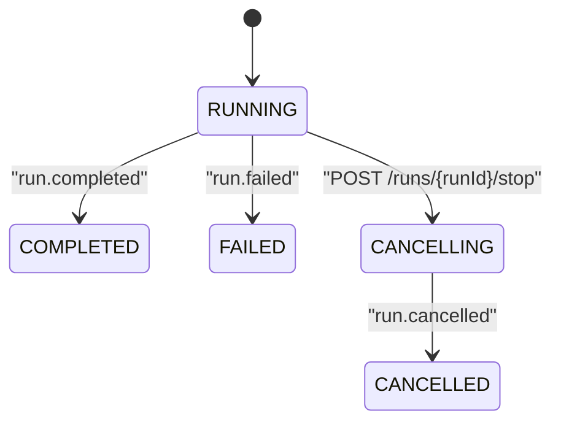

# FinanceEXChatService 正式版架构设计

## 架构目标

FinanceEXChatService 是前端聊天入口和 SuperAgent 主控服务。正式版只保留清晰的执行边界：

- 简单任务：用例库或意图服务命中后，按 `agentCode` 单轮调用一个 SubAgent。
- 复杂任务：进入 Relay Runtime，并由 Relay Runtime 负责多轮、规划、上下文和压缩。
- SuperAgent：负责身份、会话、可选记忆上下文装配、路由、事件落库和 RuntimeBinding 续接。

## 全局流程图



## 全局顺序图


## 文档库与附件使用

文档能力采用“统一后端入口 + 对象存储防腐层 + 文档库资产”的模式。



设计原则：

- 前端上传仍先进入 FinanceEXChatService，方便统一鉴权、审计、限流和企业网关接入。
- 真实文件内容通过 `ObjectStorage` port 写入对象存储；当前支持 local 和 huawei-s3 实现。
- 聊天请求只引用 `documentId`，不携带文件正文。
- SubAgent 或 Runtime 看到的是经过文档库回查后的可信附件元数据。
- `fin_ex_uploaded_document_t` 是文档库事实源，支持最近文档、库中文档选择和后续连接器文档扩展。

## 流式响应与断点恢复

正式版只保留后台 run 创建模式。`POST /chat/runs` 是唯一提问入口。
本页新创建的 run 默认通过 WebSocket topic 接实时事件；新页签、新浏览器或跨电脑恢复已经存在的 active run 时，使用 run 级 SSE 先补发历史事件，再持续接续 live 事件直到本轮 run 终态。会话级 SSE 仍只负责有限缺失事件补发。

```text
POST /api/v1/ex/chat/runs
POST /api/v1/ex/chat/messages/{messageId}/feedback
POST /api/v1/ex/chat/sessions
GET  /api/v1/ex/chat/sessions?limit=20&cursor=...
GET  /api/v1/ex/chat/sessions/{sessionId}/state?messageLimit=50
GET  /api/v1/ex/chat/sessions/{sessionId}/messages?leafMessageId=...&limit=50
GET  /api/v1/ex/chat/sessions/{sessionId}/messages/{messageId}/variants
POST /api/v1/ex/chat/sessions/{sessionId}/path
POST /api/v1/ex/chat/sessions/{sessionId}/branches
GET  /api/v1/ex/chat/sessions/{sessionId}/events/sse?afterSeq={lastSeq}
GET  /api/v1/ex/chat/runs/{runId}/events/sse?afterSeq={lastSeq}
GET  /api/v1/ex/chat/sessions/{sessionId}/stream-status
WS   /api/v1/ex/chat/ws subscribe(topicId=streamTopicId)
POST /api/v1/ex/chat/runs/{runId}/stop
POST /api/v1/ex/chat/sessions/{sessionId}/archive
POST /api/v1/ex/chat/sessions/{sessionId}/restore
POST /api/v1/ex/chat/sessions/{sessionId}/close
```

`/chat/runs` 只返回 run 运行标识和 run 级 `streamTopicId`，不返回 WebSocket、SSE resume 或 stop URL。
这些 URL 属于前端 SDK、网关或部署配置，避免后端业务响应承担客户端路由配置职责。

## 消息树与只读分支

当前版本引入会话内消息树，但不改变现有流式协议。`POST /chat/runs` 创建后台 run 时会先根据 `runMode` 解析消息树写入计划：

- `NEXT`：在 `parentMessageId` 或会话 `current_leaf_message_id` 后追加新的 user 消息，run 完成后追加 assistant 消息。
- `EDIT_USER`：校验 `editedMessageId` 是未锁定 user 消息，在原父节点下创建新的 user sibling，旧消息不变。
- `REGENERATE_ASSISTANT`：校验 `regeneratedMessageId` 是未锁定 assistant 消息，复用其父 user 消息，run 完成后创建新的 assistant sibling。

`current_leaf_message_id` 表示当前会话激活路径叶子。历史消息查询默认返回 root 到 current leaf 的路径；指定 `leafMessageId` 时返回 root 到该 leaf 的路径。前端通过 `variants` 查询同父节点候选，通过 `path` 接口切换当前激活版本。



从某条消息新建会话分支时，服务端使用只读物化快照方案：沿 `parent_message_id` 回溯 root，复制该路径到新 session，复制出的消息写入 `source_session_id/source_message_id`，并设置 `origin_type=BRANCH_SNAPSHOT`、`locked=true`。快照消息不能编辑、删除或重新生成；分支后续新增的 `NORMAL` 消息可以继续参与消息树版本管理。分支不继承源会话 RuntimeBinding，避免把源会话 Runtime session 错接到新分支。



关键约束：

- `fin_ex_chat_event_t.seq` 是前端恢复游标，实时输出和补发输出使用同一份 seq；该序号由 openGauss sequence/default 生成并随事件写入一起返回，应用层不再本地生成恢复游标。
- openGauss 是事件事实源，`LocalChatEventStreamRegistry` 是当前服务实例内在线发布器，Redis Pub/Sub 只做跨实例实时扇出。
- `fin_ex_chat_run_t` 是 run 生命周期事实源；Redis 只保存 active run 和 cancel flag。
- `fin_ex_chat_read_cursor_t` 是用户消费游标事实源；WebSocket ack 会刷新 Redis 热游标并节流写入 openGauss，用于展示和诊断用户消费进度。
- 后台 run 不依赖创建 run 的原始浏览器连接，刷新页面后用 `afterSeq` 恢复。
- 前端 WebSocket 订阅消息格式：`{"type":"subscribe","topicId":"chat-run-{runId}","afterSeq":0}`。
- 前端 WebSocket 不触发 `AgentRuntime.query`，只补发和订阅 ChatEvent；它不接受聊天请求，仅支持 `connect`、`presence`、`subscribe`、`unsubscribe`、`ack` 控制消息。
- stop 是 REST 生命周期接口，不是 WebSocket command；重复 stop 幂等返回当前 run 状态。
- 重新生成回答不再使用 run retry 接口，而是通过 `POST /chat/runs` 携带 `runMode=REGENERATE_ASSISTANT` 和 `regeneratedMessageId`，在同一 user 节点下生成新的 assistant sibling。
- 会话 state 接口聚合会话元数据、最近历史消息和 `activeStreamTopicId`，用于前端切换会话后的恢复判断。
- 新页签、新浏览器或跨电脑恢复 active run 时，前端应使用 `activeRunFirstSeq - 1` 打开 run SSE；该接口会先按 openGauss 事实源补发历史事件，再接入 live topic 持续输出到 run 终态，不能把 `latestSeq` 或 `readCursorSeq` 当作当前渲染实例已消费游标。

### WebSocket 边界说明

系统里存在两类 WebSocket，但职责完全不同：

- 前端 WebSocket：`/api/v1/ex/chat/ws`，只连接 FinanceEXChatService。它是用户级连接，按 run 级 `streamTopicId` 订阅已经写入事件事实源的 ChatEvent；它不接受聊天请求，也不直接调用 RelayAgent。
- RelayAgent WebSocket：仅当 `financeex.agent-runtime.provider=relay` 且 `financeex.agent-runtime.api-adapter=relay-websocket` 时启用。此时 FinanceEXChatService 后端作为客户端连接 RelayAgent 的 `websocket-path`，把 `AgentRuntimeRequest` 作为首帧发送，再把 RelayAgent 返回帧转换成标准 ChatEvent。

因此架构图中的 `AgentRuntime.query` 是应用层防腐层调用，不等价于前端 WebSocket。默认配置 `api-adapter=relay-stream-http` 下，`AgentRuntime.query` 使用真实 Relay HTTP 流式 adapter；只有显式切换到 `api-adapter=relay-websocket` 时，后端到 RelayAgent 的出站链路才使用 WebSocket。

## 分层架构



## 路由规则

- active RuntimeBinding 优先级最高；存在时本轮按当前消息树 leaf 续接 Relay Runtime。
- 用例库和意图服务是可选路由信号，默认关闭；关闭时不调用外部 API。
- 用例库开启时优先匹配；命中阈值默认 `0.85`，命中并返回 `subAgentCode` 后单轮调用 SubAgent。
- 用例库关闭或未命中后，只有意图服务开启才调用 `IntentService`。
- 意图服务返回简单任务、高置信且有 `candidateSubAgentCode` 时单轮调用 SubAgent。
- 两个信号均关闭、服务失败、复杂、低置信或缺少 SubAgent 的任务进入 Relay Runtime。
- SubAgent 没有续接机制；如果用户下一轮继续提问，除非已经进入 Relay Runtime，否则重新走路由信号。

## RuntimeBinding

RuntimeBinding 只维护前端 chat session、当前消息树 leaf 与当前 AgentRuntime provider session 的关系。当前上线默认 provider 是 `relay`。leaf 维度隔离可以避免编辑历史问题、切换版本或从历史消息新建分支时误用另一条路径的 Runtime session。

```text
Redis key:
fin_ex:runtime_binding:{tenantId}:{userId}:{sessionId}:{leafMessageId}

openGauss table:
fin_ex_runtime_binding_t
```

字段包括：

```text
id
tenant_id
user_id
chat_session_id
provider
leaf_message_id
runtime_session_id
status
last_run_id
expires_at
metadata_json
created_at
updated_at
```

## ChatRun 与 Stop

ChatRun 维护单轮回答生命周期，表为 `fin_ex_chat_run_t`，Redis key 为：

```text
fin_ex:chat_run:active:{tenantId}:{userId}:{sessionId}
fin_ex:chat_run:cancel:{runId}
fin_ex:chat_stream:{streamTopicId}
```

状态流转：



stop 语义：

- 集群事实源优先：stop 先写 Redis cancel flag 与 openGauss `CANCELLING` 状态，再发布 `run.cancelled`。
- JVM subscription registry 只是本机资源释放加速器；即使 stop 请求与输出流落在不同实例，输出实例也必须在追加事件前读取 Redis cancel flag，并周期性回源 `fin_ex_chat_run_t` 校验 run 状态。
- 下游尽力取消：Relay Runtime 和 SubAgent cancel 失败只记录日志，不影响前端收到取消终态。
- stop 不取消 RuntimeBinding；下一轮仍可续接 Runtime，除非请求 metadata 使用 `forceNewTask=true`。

## 外部 API 接入

- 用例库服务：`financeex.use-case-library.enabled`、`financeex.use-case-library.base-url`、`financeex.use-case-library.match-path`
- 意图服务：`financeex.intent.enabled`、`financeex.intent.base-url`、`financeex.intent.recognize-path`
- SubAgent：`financeex.sub-agent.agents.{agentCode}.endpoint`
- SubAgent stop：`financeex.sub-agent.agents.{agentCode}.stop-endpoint`
- AgentRuntime provider：`financeex.agent-runtime.provider`，表示 Runtime 类型，当前默认 `relay`
- Relay API adapter：`financeex.agent-runtime.api-adapter`，表示 relay provider 下的具体 API 接入协议，默认 `relay-stream-http`，可选 `deepseek-chat-completions`、`relay-websocket`
- Relay HTTP Streamable adapter：`financeex.agent-runtime.base-url`、`financeex.agent-runtime.stream-path`、`financeex.agent-runtime.stop-path`
- DeepSeek 替身联调：`financeex.agent-runtime.api-key`、`financeex.agent-runtime.model`、`financeex.agent-runtime.stream`、`financeex.agent-runtime.thinking-enabled`、`financeex.agent-runtime.reasoning-effort`、`financeex.agent-runtime.cancel-supported`
- Relay WebSocket adapter：设置 `financeex.agent-runtime.provider=relay`、`financeex.agent-runtime.api-adapter=relay-websocket`，并配置 `financeex.agent-runtime.base-url` 与 `financeex.agent-runtime.websocket-path`；adapter 会把 `http(s)://` base-url 转换为 `ws(s)://` 出站连接地址

SubAgent 当前只支持单轮 HTTP 文本流调用。当前上线版本内置一个 `RelayAgentRuntime` provider 和三个 `RelayRuntimeProtocolAdapter`：`relay-stream-http` 是真实 Relay HTTP 流式协议实现，`deepseek-chat-completions` 是 DeepSeek/OpenAI-compatible 替身实现，`relay-websocket` 是 RelayAgent WebSocket 对话协议实现。新增下游协议时，应新增 adapter，而不是在 `RelayAgentRuntime` 主类里堆转换分支。

DeepSeek 替身配置示例：

```bash
export DEEPSEEK_API_KEY='<your-local-secret>'
export FINANCEEX_AGENT_RUNTIME_PROVIDER=relay
export FINANCEEX_RELAY_AGENT_API_ADAPTER=deepseek-chat-completions
export FINANCEEX_RELAY_AGENT_BASE_URL=https://api.deepseek.com
export FINANCEEX_RELAY_AGENT_STREAM_PATH=/chat/completions
export FINANCEEX_RELAY_AGENT_API_KEY="${DEEPSEEK_API_KEY}"
export FINANCEEX_RELAY_AGENT_MODEL=deepseek-v4-pro
export FINANCEEX_RELAY_AGENT_STREAM=true
export FINANCEEX_RELAY_AGENT_THINKING_ENABLED=true
export FINANCEEX_RELAY_AGENT_REASONING_EFFORT=high
export FINANCEEX_RELAY_AGENT_CANCEL_SUPPORTED=false
export FINANCEEX_RELAY_AGENT_STOP_PATH=
```

密钥必须来自环境变量或企业密钥系统，不能提交到配置文件、文档示例或 Git 历史。

当前上线版本明确去掉 AgentScope 设计和实现，也不包含 AgentScope memory、AgentScope prompt assembler 或相关配置。复杂任务通过 Relay Runtime adapter 执行；项目内不再包含任何 AgentScope 架构分支。

AgentRuntime 防腐层仍然保留。应用层只依赖 `AgentRuntime` port 和 `AgentRuntimeRequest` 契约，当前 `relay` provider 是 Runtime 类型，下游 API 接入协议由 `financeex.agent-runtime.api-adapter` 选择。后续如果替换 Runtime 实现，应新增一个实现 `AgentRuntime` 的 provider；后续如果只新增 Relay 下游协议，应新增 `RelayRuntimeProtocolAdapter`，避免改动 `FinanceEXChatService` 主编排。

## 命名规范

所有表名必须匹配：

```text
^fin_ex_.*_t$
```

当前表：

- `fin_ex_chat_session_t`
- `fin_ex_chat_message_t`
- `fin_ex_chat_message_attachment_t`
- `fin_ex_chat_run_t`
- `fin_ex_chat_event_t`
- `fin_ex_chat_read_cursor_t`
- `fin_ex_uploaded_document_t`
- `fin_ex_message_feedback_t`
- `fin_ex_runtime_binding_t`

Redis key 必须以 `fin_ex` 开头：

- `fin_ex:runtime_binding:{tenantId}:{userId}:{sessionId}:{leafMessageId}`
- `fin_ex:chat_run:active:{tenantId}:{userId}:{sessionId}`
- `fin_ex:chat_run:cancel:{runId}`
- `fin_ex:chat_read_cursor:{tenantId}:{userId}:{sessionId}`
- `fin_ex:chat_stream:{streamTopicId}`
- `fin_ex:memory:short_term:messages:{tenantId}:{userId}:{sessionId}`

## 可选记忆上下文

- `financeex.memory.short-term.enabled=false` 时，不装配最近问答，也不访问 Redis 短期记忆缓存。
- `financeex.memory.short-term.recent-turns=5` 表示短期记忆开启后读取最近 5 轮问答，即最多 10 条消息。
- `financeex.memory.short-term.cache-enabled=true` 表示短期记忆开启时优先使用 Redis 热缓存，miss 后回源 openGauss。
- `financeex.memory.long-term.enabled=false` 时，不调用长期记忆服务。
- `financeex.memory.long-term.provider=disabled` 是默认安全 provider，开启长期记忆但未接真实服务时返回空结果。
