# FinanceEXChatService 正式版架构设计

主编排代码阅读顺序、状态机、记忆边界和调试入口参见
[FinanceEXChatService 开发导读](../onboarding.md)。

流式事件落库、Redis/WebSocket 实时扇出、Event Resume、跨浏览器恢复及实例故障边界的完整实现说明，
参见 [Chat 流式输出、断点续传与跨浏览器恢复设计](chat-streaming-and-resume.md)。

全部公开 HTTP/SSE 接口、WebSocket 扩展协议及 WAIT 场景的机器可读定义，参见
[FinanceEX ChatService OpenAPI 3.0.3](../openapi/financeex-chatservice-v1.yaml)。
Relay 下游 wire 协议分别见 [Relay WebSocket](../relay.md) 与 [Domain Expert](../relay-system.md)。

单实例 `4C4G` 的容量验证、配置寻优和生产限流取值流程，参见
[FinanceEXChatService 单实例压测指导](../performance-testing-guide.md)。

DomainAgent 模式的请求语义、RuntimeBinding 记录规则和下游协议隔离边界，参见
[AgentMode 仅记录技术设计](agent-mode-recording.md)。

DomainAgent 技能配置防腐层、Redis 策略缓存及 assistant 占位历史投影，参见
[DomainAgent Assistant 留存控制设计](domain-agent-assistant-persistence.md)。

## 架构目标

FinanceEXChatService 是前端聊天入口和 SuperAgent 主控服务。正式版只保留清晰的执行边界：

- DomainAgent 任务：用例库、意图服务或前端显式选择命中后，绑定会话级 DomainAgent，并由 DomainAgent 维护自己的下游会话上下文。
- DomainAgent 异步任务：可选协议开启后，`agent.async_started` 将原 HTTP 流转换为 `ASYNC_WAITING` 控制面状态；业务 run 继续保持 `RUNNING`，后续由携带可信 `runId` 的内部回调只提交完成或失败。回调入口在JSON反序列化前执行并发和请求体保护；快速回调以可重试409等待状态提交，终态CAS校验异步租约，Binding使用expected run条件更新。第一版不接收结果帧，只更新assistant异步状态metadata并发布`run.async_finished`及标准终态。
- Relay Runtime 任务：复杂任务和未命中任务进入 Relay Runtime，并由 Relay Runtime 负责多轮、规划、上下文和压缩。
- SuperAgent：负责身份、会话、可选记忆上下文装配、路由、事件落库和 RuntimeBinding 续接。
- DomainAgent 留存栅栏：功能开启时在 Runtime 调用前按可信 skillId 解析策略；Relay 不查询该配置。

## 全局流程图

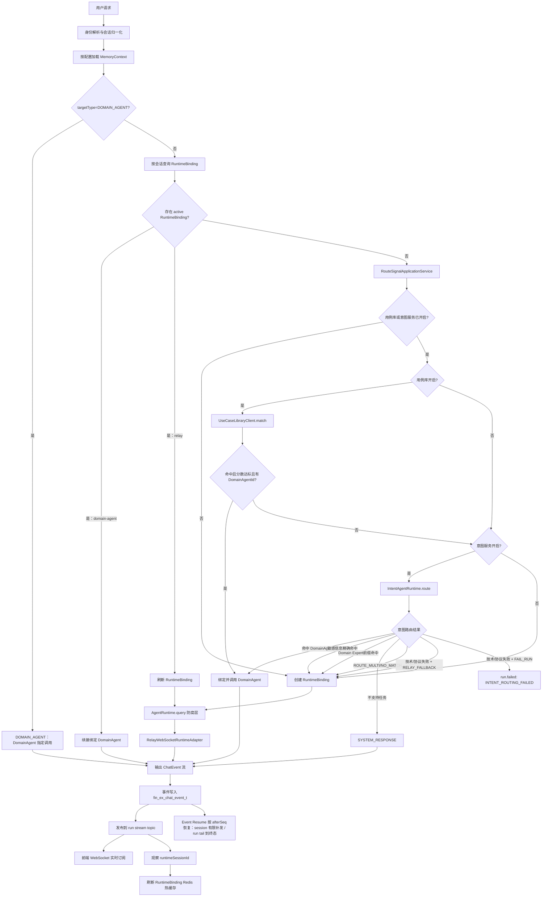

## 全局顺序图

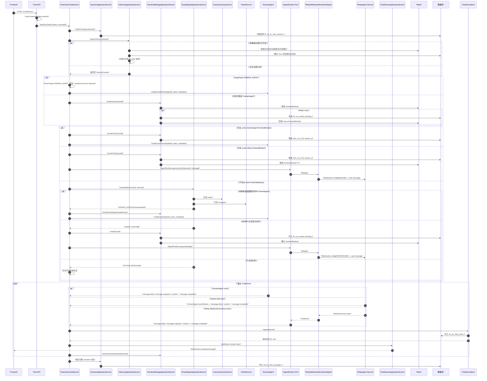

## 简化版全局时序图

下面的简化图只保留核心外部参与方和事实源，适合做整体链路评审。它省略了应用层内部服务、DomainAgent 细节、WebSocket/Event Resume handler 细节和 Runtime adapter 细节；前端 WebSocket 接入仍然保留，只是不在本图展开。

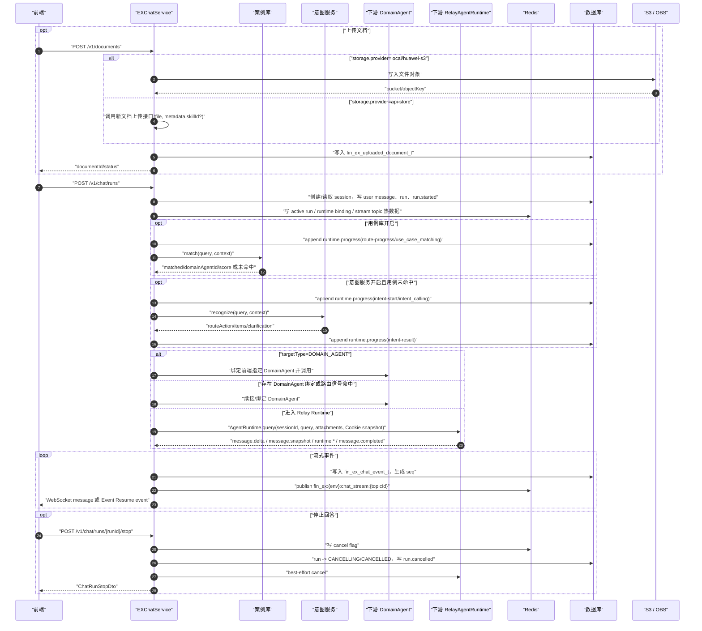

## 文档库与附件使用

文档能力采用“统一后端入口 + DocumentStorage 防腐层 + 文档库资产”的模式。

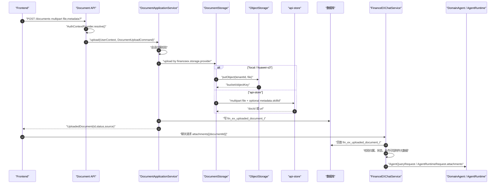

设计原则：

- 前端上传仍先进入 FinanceEXChatService，方便统一鉴权、审计、限流和企业网关接入。
- 真实文件内容由 `DocumentStorage` 决定去向：`local/huawei-s3` 写入本服务对象存储，`api-store` 转发新文档上传接口。
- 聊天请求只引用 `documentId`，不携带文件正文。
- DomainAgent 或 Runtime 看到的是经过文档库回查后的可信附件元数据。
- `fin_ex_uploaded_document_t` 是文档库事实源，支持最近文档、库中文档选择和后续连接器文档扩展。

## 流式响应与断点恢复

正式版只保留后台 run 创建模式。`POST /v1/chat/runs` 是唯一任务提交入口：普通提问、编辑历史 user、重新生成 assistant，以及等待态 Interaction 续接都走该接口，通过 `runMode` 区分。
本页新创建的 run 默认通过 WebSocket topic 接实时事件；新页签、新浏览器或跨电脑恢复已经存在的 active run 时，使用 run 级事件恢复先补发历史事件，再持续接续 live 事件直到本轮 run 终态。会话级事件恢复 仍只负责有限缺失事件补发。

```text
POST /v1/chat/runs
POST /v1/chat/messages/{messageId}/feedback
DELETE /v1/chat/messages/{messageId}/feedback
POST /v1/chat/messages/{messageId}/share
POST /v1/chat/shares
GET  /v1/chat/shares/{shareId}
DELETE /v1/chat/shares/{shareId}
GET  /v1/chat/shares?curPage=1&pageSize=20
POST /v1/chat/sessions
GET  /v1/chat/sessions/apps
GET  /v1/chat/sessions?appId=...&title=...&channel=mobile&limit=20&cursor=...
GET  /v1/chat/sessions/page?appId=...&keyword=...&channel=mobile&curPage=1&pageSize=20
GET  /v1/chat/sessions/{sessionId}
POST /v1/chat/sessions/{sessionId}/read
GET  /v1/chat/sessions/{sessionId}/messages?leafMessageId=...&limit=50
GET  /v1/chat/sessions/{sessionId}/messages/{messageId}/variants
POST /v1/chat/sessions/{sessionId}/path
POST /v1/chat/sessions/{sessionId}/branches
GET  /v1/chat/sessions/{sessionId}/events/resume?afterSeq={lastSeq}
GET  /v1/chat/runs/{runId}/events/resume?afterSeq={lastSeq}
GET  /v1/chat/sessions/{sessionId}/stream-status
WS   /v1/chat/ws subscribe(topicId=streamTopicId)
POST /v1/chat/runs/{runId}/stop
POST /v1/chat/sessions/{sessionId}/archive
POST /v1/chat/sessions/{sessionId}/restore
DELETE /v1/chat/sessions/{sessionId}
DELETE /v1/chat/sessions
```

各接口的最小入参示例、不同 `runMode` 场景请求体、Interaction 续接请求体、文档上传 multipart 示例和 WebSocket 控制消息示例，以 [前端联调文档](../frontend-integration.md) 的“逐接口最小入参示例”和“`/v1/chat/runs` 不同场景请求体示例”为准；本架构文档只维护流程边界和事实源职责，避免接口样例双写漂移。

`/v1/chat/runs` 只返回 run 运行标识和 run 级 `streamTopicId`，不返回 WebSocket、Event Resume 或 stop URL。
这些 URL 属于前端 SDK、网关或部署配置，避免后端业务响应承担客户端路由配置职责。

删除会话是软删除语义。若目标会话存在 active run，删除接口会复用 run stop 编排先写入取消标记、
发布 `run.cancelled` 并释放本服务 active run，再把会话置为 `DELETED`。前端删除会话时不需要串行调用
stop；删除成功后应立即移除会话并取消本地订阅。

## 消息树与只读分支

当前版本引入会话内消息树，但不改变现有流式协议。`POST /v1/chat/runs` 创建后台 run 时会先根据 `runMode` 解析消息树写入计划：

- `NEXT`：在 `parentMessageId` 或会话 `current_leaf_message_id` 后追加新的 user 消息，run 完成后追加 assistant 消息。
- `EDIT_USER`：校验 `editedMessageId` 是未锁定 user 消息，在原父节点下创建新的 user sibling，旧消息不变。
- `REGENERATE_ASSISTANT`：校验 `regeneratedMessageId` 是未锁定 assistant 消息，复用其父 user 消息，run 完成后创建新的 assistant sibling。
- `CONTINUE_INTERACTION`：提交 `interactionId` 对应的澄清、审批或确认响应。普通 `INTENT_CLARIFICATION` 使用 `NEW_TURN` 消息策略，回答生成新的 user 节点，下一轮澄清或最终回答生成新的 assistant 节点；`AMBIGUOUS_ROUTE` 和其他 Interaction 使用 `REUSE_ASSISTANT`，在不同 continuation run 中追加 parts 并更新原等待态 assistant。

`/runs`自动创建的新会话若首轮为附件-only，会在会话INSERT前提前执行同一次可信附件解析，仅将第一个附件名移除最后扩展名后作为AUTO初始标题；全部附件解析结果仍继续供消息、Intent和Runtime使用，不重复查询附件，也不执行标题UPDATE。预先创建的会话、后续附件-only轮次及前三问标题提炼规则不受影响。

会话标题总结位于 run admission 提交后的异步旁路，不加入 Intent、Runtime 或 ChatEvent 链。`SessionTitleApplicationService`先通过中立`SessionTitleAppExclusionProvider`判断当前可信会话AppId，再从当前 root-to-leaf 路径中筛选前三个 `NEXT/EDIT_USER` 有效业务问题，保持路径顺序和重复问题，经`SessionTitleProvider`调用 `/session_title`。默认排除Provider读取`excluded-app-ids`，配置项经trim、去空和去重后与`ChatSession.appId`原值做大小写敏感精确匹配；自定义Provider Bean可替换为HTTP、RPC或其他来源。判定及后续数据库读取均在标题专用异步调度链中执行，不阻塞Run；命中后不查询消息或Run、不占用标题并发许可，也不调用标题Provider。判定失败或返回空结果时记录告警并继续提炼；`appId=null`的主站会话继续提炼。`appliedQueryCount<3`时，第四轮及后续有效问题只作为补偿触发器，Provider请求仍固定携带前三问；成功提交完整三问版本后停止普通晚轮调用，已有自动标题不会因排除规则变化而回滚。每个实例使用非等待式 semaphore 限制完整标题Provider生命周期，默认最多8个在途请求；容量不足时跳过本次总结。应用边界设置30秒硬超时，默认 HTTP Provider 的显式超时不得超过该值。许可在成功、异常、超时或取消时释放，标题提交事务不占用许可。外部网络调用不持有数据库事务；结果返回后，`SessionTitleCommitService` 在独立2秒短事务中锁定会话行，并依据 `_titleSummary.appliedQueryCount/appliedNodeOrder` 拒绝多实例或乱序返回的旧结果。`DEFAULT/AUTO` 标题可被更新，显式标题和手动重命名为 `USER`，只读分支为 `LOCKED`；缺少该标记的存量会话按受保护数据处理。自动更新只写 `title/metadata_json`，不更新 `updated_at`，普通会话 touch 也只推进活动时间，避免旧快照覆盖标题状态或改变列表排序。请求字段 `language` 仅用于标题服务，空白时使用服务端默认值，不进入 metadata 或下游 Agent 请求。

会话表以显式 `app_id/app_name` 保存产品分组标签：`appId` 是大小写敏感的稳定查询键，`appName` 是创建时展示快照；`app_id IS NULL`定义为主站会话。两者不参与身份隔离，所有读取仍必须带 `tenantId + userId`；`/sessions/apps` 使用单条轻量窗口查询返回非删除会话中的去重分类，仍排除主站会话。列表可按 `appId` 精确过滤，或使用互斥的`appScope=MAIN_SITE`查询主站，并与精确`channel`组合。游标接口继续使用大小写不敏感的`title`包含搜索并绑定全部过滤条件，主站查询使用v5，既有v2/v3/v4继续兼容；页码接口改用`keyword`统一搜索标题及已持久化user/assistant正文，count与items在同一个默认2秒只读事务中完成，超时返回`SESSION_SEARCH_TIMEOUT`。`%/_/!`在应用层转义为普通字符，SQL使用参数化`ILIKE ... ESCAPE '!'`，不拼接用户输入。Ustore下不增加GIN或其他DDL，现有索引仅用于归属和单会话范围收敛。已有会话只接受与快照一致的显式tag和channel，分支继承源字段；这些字段不进入run metadata、RouteMemory或Agent请求。

会话未读状态采用服务端水位：`latest_message_seq` 是最新已保存、需要用户查看的 assistant 消息终态事件 sequence，`last_read_seq` 是前端确认展示到的位置，`latest > last_read` 即未读。两个水位由专用 SQL 单调更新，通用 session save 不覆盖；`run.completed(messageReady=true)` 和 `run.waiting_user` 在保存 assistant 的同一短事务内推进最新水位。`POST /sessions/{sessionId}/read` 原子执行 `max(lastRead,min(readThrough,latest))` 且不修改 `updated_at`，因此多页签不会回退或越过水位，也不会因阅读操作改变列表顺序。

`current_leaf_message_id` 表示当前会话激活路径叶子。历史消息查询默认返回 root 到 current leaf 的路径；指定 `leafMessageId` 时返回 root 到该 leaf 的路径。`/messages` 会在有多个 sibling 版本的消息上返回 `versionInfo`，包含当前版本序号、版本总数和候选版本的 `switchLeafMessageId`。前端切换版本时可以先用 `GET /messages?leafMessageId={switchLeafMessageId}` 刷新聊天区，再用 `POST /path` 持久化当前选择；`/variants` 保留为查询完整候选内容和调试的接口。

复杂前端或联调排障可以调用 `GET /v1/chat/sessions/{sessionId}/messages/tree` 读取完整可见消息树。该接口返回 `currentLeafMessageId`、`rootMessageIds` 和 `mapping`，但只包含业务可见的 user/assistant 消息，不返回 hidden system 或下游工具原始节点；普通聊天页继续使用 `/messages` active path。历史消息、tree 和 variants 返回的 `ChatMessageDto.attachments` 是消息附件展示快照，文件下载和预览仍由文档库接口独立鉴权。

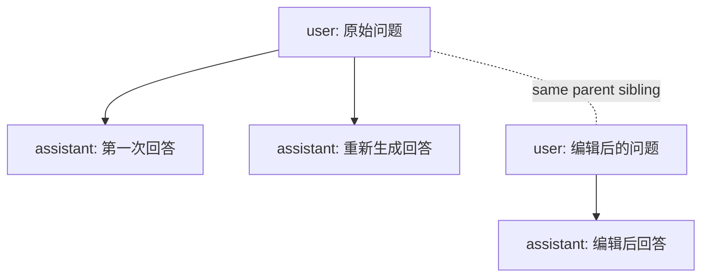

从某条消息新建会话分支时，服务端使用只读物化快照方案：沿 `parent_message_id` 回溯 root，复制该路径到新 session，并继承源会话 `appId/appName`；复制出的消息写入 `source_session_id/source_message_id`，并设置 `origin_type=BRANCH_SNAPSHOT`、`locked=true`。快照消息不能编辑、删除或重新生成；分支后续新增的 `NORMAL` 消息可以继续参与消息树版本管理。分支不继承源会话 RuntimeBinding，避免把源会话 Runtime session 错接到新分支。

## 聊天消息分享

分享功能不复用实时 event，也不在访问时回源读取原始会话路径，而是在创建时生成固定展示快照：

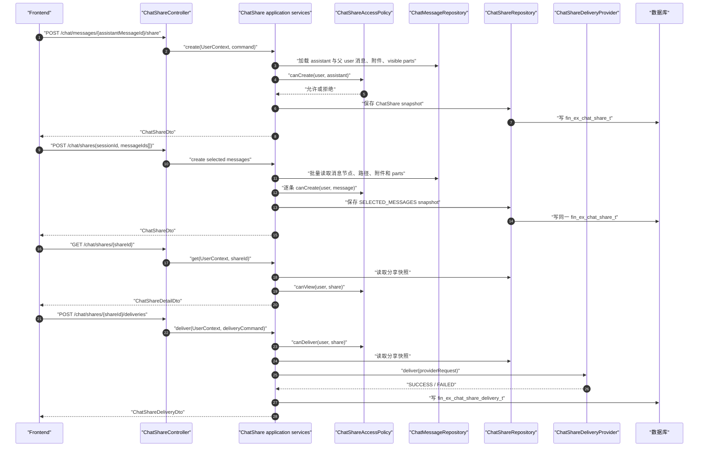

`ChatShareAccessPolicy` 是分享鉴权防腐层，默认规则为同租户可查看、仅创建者可撤销和发送。后续如果企业权限框架需要按组织、部门、用户白名单或外部 ACL 判断分享访问，只替换该 port 的 Spring bean，不修改 Controller、分享表或快照构造逻辑。

`SINGLE_TURN` 快照保存父 user 问题、assistant 回答、附件展示快照和 `visible=true` 的 parts。
`SELECTED_MESSAGES` 快照允许纯 user、纯 assistant 或混合消息，只保存前端明确选择且位于同一条
root-to-leaf 路径的节点，并按服务端路径排序；不会补齐中间消息。每条消息分别保存附件展示快照及
`visible=true` 的 parts。两种快照都不保存 feedback、隐藏/debug parts、Cookie、Authorization 或企业
鉴权信息，附件快照不授予下载/预览权限。原会话后续编辑、重新生成、切换 path 或反馈变化都不会影响
已经创建的分享。

多消息请求默认最多接收 50 个原始 ID，序列化后的 `snapshot_json` 默认限制为 5MiB。应用使用与持久化
相同的 Jackson 配置在写库前计算 UTF-8 字节数；数据库不设置大小 CHECK。查询路径使用一条批量消息
查询、一条 root-to-leaf 递归查询，以及附件和 parts 各一条批量查询，不按消息产生 N+1。纯 user 或纯
assistant 分享分别允许对应来源列为空，多消息 `source_run_id` 为空，避免用单个 run 表达跨 run 快照。
已部署环境必须先执行 `incremental-20260802-chat-share-selected-messages.sql` 再灰度新版后端；该脚本在结构上
只移除两个来源消息列的 NOT NULL，并同步分享相关数据库注释，不回填或修改存量分享。灰度期间新分享链接
需要固定路由到新版后端，旧实例仍可在放宽约束后的表上正常创建和读取原有 `SINGLE_TURN` 分享。

分享管理列表 `GET /v1/chat/shares` 使用独立的元数据投影，不查询 `snapshot_json`，也不在应用内构造或
反序列化固定快照。只有分享详情、分享发送及单条撤销等确实需要完整分享记录的链路才按 ID 加载快照，
避免单页多条大快照占用数据库传输、连接和 JVM 堆内存。分页响应字段和最大100条的后端限制保持不变。

分享发送通过 `ChatShareDeliveryProvider` 防腐层完成，首版 provider 为 `welink`。应用层只生成稳定的发送请求：分享人、标题、分享 URL、摘要、目标用户和目标群组；WeLink wire 字段如 `targetAccount/groupID` 只存在于 provider 实现中。发送正文严格取本次前端请求的 `content`，空值发送空字符串且不回退分享快照，非空值转换为纯文本并按配置截断；原始输入按UTF-16长度最多8192，超限时在清洗及Provider调用前拒绝。发送记录与 provider 请求复用同一个最终值。WeLink 出站请求会设置 `Referer`，默认取 provider `base-url`，也可用 `financeex.share.delivery.providers.welink.referer` 覆盖；分享发送入口捕获到的标准 `Cookie` 请求头只作为出站 header 透传，不进入 wire body、发送记录或快照。发送失败不会回滚分享快照，只在 `fin_ex_chat_share_delivery_t` 中记录 `FAILED`、错误码和 provider 安全响应摘要，前端可按同一个 `shareId` 重试。分享发送使用 `financeex.share.delivery.max-concurrency` 做当前 JVM 内并发隔离，防止外部 provider 抖动时占满异步工作线程；WeLink provider 失败后默认最多重试 3 次，运行时最多按 10 次重试生效。

删除会话时，`SessionApplicationService` 会同步撤销当前用户创建的该会话 `ACTIVE` 分享，避免用户删除会话后外部仍访问其快照。

## 集成服务鉴权

外部 HTTP 调用统一通过 `AuthHeaderProviderRegistry` 获取服务对服务鉴权请求头。该能力是集成服务调用防腐层，不读取前端请求 ThreadLocal，也不要求前端传 token。默认 `financeex.integration-auth.enabled=false`，不会改变现有调用行为。

首版内置 `none` 和 `sgov` 两种 provider。`sgov` 只向出站 HTTP 请求注入 `Authorization` header，具体凭据获取由企业实现的 `SgovTokenResolver` bean 负责。本服务不会把 Authorization、服务 ID 或密钥写入请求 body、数据库、事件、metadata 或前端响应。

当前只预置以下 serviceCode：`welink-share`、`intent-service`、`session-title`、`use-case-library`。Relay Runtime、DomainAgent 和文档存储 adapter 默认不走该鉴权层，仍保持现有 Cookie 透传或普通调用行为；后续如需启用，只新增 `financeex.integration-auth.services.<serviceCode>.provider=sgov` 配置。

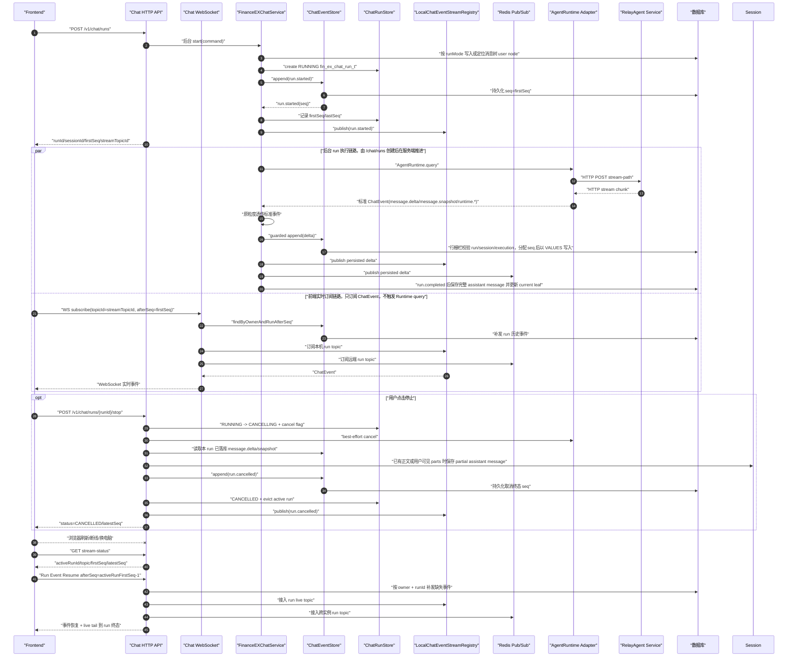

关键约束：

- `fin_ex_chat_event_t.seq` 是前端恢复游标，实时输出和补发输出使用同一份 seq；该序号由数据库 sequence/default 生成并随事件写入一起返回，应用层不再本地生成恢复游标。
- 数据库是事件事实源。生产默认使用 `financeex.chat-stream.live-source-mode=redis-only`，
  WebSocket 与 run 级 Event Resume live tail 只消费 Redis Pub/Sub，避免本机 local sink 与 Redis
  双源合并造成同一 topic seq 乱序；`LocalChatEventStreamRegistry` 保留为 `local-only/merge` 回退通道。
- 实时消费侧使用 `financeex.chat-stream.live-reorder-*` 做短窗口排序。排序只处理已经到达的事件，
  不合并事件、不改变 payload、不等待连续 seq，用于吸收 Redis listener 调度抖动带来的低 seq 迟到。
- 事件写入必须校验 `runId/sessionId/tenantId/userId` 一致；事件补发和 `latestSeq` 查询也必须携带 `tenantId/userId/sessionId/runId` owner 条件，不能按裸 runId 或 sessionId 查询。
- `fin_ex_chat_run_t` 是 run 生命周期事实源；Redis 只保存 active run 和 cancel flag。
- `fin_ex_chat_run_execution_t` 是 run 执行控制面事实源；实例 ID、心跳、租约、恢复状态和 `fencing_token` 都在该表中，避免把运维执行信息混入业务 run 表。
- 后台 run 不依赖创建 run 的原始浏览器连接，刷新页面后用 `afterSeq` 恢复。
- 前端 WebSocket 订阅消息格式：`{"type":"subscribe","topicId":"chat-run-{runId}","afterSeq":0}`。
- 前端 WebSocket 不触发 `AgentRuntime.query`，只补发和订阅 ChatEvent；它不接受聊天请求，仅支持 `connect`、`presence`、`subscribe`、`unsubscribe` 控制消息。
- 同一 WebSocket 连接允许同时订阅多个 session 的多个 run topic；协议层不会因切换会话自动释放旧 topic。订阅前按用户校验 `topicId -> run` 归属，live 流和 WebSocket envelope 投递前再按 `topicId + runId + sessionId` 校验，避免跨会话实时消息串线。
- stop 是 REST 生命周期接口，不是 WebSocket command；重复 stop 幂等返回当前 run 状态。
- 重新生成回答不再使用 run retry 接口，而是通过 `POST /v1/chat/runs` 携带 `runMode=REGENERATE_ASSISTANT` 和 `regeneratedMessageId`，在同一 user 节点下生成新的 assistant sibling。
- 会话 state 接口聚合会话元数据、最近历史消息和 `activeStreamTopicId`，用于前端切换会话后的恢复判断。
- 新页签、新浏览器或跨电脑恢复 active run 时，前端应使用 `activeRunFirstSeq - 1` 打开 run 级事件恢复；该接口会先按数据库事实源补发历史事件，再接入 live topic 持续输出到 run 终态，不能把 `latestSeq` 当作当前渲染实例已消费游标。

### Run 控制面与故障恢复

后台 run 的业务状态和执行状态分离：

- `fin_ex_chat_run_t`：业务生命周期事实源，记录 run 状态、路由类型、Runtime 信息、first/last seq 和取消原因。
- `fin_ex_chat_run_execution_t`：运行控制面事实源，记录当前 owner 实例、心跳、租约、恢复状态、恢复租约和 `fencing_token`。

控制面初始化是 run 启动的必备步骤。若业务 run 已写入 `fin_ex_chat_run_t`，但创建
`fin_ex_chat_run_execution_t` 失败，服务端不会继续调用 Runtime/DomainAgent，而是直接追加
`run.failed` 终态事件，payload code 为 `RUN_EXECUTION_INIT_FAILED`，并释放 active run。
此时没有可用 execution claim，因此不能绕过 fencing 继续输出。

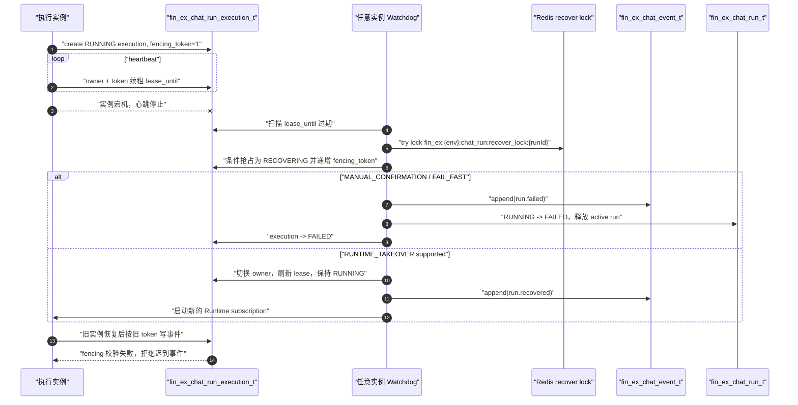

watchdog 是分层设计：`ChatRunWatchdogScheduler` 只负责按配置延迟、jitter 和周期触发；`ChatRunRecoveryOrchestrator` 负责候选拉取、容量检查、策略选择和指标日志；`ChatRunExecutionRepository` 负责数据库条件抢占；`StaleRunRecoveryStrategy` 负责具体恢复动作。默认策略链为 `MANUAL_CONFIRMATION,FAIL_FAST`，`RUNTIME_TAKEOVER` 仅在 Runtime 明确支持可靠恢复并提供 resume token 时使用。

stop/watchdog/execution 初始化失败使用 run 行 CAS 作为唯一外部终态写入准入：只有成功把 `RUNNING/CANCELLING` 条件更新为目标终态的调用方才能在同一短事务中写终态事件、释放 Interaction claim 并更新 execution；失败者不发布事件。`CANCELLING` 允许 stop 重试，stale `CANCELLING` 由 watchdog 闭合为 `run.cancelled`。外部终态事务默认限制为 10 秒，超时整体回滚。Interaction continuation 与普通 run 在 run 已创建但 execution 未创建时，分别由对应的默认 `2m` 宽限期 watchdog 扫描收敛；首事件握手超时还会主动异步提交 `RUN_FIRST_EVENT_TIMEOUT` 或释放尚未创建 run 的 Interaction claim。run.started 后的路由和 Runtime 外部调用边界会通过 run/execution 主键只读校验 owner 与 fencing token；普通流式事件在短事务中获取 run/execution 共享行栅栏，再以 `INSERT ... VALUES` 写入。

owner 的 completed/waiting 终态事务只写 OpenGauss 事实；短期记忆 Redis 缓存通过 Spring transaction synchronization 在提交后刷新。Redis 失败只影响热缓存，不能回滚或改写已提交的 run 终态。

所有治理类 `@Scheduled` 任务使用 `financeex.scheduler.pool-size` 配置的线程池调度器，避免 watchdog jitter 或慢巡检阻塞 run heartbeat、WebSocket 空闲清理和准入窗口清理。实例 ID 默认由 `GeneratedApplicationInstanceIdProvider` 在进程启动时生成；如需对接注册中心，提供新的 `ApplicationInstanceIdProvider` bean 即可替换默认实现。

恢复负载治理包含四层保护：每轮扫描候选上限、每轮最大 claim 上限、每租户 claim 上限、本机恢复和 takeover semaphore。没有恢复容量时不抢占，留给下一轮或其他实例处理，避免单实例在大批 stale run 场景下被恢复任务压垮。

### WebSocket 边界说明

当前系统存在两条职责隔离的 WebSocket：

- 前端 WebSocket：`/v1/chat/ws`，只连接 FinanceEXChatService。它是用户级连接，按 run 级 `streamTopicId` 订阅已经写入事件事实源的 ChatEvent；它不接受聊天请求，也不直接调用 RelayAgent。
- 下游 Relay WebSocket：FinanceEXChatService 主动连接 Relay，承载 `config -> user-message/approval-response`、流式 frame 和 `stop_all_agents`；前端不可见。

因此架构图中的 `AgentRuntime.query` 是应用层防腐层调用，不等价于前端 WebSocket。Relay provider 只注册一个 `RelayRuntimeProtocolAdapter` WebSocket 实现。

前端 WebSocket 的服务端入口按启动模式自动切换：

- Reactive WebFlux 应用：`ChatWebSocketConfig + ChatWebSocketHandler` 注册同一路径。
- Servlet/MVC 应用：`ChatServletWebSocketConfig + ChatServletWebSocketHandler` 注册同一路径。

两种 handler 都委托 `ChatWebSocketProtocolService` 执行 connect、presence、subscribe、
unsubscribe 和 recover-required 逻辑，避免协议实现分叉。企业框架自带
`spring-boot-starter-web` 时，Spring Boot 会默认选择 Servlet/MVC 启动，此时应使用
`server.servlet.context-path` 配置上下文根；纯 WebFlux 启动时才使用 `spring.webflux.base-path`。
Servlet/MVC WebSocket 会在 `HandshakeInterceptor.beforeHandshake` 阶段调用
`AuthContextProvider.resolve()`，并把不可变 `UserContext` 写入 WebSocket session attributes；
`afterConnectionEstablished` 和后续消息处理只读取该快照，不再访问企业 ThreadLocal。

MVC/Servlet 生产模式增加了长连接治理层：`financeex.websocket.allowed-origin-patterns`
限制握手来源，`max-connections-per-user`、`max-subscriptions-per-connection`、
`max-subscribers-per-topic`、`outbound-queue-size`、`live-buffer-capacity`、`idle-timeout`
以及 `servlet-send-*` 限制本机连接资源。Servlet WebSocket 的底层发送是阻塞调用，
服务端会先把 envelope 放入单连接有界队列，再由全局发送 executor 串行 drain 当前连接，
避免慢客户端把 Runtime、Redis fanout 或 scheduler 线程卡在 socket send 上。WebSocket 与 run 级事件恢复通过
`financeex.chat-stream.turn-heartbeat-interval` 发送 turn stream `heartbeat`，配合
`spring.mvc.async.request-timeout` 与 Tomcat 连接配置避免空闲断流。WebSocket 实时投递
出现慢客户端、发送队列溢出或乱序时关闭当前连接或返回 `RECOVER_REQUIRED`，可靠恢复仍走数据库事件 + Event Resume。
流式事件合并后的落库、run 状态推进和实时发布统一切到 `financeex.chat-stream.event-io-executor-*`
专用调度器，避免阻塞式 DB/Redis 调用占用 Reactor `parallel-*` timer 或 Servlet 请求线程。
Relay/DomainAgent 普通运行事件在该调度器上按同一 run 批量落库，默认以 `16 条 / 20ms / 256KB`
三重阈值中最先命中的条件提交。每个批次只获取一次 run/execution 共享栅栏、分配一次 sequence 集合并执行
一次批量 `INSERT ... VALUES`；控制事件和终态事件会先刷新批次再沿用原单事件事务。批量提交后事件仍按 seq
逐条发布，不跨 run 组批，也不改变 IntentAgent、Interaction、拒答和 owner 终态事务。
assistant 终态事务中的 message parts 同样使用多行 `INSERT ... VALUES`，按默认 `100 条 / 1MB`
中先达到的阈值拆批，不再逐 part 执行单行 INSERT。
Redis Pub/Sub 是默认实时 fanout 通道，跨实例发布使用 `financeex.websocket.redis-publish-*` 有界后台队列；同一 run topic
串行发布并做短重试，发布缺口会通过恢复控制消息转成 `RECOVER_REQUIRED`。
实时消费侧默认用 `financeex.chat-stream.live-reorder-window=20ms` 和
`financeex.chat-stream.live-reorder-max-events=128` 对短窗口内事件按 seq 排序，避免同一 topic 中
后写事件先到达时误触发 seq rollback；该阶段不改变事件粒度。
run 级 Event Resume 正常优先接入 Redis live topic；如果 live source 异常，会以恢复错误结束当前实时 tail，
前端退避后重新 resume；服务端不做循环 DB polling，避免 Redis 抖动时把压力转移到数据库。
前端接收的 `message.payload` / SSE `data` 是 `conversation-turn-stream`，真实 ChatEvent 位于
`stream-item.encodedItem.data`；`heartbeat` 和 `done` 只是传输层状态，不写入 `fin_ex_chat_event_t`，
也不推进 `afterSeq`。

文档上传同样按启动模式做接口层适配：Servlet/MVC 注册 `MvcDocumentUploadController`
并接收 `MultipartFile`，纯 WebFlux 注册 `ReactiveDocumentUploadController` 并接收
`FilePart`。两种 Controller 都委托 `DocumentUploadSupport`，由它先把上传流写入临时文件，
再通过 `DocumentFacade -> DocumentStorage` 按 `financeex.storage.provider` 选择 `local`、`huawei-s3`
或 `api-store`。前端看到的路径、字段和响应始终是同一套
`POST /v1/documents` 契约。api-store 可通过 `financeex.storage.api-store.forward-cookie=true`
允许上传入口 Cookie 作为下游 upload HTTP header 透传；普通对象存储实现不使用该 Cookie，
且 Cookie 不进入 multipart form、文档元数据或前端响应。

## 分层架构

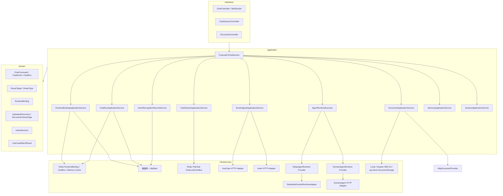

## 路由规则

- `targetType=DOMAIN_AGENT,targetId=...` 优先级最高；存在时进入 `DOMAIN_AGENT` 路由并绑定对应 DomainAgent，`routeSource=front-selected`。`runMode=NEXT` 直连可原子取消会话下开放的 `WAITING/RESPONDING` Interaction 并解除等待，但不抢占真正执行中的 run；旧等待 run/message 保留，新 user 节点挂在等待 assistant 后。直连只使用本轮 message/metadata/attachments，取消当前 ACTIVE binding、保留历史 RESUMABLE Relay session。可选 `selectedIntent` 只作为展示摘要写入 binding；后续复用 binding 时用于补齐 `selectedDomainAgent` 历史 part，不参与路由或下游请求。
- active RuntimeBinding 优先级次之；`provider=domain-agent` 时续接当前 DomainAgent，`provider=relay` 只用于未闭合或等待用户输入的 Relay 任务。Relay 正常完成后转为 `RESUMABLE`，下次普通提问仍重新路由；再次选择 Relay 时，只恢复 Runtime Profile、`appMode` 和 `roleName` 都匹配的 session。存量无 Profile Binding 按 `DELEGATE` 兼容。
- 用例库和意图服务是可选路由信号，默认关闭；关闭时不调用外部 API。
- 用例库开启时优先匹配；命中阈值默认 `0.85`，命中并返回 DomainAgent 路由目标后绑定为 DomainAgent。
- 用例库关闭或未命中后，只有意图服务开启才调用 `IntentService`。
- 外部路由在 run pipeline 内执行，`run.started` 会先落库和推送；调用用例库前输出 `runtime.progress(sourceType=route-progress,stage=use_case_matching)`，调用 intent-agent 前输出 `runtime.progress(sourceType=intent-start,stage=intent_calling)`，意图裁决后再输出 `sourceType=intent-result`，避免慢路由阶段让前端长时间无反馈。
- 意图服务 adapter 的 HTTP 请求体和响应体转换由 infrastructure intent mapper 承载。`financeex.intent.invocation-mode` 默认 `STREAMING` 并调用 `/getIntentDecisionStream`；显式设为 `BLOCKING` 时调用 `/getIntentDecision`，不按 Content-Type 自动切换接口。两种模式使用相同请求 mapper 和结果 mapper，均以完整响应中的 `data.result.routeAction` 作为唯一裁决点。
- SSE 模式只消费 `progress/delta/result/error`。`progress` 和 `delta` 分别映射为 `runtime.progress(sourceType=intent-progress)` 与 `runtime.thinking(sourceType=intent-delta)`，按原顺序进入事件事实表和实时通道；`intent-start/intent-progress/intent-delta` 不进入历史 parts 或分享，`intent-result` 仍进入历史 part。`intent-progress/intent-delta` 参与普通事件批量落库，result 到达前会先刷新待处理批次。ping 注释不生成事件，只有完整 `result` 驱动路由；合法 `CLARIFY` 不重试。企业鉴权 Header 在独立有界调度器获取，完成后才开始 SSE 首事件和总时长计时。SSE error、HTTP 错误、异常断流和协议错误仍使用现有重试与 failure strategy。
- DomainAgent 技能配置明确返回 `isSaveSession=N` 时，本轮策略收紧为 `ASSISTANT_PLACEHOLDER`：普通 `message.*` 与下游 `runtime.*` 业务 Event 只分配全局 sequence 并经本机/Redis 实时发布，不进入事件表；Intent、路由、拒答、WAIT、确认和 run 终态仍持久化。`stream-status.latestSeq` 只表示最新持久化位置，Event Resume 不补发 live-only 业务内容。同一 run 后续切到 Relay 也不会放宽策略，普通 Relay run 仍使用 `FULL`。技能配置策略默认使用 Redis 缓存；`financeex.agent-data-persistence.cache-enabled=false` 时每次新的策略解析都绕过 Redis 实时查询 Provider，Interaction continuation 仍继承 source run 已固化的策略。
- RouteMemory 是独立于普通短期/长期记忆的路由事实源。`ROUTE` 表示最终目标已确定且 RuntimeBinding 已持久化的路由决策，不要求下游任务完成。应用层在调用 Runtime 前通过独立 write executor 异步记录；任务失败、取消或 DomainAgent 拒答不撤销该事实。调用意图服务前加载最近 TopK 可见 `ROUTE` 和当前未完成的 `CLARIFY`，统一组装为 `conversationContext.history`。`routeSource=front-selected` 继续落库并参与最新实际路由判断，但在 TopK 前过滤且不进入 Intent history；`user-confirmed` 与 `intent-agent` 仍进入 history。已有 binding 的普通续接和 Agent Interaction 续接不新增 route。
- `conversationContext.routeTrigger` 由 ChatService 生成：普通无绑定首次路由为 `first_turn`，上一轮有效 route 是 Relay/no_match 时为 `fallback_followup`，DomainAgent 结构化拒答后的重路由为 `domain_reject`，用户回答意图澄清后为 `clarify_answer`。前端可在 `/v1/chat/runs` 顶层传 `forceReroute=true` 表示用户主动纠正路由，后端会转成内部用户纠正触发原因；`AGENT_CLARIFICATION` 和 `ROUTE_SWITCH_CONFIRMATION` 不进入意图 history。
- 意图服务的技术失败和协议失败默认最多重试 3 次；配置误设过大时运行时最多按 10 次生效。重试耗尽后读取 `financeex.intent.failure-strategy`：`RELAY_FALLBACK`（默认）创建 Relay binding 并执行原问题；`FAIL_RUN` 不创建 RuntimeBinding、不调用 Runtime，以 `INTENT_ROUTING_FAILED` 结束并提示用户手动选择技能。该策略同样覆盖意图澄清续接和 DomainAgent 拒答后的重新意图。
- 意图服务返回 `WAITING_CLARIFICATION` 或兼容的 `TaskComplexity.NEED_CLARIFICATION` 时生成 `run.waiting_user(interactionType=INTENT_CLARIFICATION)`，不创建 RuntimeBinding。普通澄清问题以 `assistantSource=intent-agent` 的独立 assistant 消息保存；用户通过 `POST /v1/chat/runs` + `runMode=CONTINUE_INTERACTION` 提交答案、附件和本轮 metadata，文档事实解析在 Interaction claim 前完成，随后短事务原子保存新的 user 回答及附件、continuation run，并将旧 Interaction 标记为 `ANSWERED`。多轮附件 ID 仅保存在 Interaction 内部上下文，最终路由后以累计可信文档的完整 `providerDocument` 覆盖最终轮 metadata 的 `sceneParam.docList`，DomainAgent 与 Relay 使用相同对象。
- `clarificationType=AMBIGUOUS_ROUTE` 使用同一 `WAITING_USER + CONTINUE_INTERACTION` 状态机，但采用 `REUSE_ASSISTANT`。意图候选 `accessName` 先移除一次通用响应前缀并规范化为 `skillId`；用户指定候选或提交 `interactionAction=AUTO_SELECT` 时跳过 IntentAgent，分别采用 `user-confirmed` 或 `user-delegated-auto-selected`。敏感信息候选创建 `DELEGATE` Relay Binding，专家候选移除专家前缀后以剩余后缀作为动态 `roleName` 创建 `DOMAIN_EXPERT` Relay Binding，其他候选创建 DomainAgent Binding。用户未提交选择字段而提交文本或附件时按“其他”重新调用 IntentAgent。服务端默认生成 `30s` 后的 `autoSelectAt`，前端到期后调用同一 `AUTO_SELECT` 接口；最高 confidence 相同时按原候选顺序。多页签提交竞争同一 Interaction CAS，最多一个成功。
- 歧义路由 run-A 保存候选卡片、assistant 和 WAITING Interaction 后终止；run-B 使用新的 runId，但复用 Interaction 关联的原 user/assistant。候选选择响应、`selectedDomainAgent`、Runtime 过程和最终 ANSWER 作为 run-B parts 追加到原 assistant，消息表不增加新的可见 user/assistant 节点。新附件只允许在“其他”路径提交，并追加到原 user 消息及累计 docList。后端不注册本机定时任务，也不保留入口 Cookie/metadata；没有在线前端时 Interaction 保持 `WAITING`，页面恢复后根据 `stream-status.autoSelectAt` 触发代选。
- 已落库的旧 `selectionSource=TIMEOUT` 或 `routeSource=intent-timeout-auto-selected` 仅作为历史事实保留，不迁移、不回写；新流程不再生成这两类值。
- 意图服务返回 `routeAction=ROUTE_SINGLE` 时，取唯一 `items[0].accessName`，按可选 `response-access-name-prefix` 移除一次匹配的通用前缀。规范化值先区分大小写精确匹配可选的 `sensitive-information-access-name`，命中后路由到 Relay `DELEGATE`；否则匹配显式配置的 `domain-expert-access-name-prefix`，命中后移除一次专家前缀并 trim，剩余后缀作为 Relay `DOMAIN_EXPERT` 的动态 `roleName`；均未命中时作为 DomainAgentId/skillId。敏感精确匹配优先于专家前缀，空敏感配置表示关闭。敏感 run 通过可信 run 私有标记启用答案流模式：Relay 标准化后仅放行答案帧、`session-ready/session-state`和 questionnaire，其他过程事件在公共 Event 管线前丢弃；标记不写 Binding，普通 Delegate run 保持完整流。前端直连同名 DomainAgent 不触发这两种转换。调用 Runtime 前，服务端以本轮可信附件的完整 `providerDocument` 覆盖 `sceneParam.docList`；`ROUTE_MULTI/NO_MATCH/RELAY_FALLBACK` 仍进入 Relay `DELEGATE`。`NO_MATCH` 的展示名称及失败策略保持不变；缺少 item、有效 `accessName` 或专家角色后缀均是协议失败。
- 意图澄清可能多轮连续发生。每次 `CLARIFY` 会在 `run.waiting_user` 与 Interaction request 成功落库后追加一条 RouteMemory `CLARIFY`；最终目标 binding 成功后，在单个写任务中折叠 clarify 并追加 route。`AMBIGUOUS_ROUTE` 直接选择不会再次产生 `intent-result`，但 Binding 成功后仍按选中的真实 `intentId/intentName/skillId` 记录 route，query 使用原问题和此前已完成澄清的折叠文本，不包含按钮文案。普通 DomainAgent、敏感信息 Delegate 和 Domain Expert 的 `ROUTE_SINGLE` 都保存真实 `intentId/intentName/skillId`；只有 `DELEGATE` 的 `ROUTE_MULTI/NO_MATCH/RELAY_FALLBACK` 保存 `intent=no_match,intentCode=relay`。最新 Relay no_match route 只有关联的 source run 为 `COMPLETED` 才触发下一轮 `fallback_followup`。DomainAgent 拒答后原 route 保留，自动切换成功会再记录新 route；手动候选必须确认且 binding 成功后才记录。`FAIL_RUN` 不写 route。
- 澄清续接调用 intent-agent 时顶层 `query` 是最新回答，`history` 是原始问题和已完成澄清链；最终进入 DomainAgent/Relay 时，Runtime `query` 改为折叠后的完整问题。用户回答 admission 成功后即成为消息事实，即使后续 run 失败、取消或首事件超时也不退回旧 Interaction；admission 提交前失败才恢复 `WAITING`。

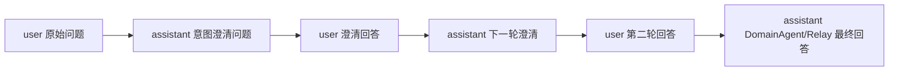
- `financeex.intent-record.enabled=true` 时，只有实际调用过意图服务的 run 会异步写入 `fin_ex_intent_recognition_t`。记录内容包含本轮 query、routeAction、候选 items、最终路由是否采纳和意图服务耗时；DomainAgent、RuntimeBinding 续接、用例库已命中、意图服务关闭时不会记录。
- `routeAction=ROUTE_MULTI` 和 `routeAction=NO_MATCH` 都是合法业务结果，无论 failure strategy 如何配置都进入 Relay Runtime。意图关闭时仍直接进入默认 Relay；只有已启用意图的技术/协议失败才应用 failure strategy。
- DomainAgent 绑定会一直续接，直到下游流式返回 `type=agent.refusal,code=FN-EX-CAHT-BIZ-DAG-001`。ChatService 通过控制事件防腐层归一化并立即取消旧流：意图/用例库绑定自动切换；`front-selected/user-confirmed` 绑定默认生成 `ROUTE_SWITCH_CONFIRMATION`，候选 DomainAgent 或 Relay 均需用户确认，但重意图仍返回当前技能时因目标未变化而直接重新调用。该确认与 AMBIGUOUS_ROUTE 共用 `financeex.intent.ambiguous-route-wait-timeout`，前端到期后通过现有 `approved=true` 请求自动同意，后端不持有定时任务。ChatService 不再排除当前或曾拒答技能，完全采用 Intent 结果，并以 `financeex.domain-agent.max-reroutes` 作为循环保护。`financeex.domain-agent.refusal-auto-switch-enabled=true` 时，手动来源也会在拒答事实提交时原子取消旧 Binding，并直接执行重意图得到的有效目标；IntentAgent 返回 `CLARIFY` 时仍保留意图澄清等待，后续每轮 `clarify_answer` 均携带触发当前澄清链的拒答原因。

## RuntimeBinding

RuntimeBinding 维护前端 chat session、当前消息树 leaf 与当前下游会话的关系。当前 provider 包括 `relay` 和 `domain-agent`。leaf 维度隔离可以避免编辑历史问题、切换版本或从历史消息新建分支时误用另一条路径的下游 session。

Relay Binding 还保存内部 `runtimeProfile/relayAppMode/relayRoleName` 快照。`DELEGATE` 与不同动态角色的
`DOMAIN_EXPERT` 可在同一 ChatService 会话中分别保留 `RESUMABLE` 记录，解析时按
`profile + appMode + roleName` 完整档案筛选并只清理完全匹配档案的重复项；缺少 Profile 的存量 Binding 按 `DELEGATE` 解释，专家 Binding 缺少 `relayRoleName` 时失败关闭。档案同步写入 run 私有
`_relayRuntimeProfile` 供跨实例 stop 恢复，但会在接口入口清理，且不会进入 Event、RouteMemory 或下游业务 metadata。

```text
Redis key:
fin_ex:{env}:runtime_binding:{tenantId:userId:sessionId}:{leafMessageId}
fin_ex:{env}:runtime_binding:index:{tenantId:userId:sessionId}

数据库表:
fin_ex_runtime_binding_t
```

字段包括：

```text
id
tenant_id
user_id
chat_session_id
provider
leaf_message_id
runtime_session_id
status
last_run_id
expires_at
metadata_json
created_at
updated_at
```

DomainAgent Binding 的 `metadata_json` 可以保存前端本轮显式提交的 `agentMode` 完整快照。该记录不跨
DomainAgent、Relay 或 Interaction 继承，也不转换或透传到 IntentAgent、DomainAgent、Relay。复用同一个
active DomainAgent 时，未传模式表示不更新、非空快照表示完整替换、空 `selections` 表示清除；创建新
DomainAgent Binding 且未传模式时不记录。Relay Binding 始终不记录。查询端只通过
`stream-status.bindingAgentMode` 返回当前 active DomainAgent 的记录，实时事件和历史 parts 不携带该字段。
完整规则参见 [AgentMode 仅记录技术设计](agent-mode-recording.md)。

## ChatRun 与 Stop

ChatRun 维护单轮回答生命周期，表为 `fin_ex_chat_run_t`，Redis key 为：

```text
fin_ex:{env}:chat_run:active:{tenantId}:{userId}:{sessionId}
fin_ex:{env}:chat_run:cancel:{runId}
fin_ex:{env}:chat_stream:{streamTopicId}
```

状态流转：

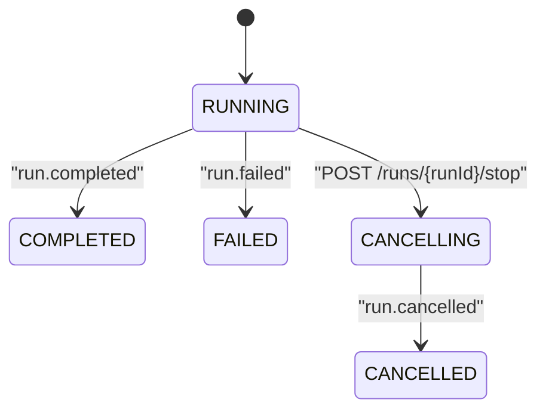

stop 语义：

- 集群事实源优先：stop 先写 Redis cancel flag 与数据库 `CANCELLING` 状态，再发布 `run.cancelled`。
- JVM subscription registry 只是本机资源释放加速器；即使 stop 请求与输出流落在不同实例，输出实例也必须在追加事件前读取 Redis cancel flag。非终态事件通过数据库行栅栏同时校验 run 状态、session 归属和 execution fencing，栅栏持有到后续 `VALUES` 写入提交。
- 用户主动 stop 且已有 assistant 正文或用户可见 runtime parts 成功落库时，会从事件事实源重建并保存 partial assistant 历史消息，消息 metadata 标记 `partial=true`、`finishReason=USER_STOP`；只有 trace、domain-agent session 等内部 metadata 时不创建空 assistant。
- 下游尽力取消：Relay 本机命中 active WebSocket 时发送 `{"type":"stop_all_agents"}`；跨实例或本机连接已清理时用临时 WS `resume` 到 run 中已回填的 Relay `runtimeSessionId`，收到 `session-ready` 后发送 `stop_all_agents`；DomainAgent 走 DomainAgent cancel adapter。这些下游取消失败只记录日志，不影响前端收到本服务 `run.cancelled` 终态。
- 运行态 stop 不改变 RuntimeBinding 的既有生命周期；等待态 stop 会条件取消 Interaction 精确引用且仍由该等待链持有的 ACTIVE Binding，并保留无关的历史 `RESUMABLE` Relay Binding。历史 run-A 继续保持 `WAITING_USER`。

## 外部 API 接入

- 用例库服务：`financeex.use-case-library.enabled`、`financeex.use-case-library.base-url`、`financeex.use-case-library.match-path`
- 意图服务：`financeex.intent.enabled`、`base-url`、`access-name`、`response-access-name-prefix`、`sensitive-information-access-name`、`domain-expert-access-name-prefix`、`no-match-agent-name`、`invocation-mode`、`recognize-path`、`recognize-stream-path`、`confidence-path`、`trace`、`confidence-threshold`、`timeout`、`stream-first-event-timeout`、`stream-idle-timeout`、`stream-total-timeout`、`stream-auth-timeout`、`stream-auth-io-max-size`、`stream-auth-io-queue-capacity`、`candidate.max-concurrency`、`candidate.auth-io-max-size`、`candidate.auth-io-queue-capacity`、`candidate.retry-min-backoff`、`candidate.retry-max-backoff`、`ambiguous-route-wait-timeout`、`max-retries`、`failure-strategy`。`invocation-mode` 只接受 `BLOCKING/STREAMING` 且默认 `STREAMING`；候选查询使用独立并发闸门和鉴权调度器，仅瞬态HTTP故障退避重试，不挤占普通路由鉴权资源；可选的 `response-access-name-prefix` 先归一化候选，可选的 `sensitive-information-access-name` 以区分大小写的精确匹配优先选择 Relay Delegate，随后显式且非空的 `domain-expert-access-name-prefix` 以前缀匹配选择 Relay 专家模式并将后缀作为动态 `roleName`；意图功能开启但专家前缀未配置时启动失败。`ambiguous-route-wait-timeout` 默认 `30s`，同时控制 AMBIGUOUS_ROUTE 代选与拒答路由切换确认的前端截止时间；其余重试和展示配置保持原语义。
- 意图识别记录：`financeex.intent-record.enabled`、`max-query-length`、`max-raw-json-length`、`executor.*`。默认关闭；开启后使用 Servlet/MVC 友好的专用线程池 best-effort 写库，线程池拒绝、JSON 序列化失败或数据库写入失败都只记录 warn，不阻塞 `/v1/chat/runs`。
- RouteMemory：`financeex.route-memory.top-k` 控制传给意图服务的最近成功 route 数量，`financeex.route-memory.max-clarification-rounds` 控制单条澄清链路的最大轮数，超过后降级 Relay Runtime，避免无限澄清。读写线程池分别由 `read-executor.*`、`write-executor.*` 控制；`read-timeout` 超时后会取消读取 future，并按 `circuit-breaker.*` 短暂熔断，熔断期间直接返回空 history。
- DomainAgent：`financeex.domain-agent.base-url`、`referer`、`chat-path`、`stop-path`、`timeout`、`stream-idle-timeout`、`stream-total-timeout`。chat、绑定续接与 stop 都发送可信服务端 `Referer`；未配置时回退到 `base-url`，不允许前端覆盖，也不写入 body 或持久化数据。查询的原始响应 chunk 空闲超时默认 `300s`，从 HTTP 订阅开始的绝对总超时默认 `15m`；旧环境变量 `FINANCEEX_DOMAIN_AGENT_TIMEOUT` 默认 `120s` 并继续控制 stop，在新查询超时变量未配置时作为兼容回退。
- DomainAgent 拒答重路由：固定控制编码 `FN-EX-CAHT-BIZ-DAG-001`、`financeex.domain-agent.max-reroutes` 和 `financeex.domain-agent.refusal-auto-switch-enabled`。自动来源以及开启自动切换后的手动来源，其拒答 event 与 binding 取消在有超时的短事务中原子提交，并由独立 control IO scheduler 承接阻塞数据库操作；Runtime 订阅前失败产生的 Binding 条件补偿同样使用该隔离池，通过 `binding-compensation-transaction-timeout-seconds` 限制单次数据库等待，并按 `binding-compensation-max-attempts/binding-compensation-retry-backoff` 有限重试。事务提交后先发布事件和放行重意图，Redis binding 缓存仅异步 best-effort 同步。自动切换默认关闭，修改配置后需重启实例生效。
- AgentRuntime fallback provider：`financeex.agent-runtime.default-provider`，没有 active binding 时的兜底 provider，默认 `relay`
- Relay WebSocket：`financeex.agent-runtime.relay.websocket.url`、`app-mode`、`connect-timeout`、`config-handshake-timeout`、`max-run-duration`、`heartbeat-interval`、`heartbeat-response-timeout`、`interrupt-ack-timeout`、`idle-timeout`、`max-frame-bytes`，以及 `financeex.agent-runtime.relay.domain-expert.app-mode`。Delegate 默认 `appMode=delegate`，专家默认 `appMode=domain_expert`；两项模式配置 trim 后必须非空，专家 `roleName` 来自 Intent accessName 的动态解析结果。Relay 启用时 `url` 必填；专家 config 兼容明确的 `system: Ready to chat`，Delegate 仍只接受 `session-ready`。`financeex.relay.questionnaire-wait-timeout` 默认 `0s`，只生成前端忽略问卷的绝对截止时间。
- 下游 Cookie 透传：`financeex.agent-runtime.forward-cookie.enabled`、`max-length` 控制run/stop入口Cookie快照。Relay WebSocket、DomainAgent chat/cancel和DomainAgent技能配置查询使用该内存快照；技能配置缓存开启且命中时不发起HTTP查询，关闭缓存时每次策略解析都发起查询。文档上传另由`financeex.document.forward-cookie-max-length`与`financeex.storage.api-store.forward-cookie`控制，默认关闭api-store upload Cookie透传。
- 流式事件粒度：当前生产版本不合并 `message.delta`，事件仍按下游标准粒度写入事件表并推送实时通道。Relay/DomainAgent 普通事件以及 IntentAgent 的 `intent-progress/intent-delta` 仅在提交层由 `financeex.chat-stream.event-batch-*` 按同 run 组批，默认 `16 条 / 20ms / 256KB`，关闭开关后恢复逐事件事务；`intent-start/intent-result`、Interaction、拒答和终态不参与批量，并会先刷新待提交事件。`delta-coalesce-*` 仅作为内容合并兼容预留，`turn-heartbeat-interval` 只控制传输层 heartbeat。
- Servlet WebSocket 发送治理：`financeex.websocket.servlet-send-executor-core-size`、`servlet-send-executor-max-size`、`servlet-send-queue-capacity`、`servlet-send-queue-max-bytes`、`servlet-send-use-virtual-threads`。默认使用有界平台线程池和单连接有界队列；JDK 21 虚拟线程可按企业压测结果开启。
- DomainAgent 结构化帧：`financeex.domain-agent.max-pending-frame-bytes` 是完整及未完成单 frame 的硬上限，默认 `256KB`。`diyCardScene/openCard/specificSceneInfo/searchList/sourcesDocuments/processResult` 跨网络 DataBuffer 时使用请求级增量 UTF-8 解码和有界 JSON 累积，闭合后输出单个完整 `runtime.card/runtime.reference/runtime.progress`；独立 `contentAgent` 帧作为自定义卡片内部 MD 逐帧输出 `runtime.card`，历史投影在 DomainAgent 拒答或新结构化卡片边界合并为可见 `CARD` part，仅保存 `payload.contentAgent` 而不重复写入 `contentText`，也不进入 assistant 正文。`specificSceneInfo` 同样映射为可见 `CARD` part并进入新创建的分享快照。超限直接按协议错误结束，不输出残缺事件。`max-fragment-bytes` 仅为旧部署配置兼容保留，不再控制 DomainAgent 对外事件。
- DomainAgent `openCard`卡片会把同帧`recommendedQuestions`完整保存在payload中，但不将其加入`cardSources`，因此既有卡片分类保持不变。
- DomainAgent `searchList`引用会把同帧`metadata`保存在相同的reference payload中；该规则不扩展到`sourcesDocuments/sourceDocuments`。
- Relay 响应映射：`financeex.agent-runtime.relay.answer-event-types`、`answer-content-fields`、`agent-context-as-answer`。默认把 Relay `type=agent,is_streaming=true` 的 `content/context` 映射为 assistant 正文增量 `message.delta`，把 `type=agent,is_streaming=false` 和 `type=generate-response,content非空` 映射为最终回答快照 `message.snapshot`。正式 WebSocket 轮次只在 `session-state.state=completed/waiting_user_input/paused` 后生成一次 `message.completed`；`idle`、`agent-call(false)`、`generate-response(is_final=true)`、`steam-complete/stream-complete/[DONE]` 均不参与终态判断。`expert_rejection` 映射为可见 `runtime.card`。

DomainAgent 当前通过 HTTP 文本流调用，并和 Relay Runtime 一样以 `AgentRuntime` provider 注册，使用 RuntimeBinding 保存下游会话 ID、绑定来源和意图摘要。DomainAgent 请求会把 `runId/messageId/skillId/query/sessionId` 固定为服务端当前Run、可信user消息、当前绑定和本轮问题，前端 metadata 只作为业务扩展，不能覆盖这些保留字段。可选异步协议收到 `agent.async_started` 后会保存原assistant和 `run.async_running`，把execution转为无owner的`ASYNC_WAITING`并结束原HTTP流；第一版回调只提交完成状态并发布`run.async_finished`，不覆盖正文或Parts；回调、stop和超时通过同一run终态CAS竞争。当前上线版本内置 `RelayAgentRuntime` 与 `DomainAgentRuntime` 两个 provider；Relay provider 唯一委托 `RelayRuntimeProtocolAdapter` 的 WebSocket 实现。Relay WebSocket 始终使用短连接，每个 run 都重新建立下游 WS；首轮 `new` 的 `config.sessionId` 使用 ChatService `sessionId`，收到 `session-ready.session_id` 后回填 RuntimeBinding 中的 Relay 真实`runtimeSessionId`。Relay 正常 `run.completed` 后将 binding 改为 `RESUMABLE`，后续普通提问重新走用例库/意图路由；若再次选择 Relay，则使用该 binding 的真实 session ID 执行 `resume`。如果 Relay 进入 Agent 澄清等待态，则保留 active binding 供 `CONTINUE_INTERACTION` 续接。

`Cookie` 是请求入口捕获的运行期内存快照，只会在 `AgentRuntimeRequest.forwardHeaders`、`DomainAgentRequest.forwardHeaders`、`DocumentUploadCommand.forwardHeaders` 或 cancel 请求中向可信 adapter 传递；这些字段被 JSON 序列化忽略，且 adapter 会把内部请求映射为专用 wire DTO 或受控 multipart，不能进入下游请求体、form 字段、文档元数据、run metadata、事件 payload 或日志。该设计保证企业登录态不会因后台 run、Event Resume/WS 恢复、文档库管理或故障治理被持久化或回放。

当前上线版本同时注册 Relay 与 DomainAgent Runtime provider，不包含其他历史 Runtime provider 分支、专用 memory 分支或专用 prompt assembler 配置。复杂任务通过 Relay WebSocket Runtime 执行；后续如需新增 Runtime，应注册新的 `AgentRuntime` provider，而不是把新协议写进主编排。

AgentRuntime 防腐层仍然保留。应用层普通问答只依赖 `AgentRuntime` 和 `AgentRuntimeRequest` 契约，等待用户输入后的续接只依赖 `AgentRuntimeInteraction` 和 `AgentRuntimeInteractionResponseRequest` 契约。当前 `relay` provider 唯一使用 WebSocket 协议防腐层；后续替换 Runtime 时应新增 `AgentRuntime` provider，Relay 协议细节继续限制在 `RelayRuntimeProtocolAdapter` 内，避免改动主编排。

Relay WebSocket adapter 每个 run 都建立一条短生命周期下游连接，并把 `AgentRuntimeRequest.metadata()` 过滤后的非敏感字段放入 `user-message.metadata`；Cookie、token、Authorization、secret、password 等敏感 key 会被递归移除。应用层通过会话级 RuntimeBinding 显式传递 `runtimeSessionMode=NEW|RESUME`：同一 ChatService 会话只首次发送 `new`，此时 `config.sessionId` 使用 ChatService `sessionId`；Relay 返回 `session-ready.session_id` 后回填真实 `runtimeSessionId`，后续提问即使重新建连也全部发送 `resume`，并在 resume config 中声明 `supports_incremental_recovery=true`。

上段描述的是 `DELEGATE` 业务帧。`DOMAIN_EXPERT` 使用相同 WebSocket、Cookie、心跳、超时和
NEW/RESUME 生命周期，但 config 写入专家 `appMode`，随后发送
`chat_expert(role_name/content/messages/traceId/metadata)`。动态 `role_name` 在 Binding 中固化，相同角色恢复原专家 session，不同角色分别维护自己的 Binding。Interaction 续接仍只发送
`approval-response`；同实例和临时跨实例 stop 均从 Binding/run 私有档案恢复正确 `appMode` 和 `roleName`。

Relay WS 配置阶段中，Delegate 只以 `session-ready` 完成握手，Domain Expert 还接受明确包含 `Ready to chat` 的 system 帧；只有 `session-ready` 会作为 `runtime.metadata` 输出并用于尽早回填真实会话 ID。其他配置阶段 frame 只用于握手判定；若收到 `error/clear-session/session-mismatch` 则立即失败。业务阶段从 `relay-start`、首个业务帧或终态 `session-state` 开始映射标准事件；普通问答阶段定时发送 heartbeat。Delegate 与 Domain Expert 均只以 `session-state=completed/waiting_user_input/paused` 闭合轮次并补齐一次 `message.completed`；`idle` 仅作为过程状态，`agent-call` 始终是 `runtime.agent`，`generate-response` 只提供回答快照。若缺少终态，则由 `heartbeat-response-timeout` 或 `max-run-duration` 失败收口。

协议级澄清只由 Relay `approval-request(operation_type=questionnaire)` 触发，ChatService 会固化 assistant、保存 Interaction 请求并以 `run.waiting_user` 终止本轮；等待请求默认按 `financeex.chat-interaction.default-expire-duration=24h` 过期，配置为 `0` 或负数表示不过期，过期由 stream-status/提交响应路径懒标记。`responding-orphan-grace=2m` 只用于 watchdog 回收 claim 后启动中断的续接任务，不改变正常等待有效期。单独的 `waiting_user_input` 只闭合本次 Relay WS 连接，不生成 Interaction 等待状态；`paused` 只表示 Relay 对 `stop_all_agents` 的确认。run-A 等待提交后保留真实 `runtimeSessionId` 和 ACTIVE Relay Binding；run-B 在 execution owner/fencing 栅栏内刷新同一 Binding，发送 `config(sessionMode=resume)`，收到 `session-ready` 后发送严格的 `approval-response`。入站 `approval-request.approval_id` 仍作为 Interaction 事实保存，出站帧将其映射为 `request_id`；正常回答的 `questionnaire_answers` 由 adapter 补充 `ignore=false`，忽略回答只发送 `ignore=true`。该帧不发送 `approval_id`、扁平答案、metadata 或 timestamp。Runtime 订阅前失败时按 runId 条件恢复 Binding，事务由 `financeex.runtime-binding.interaction-resume-transaction-timeout-seconds=2` 限制。stop/delete 触发本地取消时，Relay WS adapter 会优先向本机 active run 对应下游短连接 best-effort 发送 `{"type":"stop_all_agents"}`；若 stop 落到其他实例或本机连接已清理，则新建独立 clientId 的临时 WS，使用 run 中已回填的 Relay `runtimeSessionId` 发送 `config(sessionMode=resume, supports_incremental_recovery=true)`，收到 `session-ready` 后发送 `stop_all_agents`，等待 `session-state=paused` 或 `interrupt-ack-timeout` 到期后释放临时连接。

前端通过 turn stream 的 `encodedItem.data` 消费 ChatService 标准顶层事件，同时可以按 Relay 文档解析 Relay payload：Relay JSON payload 保留原字段名和嵌套结构，仅额外补充 `source=relay`、`sourceType=<Relay原始type>`、`runtimeSessionId`。`FINANCEEX_RELAY_WS_MAX_FRAME_BYTES` 控制 Relay WebSocket 单帧上限，不承担超大事件拆分职责。`message.delta` 是 assistant 正文增量；`message.snapshot` 是回答快照，历史正文使用最后一个 snapshot，同时每个 snapshot 都会进入 `ChatMessageDto.parts` 的 `MESSAGE_SNAPSHOT` part；`runtime.progress/runtime.metadata/runtime.agent/runtime.thinking/runtime.tool/runtime.reference/runtime.card` 是过程、引用或卡片事件，run 完成后进入 `ChatMessageDto.parts` 回显。Relay `tool-structured-result` 统一映射为 `runtime.tool`，完整保留 `result_data/resultData`，不再拆成正文、引用、进度或卡片。Relay 或 domain-agent 未知 JSON object 才以 `runtime.event` 可控透传。不能把下游任意 `type` 直接作为 ChatService 顶层事件类型。

协议级等待用户输入的续接能力独立为 `AgentRuntimeInteraction`。Relay WebSocket 支持 questionnaire 澄清续接，续接时发送 Relay `approval-response`。

## 命名规范

所有表名必须匹配：

```text
^fin_ex_.*_t$
```

当前表：

- `fin_ex_chat_session_t`
- `fin_ex_chat_message_t`
- `fin_ex_chat_message_attachment_t`
- `fin_ex_chat_run_t`
- `fin_ex_chat_run_execution_t`
- `fin_ex_chat_event_t`
- `fin_ex_uploaded_document_t`
- `fin_ex_message_feedback_t`：当前用户对 assistant 消息的点赞/点踩状态，支持 ACTIVE/CANCELLED。
- `fin_ex_chat_share_t`：单轮问答或多消息分享固定快照，支持 ACTIVE/REVOKED、过期和创建者撤销。
- `fin_ex_chat_share_delivery_t`：分享发送记录，保存发送 provider、目标、分享链接和 SUCCESS/FAILED 结果。
- `fin_ex_runtime_binding_t`

Redis key 必须以 `fin_ex:{env}` 开头。`{env}` 从 `spring.profiles.active` 第一个 profile 自动注入，
无 active profile 时为 `default`，非 `[a-z0-9_-]` 字符会规范化为 `_`：

- `fin_ex:{env}:runtime_binding:{tenantId:userId:sessionId}:{leafMessageId}`
- `fin_ex:{env}:runtime_binding:index:{tenantId:userId:sessionId}`
- `fin_ex:{env}:chat_run:active:{tenantId}:{userId}:{sessionId}`
- `fin_ex:{env}:chat_run:cancel:{runId}`
- `fin_ex:{env}:chat_run:recover_lock:{runId}`
- `fin_ex:{env}:chat_stream:{streamTopicId}`
- `fin_ex:{env}:memory:short_term:messages:{tenantId}:{userId}:{sessionId}`

同一会话的 active run 最终互斥由数据库部分唯一索引保证，`RUNNING/CANCELLING` run、用户消息、
附件关系和 current leaf 在同一短事务中提交；并发失败会整体回滚并返回 `ACTIVE_RUN_EXISTS`。
Redis active key 仅作为跨实例查询热缓存，run 进入终态后释放。应用启动时会校验该唯一索引，
首次建库脚本遗漏或索引定义不正确时拒绝启动。

Redis 部署模式由 `financeex.redis.mode` 控制，默认 `standalone`；生产 Redis Cluster 设置为
`cluster` 并配置 `financeex.redis.cluster.nodes`。配置文件中的 Redis prefix 仍是逻辑前缀
`fin_ex:...`，不要手写 env，避免形成 `fin_ex:dev:dev:...` 这类双重环境段。RuntimeBinding 使用
Redis hash tag 保证同一会话 binding key 和索引集合落在同一 slot；env 位于 hash tag 外面，不影响
同 slot 设计，因此会话级清理不使用 `KEYS`，只通过索引集合删除明确 key。
ChatLiveEventBus 在本机出现 run topic 订阅者时动态订阅对应 Redis channel，Redis Pub/Sub 仍然只做
跨实例实时 fanout，可靠恢复继续依赖数据库事件 + Event Resume。同一 topic 的本机 live sink 写入需要串行化，
避免 Redis listener 并发投递时触发 Reactor sink `FAIL_NON_SERIALIZED`。

## 可选记忆上下文

- `financeex.memory.short-term.enabled=false` 时，不装配最近问答，也不访问 Redis 短期记忆缓存。
- `financeex.memory.short-term.cache-enabled=true` 表示优先使用 Redis 热缓存；关闭时不执行任何短期记忆 Redis 读写，数据库仍是事实源。
- `cache-recent-turns=5` 只限制 Redis 容量，按每轮最多 user/assistant 两条消息保存紧凑条目。条目不包含 Parts、附件、完整 metadata 或重复的归属字段。
- `agent-runtime.recent-turns=5` 与 `agent-runtime.max-context-tokens=4096` 独立控制 Relay 和 DomainAgent 的 user/assistant 历史。Relay 只在普通 `user-message.messages` 中发送；DomainAgent 在请求根节点 `messages` 中发送，并覆盖前端 metadata 的同名字段。控制帧不携带历史。
- `intent.recent-turns=5` 与 `intent.max-context-tokens=4096` 独立控制拒答和用户纠偏链路的 user-only 历史。上下文附加在最近一条 Intent 可见 route 的 `domainSessionMessages`，后续澄清复用首次冻结快照；普通首次意图和普通澄清不增加该字段。
- 缓存窗口小于业务窗口、缓存 miss、路径不连续或 leaf 不匹配时直接回源当前 active path，并按缓存窗口重新预热。Redis 异常不得阻断聊天主流程。
- 数据库回源由 `financeex.memory.short-term.storage.database-query-timeout-seconds` 限制只读事务和 JDBC Statement，默认 2 秒、允许 1 到 30 秒。查询超时、连接失败或读取异常时返回空记忆并继续路由；失败后按 `database-failure-backoff` 暂停新的数据库记忆读取，但仍先尝试 Redis。该退避不改变消息写入的严格性。
- 普通 `NEXT` 从当前 leaf 读取；显式 `parentMessageId`、`EDIT_USER` 和 `REGENERATE_ASSISTANT` 从目标分支的新消息写入点之前读取。目标位于根节点时使用空历史，禁止回退到会话当前的其他分支。
- 两个 Token 预算只约束新增历史数组，不包含当前 `query/content`。默认 `MemoryTokenCounter` 使用 JSON UTF-8 字节数保守估算，可替换为真实 GLM tokenizer。
- `financeex.memory.long-term.enabled=false` 时，不调用长期记忆服务。
- `financeex.memory.long-term.provider=disabled` 是默认安全 provider，开启长期记忆但未接真实服务时返回空结果。
