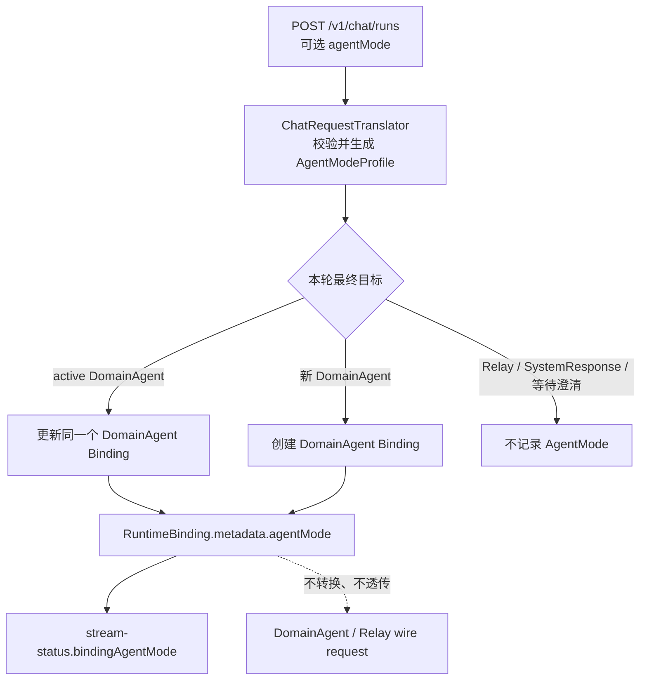

# AgentMode 仅记录技术设计

## 1. 目标与边界

`agentMode` 用于记录前端为当前 DomainAgent 选择的模式快照。模式维度和值均为开放字符串，服务端不维护
`fast`、`deep`、等级或长任务等业务枚举。

当前实现仅承担记录和查询职责：

- 记录位置仅为 active DomainAgent 的 `RuntimeBinding.metadata.agentMode`。
- 不继承旧 Binding、已取消 Binding、Relay Binding 或 Interaction 中的模式。
- 不把模式转换为 DomainAgent metadata、Relay config 或 Relay user-message metadata。
- 不写入 run metadata、RouteMemory、IntentAgent 请求、ChatEvent、历史消息或 parts。
- 不改变路由、Runtime 协议、事务边界、事件顺序和线程调度。

## 2. 请求协议

`POST /v1/chat/runs` 可选携带：

```json
{
  "agentMode": {
    "selections": [
      {
        "scheme": "thinking",
        "code": "deep",
        "displayName": "深度思考"
      },
      {
        "scheme": "execution",
        "code": "long_task",
        "displayName": "长任务执行"
      }
    ]
  }
}
```

字段规则：

| 字段 | 规则 |
| --- | --- |
| `agentMode` | 非必填；缺失或 JSON `null` 表示本轮没有模式更新 |
| `selections` | 对象存在时必填，最多 16 项；空数组表示显式清除 |
| `scheme` | 必填，trim 后长度不超过 64；同一请求中不能重复 |
| `code` | 必填，trim 后长度不超过 128；使用字符串承载未来未知值 |
| `displayName` | 可选，trim 后长度不超过 256 |

`agentMode` 是完整快照，不按 `scheme` 与已有记录合并。

## 3. 更新语义

| 当前状态 | 本轮输入 | 结果 |
| --- | --- | --- |
| 复用同一个 active DomainAgent Binding | 缺失或 `null` | 保留原记录，不执行模式更新 |
| 复用同一个 active DomainAgent Binding | 非空 `selections` | 完整替换 `agentMode` |
| 复用同一个 active DomainAgent Binding | `selections=[]` | 删除 `metadata.agentMode` |
| 创建新的 DomainAgent Binding | 缺失或 `null` | 新 Binding 不包含 `agentMode` |
| 创建新的 DomainAgent Binding | 非空 `selections` | 新 Binding 保存完整快照 |
| 创建新的 DomainAgent Binding | `selections=[]` | 新 Binding 不包含 `agentMode` |
| 当前目标为 Relay | 任意值 | Relay Binding 和 Relay 请求均忽略该字段 |

“缺失不更新”只适用于复用同一个 active DomainAgent Binding。若现有业务流程会取消旧 Binding 并创建新
Binding，则新 Binding 遵循“未传不记录”，不会从旧 Binding 恢复模式。

## 4. 写入场景

以下场景可以把本轮显式提交的模式写入 DomainAgent Binding：

1. `NEXT + targetType=DOMAIN_AGENT + targetId` 显式直连。
2. IntentAgent 首次返回 `ROUTE_SINGLE` 并确定 DomainAgent。
3. `forceReroute=true` 后首次确定 DomainAgent。
4. 普通请求复用 active DomainAgent Binding。
5. DomainAgent-backed Interaction 续接请求显式携带模式。
6. 意图澄清最终确定 DomainAgent，且最终澄清请求重新提交模式。
7. 路由切换确认选择 DomainAgent，且确认请求重新提交模式。

以下场景不传播模式：

- IntentAgent 返回 `CLARIFY` 时不把模式写入 Interaction 私有上下文。
- DomainAgent 拒答后自动切换到另一 DomainAgent 时，不复制被拒答 Binding 的模式。
- 切换到 Relay、恢复 Relay 或继续 Relay Interaction 时不记录模式。
- 已取消或已过期 Binding 只用于拒答路由上下文恢复，不作为模式来源。

## 5. 数据流



接口层通过 `ChatRequestTranslator` 将 DTO 转为 `AgentModeProfile`。编排层只携带本轮请求快照，最终确定
DomainAgent 后由 `RuntimeBindingApplicationService` 调用 `AgentModeBindingContext.apply(...)` 写入或清除
Binding metadata。

## 6. 持久化格式

不增加数据库列。模式随 `fin_ex_runtime_binding_t.metadata_json` 保存：

```json
{
  "domainAgentId": "fund_agent",
  "routeSource": "intent-agent",
  "agentMode": {
    "selections": [
      {
        "scheme": "thinking",
        "code": "deep",
        "displayName": "深度思考"
      }
    ]
  }
}
```

`AgentModeBindingContext` 负责稳定编解码：

- `apply(metadata, null)` 保留现有 metadata。
- `apply(metadata, emptyProfile)` 删除 `agentMode`。
- `apply(metadata, profile)` 写入完整快照。
- metadata 结构非法或字段校验失败时，读取结果为 `null`，不影响 stream-status 主响应。

## 7. Stream Status

查询入口：

```http
GET /v1/chat/sessions/{sessionId}/stream-status
```

响应字段 `bindingAgentMode` 只从当前 active DomainAgent Binding 解码：

- active DomainAgent 且 metadata 合法：返回完整 profile。
- active DomainAgent 未记录或 metadata 非法：返回 `null`。
- 当前为 Relay、没有 active Binding：返回 `null`。

该字段是查询时的 Binding 状态快照，不属于 ChatEvent。Event Resume、WebSocket 实时事件和历史 parts 不会
补发或携带 AgentMode。

## 8. 下游协议隔离

当前不存在 AgentMode 出站转换器或 registry：

- `AgentRuntimeRequest` 和 `AgentRuntimeInteractionResponseRequest` 不包含模式转换参数。
- `DomainAgentRuntime` 直接使用原业务 `metadata`，不会合并 AgentMode。
- `RelayWebSocketRuntimeAdapter` 不把 AgentMode 写入 `config`、`user-message` 或 `approval-response`。
- Relay 协议中的 `config.appMode` 是 Relay 自身运行配置，与本接口的 `agentMode` 无关。
- IntentAgent 请求只包含既有 query、conversationContext 和 options，不包含 AgentMode。

如未来需要把某个模式映射为下游参数，应作为独立协议需求设计和发布，不能直接把 Binding 中的开放字符串
透传到下游。

## 9. 并发与性能

- 不增加表、索引、数据库查询或 Redis key。
- 模式与现有 Binding metadata 在同一次 Binding 保存中写入，不增加额外事务。
- 不增加 Scheduler、线程、锁、订阅或同步等待。
- 同一 Binding 的最终状态仍由现有请求并发控制和数据库写入顺序决定。
- stream-status 复用现有 active Binding 查询，不增加独立模式查询。

## 10. 代码导航

| 职责 | 实现 |
| --- | --- |
| HTTP DTO | `interfaces/chat/dto/ChatAgentModeDto.java`、`ChatAgentModeSelectionDto.java` |
| DTO 转换与校验 | `interfaces/chat/ChatRequestTranslator.java` |
| 领域快照 | `domain/runtime/AgentModeProfile.java`、`AgentModeSelection.java` |
| Binding 编解码 | `application/integration/agent/AgentModeBindingContext.java` |
| Binding 写入 | `application/service/runtime/RuntimeBindingApplicationService.java` |
| 主流程传递 | `application/service/chat/FinanceEXChatService.java` |
| stream-status 读取 | `application/service/chat/ChatRunApplicationService.java` |

## 11. 验收要点

- 缺失、`null`、完整快照和空数组语义分别有测试覆盖。
- 新 DomainAgent Binding 不从旧 DomainAgent、Relay、Interaction 或已取消 Binding 继承。
- 拒答自动切换后的新 DomainAgent Binding 不包含旧模式。
- Relay、IntentAgent、DomainAgent wire JSON、run metadata、RouteMemory 和事件不包含 AgentMode。
- `selectedDomainAgent` 实时事件及历史 METADATA part 不包含 AgentMode。
- `stream-status.bindingAgentMode` 只返回 active DomainAgent 的记录。
