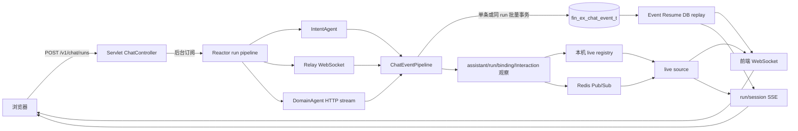
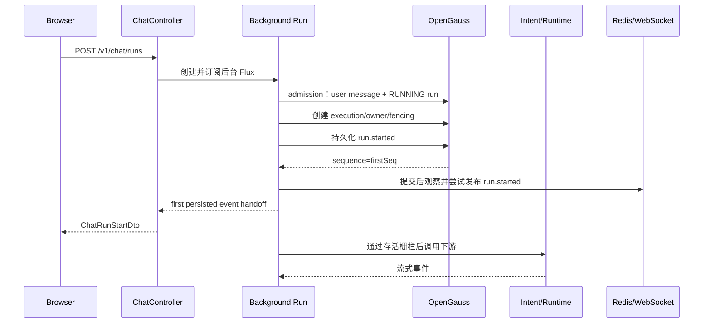
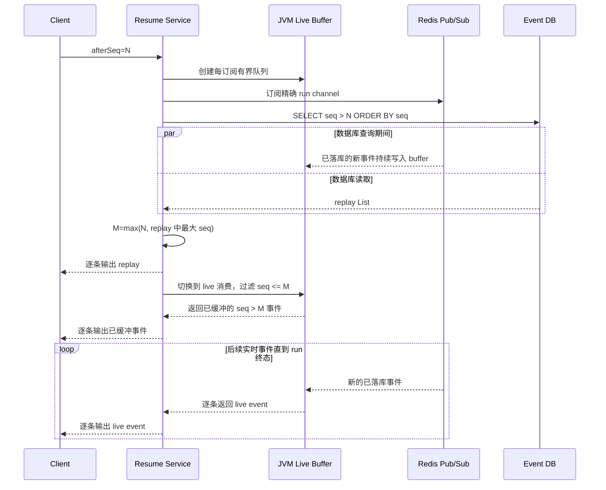
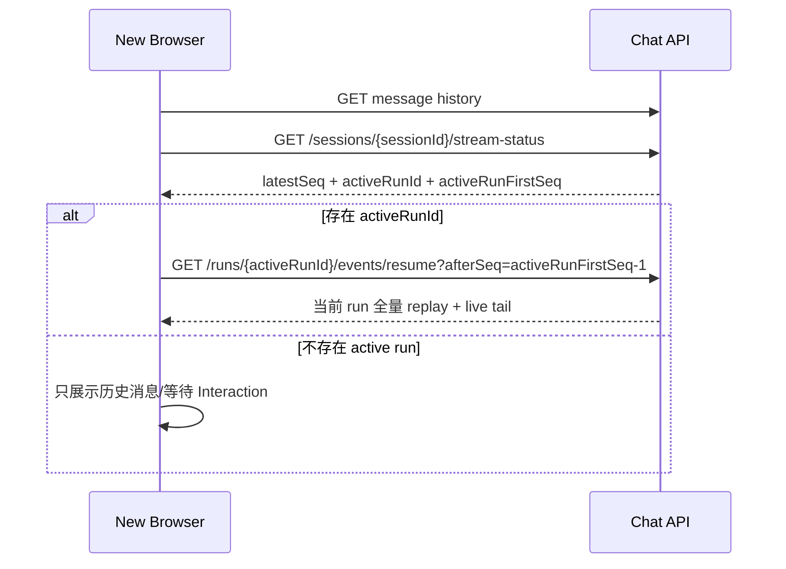

# Chat 流式输出、断点续传与跨浏览器恢复设计

> 代码事实基线：`202605/fin_ex_web_v3`，提交 `c11dae50e3cf`。
>
> 默认部署模型：Spring Boot 3.4.6 Servlet/MVC。项目内部使用 Reactor 编排后台任务和事件流，
> 但浏览器 HTTP 请求由 Servlet 栈接入。

本文描述当前已经实现的流式输出、事件事实落库、Redis 跨实例扇出、前端 WebSocket、SSE Event Resume、
跨标签页/跨浏览器恢复以及实例故障收敛。本文只记录现状，不表示未来架构目标。

## 1. 目标与边界

当前方案解决四个问题：

1. 浏览器发起任务后，即使刷新或关闭页面，后台 run 仍继续执行。
2. 任何已经对前端可见的业务事件都可以从数据库重新读取。
3. 多实例部署时，连接在任意实例上的浏览器都能实时收到其他实例产生的事件。
4. 实时链路出现丢包、乱序或断开时，客户端可以使用 `afterSeq` 从数据库事实源恢复。

当前方案不保证以下能力：

- Redis Pub/Sub 不是可靠消息队列，不保存历史消息。
- 浏览器消费游标不在服务端持久化，每个浏览器自行维护。
- Event Resume 只恢复 ChatEvent 消费，不恢复下游 Runtime 的计算过程。
- 当前 Relay、DomainAgent 不支持实例宕机后的在途任务接管。watchdog 会将失联 run 闭合为失败，
  不会从中断位置继续生成回答。

## 2. 三种 Resume 必须区分

| 名称 | 恢复对象 | 当前实现 |
| --- | --- | --- |
| ChatEvent Resume | 浏览器尚未消费的已落库事件 | 支持。使用 session/run Event Resume 和 `afterSeq` |
| Relay Session `RESUME` | Relay 已建立的会话上下文 | 支持。后续新 run 重新建立短连接并复用 `runtimeSessionId` |
| Runtime Takeover | 实例宕机后继续原 run 的在途计算和事件流 | 当前不支持。默认由 watchdog 写入 `RUN_EXECUTOR_LOST` |

Relay `config.sessionMode=resume` 只代表“新的一轮调用复用 Relay 历史会话”，不能用来说明原 run 被其他
ChatService 实例接管。前端 Event Resume 同样只恢复事件消费，不会重新调用 Relay 或 DomainAgent。

## 3. 总体架构



### 3.1 各层职责

| 层 | 是否可靠 | 职责 |
| --- | --- | --- |
| `fin_ex_chat_event_t` | 是 | ChatEvent 事实源、顺序游标、审计和恢复 |
| `fin_ex_chat_run_t` / execution | 是 | run 生命周期、owner、fencing、lease 和终态竞争 |
| Redis Pub/Sub | 否 | 跨实例实时扇出和恢复提示 |
| 本机 live registry | 否 | `local-only/merge` 模式和本机调试 |
| WebSocket/SSE | 否 | 向当前连接传输事实事件和非持久化传输控制片段 |
| 浏览器本地游标 | 客户端负责 | 记录最后实际处理成功的 sequence |

核心不变量是：**先提交数据库事实，再尝试实时发布**。Redis 或 WebSocket 中不能出现数据库无法恢复的
悬空业务事件。

## 4. 创建 run 与首事件交接

### 4.1 HTTP 入口

唯一任务入口为：

```http
POST /v1/chat/runs
```

Servlet 请求线程完成身份和 TraceContext 快照后，`FinanceEXChatService` 在 `boundedElastic` 上执行准入、
execution 初始化和后台 run。服务端主动订阅 run Flux，因此 HTTP 请求取消、页面刷新或 WebSocket 断开都不会
自动取消已经交接成功的后台任务。

创建结果示例：

```json
{
  "runId": "run_6d208d881afb42a1b4c00399606c9d3b",
  "sessionId": "session_939687af8440451ea0884d7c4de22531",
  "firstSeq": 740100,
  "createdAt": "2026-07-21T09:30:00Z",
  "streamTopicId": "chat-run-run_6d208d881afb42a1b4c00399606c9d3b"
}
```

`streamTopicId` 由服务端生成，当前格式为 `chat-run-{runId}`。前端不得从 `runId` 自行拼接，以免未来协议变化。

### 4.2 首事件门禁

正常执行顺序如下：



`run.started` 成功持久化是调用 IntentAgent、Relay 或 DomainAgent 的业务门禁。外部副作用不会在该事件落库前发生。

`POST /runs` 默认最多等待首个持久化事件 `30s`。超时只限制首事件交接，不限制已经交接后的长任务：

- 超时前取消本机后台 subscription，并只释放一次 admission permit。
- 异步执行数据库补偿，最多执行初次尝试加两次退避重试。
- run/execution 已存在时尝试写入 `run.failed(code=RUN_FIRST_EVENT_TIMEOUT)`。
- Interaction continuation 尚未完成准入时，按既有条件释放 claim。
- watchdog 仍作为补偿未收敛时的最终兜底。

正常路径的 `firstSeq` 对应 `run.started`。代码中的 execution 初始化失败路径可能在 `run.started` 前直接提交
`run.failed`；因此数据库终态和 `stream-status` 始终比“收到创建响应就认为 run 仍活跃”的客户端推断更可靠。

## 5. ChatEvent 事实模型

### 5.1 事件表

`fin_ex_chat_event_t` 的核心列如下：

| 列 | 类型 | 含义 |
| --- | --- | --- |
| `id` | `VARCHAR(64)` | 事件业务主键 |
| `tenant_id` / `user_id` | `VARCHAR(64)` | 服务端身份归属 |
| `session_id` / `run_id` | `VARCHAR(64)` | 会话与本轮 run 边界 |
| `seq` | `BIGINT` | 数据库 sequence 生成的恢复游标 |
| `event_type` | `VARCHAR(64)` | ChatService 标准事件类型 |
| `payload_json` | `TEXT` | 可恢复事件载荷 |
| `created_at` | `TIMESTAMPTZ` | 原始事件创建时间 |

约束和索引：

```text
UNIQUE(session_id, seq)
INDEX(run_id, seq)
INDEX(tenant_id, user_id, session_id, seq)
INDEX(tenant_id, user_id, run_id, seq)
```

事件序号由全局 `fin_ex_chat_event_seq` 生成。它具有以下语义：

- 在数据库层单调递增，支持多实例共同分配。
- 同一 run 或 session 内不保证连续；其他会话会消耗序号。
- 事务回滚不会回滚 sequence，因此出现间隙是正常现象。
- 客户端只能比较大小，不能等待 `lastSeq + 1` 或把间隙直接判断为丢包。

恢复查询固定使用服务端身份边界和 `seq > afterSeq`，并按 `seq ASC` 返回。

### 5.2 事件分类

当前允许参与同 run 批量落库的普通 Relay/DomainAgent 事件：

```text
message.delta
message.snapshot
runtime.progress
runtime.metadata
runtime.agent
runtime.thinking
runtime.tool
runtime.reference
runtime.card
runtime.event
```

以下事件保持立即处理，并在自身处理前刷新已缓存的普通事件：

```text
run.started
message.completed
run.completed
run.waiting_user
run.failed
run.cancelled
IntentAgent intent-start / intent-result
DomainAgent agent.refusal
Interaction 和其他控制事件
PersistenceAcknowledgedEvent
```

四个 run 终态事件为：

```text
run.completed
run.failed
run.cancelled
run.waiting_user
```

`message.completed` 只表示下游消息流结束，不参与 run 终态唯一胜者竞争。

## 6. 普通事件落库流水线

### 6.1 调度与身份校验

下游事件进入 `persistAndPublishRunEvents()` 后：

1. 经当前不执行合并的 `ChatDeltaCoalescer` 原样通过。
2. 切换到专用 `finex-chat-event-io` bounded-elastic 调度器。
3. 校验事件 `runId/sessionId` 必须与当前 pipeline 一致。
4. Redis cancel flag 和 run 状态做快速拒绝。
5. 最终写入正确性由数据库 run/execution 栅栏决定。

默认事件 IO 调度器最大线程数为 `16`，队列容量为 `10000`。阻塞 JDBC 不运行在 Servlet 请求线程或 Reactor
`parallel-*` 定时线程上。

### 6.2 三重阈值批量

批量功能默认开启，每个 run、每次订阅维护独立批次，不跨 run 合并：

```text
最大条数：16
最长等待：20ms
最大序列化数据：256KB
```

任一条件先满足即提交。单个事件超过字节阈值时仍作为单事件批次处理，不丢弃事件。字节估算使用最终事件结构的
UTF-8 序列化长度。`message.delta` 当前没有进行内容合并，兼容保留的 `delta-coalesce-*` 配置不改变事件粒度。

### 6.3 execution 写入栅栏

普通事件写入事务默认最多等待 `10s`。写入前执行单 run 准入查询并持有共享锁：

```text
run.status = RUNNING
execution.execution_status = RUNNING
execution.owner_instance_id = claim.ownerInstanceId
execution.fencing_token = claim.fencingToken
FOR SHARE OF run NOWAIT
FOR SHARE OF execution
```

写入顺序为：

```text
共享栅栏
-> 分配一个或 N 个 sequence
-> INSERT VALUES / 多行 INSERT VALUES
-> commit
```

终态事务先持有 run 行锁时，普通事件的 `NOWAIT` 会立即转换为 `ChatEventAppendRejectedException`，旧 owner 停止
继续消费下游流，不再产生终态后的迟到事件。不同 run 使用不同的行锁，不形成全表锁。

批量写入要求受影响行数等于批次数量，否则整个事务回滚，批内任何事件都不发布。

### 6.4 提交后观察与发布

数据库提交成功后，每条事件按 sequence 顺序独立执行：

```text
AssistantAssembly.observe
-> Interaction observe
-> run observe
-> RuntimeBinding observe
-> RouteMemory 后处理
-> 本机 live publish
-> Redis live publish
```

批次中某一条的提交后处理失败时，不会停止后续已落库事件的处理尝试。整批处理结束后再抛出
`CommittedBatchPostProcessingException`，由既有失败收口追加唯一 `run.failed`。

本机 live 与 Redis 发布分别尝试，一方失败不阻止另一方。Redis 发布实现还会把队列和网络失败转为恢复控制信号；
事件事实不会因实时发布失败而删除。

## 7. 终态、assistant 与历史 parts

### 7.1 终态事务

owner 正常完成、等待用户、失败，以及 stop/watchdog 外部终态都通过数据库唯一胜者协议提交。主要顺序为：

```text
必要时锁 session
-> run 终态 fence/CAS
-> 写终态 ChatEvent
-> 保存 assistant 与 parts（如适用）
-> 更新消息树/current leaf/未读水位（如适用）
-> 更新 RuntimeBinding 和 Interaction
-> 完成 run 与 execution
-> commit
-> 同步缓存并发布终态事件
```

这些事务复用 `10s` 事务超时。终态事件只在整个事务提交后发布，因此前端收到 `run.completed` 或
`run.waiting_user` 后，历史消息已经可查询。

stop 只有赢得 external-terminal CAS 的事务才能保存 partial assistant。普通失败和 watchdog 失联失败不会把未完成
内存草稿保存成普通 assistant；用户主动 stop 且已有正文或用户可见 parts 时可以保存 partial assistant。

### 7.2 流式期间的内存汇总

`AssistantAssembly` 在单个 run 内维护：

- `message.delta` 追加到 `StringBuilder` 草稿。
- 最后一个 `message.snapshot` 作为更权威的最终正文。
- `runtime.*` 和 snapshot 转换为有序 `ChatMessagePartDraft`。
- 终态事务统一保存 assistant 和全部 parts。

因此 ChatEvent 在流式过程中持续落库，但 assistant 与历史 parts 通常在 `run.completed/run.waiting_user` 时一次性保存；
stop partial 由 stop 终态事务从已落库事件重建。Event Resume 不依赖 assistant 是否已经生成。

### 7.3 三类时间戳

| 时间字段 | 生成时机 | 重放是否变化 |
| --- | --- | --- |
| `ChatEvent.createdAt` | 事件对象创建，随事件写入数据库 | 不变，但当前 `ChatEventDto` 不直接暴露 |
| 历史 part `payload.serverTimestampMs` | 事件型 part 使用原 `ChatEvent.createdAt` | 不变 |
| turn stream `serverTimestampMs` | WebSocket/SSE 包装 DTO 时使用当前时间 | 重放时重新生成 |

合成 `ANSWER` part 的 `serverTimestampMs` 使用 assistant 持久化时间，因为它不直接对应单个原始事件。

## 8. 统一前端传输协议

WebSocket `message.payload` 与 Event Resume SSE `data` 使用相同的 `ConversationTurnStreamDto`。

### 8.1 普通 stream-item

WebSocket 完整 envelope 示例：

```json
{
  "type": "message",
  "topicId": "chat-run-run_6d208d881afb42a1b4c00399606c9d3b",
  "offset": "740164",
  "payload": {
    "type": "conversation-turn-stream",
    "payload": {
      "type": "stream-item",
      "conversationId": "session_939687af8440451ea0884d7c4de22531",
      "turnId": "run_6d208d881afb42a1b4c00399606c9d3b",
      "streamItemId": "evt_740164",
      "serverTimestampMs": 1784034623806,
      "encodedItem": {
        "encoding": "chat-event-json-v1",
        "event": "message.delta",
        "data": {
          "runId": "run_6d208d881afb42a1b4c00399606c9d3b",
          "sessionId": "session_939687af8440451ea0884d7c4de22531",
          "sequence": 740164,
          "type": "message.delta",
          "payload": {
            "delta": "正在分析"
          }
        }
      }
    }
  }
}
```

只有 `stream-item` 对应数据库事件并推进游标。`offset` 是 sequence 的字符串形式；真实事件位于
`payload.payload.encodedItem.data`。

SSE 使用相同 data，并固定设置：

```text
event: conversation-turn-stream
Content-Type: text/event-stream
Cache-Control: no-cache
X-Accel-Buffering: no
```

### 8.2 heartbeat

```json
{
  "type": "message",
  "topicId": "chat-run-run_6d208d881afb42a1b4c00399606c9d3b",
  "payload": {
    "type": "conversation-turn-stream",
    "payload": {
      "type": "heartbeat",
      "conversationId": "session_939687af8440451ea0884d7c4de22531",
      "turnId": "run_6d208d881afb42a1b4c00399606c9d3b",
      "serverTimestampMs": 1784034625000,
      "lastSeq": 740164
    }
  }
}
```

heartbeat 默认每 `15s` 发送，不落库、没有 offset、不推进客户端游标。慢客户端队列繁忙时，Servlet WebSocket 会
优先跳过 heartbeat，而不是挤占业务事件容量。

### 8.3 done

```json
{
  "type": "message",
  "topicId": "chat-run-run_6d208d881afb42a1b4c00399606c9d3b",
  "payload": {
    "type": "conversation-turn-stream",
    "payload": {
      "type": "done",
      "conversationId": "session_939687af8440451ea0884d7c4de22531",
      "turnId": "run_6d208d881afb42a1b4c00399606c9d3b",
      "serverTimestampMs": 1784034628000,
      "lastSeq": 740170,
      "terminalEventType": "run.completed"
    }
  }
}
```

done 是传输闭合信号，不是新的 ChatEvent。前端必须先处理终态 `stream-item`，再处理 done；done 本身不能覆盖
`run.completed/run.failed/run.cancelled/run.waiting_user` 的业务含义。

## 9. 前端 WebSocket 实现

### 9.1 连接与鉴权

默认 Servlet 入口为：

```text
WS /v1/chat/ws
```

配置 `server.servlet.context-path=/fin/ex` 时，实际地址为 `/fin/ex/v1/chat/ws`。握手阶段由
`ChatServletWebSocketAuthInterceptor` 在 Servlet 请求线程解析 `UserContext` 并固化到 WebSocket session，避免
upgrade 后的线程无法读取企业 ThreadLocal。

浏览器 Origin 必须匹配 `financeex.websocket.allowed-origin-patterns`。空 Origin 的非浏览器客户端仍需通过身份鉴权。
订阅时再次验证 `topicId -> run` 必须属于当前 `tenantId + userId`，投递前还会核对 runId 和 sessionId。

### 9.2 控制消息

WebSocket 只接受控制命令，不接受聊天请求。

```json
{"id":"1","type":"connect","presence":"foreground"}
```

```json
{"id":"2","type":"presence","state":"background"}
```

```json
{
  "id": "3",
  "type": "subscribe",
  "topicId": "chat-run-run_6d208d881afb42a1b4c00399606c9d3b",
  "afterSeq": 740100
}
```

```json
{
  "id": "4",
  "type": "unsubscribe",
  "topicId": "chat-run-run_6d208d881afb42a1b4c00399606c9d3b"
}
```

subscribe 成功时先返回 reply，再开始数据库补发和 live 投递：

```json
{
  "id": "3",
  "type": "reply",
  "reply": {
    "type": "subscribe",
    "topicId": "chat-run-run_6d208d881afb42a1b4c00399606c9d3b",
    "recovered": true,
    "lastSeq": 740100
  }
}
```

同一用户级物理连接可以同时订阅多个 session 的多个 run topic。切换聊天会话不必关闭整条 WebSocket，但前端应在
不再展示某个 run 时主动 unsubscribe。

### 9.3 去重、乱序与恢复提示

每个连接、每个 topic 保存有限已投递 sequence 窗口：

- `seq <= afterSeq` 或窗口中已出现的 sequence 不再重复投递。
- sequence 不连续是合法的，不会等待缺失的数字。
- 如果一个此前未见的较小 sequence 在更大 sequence 之后到达，认为同 topic 出现回退，暂停订阅并返回
  `RECOVER_REQUIRED`。

示例：

```json
{
  "type": "error",
  "topicId": "chat-run-run_6d208d881afb42a1b4c00399606c9d3b",
  "offset": "740163",
  "code": "RECOVER_REQUIRED",
  "message": "实时事件需要恢复，请使用 Event Resume 从 afterSeq=740162 补齐",
  "details": {
    "reason": "SEQ_ROLLBACK",
    "topicId": "chat-run-run_6d208d881afb42a1b4c00399606c9d3b",
    "runId": "run_6d208d881afb42a1b4c00399606c9d3b",
    "sessionId": "session_939687af8440451ea0884d7c4de22531",
    "subscribeAfterSeq": 740100,
    "recoveryAfterSeq": 740162,
    "actualSeq": 740163,
    "highestDeliveredSeq": 740170,
    "lastSentSeq": 740170
  }
}
```

Redis queue/publish 降级也会产生同一错误码，但 `reason` 可能是 `REDIS_PUBLISH_QUEUE_OVERFLOW`、
`REDIS_PUBLISH_FAILED` 或 `LIVE_SOURCE_ERROR`。

### 9.4 Servlet 慢客户端保护

Servlet WebSocket 的底层 `sendMessage` 是阻塞调用，当前实现通过两层保护隔离业务线程：

- 每连接有界队列：默认 `256` 条、累计最大 `2MB`。
- `ConcurrentWebSocketSessionDecorator`：单次发送上限 `10s`、内部缓冲 `512KB`。
- 默认平台线程池：core `4`、max `16`、`SynchronousQueue`、`AbortPolicy`。
- 可配置使用 JDK 21 virtual thread，默认关闭。

队列溢出、发送线程拒绝或 socket 发送失败会关闭当前 WebSocket。run 不会因此停止，前端应通过 Event Resume 恢复。

## 10. Redis 跨实例实时扇出

### 10.1 Channel 与 payload

实际 channel 由环境前缀和 run topic 组成：

```text
fin_ex:{env}:chat_stream:{topicId}
```

Redis payload 包含：

```text
publisherInstanceId
runId
sessionId
sequence
eventType
createdAt
payload
```

当前总线使用 Redis Pub/Sub，不使用 Redis Stream、List 或其他持久化队列。每个已经提交的 ChatEvent 独立执行
一次 publish；Redis channel 不保存“最新事件”或历史事件。消息发布时没有在线订阅者，Redis 会直接丢弃该消息。
批量数据库事务提交 N 条事件后，应用仍按 sequence 发起 N 次单事件 publish。

发布前的单 topic FIFO 位于 producer 实例的 JVM 内存中，只负责异步发送、顺序保持和有限重试，不属于 Redis
缓存，也不能作为 Resume 数据源。队列排空或进程退出后不保留其中内容。

本机只有出现对应 topic 订阅者时才向 Redis listener container 动态注册精确 channel；不使用全局 pattern 订阅，
降低 Redis Cluster 下的广播和路由不确定性。

### 10.2 默认实时源

`financeex.chat-stream.live-source-mode` 默认是 `redis-only`：

- 即使 producer 和浏览器连接在同一实例，实时订阅也通过 Redis 回流。
- 本机 registry 仍接收发布，以支持 `local-only` 和 `merge` 排障模式。
- 只有 `merge` 模式会根据 `publisherInstanceId` 丢弃本实例 Redis 回声。
- 不建议生产长期使用 `merge`，双源到达顺序更复杂。

### 10.3 发布队列和降级

Redis 发布不占用事件 IO 主链路：

```text
全局执行器：core 2 / max 8
全局任务队列：4096
单 topic FIFO：1024 条 / 8MB
重试：2 次
退避：20ms
恢复控制重试间隔：1s
```

单 topic 队列保持该 topic 的发布顺序。队列溢出或最终发布失败时：

1. 将 topic 标记为 degraded。
2. 记录失败事件之前的 `recoveryAfterSeq`。
3. 在继续发布后续业务事件前先尝试发布 `RECOVER_REQUIRED` 控制消息。
4. 订阅实例把控制消息转换为 live Flux 错误。
5. WebSocket 提示前端执行 Event Resume；run SSE 结束当前 live tail。

Redis 故障不会回滚已经提交的 ChatEvent，也不会把 Redis 变成历史补发源。

## 11. Event Resume 实现

### 11.1 两个恢复接口

| 接口 | 数据范围 | 生命周期 |
| --- | --- | --- |
| `GET /v1/chat/sessions/{sessionId}/events/resume?afterSeq=N` | 当前用户整个 session 中 `seq > N` 的事件 | 有限 DB 补发，返回完即结束 |
| `GET /v1/chat/runs/{runId}/events/resume?afterSeq=N` | 当前用户指定 run 中 `seq > N` 的事件 | DB 补发；run 未终态时继续 live tail 到终态 |

两个接口都先校验当前身份拥有对应 session/run。当前数据库查询不分页，会把查询结果先读取成 List，再在
`boundedElastic` 上转换为 Flux；大量历史事件从 `afterSeq=0` 全量恢复时需要关注数据库、JVM 和响应带宽压力。
session resume 只输出数据库中的 stream-item，不发送 heartbeat 或 done；heartbeat/done 只用于 run resume 和
WebSocket run topic。

### 11.2 Run Resume 的订阅建立顺序

run 恢复和 WebSocket subscribe 复用同一套 DB/live 拼接逻辑。session resume 只查询数据库，不建立 live
buffer，不适用本节流程。

每次 run SSE 或 WebSocket topic 订阅都会在处理请求的应用实例中创建一个独立的
`RunTopicLiveBuffer`。该对象不是 Redis 数据结构，也不在不同浏览器连接之间共享。建立顺序固定如下：

1. 创建 `Sinks.Many<ChatEvent>` 单消费者有界队列。
2. 根据 `financeex.chat-stream.live-source-mode` 选择实时源；生产默认 `redis-only`。
3. 向 Redis listener container 动态注册当前 run 的精确 channel，并立即订阅实时 Flux。
4. 对实时事件依次执行 `afterSeq`、`runId/sessionId` 过滤、有限去重和短窗口排序。
5. 将符合条件的事件写入本机 live buffer。
6. 完成上述订阅后，再在 `boundedElastic` 上发起数据库查询。

外层使用 `Flux.using` 管理资源。连接完成、取消或异常时会 dispose 实时订阅；本实例中该 topic 的最后一个
订阅者离开后，Redis listener container 注销对应 channel。



### 11.3 数据库与实时事件拼接算法

设客户端传入游标为 `N`，数据库查询结果为 `R`：

```text
R = DB events WHERE seq > N ORDER BY seq ASC
M = max(N, max(R.sequence))
OUTPUT = concat(R, liveBuffer.filter(sequence > M))
```

数据库查询当前会先物化为 `List<ChatEvent>`，因此在输出第一条 replay 前已经可以计算 `M`。数据库 replay
按 `seq ASC` 逐条输出；`Flux.concat` 在 replay 完成前不会把 live buffer 中的事件发送给当前客户端。Redis
发布可以与数据库查询、replay 输出并发发生，但其事件只进入 buffer，不会与 replay 交叉输出。

| 事件发生时机 | 覆盖路径 |
| --- | --- |
| live 订阅建立前已经提交并发布 | 事件先提交数据库，随后发起的 DB 查询负责补发 |
| DB 查询或 replay 输出期间提交并发布 | Redis 订阅负责写入 live buffer |
| 同一事件同时存在于 DB replay 和 live buffer | `sequence <= M` 的 live 副本被过滤 |
| replay 完成后提交并发布 | 通过 live tail 逐条输出 |

示例：

```text
afterSeq N        = 100
DB replay R       = [101, 103, 105]
live buffer       = [103, 105, 108, 110]
replay max M      = 105
客户端最终事件序列 = [101, 103, 105, 108, 110]
```

`sequence` 由全局数据库序列产生，单个 run 内允许存在数值空洞。拼接目标是按当前 run 的 sequence 去重和有序
传输，不承诺序号数值连续，也不会等待不存在的 `seq + 1`。

live 流内部在进入 buffer 前执行：

```text
sequence > 原始 afterSeq
-> runId/sessionId 防御性过滤
-> 有限 sequence 去重（默认窗口 2048）
-> 20ms 或 128 条短窗口按 sequence 排序
```

短窗口只排序窗口内已经到达的事件，不合并事件。数据库批量写入、Redis 发布和前端传输的粒度彼此独立：即使
16 条事件在一个数据库事务中提交，提交后仍逐条发布 Redis、逐条生成 WebSocket/SSE envelope。

### 11.4 Live Buffer 容量与溢出处理

live buffer 是每个 run topic 订阅独立持有的 JVM 内存队列：

| 属性 | 当前实现 |
| --- | --- |
| 数据结构 | `Sinks.many().unicast().onBackpressureBuffer(...)` |
| 容量单位 | `ChatEvent` 条数，不是字节数 |
| 默认容量 | 每订阅 `512` 条 |
| 配置下限 | `16` 条；配置值小于 16 时按 16 生效 |
| 主要用途 | 暂存 DB 查询、replay 输出或下游发送受阻期间到达的 live 事件 |
| 共享范围 | 不共享；同一 topic 的不同 WebSocket/SSE 订阅分别持有队列 |

`512` 是最大积压容量，不是刷新阈值。在尚未排空且已有 512 条待处理事件时，不会提前越过数据库 replay 向
前端发送，也不会把 512 条合并成一个响应。下一条事件无法写入时，`tryEmitNext` 返回失败，当前 live 流被标记为
需要恢复。内部恢复异常以无法入队事件的 sequence 作为 `actualSeq`，并以
`max(原始 afterSeq, actualSeq - 1)` 计算初始 `recoveryAfterSeq`；WebSocket 协议层还会结合已经发送的水位生成最终
恢复提示。

溢出路径固定如下：

```text
live buffer 写入失败
-> 生成 StreamRecoveryRequiredException
-> 不扩容、不覆盖旧事件、不绕过 replay 提前发送
-> DB 查询及已开始的 replay 保持数据库优先顺序
-> 当前 live 拼接链结束
```

不同传输入口的外部表现：

- WebSocket topic：发送 `RECOVER_REQUIRED`，取消该 topic 订阅；客户端按建议游标重新执行 Event Resume。
- run SSE：记录恢复日志并结束当前 live tail；连接未观察到终态时不发送 done。客户端以最后成功处理的 sequence
  重新请求 run resume。

buffer 中的事件和未能写入 buffer 的事件都已经先提交到事件表。恢复依赖数据库事实源，不依赖当前 buffer 是否
已向客户端排空。客户端不得假设溢出前缓冲的全部事件均已送达，应以最后实际处理成功的 sequence 为恢复游标。

live buffer 只限制实时积压，不限制 DB replay 数量。数据库结果当前整体物化为 List，`afterSeq=0` 的大范围恢复
仍可能占用较多 JDBC、JVM 和网络资源，这是独立于 512 条 live buffer 的容量边界。

### 11.5 run SSE 的降级边界

run 状态已经终态，或 DB replay 中已包含终态事件时，接口只返回 replay。只有本次连接实际观察到终态事件时，
外层 translator 才会追加 done；若 `afterSeq` 已经等于或超过终态 sequence，本次 replay 为空，连接会直接结束而
不会再次发送 done。

run 仍活跃时，接口连接 Redis live tail。若 live source 返回 `StreamRecoveryRequiredException`：

- 服务端记录恢复日志。
- 当前 live tail 转为空并结束 SSE。
- 因为没有观察到终态事件，该连接不会发送 done。
- 服务端**不会**在同一请求内循环查询数据库到终态。
- 客户端应把“无 done 的 EOF”视为需要恢复，退避后使用最后实际处理成功的 sequence 再次请求。

该边界避免 Redis 故障时所有长连接同时转为数据库轮询，放大数据库压力。

## 12. 浏览器恢复流程

### 12.1 游标规则

客户端按 session 保存最后实际处理成功的最大 sequence：

```text
dedupKey = sessionId + ":" + sequence
lastSeq[sessionId] = max(lastSeq[sessionId], sequence)
```

仓库内本地联调台使用 `localStorage["finex:test:lastSeq:{sessionId}"]` 保存该值；正式前端可以使用自己的
会话状态存储，但游标语义必须一致。

只在完整解析并成功应用 `stream-item.encodedItem.data` 后推进。以下内容不推进：

- heartbeat
- done
- reply/error envelope
- HTTP stop 响应中的 `latestSeq`
- `stream-status.latestSeq`

后两者是服务端事实位置，不代表当前浏览器已经消费完成。

### 12.2 新建 run

```text
POST /runs
-> 保存 runId、sessionId、streamTopicId
-> 将 firstSeq 作为创建入口已经完成交接的位置
-> WebSocket subscribe(topicId, afterSeq=firstSeq)
-> 消费后续 stream-item
```

WebSocket subscribe 自身也会执行一次 DB catch-up，因此即使 POST 响应到 subscribe 之间已经产生事件，也不会丢失。

### 12.3 同一浏览器重连

浏览器刷新或 WebSocket 断开时：

1. 从本地存储读取该 session 的 `lastSeq`。
2. 如果仍知道 active topic，可重新 WebSocket subscribe，传 `afterSeq=lastSeq`。
3. 如果连接状态不确定，先查询 `stream-status`。
4. 收到重复事件时仍按 `(sessionId, sequence)` 去重。

服务端不保存 WebSocket ack，也不接受消费确认 command。

### 12.4 新标签页、跨浏览器或跨设备

新渲染实例没有可信的旧浏览器游标，推荐固定执行：



恢复起点：

```text
activeRunFirstSeq != null -> max(0, activeRunFirstSeq - 1)
activeRunFirstSeq == null -> 0
```

该策略会刻意重放当前 run，包括 `run.started`，因此不能依赖“之前是否渲染过”去重，必须使用 sequence。

恢复 active run 时，同一页面只保留 run SSE 或 WebSocket 其中一条消费链。不要同时进行 SSE tail 和相同 topic 的
WebSocket subscribe。

### 12.5 `RECOVER_REQUIRED`

收到恢复提示后：

1. 立即暂停或 unsubscribe 当前 topic。
2. 保存最后实际成功处理的 sequence。
3. `details.recoveryAfterSeq` 存在时直接使用该值；不存在时才回退本地 lastSeq。该建议值可能小于本地最高 seq，
   目的是覆盖迟到的低序号事件，不能取两者最大值。
4. 调用 run Event Resume 补齐。
5. 对已经处理过的较高 sequence 使用本地去重，避免回放造成重复渲染。
6. run 未终态时可以继续保持 SSE 到终态；若选择切回 WebSocket，先结束 SSE，再用新的 lastSeq subscribe。

### 12.6 stop

stop 是 REST 生命周期操作，不是 WebSocket command：

```http
POST /v1/chat/runs/{runId}/stop
```

服务端执行顺序如下：

1. 校验 run 归属。首次 stop 通过带 10 秒事务超时的条件更新把 `RUNNING` 改为 `CANCELLING`；对已经处于
   `CANCELLING` 的 run 直接进入幂等重试。
2. 只有数据库回读确认状态为 `CANCELLING` 后，才写 Redis cancel flag 和 active-run 投影。数据库更新失败时不会留下
   提前生效的 Redis 取消标记。
3. 先 best-effort 通知下游停止，再 dispose 本实例的后台 run subscription。Relay 优先复用活动 WebSocket 发送
   `{"type":"stop_all_agents"}`；活动连接不在本实例时，可建立临时 `RESUME` 连接发送同一控制帧并有界等待 paused
   acknowledgement。下游中断失败不取代 ChatService 自身的终态竞争。
4. 从已经持久化的事件准备可选 partial assistant。该阶段只读取和组装，不写 message、part、session leaf 或 run。
5. external-terminal 短事务先通过 run 条件 CAS 抢占唯一终态。只有胜者才保存 partial assistant、parts 和 session leaf，
   绑定 assistantMessageId，追加 `run.cancelled`，并完成 run、Interaction 和 execution；任一步失败均回滚整笔事务。
6. 事务提交后同步 run 缓存并 best-effort 发布 `run.cancelled`。CAS 失败表示 stop、watchdog 或原 owner 已经完成收口，
   本次不会保存 partial assistant，也不会重复发布终态事件。

因此 `CANCELLING` 是可重试状态：首次终态事务超时或写入失败后，重复 stop 或 watchdog 仍可继续闭合为
`CANCELLED`。stop 的数据库状态与 Redis cancel flag 提供快速停止，真正禁止迟到事件的最终栅栏仍是 run/execution
状态和事件写入锁。

前端调用 stop 后继续等待当前通道中的 `run.cancelled`。如果连接已断开，使用 stop 前最后消费的 sequence 调用
Event Resume。stop HTTP 响应中的 `latestSeq` 只能用于诊断，不能直接宣告当前页面已经消费到该位置。

### 12.7 多浏览器并发观看

每个浏览器建立独立连接和订阅，没有单消费者竞争：

- 同一事件可以实时扇出给多个浏览器。
- 每个浏览器独立维护 lastSeq 和去重窗口。
- 一个浏览器断开不会影响其他浏览器或后台 run。
- 每个连接仍执行相同的用户权限和 topic 归属校验。

## 13. stream-status 的作用

```http
GET /v1/chat/sessions/{sessionId}/stream-status
```

主要字段：

```text
latestSeq
activeRunId / activeRunStatus
activeStreamTopicId
activeRunFirstSeq / activeRunLastSeq
cancellable
waitingUserInput / interactionId / interactionType
assistantMessageId / expiresAt
bindingProvider / bindingTargetType / bindingTargetId
bindingIntentCode / bindingIntentName / bindingRouteSource / bindingUpdatedAt
```

`latestSeq` 直接查询事件表最大 sequence。为避免 run 表成为每个 delta 的热点，`message.delta`、snapshot 和
`message.completed` 不保证持续刷新 `fin_ex_chat_run_t.last_seq`；因此 `activeRunLastSeq` 只用于运行状态摘要，
恢复事实位置以 `latestSeq` 和事件表为准。

查询时如果发现 active execution lease 已过期，会触发一次轻量懒恢复，然后重新读取 latestSeq 和 active run。

## 14. 故障与降级矩阵

| 故障 | 当前行为 | 客户端/运维动作 |
| --- | --- | --- |
| 浏览器刷新或关闭 | 后台 run 继续；当前连接订阅释放 | 重开后查询 stream-status 并 Event Resume |
| WebSocket 网络断开 | 不影响 run 和 DB | 使用本地 lastSeq 重连或 resume |
| 慢客户端队列溢出 | 关闭该 WebSocket | run Event Resume 补齐 |
| Redis 短暂失败 | 事件已落库；实时扇出可能缺失 | `RECOVER_REQUIRED` 或断线后 DB resume |
| Redis listener 启动失败 | 跨实例 live 退化 | 修复 Redis；浏览器使用 Event Resume |
| Redis 入站 payload 解析失败 | 当前只记录日志并丢弃该次实时消息，事件仍在 DB | 后续主动 Event Resume 补齐 |
| Redis 完全不可用 | 业务事件和恢复控制消息都可能无法到达现有 WS，heartbeat 仍可能继续 | 结合业务等待上限查询 stream-status 并主动 resume |
| live buffer 溢出 | 不绕过 DB replay；终止当前 topic live 拼接 | WebSocket 使用建议游标恢复；run SSE 使用最后成功处理的 sequence 重试 |
| 同 topic sequence 乱序回退 | 暂停当前 topic，避免继续发送更高 sequence | 从 `RECOVER_REQUIRED.recoveryAfterSeq` 恢复并在客户端去重 |
| 普通事件 DB 写入失败 | 该批事务回滚，不实时发布 | 尝试收口 run.failed；DB 持续异常由 watchdog/运维处理 |
| 终态事务失败 | 整笔回滚，不发布伪终态 | stop 可重试；watchdog 最终闭合 |
| stop 与 owner 竞争 | run 行 CAS/fence 只允许一个终态 | 以数据库终态为准 |
| producer 实例宕机 | execution heartbeat 停止 | lease 过期后 watchdog 写入失败终态 |

## 15. 单实例故障与 watchdog

execution 默认：

```text
lease duration：90s
heartbeat interval：15s
watchdog initial delay：30s
watchdog scan interval：30s
jitter：5s
batch size：100
单轮最大 claim：20
恢复并发：4
单租户单轮最大 claim：5
```

一次 watchdog scan 的实际顺序为：

```text
对账终态或孤立的 Interaction continuation claim
-> 闭合超过 execution-init-orphan-grace 且尚无 execution 的 run
-> 查询 lease 已过期或 RECOVERING 再次过期的 execution
-> 按租户和本机并发上限执行恢复策略
```

普通 run 在创建后、execution 初始化前发生进程退出时，超过默认 `2m` 宽限期后以
`RUN_EXECUTION_INIT_ORPHANED` 闭合。Interaction continuation 缺失 execution 时会原子闭合对应 run，并按其
消息策略对账 Interaction；尚未形成有效 continuation run 的孤立 claim 则由条件更新释放。

默认策略链为：

```text
MANUAL_CONFIRMATION,FAIL_FAST
```

失联 run 的处理：

1. watchdog 找到 lease 过期 execution。
2. 使用可选 Redis recover lock 和数据库条件更新竞争恢复 owner。
3. run 为 `CANCELLING` 时优先写入 `run.cancelled(messageReady=false)`。
4. 普通 RUNNING run 默认由 `MANUAL_CONFIRMATION` 写入：

```json
{
  "type": "run.failed",
  "payload": {
    "code": "RUN_EXECUTOR_LOST",
    "message": "执行实例心跳超时，本轮回答已中断",
    "recoveryStrategy": "MANUAL_CONFIRMATION",
    "recoveryActionRequired": true,
    "recoveryOptions": ["REGENERATE_ASSISTANT", "RETRY_AS_NEW_RUN"]
  }
}
```

5. 外部终态 CAS 保证多个 watchdog/stop/owner 之间只有一个胜者。
6. 事务提交后尽力发布终态；发布失败仍可从事件表恢复。

失联检测不是精确的 `90s` SLA：实际收敛时间还受下一次 `30s` 扫描、最多 `5s` jitter、容量限制和数据库状态影响。
`watchdog-enabled=false` 时不会自动处理实例失联和初始化孤儿；active run 可能持续占用会话，需外部运维处理。

代码中存在 `RUNTIME_TAKEOVER` 策略接口，但当前默认恢复端口不支持可靠 takeover，策略实现也只返回 skipped。
Relay 的 `supports_incremental_recovery=true` 是 Relay 会话协议能力，不足以保证原 ChatService run 的事件不重复、
assistant 汇总连续和 execution fencing 正确，因此当前不能视为实例接管。

## 16. 关键配置

### 16.1 run 与恢复

| 配置 | 默认值 | 作用 |
| --- | --- | --- |
| `financeex.chat-run.active-ttl` | `6h` | active run Redis 投影 TTL，不是数据库生命周期 |
| `financeex.chat-run.cancel-ttl` | `1h` | Redis cancel 快速标记 TTL |
| `financeex.chat-run.lease-duration` | `90s` | execution 租约 |
| `financeex.chat-run.heartbeat-interval` | `15s` | execution 心跳 |
| `financeex.chat-run.watchdog-enabled` | `true` | 是否启用失联收敛 |
| `financeex.chat-run.watchdog-initial-delay` | `30s` | 首次扫描延迟 |
| `financeex.chat-run.watchdog-scan-interval` | `30s` | watchdog 扫描间隔 |
| `financeex.chat-run.watchdog-batch-size` | `100` | 单次候选查询批量 |
| `financeex.chat-run.watchdog-max-claims-per-scan` | `20` | 单轮最大恢复 claim |
| `financeex.chat-run.recovery-max-concurrency` | `4` | 本实例普通恢复并发 |
| `financeex.chat-run.takeover-max-concurrency` | `1` | 本实例 takeover 并发；当前策略未启用 |
| `financeex.chat-run.recovery-max-claims-per-tenant-per-scan` | `5` | 单租户单轮恢复上限 |
| `financeex.chat-run.watchdog-jitter` | `5s` | 多实例扫描抖动 |
| `financeex.chat-run.stale-recovery-strategies` | `MANUAL_CONFIRMATION,FAIL_FAST` | 失联恢复策略链 |
| `financeex.chat-run.recover-lock-enabled` | `true` | 是否使用 Redis 恢复锁优化竞争 |
| `financeex.chat-run.recover-lock-ttl` | `30s` | 恢复锁 TTL；最终正确性仍由数据库保证 |
| `financeex.chat-run.execution-init-orphan-grace` | `2m` | execution 初始化孤儿宽限期 |
| `financeex.chat-run.first-event-timeout` | `30s` | `/runs` 首持久化事件等待上限 |
| `financeex.chat-run.external-terminal-transaction-timeout-seconds` | `10` | 准入/栅栏/终态短事务上限 |

### 16.2 事件流水线

| 配置 | 默认值 |
| --- | --- |
| `financeex.chat-stream.event-batch-enabled` | `true` |
| `financeex.chat-stream.event-batch-max-size` | `16` |
| `financeex.chat-stream.event-batch-max-wait` | `20ms` |
| `financeex.chat-stream.event-batch-max-bytes` | `256KB` |
| `financeex.chat-stream.delta-coalesce-enabled` | `false`，当前兼容预留 |
| `financeex.chat-stream.delta-coalesce-window` | `50ms`，当前兼容预留 |
| `financeex.chat-stream.delta-coalesce-max-chars` | `512`，当前兼容预留 |
| `financeex.chat-stream.turn-heartbeat-interval` | `15s` |
| `financeex.chat-stream.live-source-mode` | `redis-only` |
| `financeex.chat-stream.live-reorder-enabled` | `true` |
| `financeex.chat-stream.live-reorder-window` | `20ms` |
| `financeex.chat-stream.live-reorder-max-events` | `128` |
| `financeex.chat-stream.event-io-executor-max-size` | `16` |
| `financeex.chat-stream.event-io-executor-queue-capacity` | `10000` |

### 16.3 WebSocket 与 Redis live bus

| 配置 | 默认值 |
| --- | --- |
| `financeex.websocket.allowed-origin-patterns` | 空，生产需显式配置浏览器 Origin |
| `financeex.websocket.max-connections-per-user` | `8`，当前 JVM |
| `financeex.websocket.max-subscriptions-per-connection` | `8` |
| `financeex.websocket.max-subscribers-per-topic` | `128`，当前 JVM |
| `financeex.websocket.max-inbound-message-bytes` | `16384` |
| `financeex.websocket.outbound-queue-size` | `256` |
| `financeex.websocket.live-buffer-capacity` | 每订阅 `512` 条事件，实际下限 `16`；容量耗尽时进入恢复流程，不触发批量发送 |
| `financeex.websocket.delivered-seq-window` | `2048` |
| `financeex.websocket.servlet-send-queue-capacity` | `256` |
| `financeex.websocket.servlet-send-queue-max-bytes` | `2MB` |
| `financeex.websocket.send-time-limit` | `10s` |
| `financeex.websocket.send-buffer-size-bytes` | `512KB` |
| `financeex.websocket.servlet-send-executor-core-size` | `4` |
| `financeex.websocket.servlet-send-executor-max-size` | `16` |
| `financeex.websocket.servlet-send-use-virtual-threads` | `false` |
| `financeex.websocket.idle-timeout` | `10m` |
| `financeex.websocket.idle-check-interval` | `60s` |
| `financeex.websocket.redis-publish-executor-core-size` | `2` |
| `financeex.websocket.redis-publish-executor-max-size` | `8` |
| `financeex.websocket.redis-channel-prefix` | `fin_ex:chat_stream` 逻辑前缀 |
| `financeex.websocket.redis-publish-queue-capacity` | `4096` |
| `financeex.websocket.redis-publish-topic-queue-size` | `1024` |
| `financeex.websocket.redis-publish-topic-max-bytes` | `8MB` |
| `financeex.websocket.redis-publish-retry-attempts` | `2` |
| `financeex.websocket.redis-publish-retry-backoff` | `20ms` |
| `financeex.websocket.redis-publish-recovery-retry-interval` | `1s` |

### 16.4 Servlet、数据库与 Redis 外围限制

| 配置 | 默认值 | 对流式链路的影响 |
| --- | --- | --- |
| `spring.mvc.async.request-timeout` | `30m` | Servlet SSE 异步请求上限；不限制已经交接的后台 run |
| `server.tomcat.max-connections` | `8192` | Tomcat 总连接上限 |
| `server.tomcat.threads.max` | `200` | Servlet 请求线程上限；阻塞 WS send 使用独立执行器 |
| `server.tomcat.accept-count` | `200` | 连接队列上限 |
| `server.tomcat.connection-timeout` | `20s` | Tomcat 连接建立/读入阶段限制 |
| `spring.datasource.hikari.maximum-pool-size` | `10` | 全服务 JDBC 连接池上限 |
| `spring.datasource.hikari.connection-timeout` | `500ms` | 获取连接等待上限，不等同于 SQL/行锁超时 |
| `financeex.redis.timeout` | `500ms` | Redis command 超时 |
| `financeex.redis.connect-timeout` | `500ms` | Redis 建连超时 |
| `financeex.scheduler.pool-size` | `4` | heartbeat、watchdog、WS 空闲清理等治理任务共享调度池 |

`spring.threads.virtual.enabled=true` 不会自动替换显式创建的 `chatServletWebSocketSendExecutor`；该执行器是否使用
虚拟线程仍由 `financeex.websocket.servlet-send-use-virtual-threads` 单独控制。

## 17. 当前限制与使用约束

1. 浏览器 lastSeq 没有服务端用户级存储。跨设备恢复 active run 必须依赖 `activeRunFirstSeq - 1` 全量重放。
2. session/run Event Resume 查询当前没有分页和单次条数上限；不要把 `afterSeq=0` 当作长期历史归档接口反复调用。
3. run SSE 的 live source 失败后直接结束，不自动数据库轮询；无 done 的 EOF 必须重试。
4. run SSE 的 heartbeat 要在该连接先观察到一个事件后才具备 session/run 标识。跨设备从 firstSeq 前恢复通常会先收到 replay；
   从最新 sequence 恢复且 run 暂时无事件时，连接可能在下一事件前保持静默。
5. WebSocket 去重窗口和 live buffer 都是有限内存结构，不能替代客户端持久游标和数据库恢复。
6. assistant 草稿和 parts 在正常终态前保存在 run 内存中；大量 runtime parts 会增加单 run 内存使用，但不改变事件恢复事实源。
7. `ChatRunStartDto` 不携带首事件 payload。正常契约把 `firstSeq` 作为 `run.started` 交接位置；客户端仍应以
   `stream-status`、终态事件和数据库恢复结果作为生命周期事实。
8. 当前本地联调台的 `RECOVER_REQUIRED` 兼容处理仍以本地 lastSeq 发起恢复；生产前端应使用错误详情中的
   `recoveryAfterSeq`，才能覆盖 sequence rollback 对应的迟到事件。
9. 已终态 run 且 `afterSeq` 已越过终态事件时，run resume 可能返回空流且不发送 done。前端应结合已经消费的
   终态事件或 `stream-status` 判断生命周期，不要对已终态 topic 继续建立实时订阅。
10. Redis 入站反序列化失败当前只记录日志，不会自动向该 topic 发出恢复错误；Redis 整体不可用时恢复控制消息也
    无法送达。数据库事实仍完整，但客户端需要在业务等待超时、重连或页面恢复时主动调用 Event Resume。

## 18. 代码导航

| 职责 | 当前实现 |
| --- | --- |
| HTTP 创建、SSE、stream-status | [`ChatController`](../../src/main/java/com/huawei/it/ex/one/interfaces/chat/ChatController.java) |
| 后台 run 与事件主流水线 | [`FinanceEXChatService`](../../src/main/java/com/huawei/it/ex/one/application/service/chat/FinanceEXChatService.java) |
| Event Resume、DB/live 拼接 | [`ChatStreamApplicationService`](../../src/main/java/com/huawei/it/ex/one/application/service/chat/ChatStreamApplicationService.java) |
| 事件三重阈值组批 | [`ChatEventBatcher`](../../src/main/java/com/huawei/it/ex/one/application/service/chat/ChatEventBatcher.java) |
| 数据库事件事实源 | [`MyBatisChatEventStore`](../../src/main/java/com/huawei/it/ex/one/infrastructure/persistence/MyBatisChatEventStore.java)、[`ChatEventMapper.opengauss.xml`](../../src/main/resources/mapper/persistence/ChatEventMapper.opengauss.xml) |
| 终态原子提交 | [`ChatRunTerminalCommitService`](../../src/main/java/com/huawei/it/ex/one/application/service/chat/ChatRunTerminalCommitService.java) |
| assistant/parts 内存装配 | [`AssistantAssembly`](../../src/main/java/com/huawei/it/ex/one/application/service/chat/AssistantAssembly.java) |
| Redis 跨实例扇出 | [`RedisChatLiveEventBus`](../../src/main/java/com/huawei/it/ex/one/infrastructure/persistence/RedisChatLiveEventBus.java) |
| WebSocket 通用协议 | [`ChatWebSocketProtocolService`](../../src/main/java/com/huawei/it/ex/one/interfaces/chat/websocket/ChatWebSocketProtocolService.java) |
| Servlet WebSocket 发送 | [`ChatServletWebSocketHandler`](../../src/main/java/com/huawei/it/ex/one/interfaces/chat/websocket/ChatServletWebSocketHandler.java) |
| 连接、订阅与 sequence 判定 | [`LocalWebSocketConnectionRegistry`](../../src/main/java/com/huawei/it/ex/one/interfaces/chat/websocket/LocalWebSocketConnectionRegistry.java) |
| 前端统一 envelope | [`ChatTurnStreamTranslator`](../../src/main/java/com/huawei/it/ex/one/interfaces/chat/ChatTurnStreamTranslator.java) |
| stream-status 与 active run | [`ChatRunApplicationService`](../../src/main/java/com/huawei/it/ex/one/application/service/chat/ChatRunApplicationService.java) |
| execution 心跳与失联收敛 | [`ChatRunWatchdogScheduler`](../../src/main/java/com/huawei/it/ex/one/application/service/chat/ChatRunWatchdogScheduler.java)、[`ChatRunRecoveryOrchestrator`](../../src/main/java/com/huawei/it/ex/one/application/service/chat/ChatRunRecoveryOrchestrator.java) |

## 19. 前端实现检查表

- `/runs` 成功后保存服务端返回的 `runId/sessionId/streamTopicId/firstSeq`。
- WebSocket 只发送控制命令，不发送聊天请求。
- 只从 `stream-item.encodedItem.data` 读取 ChatEvent。
- 只在事件成功应用后推进 lastSeq。
- 不要求 sequence 连续。
- 使用 `(sessionId, sequence)` 去重。
- heartbeat、done、reply 和 error 不推进游标。
- stop 后等待 `run.cancelled`，断线时从 stop 前游标恢复。
- 新浏览器先查询消息和 stream-status，再从 activeRunFirstSeq 前恢复。
- 同一 run 不同时开启 WebSocket 和 run SSE 两条渲染链。
- 收到 `RECOVER_REQUIRED` 或无 done 的 run SSE EOF 时，退避后再次 Event Resume。
- 不把 Relay `RESUME` 理解为 ChatService 在途任务接管。
