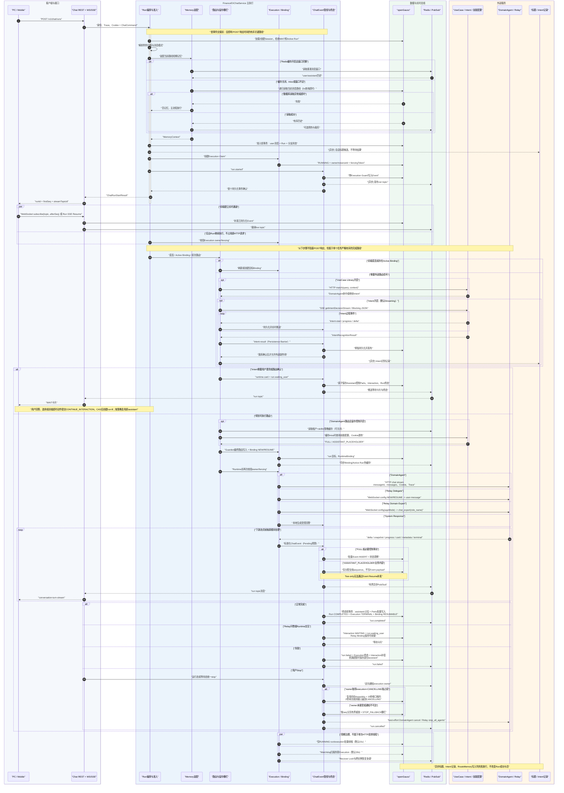

# FinanceEXChatService 当前架构图

> 当前代码架构快照。实线表示同步或严格有序调用，粗线表示流式消息，虚线表示异步或 best-effort；橙色节点为周期治理任务。

## 整体架构图

```mermaid
flowchart TB
    subgraph Clients["客户端与企业接入"]
        direction LR
        PC["PC Web<br/>全量会话与实时续接"]
        Mobile["移动端<br/>channel=mobile"]
        Gateway["企业网关 / 容器<br/>身份、Trace、Cookie"]
        PC --> Gateway
        Mobile --> Gateway
    end

    subgraph Service["FinanceEXChatService 多实例"]
        direction TB

        subgraph Interfaces["接口层"]
            direction LR
            RestApi["REST API<br/>Run / Session / Message / Feedback"]
            ShareApi["分享 API<br/>单消息 / 多消息快照"]
            DocumentApi["文档 API<br/>上传 / 查询 / 下载"]
            RealtimeApi["实时接口<br/>WebSocket / SSE Resume / Stream Status"]
        end

        subgraph Application["应用编排层"]
            direction LR
            RunOrchestrator["Run 编排<br/>准入、首事件交接、后台 Flux"]
            SessionMessage["会话与消息<br/>分支、编辑、历史、反馈"]
            InteractionStop["Interaction / WAIT / Stop<br/>澄清、确认、问卷、run-B"]
            ShareService["分享与发送<br/>固定快照、权限、投递"]
            DocumentService["文档管理<br/>元数据、归属、存储路由"]
        end

        subgraph Core["Chat Run 核心执行"]
            direction LR
            Admission["首事件前关键路径<br/>附件、短期记忆、user消息、Run"]
            Lease["Execution Lease<br/>owner + fencing"]
            Routing["路由决策<br/>直连 / Active Binding / UseCase / Intent"]
            RetentionGate["留存策略栅栏<br/>FULL / ASSISTANT_PLACEHOLDER"]
            Binding["RuntimeBinding<br/>DomainAgent / Relay NEW、RESUME"]
            RuntimeDispatch["Runtime 分发<br/>DomainAgent / Relay / System"]
            StreamBudget["流式内存边界<br/>Pending有界桥接 / Assistant投影预算"]
            StopHandoff["Stop 协调<br/>Owner内存汇总 / 有界分页Fallback"]
            EventPipeline["ChatEvent 管线<br/>顺序、批处理、留存分类、发布"]
            Terminal["终态短事务<br/>Run / Execution / Assistant / Parts / Interaction"]
        end

        subgraph Adapters["防腐层与基础设施适配器"]
            direction LR
            UseCaseAdapter["UseCaseLibraryClient<br/>HTTP"]
            IntentAdapter["IntentAgentRuntime<br/>SSE Streaming / Blocking JSON"]
            SkillConfigAdapter["技能配置 Provider<br/>HTTP + Cookie，可选 Redis 缓存"]
            DomainAdapter["DomainAgent Adapter<br/>HTTP 流 / cancel"]
            RelayAdapter["Relay Adapter<br/>WebSocket Delegate / Domain Expert"]
            AuthAdapter["集成鉴权<br/>AuthHeaderProvider / SGOV 扩展"]
            StorageAdapter["DocumentStorage<br/>Local / OBS / API Store"]
            StreamAdapter["事件存储与实时总线<br/>MyBatis / Redis Pub/Sub"]
        end

        subgraph Sidecars["非阻塞旁路与后台治理"]
            direction LR
            SessionTitle["异步会话标题<br/>并发栅栏，失败放行"]
            IntentRecord["异步 Intent 识别记录"]
            RouteMemoryWrite["异步 RouteMemory 写入"]
            Governance["Heartbeat / Watchdog / Recovery<br/>准入状态清理"]
        end
    end

    subgraph Dependencies["数据设施与外部依赖"]
        direction LR
        subgraph Data["数据与缓存设施"]
            direction LR
            OpenGauss[("openGauss<br/>会话、消息、Run、Execution、Event、Binding、Interaction<br/>RouteMemory、分享、文档、反馈")]
            Redis[("Redis Cluster / Standalone<br/>Active Run、Cancel、Recover Lock、Binding Cache<br/>短期记忆、策略缓存、Pub/Sub")]
            LocalStorage[("本地文件系统")]
            Obs[("Huawei OBS / S3")]
        end

        subgraph External["外部依赖服务"]
            direction LR
            subgraph RoutingExternal["路由与策略依赖"]
                direction TB
                UseCaseService["用例库服务"]
                IntentService["Intent Service<br/>getIntentDecisionStream / Blocking"]
                SkillConfigService["DomainAgent 技能配置服务"]
                EnterpriseAuth["企业鉴权 / SGOV Token Provider<br/>可替换扩展"]
            end
            subgraph RuntimeExternal["Runtime依赖"]
                direction TB
                DomainAgentService["DomainAgent Service<br/>chat stream / stop"]
                RelayService["Relay Service<br/>Delegate / Domain Expert / RESUME / stop"]
            end
            subgraph SupportingExternal["辅助依赖"]
                direction TB
                SessionTitleService["Session Title Service"]
                WeLink["WeLink 分享服务"]
                ApiStore["API Store / EDM"]
                LongTermMemory["Long-term Memory Provider<br/>扩展点，默认关闭"]
            end
        end
    end

    Gateway -->|"同步 HTTP"| RestApi
    Gateway -->|"上传 / 分享"| DocumentApi
    Gateway --> ShareApi
    Gateway ==>|"WebSocket / SSE"| RealtimeApi

    RestApi --> RunOrchestrator
    RestApi --> SessionMessage
    RestApi --> InteractionStop
    ShareApi --> ShareService
    DocumentApi --> DocumentService

    RunOrchestrator --> Admission
    Admission --> Lease
    Lease --> Routing
    Routing --> RetentionGate
    RetentionGate --> Binding
    Binding --> RuntimeDispatch
    RuntimeDispatch ==>|"pending预算"| StreamBudget
    StreamBudget ==>|"有序ChatEvent"| EventPipeline
    EventPipeline --> Terminal
    InteractionStop --> StopHandoff
    StopHandoff --> Lease
    StopHandoff --> Terminal
    EventPipeline ==> RealtimeApi
    InteractionStop --> RunOrchestrator
    InteractionStop --> RuntimeDispatch

    SessionMessage --> OpenGauss
    ShareService --> OpenGauss
    DocumentService --> OpenGauss
    Admission --> OpenGauss
    Admission --> Redis
    Lease --> OpenGauss
    Lease --> Redis
    Binding --> OpenGauss
    Binding --> Redis
    Terminal --> OpenGauss
    EventPipeline --> StreamAdapter
    StreamAdapter --> OpenGauss
    StreamAdapter ==>|"跨实例实时扇出"| Redis
    StopHandoff -.->|"按owner实例定向控制"| Redis
    StopHandoff -->|"fallback按seq分页"| OpenGauss
    RealtimeApi ==>|"订阅 run topic"| Redis
    RealtimeApi ==>|"Event Resume afterSeq"| OpenGauss

    Admission -->|"缓存优先，DB 回源失败放行"| Redis
    Admission -->|"当前消息路径"| OpenGauss
    Admission -.->|"可选长期记忆"| LongTermMemory

    Routing --> UseCaseAdapter
    Routing ==> IntentAdapter
    RetentionGate --> SkillConfigAdapter
    RuntimeDispatch ==> DomainAdapter
    RuntimeDispatch ==> RelayAdapter
    RuntimeDispatch -->|"本地生成"| EventPipeline

    UseCaseAdapter --> AuthAdapter
    IntentAdapter --> AuthAdapter
    AuthAdapter -.-> EnterpriseAuth
    UseCaseAdapter --> UseCaseService
    IntentAdapter ==>|"SSE / JSON"| IntentService
    SkillConfigAdapter --> SkillConfigService
    DomainAdapter ==>|"HTTP 流 / cancel"| DomainAgentService
    RelayAdapter ==>|"WebSocket / stop"| RelayService

    DocumentService --> StorageAdapter
    StorageAdapter --> LocalStorage
    StorageAdapter --> Obs
    StorageAdapter --> ApiStore
    ShareService -.->|"有界异步投递"| WeLink

    Admission -.->|"提交后调度，不等待"| SessionTitle
    Routing -.->|"best-effort"| IntentRecord
    EventPipeline -.->|"提交后 best-effort"| RouteMemoryWrite
    SessionTitle --> AuthAdapter
    SessionTitle -.-> SessionTitleService
    IntentRecord -.-> OpenGauss
    RouteMemoryWrite -.-> OpenGauss
    Governance -.->|"定时续租、扫描与恢复"| OpenGauss
    Governance -.-> Redis

    classDef client fill:#ffffff,stroke:#5f6b7a,color:#17202a;
    classDef service fill:#e8f1fb,stroke:#3f6f9f,color:#17202a;
    classDef core fill:#eaf7ef,stroke:#43845d,color:#17202a;
    classDef adapter fill:#f4f0fb,stroke:#725a9a,color:#17202a;
    classDef data fill:#eef7f7,stroke:#387b7b,color:#17202a;
    classDef external fill:#fff4e5,stroke:#a56a20,color:#17202a;
    classDef scheduled fill:#fff0d6,stroke:#c47a00,color:#17202a;

    class PC,Mobile,Gateway client;
    class RestApi,ShareApi,DocumentApi,RealtimeApi,RunOrchestrator,SessionMessage,InteractionStop,ShareService,DocumentService service;
    class Admission,Lease,Routing,RetentionGate,Binding,RuntimeDispatch,StreamBudget,StopHandoff,EventPipeline,Terminal core;
    class UseCaseAdapter,IntentAdapter,SkillConfigAdapter,DomainAdapter,RelayAdapter,AuthAdapter,StorageAdapter,StreamAdapter adapter;
    class OpenGauss,Redis,LocalStorage,Obs data;
    class UseCaseService,IntentService,SkillConfigService,DomainAgentService,RelayService,SessionTitleService,WeLink,ApiStore,EnterpriseAuth,LongTermMemory external;
    class SessionTitle,IntentRecord,RouteMemoryWrite service;
    class Governance scheduled;
```

## 单个 Chat Run 运行视图

```mermaid
sequenceDiagram
    autonumber
    box rgb(245,248,252) 客户端与接口
        participant FE as "PC / Mobile"
        participant API as "Chat REST + WS/SSE"
    end
    box rgb(235,244,252) FinanceEXChatService 主执行
        participant Run as "Run编排与准入"
        participant Memory as "Memory装配"
        participant Route as "路由与留存栅栏"
        participant Binding as "Execution / Binding"
        participant Events as "ChatEvent管线与终态"
    end
    box rgb(238,248,241) 数据与实时总线
        participant DB as "openGauss"
        participant Redis as "Redis / PubSub"
    end
    box rgb(255,246,232) 外部服务
        participant Signal as "UseCase / Intent / 技能配置"
        participant Runtime as "DomainAgent / Relay"
        participant Sidecar as "标题 / Intent记录"
    end

    FE->>API: "POST /v1/chat/runs"
    API->>Run: "身份、Trace、Cookie + ChatCommand"
    activate Run
    Note over Run,Events: "首事件交接前：会影响 POST 响应时间的有序关键路径"
    Run->>DB: "加载/创建Session，检查WAIT和Active Run"
    Run->>Run: "解析附件归属与消息模式"
    Run->>Memory: "装配当前路径短期记忆"
    alt "Redis缓存开启且窗口完整"
        Memory->>Redis: "读取紧凑消息窗口"
        Redis-->>Memory: "user/assistant历史"
    else "缓存关闭、miss或窗口不足"
        Memory->>DB: "递归读取当前消息路径（2s查询超时）"
        alt "数据库读取异常或超时"
            DB-->>Memory: "失败"
            Memory-->>Run: "空记忆，主流程放行"
        else "读取成功"
            DB-->>Memory: "有序历史"
            Memory-->>Redis: "可选预热与裁剪"
        end
    end
    Memory-->>Run: "MemoryContext"
    Run->>DB: "准入短事务：user消息 + Run + 分支状态"
    Run-->>Sidecar: "[异步] 会话标题候选，不等待结果"
    Run->>Binding: "创建Execution Claim"
    Binding->>DB: "RUNNING + ownerInstanceId + fencingToken"
    Run->>Events: "run.started"
    Events->>DB: "带Execution Guard写入Event"
    Events-->>Redis: "[异步] 发布run topic"
    Events-->>Run: "首个持久化事件确认"
    Run-->>API: "ChatRunStartResult"
    API-->>FE: "runId + firstSeq + streamTopicId"
    deactivate Run

    par "前端建立实时通道"
        FE->>API: "WebSocket subscribe(topic, afterSeq) 或 Run SSE Resume"
        API->>DB: "补发已持久化Event"
        API->>Redis: "接续live topic"
    and "后台Run继续执行，不占用原HTTP请求"
        Run->>Binding: "校验Execution owner/fencing"
    end

    Note over Run,Runtime: "以下步骤不阻塞POST响应，但属于单个任务严格有序的完成路径"
    Run->>Route: "直连 / Active Binding / 初次路由"
    alt "前端直连或存在Active Binding"
        Route->>Binding: "刷新或创建目标Binding"
    else "需要外部路由信号"
        opt "UseCase Library开启"
            Route->>Signal: "HTTP match(query, context)"
            Signal-->>Route: "DomainAgent命中或继续Intent"
        end
        opt "Intent开启（默认Streaming）"
            Route->>Signal: "SSE getIntentDecisionStream / Blocking JSON"
            loop "Intent过程事件"
                Signal-->>Route: "intent-start / progress / delta"
                Route->>Events: "持久化并实时推送"
            end
            Signal-->>Route: "IntentRecognitionResult"
            Route->>Events: "intent-result（Persistence Barrier）"
            Events->>DB: "单独持久化并发布"
            Events-->>Route: "落库确认后才允许外部副作用"
            Route-->>Sidecar: "[异步] Intent识别记录"
        end
    end

    alt "Intent需要用户澄清或路由确认"
        Route->>Events: "runtime.card + run.waiting_user"
        Events->>DB: "原子保存Assistant控制Parts、Interaction、Run终态"
        Events-->>Redis: "推送等待卡片与终态"
        Redis-->>API: "run topic"
        API-->>FE: "WAIT卡片"
        Note over FE,Run: "用户回答、选择或前端超时动作提交CONTINUE_INTERACTION，CAS后创建run-B；按策略复用原assistant"
    else "得到可执行路由"
        opt "DomainAgent路由且留存控制开启"
            Route->>Redis: "读取租户+skillId策略缓存（可关闭）"
            Route->>Signal: "缓存miss时查询技能配置，Cookie透传"
            Signal-->>Route: "FULL / ASSISTANT_PLACEHOLDER"
        end
        Route->>Binding: "Guarded最终路由写入 + Binding NEW/RESUME"
        Binding->>DB: "run目标、RuntimeBinding"
        Binding-->>Redis: "同步Binding/Active Run热缓存"
        Route->>Binding: "Runtime前再次校验owner/fencing"

        alt "DomainAgent"
            Binding->>Runtime: "HTTP chat stream<br/>messageId、messages、Cookie、Trace"
        else "Relay Delegate"
            Binding->>Runtime: "WebSocket config NEW/RESUME -> user-message"
        else "Relay Domain Expert"
            Binding->>Runtime: "WebSocket config(appMode) -> chat_expert(role_name)"
        else "System Response"
            Binding->>Events: "本地生成受控回答"
        end

        loop "下游流式帧按原顺序处理"
            Runtime-->>Binding: "delta / snapshot / progress / card / metadata / terminal"
            Binding->>Events: "标准化ChatEvent（Pending预算）"
            alt "FULL或必要控制事实"
                Events->>DB: "批量Event INSERT + 状态观察"
            else "ASSISTANT_PLACEHOLDER业务内容"
                Events->>DB: "仅分配全局sequence，不写Event payload"
                Note over Events,DB: "live-only无法通过Event Resume补发"
            end
            Events-->>Redis: "有界异步Pub/Sub"
            Redis-->>API: "run topic消息"
            API-->>FE: "conversation-turn-stream"
        end

        alt "正常完成"
            Events->>DB: "终态短事务：assistant/占位 + Parts批量写入<br/>Run COMPLETED + Execution TERMINAL + Binding RESUMABLE"
            Events-->>Redis: "run.completed"
        else "Relay问卷或Runtime交互"
            Events->>DB: "Interaction WAITING + run.waiting_user<br/>Relay Binding保持可续接"
            Events-->>Redis: "等待卡片"
        else "失败"
            Events->>DB: "run.failed + Execution终态 + Interaction补偿<br/>资源超限可保存部分assistant"
            Events-->>Redis: "run.failed"
        else "用户Stop"
            API->>Events: "运行态或等待态统一stop"
            Events-->>Redis: "定向通知execution owner"
            alt "owner取得execution=CANCELLING独占权"
                Events->>DB: "复用内存Assembly + 15秒收口租约<br/>2秒未完成则接口返回CANCELLING"
            else "owner未接受或通知不可达"
                Events->>DB: "按seq分页有界重放 + STOP_FALLBACK栅栏"
            end
            Events-->>Runtime: "best-effort DomainAgent cancel / Relay stop_all_agents"
            Events-->>Redis: "run.cancelled"
        end
    end

    par "周期治理，不属于单次HTTP请求线程"
        Binding-->>DB: "仅RUNNING run/execution批量续租（默认15s）"
    and
        Binding-->>DB: "Watchdog扫描失联Execution（默认30s）"
        Binding-->>Redis: "Recover Lock与跨实例恢复协调"
    end

    Note over Sidecar,DB: "异步标题、Intent记录、RouteMemory写入均失败放行，不改变Run成功与否"
```
