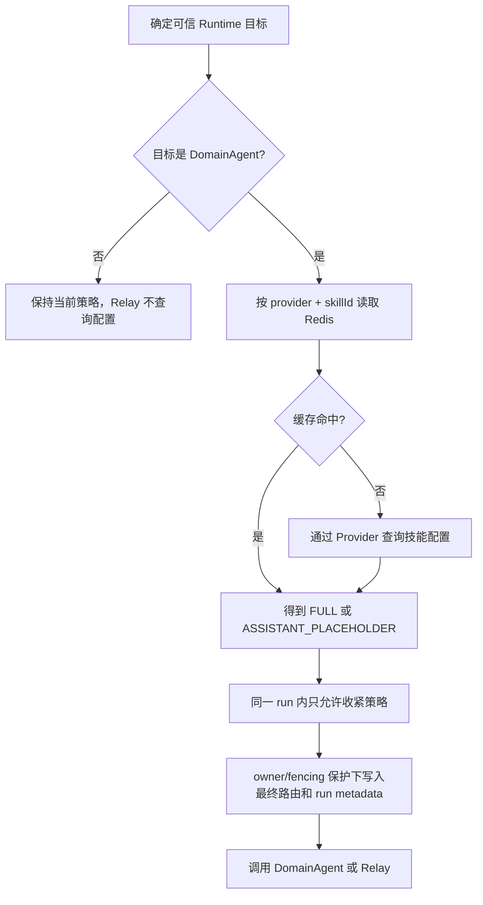

# DomainAgent Assistant 留存控制设计

## 1. 适用范围

本文描述 FinanceEXChatService 当前已经实现的 DomainAgent assistant 历史留存控制。该能力只控制
ChatService 中 assistant 正文和 message parts 的历史投影，不是 `NO_STORE`，也不构成端到端零留存承诺。

以下数据保持原有保存行为：

- 用户消息和附件引用；
- ChatRun、RuntimeBinding、Interaction 和 RouteMemory；
- 完整 ChatEvent、Redis Pub/Sub 实时消息和 Event Resume；
- DomainAgent、模型、工具及其他下游系统自行保存的数据。

## 2. 配置语义

当前策略来自可信 DomainAgent `skillId` 对应配置中的 `isSaveSession`：

| 外部值 | 内部配置值 | 生效策略 |
|---|---:|---|
| `N` 或 `n` | `saveSession=false` | `ASSISTANT_PLACEHOLDER` |
| `Y` 或 `y` | `saveSession=true` | `FULL` |
| `null`、空白、无目标记录 | `saveSession=null` | `FULL` |
| 其他非空值或冲突记录 | 协议错误 | fail closed，不调用 DomainAgent |

功能默认关闭。关闭时不读取 Redis 策略缓存，也不查询外部配置，原有消息、Parts、事件和下游请求保持不变。

## 3. 防腐层

应用层只依赖以下中立接口：

```java
public interface DomainAgentSkillConfigurationProvider {
    Mono<DomainAgentSkillConfiguration> findBySkillId(
            DomainAgentSkillConfigurationQuery query);
}
```

默认实现 `DefaultDomainAgentSkillConfigurationProvider` 依赖同步Client：

```java
public interface DomainAgentSkillConfigurationClient {
    SkillConfigurationResponse findBySkillIds(List<String> skillIds);
}
```

默认Provider通过 `Mono.fromCallable` 包装同步调用，并在 `agentDataPersistenceIoScheduler` 有界调度器中
执行。它只读取响应中的 `status`、`data[].skillId` 和 `data[].isSaveSession`。应用层不依赖企业框架、
服务地址、鉴权实现、外部DTO或 `Y/N`。

`DefaultDomainAgentSkillConfigurationClient` 是必须完成的默认企业集成点。当前源码中的调用体仅用于缺少
企业依赖时保持编译，生产部署前必须替换；应用不通过额外布尔字段探测Client是否已接入。启用功能时会
校验调用超时。企业也可以提供新的 `DomainAgentSkillConfigurationClient` Bean，或提供完整的
`DomainAgentSkillConfigurationProvider` Bean替换默认实现，策略缓存和主编排不需要修改。客户端Cookie、
Authorization和metadata鉴权字段均不会传给技能配置Client。

接入Jalor企业依赖后，默认Client中的TODO调用形式为：

```java
HttpEntity<List<String>> requestEntity = new HttpEntity<>(skillIds);
ResponseEntity<SkillConfigurationResponse> result = jalorRestTemplate.exchangeInApp(
        "findSkillConfigBySkillIds",
        requestEntity,
        SkillConfigurationResponse.class,
        null,
        null);
return result.getBody();
```

对应的企业配置由部署环境提供。本仓库不创建真实 `restServices.properties`，参考内容如下：

```properties
domainAgentSkillConfigService=http://enterprise-service
restConfig.restMap.findSkillConfigBySkillIds.requestUrl=${domainAgentSkillConfigService}/eurekax/agent/services/skillService/findSkillConfigBySkillIds
restConfig.restMap.findSkillConfigBySkillIds.method=POST
```

## 4. 调用顺序



栅栏覆盖以下 DomainAgent 入口：

- 前端显式直连；
- Intent 首次路由和 force reroute；
- active DomainAgent Binding 续接；
- Intent 澄清或 AMBIGUOUS_ROUTE 最终选中；
- DomainAgent 拒答后重路由；
- 路由切换确认。

策略解析失败发生在 Runtime 订阅之前。无有效缓存且 Provider 超时、鉴权失败、服务异常或协议错误时，
本轮禁止调用 DomainAgent，并沿用现有 run 失败收口和未启动 Binding 补偿。

每个新 run 独立解析。单个 run 内发生重路由时只允许：

```text
FULL -> ASSISTANT_PLACEHOLDER
ASSISTANT_PLACEHOLDER -> ASSISTANT_PLACEHOLDER
```

因此同一 run 后续切到 Relay 或可保存 Agent 也不会放宽已经生效的占位策略。不同 run 不继承该限制。

## 5. Redis 缓存

缓存 key：

```text
fin_ex:{env}:agent_data_persistence:domain-agent:{skillId}
```

缓存 value 只允许：

```text
FULL
ASSISTANT_PLACEHOLDER
```

默认 TTL 为 10 分钟，`FULL` 和 `ASSISTANT_PLACEHOLDER` 均缓存。Redis 读取失败时回源 Provider；Provider
成功但 Redis 写入失败时，当前 run 继续使用已解析策略。无缓存且 Provider 失败时不降级为 `FULL`。

Redis同步操作和企业技能配置同步调用共用 `agentDataPersistenceIoScheduler` 有界调度器。该调度器当前
固定为4个线程、128个排队任务。响应式timeout只限制主流程等待时间；企业调用实现仍必须配置自身连接、
读取和调用超时，避免不可中断调用长期占用工作线程。

## 6. Assistant 投影

`FULL` 完全沿用原有行为。

`ASSISTANT_PLACEHOLDER` 下：

- ChatEvent 仍完整落库并实时发布；
- assistant `content` 保存配置的占位文案；
- 不保存 `ANSWER`、`MESSAGE_SNAPSHOT`、`THINKING`、`TOOL`、`REFERENCE`、普通 `CARD` 等业务 Parts；
- 保留 Intent 澄清、AMBIGUOUS_ROUTE、路由切换确认和 Relay 问卷所需控制 Parts；
- completed、waiting、用户 stop 的 partial assistant 和 Interaction 更新使用同一投影规则；
- 原本不会创建 assistant 的失败路径不会因为该策略新增消息。

分享和反馈仍可引用这条 assistant，但只能读取占位正文和保留的控制 Parts。短期记忆会排除带占位标记的
assistant；长期记忆返回值中等于当前占位文案的条目也会在上下文装配时排除。

## 7. 配置项

```yaml
financeex:
  domain-agent-skill-config:
    timeout: ${FINANCEEX_DOMAIN_AGENT_SKILL_CONFIG_TIMEOUT}

  agent-data-persistence:
    enabled: ${FINANCEEX_AGENT_DATA_PERSISTENCE_ENABLED:false}
    cache-ttl: ${FINANCEEX_AGENT_DATA_PERSISTENCE_CACHE_TTL:10m}
    cache-key-prefix: fin_ex:agent_data_persistence
    placeholder-content: ${FINANCEEX_AGENT_DATA_PERSISTENCE_PLACEHOLDER:根据数据留存策略，本次回答不在消息历史中展示。}
```

正数timeout是默认Provider启用时的启动必填项。默认Client必须在生产构建中完成企业调用实现，但应用不
执行额外的接入状态探测。企业自定义 `DomainAgentSkillConfigurationProvider` 覆盖默认Bean后，不要求配置
默认Client或该timeout。

## 8. 运行限制

- 该能力不是事件零留存，完整业务回答仍可从 ChatEvent 和 Event Resume 获取。
- 该能力不向 DomainAgent 或 Relay 发送留存参数，不控制下游存储。
- Redis 缓存存在最多一个 TTL 周期的配置生效延迟；紧急变更需要删除对应 key。
- run metadata 和 assistant metadata 只保存内部策略标记及占位文案，不保存外部配置响应。
