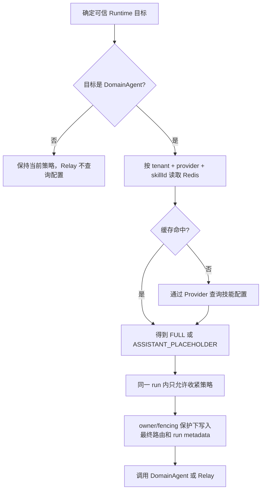

# DomainAgent Assistant 留存控制设计

## 1. 适用范围

本文描述 FinanceEXChatService 当前已经实现的 DomainAgent assistant 历史与业务 Event 留存控制。
该能力不是 `NO_STORE`，也不构成端到端零留存承诺。

以下数据保持原有保存行为：

- 用户消息和附件引用；
- ChatRun、RuntimeBinding、Interaction 和 RouteMemory；
- run 生命周期、Intent、路由、拒答、澄清、确认和终态 ChatEvent；
- Redis Pub/Sub 实时消息；
- DomainAgent、模型、工具及其他下游系统自行保存的数据。

## 2. 配置语义

当前策略来自可信 DomainAgent `skillId` 对应配置中的 `isSaveSession`：

| 外部值 | 内部配置值 | 生效策略 |
|---|---:|---|
| `N` 或 `n` | `saveSession=false` | `ASSISTANT_PLACEHOLDER` |
| `Y` 或 `y` | `saveSession=true` | `FULL` |
| `null`、空白、无目标记录 | `saveSession=null` | `FULL` |
| 其他非空值或冲突记录 | 协议错误 | fail closed，不调用 DomainAgent |

功能默认关闭。关闭时不读取 Redis 策略缓存，也不查询外部配置，原有消息、Parts、事件和下游请求保持不变。

## 3. 防腐层

应用层只依赖以下中立接口：

```java
public interface DomainAgentSkillConfigurationProvider {
    Mono<DomainAgentSkillConfiguration> findBySkillId(
            DomainAgentSkillConfigurationQuery query);
}
```

默认实现 `DefaultDomainAgentSkillConfigurationProvider` 使用非阻塞 HTTP 调用。请求只包含一个可信
`skillId`，并按当前 run 在入口捕获到的 Cookie 透传：

```http
POST {baseUrl}{queryPath}
Content-Type: application/json
Accept: application/json
Cookie: <当前请求Cookie，可选>
```

```json
["e6d6367bf48e4af4bcb0bea5c517d849"]
```

默认 Provider 只读取响应中的 `status`、`data[].skillId` 和 `data[].isSaveSession`。Cookie 只存在于
`RuntimeForwardHeaders` 内存快照和出站 HTTP Header，不进入请求体、Redis、metadata、事件、数据库或
日志；当前请求没有 Cookie 时仍调用接口，但不发送 Cookie Header。该调用不使用 SGOV、Authorization
或其他入口 Header，也不增加重试。

Chat 编排和策略服务不依赖 HTTP 地址、Cookie或外部响应 DTO。未来改为微服务、RPC、本地配置或其他
鉴权方式时，提供新的 `DomainAgentSkillConfigurationProvider` Bean即可替换默认实现，缓存和主编排无需
修改。

## 4. 调用顺序



栅栏覆盖以下 DomainAgent 入口：

- 前端显式直连；
- Intent 首次路由和 force reroute；
- active DomainAgent Binding 续接；
- Intent 澄清或 AMBIGUOUS_ROUTE 最终选中；
- DomainAgent 拒答后重路由；
- 路由切换确认。

策略解析失败发生在 Runtime 订阅之前。无有效缓存且 Provider 超时、鉴权失败、服务异常或协议错误时，
本轮禁止调用 DomainAgent，并沿用现有 run 失败收口和未启动 Binding 补偿。

每个新 run 独立解析。单个 run 内发生重路由时只允许：

```text
FULL -> ASSISTANT_PLACEHOLDER
ASSISTANT_PLACEHOLDER -> ASSISTANT_PLACEHOLDER
```

因此同一 run 后续切到 Relay 或可保存 Agent 也不会放宽已经生效的占位策略。不同 run 不继承该限制。

## 5. Redis 缓存

缓存 key：

```text
fin_ex:{env}:agent_data_persistence:{tenantId}:domain-agent:{skillId}
```

缓存 value 只允许：

```text
FULL
ASSISTANT_PLACEHOLDER
```

默认 TTL 为 10 分钟，`FULL` 和 `ASSISTANT_PLACEHOLDER` 均缓存。Redis 读取失败时回源 Provider；Provider
成功但 Redis 写入失败时，当前 run 继续使用已解析策略。无缓存且 Provider 失败时不降级为 `FULL`。

缓存按租户隔离，同一 `skillId` 不会跨租户共享策略。升级后不再读取旧的无租户缓存 key；旧 key 按原
TTL自然过期，无需迁移。Redis同步操作继续运行在 `agentDataPersistenceIoScheduler` 有界调度器中；默认
Provider的HTTP交换使用WebClient非阻塞执行，并由配置的总超时约束。

## 6. Assistant 投影

`FULL` 完全沿用原有行为。

`ASSISTANT_PLACEHOLDER` 下：

- `message.delta/snapshot/completed` 和普通下游 `runtime.*` 业务 Event 只实时发布，不写入事件表；
- run 生命周期、Intent、路由、拒答、澄清、确认、Relay 问卷和终态 Event 仍落库并实时发布；
- 控制事件只按可信 `source`、精确 `sourceType` 和必要协议字段识别，名字相似的未知下游事件默认 live-only；
- live-only Event 仍从数据库全局 sequence 获取有序编号，但不推进 `run.lastSeq`；
- assistant `content` 保存配置的占位文案；
- 不保存 `ANSWER`、`MESSAGE_SNAPSHOT`、`THINKING`、`TOOL`、`REFERENCE`、普通 `CARD` 等业务 Parts；
- 保留 Intent 澄清、AMBIGUOUS_ROUTE、路由切换确认和 Relay 问卷所需控制 Parts；
- completed、waiting、用户 stop 的 partial assistant 和 Interaction 更新使用同一投影规则；
- 原本不会创建 assistant 的失败路径不会因为该策略新增消息。

分享和反馈仍可引用这条 assistant，但只能读取占位正文和保留的控制 Parts。短期记忆会排除带占位标记的
assistant；长期记忆返回值中等于当前占位文案的条目也会在上下文装配时排除。

Runtime 调用前会在私有 run metadata 中以 owner/fencing 保护记录 `runtimeDispatchStarted=true`。因此用户
主动 stop 时，即使业务 Event 没有落库，仍能确认 Runtime 已经开始并保存占位 assistant；标记写入前 stop
不会额外创建 assistant。`runtime.metadata(session-ready)` 虽属于 live-only Event，仍会更新 run 和
RuntimeBinding 的真实 `runtimeSessionId`。Agent澄清、审批或Relay问卷创建run-B时，从归属正确的source
run继承策略和占位文案，但将`runtimeDispatchStarted`重置为`false`；只有run-B实际调用Runtime前才重新写入。
live-only事件携带的`runtimeSessionId`与当前Binding相同时不查询run表，只有首次建立或真实变化时写回。

## 7. 配置项

```yaml
financeex:
  domain-agent-skill-config:
    base-url: ${FINANCEEX_DOMAIN_AGENT_SKILL_CONFIG_BASE_URL:}
    query-path: ${FINANCEEX_DOMAIN_AGENT_SKILL_CONFIG_QUERY_PATH:}
    timeout: ${FINANCEEX_DOMAIN_AGENT_SKILL_CONFIG_TIMEOUT:2s}

  agent-data-persistence:
    enabled: ${FINANCEEX_AGENT_DATA_PERSISTENCE_ENABLED:false}
    cache-ttl: ${FINANCEEX_AGENT_DATA_PERSISTENCE_CACHE_TTL:10m}
    cache-key-prefix: fin_ex:agent_data_persistence
    placeholder-content: ${FINANCEEX_AGENT_DATA_PERSISTENCE_PLACEHOLDER:根据数据留存策略，本次回答不在消息历史中展示。}
```

使用默认Provider且功能开启时，`base-url`和`query-path`必须显式配置，缺失或非法会阻止应用启动。
`timeout`默认2秒，可由部署环境覆盖，零值、负数或非法格式会阻止启动。企业自定义
`DomainAgentSkillConfigurationProvider`覆盖默认Bean后，不要求配置默认HTTP接口。

## 8. 运行限制

- 该能力不是全量事件零留存：控制与终态事实仍保存在 ChatEvent 表；下游系统也可能自行留存业务数据。
- live-only 业务 Event 不支持 Event Resume。页面初次订阅前、断线期间或 Redis 发布失败时遗漏的内容不可恢复。
- `stream-status.latestSeq` 是最新持久化 Event 位置，不代表最新实时业务 sequence。
- 该能力不向 DomainAgent 或 Relay 发送留存参数，不控制下游存储。
- Redis 缓存存在最多一个 TTL 周期的配置生效延迟；紧急变更需要删除对应 key。
- `financeex.agent-runtime.forward-cookie.enabled=false` 时配置查询仍会执行，但不会携带 Cookie。
- run metadata 和 assistant metadata 只保存内部策略标记及占位文案，不保存外部配置响应。
