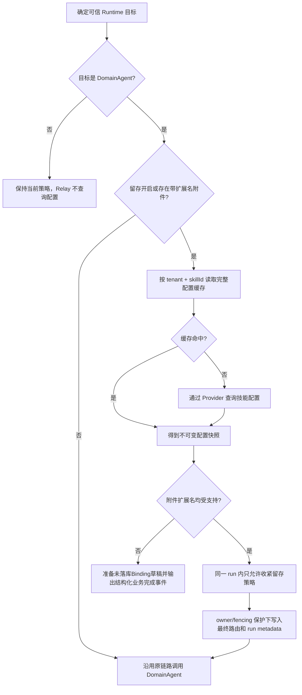

# DomainAgent 技能配置与 Assistant 留存控制设计

## 1. 适用范围

本文描述 FinanceEXChatService 对DomainAgent技能配置的统一查询、缓存、附件类型校验，以及assistant历史与
业务Event留存控制。留存能力不是`NO_STORE`，也不构成端到端零留存承诺。

以下数据保持原有保存行为：

- 用户消息和附件引用；
- ChatRun、RuntimeBinding、Interaction 和 RouteMemory；
- run 生命周期、Intent、路由、拒答、澄清、确认和终态 ChatEvent；
- Redis Pub/Sub 实时消息；
- DomainAgent、模型、工具及其他下游系统自行保存的数据。

## 2. 配置语义

内部不可变配置快照包含：

```text
skillId
skillName
saveSession
attachmentType
```

留存策略来自可信DomainAgent `skillId`对应配置中的`isSaveSession`：

| 外部值 | 内部配置值 | 生效策略 |
|---|---:|---|
| `N` 或 `n` | `saveSession=false` | `ASSISTANT_PLACEHOLDER` |
| `Y` 或 `y` | `saveSession=true` | `FULL` |
| `null`、空白、无目标记录 | `saveSession=null` | `FULL` |
| 其他非空值或冲突记录 | 协议错误 | fail closed，不调用 DomainAgent |

留存控制默认关闭。此时无附件或附件均无扩展名的调用不读取配置；带扩展名附件仍会读取同一配置快照完成
`attachmentType`校验。Relay和系统响应始终不读取DomainAgent技能配置。

## 3. 防腐层

应用层只依赖以下中立接口：

```java
public interface DomainAgentSkillConfigurationProvider {
    Mono<DomainAgentSkillConfiguration> findBySkillId(
            DomainAgentSkillConfigurationQuery query);
}
```

默认实现 `DefaultDomainAgentSkillConfigurationProvider` 使用非阻塞 HTTP 调用。请求只包含一个可信
`skillId`，并按当前 run 在入口捕获到的 Cookie 透传：

```http
POST {baseUrl}{queryPath}
Content-Type: application/json
Accept: application/json
Cookie: <当前请求Cookie，可选>
```

```json
["e6d6367bf48e4af4bcb0bea5c517d849"]
```

默认 Provider 只读取响应中的 `status`、`data[].skillId`、`data[].skillName`、
`data[].isSaveSession`和`data[].attachmentType`。Cookie 只存在于
`RuntimeForwardHeaders` 内存快照和出站 HTTP Header，不进入请求体、Redis、metadata、事件、数据库或
日志；当前请求没有 Cookie 时仍调用接口，但不发送 Cookie Header。该调用不使用 SGOV、Authorization
或其他入口 Header，也不增加重试。

Chat 编排和策略服务不依赖 HTTP 地址、Cookie或外部响应 DTO。未来改为微服务、RPC、本地配置或其他
鉴权方式时，提供新的 `DomainAgentSkillConfigurationProvider` Bean即可替换默认实现，缓存和主编排无需
修改。

## 4. 调用顺序



栅栏覆盖以下 DomainAgent 入口：

- 前端显式直连；
- Intent 首次路由和 force reroute；
- active DomainAgent Binding 续接；
- Intent 澄清或 AMBIGUOUS_ROUTE 最终选中；
- DomainAgent 拒答后重路由；
- 路由切换确认。

路由切换确认只使用本次`approved=true`请求显式提交并重新鉴权的附件，不自动继承原run附件，也不修改原user消息附件关系。

配置解析发生在Runtime订阅之前。留存控制开启时，无有效缓存且Provider超时、服务异常或协议错误继续
fail closed，本轮不调用DomainAgent并沿用现有失败收口和Binding补偿。仅附件校验需要配置时，Provider失败
记录告警并fail open，避免新增配置依赖阻断原有调用。

每个新 run 独立解析。单个 run 内发生重路由时只允许：

```text
FULL -> ASSISTANT_PLACEHOLDER
ASSISTANT_PLACEHOLDER -> ASSISTANT_PLACEHOLDER
```

因此同一 run 后续切到 Relay 或可保存 Agent 也不会放宽已经生效的占位策略。不同 run 不继承该限制。

## 5. Redis 缓存

版本化缓存 key：

```text
fin_ex:{env}:domain_agent_skill_config:v1:{tenantId}:{skillId}
```

缓存value为完整`DomainAgentSkillConfiguration` JSON，不再只缓存留存枚举。`cache-enabled`默认开启，
TTL为10分钟；Redis读取失败时回源Provider，Provider成功但Redis写入失败时当前调用继续使用已解析快照。

`cache-enabled=false` 时完全跳过 Redis `GET/SET`，每次新的策略解析都直接查询 Provider，`cache-ttl`
不参与该模式。关闭缓存不会删除已有key。Interaction continuation仍继承
source run 已固化的策略，不因等待期间配置变化重新查询或放宽 no-store 策略。

缓存按租户隔离，同一`skillId`不会跨租户共享配置。升级后不再读取旧的
`agent_data_persistence`枚举key，旧key按原TTL自然过期，无需迁移。Redis同步操作继续运行在
`agentDataPersistenceIoScheduler`有界调度器中；默认
Provider的HTTP交换使用WebClient非阻塞执行，并由配置的总超时约束。

## 6. 附件类型校验

- 文件事实只使用当前主流程已经解析的`UploadedDocument.originalName`，不增加附件SQL；
- `.xlsx.xls;.rar;.zip`解析为`.xlsx/.xls/.rar/.zip`，按小写扩展名比较；
- 文件扩展名取最后一个非首位`.`之后的内容；无扩展名文件直接允许；
- `attachmentType`缺失或空白表示不限制；非空但无法解析合法扩展名时记录告警并放行；
- 任一带扩展名附件不支持时拒绝整个DomainAgent调用，不生成`message.delta`。

拒绝事件顺序为`runtime.progress -> runtime.card -> message.completed -> run.completed`，公共payload使用
`sourceType=domain-agent-attachment-validation`和`code=DOMAIN_AGENT_ATTACHMENT_TYPE_UNSUPPORTED`，并携带
技能、支持格式及不支持附件清单。该结果是业务完成而非系统失败；FULL保存结构化Parts，
ASSISTANT_PLACEHOLDER保存占位正文和必要控制Parts，Event Resume可恢复。校验拒绝时只在run内存中准备最终
DomainAgent Binding草稿，不提前取消旧Binding、写数据库或更新Redis；只有`run.completed`终态事务成功时，
才与Event、assistant、run和execution一起原子取消旧Binding并激活最终Binding。下一轮随后继续直连该技能；
本轮不订阅Runtime，是否实际调用由`skillInvocationStarted=false`明确区分。终态事务失败、stop、owner失效或
watchdog收口均不会激活草稿，附件校验前的Binding状态保持不变；可信拒答已经取消的旧Binding不恢复。
路由切换确认的附件拒绝不会提前持久化`route-switch-applied`；该事件与`run.completed`批量写入同一终态事务，
并在Binding缓存同步后按sequence发布。stop、失权或终态回滚只保留确认响应和已经提交的校验过程事件，
不会留下可被Resume误解为切换成功的事件。

## 7. Assistant 投影

`FULL` 完全沿用原有行为。

`ASSISTANT_PLACEHOLDER` 下：

- `message.delta/snapshot/completed` 和普通下游 `runtime.*` 业务 Event 只实时发布，不写入事件表；
- run 生命周期、Intent、路由、拒答、澄清、确认、Relay 问卷和终态 Event 仍落库并实时发布；
- 控制事件只按可信 `source`、精确 `sourceType` 和必要协议字段识别，名字相似的未知下游事件默认 live-only；
- live-only Event 仍从数据库全局 sequence 获取有序编号，但不推进 `run.lastSeq`；
- assistant `content` 保存配置的占位文案；
- 不保存 `ANSWER`、`MESSAGE_SNAPSHOT`、`THINKING`、`TOOL`、`REFERENCE`、普通 `CARD` 等业务 Parts；
- 保留 Intent 澄清、AMBIGUOUS_ROUTE、路由切换确认、附件校验结果和 Relay 问卷所需控制 Parts；
- completed、waiting、用户 stop 的 partial assistant 和 Interaction 更新使用同一投影规则；
- 原本不会创建 assistant 的失败路径不会因为该策略新增消息。

分享和反馈仍可引用这条 assistant，但只能读取占位正文和保留的控制 Parts。短期记忆会排除带占位标记的
assistant；长期记忆返回值中等于当前占位文案的条目也会在上下文装配时排除。

Runtime 调用前会在私有 run metadata 中以 owner/fencing 保护记录 `runtimeDispatchStarted=true`。因此用户
主动 stop 时，即使业务 Event 没有落库，仍能确认 Runtime 已经开始并保存占位 assistant；标记写入前 stop
不会额外创建 assistant。`runtime.metadata(session-ready)` 虽属于 live-only Event，仍会更新 run 和
RuntimeBinding 的真实 `runtimeSessionId`。Agent澄清、审批或Relay问卷创建run-B时，从归属正确的source
run继承策略和占位文案，但将`runtimeDispatchStarted`重置为`false`；只有run-B实际调用Runtime前才重新写入。
live-only事件携带的`runtimeSessionId`与当前Binding相同时不查询run表，只有首次建立或真实变化时写回。

## 8. 配置项

```yaml
financeex:
  domain-agent-skill-config:
    base-url: ${FINANCEEX_DOMAIN_AGENT_SKILL_CONFIG_BASE_URL:}
    query-path: ${FINANCEEX_DOMAIN_AGENT_SKILL_CONFIG_QUERY_PATH:}
    timeout: ${FINANCEEX_DOMAIN_AGENT_SKILL_CONFIG_TIMEOUT:2s}
    cache-enabled: ${FINANCEEX_DOMAIN_AGENT_SKILL_CONFIG_CACHE_ENABLED:${FINANCEEX_AGENT_DATA_PERSISTENCE_CACHE_ENABLED:true}}
    cache-ttl: ${FINANCEEX_DOMAIN_AGENT_SKILL_CONFIG_CACHE_TTL:${FINANCEEX_AGENT_DATA_PERSISTENCE_CACHE_TTL:10m}}
    cache-key-prefix: ${FINANCEEX_DOMAIN_AGENT_SKILL_CONFIG_CACHE_KEY_PREFIX:fin_ex:domain_agent_skill_config:v1}

  agent-data-persistence:
    enabled: ${FINANCEEX_AGENT_DATA_PERSISTENCE_ENABLED:false}
    placeholder-content: ${FINANCEEX_AGENT_DATA_PERSISTENCE_PLACEHOLDER:根据数据留存策略，本次回答不在消息历史中展示。}
```

使用默认Provider且功能开启时，`base-url`和`query-path`必须显式配置，缺失或非法会阻止应用启动。
`timeout`默认2秒，可由部署环境覆盖，零值、负数或非法格式会阻止启动。企业自定义
`DomainAgentSkillConfigurationProvider`覆盖默认Bean后，不要求配置默认HTTP接口。

## 9. 运行限制

- 该能力不是全量事件零留存：控制与终态事实仍保存在 ChatEvent 表；下游系统也可能自行留存业务数据。
- live-only 业务 Event 不支持 Event Resume。页面初次订阅前、断线期间或 Redis 发布失败时遗漏的内容不可恢复。
- `stream-status.latestSeq` 是最新持久化 Event 位置，不代表最新实时业务 sequence。
- 该能力不向 DomainAgent 或 Relay 发送留存参数，不控制下游存储。
- 缓存开启时，配置变更最多延迟一个 TTL 周期生效；需要每次实时获取时可关闭缓存并重启服务。
- `financeex.agent-runtime.forward-cookie.enabled=false` 时配置查询仍会执行，但不会携带 Cookie。
- run metadata 和 assistant metadata 只保存内部策略标记及占位文案，不保存外部配置响应。
