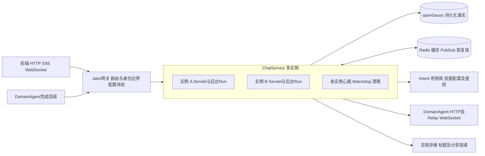
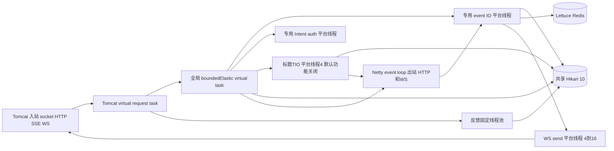
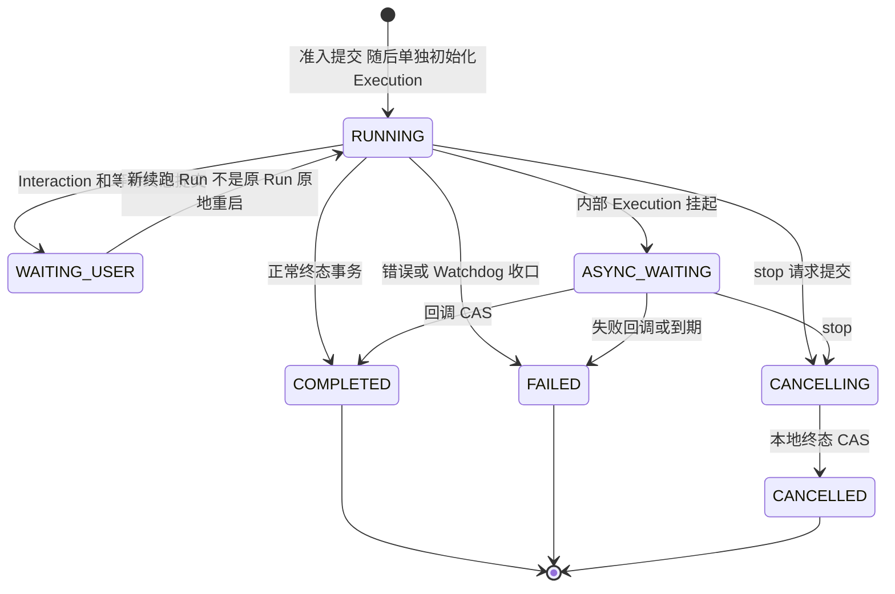

# 架构、状态与资源运行视图

## A1. 多实例依赖图

实例 A/B 具有相同出站能力，按依赖类型归组，具体协议与阶段见后续时序图。共享数据库约束和 Execution fencing 保证跨实例单写者；本地 Semaphore、队列、连接注册表不跨实例共享。Redis 恢复锁是优化，不替代数据库 claim。

Jalor网关、数据库主备、Redis Cluster、Relay 集群的部署拓扑没有提供。图中并不表示它们已经消除了单点。内部回调依赖Jalor网关ACL作为上线前提，不使用用户Cookie；其实际来源限制、超时、重试、连接与配额均待确认，不能把图中文字当成已验证的网关保障。

## A2. 请求、线程与连接

这不是固定“每请求一条链上所有线程”的分配：Controller 的 Mono 交给 MVC 异步适配，阻塞工作按代码 `subscribeOn/publishOn` 调度；等待网络响应通常不独占线程，但保留 socket、订阅、队列和上下文。数据库 JDBC、Redis 同步 API、企业 token、S3 SDK 仍可能阻塞正在执行的任务。

- Boot 3.4.6 `TomcatVirtualThreadsWebServerFactoryCustomizer` 设置 `VirtualThreadExecutor`。默认 8192 是 Connector 的连接上限，不是线程数；200 是 accept backlog 配置，不是额外可运行任务。
- Boot 的 `ReactorEnvironmentPostProcessor` 根据 `spring.threads.virtual.enabled=true` 设置 Reactor 虚拟线程开关。全局 `boundedElastic()` 默认逻辑执行上限为 `10 × availableProcessors`，不是无限并发。
- 显式 `Schedulers.newBoundedElastic(max, queue, name)` 仍使用平台线程；`queue` 是每个 backing thread 的待执行任务上限，不能简单视为整个池的一条队列。
- `ThreadPoolTaskExecutor` 的 queue-capacity 则是整个池队列。先用 core 线程、再排队、队列满后才增长至 max，不能假设 max 从一开始就全部工作。
- WS 空闲时不占一个持续运行的 Tomcat handler 线程；发送使用独立 drain 线程。16 个发送线程不等于最多 16 个连接，16 个同时阻塞的发送仍可耗尽该池。
- HTTP、SSE、前端 Upgrade 后的 WS 仍占 Tomcat socket；出站 Relay WS、HTTP、Hikari、Lettuce、S3 另外消耗连接和文件描述符。

依赖有效默认值及隔离实验见[容量](capacity.md)与[验证](verification.md)。不要将 JDK21 虚拟线程视为数据库连接池隔离或 OOM 防护。

Run在准入commit、Run缓存同步后才调度标题，随后独立初始化Execution及提交run.started；标题任务可与这些阶段重叠。标题生成8许可只包住生成Publisher，不包住候选查询和Session提交事务，详见[标题TT图](session-title-flow.md)。主链路每个阶段的调度/提交边界见[启动步骤表](run-startup-details.md)。

## A3. 持久化与内存事实

| 对象 | 事实源与生命周期 | 关键约束 |
|---|---|---|
| Session | 数据库；metadata 中含聚合专家逻辑范围，current leaf、node order 属消息树 | 准入/树变更持 Session 行锁后重读；管理接口同一锁协议 |
| Run | 数据库；业务状态、user/assistant、可信 route/runtime metadata | 每会话最多一个 RUNNING/CANCELLING；最新状态不是 Execution 状态 |
| Execution | 数据库；owner、fencing、lease、内部执行阶段 | 心跳续租、过期 claim；旧 owner 的事件/终态必须被拒绝 |
| Interaction | 数据库；等待问题/候选、claim、continueRun、回答 | WAITING 到 RESPONDING 的 CAS；条件失败释放；普通澄清准入即ANSWERED，复用消息型在后续完成/等待终态ANSWERED |
| Binding | 数据库决定后续路由，Redis 热缓存 | ACTIVE 可续接；RESUMABLE 不是当前默认路由；TTL 默认 0s |
| Event/assistant/Parts | 数据库事实；实时通道为派生交付 | FULL 保存结果；no-store 仅占位和控制事实；sequence 用于恢复去重 |
| 本机 execution registry/permit | 内存；跟随后台 Flux 订阅 | 实例退出即消失，不是持久化 active Run 数量 |
| 偏好/RouteMemory | 数据库增强上下文，各自隔离执行器 | 读取有界、失败开放；不是核心状态提交的跨服务事务 |

## A4. Run 与恢复状态

图中 `ASYNC_WAITING` 是 **Execution** 状态，业务 Run 仍为 `RUNNING`，不是新增公开 Run 枚举。`WAITING_USER -> RUNNING` 表示新 Run 续跑关系，原 Run 保留等待记录。Recovery 的 `RECOVERING` 同样是内部状态，不能用作列表业务状态。

## A5. 主链路保障及边界

- 可信消息、附件和 owner 来源于数据库/身份上下文，客户端 metadata 不能覆盖 runId、skillId、fencing 等私有字段。
- 聚合专家 scope 在准入短事务中确定；显式切换已提交即生效，不因为后续 Intent 失败恢复旧 scope。
- 附件拒绝的候选 Binding 延迟到 `run.completed` 原子激活；不是靠 JVM 异步补偿保证该路径一致性。
- 正常 Runtime 订阅前的既有补偿仍是有界 best-effort，不等同跨实例持久化 Saga。
- Event 提交后才更新派生缓存及推送；因此“数据库正确但实时未送达”仍可能发生。
- Watchdog 是有界抢占/失败收口，不是所有下游任务自动无损续跑。默认 recovery port 不支持实际恢复。

源码入口：[ChatRunStartCoordinator](../../../src/main/java/com/huawei/it/ex/one/application/service/chat/ChatRunStartCoordinator.java)、[ChatRunAdmissionCommitService](../../../src/main/java/com/huawei/it/ex/one/application/service/chat/ChatRunAdmissionCommitService.java)、[ChatRunTerminalCommitService](../../../src/main/java/com/huawei/it/ex/one/application/service/chat/ChatRunTerminalCommitService.java)、[ChatEventPipeline](../../../src/main/java/com/huawei/it/ex/one/application/service/chat/ChatEventPipeline.java)、[RuntimeBindingApplicationService](../../../src/main/java/com/huawei/it/ex/one/application/service/runtime/RuntimeBindingApplicationService.java)。
