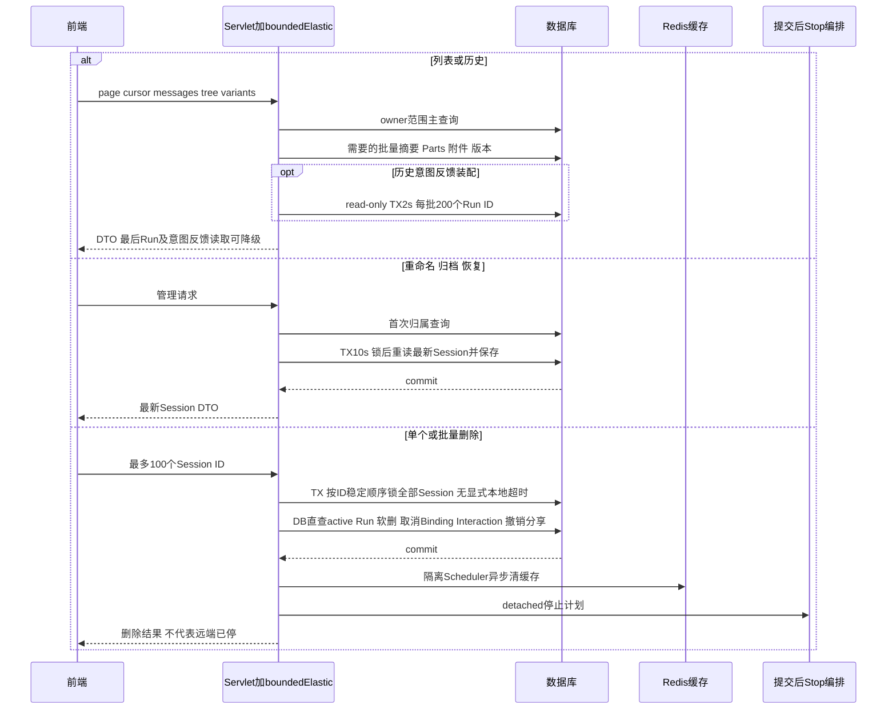
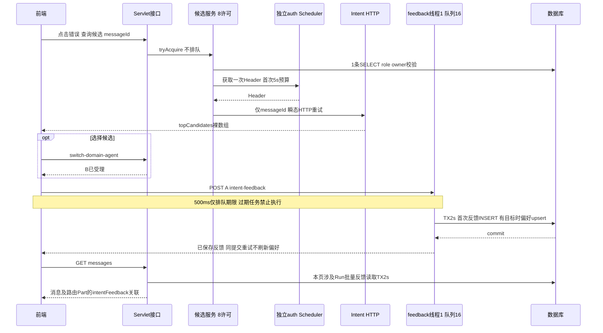
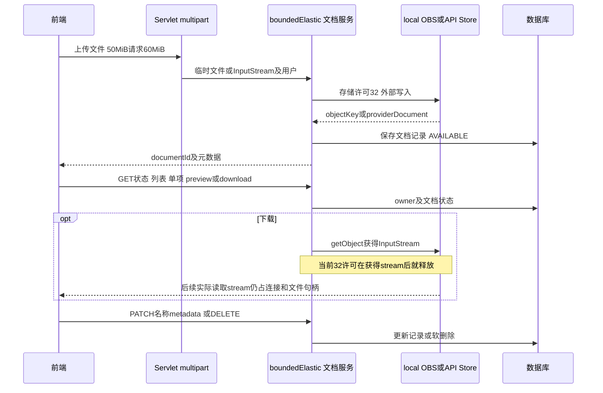
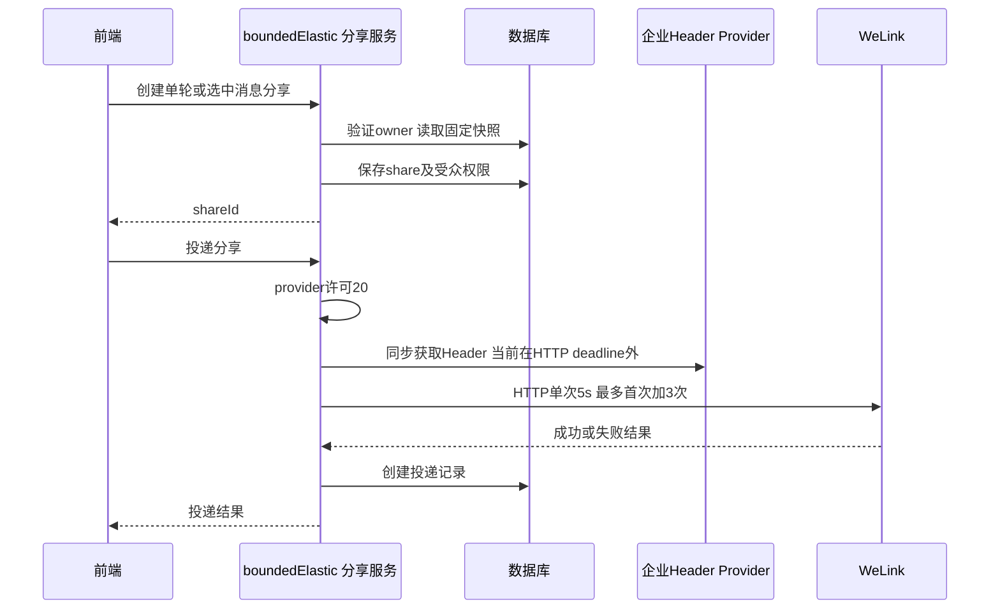

# 辅助接口运行视图

本页覆盖接口索引H1-H4。它们共享Hikari、Redis或全局调度资源，不能因“不调用聊天Runtime”就认定对主链路无影响。

## H1. 会话列表、历史与会话管理

### 查询次数与数据规模

| 操作 | 数据库/缓存模型 | 已有保护与剩余边界 |
|---|---|---|
| 游标Session列表 | 主查询 + 本页最后Run状态批量 + 首assistant摘要批量 | 状态2s失败返回null；不读取skill metadata；摘要可能读取大正文 |
| page无keyword | count + 最多一次分页数据 + 状态/skill摘要一次 + 首assistant摘要 | pageSize最多200；普通count/page不自动拥有搜索TX2s |
| page有keyword | 同上；count+page共享keyword条件和2s只读TX | owner/app/channel AND，title/user/assistant ILIKE OR EXISTS；单字符更易扩大扫描；不使用GIN |
| 最后Run摘要 | 当前页session IDs窗口按created_at/id；page再同SQL读取最后Run metadata | 非空页1次，无Run/异常null；依赖手工性能索引；JSON大小未统一限制 |
| messages分页 | current path消息 + Parts/attachments批量 + versionInfo + 普通反馈及本响应来源Run意图反馈批量 | 主分页200不保证版本递归/Parts/正文总字节有界；仅意图反馈失败省略，普通LIKE/DISLIKE查询失败会影响请求 |
| tree | 全消息树及关联Parts/attachments | 无总节点/字节上限；不能当高频轮询接口 |
| variants | siblings及关联Parts/附件/反馈；不装配versionInfo | 后继递归版本摘要属于messages分页，不是此接口额外查询 |
| path切换 | owner/未删除/消息归属验证 + 当前leaf更新 | 当前没有Session锁、active Run检查或CAS；归档会话也可切换，见R24 |
| branch | 新session + 祖先链消息/Parts/附件复制 + leaf更新 | 当前未包住整个拷贝的原子事务，失败可能留下部分分支 |

令 `P` 为本页会话数、`E` 为历史事件行数、`V` 为分页版本摘要后继节点、`A` 为唯一附件数、`F` 为意图反馈涉及来源Run数。最后Run查询为一次批量而非P次；意图反馈最多`ceil(F/200)`次批量、同2s事务；附件解析当前为A次点查，A≤20；Resume读取量O(E)，分页版本遍历O(V)。这不是端到端SQL精确常数，因为归属、缓存命中、Part种类、终态分支会改变查询数。

辅助字段并非统一失败开放：最后Run状态/Skill及意图反馈有降级；首assistant摘要与普通消息LIKE/DISLIKE读取异常仍会使请求失败。删除虽已DB-only并按ID稳定加锁，但没有显式本地事务deadline，不能沿用重命名的10s结论。

软删除不是事件物理清理：没有默认Event分区/归档清理任务。表随消息、重试/重意图、卡片和版本增长，必须单独规划保留期、统计信息和VACUUM/维护窗口。

源码：[MyBatisSessionRepository](../../../src/main/java/com/huawei/it/ex/one/infrastructure/session/MyBatisSessionRepository.java) L186、[SessionApplicationService](../../../src/main/java/com/huawei/it/ex/one/application/service/chat/SessionApplicationService.java) L350/L401/L836/L848、[ChatMessageMapper](../../../src/main/resources/mapper/memory/ChatMessageMapper.opengauss.xml) L402/L472、[ChatRunMapper](../../../src/main/resources/mapper/persistence/ChatRunMapper.opengauss.xml)。风险R02/R03/R11/R15/R17/R18/R23/R24。

## H2. 候选、反馈与偏好

- 候选查询仅一条主表role查询，不取正文、Parts/附件；missing/跨用户按ACCESS_DENIED，非user400，不调用Intent。候选顺序/accessName保留，skillId按响应前缀规则派生。
- 反馈CORRECT有明确目标与INCORRECT_SWITCH会自动upsert偏好；纯INCORRECT_COMMENT或无目标CORRECT只保存评价。两表在独立TX2s内原子写入。
- 同Run首次反馈不可撤销修改；相同内容幂等成功，不再次upsert，不刷新时间；不同内容409。replacement Run必须与source可信关联。
- 普通消息点赞/点踩有自己的可变记录，不能混作意图准确性反馈。
- 历史消息级intentFeedback只属于本Run；回放Parts按originRunId关联A/B/C各自评价，不篡改原Event/sequence。GET反馈用于没有assistant等补充场景。
- 旧偏好接口保持存在，INTENT_CANDIDATE验证user来源，AMBIGUOUS_ROUTE只接受已受理人工选择；same-source最近一次upsert覆盖。其执行器仍为1+1000，不具备新feedback排队超时。
- 后续实际Intent前最近N=5、0到20，按tenant/user/逻辑入口查询；读取300ms失败开放，独立线程/熔断器。偏好不即时补进已经发出的Intent请求，未拼接部署前缀。
- HTTP候选错误：本机忙429、最终HTTP超时504、其他上游失败502；下游429不重试且映射502，不混同本机429。

源码：[IntentCandidateApplicationService](../../../src/main/java/com/huawei/it/ex/one/application/service/routing/IntentCandidateApplicationService.java) L46、[IntentFeedbackTaskDispatcher](../../../src/main/java/com/huawei/it/ex/one/application/service/routing/IntentFeedbackTaskDispatcher.java) L50、[IntentPreferenceCorrectionApplicationService](../../../src/main/java/com/huawei/it/ex/one/application/service/routing/IntentPreferenceCorrectionApplicationService.java) L85、[IntentPreferenceCorrectionLoader](../../../src/main/java/com/huawei/it/ex/one/infrastructure/intent/IntentPreferenceCorrectionLoader.java)。风险R02/R06/R10。

## H3. 文档生命周期

各存储互斥由provider选择，不是每次同时写三份。local文件系统不提供多实例共享/容灾保证；生产多实例如使用local需要外部共享卷或明确限制部署。

- `api-store`在HTTP调用前整份读入内存，最多32×50MiB原始数组即约1.56GiB，尚未计复制和multipart；HTTP30s不覆盖前面的本地读入。
- OBS连接池200、TCP10s/socket30s，但SDK未配置总体callTimeout；SDK还有自身重试。下载慢客户端会持有返回InputStream，32保护不能当完整下载并发限制。
- 外部上传成功后DB保存失败没有原子跨服务回滚，可能遗留未追踪对象；前端重试会新生成存储key。删除是记录软删，不物理清理对象。
- preview-url返回本服务相对下载URL、`mode=BACKEND_STREAM`、`expiresAt=null`，不是存储商预签名URL。provider管理文档若不支持下载则拒绝，不返回可绕过后端归属校验的URL。
- 当前PATCH可整体替换metadataJson，包含providerDocument时会影响之后“可信附件”的docId/url；应限制可编辑字段，不让用户覆盖服务端存储引用。
- OBS3.25.10证书与hostname校验默认关闭且本仓未显式启用；只在huawei-s3路径生效，见R22。不能因为URL以https开头就认为已验证服务端身份。

源码：[DocumentApplicationService](../../../src/main/java/com/huawei/it/ex/one/application/service/document/DocumentApplicationService.java) L79/L117/L291、[ApiStoreDocumentStorage](../../../src/main/java/com/huawei/it/ex/one/infrastructure/storage/api/ApiStoreDocumentStorage.java) L67、[ObjectStorageDocumentStorage](../../../src/main/java/com/huawei/it/ex/one/infrastructure/storage/object/ObjectStorageDocumentStorage.java) L74。风险R12/R21/R22。

## H4. 分享、投递和标题

GET share只读固定快照，默认受众为已认证同租户用户并检查生命周期；GET列表为本人分享。DELETE share撤销访问资格，不召回外部消息。单消息入口实际保存父user与assistant的一轮快照；选中分享要求同一归属会话、同一祖先路径，并按路径排序，最多50消息和5MiB序列化快照，不带动态Intent反馈。

WeLink默认关闭。外部发送与数据库记录不是原子事务；所有失败立即重试，超时后远端可能已成功，没有下游幂等键会重复发送。后补数据库记录失败也可能诱导前端重投。先验证下游去重能力，再决定增设持久投递ID/状态机，不能靠扩大事务把外部副作用回滚。

会话删除会撤销当时存在的分享；并发创建若不持同一Session锁，仍可能在撤销后插入新分享，须补并发测试和锁/状态检查，见R18。

标题功能默认关闭；使用默认HTTP Provider开启时必须配置正值timeout≤30s和必要鉴权；自定义Provider不经过该HTTP Bean校验，应用timeout回退30s。详见[标题专项TT01-TT19](session-title-flow.md)：准入提交及Run缓存同步后调度，先查Session、轻量消息路径和关联Run，再取8个生成许可；专用4线程/每线程128排队；生成后独立TX2s按最新Session及人工标题条件更新，不改变排序时间。HTTP期限不保护前置DB与提交等待，“只传前三个问题”不是“只读三条数据”。任务不可靠排队，当前无标题WebSocket通知，前端通过会话接口读回。Intent识别记录同为默认关闭旁路；RouteMemory/偏好写入有界但没有可靠消息保证。

源码：[ChatShareDeliveryApplicationService](../../../src/main/java/com/huawei/it/ex/one/application/service/share/ChatShareDeliveryApplicationService.java) L88/L221、[WelinkChatShareDeliveryProvider](../../../src/main/java/com/huawei/it/ex/one/infrastructure/share/WelinkChatShareDeliveryProvider.java) L62、[SessionTitleApplicationService](../../../src/main/java/com/huawei/it/ex/one/application/service/chat/SessionTitleApplicationService.java) L84。风险R06/R18/R19。
