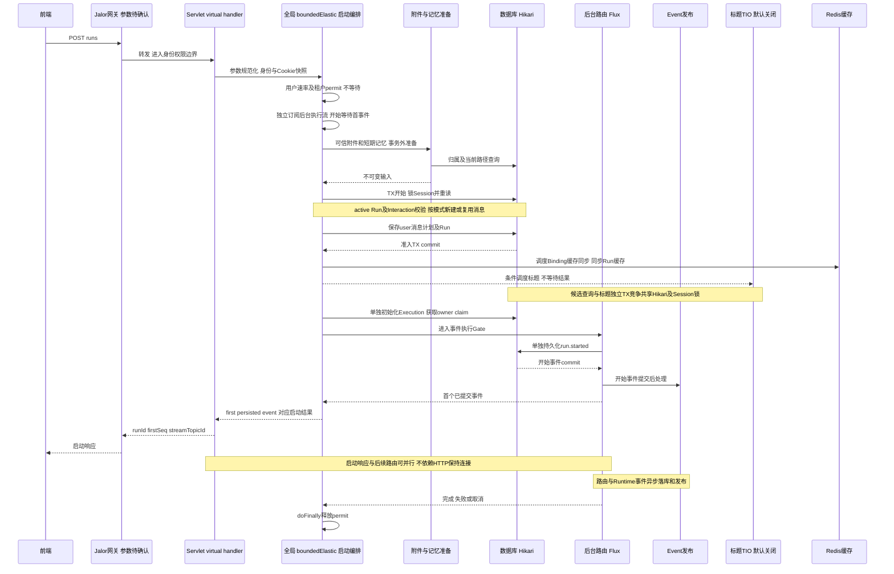
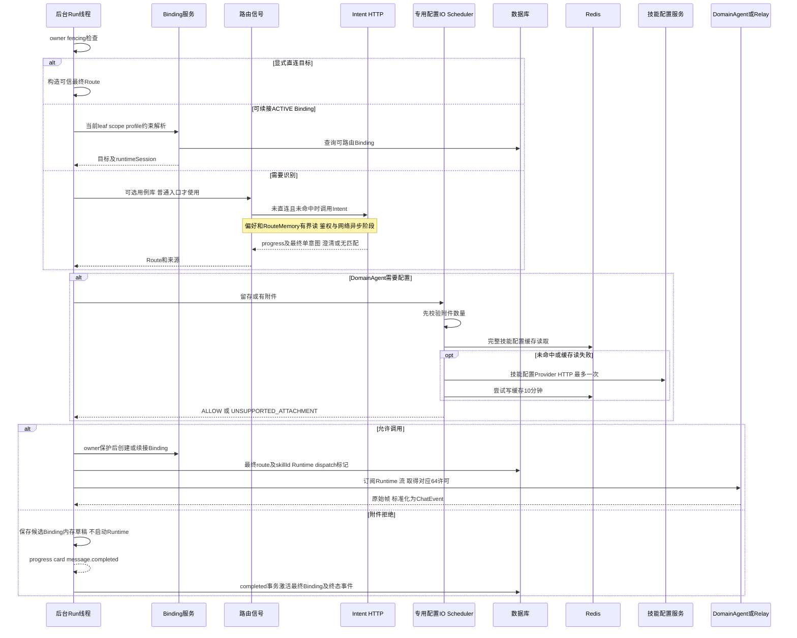
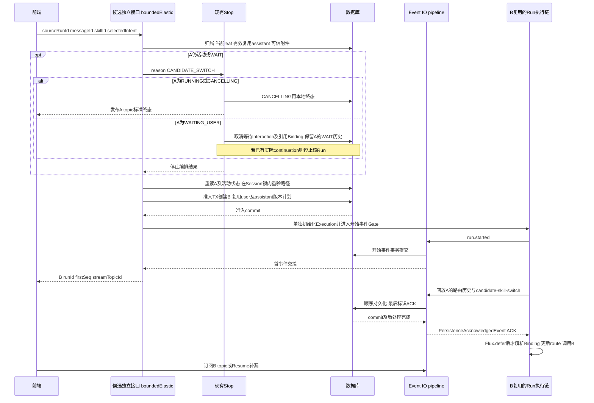
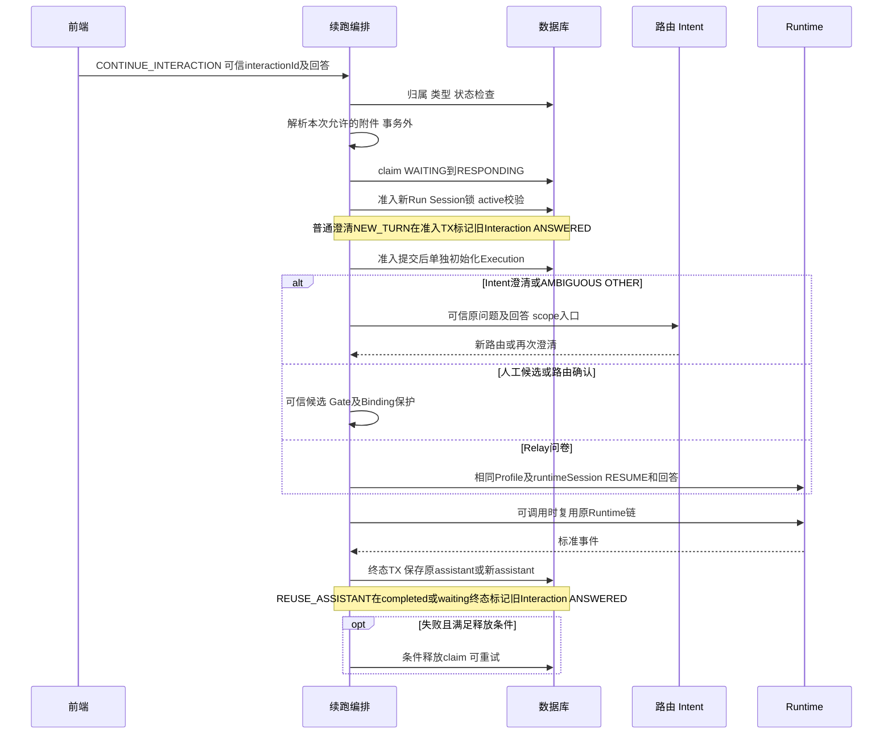

# 聊天主链路运行视图

本文的“线程”表示执行阶段，不表示一个 Run 永久占有该线程。所有 API 的错误外壳和前端重试规则见[接口索引](interfaces.md)。

本文保留端到端总览。逐步审计依次阅读[入口到启动](run-startup-details.md)、[标题提炼](session-title-flow.md)、[路由及第三方](run-routing-details.md)、[事件和控制](run-control-details.md)。详图的步骤编号与风险表一一关联，不能以总览中合并的箭头替代实际SQL/Redis及排队成本。

## C1. POST /runs：准入、启动与首事件

要点：
- `first-event-timeout=30s` 约束启动确认，不是总运行时限。客户端HTTP超时并不证明Run未创建；先查`stream-status`再决定是否重新提交，避免重复问题。
- 附件解析和记忆准备在Session锁之外，但占用本机准入许可。附件最多20个，每唯一ID当前逐个查询，DB慢时放大准入延迟。
- 锁后Session重读决定聚合专家scope，避免旧准备快照覆盖专家选择。普通模式的query、可信userMessageId与Run关联后才调用Intent。
- Run metadata、客户端user metadata、下游metadata与私有控制字段不是同一个可信层次；请求translator清理私有字段，user metadata仅随新建user INSERT保存。
- 准入事务只原子保存消息计划和Run等准入事实，Execution初始化与`run.started`在其后分别执行，不是一个总事务。后续初始化失败由独立失败/超时补偿及治理收口，不能回滚已经提交的准入。首事件提交后才放行路由；启动结果交接不代表浏览器消费。

源码：[ChatRunStartCoordinator](../../../src/main/java/com/huawei/it/ex/one/application/service/chat/ChatRunStartCoordinator.java) L57/L132/L305、[StandardRunInputPreparer](../../../src/main/java/com/huawei/it/ex/one/application/service/chat/StandardRunInputPreparer.java)、[ChatRunAdmissionCommitService](../../../src/main/java/com/huawei/it/ex/one/application/service/chat/ChatRunAdmissionCommitService.java) L52。

### 各模式差异

| 模式 | 消息树与输入 | 并发/前端处理 |
|---|---|---|
| NEXT | 新user，包括附件-only；新assistant沿当前leaf延伸 | 不能与同会话active Run并行；成功后订阅新topic |
| EDIT_USER | 创建user新版本，不覆盖旧分支 | 必须满足当前路径/可编辑校验；刷新展示新路径 |
| REGENERATE_ASSISTANT | 复用历史user，创建assistant sibling | 不自动stop活动Run；仍受active Run冲突保护 |
| CONTINUE_INTERACTION | 先识别可信Interaction类型及claim，再决定新user/复用assistant | 不是自由指定任意历史assistant；参见C4 |
| target DOMAIN_AGENT | 可信targetId直连，不先查Intent | 仍应传本入口intentAccessName供拒答重意图 |
| target DOMAIN_EXPERT | Relay固定专家，profile+roleName隔离runtimeSession | 正常完成/运行中stop后保持ACTIVE；明确重选替换 |
| target INTENT_EXPERT | 锁内保存父专家scope，子技能由专属Intent入口选择 | 身份改变取消旧范围ACTIVE Binding；同身份续接，名称变化只更新展示 |
| forceReroute | 取消当前固定路由后重新选择 | 不等于stop；活动Run仍返回冲突。逻辑入口由请求/专家scope确定 |

## C2. 路由、配置Gate和下游

技能配置HTTP与Runtime是不同服务调用，不是向DomainAgent聊天地址重复查询配置。共享配置服务是唯一Provider/Redis入口，留存和附件校验共用一个快照。

### 意图与上下文

- 普通路径：显式目标优先；满足范围的ACTIVE Binding跳过用例库/Intent；无Binding再走信号选择。聚合专家无子Binding时跳过用例库，使用scope入口。
- Intent阻塞/流式共用请求mapper。前端逻辑`intentAccessName`trim后仅在出站拼接`request-access-name-prefix`；未传使用服务端默认入口且不加前缀。Run/偏好分组仍保留逻辑值。
- 同次重试复用可信user messageId和偏好快照，不重复偏好数据库读取。普通Run不会自动继承上一Run入口，前端每次提交当前入口；聚合专家按可信scope恢复。
- 短期历史默认关闭；开启后DomainAgent/Relay得到历史messages及可选skillId；当前query不混入历史。Intent的domainSessionMessages仍只有role/content。
- routeSource=runtime-binding不重复追加RouteMemory。附件拒绝仅在completed提交之后补记最终Route，失败开放，仍有提交后崩溃窗口。

### 附件Gate行为

数量先于配置访问：DomainAgent默认10个，超限沿现有run.failed，不能先改Binding。支持类型来自可信文件名的最后扩展名；大小写归一。

| 结果 | 行为 |
|---|---|
| 无附件且留存关闭 | 不查技能配置 |
| attachmentType为空/未匹配技能 | 有附件则全部拒绝，含无后缀附件 |
| 合法非空配置 | 检查后缀，无后缀按既有规则放行 |
| 非空但无法解析 | 告警并放行 |
| Provider错误，仅附件校验 | 告警并放行；不能当作“确认支持” |
| Provider错误，留存也启用 | 失败关闭 |
| 类型拒绝 | 不订阅Runtime；结构化progress/card、finishReason、skillInvocationStarted=false；业务以completed结束，终态事务决定最终Binding |

源码：[ChatRuntimeDispatchCoordinator](../../../src/main/java/com/huawei/it/ex/one/application/service/chat/ChatRuntimeDispatchCoordinator.java)、[AgentDataPersistenceGate](../../../src/main/java/com/huawei/it/ex/one/application/service/agentdatapersistence/AgentDataPersistenceGate.java)、[DomainAgentSkillConfigurationService](../../../src/main/java/com/huawei/it/ex/one/application/service/domainagentconfig/DomainAgentSkillConfigurationService.java)。

## C3. 候选直接切换

接口独立不代表实现完全解耦：B复用内部REGENERATE消息计划、准入、Stop、Binding、Runtime、Event和历史版本机制。正常`/runs`没有候选回放时不创建ACK屏障。

- 已完成A可以切换，但必须仍是当前来源，不能用任意旧Run回退已经更新的路径。
- OTHER/手动模糊候选续跑应传新Run-B ID，不传初始A；assistant关联未回填时仅通过持久化Interaction验证REUSE_ASSISTANT，不能靠前端metadata绕过。
- 只复用可信user正文和附件；metadata仅本次显式值，intentAccessName不继承A。补充query继承不在当前修复范围。
- A到B到C最多32条/256KiB路由历史；按originRunId/sequence去重。不复制正文、普通卡片、拒答业务帧和终态。
- Stop完成前不创建B；仍活动返回STOP_PENDING；路径过期返回STALE_SOURCE。A已停止而B准入失败不会恢复A，前端只在确认当前路径后重试。
- `Flux.concat`本身不是持久化屏障；ACK失败/取消不放行B的路由，避免与Run锁更新竞争。

源码：[CandidateDomainAgentSwitchApplicationService](../../../src/main/java/com/huawei/it/ex/one/application/service/chat/CandidateDomainAgentSwitchApplicationService.java)、[StandardRunRuntimeCoordinator](../../../src/main/java/com/huawei/it/ex/one/application/service/chat/StandardRunRuntimeCoordinator.java)。

## C4. Interaction与拒答

| 类型/触发 | 消息与路由差异 | 附件及前端 |
|---|---|---|
| INTENT_CLARIFICATION | 一般新建澄清user，折叠原问题后重意图 | 可显式传附件；继续传入口 |
| AMBIGUOUS_ROUTE SELECT_CANDIDATE | 从持久化候选选择，REUSE_ASSISTANT关联续跑 | 不等同候选switch接口；等待中的选择是Interaction回答 |
| AMBIGUOUS_ROUTE OTHER | 自定义回答重新意图；复用原assistant和user关联 | 返回的新runId用于后续switch/Resume |
| Relay questionnaire | approval/questionnaire卡片持久化为Interaction；续接原Relay session | 不放宽为任意附件输入；查协议允许字段 |
| ROUTE_SWITCH_CONFIRMATION批准 | 当前请求附件可信解析；ALLOW后受owner/fence保护的短TX切Binding | 不自动读取A旧附件；拒绝切换时不能带附件 |
| 确认切换附件不支持 | 延迟Binding及route-switch-applied直到completed TX | 确认受理事件不代表已经切换；stop/回滚不能留下applied成功事件 |
| DomainAgent可信拒答 | 原Binding不可路由，原上下文重意图；前端直连默认要求确认，auto-switch配置可跳过确认 | 自动替换沿用本轮可信附件；重意图不是原HTTP重试 |

直接DomainAgent当前没有通用 `agent.input_required/approval_required` 状态机实现；不能仅凭下游任意ask-user字段宣称会进入WAIT。已实现的直接DomainAgent控制主要是可信拒答和异步启动；经Relay输出的questionnaire由Relay适配器处理。

风险关联：R01/R02/R06/R07/R08/R10/R16。正常Runtime和附件拒绝是不同Binding提交边界，不应统一改为“任何失败都恢复旧Binding”。
