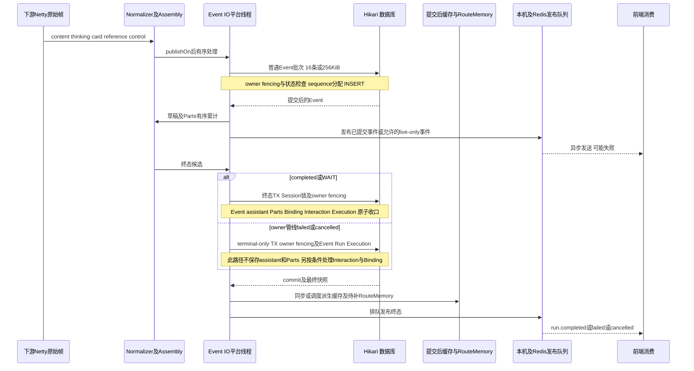
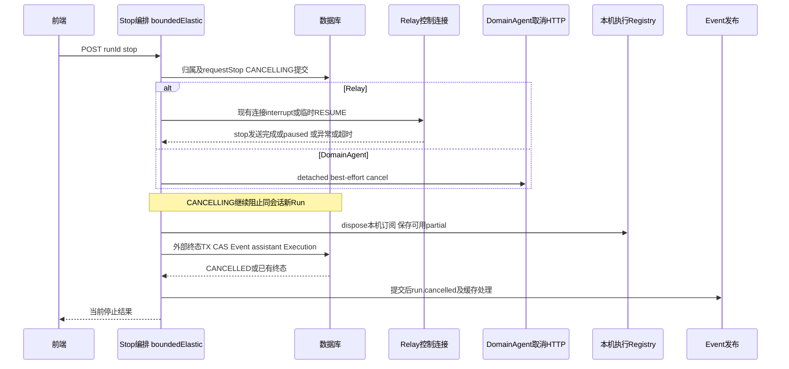
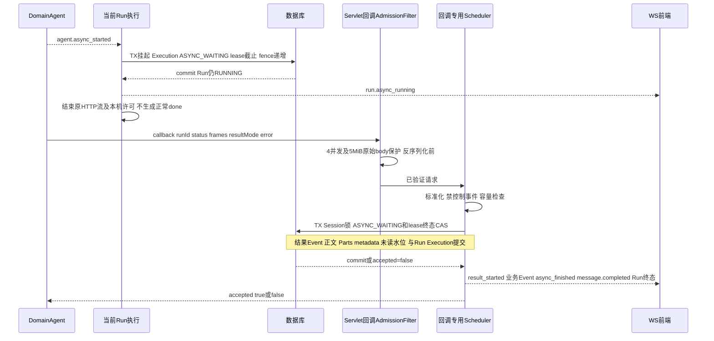
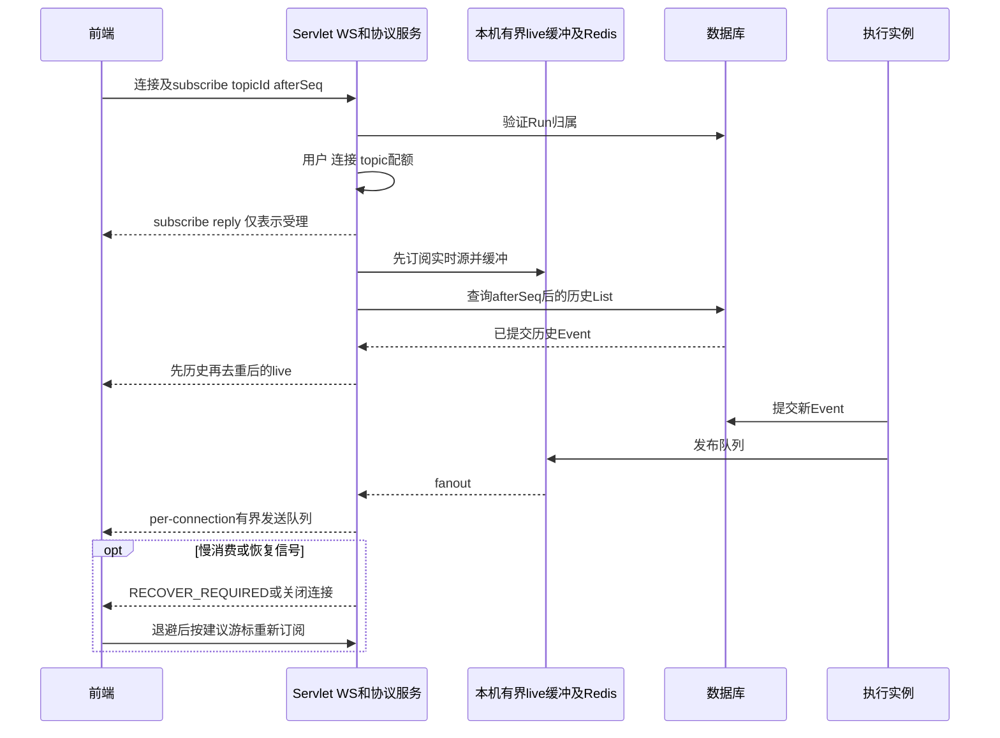

# 终态、实时交付与恢复

本页是恢复总览；每个提交、缓存、发布以及Interaction/候选/拒答/Stop/异步进入和退出点的逐步风险表见[事件与控制详图](run-control-details.md)。标题完成不会产生本页的Runtime终态或专用WebSocket事件，其独立事务见[TT16-TT19](session-title-flow.md#t3-鉴权提炼与条件提交)。

## T1. Event、正文和终态事务

普通批次和终态不是一个覆盖整个回答的长事务。Event IO在一个run内顺序提交，批处理开启时16条/20ms/256KiB；Parts100条/1MiB。单条超大事件并不能靠分批自动变小。部分非正文事件仍需观察Run状态，不能将数据库次数简单算作“一批一次INSERT”。

上图区分的是执行owner的终态管线。外部Stop/Watchdog另走`commitExternalTerminal()`：需要保存partial时先锁Session，再以Run CAS竞争；无partial时不机械执行整套assistant/Parts保存。异步回调又有自己的结果回填事务，见T3。不能将所有`failed/cancelled`统一描述为与completed相同的写入步骤。

FULL会保存正文、Parts及可恢复业务Event；no-store跳过真实Agent结果，仅保留占位正文和必要控制事实。正文assembly仍可能持有累计数据，单帧限额不是累计结果上限。DomainAgent的正文/思维链分段标识仅进入历史正文，不增加实时sequence；Relay没有该专用标识规则。

事务固定的特殊事实：附件拒绝延迟Binding激活；确认切换的`route-switch-applied`与该Binding及completed同事务。无事务成功不能向外宣称该切换完成。提交后缓存/发布失败不回滚历史；进程在此处退出时只能依靠客户端补读，并无Outbox保证自动补发。

源码：[ChatEventPipeline](../../../src/main/java/com/huawei/it/ex/one/application/service/chat/ChatEventPipeline.java)、[ChatRunTerminalCommitService](../../../src/main/java/com/huawei/it/ex/one/application/service/chat/ChatRunTerminalCommitService.java)、[ChatRunCompletionCoordinator](../../../src/main/java/com/huawei/it/ex/one/application/service/chat/ChatRunCompletionCoordinator.java)、[MyBatisChatEventStore](../../../src/main/java/com/huawei/it/ex/one/infrastructure/persistence/MyBatisChatEventStore.java)。风险R01/R02/R04/R07。

## T2. Stop的保证范围

- Relay活跃连接的5s等待可以由“发送链完成”结束，不一定收到下游执行结束ACK。临时连接还包含连接、Upgrade、config等待，不能把整个stop接口硬上限写成5s。
- DomainAgent取消未配置stop-path时不能停止下游；有配置仍是best-effort，默认HTTP120s在独立订阅中执行，本地终态不等待其实际后台任务停止。
- Stop与自然完成/异步回调竞争同一持久化终态；只有成功的CAS写入本轮终态，不允许迟到回调覆盖取消。
- 固定Relay专家运行中stop后保持ACTIVE和同一runtimeSessionId，下一轮RESUME。Relay `stop_all_agents`是session级，不携带Run代次；跨实例迟到stop隔离须Relay保证，ChatService的有界发送等待不能证明这一点。
- WAIT stop取消Interaction及引用Binding，不能把历史WAIT当作正在输出流强行重写。重复stop按已有终态处理。
- 跨实例终态后，旧owner通过事件guard/心跳失败停止本机流；并非停止请求能直接访问另一JVM的registry。

源码：[ChatRunStopCoordinator](../../../src/main/java/com/huawei/it/ex/one/application/service/chat/ChatRunStopCoordinator.java) L164/L358、[RelayWebSocketRuntimeAdapter](../../../src/main/java/com/huawei/it/ex/one/infrastructure/runtime/relay/RelayWebSocketRuntimeAdapter.java) L1379、[ChatWaitingStopCommitService](../../../src/main/java/com/huawei/it/ex/one/application/service/chat/ChatWaitingStopCommitService.java)。风险R05/R14。

## T3. 异步挂起与一次性结果回调

默认异步功能关闭；开启后最长24h，挂起任务无独立总数限制。回调只使用可信runId恢复消息与归属，不接受前端决定目标assistant。

| 情况 | 响应/结果 | 下游与前端动作 |
|---|---|---|
| 异步挂起尚未提交 | 409/DOMAIN_AGENT_ASYNC_NOT_READY，Retry-After:1 | 同runId同body按秒重试至少15秒；不能当作完成 |
| 已取消、已终态、重复或过期 | accepted=false | 不覆盖历史；查任务事实，不创建另一个回调任务 |
| 并发满 | 429/DOMAIN_AGENT_ASYNC_CALLBACK_BUSY | 延迟加抖动重试，不能立即多路重试 |
| 原始body/帧/事件超限 | 413/DOMAIN_AGENT_ASYNC_CALLBACK_TOO_LARGE | 缩小结果再重试；未claim终态 |
| 控制事件/非法协议 | 400 | 拒绝agent.refusal、再次async_started等；不接入重意图状态机 |
| 合法纯终态帧 | 无业务结果通知 | 即使REPLACE也不清空正文/Parts，不生成result_started |
| APPEND有效结果 | 精确拼接正文及追加Parts | 不自动换行；跨异步thinking保持历史分段规则 |
| REPLACE有效结果 | 覆盖本assistant正文，删除本run旧Parts，保留其他run Parts | 前端result_started先清空本run展示，随后消费结果 |
| FAILED带结果 | 可展示部分结果后run.failed | error为trim后的短文本，按Unicode码点最多1024 |

最大128帧/128业务事件/1MiB，约132条含控制事件，默认FULL最多约9个Event批次、2个Parts批次；按字节划分或单条大小不同可能改变批次数，不能作为精确SQL次数。结果事务10s；事件批处理开关同样适用。

FULL的历史和Event Resume恢复回填结果；no-store只实时推送业务结果，历史不恢复真实正文/Parts。accepted=true表示本地终态提交，不表示浏览器已在线并确认收到。

源码：[DomainAgentAsyncTaskCallbackAdmissionFilter](../../../src/main/java/com/huawei/it/ex/one/interfaces/chat/DomainAgentAsyncTaskCallbackAdmissionFilter.java)、[DomainAgentAsyncTaskCallbackApplicationService](../../../src/main/java/com/huawei/it/ex/one/application/service/chat/DomainAgentAsyncTaskCallbackApplicationService.java)、[DomainAgentAsyncTaskCallbackCommitService](../../../src/main/java/com/huawei/it/ex/one/application/service/chat/DomainAgentAsyncTaskCallbackCommitService.java)。风险R02/R04/R09。

## T4. WebSocket、Resume与刷新

### 三种读取的差别

| 接口/通道 | 行为 | 释放与恢复 |
|---|---|---|
| Session events/resume | 一次读取此会话afterSeq后所有已存Event，再SSE返回 | 历史发完结束，不订阅未来；无独立配额，List无分页 |
| Run events/resume | 先建live buffer，再读该Run历史，必要时接live | 终态、WAIT、async边界后结束；live恢复错误也可能提前关闭，不等于业务完成 |
| WebSocket run topic | 相同历史/live逻辑，异步边界不取消订阅 | unsubscribe、连接关闭、终态/错误处理释放；等待异步回调可保持连接 |

刷新流程：先`GET stream-status`及`GET messages`，用`activeRunId/activeRunFirstSeq/activeStreamTopicId`重建正在运行视图，再订阅或Run Resume。这里的`activeStreamTopicId`不同于启动响应的`streamTopicId`。全新渲染可以从`firstSeq-1`回放；已有内容从最后已消费seq继续，避免重复拼正文。异步挂起时Run Resume补到边界就结束，要感知未来完成需重新建立WS订阅，或低频退避查询stream-status/历史，不能等待已关闭的SSE自动恢复。

若页面关闭期间任务已经完成：历史展示最终assistant；FULL必要时对该runId Resume补Event。列表的RUNNING/COMPLETED不是对某个浏览器的通知确认。

sequence是数据库全局游标，单topic不连续；不要等seq+1，不把heartbeat/done作为新持久化序号。收到RECOVER_REQUIRED应使用服务端建议的恢复游标并支持回滚去重，不能一律用本地最大seq跳过迟到事件。实际生产前端未提供；仓库local-test-frontend仅作为联调样例，已发现其恢复游标处理风险，见R20。

## T5. 心跳、Watchdog与退出

| 后台入口 | 默认及线程 | 事实与边界 |
|---|---|---|
| Execution heartbeat | 15s、90s租约、50条/批、每批TX2s；operational scheduler | 只续当前owner/fence；数据库明确拒绝claim才取消本机订阅。DB异常只告警保留订阅，等下次心跳/事件fencing；持续故障可能失租 |
| Watchdog | 30s初始/间隔、0到5s jitter，single-flight；扫描100 | 延时调度后在operational scheduler同步扫描/逐项恢复；不是专用异步恢复池。默认manual confirmation/fail fast，不自动无损重连Relay |
| 恢复许可 | recovery4、takeover1、每租户5、每扫描20配置 | **不覆盖所有分支**：Interaction对账、初始化孤儿和async到期路径需另算工作量，成功数不等于尝试总数 |
| 孤儿 | Execution初始化/Interaction RESPONDING宽限2m | 修复持久化后执行未启动、claim未完成；不是精确2m即完成恢复 |
| 懒恢复 | stream-status也可触发过期恢复 | 该GET不是绝对只读；刷新风暴会叠加治理成本 |
| WS idle清理 | 10m无活动、每60s检查 | 长async连接需按协议保活；断开不stop Run |
| 用户速率清理 | 每60s | 清理滑动窗口，不撤销DBRun |
| 首事件超时补偿 | 30s后，在event IO有限重试 | 异步补偿不能作为跨进程可靠投递 |
| 删除后stop/缓存清理 | commit后独立调度；缓存清理复用event IO池 | 崩溃窗口无Outbox；删除成功不代表远端已停止，也不意味着缓存任务独享线程 |
| 容器退出 | Boot默认graceful；定时池await10s；各bean dispose/shutdown | 已返回runId的后台订阅不能仅靠HTTP drain保证完成；需摘流、观测lease和故障恢复 |

源码：[ChatRunLeaseApplicationService](../../../src/main/java/com/huawei/it/ex/one/application/service/chat/ChatRunLeaseApplicationService.java) L146、[ChatRunWatchdogScheduler](../../../src/main/java/com/huawei/it/ex/one/application/service/chat/ChatRunWatchdogScheduler.java) L51、[ChatRunRecoveryOrchestrator](../../../src/main/java/com/huawei/it/ex/one/application/service/chat/ChatRunRecoveryOrchestrator.java) L116/L234/L318。风险R13/R14。
