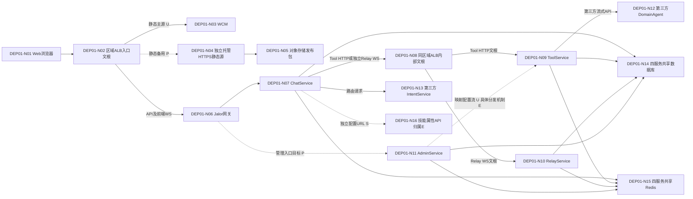
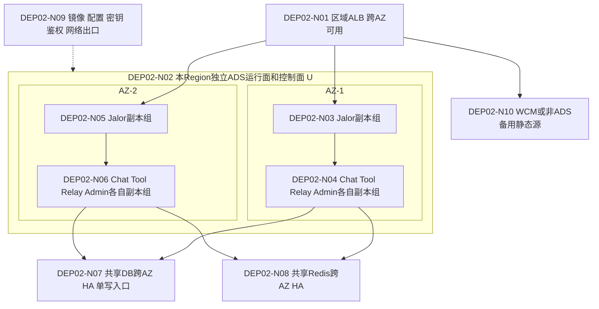
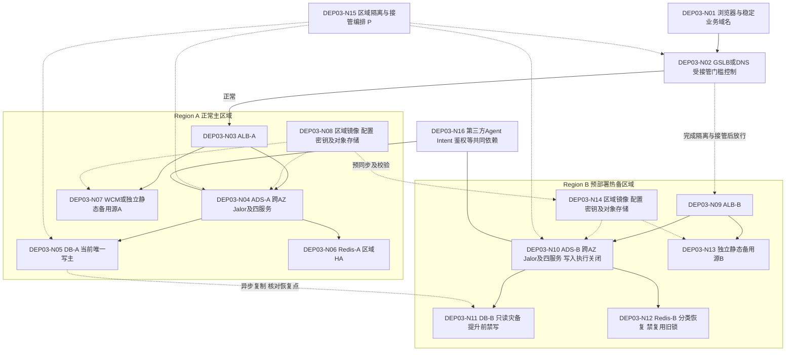
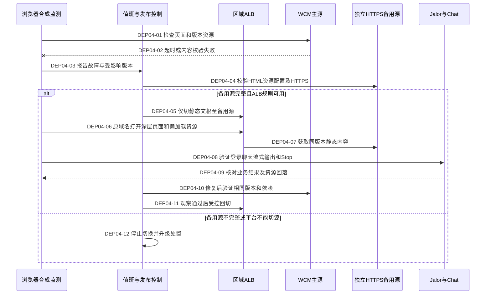
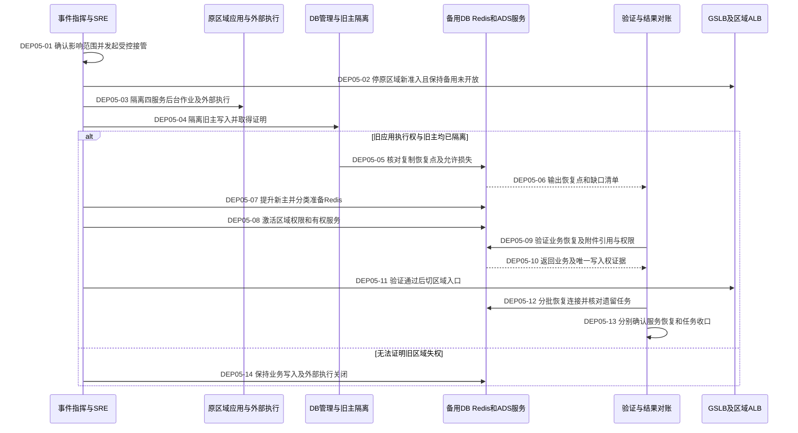
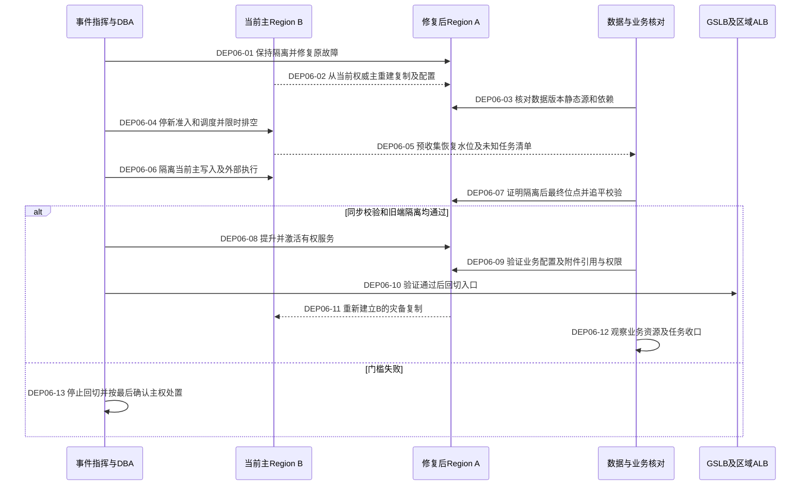

# 部署架构与跨 AZ / 跨 Region 容灾设计

源码基线：`00abae4f80b7e7e5b4d0ddca707035f1878a8ec8`；设计日期：2026-09-18。本文补充[高可用落地蓝图](README.md#overview)，仅交付设计，未修改部署、业务代码、SQL或协议，未执行平台故障注入。

## 1. 设计依据与边界

| 标记 | 含义 | 本次内容 |
|---|---|---|
| U | 用户确认的架构事实 | Web静态资源在WCM；ALB管理路由文根；服务在ADS Docker；Admin/Tool/Relay/Chat共享DB和Redis；各Region ALB独立，ADS控制面和运行面均独立 |
| S | 当前源码确认 | Chat以统一HTTP地址及skillId调用逻辑DomainAgent；独立WS连接Relay；独立技能属性查询；默认不支持可靠Runtime接管 |
| P | 已选定、待实施的目标 | 区域内跨AZ多副本、异地主备热备、GSLB/DNS受控切换、WCM独立备用源、区域单写屏障 |
| E | 尚需平台/联调证据 | 有效URL、文根、ALB源站接入、复制/隔离机制、ADS部署参数、其他服务内部状态及真实恢复结果 |

U不等于已完成生产验收。本文不假定ADS等同Kubernetes、ALB等同某公有云产品或S3兼容API等同静态网站托管；所有能力依本平台证据验收。

| 代码边界 | 源码证据与解释 |
|---|---|
| Chat → Tool → DomainAgent | [ConfiguredDomainAgentClient.query](../../../src/main/java/com/huawei/it/ex/one/infrastructure/runtime/domainagent/ConfiguredDomainAgentClient.java#L65)向统一配置URL发送流式请求；[请求映射](../../../src/main/java/com/huawei/it/ex/one/infrastructure/runtime/domainagent/DomainAgentChatRequestMapper.java#L53)填可信skillId。Tool物理转发及Admin映射由U确认，Tool实现不在本仓 |
| Chat → Relay | [Relay连接](../../../src/main/java/com/huawei/it/ex/one/infrastructure/runtime/relay/RelayWebSocketRuntimeAdapter.java#L234)、[配置端点](../../../src/main/java/com/huawei/it/ex/one/infrastructure/runtime/relay/RelayWebSocketRuntimeAdapter.java#L952)是独立WS链路，不经过Tool |
| 技能属性查询 | [配置Provider](../../../src/main/java/com/huawei/it/ex/one/infrastructure/domainagentconfig/DefaultDomainAgentSkillConfigurationProvider.java#L60)向独立URL查询技能属性；不能等同Tool的skillId→Agent地址映射。实际API归属Admin/Tool或其他门面需绑定生效URL |
| 接管边界 | [UnsupportedAgentRuntimeRecoveryPort](../../../src/main/java/com/huawei/it/ex/one/infrastructure/runtime/UnsupportedAgentRuntimeRecoveryPort.java#L21)返回不支持；恢复历史与继续远端执行是不同能力 |
| 生效配置 | [application.yml](../../../src/main/resources/application.yml)只是配置入口，不能由默认值推断生产副本、ALB超时或数据库拓扑 |

以下六图的编号稳定：架构节点为`DEPxx-Nnn`，时序步骤为`DEPxx-nn`。逻辑图省略的鉴权、存储、WeLink、记忆/标题等条件依赖继续见[场景图](scenarios.md#flows)，不因省略而退出容灾清单。

## DEP01 — 完整逻辑架构

基础调用边界为U/S，备用静态源及管理入口复用Jalor为P（实际管理鉴权链待E确认）。图中两个ALB节点是同一区域路由层的不同逻辑视图，不代表额外部署了两套ALB。服务间HTTP/WS经内部文根，数据库连接/Redis协议不经过HTTP文根。

N06/N07/N09/N10/N11运行于ADS Docker；为了让逻辑调用边可读，容器/AZ边界在DEP02单独展开。Tool HTTP请求包含可信skillId，Relay使用独立WS及其会话标识。

| 节点/故障传播 | 风险、措施与验证 |
|---|---|
| N03–N05不可用或版本不一致，页面无法启动，后端健康也无用 | R31 → W12 → T31 → RB12/D10 |
| N02/N08文根、重写、鉴权头或长连接策略错误，多个服务同时受影响 | R32 → W12 → T32 → RB12/D10 |
| N09/N11配置错误或发布不完整可能把同一skillId送往错误目标；外部已执行而响应丢失产生未知结果 | R30 → W11 → T30 → RB11/D09 |
| N14/N15由任一服务耗尽，影响其他服务、Chat Stop/心跳及管理修复操作 | R28/R29 → W11 → T28/T29 → RB11/D09 |
| 第三方Intent/DomainAgent、共享鉴权仍可能是跨Region共同故障点 | R06/R30/R35；区域切换不能保证消除外部故障 |

## 2. ALB路由与协议契约

路径采用角色名称，**不发明生产文根**。由入口负责人提供两个Region的实际域名、路径、目标组、规则优先级及配置版本，并映射到[现有接口](scenarios.md#interfaces)。内部文根不因图中存在而对公网开放。

| 路由用途 | 目标与期限/重试契约 | 必须验证 |
|---|---|---|
| 前端静态文根 | WCM主源/独立备用源；原域名及base path保持；故障切换只作用于静态路径 | HTTPS源站接入、Host/SNI、私有访问、深层路由、MIME、缓存；API前缀优先于SPA兜底 |
| Chat HTTP/Resume/SSE | ALB → Jalor → Chat；连接、首字节、idle、总期限分别登记；预算与应用一致 | SSE不被缓冲到终态，错误码透传；受理/Stop/回调等非幂等操作不做入口透明重试 |
| 前端WS | ALB → Jalor → Chat；Upgrade、心跳、idle及摘流策略显式配置 | 正常长流、半开连接、断连后退避、跨实例恢复、DNS旧缓存 |
| Chat → Tool | 内部文根 → Tool → DomainAgent；逐跳分配总期限 | skillId/请求标识透传、流式背压、取消路由、未知执行结果查询；各跳重试次数合并计入预算 |
| Chat → Relay | 内部WS文根 → Relay；不能轮流把同一运行会话发给不持有状态的副本 | 会话归属、重连/Stop同目标、专家跨Run会话及迟到Stop；粘性路由本身不证明故障接管 |
| Admin管理文根 | 经既有鉴权边界进入Admin；权限和内部暴露范围与现状一致 | 配置发布一致性、作业单执行权、页面配置缺失的降级边界；不自行新增公网管理入口 |
| 技能属性API | 绑定独立配置URL到实际服务，不与Tool执行API混淆 | 留存和附件策略的现有失败语义；撤销或权限类配置不得无限沿用旧缓存 |
| 异步回调 | 稳定回调地址经ALB/既有鉴权进入当前有权处理的Chat | 第三方实际回调地址、允许重试范围、重复/迟到/失权拒绝、切区后认证和runId关联 |

入口重试、静态备用切换和区域接管是三种不同动作。只有已验证可安全重试的方法/命令才允许自动重试；业务调用未知结果不能按静态GET的方式切源重发。第三方Intent/DomainAgent使用其服务地址；其流量是否经过企业统一出口由平台补证，不能把第三方描述为本方ALB后端。

## DEP02 — 单 Region 跨 AZ 部署

整图为P；两AZ是应用部署下限，不限定数据服务仲裁成员只能放两AZ。数据库/Redis切主仲裁依实际产品支持的故障域布局设计，失去一个AZ后必须仍能选出唯一合法主节点。

N04/N06表示每项服务都有跨AZ副本，不是把四服务装进一个容器。Relay副本分布只提供服务容量冗余，其内存会话的可迁移性仍需协议验证；丢失会话按明确中断/收口处理。内部调用经ALB文根的逻辑边见DEP01。

| 目标 | 实施及验收要求 |
|---|---|
| 副本与调度 | 记录宿主机/AZ实际位置，避免同宿主机多容器被误认为跨AZ；ADS重调度不能把全部副本挤入同一故障域 |
| 剩余容量 | 各服务独立测量一AZ失效后正常Run、Stop、后台治理及恢复流量预算；备用Region热备容量也须满足约定接管负载，不依赖故障时扩容 |
| 发布排空 | 停新准入→从入口摘流→按期限处理存量流/任务→状态核对→退出；当前Chat没有全局Run排空机制，作为W13实现前置，不编造现成开关 |
| 健康检查 | 存活、可接流量、关键依赖与角色权限分开；依赖故障不应触发全体实例无限重启。验证ALB摘流和ADS重建各自条件 |
| 数据层 | 数据节点、仲裁、连接入口均检查AZ故障影响；主备切换中的未知提交按业务标识核对，不盲目重试 |
| 关联闭环 | DEP02-N01/N10 → R31/R32；N02–N06/N09 → R33/R34 → W13 → T33/T34 → RB13/D11；N07/N08 → R28/R29 |

## 3. 四服务共享资源与配置职责

| 服务 | 数据库职责 | Redis职责 | 预算与证据 |
|---|---|---|---|
| Chat | S：会话、Run、事件、Binding、Interaction及相关业务事实 | S：实时广播、Binding/技能等缓存；具体用途见[生命周期](scenarios.md#resources) | Run/恢复/查询/Stop/心跳分别计等待与占用；跨实例池总和纳入预算 |
| Tool | U：与其他服务共享DB；映射、执行账本是否直接落DB为E | U：共享Redis；配置缓存、锁、队列是否使用及其权威性为E | Tool负责人登记各操作、重试、连接、流缓冲及在途外呼上限 |
| Relay | U：共享DB；会话状态、任务进度、外部执行记录的持久化范围为E | U：共享Redis；会话路由/锁/任务状态具体用途为E | Relay负责人证明会话归属、丢失处理、控制命令隔离及副本容量 |
| Admin | U：配置技能映射、作业、页面；实际表/发布事务为E | U：共享Redis；配置分发/作业调度状态的具体用途为E | 管理查询、配置发布、批量任务限额；作业单执行权覆盖切区 |

数据库预算按四服务**最大计划副本数和发布重叠副本**计算：所有连接池上限之和 + 运维/治理保留连接 + 其他客户端预算 ≤ 数据库已验证安全连接额度。连接数满足不代表CPU/IO/锁容量满足，需同时验收。备用应用不连接旧区域主库执行业务；其只读探测也受预算约束。

Redis逐用途登记owner、key/topic命名空间、ACL、数据量/TTL、连接/命令速率、重要性及可否重建。逻辑隔离不形成内存或CPU硬隔离；如共享部署无法满足混合故障测试，W11必须提出实例拆分或更强资源隔离任务，经容量证据决策，不能以增加连接数结案。

**读写分离默认不启用。** Run/Interaction/Binding判断、鉴权/删除/分享撤销、写后读及Resume继续读当前权威主库。只读副本仅评估能明确容忍陈旧数据的查询，并单独设计一致性和延迟门槛；`readOnly=true`不是自动读副本依据。特别是Resume历史读取落后于实时广播时，可能漏掉已提交但尚未复制的事件，不能直接改用从库。

配置目标契约P：Admin发布可追溯版本；Tool为每次执行固定实际映射与版本，Stop/回调沿原执行目标处理，不能在映射更新后发送给另一Agent。最后可用配置仅在约定新鲜度与权限规则内续服；未知、撤销或越权映射拒绝执行。该契约需Tool/Admin联合实现，不假定现有协议有版本字段。Chat独立技能属性缓存仍遵守本仓留存及附件失败语义，不擅自放宽。

## DEP03 — 双 Region 主备部署

图为P，ADS区域独立性和区域ALB独立为U；数据复制、备用源、屏障和编排需E。图中数据库复制按**默认异步**设计；Redis未绘制无条件复制箭头。

N15是待建设的操作能力，不代表仓库已有独立控制服务。隔离机制由DBA/SRE证明可强制阻止旧主写入及旧应用外部执行，并在故障Region失联时从仍可用的管理路径执行；单独写一个可过期的Redis锁不能成为跨区权威屏障。若无法证明旧端失权，保持备用写入关闭，允许提供明确维护状态，不以可用性目标换取双写。

### 区域角色与接管条件

以下状态属于部署编排，**不新增或改写业务Run状态枚举**。故障信号只触发检测；默认值班负责人发起受控切换，不自动回切。

| 区域状态 | 新业务写入/外部执行 | 后台作业/治理 | 转换门槛 |
|---|---|---|---|
| STANDBY_READY | 禁止；仅有界健康检查 | 不运行会写业务事实或发外呼的任务 | 镜像/配置/密钥已就绪，DB恢复点可观察，备用容量已验证 |
| ACTIVE | 允许且仅此区域有权 | 允许有权任务，继续本地CAS/owner校验 | 获得当前唯一写入与执行权；入口可接流量 |
| QUIESCING | 停新准入；既有任务限时处理 | 停新调度，保留必要收口能力 | 计划切换/回切开始，入口摘流；非计划故障可直接进入隔离 |
| FENCED | 禁止，包括已有进程和迟到命令 | 全部禁止旧区域写入及外部执行 | 有可核对的DB旧主/应用/作业/出口隔离证据；DNS切流不算证据 |
| PROMOTING | 禁止公开业务写入 | 仅受控验证；禁止批量重跑 | 旧区域FENCED，DB/业务对象恢复点和允许损失获确认，Redis用途处置完成 |
| ACTIVE_VERIFYING | 仅编排验证流量 | 仅已确认安全的治理 | DB/服务权威一致、配置映射可用、新Run/Stop/恢复及业务对象引用/权限验证通过后开放入口 |

区域级隔离与Chat现有Run级owner/fencing是两层控制，不能互相替代。数据复制滞后时，本地CAS不会检测另一份数据库上的独立写入。DNS缓存或长连接仍访问旧区域时，旧区域也必须拒绝写入；GSLB所有目标不健康时的实际返回行为须实测，不能依赖其必然断流。

接管承诺：新请求可恢复服务；FULL仅恢复新主实际保留的持久化范围，不能掩盖异步复制丢失；no-store不增加业务正文持久化；未可靠接管的在途Runtime按策略核对/收口。Relay会话、Tool请求、异步回调、Admin作业及外部副作用逐项对账，不宣称原流无缝续跑。Region切换不能解决两地都依赖的同一个故障第三方。

关联：N05/N11 → R28/R35；N06/N12 → R29/R35；N02–N04/N09–N10/N15 → R32–R35 → W12–W14 → T32–T35；N07/N13/N08/N14 → R31/R33。区域切换闭环为RB14/D12。

## DEP04 — WCM 故障切换时序

全图P；备用源已预部署、同一发布包已完整校验是前提，不在故障期间临时复制资源。只切静态源，不迁移数据库主权。

发布清单含releaseId、内容哈希、HTML入口、带内容哈希的静态资源、运行配置、适配后端版本和回滚版本。先上传资源并验证，再切入口版本；HTML/运行配置采用能及时更新的缓存策略，带哈希资源长缓存且保留旧版本。禁止仅清缓存而删除仍被旧HTML引用的资源。Admin动态页面配置不随静态备用自动恢复，T30/T31同时验证其不可用时的实际体验。

备用源须可从本地及备用Region的ALB访问；若ALB不支持该HTTPS源类型或必要的鉴权/重写，W12接入验收失败，先完成平台接入能力，不能临时改成ADS内唯一代理并声称仍独立容灾。对象存储静态发布与业务附件采用独立职责和访问策略，不把用户文件公开为网站资源。

S3兼容API不自动提供网站回退、HTTPS或私有源站鉴权。例如[Amazon S3网站端点说明](https://docs.aws.amazon.com/AmazonS3/latest/userguide/WebsiteEndpoints.html)明确区分网站与REST端点且网站端点不支持HTTPS；这是选型检查依据，不表示本项目使用AWS ALB或CloudFront。

步骤01–04/10 → R31/T31；05–09/11–12 → R31/R32/T31/T32；统一W12、RB12/D10。WCM失败但ADS业务正常时优先只切静态源；区域ALB或ADS运行面失效再按DEP05进行区域级接管。

## DEP05 — Region 接管时序

全图P。异常时停止后续步骤，不跳过旧端隔离。旧区域失联时，隔离操作须通过已验证且仍可用的管理路径完成。

05–06若发现复制损失超出事先批准的RPO边界，保持接管门槛关闭并升级；不能由“备用已启动”推导数据可接受。分别核对DB与业务附件对象的实际恢复点、引用和权限：DB已有引用但对象未复制也属于缺口，不能用静态发布包哈希通过来替代。无法核对或超批准损失范围时停止相关接管；已明确接受的缺失对象仍须列清单、隔离对应功能并报告受限恢复，不计为全功能恢复。08前确认Relay会话、Tool执行及Admin作业的接管策略；现有进程可预启动但不能提前执行业务。09包括映射、带附件的新Run、Stop、FULL补读及文档访问正负例。外部已执行、内部记录未复制是必须单独对账的未知结果，不能按“新库没有记录”自动补执行。

DNS TTL、递归解析缓存、浏览器已有连接、第三方回调固定地址分别测量；DNS切换不转移已建立的WS/SSE。回调经稳定地址进入新区域时仍执行现有授权、租约/终态判断；记录缺失或失权回调进入可观察处置，不盲目创建新Run。新旧区域隔离状态在观察期持续验证。

步骤01–04/14 → R33/R35；05–08 → R28–R30/R35；09–13 → R04/R05/R14/R30–R35。主闭环R35 → W14 → T35 → RB14/D12；关联T28–T34覆盖前置能力。

## DEP06 — Region 回切时序

当前B已为主。恢复的A保持隔离并按B的权威数据重建，不把旧A直接重新接回双向写入，也不无条件合并旧A数据。

02/05的同步与水位只是准备阶段。QUIESCING仍可能有终态或迟到回调提交；06完成强制停写后，07必须取得或证明当前主的最终提交位点，并确认A已完整应用该位点及业务对象引用/权限，再执行08。无法取得最终位点或无法追平则不提升A，不能用隔离前的“已追平”结论代替。09覆盖带附件的新Run、Stop、FULL恢复、配置以及文档访问，业务对象缺口按DEP05同样规则处理。

停止回切不等于简单把DNS拨回B：若A已取得写权，需重新执行主权转移流程才能恢复B写入；若B已隔离而A未激活，需确认无人写入后才可恢复B。保留切换前备份和分歧记录用于审计，不自动重放可能已执行的外部副作用。

步骤01–03/11 → R28/R30/R31/R33/R35；04–10/12–13 → R35，并联合R05迟到Stop、R14终态、R19未知外部投递测试。闭环W14、T35、RB14/D12。

## 4. 平台能力与证据清单

| 编号 | 必须具备并验证的能力 | 责任与证据 | 缺失时的限制 |
|---|---|---|---|
| CAP01 | 区域ALB跨AZ可用、全部文根一致、内部访问边界、备用HTTPS源接入 | 入口负责人；规则导出、协议与T31/T32报告 | 不宣称入口/WCM容灾可用 |
| CAP02 | GSLB/DNS受控放行、缓存及全不健康行为、管理入口独立 | 网络/SRE；解析轨迹、旧连接与切换实测 | 不自动切备用业务流量 |
| CAP03 | ADS两Region独立运行和控制，已有容器与重建能力分别验证 | ADS/SRE；拓扑、控制面/数据面注入、T33/T34 | 不把控制面独立当全部依赖独立 |
| CAP04 | 跨AZ数据库仲裁、旧主隔离、异步恢复点及反向重建 | DBA；真实openGauss拓扑、T28/T35、备份恢复 | 未证明旧主失权则禁止提升后开放写入 |
| CAP05 | 四服务Redis用途完整，区域HA及分类恢复策略 | 缓存与四服务负责人；用途清单、T29/T35 | 不可重建状态未覆盖则阻断区域接管验收 |
| CAP06 | 区域执行屏障、停准入、停止调度、排空与有权激活 | 四服务/SRE；受控接口或操作清单、T33/T35 | 当前不存在的开关先列W13/W14，不写成值班命令 |
| CAP07 | Tool映射版本、执行/取消/回调关联，Relay会话和命令顺序 | Tool/Admin/Relay/第三方负责人；联合契约和T30/T35 | 未知结果不盲重试，不承诺Runtime接管 |
| CAP08 | 静态发布包、备用托管源、跨Region对象和访问策略独立 | 前端/WCM/存储；哈希清单、浏览器T31、DEP04 | 不能只以bucket存在或首页200通过验收 |
| CAP09 | 配额、N-1容量、主备版本兼容、网络出口及认证可用 | 测试/SRE/集成；混合压测、依赖矩阵 | RTO及容量未校准不能签上线通过 |
| CAP10 | 复制以外的独立备份、恢复演练及数据损坏检测 | DBA/存储；恢复点、校验与耗时证据 | 异步复制不能替代防误删/损坏备份 |

### 交付物和数据容灾清单

| 对象 | 预置/复制及核对规则 |
|---|---|
| 容器镜像与部署清单 | 两区域可独立读取同一摘要；覆盖Jalor及四服务的启动参数、资源限制、探针、路由、兼容版本；不依赖原Region现场构建 |
| 配置与Admin发布记录 | 区分业务配置、平台配置和路由配置；记录版本与激活状态，接管时避免恢复到未经发布或错误映射版本 |
| 密钥、证书及身份依赖 | 仅登记引用、可用区域、轮换/有效期和访问权限；不在文档复制凭据；第三方白名单和回调认证预验证 |
| 前端产物 | 同包哈希、发布清单、HTML/JS/配置一致；保留旧资源和上一兼容版本；备用源独立于ADS/WCM故障域 |
| 数据库与备份 | 按四服务完整数据范围复制，登记持久化恢复点和未知提交；独立备份与恢复验证；表/DDL兼容性覆盖四服务 |
| Redis | 按缓存/广播/协调/持久任务分类，明确可重建和不可丢失数据；不复制后直接信任旧锁；禁止盲目FLUSH共享实例 |
| 业务附件与对象 | 与静态发布包分开；同步对象、元数据、权限及引用，核对DB恢复点与对象恢复点差异及孤儿对象 |
| Relay/Tool/第三方任务 | 明确会话、执行标识、查询结果、取消代次及外部副作用对账；未持久化的进程状态按中断处理 |

## 5. 验收、发布与证据归档

先验证共享依赖与单服务隔离，再验证WCM/ALB及单AZ失效，最后执行Region计划切换、旧区域仍存活的网络分区、复制滞后、非计划故障与回切。每组具体注入、自动停止条件、撤销步骤、观察窗口及责任人见[T28–T35](tests.md)和[RB11–RB14 / D09–D12](operations.md)。

SLI至少区分页面可启动、请求受理、首业务事件、Run正确完成、FULL恢复、Stop、服务恢复与遗留任务收口。RPO分别统计配置、已提交事实、对象与外部副作用；无持久化承诺的实时事件单列，不混成一个RPO值。SLO/RTO/RPO、DNS期限、排空期限、观测窗口和资源上限在演练前校准并签认，未填写仅能记录测量结果。

- [ ] 六图与实际服务/ALB/数据职责逐项核对；U/S/P/E证据分开。
- [ ] 真实openGauss、Redis Cluster及ADS/ALB环境通过适用用例，不能由本地替代组件结果关闭。
- [ ] 旧Region存活及旧DNS/连接场景下，无双写、重复调度或越权外部执行。
- [ ] WCM故障后浏览器能加载全部资源并完成聊天；一AZ或ADS区域失效后满足约定负载和期限。
- [ ] FULL/no-store及未知外部副作用恢复边界已验证；未完成任务有可解释的最终处置。
- [ ] 恢复后资源回落、数据核对、复制重建、旧端隔离及回切均完成，原始证据可追溯。

本页复选框均是后续验收项。文档渲染和链接检查只记录在[本轮验证记录](evidence.md)，不代表平台能力、加固或演练已经完成。
