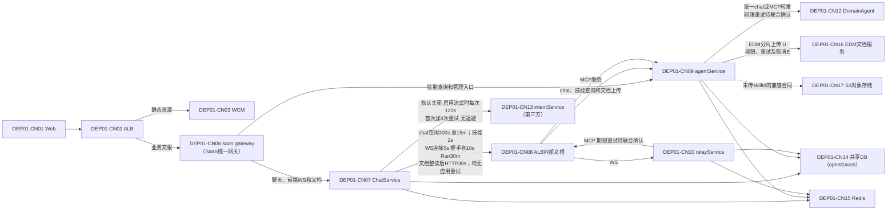
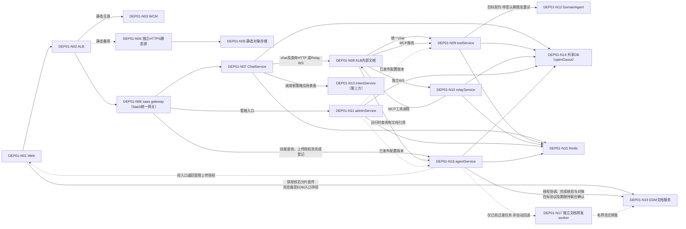
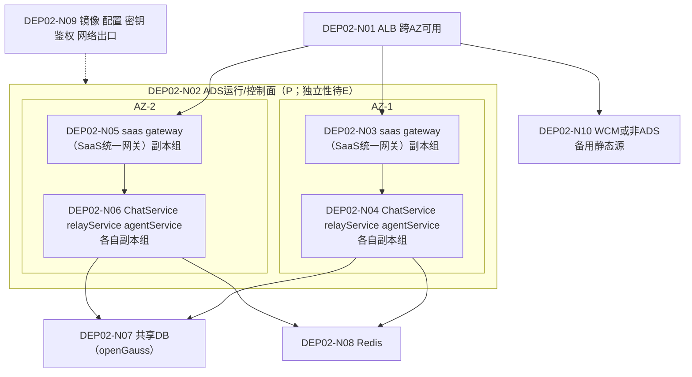
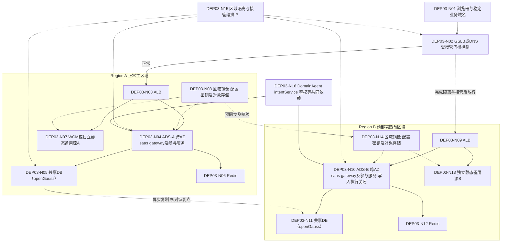
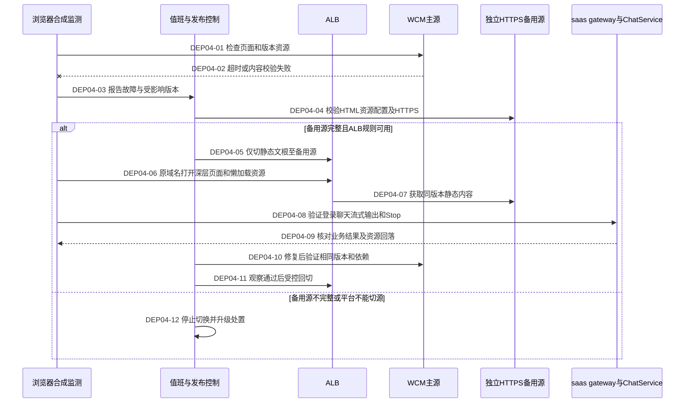
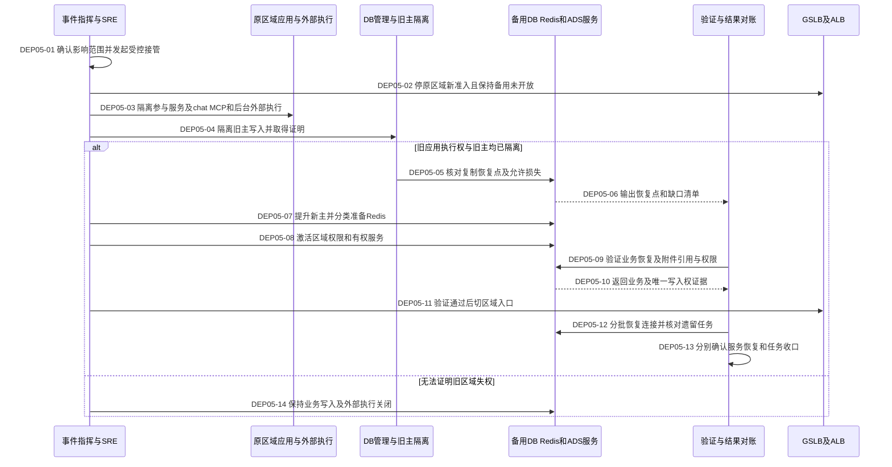
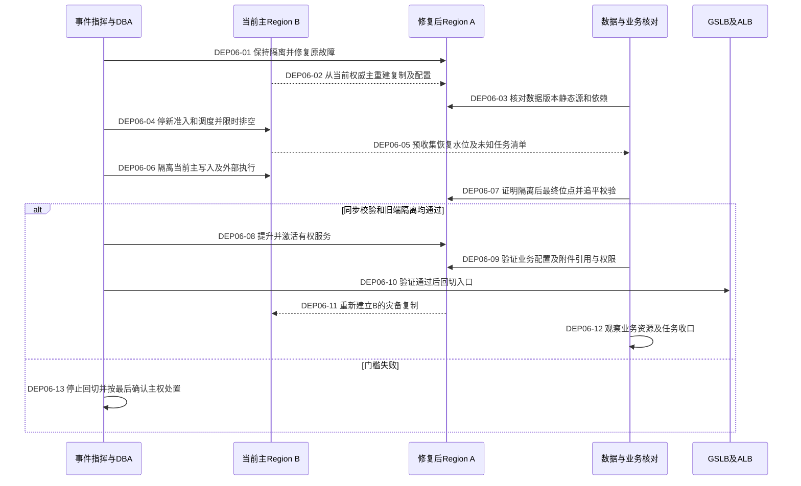

# 部署架构与跨 AZ / 跨 Region 容灾设计

源码基线：`8f48d6cc084be91bcbaad90be43dac7181636cb4`；复核日期：2026-09-22。本文补充[高可用落地蓝图](README.md#overview)，仅交付设计，未修改部署、业务代码、SQL或协议，未执行平台故障注入。

## 1. 设计依据与边界

| 标记 | 含义 | 本次内容 |
|---|---|---|
| U | 用户确认的架构事实 | WCM静态资源；ALB提供路由文根；saas gateway（SaaS统一网关）和业务服务运行于ADS Docker；当前ChatService、relayService、agentService共享数据库和Redis；intentService独立第三方；api-store是agentService文档上传接口，其内部向EDM分片上传 |
| S | 本仓源码确认 | Chat通过统一HTTP地址和skillId执行逻辑DomainAgent请求；独立WS连接Relay；通过独立配置URL查询技能属性；默认不支持可靠Runtime接管 |
| P | 待实施目标 | agentService拆分为adminService、toolService、agentService；文档管理迁移、前端经agentService授权直传EDM；跨AZ、跨Region主备、各Region独立ALB与ADS运行/控制面、静态备用源和区域执行屏障 |
| E | 待平台/联合验证 | 生效URL、文根、ADS资源、外部服务内部实现、MCP协议与取消、EDM直传/授权/分片/完成查询/清理及入口、共享数据用途、复制及真实容灾能力 |

当前采用一体agentService架构。后文“参与服务”按阶段计算：当前是ChatService、relayService、agentService；拆分后是ChatService、relayService、adminService、toolService、agentService，文档转发worker计入对应服务实例预算。拆分后数据库和Redis第一阶段继续共享。

U不等于生产验收；不假定ADS等同Kubernetes、ALB等同某公有云产品。图中资源统一为**共享DB（openGauss）**和**Redis**，实际Redis拓扑、HA和持久化设置为E，不从名称推断。对象存储的静态产物与业务附件分别管理。

| 代码边界 | 源码证据与解释 |
|---|---|
| ChatService → agentService → DomainAgent | [ConfiguredDomainAgentClient.query](../../../src/main/java/com/huawei/it/ex/one/infrastructure/runtime/domainagent/ConfiguredDomainAgentClient.java#L65)向配置地址发起流式HTTP；[请求映射](../../../src/main/java/com/huawei/it/ex/one/infrastructure/runtime/domainagent/DomainAgentChatRequestMapper.java#L53)传可信skillId。物理中转为agentService（U），Java类名不代表绕过中转 |
| ChatService → relayService → agentService MCP | [Relay连接](../../../src/main/java/com/huawei/it/ex/one/infrastructure/runtime/relay/RelayWebSocketRuntimeAdapter.java#L234)及[端点](../../../src/main/java/com/huawei/it/ex/one/infrastructure/runtime/relay/RelayWebSocketRuntimeAdapter.java#L952)确认Chat独立WS；后续MCP调用为U，具体协议、重试及资源释放为E |
| 技能查询 | [配置Provider](../../../src/main/java/com/huawei/it/ex/one/infrastructure/domainagentconfig/DefaultDomainAgentSkillConfigurationProvider.java#L60)查询skillName/isSaveSession/attachmentType；用户确认归agentService。实际配置URL需联调核对，不能等同执行mapping查询或宣称Chat直接查管理表 |
| ChatService → agentService → EDM | [api-store适配器](../../../src/main/java/com/huawei/it/ex/one/infrastructure/storage/api/ApiStoreDocumentStorage.java#L67)先整读再上传multipart，HTTP默认30s且无应用重试（S）；接口归agentService且内部EDM分片为U，分片并发/重试/合并及取消为E。未传skillId的S3分支按现有合同保留 |
| 接管边界 | [UnsupportedAgentRuntimeRecoveryPort](../../../src/main/java/com/huawei/it/ex/one/infrastructure/runtime/UnsupportedAgentRuntimeRecoveryPort.java#L21)不支持可靠Runtime接管；历史恢复不等于重跑外部执行 |
| 生效配置 | [application.yml](../../../src/main/resources/application.yml)只是配置入口；默认连接数、超时不能当作生产安全容量 |

调用的超时、重试和失败行为统一见[依赖调用策略表](scenarios.md#wait-budgets)，图中P链路不继承当前默认值作为上线承诺。

保留DEP01–DEP06，DEP01分别展示现状与目标，共7张部署图；架构节点编号与时序步骤稳定。节点显示名称从部署、证据属性中分离，属性在图例及表中解释。鉴权、存储、WeLink、记忆/标题等条件依赖见[场景图](scenarios.md#flows)。

## DEP01 — 现状与拆分目标

### 当前逻辑架构（U/S）

ALB入口文根与内部文根是同一区域路由层的逻辑视图。下图只有一个agentService物理服务，其管理、技能查询、chat、MCP和文档上传是内部能力；内部线程池、队列和连接是否隔离均需E。前端技能查询属于完整架构，不能计入ChatService的HTTP接口数量。

以上期限是Chat调用侧仓库默认值，计时范围见[依赖策略](scenarios.md#wait-budgets)。原始chunk空闲不是首有效事件期限；Intent 120s不覆盖全部重试或前置鉴权，故障耗尽默认转Relay、也可配置失败。外部内部链路期限不能由Chat默认值反推。

agentService同时服务管理操作、前端技能列表、Chat运行查询、统一chat、Relay MCP工具和文档上传；EDM慢/分片积压也可能占用同一agent进程资源。**Chat的两条执行路线在agentService重新汇合**：其进程/资源或共享依赖故障可能同时影响两路；不能把切到Relay当作无条件的故障隔离。MCP扇出、取消传递及第三方任务查询由联合契约验证。

### 三服务拆分及文档归属目标（P）

DEP01-N编号标识目标节点；目标不是现有能力。adminService发布可追溯配置版本，toolService和agentService加载已发布配置，不让每次执行同步依赖后台管理可用性。

业务HTTP/WS的实际文根和管理鉴权需平台确认，图不新建公网管理入口。目标EDM直传走获授权的EDM入口，ALB文根/企业出口、浏览器可达性、CORS及认证能力需联合验证；图不假设公开EDM或绕过入口鉴权。文件正文不进入ChatService/agentService，agentService只处理有限控制请求和元数据。worker归属agentService文档能力，仅作经验证的独立进程/实例组过渡路径，其连接和字节仍计入预算；直传失败不自动回流500MiB到Chat。现有local/OBS与无skillId的S3兼容合同保留，WCM静态对象存储不受EDM业务上传调整影响。

| 节点或链路 | 故障传播与闭环 |
|---|---|
| CN09当前一体服务 | 管理/查询/文档上传洪峰耗尽CPU、堆、线程或DB连接，chat与MCP同时受影响；R16 → W11 → T16 → RB11/D09 |
| CN10→CN09→CN12 | 扇出与分层重试放大，超时后工具继续执行；R17 → W05/W11 → T17 → RB05/D04 |
| CN14/CN15、目标N14/N15 | 任一服务耗尽共享资源，影响其他服务及Stop/心跳；R09/R10 → W11 → T09/T10 → RB11/D09 |
| CN09配置、目标N09/N11/N16 | 映射/留存配置过期或版本不一致；R16 → W05/W11 → T16 |
| CN09/CN16、N16/N17/N19 | 当前EDM分片等待回传agent；目标500MiB直传与控制链隔离、EDM结果与登记分离；R06 → W06 → T06 → RB07/D06 |
| CN02/CN08、N02/N08 | 路由、鉴权头、流缓冲、期限和重试错误跨服务传播；R12 → W12 → T12 |
| N03–N05 | 静态源故障；R11 → W12 → T11 → RB12/D10 |
| CN12/CN13/CN10及目标对应节点 | DomainAgent、intentService、relayService不可用、断流与等待放大；R19/R20/R21 → W05/W07 → T19/T20/T21 → RB05/D04。切区不能修复共同第三方故障 |

## 2. ALB路由与协议契约

路径采用角色名称，**不发明生产文根**。由入口负责人提供两个Region的实际域名、路径、目标组、规则优先级及配置版本，并映射到[现有接口](scenarios.md#interfaces)。内部文根不因图中存在而对公网开放。

| 路由用途 | 目标与期限/重试契约 | 必须验证 |
|---|---|---|
| 前端静态文根 | WCM主源/独立备用源；原域名及base path保持；故障切换只作用于静态路径 | HTTPS源站接入、Host/SNI、私有访问、深层路由、MIME、缓存；API前缀优先于SPA兜底 |
| Chat HTTP/Resume/SSE | ALB → saas gateway（SaaS统一网关） → Chat；连接、首字节、idle、总期限分别登记；预算与应用一致 | SSE不被缓冲到终态，错误码透传；受理/Stop/回调等非幂等操作不做入口透明重试 |
| 前端WS | ALB → saas gateway（SaaS统一网关） → Chat；实例/租户连接、握手与控制消息速率、Upgrade/心跳/idle/摘流及重连预算分别登记；实际入口限制E | R22/T22：大量空闲/活跃连接、慢消费、跨实例配额与集中重连；W12入口配额同W03在第一轮联调，不能只依赖应用单用户8连接 |
| ChatService → 执行接口 | 当前内部文根 → agentService → DomainAgent；目标为toolService；逐跳分配总期限 | skillId/请求标识透传、流式背压、取消路由、未知执行结果查询；各跳重试次数合并计入预算 |
| ChatService → relayService | 内部WS文根 → Relay；不能轮流把同一运行会话发给不持有状态的副本 | 会话归属、重连/Stop同目标、专家跨Run会话及迟到Stop；粘性路由本身不证明故障接管 |
| 文档上传与EDM直传 | 当前Chat经内部ALB→agentService文档接口→EDM；目标前端经agentService授权后分片直传EDM，完成通知回agentService | 当前Chat整读后HTTP30s；EDM分片/合并、逐跳重试及取消E；目标授权、大小/并发/字节预算、浏览器入口、结果查询和清理须T06联合验证 |
| 管理文根 | 当前agentService管理模块，目标adminService；经既有鉴权边界，权限和内部暴露范围保持 | 配置发布一致性、作业单执行权、页面配置缺失的降级边界；不自行新增公网管理入口 |
| 前端及运行时技能查询 | 当前与目标均为agentService；独立配置URL需核对，不与统一chat或执行mapping混淆 | 留存和附件策略的现有失败语义；撤销或权限类配置不得无限沿用旧缓存 |
| relayService → MCP | 当前内部文根 → agentService MCP → 下游；目标为toolService MCP | 明确MCP传输、会话、工具次数/并发/总期限、429/重试归属、取消传播及远端结果查询，不按普通短HTTP推断 |
| 异步回调 | 稳定回调地址经ALB/既有鉴权进入当前有权处理的Chat | 第三方实际回调地址、允许重试范围、重复/迟到/失权拒绝、切区后认证和runId关联 |

入口重试、静态备用切换和区域接管是三种不同动作。只有已验证可安全重试的方法/命令才允许自动重试；业务调用未知结果不能按静态GET的方式切源重发。第三方Intent/DomainAgent使用其服务地址；其流量是否经过企业统一出口由平台补证，不能把第三方描述为本方ALB后端。

## DEP02 — 单 Region 跨 AZ 部署

整图为P，按当前三服务集合建设跨AZ；拆分后用五服务及worker分别替换副本预算，不假定已拆分。两AZ是应用部署下限，不限定数据服务仲裁成员只能放两AZ。数据库/Redis切主仲裁依实际产品支持的故障域布局设计，失去一个AZ后必须仍能选出唯一合法主节点。

N04/N06表示每项服务都有跨AZ副本，不是把参与服务装进一个容器。Relay副本分布只提供服务容量冗余，其内存会话的可迁移性仍需协议验证；丢失会话按明确中断/收口处理。内部调用经ALB文根的逻辑边见DEP01。

| 目标 | 实施及验收要求 |
|---|---|
| 副本与调度 | 记录宿主机/AZ实际位置，避免同宿主机多容器被误认为跨AZ；ADS重调度不能把全部副本挤入同一故障域 |
| 剩余容量 | 各服务独立测量一AZ失效后正常Run、Stop、后台治理及恢复流量预算；备用Region热备容量也须满足约定接管负载，不依赖故障时扩容 |
| 发布排空 | 停新准入→从入口摘流→按期限处理存量流/任务→状态核对→退出；当前Chat没有全局Run排空机制，作为W13实现前置，不编造现成开关 |
| 健康检查 | 存活、可接流量、关键依赖与角色权限分开；依赖故障不应触发全体实例无限重启。验证ALB摘流和ADS重建各自条件 |
| 数据层 | 数据节点、仲裁、连接入口均检查AZ故障影响；主备切换中的未知提交按业务标识核对，不盲目重试 |
| 关联闭环 | DEP02-N01/N10 → R11/R12；N02–N06/N09 → R13/R14 → W13 → T13/T14 → RB13/D11；N07/N08 → R09/R10 |

## 3. 服务拆分、共享资源与配置职责

| 阶段/服务 | 数据和能力职责 | 必须隔离的预算及故障边界 |
|---|---|---|
| 当前ChatService（S/U） | 会话、Run、事件、Binding、Interaction、当前文档及相关业务事实；Redis缓存和广播 | 主Run、恢复、历史、文档、Stop/心跳分别度量等待、占用与释放 |
| 当前agentService（U，内部实现E） | 管理配置、技能查询、统一chat、MCP和文档上传共进程；各模块表/缓存/队列用途需负责人登记 | 管理批任务、前端查询及EDM上传分片不得吃满执行资源；chat与MCP按调用方/下游设预算，并有实例总上限 |
| 当前relayService（U，内部实现E） | 会话、工具执行与任务状态；具体持久化和锁用途需取证 | 每Run工具并发/总调用次数、连接、重试与取消；不能只用Chat请求数估算MCP负载 |
| 目标adminService（P） | 管理写入和版本化发布，后台作业单执行权 | 独立账号/实例/任务与DDL预算；运行时不逐请求访问管理服务 |
| 目标toolService（P） | 已发布skill映射、chat/MCP转发与执行对账 | chat与MCP分别隔离，并共享提供方总配额；不同技能的慢依赖不能耗尽全部执行资源 |
| 目标agentService（P） | 技能展示、关键策略查询、EDM上传授权/完成核验/状态协调/元数据及可信引用 | 展示、策略、文档分别设资源配额；关键留存策略不能无限使用旧配置降级；EDM正文直传，过渡worker独立进程且不得自动兜底 |

数据库预算按参与服务**最大计划副本、worker及发布重叠副本**计算：所有连接池上限之和 + 运维/治理保留 + 其他客户端预算 ≤ 已验证的数据库安全额度。还需验证CPU、IO、锁等待、长事务和磁盘增长；满足连接数不等于满足容量。独立账号、表归属和查询限额不形成物理隔离。共享实例仍不可接受时另立资源拆分任务，本阶段不默认迁移双库。

Redis逐用途登记owner、key/topic、ACL、数据量/TTL、连接/命令速率、可否重建及是否存持久状态。逻辑命名空间不隔离CPU/内存，不能通过FLUSH清理某个模块。各模块并发回源、重试、缓存预热与故障恢复共同受总预算约束。

**读写分离默认不启用。** Run/Interaction/Binding、鉴权、删除/撤销、写后读和Resume访问当前权威主库；只读副本仅评估明确容忍陈旧的查询。`readOnly=true`不代表可读副本，异步复制落后不能用实时流掩盖历史缺口。

### 拆分实施与文档迁移（P）

1. 先在一体agentService内建立模块指标与资源预算，记录管理/查询/EDM上传对chat/MCP的影响；这是拆分收益的对照基线。
2. 为管理发布建立版本化快照及激活/撤回流程，再拆adminService；toolService和agentService只加载已发布配置，记录实际使用版本。保留配置新鲜度和撤销边界，不将缓存当永远有效。
3. 将统一chat和MCP迁入toolService，先保留原路径、skillId、错误/流格式及回调合同，经ALB受控切换。运行中的会话、工具调用、取消与回调仍归原执行目标，未收口任务不得因映射变化改投另一Agent。
4. agentService保留技能查询，文档管理分批迁入：维持documentId、归属权限、历史附件、可信provider引用和软删除语义；先兼容旧接口及数据读取，再转移元数据写入权。同一文档不能由新旧管理路径并行修改；存量对象不因控制面迁移重新上传。
5. EDM直传由agentService协调受限授权，前端直接传分片；完成后agentService核验EDM文档、大小/校验和与技能授权并幂等登记，Chat仅读取/引用。授权、断点续传、合并/完成查询和清理都是待联合确认或建设的协议，不把前端通知当可信事实，不下发长期凭据；保留EDM docId及现有技能授权和附件身份。EDM能力未满足时不放行500MiB；仅允许事先验证的独立worker过渡，不自动退回Chat整读或替换成普通S3身份。
6. 同负载复验故障隔离、资源回落和业务正确性；撤销灰度只对新流量生效，在途任务继续受原归属约束。共享DB/Redis造成的共同故障仍单独验证。

完整措施、参数作用域和双方SLA/故障定位契约统一见[W11](risks.md#w11)，文档资源生命周期见[W06](risks.md#w06)。本页描述目标职责，不表示这些隔离或协议当前已具备。

### 灰度、数据库兼容与回滚（P）

日常灰度的正式/灰度应用共享生产库；独立预发布库先验证DDL、数据迁移、锁/资源影响和新旧读写兼容。生产DDL单独受控执行，先扩展再灰度应用，结束回滚窗口后才收缩；新增字段或索引也可能阻塞生产，不能只凭SQL执行成功验收。跨所有参与服务检查状态值、字段语义及新数据能否被旧版本读取。

同库灰度维持同一业务协调域，按用户/租户及Session/Run稳定归属，覆盖HTTP、WS、Resume、回调和后台扫描。[Redis环境命名](../../../src/main/java/com/huawei/it/ex/one/infrastructure/redis/FinanceExRedisKeyBuilder.java#L208)当前取首个Spring profile，不能仅新增gray profile而意外分裂取消标记与广播；[恢复扫描](../../../src/main/resources/mapper/persistence/ChatRunExecutionMapper.opengauss.xml#L187)尚无灰度批次过滤。二者列入W09/W13实施与T08验收，不能宣称HIS/ADS比例切流已经解决。

应用回滚优先保留兼容新增结构，不自动删除灰度产生的业务数据。对不兼容DDL、字段语义或物理隔离要求另立数据迁移方案，不通过本轮服务拆分默认引入双向双写。

## DEP03 — 双 Region 主备部署

图为P，按当前三服务集合展示，未来拆分后的五服务/worker逐项纳入同一接管屏障。ADS区域独立性和ALB独立为设计约束P，实际部署仍需E验证；数据复制、备用源、屏障和编排需E。图中数据库复制按**默认异步**设计；Redis未绘制无条件复制箭头。Region A为当前唯一写主，Region B提升前只读；Redis分别为各区域实例，其锁不能直接继承为执行权。

N15是待建设的操作能力，不代表仓库已有独立控制服务。隔离机制由DBA/SRE证明可强制阻止旧主写入及旧应用外部执行，并在故障Region失联时从仍可用的管理路径执行；单独写一个可过期的Redis锁不能成为跨区权威屏障。若无法证明旧端失权，保持备用写入关闭，允许提供明确维护状态，不以可用性目标换取双写。

### 区域角色与接管条件

以下状态属于部署编排，**不新增或改写业务Run状态枚举**。故障信号只触发检测；默认值班负责人发起受控切换，不自动回切。

| 区域状态 | 新业务写入/外部执行 | 后台作业/治理 | 转换门槛 |
|---|---|---|---|
| STANDBY_READY | 禁止；仅有界健康检查 | 不运行会写业务事实或发外呼的任务 | 镜像/配置/密钥已就绪，DB恢复点可观察，备用容量已验证 |
| ACTIVE | 允许且仅此区域有权 | 允许有权任务，继续本地CAS/owner校验 | 获得当前唯一写入与执行权；入口可接流量 |
| QUIESCING | 停新准入；既有任务限时处理 | 停新调度，保留必要收口能力 | 计划切换/回切开始，入口摘流；非计划故障可直接进入隔离 |
| FENCED | 禁止，包括已有进程和迟到命令 | 全部禁止旧区域写入及外部执行 | 有可核对的DB旧主/应用/作业/出口隔离证据；DNS切流不算证据 |
| PROMOTING | 禁止公开业务写入 | 仅受控验证；禁止批量重跑 | 旧区域FENCED，DB/业务对象恢复点和允许损失获确认，Redis用途处置完成 |
| ACTIVE_VERIFYING | 仅编排验证流量 | 仅已确认安全的治理 | DB/服务权威一致、配置映射可用、新Run/Stop/恢复及业务对象引用/权限验证通过后开放入口 |

区域级隔离与Chat现有Run级owner/fencing是两层控制，不能互相替代。数据复制滞后时，本地CAS不会检测另一份数据库上的独立写入。DNS缓存或长连接仍访问旧区域时，旧区域也必须拒绝写入；GSLB所有目标不健康时的实际返回行为须实测，不能依赖其必然断流。

接管承诺：新请求可恢复服务；FULL仅恢复新主实际保留的持久化范围，不能掩盖异步复制丢失；no-store不增加业务正文持久化；未可靠接管的在途Runtime按策略核对/收口。Relay会话、chat/MCP请求、异步回调、管理作业及外部副作用逐项对账，不宣称原流无缝续跑。Region切换不能解决两地都依赖的同一个故障第三方。

关联：N05/N11 → R09/R15；N06/N12 → R10/R15；N02–N04/N09–N10/N15 → R12–R15 → W12–W14 → T12–T15；N07/N13/N08/N14 → R11/R13。区域切换闭环为RB14/D12。

## DEP04 — WCM 故障切换时序

全图P；备用源已预部署、同一发布包已完整校验是前提，不在故障期间临时复制资源。只切静态源，不迁移数据库主权。

发布清单含releaseId、内容哈希、HTML入口、带内容哈希的静态资源、运行配置、适配后端版本和回滚版本。先上传资源并验证，再切入口版本；HTML/运行配置采用能及时更新的缓存策略，带哈希资源长缓存且保留旧版本。禁止仅清缓存而删除仍被旧HTML引用的资源。当前agentService中的动态页面配置（目标adminService）不随静态备用自动恢复，T16/T11同时验证其不可用时的实际体验。

备用源须可从本地及备用Region的ALB访问；若ALB不支持该HTTPS源类型或必要的鉴权/重写，W12接入验收失败，先完成平台接入能力，不能临时改成ADS内唯一代理并声称仍独立容灾。对象存储静态发布与业务附件采用独立职责和访问策略，不把用户文件公开为网站资源。

S3兼容API不自动提供网站回退、HTTPS或私有源站鉴权。例如[Amazon S3网站端点说明](https://docs.aws.amazon.com/AmazonS3/latest/userguide/WebsiteEndpoints.html)明确区分网站与REST端点且网站端点不支持HTTPS；这是选型检查依据，不表示本项目使用AWS ALB或CloudFront。

步骤01–04/10 → R11/T11；05–09/11–12 → R11/R12/T11/T12；统一W12、RB12/D10。WCM失败但ADS业务正常时优先只切静态源；ALB或ADS运行面失效再按DEP05进行区域级接管。

## DEP05 — Region 接管时序

全图P。异常时停止后续步骤，不跳过旧端隔离。旧区域失联时，隔离操作须通过已验证且仍可用的管理路径完成。

05–06若发现复制损失超出事先批准的RPO边界，保持接管门槛关闭并升级；不能由“备用已启动”推导数据可接受。分别核对DB与EDM文档/其他业务附件的实际恢复点、引用和权限；EDM跨Region可达性、授权及未完成分片归属另取证，不假设与本方DB同步复制。DB已有引用但对象未复制也属于缺口，不能用静态发布包哈希通过来替代。无法核对或超批准损失范围时停止相关接管；已明确接受的缺失对象仍须列清单、隔离对应功能并报告受限恢复，不计为全功能恢复。08前确认Relay会话、chat/MCP执行及管理作业的接管策略；现有进程可预启动但不能提前执行业务。09包括映射、带附件的新Run、Stop、FULL补读及文档访问正负例。外部已执行、内部记录未复制是必须单独对账的未知结果，不能按“新库没有记录”自动补执行。

DNS TTL、递归解析缓存、浏览器已有连接、第三方回调固定地址分别测量；DNS切换不转移已建立的WS/SSE。回调经稳定地址进入新区域时仍执行现有授权、租约/终态判断；记录缺失或失权回调进入可观察处置，不盲目创建新Run。新旧区域隔离状态在观察期持续验证。

步骤01–04/14 → R13/R15；05–08 → R09/R10/R15/R16；09–13 → R02/R11–R16/R19–R21。主闭环R15 → W14 → T15 → RB14/D12；关联T09/T10/T11–T16及T19–T21覆盖前置能力。

## DEP06 — Region 回切时序

当前B已为主。恢复的A保持隔离并按B的权威数据重建，不把旧A直接重新接回双向写入，也不无条件合并旧A数据。

02/05的同步与水位只是准备阶段。QUIESCING仍可能有终态或迟到回调提交；06完成强制停写后，07必须取得或证明当前主的最终提交位点，并确认A已完整应用该位点及业务对象引用/权限，再执行08。无法取得最终位点或无法追平则不提升A，不能用隔离前的“已追平”结论代替。09覆盖带附件的新Run、Stop、FULL恢复、配置以及文档访问，业务对象缺口按DEP05同样规则处理。

停止回切不等于简单把DNS拨回B：若A已取得写权，需重新执行主权转移流程才能恢复B写入；若B已隔离而A未激活，需确认无人写入后才可恢复B。保留切换前备份和分歧记录用于审计，不自动重放可能已执行的外部副作用。

步骤01–03/11 → R09/R11/R13/R15/R16；04–10/12–13 → R15，并联合R21取消残留、R17工具执行清理以及R02恢复放量验证；未知外部结果禁止自动重放。闭环W14、T15、RB14/D12。

## 4. 平台能力与证据清单

| 编号 | 必须具备并验证的能力 | 责任与证据 | 缺失时的限制 |
|---|---|---|---|
| CAP01 | ALB跨AZ可用、全部文根一致、内部访问边界、备用HTTPS源接入 | 入口负责人；规则导出、协议与T11/T12报告 | 不宣称入口/WCM容灾可用 |
| CAP02 | GSLB/DNS受控放行、缓存及全不健康行为、管理入口独立 | 网络/SRE；解析轨迹、旧连接与切换实测 | 不自动切备用业务流量 |
| CAP03 | ADS两Region独立运行和控制，已有容器与重建能力分别验证 | ADS/SRE；拓扑、控制面/数据面注入、T13/T14 | 不把控制面独立当全部依赖独立 |
| CAP04 | 跨AZ数据库仲裁、旧主隔离、异步恢复点及反向重建 | DBA；真实openGauss拓扑、T09/T15、备份恢复 | 未证明旧主失权则禁止提升后开放写入 |
| CAP05 | 参与服务Redis用途完整，区域HA及分类恢复策略 | 缓存与参与服务负责人；用途清单、T10/T15 | 不可重建状态未覆盖则阻断区域接管验收 |
| CAP06 | 区域执行屏障、停准入、停止调度、排空与有权激活 | 参与服务/SRE；受控接口或操作清单、T13/T15 | 当前不存在的开关先列W13/W14，不写成值班命令 |
| CAP07 | agentService当前及拆分后toolService映射版本、chat/MCP执行/取消/回调关联，Relay会话和命令顺序 | agentService/relayService及拆分目标服务/第三方负责人；联合契约和T16/T15 | 未知结果不盲重试，不承诺Runtime接管 |
| CAP08 | 静态发布包、备用托管源、跨Region对象和访问策略独立 | 前端/WCM/存储；哈希清单、浏览器T11、DEP04 | 不能只以bucket存在或首页200通过验收 |
| CAP09 | 配额、N-1容量、主备版本兼容、网络出口及认证可用 | 测试/SRE/集成；混合压测、依赖矩阵 | RTO及容量未校准不能签上线通过 |
| CAP10 | 复制以外的独立备份、恢复演练及数据损坏检测 | DBA/存储；恢复点、校验与耗时证据 | 异步复制不能替代防误删/损坏备份 |

### 交付物和数据容灾清单

| 对象 | 预置/复制及核对规则 |
|---|---|
| 容器镜像与部署清单 | 两区域可独立读取同一摘要；覆盖saas gateway（SaaS统一网关）及参与服务的启动参数、资源限制、探针、路由、兼容版本；不依赖原Region现场构建 |
| 配置与管理发布记录 | 区分业务配置、平台配置和路由配置；记录版本与激活状态，接管时避免恢复到未经发布或错误映射版本 |
| 密钥、证书及身份依赖 | 仅登记引用、可用区域、轮换/有效期和访问权限；不在文档复制凭据；第三方白名单和回调认证预验证 |
| 前端产物 | 同包哈希、发布清单、HTML/JS/配置一致；保留旧资源和上一兼容版本；备用源独立于ADS/WCM故障域 |
| 数据库与备份 | 按参与服务完整数据范围复制，登记持久化恢复点和未知提交；独立备份与恢复验证；表/DDL兼容性覆盖参与服务 |
| Redis | 按缓存/广播/协调/持久任务分类，明确可重建和不可丢失数据；不复制后直接信任旧锁；禁止盲目FLUSH共享实例 |
| 业务附件与对象 | 与静态发布包分开；同步对象、元数据、权限及引用，核对DB恢复点与对象恢复点差异及孤儿对象 |
| Relay/chat/MCP/第三方任务 | 明确会话、执行标识、查询结果、取消代次及外部副作用对账；未持久化的进程状态按中断处理 |

## 5. 验收、发布与证据归档

先验证共享依赖与单服务隔离，再验证WCM/ALB及单AZ失效，最后执行Region计划切换、旧区域仍存活的网络分区、复制滞后、非计划故障与回切。每组具体注入、自动停止条件、撤销步骤、观察窗口及责任人见[共享依赖、服务及平台测试](tests.md)和[RB11–RB14 / D09–D12](operations.md)。

SLI至少区分页面可启动、请求受理、首业务事件、Run正确完成、FULL恢复、Stop、服务恢复与遗留任务收口。RPO分别统计配置、已提交事实、对象与外部副作用；无持久化承诺的实时事件单列，不混成一个RPO值。SLO/RTO/RPO、DNS期限、排空期限、观测窗口和资源上限在演练前校准并签认，未填写仅能记录测量结果。

- [ ] 七张部署图与当前/目标服务/ALB/数据职责逐项核对；U/S/P/E证据分开。
- [ ] 真实openGauss、实际Redis拓扑及ADS/ALB环境通过适用用例，不能由本地替代组件结果关闭。
- [ ] 旧Region存活及旧DNS/连接场景下，无双写、重复调度或越权外部执行。
- [ ] WCM故障后浏览器能加载全部资源并完成聊天；一AZ或ADS区域失效后满足约定负载和期限。
- [ ] FULL/no-store及未知外部副作用恢复边界已验证；未完成任务有可解释的最终处置。
- [ ] 恢复后资源回落、数据核对、复制重建、旧端隔离及回切均完成，原始证据可追溯。

本页复选框均是后续验收项。文档渲染和链接检查只记录在[本轮验证记录](evidence.md)，不代表平台能力、加固或演练已经完成。
