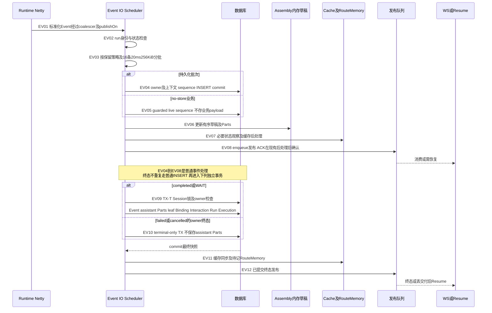
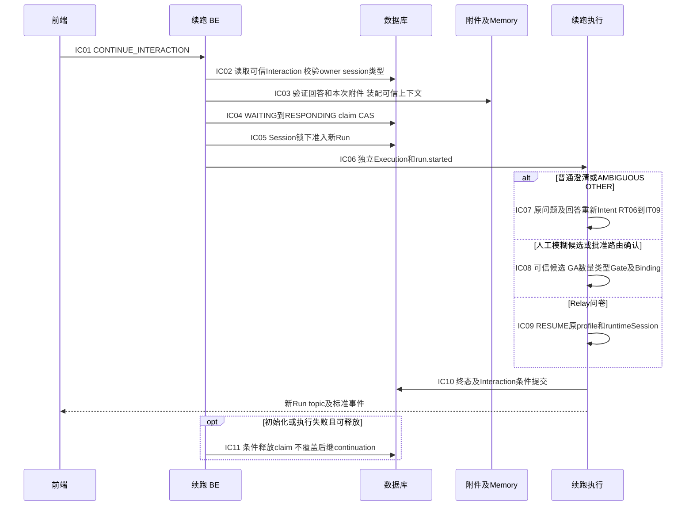
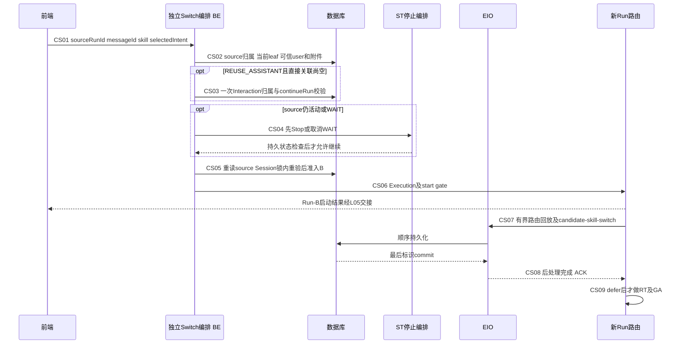
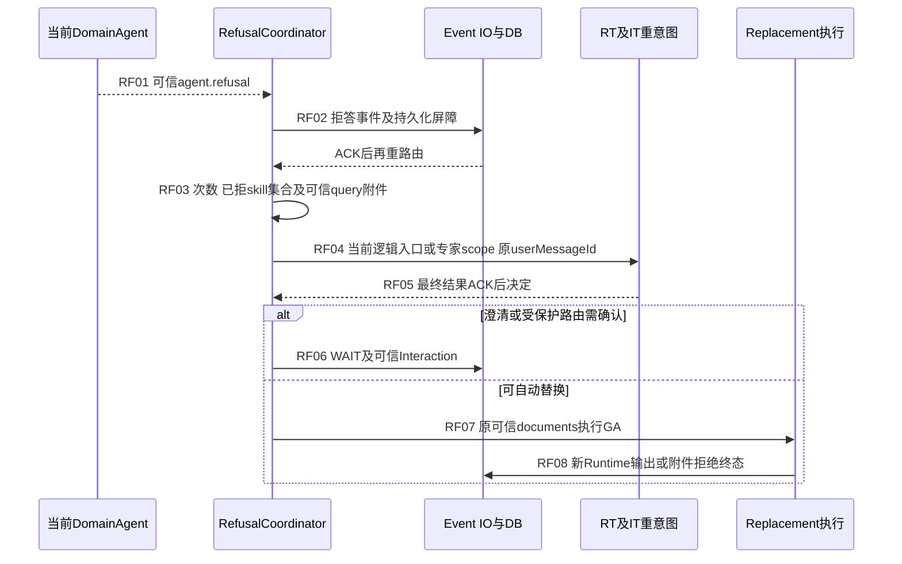
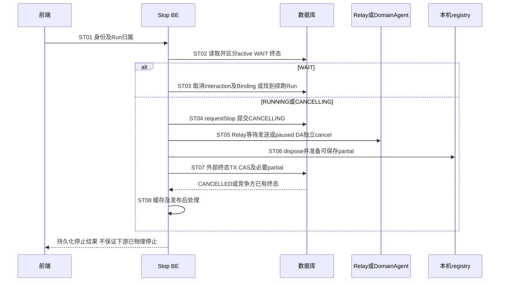
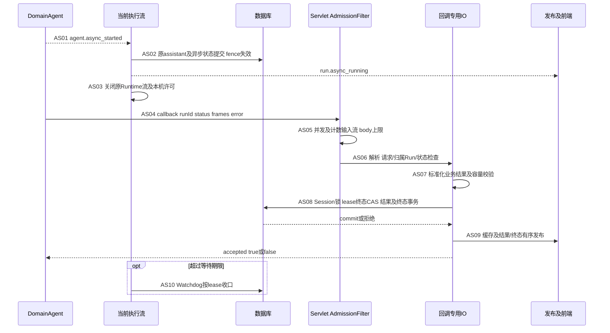

# 事件、续跑、切换与停止逐步视图

本页补充[C3/C4](chat-flows.md)及[T1到T5总览](completion-and-recovery.md)。公共入口、准入和路由编号见[启动详图](run-startup-details.md)、[路由详图](run-routing-details.md)。同名DB均为共享Hikari；“后处理完成”不等于浏览器收到。未特别说明的源码位置为链接文件中对应方法，风险编号见[登记表](risks.md)。

## F1. 普通输出与终态提交

| 步骤/源码 | IO、资源及实际时序 | 期限、失败后事实与客户端恢复 | 现有保护、风险及最小验收 |
|---|---|---|---|
| EV01 / PIPE、NORM | adapter标准化一般在N，PIPE两处publishOn切Event IO；coalescer当前生产实现不改变delta粒度 | Event IO16平台线程/每线程10000排队参数；上游BUFFER与预取可继续堆积，不受单批保护 | R01；同时观测socket帧速率、排队字节及JDBC延迟，不只量DB批次数 |
| EV02 / PIPE、RUN | 校验Event的run/session，再shouldAcceptEvent状态检查；部分事件命中内存，部分需要仓储观察 | 不一致生成身份错误或停止；真正落库仍须owner/fencing，内存不是唯一守卫 | 校验不能删以省Q；owner失权拒绝由合法执行者/Watchdog收口 |
| EV03 / BATCH | 每run顺序concatMap；16条/20ms/256KiB，控制/ACK及不能批量事件保留单事件；关闭批处理逐条写 | 不是整回答一个事务；字节拆批不能拆开单个超大Event；序列化/估算消耗CPU | R01/R02；开关两态、异构事件保序、单条极大payload边界测试 |
| EV04-EV05 / STORE | 持久化批次含上下文读取、FOR SHARE NOWAIT guard、sequence分配和INSERT；live-only仍需受保护分配sequence | NOWAIT冲突立即拒绝，不等SQL超时；拒绝标志截断后续批并拒绝ACK；不是自动重试 | R14；FULL可回放已提交前缀，no-store业务不能；不得放宽stop/fencing保护解决拥塞 |
| EV06 / ASM | 按已处理事件累计正文及Parts；snapshot优先；DomainAgent thinking跨正文加历史注释；拒答/替换清空按原语义 | 全文/Parts可能持续增长；no-store占位不代表所有中间内存分配为零 | R01；测长正文/卡片/引用与snapshot，实时delta不应混入历史分段标识 |
| EV07-EV08 / EC、RUN、BUS | 观察Run状态、处理必要缓存、发布enqueue，再确认PersistenceAcknowledgedEvent | commit后的Redis/序列化失败不能回滚原Event；后处理失败可走新的失败终态；发布队列不是前端ACK | R04/R07/R09；DBcommit后kill与Redis断连分别测，记录数据库提交/入队/发送/消费四时间 |
| EV09 / TERM | TX10s：Session锁→owner→终态Event→assistant及Parts→leaf/Run关联→Binding/Interaction/Run/Execution；Parts100条/1MiB | 包括必要数据的原子性；大量Parts可形成多批，不是恒定SQL；锁持到commit | R02；Event/assistant/Binding任何W失败整体回滚；附件拒绝草稿只在completed激活 |
| EV10 / TERM | owner失败/取消terminal-only，不执行EV09整套消息/Parts写入；Interaction/Binding按条件更新 | 与外部Stop的partial事务不同；不能声称所有run.failed都有最新partial历史 | R14；校验终态竞争只能提交一次；前端用已存历史和Event恢复，而非猜测当前内存草稿 |
| EV11-EV12 / COMPLETE | 同步提交结果缓存；附件拒绝PendingRouteMemory取出后异步record；route-switch-applied已与Binding同TX，提交后按序发布 | RouteMemory增强失败开放；没有Outbox；crash窗口仍在 | R04；FULL Resume恢复同序列，no-store只控制事实；后续加固需要可靠交付时单独设计 |

源码：PIPE=[ChatEventPipeline.persistAndPublish/acceptedEvents/persistBatch](../../../src/main/java/com/huawei/it/ex/one/application/service/chat/ChatEventPipeline.java) L76/L100/L130；BATCH=[ChatEventBatcher](../../../src/main/java/com/huawei/it/ex/one/application/service/chat/ChatEventBatcher.java)；STORE=[MyBatisChatEventStore](../../../src/main/java/com/huawei/it/ex/one/infrastructure/persistence/MyBatisChatEventStore.java)；ASM=[AssistantAssembly](../../../src/main/java/com/huawei/it/ex/one/application/service/chat/AssistantAssembly.java)；EC=[ChatEventCommitCoordinator](../../../src/main/java/com/huawei/it/ex/one/application/service/chat/ChatEventCommitCoordinator.java)；RUN=[ChatRunApplicationService.observeEvent](../../../src/main/java/com/huawei/it/ex/one/application/service/chat/ChatRunApplicationService.java)；TERM=[ChatRunTerminalCommitService](../../../src/main/java/com/huawei/it/ex/one/application/service/chat/ChatRunTerminalCommitService.java)；COMPLETE=[ChatRunCompletionCoordinator](../../../src/main/java/com/huawei/it/ex/one/application/service/chat/ChatRunCompletionCoordinator.java) L105/L144；BUS=[RedisChatLiveEventBus](../../../src/main/java/com/huawei/it/ex/one/infrastructure/persistence/RedisChatLiveEventBus.java)。NORM为路由GA13。

## F2. Interaction分流与失败释放

| 步骤/源码 | 操作及分支 | 等待/失败事实与影响 | 加固/回归验收 |
|---|---|---|---|
| IC01-IC03 / IC、CTX | 共享E/L入口和许可；从Interaction DB恢复类型、user/assistant、原query和候选；允许的本次附件逐项Q，记忆准备在claim前 | N项DB和记忆耗时占启动许可；回答不合法不应消费claim；批准route-switch才额外允许附件，拒绝不允许 | R02/R21；输入失败Interaction仍可重试，不额外继承A附件；不把前端metadata当关联事实 |
| IC04 / IS | CAS WAITING→RESPONDING，记录continueRunId；竞态只有一方成功 | claim与后续Run准入不是同一总事务；abort即条件markWaiting | R14；kill在claim后，孤儿2m宽限及Watchdog扫到才恢复，非精确2m |
| IC05 / ADM、IRC | 锁后Session/scope、active校验；普通澄清创建新user，模糊OTHER/选择复用user及assistant；兼容入口也加Session锁 | 普通澄清NEW_TURN在准入TX标旧Interaction ANSWERED；REUSE不在此刻完成 | 不承诺所有失败都恢复WAITING；只有匹配状态/continueRun的释放可成功 |
| IC06-IC07 / CL、AMB | 单独Execution/start gate后返回新Run ID；OTHER折叠可信问题与答案，使用当前有效专家/入口，RT/IT重试边界相同 | Run-B运行期间assistantMessageId可尚未回填，服务端私有复用关系已记录 | 回归当前Run ID用于candidate/Resume；不得使用旧Run-A或前端自造assistant关系 |
| IC08 / SW、SR | 可信候选及本次documents进GA；DA ALLOW通过owner/fence+取消A建B短TX，之后还有route写guard | stop先提交不切Binding；切换先提交B可保留；类型拒绝deferred直到EV09，applied也延迟 | R07；回滚不留下虚假applied；模拟配置查询期间跨实例stop |
| IC09 / RELAY | 同一可信profile/roleName/runtimeSession重建或续接WS，发送问卷答案；不重新通用Intent | Upgrade/config/heartbeat/maxRun与GA12相同；BUFFER风险也适用 | R01/R05；不是任意DA ask-user帧都支持，直接DA无通用问卷续跑状态机 |
| IC10-IC11 / TERM、IC | REUSE在completed/WAIT终态写回同assistant并按条件ANSWERED；失败释放防旧Run覆盖新claim | 已提交的普通NEW_TURN ANSWERED与REUSE可重试语义不同；DB故障可能依赖治理 | R13/R14；逐类型测取消、owner失效、终态失败及重复提交，不能只用一种Mock覆盖 |

源码：IC=[InteractionContinuationCoordinator.executeClaimedContinuation/prepareResponse](../../../src/main/java/com/huawei/it/ex/one/application/service/chat/InteractionContinuationCoordinator.java) L122/L160；IS=[ChatInteractionApplicationService](../../../src/main/java/com/huawei/it/ex/one/application/service/chat/ChatInteractionApplicationService.java)；CTX=[IntentClarificationContextAssembler](../../../src/main/java/com/huawei/it/ex/one/application/service/chat/IntentClarificationContextAssembler.java)；ADM=[ChatRunAdmissionCommitService](../../../src/main/java/com/huawei/it/ex/one/application/service/chat/ChatRunAdmissionCommitService.java) L245起；IRC=[InteractionRunCoordinator](../../../src/main/java/com/huawei/it/ex/one/application/service/chat/InteractionRunCoordinator.java)；CL=[IntentClarificationRunCoordinator](../../../src/main/java/com/huawei/it/ex/one/application/service/chat/IntentClarificationRunCoordinator.java)；AMB=[AmbiguousRouteContinuationCoordinator](../../../src/main/java/com/huawei/it/ex/one/application/service/chat/AmbiguousRouteContinuationCoordinator.java)；SW=[RouteSwitchContinuationCoordinator](../../../src/main/java/com/huawei/it/ex/one/application/service/chat/RouteSwitchContinuationCoordinator.java)；SR=[RouteSwitchContextResolver](../../../src/main/java/com/huawei/it/ex/one/application/service/chat/RouteSwitchContextResolver.java)。TERM同F1；RELAY为GA12。

## F3. 候选独立切换与回放屏障

| 步骤/源码 | 数据/边界 | 期限与失败表现 | 风险及验证 |
|---|---|---|---|
| CS01-CS03 / CS | 只复用source可信user/query/附件；metadata仅本次值；常规无需Interaction额外Q，缺assistant的可信复用分支加1Q | precheck在Stop前，附件不合法不得先停A；复用关系须同owner/session/user、continueRunId及原Run匹配 | 400/ACCESS_DENIED/STALE_SOURCE不自动纠正旧runId；测OTHER运行中和无partial停止 |
| CS04-CS05 / CS、ADM | A完成可直接切；活动先Stop，仍未停止返回STOP_PENDING；之后短TX Session锁内重验leaf及其他active | Stop与B准入不是一个长TX；其他Run可抢先导致409，A不自动恢复 | R08/R14；返回409后查询状态再重试，不循环创建B；全程无A/B同时本地active |
| CS06-CS07 / TRACE、RT | B复用user，assistant sibling版本；查询source可回放路由事件，保留来源run/seq；最多32条/256KiB，排除正文/业务卡片/终态 | IO/序列化及回放落库增加候选专属成本；no-store不强制复制未保存的业务 | R02/R11；A→B→C去重、容量、历史METADATA/Parts和版本回显；不是零SQL功能 |
| CS08-CS09 / RT、EC | 最后marker包装Sinks.One持久化ACK；只在commit及后处理成功后Flux.defer订阅Binding和route更新 | 预取不等commit；失败/stop/取消不放行；无额外固定sleep或锁策略变化 | R04；实际PIPE阻塞前序及marker，确认Runtime零调用直到ACK；DB真实锁竞争仍待验 |

源码：CS=[CandidateDomainAgentSwitchApplicationService](../../../src/main/java/com/huawei/it/ex/one/application/service/chat/CandidateDomainAgentSwitchApplicationService.java)；TRACE=[CandidateSwitchRouteTrace](../../../src/main/java/com/huawei/it/ex/one/application/service/chat/CandidateSwitchRouteTrace.java)；RT=[StandardRunRuntimeCoordinator.replayBeforeRuntime](../../../src/main/java/com/huawei/it/ex/one/application/service/chat/StandardRunRuntimeCoordinator.java) L180；ADM/EC同前。返回后前端切换到B topic，从B firstSeq恢复，不能把A/B事件继续混在同一个正文上。

## F4. DomainAgent拒答与同Run重意图

| 步骤/源码 | 操作、等待与退出 | 状态/影响及最小验收 |
|---|---|---|
| RF01-RF02 / RF | 原Runtime流截取可信拒答；需要的最后事件ACK先提交，避免与重路由Run写冲突 | 不是任意正文“不能回答”就重意图；普通事件走EV。测试拒答后旧流释放，不叠加旧/新BUFFER |
| RF03-RF04 / RF、FACT | 当前run可信query/澄清折叠query、attachments/documents、已拒目标、rerouteCount；默认max-reroutes=3（Properties默认，归一上限10）；从原命令逻辑入口重新映射前缀 | 不是新user/新Run，也不是同一HTTPretry；每次实际重意图依RT/IT读取上下文，当前次内部retry不重复偏好Q；R06放大要按业务轮次另算 |
| RF05 / RF | Intent结果ACK后再owner检查；失败策略FAIL_RUN、Relay、无可用DA、澄清分别退出，不盲目再次调用被拒目标 | 验证相同目标、已拒集合、无匹配、次数耗尽和旧owner，不以自动fallback掩盖异常 |
| RF06 / RP、REPL | 直连/受保护Binding默认需要路由切换确认；auto-switch配置可改变；澄清保存可信拒答上下文 | WAIT释放本机执行许可，后续IC新Run；确认重提附件与自动路径继承附件不同 |
| RF07-RF08 / REPL | 标记拒答Binding不可路由，替换DA复用可信documents经GA；类型拒绝新Binding延迟至completed，已拒A不恢复 | R02/R07；替换失败只按该分支补偿，不宣称所有A都应恢复；Run-B候选调用拒答也走同一逻辑 |

源码：RF=[DomainAgentRefusalCoordinator.execute/continueAfterRefusal/continueAfterReroute](../../../src/main/java/com/huawei/it/ex/one/application/service/chat/DomainAgentRefusalCoordinator.java) L149/L260/L329；REPL=[DomainAgentReplacementExecutor](../../../src/main/java/com/huawei/it/ex/one/application/service/chat/DomainAgentReplacementExecutor.java)；RP/FACT为RF注入的bindingPolicy/eventFactory及[DomainAgent配置](../../../src/main/resources/application.yml)。

## F5. Stop、partial和跨实例边界

| 步骤/源码 | 资源、事务和期限 | 失败事实/影响、最小加固及验证 |
|---|---|---|
| ST01-ST03 / STOP、WAIT | E入口身份；Run缓存/DB归属查询；已终态幂等；WAIT单独TX取消等待/引用Binding，旧WAIT历史不强改 | 当前Interaction若已有continueRun需定位实际Run；测试跨实例WAIT/回答竞争、重复stop |
| ST04 / RUN | requestStop先提交CANCELLING，活动唯一索引继续阻止同Session新Run | R14：实例在此后退出可能长时间CANCELLING；已有owner心跳不能证明停止方完成收口；需治理持续取消状态 |
| ST05 / STOP、RELAY、DA | Relay当前连接或临时RESUME发stop_all_agents，5s控制等待可由发送完成结束；临时还有Upgrade/config；DA取消detached，120s，空stop-path不请求 | R05：不承诺Relay停止确认屏障跨代次安全；DA取消绕过64查询许可，best-effort不代表远端已停；异常后固定专家仍RESUME同session |
| ST06 / STOP | 下游控制阶段结束后publishOn(BE)，dispose本机执行、构造已收partial；另一实例的registry不能直接访问 | 旧实例后续写仍由fencing拒绝；无partial不强制写assistant，真实正文保存受FULL/no-store约束 |
| ST07 / TERM | 外部终态TX10s；需要partial先Session锁；Run CAS竞争自然完成/回调/其他stop，只有胜者提交 | DB失败不能从客户端timeout推断取消成功；R02/R14，真实DB竞争/kill需补验 |
| ST08 / STOP | 提交后更新缓存、publish；固定专家与DA运行中stop保留有效Binding，WAIT取消规则另算 | R04；客户端查询stream-status/Resume收口，发布失败不回滚终态，不盲重发NEXT |

源码：STOP=[ChatRunStopCoordinator.stopRun/stopActiveRun](../../../src/main/java/com/huawei/it/ex/one/application/service/chat/ChatRunStopCoordinator.java) L164及interrupt相关方法；WAIT=[ChatWaitingStopCommitService](../../../src/main/java/com/huawei/it/ex/one/application/service/chat/ChatWaitingStopCommitService.java)；TERM=F1 `commitExternalTerminal`；RUN=F1；RELAY/DA见GA11/12。

## F6. 异步挂起、回调和恢复治理

| 步骤/源码 | 操作/许可/锁 | 期限与失败事实、恢复及验收 |
|---|---|---|
| AS01-AS03 / AS | 默认功能关闭；开启后挂起TX保存assistant及必要事实，Run仍RUNNING，Execution=ASYNC_WAITING并失效旧fence；原流结束 | lease默认24h；没有全实例异步任务数独立限制；无正常done/completed。WS可保留，Run Resume遇边界结束，不能靠旧SSE等回调 |
| AS04-AS05 / FILTER | Jalor ACL为部署前提；Servlet过滤器解析应用路径覆盖矩阵参数，在反序列化前4并发及5MiB限制，chunked计数 | busy429，过大413；许可跨Servlet异步处理正确释放；Jalor独立来源/重试上限仍待验 |
| AS06 / CB | 从可信Run恢复owner/session/user/assistant；快速未挂起409 Retry-After1，终态/重复/过期accepted=false | 409同body按秒重试至少15s是下游约定，非服务端持久排队；DB慢仍共享Hikari |
| AS07 / CB | 锁前解析≤128frames、≤128业务events、≤1MiB；单帧256KiB；error最多1024码点；拒控制帧，纯终态不触发REPLACE | 错误400/容量413不claim，允许缩小重试；JSON/规范化成本发生在TX前但占callback许可及堆 |
| AS08 / COM | TX10s，Session锁+ASYNC_WAITING及lease条件CAS；APPEND/REPLACE正文和本run Parts、async metadata、未读、Event/Run/Execution原子提交 | 16条/256KiB批次，Parts100条/1MiB；关闭batch逐事件。批数受字节/单元限制，不能保证最大只9次SQL；stop/过期胜出不得覆盖 |
| AS09 / CB | 提交后cache、条件Binding完成、按result_started→业务→async_finished→message.completed→Run终态发布 | accepted=true只代表本地提交，不等前端ACK；R04/R09，no-store未在线/掉事件不能恢复正文，FULL可Resume |
| AS10 / GOV | operational scheduler心跳15s/lease90s（普通执行），Watchdog30s+jitter扫描；async截止是另一24h lease | R13/R14：默认scan100、4恢复、20/scan不是所有治理分支总预算；慢claim可能阻住single-flight，实例退出也不是即刻切换 |

源码：AS=[DomainAgentAsyncTaskApplicationService](../../../src/main/java/com/huawei/it/ex/one/application/service/chat/DomainAgentAsyncTaskApplicationService.java)；FILTER=[DomainAgentAsyncTaskCallbackAdmissionFilter](../../../src/main/java/com/huawei/it/ex/one/interfaces/chat/DomainAgentAsyncTaskCallbackAdmissionFilter.java)；CB=[DomainAgentAsyncTaskCallbackApplicationService](../../../src/main/java/com/huawei/it/ex/one/application/service/chat/DomainAgentAsyncTaskCallbackApplicationService.java)；COM=[DomainAgentAsyncTaskCallbackCommitService](../../../src/main/java/com/huawei/it/ex/one/application/service/chat/DomainAgentAsyncTaskCallbackCommitService.java)；GOV=[ChatRunRecoveryOrchestrator](../../../src/main/java/com/huawei/it/ex/one/application/service/chat/ChatRunRecoveryOrchestrator.java)。

## 前端恢复入口与检查点

| 时刻 | 前端动作 | 服务资源与失败边界 |
|---|---|---|
| 启动响应成功 | 根据新runId/topic订阅，从firstSeq前或本地已消费seq补漏 | WS8连接/用户/实例、8topic/连接、128订阅/topic/实例；不代表Resume共享这些许可 |
| WAIT回答/候选切换 | 接口返回的新Run替换订阅；复用assistant不等于复用topic | 前一Run事件不可混入新正文；候选继承前缀有来源标记，服务器已经去重 |
| 刷新或WS断线 | 先stream-status+messages，活动Run重建topic；FULL从持久游标回放，RECOVER_REQUIRED使用建议恢复游标 | 状态读取可触发懒恢复；Run/Session Resume当前全List且无独立用户并发护栏，R03，不要前端毫秒级轮询 |
| 异步等待 | Run Resume恢复到边界后结束；保持/重建WS或退避查询状态，页面关闭不stop后台 | 空闲WS占socket/订阅/队列，不独占Tomcat执行线程或JDBC连接；默认idle10m，客户端遵守保活 |
| 完成但未收到终态 | 读状态、历史及Run Resume；FULL恢复已存结果 | no-store只能恢复控制和占位；提交后实时丢失不能靠重复callback补写补发 |
| 标题提炼成功 | 重读会话详情/列表 | 无标题专用WS通知，见TT19；不能因正文终态已经收到就认定标题也已提交 |

WS/Resume完整连接图、发送队列及关闭条件仍以[终态与恢复T4](completion-and-recovery.md#t4-websocketresume与刷新)为公共视图；本页仅增加与主流程的进入/退出关系，不引入新前端协议。
