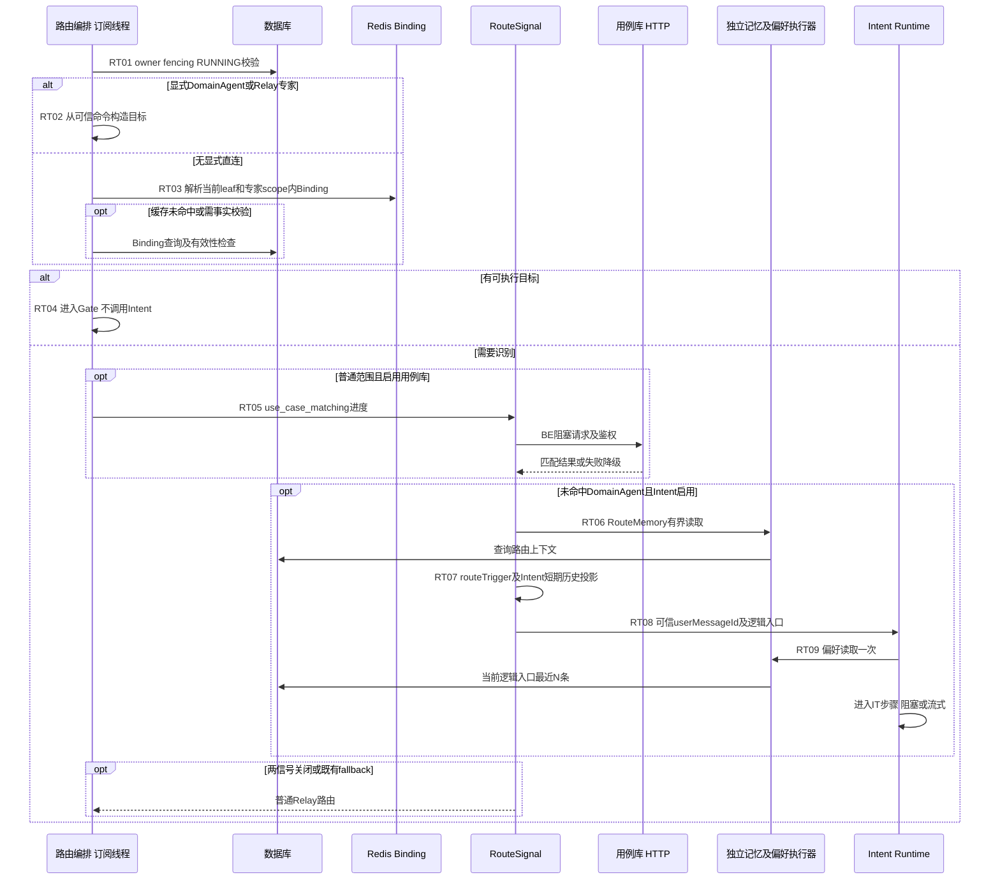
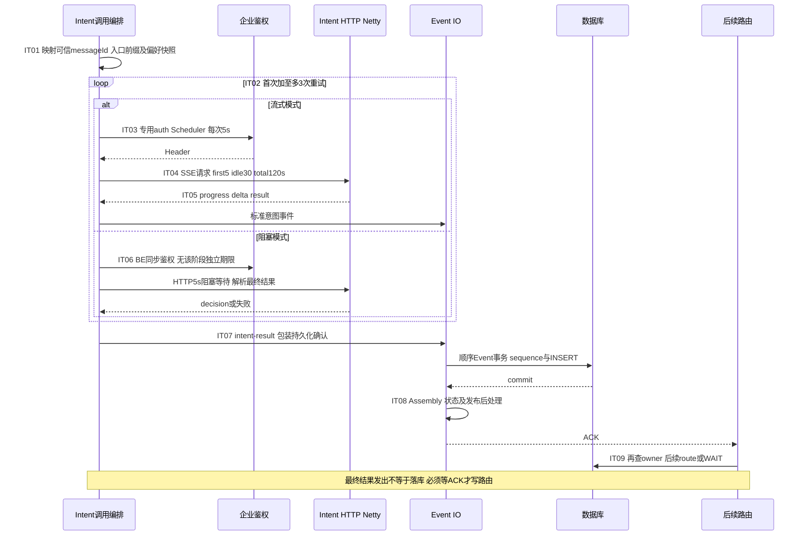
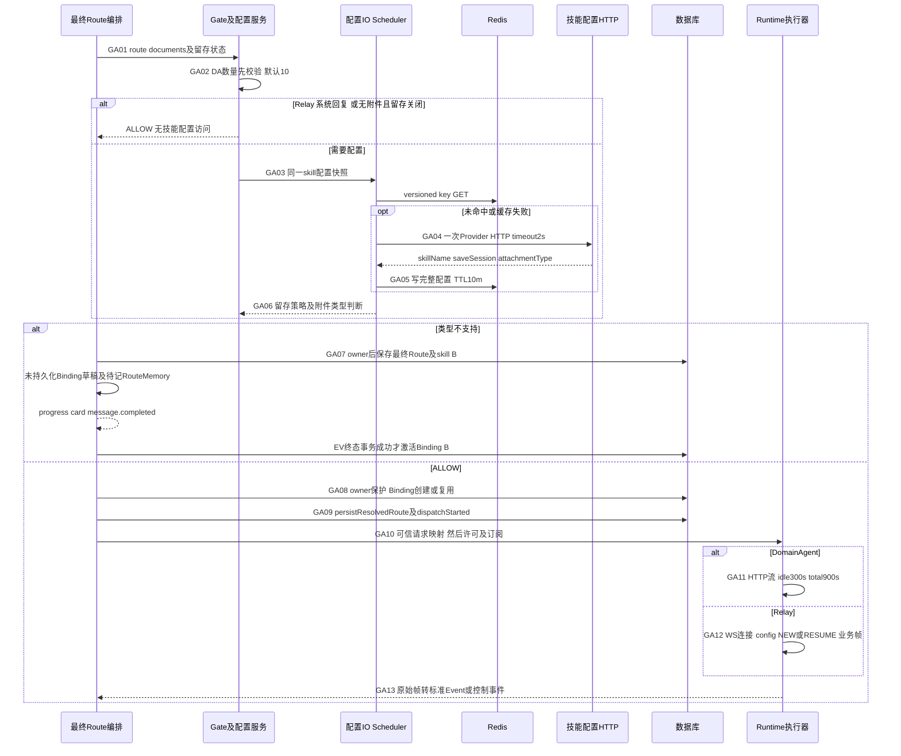

# Run路由与第三方依赖详图

进入点是[启动X09](run-startup-details.md#s5-准入后副作用execution与开始事件)：准入、Execution及run.started已分别提交。任何此后的失败都不能假设“Run未创建”。本页展开C2，终态及恢复见[控制详图](run-control-details.md)。源码简称在各表之后定义；风险编号沿用[风险登记](risks.md)。

## R1. 目标、Binding及上下文选择

| 步骤/源码 | 条件、线程、DB/Redis/外部调用 | 期限/状态边界 | 失败与前端恢复、风险及最小验收 |
|---|---|---|---|
| RT01 / DIS | 当前执行订阅要求owner/fencing/RUNNING；调度至现有owner查询路径；后面每个关键写前还有guard | owner-query TX2s，不是对整段路由持锁；异步外呼后原检查不能当永久凭证 | 失权截断，不用旧owner写新失败终态；R14，跨实例stop与外呼延迟验证 |
| RT02 / RES | targetId仅经可信命令映射；DA为skill，Relay专家为profile+roleName；不是先调用Intent再强行覆盖 | 带附件DA可先留草稿；普通无附件保留原Binding处理时机 | 选择事件是展示事实，真正runtimeDispatch另有标记；参数非法不发请求 |
| RT03 / RES、BIND | 当前leaf、tenant/user、scope、profile约束查询Binding；Redis读/DB回源/必要touch或重建写；forceReroute按既有规则取消 | 每个Session可能多个历史Binding，不能计成固定1Q；部分事务仍有缓存交互，见R07 | ACTIVE不等于任意旧RESUMABLE可续接；旧专家不可跨范围复用；验证A/B/通用三范围 |
| RT04 / DIS | 目标已定直接进入GA，不读取RouteMemory/偏好或调用用例库/Intent | 后续DA拒答可再进入RT06；当前Run入口仍须保存以供重意图 | 不把“首次跳过Intent”写为“本轮一定不调用Intent” |
| RT05 / SIG、UC | 仅普通非聚合专家且用例库开关开启；BE调用鉴权+HTTP，进度先生成；命中DA后跳过Intent | 默认关闭，HTTP5s，无应用重试；同步auth在HTTP期限外，进度发出不是commit ACK | 失败按未命中继续；R06，故障时先测auth等待而非只测HTTPtimeout |
| RT06 / RM | RouteMemory独立read pool1到2/queue64；读历史并生成routeTrigger等上下文 | 300ms读取期限，breaker5次/open30s；底层JDBC是否已结束由驱动决定 | 失败返回空增强上下文，不阻断意图；R02/R10，慢DB验证worker/connection是否持续占用 |
| RT07 / SIG、STM | 基于可信query、拒答信息、澄清冻结上下文形成Intent投影，当前Run历史不重复；Intent只role/content | 纯CPU/对象装配，不新增历史Q；routeSource=runtime-binding不新记路由 | 不能混用短期记忆和RouteMemory；验证首次、纠偏、澄清、同run拒答的边界 |
| RT08-RT09 / SIG、IP | Intent出站前按逻辑入口取最近偏好一次；独立于RouteMemory的read executor/breaker；limit默认5、0时不查 | 复用300ms参数但不共线程；重试共享列表，不每次再Q；默认入口解析不加部署前缀 | 读失败固定[]；R10，验证4次尝试仍只读1次偏好；query/偏好正文不进日志 |

源码：DIS=[ChatRuntimeDispatchCoordinator.execute/executeRouteFrames](../../../src/main/java/com/huawei/it/ex/one/application/service/chat/ChatRuntimeDispatchCoordinator.java) L78/L98；RES=[RouteResolutionCoordinator.prepareInitial/resolve](../../../src/main/java/com/huawei/it/ex/one/application/service/chat/RouteResolutionCoordinator.java)；BIND=[RuntimeBindingApplicationService](../../../src/main/java/com/huawei/it/ex/one/application/service/runtime/RuntimeBindingApplicationService.java)；SIG=[RouteSignalApplicationService.routeInitialFrames/intentOrFallbackFrames](../../../src/main/java/com/huawei/it/ex/one/application/service/routing/RouteSignalApplicationService.java) L137/L163；UC=[HttpUseCaseLibraryClient](../../../src/main/java/com/huawei/it/ex/one/infrastructure/usecase/HttpUseCaseLibraryClient.java) L54；RM=[RouteMemoryApplicationService](../../../src/main/java/com/huawei/it/ex/one/application/service/memory/RouteMemoryApplicationService.java)；STM=[ShortTermMemoryContextAssembler.projectIntent](../../../src/main/java/com/huawei/it/ex/one/application/service/memory/ShortTermMemoryContextAssembler.java)；IP=[IntentPreferenceCorrectionLoader](../../../src/main/java/com/huawei/it/ex/one/infrastructure/intent/IntentPreferenceCorrectionLoader.java)。

## R2. Intent出站、重试与持久化屏障

| 步骤/源码 | IO、线程及重试单位 | 期限/预算与未覆盖段 | 失败状态及加固/验证 |
|---|---|---|---|
| IT01 / MAP | mapper共用阻塞/流式；messageId来自Run.userMessageId；非空逻辑入口trim后直接拼request-prefix，未传用默认入口不拼；response-prefix另用于skill解析 | 不改Run/Session/偏好原值；每次从原命令映射，不逐次累加 | 参数/响应含义不能混淆；验证EX_fin和EX_EX_fin规则、范围隔离；无额外Q |
| IT02 / BL、SC | max-retries默认3，额外重试归一上限10；主Intent两模式重试遵循现有失败策略，无candidate式退避/筛选 | 偏好在循环外，auth在每次内；没有主Intent独立总并发许可 | R06；失败放大与Run tenant200可能叠加，建议单独收敛瞬态重试及逻辑总预算，不在本文改代码 |
| IT03 / SC | 流式auth专用newBoundedElastic4/128平台线程；每次重新取企业Header | 每次5s含auth调度等待；不可中断token可能在取消后继续占线程 | 超时可进入下一尝试；R06，测底层阻塞存留，不能声称timeout杀线程 |
| IT04-IT05 / SC、SIR | Netty收SSE解析后映射progress/thinking/final decision；事件异步进入EIO | 首映射业务事件5s、decoded SSE idle30s、每次total120s；total不含auth；心跳/有效业务定义不能混为一谈 | 断线/协议失败走现有retry/fallback或FAIL_RUN；名义4×(5+120)=500s再加前置阶段，非总硬期限 |
| IT06 / BL、BIR | BE上同步auth及WebClient block等待，返回完整响应解析；每次HTTP5s | HTTP部分4×5=20s，auth和之前排队在外；不能说“20秒必结束” | R06；最小加固先独立auth期限，再总budget，回归既有降级策略 |
| IT07-IT08 / DIS、EC | intent-result由PersistenceAcknowledgedEvent/IntentResultPersistenceBarrier跟踪；EIO DB事务+后处理后ACK | 批次顺序提交，关键ACK单元不能用Flux concat代替；无前端ACK等待 | 追加拒绝/取消会拒绝ACK，不放行route；R04，注入DB延迟验证无Run锁内部竞争 |
| IT09 / SIG、DIS | 最终单一/NO_MATCH/多意图/澄清按原策略；OWNER复验后Route或WAIT；识别记录可选异步旁路 | recognition默认关闭；RouteMemory写为有界旁路，不属于Intent HTTP原子结果 | WAIT新建Interaction并走EV终态；FAIL_RUN不调Runtime；失败策略与合法NO_MATCH必须区分 |

源码：MAP=[IntentServiceRequestMapper](../../../src/main/java/com/huawei/it/ex/one/infrastructure/intent/IntentServiceRequestMapper.java)；BL=[FinEurekaIntentService](../../../src/main/java/com/huawei/it/ex/one/infrastructure/intent/FinEurekaIntentService.java) L103/L151；SC=[FinEurekaIntentStreamClient](../../../src/main/java/com/huawei/it/ex/one/infrastructure/intent/FinEurekaIntentStreamClient.java) L139/L177/L311；SIR=[StreamingIntentAgentRuntime](../../../src/main/java/com/huawei/it/ex/one/infrastructure/runtime/intentagent/StreamingIntentAgentRuntime.java) L40；BIR=[BlockingIntentAgentRuntime](../../../src/main/java/com/huawei/it/ex/one/infrastructure/runtime/intentagent/BlockingIntentAgentRuntime.java)；EC=[ChatEventCommitCoordinator](../../../src/main/java/com/huawei/it/ex/one/application/service/chat/ChatEventCommitCoordinator.java)。DIS、SIG同R1。

## R3. 技能配置、Gate与真实Runtime订阅

| 步骤/源码 | 条件、IO与副作用 | 预算/释放时机 | 失败影响、现有保护与验证 |
|---|---|---|---|
| GA01-GA02 / GATE | 可信documents.size先检查DA动态上限10，API附件上限仍20；无外部调用 | List.size内存检查，先于配置和附件路径Binding写入；Mapper重复校验作最终防御 | 数量超限run.failed，不是附件类型业务completed；确认切换A不应先被取消，测试11到20个 |
| GA03 / CFG | 唯一配置服务访问Redis/Provider；tenant+skill版本化完整缓存，同次留存和类型共享快照 | cache默认开、10m；专用IO4/128；miss没有跨请求single-flight | R16；同一次miss最多1次Provider，不代表并发8次miss只查1次。缓存失败回Provider |
| GA04-GA05 / PROV、CFG | POST查询单skill配置、企业鉴权、解析匹配项、写缓存；不调用聊天接口；写失败不影响本次快照 | HTTP2s不覆盖Redis/全部队列等待；无业务重试，不能以缓存10m承诺实时配置 | R06/R16；仅类型检查时失败告警放行，留存启用失败关闭；测试网络失败与“未匹配返回空配置”不同语义 |
| GA06 / GATE | 空attachmentType含未配置→拒绝全部附件；合法非空逐文件后缀判断；无后缀仅在合法非空类型时放行；畸形非空告警放行 | 遍历N及配置串，零新Q，既有可信文档是输入；数量校验和类型校验不同失败协议 | 不支持有结构化supported/unsupported列表；无Agent HTTP；R21，可信文档引用边界另见风险 |
| GA07 / DIS、TERM | 记录route/skill B及deferred Binding草稿，不提前激活；业务事件先生成，终态TX-T才取消A/激活B；RouteMemory待提交后补记 | owner2s；无Runtime64许可；附件拒绝事务保证不依赖JVM finalizer异步恢复 | 失败/stop/失权不激活B；completed才成为下轮Binding；确认切换applied事件亦同TX提交 |
| GA08 / RES、BIND | 正常路径已有Binding可touch/复用，附件路径ALLOW后再写；直连、固定专家和scope筛选按原顺序 | 部分受保护Binding操作TX2s；route-switch DA ALLOW为owner+取消A+建B同短TX；Redis提交后策略因入口不同，见R07 | stop先提交不写B；切换先提交B可保留；正常订阅前失败按既有条件补偿，非跨实例可靠回滚 |
| GA09 / DIS、AR | 保存Run最终Route、绑定及messageSkill，markRuntimeDispatchStarted后才能调下游；正常RouteMemory原时机记录 | 数次已存在Q/W，不是与外部HTTP一个TX；信号事件ACK已在IT阶段完成 | 旧owner不能覆盖新route；标记代表提交的调用意图，不证明远端已收到 |
| GA10 / DA、RE | mapper清理私有控制字段，标准documents覆写可信docList；DA runId/messageId/skillId来自服务端；Relay profile/roleName来自可信route或Binding | DA64、AgentRuntime64各自独立非等待许可，覆盖订阅到finally；映射/Gate前置不全在许可内；busy不排队 | 许可不是DB连接预留；R02，验证失败、取消、WAIT、ASYNC释放。拒答切换不能双持旧Runtime资源 |
| GA11 / DA | DomainAgent HTTP流，raw单帧256KiB；Netty解析及桥接；无自动HTTP重试 | raw首chunk/idle300s，总900s从HTTP订阅计；不包前置Gate/DB；query结束释放许可 | R01：Flux BUFFER及Assembly总大小未由单帧上限限制；慢DB/高速帧故障注入 |
| GA12 / RE | WS Upgrade→config-ready→user-message或chat_expert(roleName)；NEW/RESUME及历史messages；入站转换 | connect5s在Upgrade10s内，config再10s；业务max30m；heartbeat20s/inbound90s；close/error释放连接、timer、许可 | R01/R05；无透明重连继续同Run，断线按原错误收口；迟到stop外部依赖不能由heartbeat解决 |
| GA13 / NORM | content/thinking/card/reference/metadata标准化；推荐问变CARD；refusal、approval、async控制分流到IC/RF/AS；业务进EV | 默认响应回调N，Event落库切EIO；不能在Netty上加入阻塞DB；单帧与累计预算分开 | R01/R16；普通流拒答经状态机，异步callback反而禁止控制帧，不能混用两条协议 |

源码：GATE=[AgentDataPersistenceGate.evaluate](../../../src/main/java/com/huawei/it/ex/one/application/service/agentdatapersistence/AgentDataPersistenceGate.java)；CFG=[DomainAgentSkillConfigurationService](../../../src/main/java/com/huawei/it/ex/one/application/service/domainagentconfig/DomainAgentSkillConfigurationService.java)；PROV见该服务注入的DomainAgentSkillConfigurationProvider及[配置](../../../src/main/resources/application.yml)；TERM=[ChatRunTerminalCommitService.commitCompleted](../../../src/main/java/com/huawei/it/ex/one/application/service/chat/ChatRunTerminalCommitService.java)；AR=[AppliedRouteRecorder](../../../src/main/java/com/huawei/it/ex/one/application/service/chat/AppliedRouteRecorder.java)；DA=[ConfiguredDomainAgentClient](../../../src/main/java/com/huawei/it/ex/one/infrastructure/runtime/domainagent/ConfiguredDomainAgentClient.java)及[DomainAgentChatRequestMapper](../../../src/main/java/com/huawei/it/ex/one/infrastructure/runtime/domainagent/DomainAgentChatRequestMapper.java)；RE=[RelayWebSocketRuntimeAdapter](../../../src/main/java/com/huawei/it/ex/one/infrastructure/runtime/relay/RelayWebSocketRuntimeAdapter.java)；NORM=[DomainAgentResponseNormalizer](../../../src/main/java/com/huawei/it/ex/one/infrastructure/runtime/domainagent/DomainAgentResponseNormalizer.java)。

## 不应合并计算的等待

1. 用户请求已经过L04首事件后，仍可能等待Intent数次尝试、技能配置、Runtime连接和首业务帧；30s不是这段总时限。
2. BE、Intent auth、RouteMemory read、Preference read、配置IO、Event IO是不同执行资源；它们最终仍共享Hikari及出站网络。线程隔离不等于数据库隔离。
3. RouteMemory/识别记录写是异步失败开放，读取是有界等待；等待ACK的是**事件数据库提交及后处理**，不是这些旁路一定持久化完成。
4. 默认关闭的Intent、用例库、DomainAgent、标题/长期记忆需明确启用后才发生对应调用；默认fallback可能直接走配置好的Relay。不得把图上所有可选分支叠加成每次Run固定调用次数。
5. 加固顺序建议：先限制无界buffer和不可中断鉴权，再收敛重试/缓存miss，再以混合负载给Hikari和下游预留治理余量；本文不修改现有调度或业务行为。
