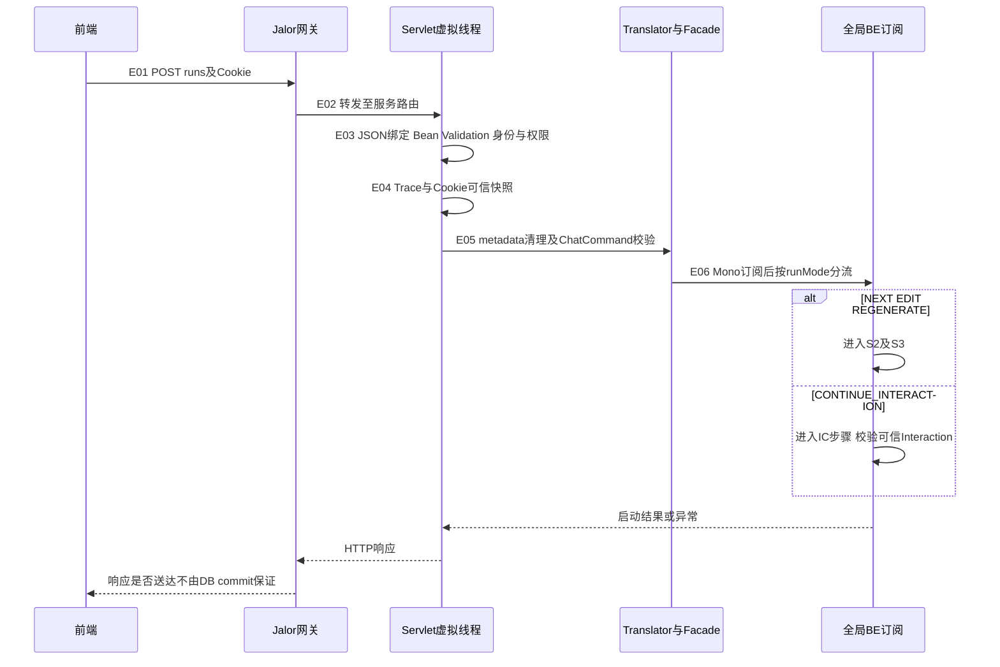
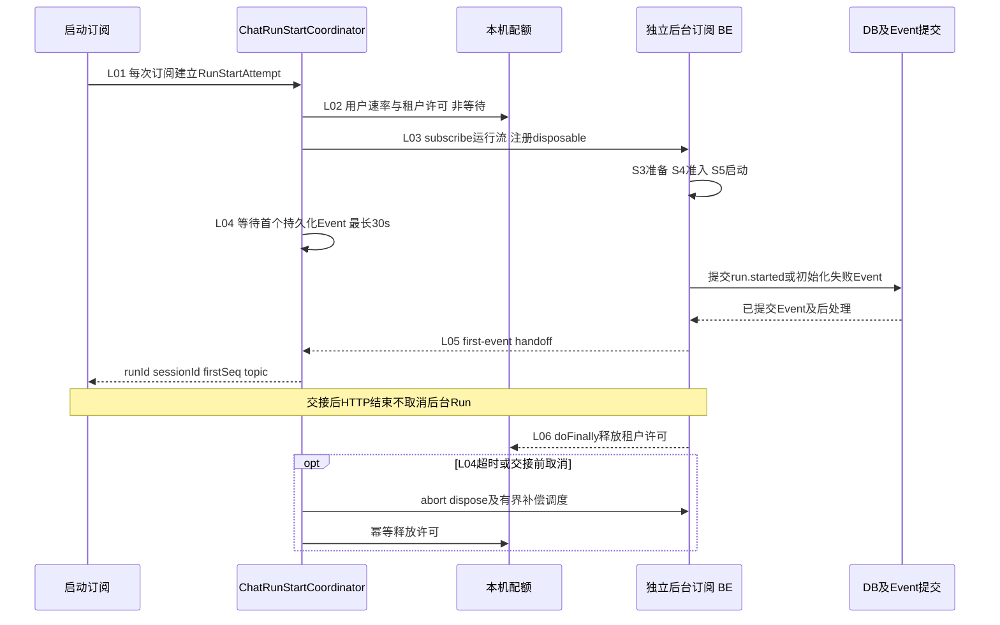
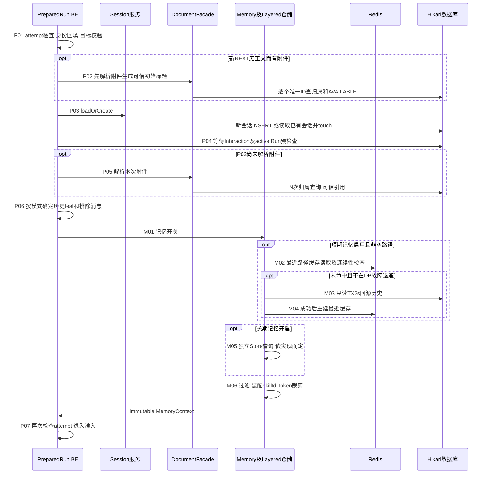
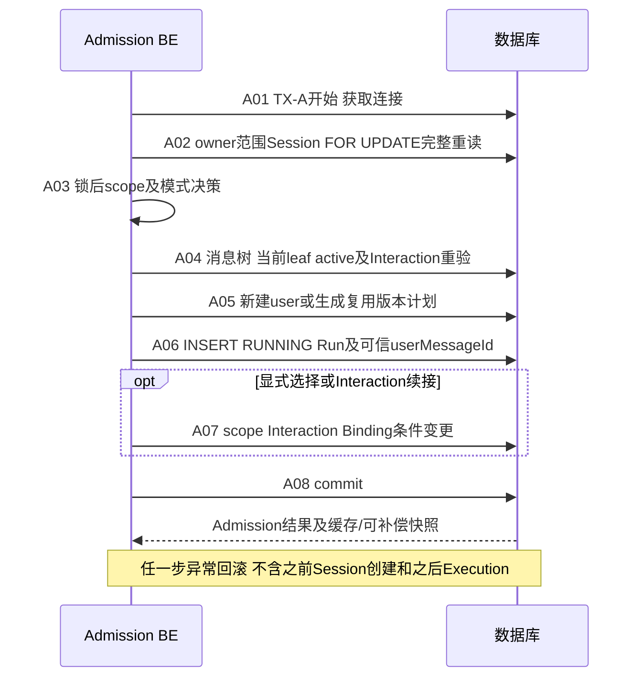
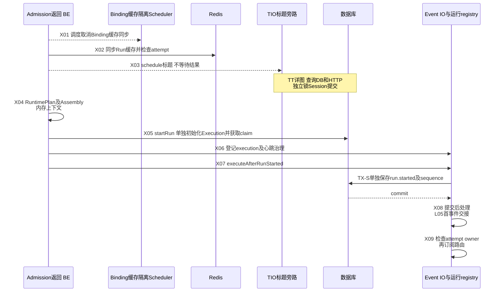

# Run入口、准备与启动详图

本文细化[C1总览](chat-flows.md#c1-post-runs准入启动与首事件)，后续见[路由详图](run-routing-details.md)、[事件与控制详图](run-control-details.md)。步骤编号是文档审计编号，不是新增日志、事件或协议字段。

## 阅读约定与资源账本

- `V`：生产Servlet入口虚拟线程；`BE`：全局boundedElastic调度的阻塞工作；`N`：Netty回调；`EIO`：专用Event IO Scheduler；`TIO`：标题专用Scheduler。`subscribeOn`不是给整条异步链永久指定线程，网络、ACK、timer后续回调可能换线程。
- 同步Repository/Redis调用会占用**当时的执行线程**；图中异步箭头仅表示独立调度，不表示IO不占资源。所有JDBC共享Hikari默认10连接、借用期限500ms。Redis单command默认500ms，不是每项业务总期限。
- `TX-A`准入、`TX-X`Execution初始化、`TX-S`开始事件、`TX-T`终态是独立边界。没有覆盖整个Run的长事务；原子性只在各自事务内成立。
- 表内`Q/W`表示数据库读取/写入，`N`表示唯一附件数，`H`表示所读历史节点数；不把一次Repository调用恒等于一次SQL。驱动、网关及部署覆盖需结合[超时矩阵](dependencies.md)复核。
- 每行的源码索引位于对应小节末尾；位置为基线方法起点附近行号，不是经过生产采样的SQL计数。风险编号链接至[风险登记](risks.md)。

## S1. Jalor到模式分流

| 步骤/源码 | 执行条件、线程及资源操作 | 期限与边界 | 失败事实、前端处理与影响 | 保护/最小加固/验收 |
|---|---|---|---|---|
| E01-E02 / J、C | Jalor路由转发，Tomcat接收、Keep-Alive/Upgrade共享入口；8192连接、accept-count200 | Jalor请求、idle、重试、连接池、ACL和配额**全部待提供**；不可套用服务30s首事件期限 | 尚未进入应用也可能超时；响应未知先查状态，不能盲目NEXT重发 | R08；核对Jalor配置及链路ID，注入转发后丢响应；不假设网关自动安全重试POST |
| E03 / C | V上完整反序列化与字段校验；resolveChatUser调用身份防腐层及PermissionChecker；不是从body读tenant/user | 在Start计时及租户许可之前；普通JSON接口不能套用异步callback专属5MiB Filter | 参数错误不创建Run；权限错误沿现有ACCESS_DENIED协议，不能只判断HTTP成功 | 现有边界防伪；实际身份Provider是否访问网络由企业实现决定，需提供期限；入口体积/JSON深度与Jalor协同验收 |
| E04 / C、J | V同步快照Trace、Cookie；请求线程上下文不能留到异步时再读取 | 不新增DB；JalorTraceContextProvider当前为扩展占位，不能声称已验证Jalor SDK提取 | 快照用于后续可信透传；日志不得泄漏Cookie/token | 检查跨线程trace及头白名单；断言body伪造身份不生效 |
| E05 / T | V中trim、模式组合校验、清理私有metadata，再挂经校验的selectedIntent/专家摘要；嵌套JSON复制/后续序列化消耗堆 | 不调用下游；前端逻辑intentAccessName此处不拼部署前缀；暂无新增metadata总体积限制 | 校验失败无Run；user历史仅新建消息时保存清理后的metadata | 不把selectedIntent当真实路由；建议测大metadata分配量，不能宣称副本零成本 |
| E06 / F | Facade返回执行Publisher，Controller subscribeOn(BE)；不同模式进入不同编排器 | 不是纯WebFlux服务器；MVC异步响应默认30m，Jalor可更早结束 | Controller线程可退出等待；后台创建后不依赖HTTP持续连接 | R02/R08；记录HTTP耗时与Run事实时间，验证取消/丢响应，而非以线程数推并发 |

源码：C=[ChatController.startRun](../../../src/main/java/com/huawei/it/ex/one/interfaces/chat/ChatController.java) L129及resolveChatUser；T=[ChatRequestTranslator.toCommand](../../../src/main/java/com/huawei/it/ex/one/interfaces/chat/ChatRequestTranslator.java) L45；F=[FinanceChatOrchestrator.startRun](../../../src/main/java/com/huawei/it/ex/one/application/service/chat/FinanceChatOrchestrator.java)；J=[JalorTraceContextProvider](../../../src/main/java/com/huawei/it/ex/one/infrastructure/trace/JalorTraceContextProvider.java)。

## S2. 启动许可与HTTP交接

| 步骤/源码 | 执行、等待与资源 | 期限/释放点 | 失败事实与恢复 | 风险、最小加固及验收 |
|---|---|---|---|---|
| L01-L02 / ST、AC | BE内存创建attempt/runId；单实例租户内user60次/分钟，tenant200在途许可 | 非等待拒绝；无独立user并发或跨tenant总Run Semaphore；速率不是并发 | 拒绝无新Run；HTTP依现有限流错误处理，不立即循环重试 | R02；混合租户压测并设实例总预算，而非扩队列 |
| L03 / ST | 独立subscribeOn(BE)，保存取消句柄；请求等待首事件，执行流另有生命周期 | BE逻辑上限默认10×CPU、排队参数100000；不是无限虚拟线程，也非200Tomcat线程 | 执行线程排队仍占准入名额；registry是本地内存，非持久恢复事实 | 测调度拒绝、交接竞争；不新增另一个无界任务队列 |
| L04 / ST | Sinks.One首事件结果等待；30s从该等待订阅计时，不包括先前Servlet解析 | 超时dispose并调度补偿；不能逆转已提交准入或外部请求 | 可能已有Run；前端查询stream-status/Run Resume，不能断言超时等于未创建 | R08/R14；注入每个提交边界后丢连接，验证最终收口 |
| L05 / ST、EG | 第一条已持久化且完成现有后处理的Event交接；通常run.started，也可能初始化run.failed | ACK是服务端处理完成，不是WebSocket送达；route可与HTTP响应并行 | firstSeq表示恢复锚点；首次订阅前已发事件需Resume补漏 | 验证订阅topic与afterSeq策略，不等待浏览器ACK才运行 |
| L06 / ST | 流完成、错误、取消均release；WAIT和ASYNC边界结束本机订阅也释放 | DB中的ASYNC仍RUNNING，WAIT仍有待答Interaction；二者不计本机运行流许可 | 不能用许可已释放判断会话可NEXT；跨实例依DB/Interaction判断 | R02/R14；分别验证WAIT、ASYNC、timeout、stop释放，不把200当DB在途任务总上限 |

源码：ST=[ChatRunStartCoordinator.startStandard/newState/firstEventResult](../../../src/main/java/com/huawei/it/ex/one/application/service/chat/ChatRunStartCoordinator.java) L57/L132/L305；AC=[RunAdmissionControlService](../../../src/main/java/com/huawei/it/ex/one/application/service/chat/RunAdmissionControlService.java)；EG=[ChatRunExecutionGateCoordinator](../../../src/main/java/com/huawei/it/ex/one/application/service/chat/ChatRunExecutionGateCoordinator.java)。

## S3. 会话、可信附件与短期记忆

| 步骤/源码 | 条件与实际操作量 | 期限/持有资源 | 失败事实与表现 | 风险/最小加固/验证 |
|---|---|---|---|---|
| P01 / IP | BE，只在内存回填身份/快照、检查target与forceReroute组合 | 此时已有L02许可，未持Session锁 | 不合法输入中止，无需等待下游 | 既有校验；验证取消发生在prepare之前不产生消息 |
| P02、P05 / IP、DOC | 可信附件解析每唯一ID一次Q，`0≤N≤20`；AVAILABLE/owner/引用转换；P02与P05只执行一组 | 同步JDBC，未进入准入TX；没有覆盖全部N项的独立总deadline，仍受启动等待/底层DB设置影响 | 任一无权限/不可用失败，后续不会创建user/Run；P03可能已建空Session | R02/R21；批量owner IN查询是后续可选优化；分别测附件-only先解析、普通先建会话 |
| P03 / S | 新会话初始标题取正文或可信文件名，默认“新会话”；已有会话归属/ACTIVE/app/channel验证后touch | 初始标题为本地处理，不是第三方提炼；Session读/写在准入前，touch仅更新时间 | 失败可已有会话但尚无Run；不可用Session不放行 | 不将初始标题写成网络调用；手工/归档/删除竞争以锁后准入为准 |
| P04 / IP | Interaction等待预检，显式直连NEXT等允许绕过等待的分支除外；active Run预检 | 一组Repository/服务查询；不是最终互斥，后续TX必须重验 | 409可能在入TX前返回；不写Runtime | R02；验证预检通过后并发Run仍由DB拒绝 |
| P06、P07 / IP | NEXT用准备时leaf，EDIT/REGENERATE按历史目标定位父路径；新根前可指定空路径；排除本轮query；最后attempt校验 | 必要历史点查，不在Session锁内；此快照不承诺与稍后的scope锁快照同一版本 | 过期目标/取消停止；不把旧assistant版本混入新query | 不重构预加载；多标签页验收路径选择及准入校验 |
| M01 / MEM | 短/长期默认关闭；全部关闭立即empty，无Redis/历史/长期Store查询 | 零记忆IO；有Run会话/附件查询不等于记忆查询 | 不发送messages或按协议空历史 | 验证关闭时仓储无调用 |
| M02 / LMR | Redis最近消息缓存读取、反序列化和leaf连续性校验；空/无效结果回源 | 单条Redis500ms；缓存存储有故障退避，业务可能多command，非整M02硬500ms | 缓存错误降级，不证明DB会更快 | R02/R16；切主+缓存miss压测，统计回源和JSON字节 |
| M03-M04 / LMR、DBM | DB读取有界最近路径，随后重建缓存；不在本次Run admission TX；回源失败空列表并进入30s DB退避 | read-only TX2s只覆盖DB阶段；缓存写及排队在外；历史消息包含元数据，不能只按条数估堆 | 记忆失败开放，主Run仍可继续；缓存写失败不等于数据事实丢失 | R02/R11/R16；测H增长、两层故障、回源成功但cache慢 |
| M05 / MEM | 长期记忆默认关闭，开启调用LongTermMemoryStore.searchRelevant；实现可替换 | 不能把任意扩展实现画成已存在远端HTTP或承诺统一期限 | 以实际部署Store为准；与短期查询为两条独立依赖 | 启用前验收搜索期限、错误降级和上下文泄漏边界 |
| M06 / SMA | 过滤空正文/占位assistant，按当前路径direct-child assistant metadata派生user skillId；按轮数与Token预算裁剪，最后一条按码点二分截断 | CPU/堆阶段在读取之后，Token小不等于输入JSON小；没有额外Q；Intent投影仍role/content | 非法skill metadata省略；不影响实际Run路由 | 测超长单条/Unicode/版本切换；保留请求与历史隔离 |

源码：IP=[StandardRunInputPreparer.prepare](../../../src/main/java/com/huawei/it/ex/one/application/service/chat/StandardRunInputPreparer.java) L56；S=[SessionApplicationService.loadOrCreate/touch](../../../src/main/java/com/huawei/it/ex/one/application/service/chat/SessionApplicationService.java) L167/L1064；DOC=[DocumentApplicationService.resolveChatAttachmentsForUser](../../../src/main/java/com/huawei/it/ex/one/application/service/document/DocumentApplicationService.java)；MEM=[MemoryApplicationService.loadForRun](../../../src/main/java/com/huawei/it/ex/one/application/service/memory/MemoryApplicationService.java) L102；LMR=[LayeredChatMessageRepository.findRecentMessages](../../../src/main/java/com/huawei/it/ex/one/infrastructure/memory/LayeredChatMessageRepository.java) L155；DBM=[MyBatisChatMessageStore.findRecentMessages](../../../src/main/java/com/huawei/it/ex/one/infrastructure/memory/MyBatisChatMessageStore.java) L247；SMA=[ShortTermMemoryContextAssembler](../../../src/main/java/com/huawei/it/ex/one/application/service/memory/ShortTermMemoryContextAssembler.java) L55/L190。有效记忆窗口见[配置源](../../../src/main/resources/application.yml) L311起，不推断业务轮数等于SQL LIMIT。

短期记忆默认窗口：`memory.short-term.agent-runtime.recent-turns=5`、`intent.recent-turns=5`，各`max-context-tokens=4096`；sourceMessageLimit为两窗口扫描量最大值，当前默认10条消息。Redis最近缓存5轮、TTL3d、失败退避30s。M06裁剪发生在M02/M03读取之后，字段体积仍需独立衡量；这些窗口不是标题TT06的完整路径查询上限。

## S4. Session锁后准入

| 步骤/源码 | 操作、锁及差异 | 预算与失败状态 | 风险/恢复/最小验收 |
|---|---|---|---|
| A01-A02 / ADM、S | 获取共享Hikari连接；tenant/user/id限制Session FOR UPDATE并重读，不用P03旧scope | TX10s，借用500ms及驱动/DB期限；行锁到TX结束，同会话串行 | R02/R07；锁外附件/记忆不延长此事务，但同Session标题TX会竞争；验收外部持锁和事务回滚 |
| A03 / ADM | 普通采用锁后scope；INTENT_EXPERT身份改变保存新scope并取消旧范围；显式DA/Relay专家清scope | 专家选择准入commit即生效，不因后续初始化/Runtime失败恢复旧专家 | 相同身份仅名称变化不强制重意图；多标签页先后准入使用最新scope |
| A04 / PLAN | 按NEXT/EDIT/REGENERATE/candidate检查parent、leaf、角色及可编辑性；DB active唯一索引兜底 | WAIT由Interaction规则，不在RUNNING/CANCELLING唯一索引；ASYNC仍占活动槽 | 409非死锁；并发新Run、删除、旧source验证必须在锁内成立 |
| A05 / PLAN | NEXT/EDIT INSERT user（metadata_json及附件关系），更新node order/leaf；REGENERATE/candidate复用user不覆盖metadata | 写入规模随N关系增长；正文/metadata序列化在本链内；assistant终态稍后保存 | 不宣称固定1条INSERT；验证原用户消息、A/B版本关系及SQL无重复文档查询 |
| A06 / RUN | 保存Run关联user、运行参数及可信私有字段；Execution尚不存在 | active唯一冲突回滚TX；Redis不构成唯一性事实 | R08/R14；TX后崩溃可能形成初始化孤儿，由后续补偿/Watchdog处理 |
| A07-A08 / ADM | 必要时DB取消Interaction/Binding、存scope；携附件DA可延迟旧Binding取消至Gate/终态；区分缓存同步与可恢复取消 | 只以实际分支的同TX操作为原子；普通澄清NEW_TURN可在这里ANSWERED，复用续跑见IC图 | 不用内存补偿代表跨实例事务；检验全部写失败回滚及旧专家不被错误恢复 |

源码：ADM=[ChatRunAdmissionCommitService](../../../src/main/java/com/huawei/it/ex/one/application/service/chat/ChatRunAdmissionCommitService.java) L52及各commit方法；PLAN=[SessionApplicationService.prepareRunMessage/prepareCandidateSwitchPlan](../../../src/main/java/com/huawei/it/ex/one/application/service/chat/SessionApplicationService.java)；RUN=[ChatRunApplicationService](../../../src/main/java/com/huawei/it/ex/one/application/service/chat/ChatRunApplicationService.java)；S为S3同一Session服务。

## S5. 准入后副作用、Execution与开始事件

| 步骤/源码 | 资源与实际调度 | 覆盖/未覆盖期限 | 失败后的事实、影响与验证 |
|---|---|---|---|
| X01 / SA、BC | 将取消快照提交既有隔离Scheduler，Redis cache同步在准入TX后；可恢复快照另交dispatch lifecycle | 不保证调度必成功或缓存立刻一致；共享Event IO资源参数见容量表 | R04；取消Binding的DB事实已生效。测试调度拒绝/Redis失败，不能回滚准入 |
| X02 / SA | trackRun后同步Run Redis cache，再ensureActive；不是所有缓存均“fire-and-forget” | 每command500ms，L04继续计时；此处无Session未提交行锁 | R02/R04；缓存故障/慢可延迟X03-X09和首事件；记录独立cache耗时 |
| X03 / SA、TITLE | 仅符合标题触发条件才提交TIO任务；4线程/每线程128队列，生成8许可 | 不等待生成结果；前置检查和submit仍在当前线程；标题的前置DB/提交TX不被8许可覆盖 | R25；标题与Run资源竞争必须测试；详见[标题专项](session-title-flow.md)，当前无标题WS通知 |
| X04 / EX、RT | 从已提交user正文和锁后专家scope构建执行命令、route/binding refs、Assembly及deferred决策 | 纯内存为主，不等于新的Run准入；同次重试共享可信上下文 | 错误进入初始化失败收口，不能撤销已创建user |
| X05-X06 / EX、LEASE | Execution独立创建/claim；本地registry登记，后续operational心跳续约 | 不与TX-A原子；心跳默认15s、lease90s、每批TX2s，完整参数见capacity | R13/R14；创建失败走initializationFailureCoordinator；kill此处验证孤儿治理 |
| X07-X08 / EG、EP | 开始事件独立DB事务及后处理、分配sequence、发布排队、返回已提交Event | 排队/后处理可拖长L04；REJECTED不再运行，已被外部终态收口则按Gate结果返回 | R04/R08；前端按持久化sequence恢复，不能把publish enqueue当交付 |
| X09 / EG、RT | requireCurrentOwnerRunning后defer路由；candidate额外回放ACK见CS | 2s owner查询；失权/NOWAIT拒绝不放行下游；首事件成功后仍可能马上stop | R14；owner/fencing与持久化屏障是正确性保护，不是性能重试机制 |

源码：SA=[StandardRunAdmissionCoordinator.completeAdmission](../../../src/main/java/com/huawei/it/ex/one/application/service/chat/StandardRunAdmissionCoordinator.java) L68；BC=[RuntimeBindingCacheSynchronizer](../../../src/main/java/com/huawei/it/ex/one/application/service/chat/RuntimeBindingCacheSynchronizer.java)；TITLE=[SessionTitleApplicationService.schedule](../../../src/main/java/com/huawei/it/ex/one/application/service/chat/SessionTitleApplicationService.java) L84；EX=[ChatRunExecutionCoordinator.executePrepared](../../../src/main/java/com/huawei/it/ex/one/application/service/chat/ChatRunExecutionCoordinator.java)；RT=[StandardRunRuntimeCoordinator](../../../src/main/java/com/huawei/it/ex/one/application/service/chat/StandardRunRuntimeCoordinator.java) L86；LEASE=[ChatRunLeaseApplicationService](../../../src/main/java/com/huawei/it/ex/one/application/service/chat/ChatRunLeaseApplicationService.java)；EG为S2同名类；EP=[ChatEventPersistenceCoordinator](../../../src/main/java/com/huawei/it/ex/one/application/service/chat/ChatEventPersistenceCoordinator.java)。

## 模式引用与不会触发的步骤

| 入口 | 公共步骤及差异 |
|---|---|
| NEXT、EDIT_USER | E/L/P/M/A/X全链；符合条件时X03触发标题，EDIT使用新路径有效问题 |
| REGENERATE_ASSISTANT | E/L公共；P06回溯到可信user之前，A05不新建user；X03即使经过调度调用也因模式不合格退出 |
| candidate switch | 独立Controller、CS先Stop/校验；复用可信query/附件，不重建user；内部分支为REGENERATE，不触发标题；X09前增加回放ACK |
| 普通Intent澄清 | IC专门准入/Execution路径，新建澄清回答user并排除本轮query的记忆；不走SA.completeAdmission标题调度；标题后续候选收集还会过滤Interaction Run |
| AMBIGUOUS OTHER/手选 | IC复用assistant；不用NEXT标题触发；原Run和continueRun关系是可信来源，sourceRunId不能被前端旧ID替代 |
| Relay问卷/路由确认 | IC专门续跑，复用原user/assistant；没有X03标题调度。确认批准时仅本次显式附件经DOC解析，不自动继承原附件 |

准入之前的会话touch/创建、标题旁路查询、Run缓存同步都是用户可感知延迟或共享资源的来源。它们不应在总览里省略为一个“prepare”而丢失风险归属，也不能仅凭源码中的异步操作符宣称整个接口不存在阻塞。
