# 功能场景、资源状态与接口索引

按需阅读：[12场景与24张时序图](#flows) → [资源生命周期及状态转换](#resources) → [44个HTTP操作与非REST入口](#interfaces)。另见[入口与十维故障矩阵](#coverage-matrix)、[事务锁顺序](#transaction-lock-order)、[全链路等待预算](#wait-budgets)。资源表统一说明当前资源/状态口径；各场景的源码索引用于核对具体方法和边界。

## 按功能场景的双层运行时序图

基线：`8f48d6cc084be91bcbaad90be43dac7181636cb4`；核对日期：2026-09-21。本文同时标出**当前代码、用户确认的部署关系和待落地的容灾目标**，箭头中的风险不是已经发生的事故。本次不修改业务实现。

证据标记：**S**=本仓源码；**U**=用户确认的生产架构；**P**=目标方案，尚未实施；**E**=需要平台或联合验证。粗图中未写P/E的业务处理沿用S/U事实，涉及外部服务内部步骤的箭头明确保留E，不把图当作外部源码证据。

用户确认的链路为：Web经区域ALB的静态文根从WCM取得资源，运行时API经**区域ALB按文根路由→Jalor→ChatService**；ChatService按`skillId`调用**agentService→第三方DomainAgent**，另以独立WS调用**自部署Relay**，并调用intentService。agentService的admin模块负责mapping、作业及页面配置。agentService、relayService和ChatService均以Docker部署在ADS，共享数据库和Redis（U）。所有路由文根由ALB提供（U），包括agentService HTTP与Relay WS的内部文根；具体路径、目标组、有效URL和长连接策略为E。图中入口/内部文根是同一ALB路由层的逻辑视图，不代表额外部署多套ALB。WCM不是运行时API代理；全站资源和API入口的一致性仍需验收。

DB是Chat持久化事实源；Chat使用Redis做派生缓存和Pub/Sub分发。agentService与relayService的Redis用途、表/键归属及配额属于E，不能把整个共享Redis视为可无条件清空的缓存。图中共享DB不表示当前服务共享同一个Hikari池：代码默认10连接仅属于每个Chat实例，全部服务/实例的连接和IO必须另做总预算。部署目标为区内跨AZ、跨Region主备与WCM/ADS容灾（P），详见[DEP01–DEP06](deployment.md)；现有代码不提供Region全局互斥或Runtime无损接管保证。

`->>` 表示调用，`-->>` 表示响应/通知；是否同步、异步或流式以箭头说明为准。细图中的BE表示`boundedElastic`，EIO表示Event IO Scheduler；一次Run会跨线程。JDBC借用Chat实例池，事务提交/回滚后归还；同步提交后回调也可能延长实际归还时间。ALB/Jalor的超时、限流、健康检查、ADS故障域及底层资源拓扑仍需E。

步骤编号`Sxx-Cn`为粗图、`Sxx-Dn`为细图；保留原编号，新增物理跳转使用`a/b/…`字母后缀。方法源码链接的`#L`按该基线核对；后续代码变动应同步更新。风险编号对应[当前风险登记](risks.md#risk-register)：R26为CPU、R27为运行治理，新增R28–R35分别覆盖共享DB、Redis、配置与执行契约、WCM、ALB、ADS、AZ和Region，对应用例T28–T35；R36/R37/R38分别覆盖一体服务资源争抢、MCP放大与取消、跨路径事务锁验证缺口。本文仍为12组场景、24张图，不声称主图穷尽所有事件交错。

当前`agentService`是一个物理部署单元，包含后台admin技能管理、供前端与Chat调用的技能运行查询、`chat(skillId→DomainAgent)`统一执行、供`relayService`调用下游DomainAgent的MCP service/tool能力（U）。`ChatService→relayService`仍是独立WS链路；`relayService→agentService MCP→DomainAgent`是新增明确的调用边界（U），MCP传输、工具扇出、重试及取消协议仍需E。前端的技能查询不是本仓44个HTTP操作之一。

技能**属性查询**与执行mapping必须分开核对：本仓Provider向独立配置URL请求`skillName/isSaveSession/attachmentType`（S），用户确认技能运行查询由agentService提供（U），具体URL、字段及鉴权对应关系仍需E；不能由此声称Chat直接读取admin模块的mapping表。它可能决定留存、附件准入和可调用技能，不能统一标成可丢弃旁路或失败开放。源码中的“DomainAgent直连”指绕开relayService的逻辑路径。未来拆成`adminService/toolService/agentService`属于P，职责及调用关系见[DEP01目标图](deployment.md#dep01)，本页场景图画当前一体服务。

### 场景目录与覆盖规则

| 编号 | 功能组与必查变体 | 当前时序图及关联场景 |
|---|---|---|
| S01 | NEXT、EDIT_USER、REGENERATE；新/旧会话；附件-only；身份失败、准入拒绝、首事件超时、提交后响应丢失 | [S01受理与启动](#s01)；[S03输出](#s03)、[S11旁路](#s11) |
| S02 | ACTIVE Binding续接、显式DomainAgent、固定Relay专家、聚合Intent专家、用例库命中、Intent单意图/澄清/无匹配、Relay兜底、技能配置缓存命中/失效 | [S02路由与执行](#s02)；[S04交互](#s04) |
| S03 | Relay/DomainAgent帧；delta/snapshot/card/控制；FULL/no-store；批处理开/关；completed/WAIT/failed/cancelled | [S03输出与提交](#s03) |
| S04 | 澄清、模糊候选选择/OTHER、路由确认同意/拒绝、Relay问卷、可信拒答重意图、候选A→B→C、重复/过期回答 | [S04交互与切换](#s04)；[S01受理](#s01)、[S02路由](#s02)、[S03输出](#s03)、[S05停止](#s05) |
| S05 | 本机/跨实例Stop、WAIT取消、重复Stop、自然完成/回调竞态、无partial、远端取消失败、超时/异常、停止方退出 | [S05停止与竞态](#s05)；[S03终态](#s03)、[S12治理](#s12) |
| S06 | 异步关闭/开启；挂起；提前/重复/并发/过期回调；APPEND/REPLACE；FAILED带结果；纯终态帧；回调超限 | [S06挂起与回调](#s06)；[S03提交](#s03)、[S12治理](#s12) |
| S07 | Session SSE历史、Run SSE接续、WS topic；首次/断线/跨实例/多页签；慢消费/乱序/恢复风暴；异步等待 | [S07连接与恢复](#s07) |
| S08 | 列表/搜索/未读/消息页/tree/versions/variants；path切换；branch；重命名/归档/恢复；单删/批删及并发分享 | [S08会话与历史](#s08)；[S05停止](#s05)、[S10分享](#s10) |
| S09 | 上传/登记；local/OBS/API Store；文档列表/状态/更新/附件引用；preview/download；软删、存储成功DB失败 | [S09文档与附件](#s09) |
| S10 | 单轮/选中消息快照、访问/列表/撤销、WeLink启停/未知投递；普通反馈、意图反馈、旧偏好、候选查询 | [S10分享与反馈](#s10)；[S04候选切换](#s04) |
| S11 | 短期记忆、RouteMemory、标题、Intent记录分别关闭/启用；缓存miss；旁路超时/排队/迟到提交 | [S11可选旁路](#s11) |
| S12 | 心跳、过期租约、初始化孤儿、Interaction对账、async到期、缓存同步；滚动发布、进程退出、依赖切换 | [S12后台与部署](#s12) |

接口逐项索引见本页[44个HTTP操作与非REST入口](#interfaces)；REST 的同一路径不同方法是不同操作，不能用路径去重替代接口覆盖。全局身份解析、参数绑定和错误封装在每个 HTTP 入口成立；以下图省略其重复方法箭头，不省略其网关故障影响。

### 入口、场景、资源与故障覆盖矩阵

以下两表按场景编号连接，构成入口×场景×资源×故障模式的检查范围。HTTP编号沿用本页01–44；X01–X03是用户确认的外部服务入口，**不增加ChatService的HTTP操作数**。同一入口有多种模式时须同时检查所有关联场景，不以一条正常调用代替覆盖。

| 入口编号/触发 | 场景与步骤证据 | 涉及资源/依赖 | 已有保护及剩余缺口状态 |
|---|---|---|---|
| 01受理；NEXT/EDIT/REGENERATE/显式专家 | [S01](#s01) C1–C6/D1–D8；[S02](#s02) | ALB/Jalor、Chat、共享DB（openGauss）、Redis、附件元数据 | S：速率/租户许可、Session锁及活动Run唯一约束；缺：端到端受理幂等和总预算，R02/R08 |
| 01路由及运行；02切换后新执行 | [S02](#s02) C3–C8g/D1–D9 | 用例库、intentService、agentService查询/chat、relayService/MCP、DB/Redis | S：provider许可、配置Gate、路由fence；U/E：agentService/MCP内部隔离、重试及副作用契约，R06/R16/R30/R36/R37 |
| 已启动Run、29回调中的结果事件 | [S03](#s03) D1–D9；[S06](#s06) | 网络帧、normalizer、正文/Parts、EIO、DB事务、Redis发布/接收、WS | S：帧/批次上限及guard；缺：累计内存、接收线程、提交到交付窗口，R01/R04/R09/R26 |
| 01 CONTINUE_INTERACTION；02候选切换；可信拒答 | [S04](#s04) D1–D11 | Interaction/Session/Run/Binding、ACK、intentService、agentService/relayService | S：claim、Session锁、回放持久化ACK；缺：跨路径竞争/取消联合验证，R05/R07/R13/R38 |
| 03 Stop；超时/异常；删除后Stop | [S05](#s05) C2–C6/D1–D7；[锁表](#transaction-lock-order) | Run状态、控制IO、Relay WS、agentService取消、DB、Redis | S：先提交CANCELLING、远端等待在事务外、终态CAS；缺：远端真实停止/迟到命令、停止方退出，R05/R14/R37 |
| 29异步回调；async_started；到期治理 | [S06](#s06) D1–D7；[S12](#s12) | 入站body/许可、回调Scheduler、DB正文/事件/Execution | S：4并发、原始body/标准化限额、等待lease CAS；缺：挂起总量、未知响应/晚回调压力，R02/R09/R13/R26 |
| 06/07 Resume、08 stream-status、WS subscribe/unsubscribe | [S07](#s07) D1–D7 | DB历史List、本机/Redis live源、WS队列、ALB/Jalor | S：live有界、去重与恢复信号；缺：历史分页/HTTP恢复配额/删除校验，R03/R17/R20 |
| 09–24会话/历史/树/版本/path/branch/归档/删除 | [S08](#s08) D1–D7 | Session/Message/Parts/附件/反馈、DB锁、Redis、提交后Stop | S：页上限、部分事务期限、批删排序锁；缺：全树/字节/分支原子性/path竞争，R11/R15/R18/R23/R24 |
| 37–44文档全生命周期 | [S09](#s09) D1–D8 | Servlet临时盘、byte[]、存储许可/HTTP/SDK、FD、DB | S：默认50MB/60MB及32存储许可；缺：500MiB适配、整文件缓冲、完整下载期限/许可、孤儿和信任边界，R12/R21/R22 |
| 04/05普通反馈；25–28候选/偏好/意图反馈；30–36分享/投递 | [S10](#s10) D1–D8 | DB、反馈/偏好池、候选鉴权、intentService、WeLink | S：新反馈排队预算及幂等、投递许可；缺：旧偏好底层取消、未知投递结果和分享并发，R10/R18/R19 |
| 01记忆/标题/识别记录；反馈后旁路；11–13读取标题结果 | [S11](#s11) D1–D8及源码索引 | 历史DB/Redis、旁路执行器、标题HTTP、Session锁 | S：独立开关/部分有界队列、标题条件提交；缺：候选查询和全部任务生命周期预算，R10/R25/R26 |
| 心跳/Watchdog/缓存任务、08懒恢复、Actuator、ADS发布退出 | [S12](#s12) D1–D9；[DEP02–DEP06](deployment.md) | 调度器、DB/Redis、实例/磁盘、ALB、ADS、AZ/Region | S：租约/fence、scan guard及部分关闭回调；缺/E：全分支治理期限、排空与平台切换证据，R13/R14/R27/R28/R29/R33–R35 |
| X01 前端及Chat技能运行查询 | [S02](#s02) C1b/C1c/C6/C6a；属性Provider源码 | agentService查询模块、ALB、共享DB/Redis；前端状态 | U：物理归属；S：Chat缓存及配置Gate；E：前端实际API/鉴权/查询限额。关键技能策略不统一降级，R16/R30/R36 |
| X02 admin技能管理、mapping、作业、页面配置 | [S02](#s02) C1a；[资源职责](#resources--11-四服务的职责共享资源与证据边界) | 同一agentService进程/池、共享DB/Redis、配置版本 | U：与chat/MCP同部署；E：事务/作业单执行权/发布与资源隔离；R28/R29/R30/R36 |
| X03 relayService MCP service/tool调用 | [S02](#s02) C8e–C8g；[S03](#s03) C1e–C1g | relayService→ALB文根→agentService MCP→DomainAgent；任务/连接/副作用 | U：依赖关系；E：传输、扇出、总尝试数、工具任务查询与取消；Chat64许可不约束MCP全局，R30/R36/R37 |

#### 十类故障模式与检查状态

M1=堆/累计对象/缓冲；M2=CPU/解析/序列化/GC；M3=线程/队列/连接/FD；M4=SQL/事务/显式与隐式锁；M5=Redis慢/断开/回源；M6=网络/鉴权/下游超时及重试；M7=幂等/状态/通知/副作用；M8=文件/临时盘/对象；M9=清理/恢复/发布/AZ/Region；M10=配置/权限/证书变更。

单元格“保”表示存在源码保护但仍需测试；“缺”表示已识别源码缺口或有限保证；“验”表示外部行为、容量或交错需环境证据；“—”仅表示没有直接路径，不能推导共享资源无影响。每行的源码入口在上表对应S节，风险和关闭证据分别见[登记](risks.md#risk-register)、[测试](tests.md)及[证据](evidence.md)。本表不是已通过的测试结果。

| 场景 | M1 | M2 | M3 | M4 | M5 | M6 | M7 | M8 | M9 | M10 | 主要风险/证据状态 |
|---|---|---|---|---|---|---|---|---|---|---|---|
| S01 | 保/验 | 验 | 保/缺 | 保/验 | 缺 | 验 | 保/缺 | 保/验 | 缺/验 | 保/验 | R02/R08/R38；S源码、网关E |
| S02 | 保/缺 | 缺/验 | 保/缺 | 保/验 | 保/缺 | 保/缺 | 保/缺 | — | 缺/验 | 保/缺 | R01/R06/R16/R30/R36/R37；外部内部实现E |
| S03 | 缺 | 缺/验 | 保/缺 | 保/验 | 保/缺 | 验 | 保/缺 | — | 缺/验 | 验 | R01/R04/R07/R09/R26/R38；帧/guard为S |
| S04 | 保/验 | 验 | 保/缺 | 保/验 | 保/缺 | 保/缺 | 保/缺 | 保/验 | 缺/验 | 保/验 | R05/R07/R13/R16/R37/R38；claim/ACK为S |
| S05 | 保/验 | 验 | 保/缺 | 保/验 | 保/缺 | 缺/验 | 保/缺 | — | 缺/验 | 验 | R05/R14/R37/R38；跨事务保护为S、远端停止E |
| S06 | 保/验 | 缺/验 | 保/缺 | 保/验 | 保/缺 | 验 | 保/缺 | — | 缺/验 | 保/验 | R02/R04/R09/R13/R26/R38；回调CAS为S |
| S07 | 保/缺 | 缺/验 | 保/缺 | 缺/验 | 缺/验 | 验 | 保/缺 | — | 保/缺 | 保/缺 | R03/R17/R20/R28/R29；全量历史为S |
| S08 | 保/缺 | 缺/验 | 缺/验 | 保/缺 | 缺/验 | 验 | 保/缺 | 保/验 | 缺/验 | 保/缺 | R11/R15/R18/R23/R24/R38；批删排序与path缺口分别为S |
| S09 | 缺 | 缺/验 | 保/缺 | 缺/验 | — | 保/缺 | 缺 | 保/缺 | 缺/验 | 缺 | R12/R21/R22；500MiB工作负载E、整读S |
| S10 | 保/缺 | 验 | 保/缺 | 保/验 | — | 保/缺 | 保/缺 | 保/验 | 缺/验 | 保/验 | R10/R18/R19；本地幂等S、外部投递E |
| S11 | 保/缺 | 缺/验 | 保/缺 | 保/缺 | 保/缺 | 保/缺 | 保/验 | — | 缺 | 保/验 | R10/R25/R26；开关/条件提交S |
| S12 | 验 | 验 | 保/缺 | 保/缺 | 保/缺 | 验 | 保/缺 | 验 | 保/缺 | 验 | R13/R14/R27–R29/R33–R35/R38；平台能力E |
| X01 | 验 | 验 | 验 | 验 | 验 | 验 | 保/验 | — | 验 | 保/验 | R16/R30/R36；仅Chat客户端保护S，其余U/E |
| X02 | 验 | 验 | 验 | 验 | 验 | 验 | 验 | 验 | 验 | 验 | R28/R29/R30/R36；外部模块U/E |
| X03 | 验 | 验 | 验 | 验 | 验 | 验 | 验 | 验 | 验 | 验 | R30/R36/R37；外部MCP U/E，不能以本地mock关闭 |

M8“—”表示该路径不直接上传、下载或处理业务对象；S01/S04的附件是可信引用，S08/S10的文件检查是引用/快照一致性，文件内容传输统一检查S09。S09/S10的M5“—”只表示图示主操作没有直接Redis步骤，共享Redis事故影响会话入口和其他链路时仍按S07/S12验收。X01的M7/M10“保”仅指Chat一侧的Gate，不能扩展为前端或agentService已有同样保护。

#### 部署故障如何进入业务场景

以下风险是对原场景的补充，不能因仅有Chat实例健康检查就宣布全链路可用。DEP编号指向[部署与容灾方案](deployment.md)，P措施需在E证据通过后才计入保障能力。

| 图步骤/场景 | 故障传播边界 | 风险及用例 | 部署场景 |
|---|---|---|---|
| S01-C1a | WCM不可达、发布不完整或静态版本/API地址不兼容，用户无法进入业务；后端健康不能弥补 | R31 / T31 | DEP01逻辑架构、DEP04 WCM切换 |
| S01-C1/C1b；S03-C5a/C5b；S07-C1a/C7a | ALB文根错路由、长连接idle期限、跨AZ摘流引发未知受理和恢复风暴 | R32 / T32 | DEP02跨AZ、DEP05接管、DEP06回切 |
| S02-C1a/C8/C8a/C8b；S04/S05 | agentService内admin配置发布、chat/MCP mapping或限流影响第三方技能；Relay是独立WS故障域，不能用agentService健康替代 | R30 / T30 | DEP01逻辑架构、DEP03主备Region |
| 所有访问DB的步骤，尤其S03-C2/S06-C6/S12-C3a | 任一服务的长事务、作业或连接洪峰影响当前服务；单库fence不能扩展为两个异步写库的全局互斥 | R28 / T28 | DEP02、DEP03、DEP05 |
| S03-C3/C4、S07-C3、S12-C3b | 共享Redis的热点、阻塞、重连或清理可同时影响路由、会话或交付；其他服务持久语义未知 | R29 / T29 | DEP02、DEP03、DEP05 |
| S09-C2/C5；S12-C1/C6 | ADS宿主机、容器退出、临时盘、镜像/配置发布影响当前实例与在途任务；无现成全量Run drain | R33 / T33 | DEP02、DEP03 |
| S12-C1/C1a/C7 | 单AZ失效后ALB、Jalor、当前服务和共享依赖须共同可用；仅增加Chat副本不足 | R34 / T34 | DEP02跨AZ |
| S12-C7a/C7b，关联S01/S05/S06/S07 | Region接管须验证唯一写权威、当前服务配置、第三方出口/回调、WCM/API版本和Runtime会话；不自动重放未知副作用 | R35 / T35 | DEP03、DEP05、DEP06 |

属性API与agentService实际URL的对应关系、chat/MCP内部重试/幂等、admin模块作业调度语义和Relay会话持久化/恢复能力分别取证；当前服务共用DB/Redis（U）不能替代这些专项证明。Chat的64下游许可也不是agentService对所有调用方的总配额。

### S01 请求受理与Run启动

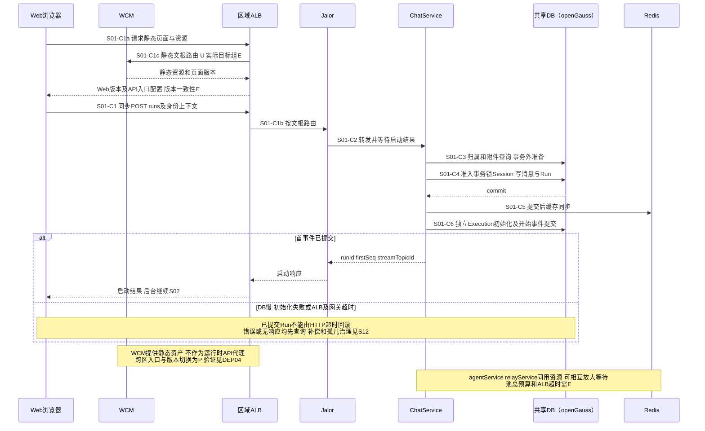
```mermaid
sequenceDiagram
    participant U as Web浏览器
    participant WCM as WCM
    participant L as 区域ALB
    participant G as Jalor
    participant C as ChatService
    participant D as 共享DB（openGauss）
    participant R as Redis
    U->>L: S01-C1a 请求静态页面与资源
    L->>WCM: S01-C1c 静态文根路由 U 实际目标组E
    WCM-->>L: 静态资源和页面版本
    L-->>U: Web版本及API入口配置 版本一致性E
    U->>L: S01-C1 同步POST runs及身份上下文
    L->>G: S01-C1b 按文根路由
    G->>C: S01-C2 转发并等待启动结果
    C->>D: S01-C3 归属和附件查询 事务外准备
    C->>D: S01-C4 准入事务锁Session 写消息与Run
    D-->>C: commit
    C->>R: S01-C5 提交后缓存同步
    C->>D: S01-C6 独立Execution初始化及开始事件提交
    alt 首事件已提交
        C-->>G: runId firstSeq streamTopicId
        G-->>L: 启动响应
        L-->>U: 启动结果 后台继续S02
    else DB慢 初始化失败或ALB及网关超时
        Note over U,D: 已提交Run不能由HTTP超时回滚<br/>错误或无响应均先查询 补偿和孤儿治理见S12
    end
    Note over WCM,L: WCM提供静态资产 不作为运行时API代理<br/>跨区入口与版本切换为P 验证见DEP04
    Note over C,R: agentService relayService同用资源 可相互放大等待<br/>池总预算和ALB超时需E
```

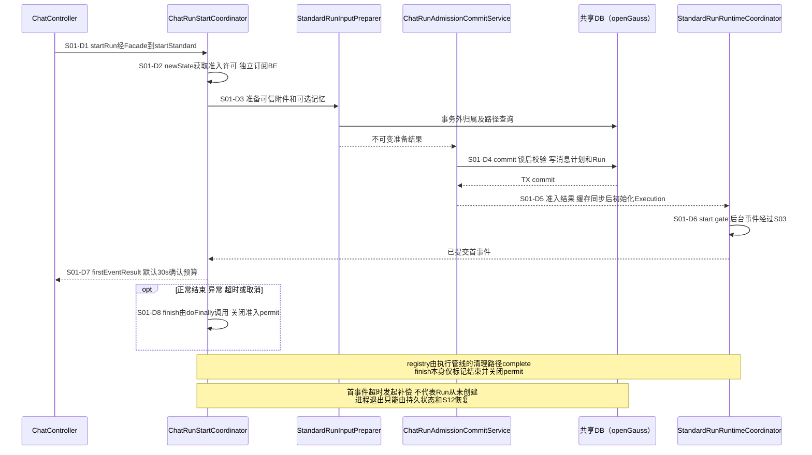
```mermaid
sequenceDiagram
    participant API as ChatController
    participant ST as ChatRunStartCoordinator
    participant PRE as StandardRunInputPreparer
    participant ADM as ChatRunAdmissionCommitService
    participant DB as 共享DB（openGauss）
    participant RT as StandardRunRuntimeCoordinator
    API->>ST: S01-D1 startRun经Facade到startStandard
    ST->>ST: S01-D2 newState获取准入许可 独立订阅BE
    ST->>PRE: S01-D3 准备可信附件和可选记忆
    PRE->>DB: 事务外归属及路径查询
    PRE-->>ADM: 不可变准备结果
    ADM->>DB: S01-D4 commit 锁后校验 写消息计划和Run
    DB-->>ADM: TX commit
    ADM-->>RT: S01-D5 准入结果 缓存同步后初始化Execution
    RT->>RT: S01-D6 start gate 后台事件经过S03
    RT-->>ST: 已提交首事件
    ST-->>API: S01-D7 firstEventResult 默认30s确认预算
    opt 正常结束 异常 超时或取消
        ST->>ST: S01-D8 finish由doFinally调用 关闭准入permit
    end
    Note over ST,RT: registry由执行管线的清理路径complete<br/>finish本身仅标记结束并关闭permit
    Note over ST,DB: 首事件超时发起补偿 不代表Run从未创建<br/>进程退出只能由持久状态和S12恢复
```

| 步骤 | 当前保护与剩余风险 | 加固/验收关注 |
|---|---|---|
| S01-C2/D1-D3 | 身份/归属、速率/租户准入、附件数量检查；准备阶段仍可占许可与DB，R02 | 测网关/身份慢与附件N次点查；统一准入预算 |
| S01-D4-D7 | Session锁和活动Run约束；准入/Execution/开始事件分三次提交，R08/R13 | 分别在commit前后kill；未知结果先查状态，协议级幂等另立任务 |
| S01-D8 | `doFinally`释放本机许可；kill不执行Java清理，R14/R27 | 记录许可与遗留Run，验证治理收口期限 |

源码：[入口startRun L126](../../../src/main/java/com/huawei/it/ex/one/interfaces/chat/ChatController.java#L126)、[startStandard L57](../../../src/main/java/com/huawei/it/ex/one/application/service/chat/ChatRunStartCoordinator.java#L57)、[commit L53](../../../src/main/java/com/huawei/it/ex/one/application/service/chat/ChatRunAdmissionCommitService.java#L53)、[执行编排L94](../../../src/main/java/com/huawei/it/ex/one/application/service/chat/StandardRunRuntimeCoordinator.java#L94)、[正常registry清理L93](../../../src/main/java/com/huawei/it/ex/one/application/service/chat/ChatRunExecutionGateCoordinator.java#L93)。专家路由与交互续跑分别结合[S02](#s02)、[S04](#s04)核对；准入事务和许可边界以以上方法及[资源表](#resources)为准。

### S02 路由选择与下游执行

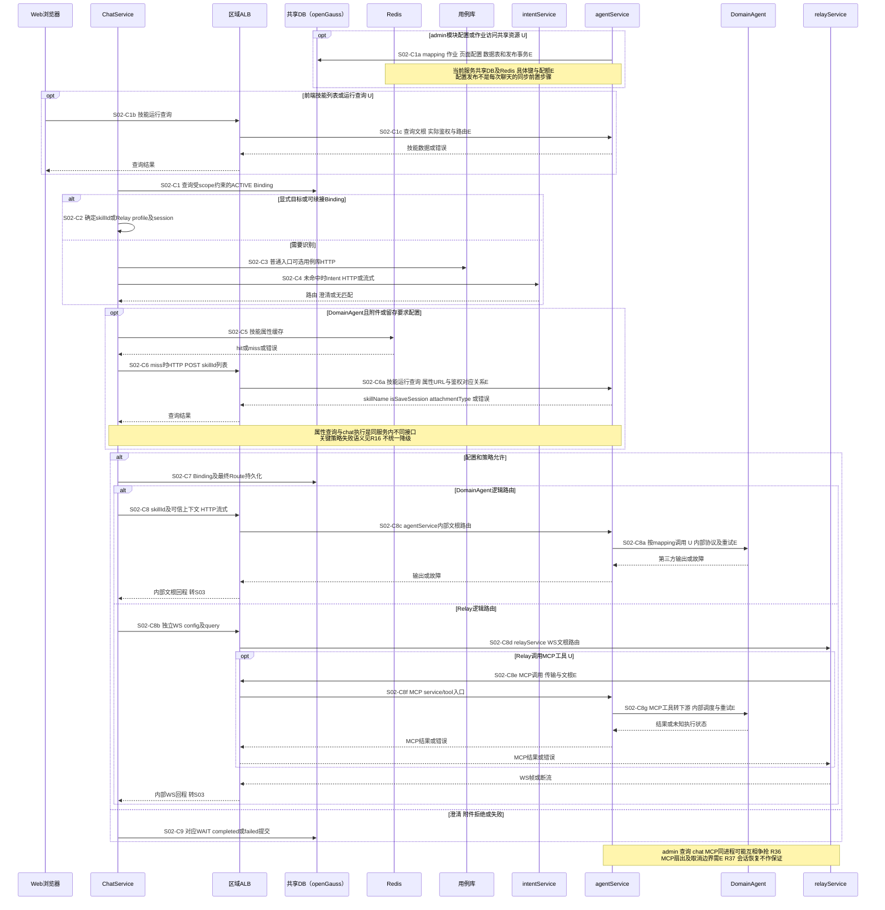
```mermaid
sequenceDiagram
    participant U as Web浏览器
    participant C as ChatService
    participant L as 区域ALB
    participant D as 共享DB（openGauss）
    participant R as Redis
    participant K as 用例库
    participant I as intentService
    participant AG as agentService
    participant DA as DomainAgent
    participant RL as relayService
    opt admin模块配置或作业访问共享资源 U
        AG->>D: S02-C1a mapping 作业 页面配置 数据表和发布事务E
        Note over AG,R: 当前服务共享DB及Redis 具体键与配额E<br/>配置发布不是每次聊天的同步前置步骤
    end
    opt 前端技能列表或运行查询 U
        U->>L: S02-C1b 技能运行查询
        L->>AG: S02-C1c 查询文根 实际鉴权与路由E
        AG-->>L: 技能数据或错误
        L-->>U: 查询结果
    end
    C->>D: S02-C1 查询受scope约束的ACTIVE Binding
    alt 显式目标或可续接Binding
        C->>C: S02-C2 确定skillId或Relay profile及session
    else 需要识别
        C->>K: S02-C3 普通入口可选用例库HTTP
        C->>I: S02-C4 未命中时Intent HTTP或流式
        I-->>C: 路由 澄清或无匹配
    end
    opt DomainAgent且附件或留存要求配置
        C->>R: S02-C5 技能属性缓存
        R-->>C: hit或miss或错误
        C->>L: S02-C6 miss时HTTP POST skillId列表
        L->>AG: S02-C6a 技能运行查询 属性URL与鉴权对应关系E
        AG-->>L: skillName isSaveSession attachmentType 或错误
        L-->>C: 查询结果
        Note over C,AG: 属性查询与chat执行是同服务内不同接口<br/>关键策略失败语义见R16 不统一降级
    end
    alt 配置和策略允许
        C->>D: S02-C7 Binding及最终Route持久化
        alt DomainAgent逻辑路由
            C->>L: S02-C8 skillId及可信上下文 HTTP流式
            L->>AG: S02-C8c agentService内部文根路由
            AG->>DA: S02-C8a 按mapping调用 U 内部协议及重试E
            DA-->>AG: 第三方输出或故障
            AG-->>L: 输出或故障
            L-->>C: 内部文根回程 转S03
        else Relay逻辑路由
            C->>L: S02-C8b 独立WS config及query
            L->>RL: S02-C8d relayService WS文根路由
            opt Relay调用MCP工具 U
                RL->>L: S02-C8e MCP调用 传输与文根E
                L->>AG: S02-C8f MCP service/tool入口
                AG->>DA: S02-C8g MCP工具转下游 内部调度与重试E
                DA-->>AG: 结果或未知执行状态
                AG-->>L: MCP结果或错误
                L-->>RL: MCP结果或错误
            end
            RL-->>L: WS帧或断流
            L-->>C: 内部WS回程 转S03
        end
    else 澄清 附件拒绝或失败
        C->>D: S02-C9 对应WAIT completed或failed提交
    end
    Note over AG,RL: admin 查询 chat MCP同进程可能互相争抢 R36<br/>MCP扇出及取消边界需E R37 会话恢复不作保证
```

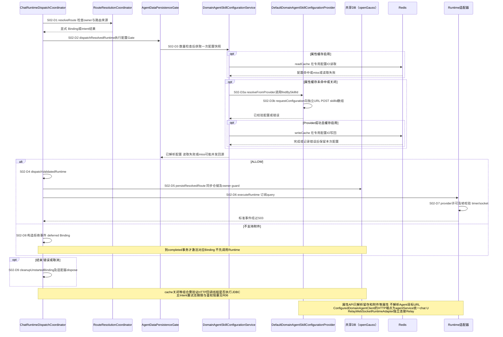
```mermaid
sequenceDiagram
    participant DIS as ChatRuntimeDispatchCoordinator
    participant RES as RouteResolutionCoordinator
    participant GATE as AgentDataPersistenceGate
    participant CFG as DomainAgentSkillConfigurationService
    participant PR as DefaultDomainAgentSkillConfigurationProvider
    participant DB as 共享DB（openGauss）
    participant REDIS as Redis
    participant AD as Runtime适配器
    DIS->>RES: S02-D1 resolveRoute 检查owner与路由来源
    RES-->>DIS: 显式 Binding或Intent结果
    DIS->>GATE: S02-D2 dispatchResolvedRuntime执行配置Gate
    GATE->>CFG: S02-D3 数量检查后获取一次配置快照
    opt 属性缓存启用
        CFG->>REDIS: readCache 在专用配置IO读取
        REDIS-->>CFG: 配置命中或miss或读取失败
    end
    opt 属性缓存未命中或关闭
        CFG->>PR: S02-D3a resolveFromProvider调用findBySkillId
        PR->>PR: S02-D3b requestConfiguration向独立URL POST skillId数组
        PR-->>CFG: 已校验配置或错误
        opt Provider成功且缓存启用
            CFG->>REDIS: writeCache 在专用配置IO写回
            REDIS-->>CFG: 完成或记录错误后保留本次配置
        end
    end
    CFG-->>GATE: 已解析配置 读取失败或miss可能并发回源
    alt ALLOW
        DIS->>DIS: S02-D4 dispatchValidatedRuntime
        DIS->>DB: S02-D5 persistResolvedRoute 同步仓储及owner guard
        DIS->>AD: S02-D6 executeRuntime 订阅query
        AD->>AD: S02-D7 provider许可及帧校验 timer/socket
        AD-->>DIS: 标准事件经过S03
    else 不支持附件
        DIS->>DIS: S02-D8 构造拒绝事件 deferred Binding
        Note over DIS,DB: 到completed事务才激活对应Binding 不先调用Runtime
    end
    opt 结束 错误或取消
        DIS->>DIS: S02-D9 cleanupUnstartedBinding及适配器dispose
    end
    Note over DIS,DB: cache关闭等组合需验证HTTP回调线程是否执行JDBC<br/>主Intent重试总期限与鉴权阻塞见R06
    Note over PR,AD: 属性API只解析留存和附件等属性 不解析Agent目标URL<br/>ConfiguredDomainAgentClient的HTTP端点为agentService统一chat U<br/>RelayWebSocketRuntimeAdapter独立连接Relay
```

| 变体/步骤 | 当前事实与风险 | 加固/验收关注 |
|---|---|---|
| S02-C3/C4/D1 | 显式目标及合法Binding跳过Intent；聚合专家跳过用例库；主Intent仍有重试放大，R06 | 401/429/黑洞/断流；按业务重路由次数与HTTP尝试数分别计量 |
| S02-D2-D5 | 留存/附件共用配置快照；cache miss未single-flight；部分配置回调可能同步JDBC，R16/R02 | cache on/off × 有无附件 × 留存on/off线程与并发矩阵 |
| S02-D6-D9 | 下游许可、单帧和运行期限已有；累计缓冲仍不有界，R01 | 配置服务故障不等同Runtime失败；错误/取消归还socket和许可 |

关键技能查询按用途分级，不能统一降级：

| 查询用途/失败 | 当前Chat语义 S / 外部待验 E | 加固约束 |
|---|---|---|
| 留存策略启用，属性Provider不可用 | `AgentDataPersistenceGate.evaluate`保留错误，不放宽未知留存策略 | 保留失败关闭，不能因切Region或旧缓存把no-store改成FULL |
| 仅附件校验，Provider错误 | 当前告警并跳过类型检查；与空配置/明确不支持的拒绝不同 | 如需收紧为失败关闭，另立兼容任务；不能把现状写成所有配置失败都拒绝 |
| 留存关闭且无附件 | 当前不查属性Provider | 不应把关闭分支计成每Run必需外呼 |
| 前端技能运行查询中的可执行性、权限、目标映射 | 由agentService提供U，具体字段/生效契约E；本仓无法证明前端降级策略 | 关键字段未知时禁止擅自选默认Agent/越权执行；展示字段是否可省略单独确认 |

证据：[Gate分支 L80–127](../../../src/main/java/com/huawei/it/ex/one/application/service/agentdatapersistence/AgentDataPersistenceGate.java#L80)。配置和业务语义验收关联R16/R30/R36；MCP依赖与任务隔离另见R37。

边界源码：[agentService请求skillId L53](../../../src/main/java/com/huawei/it/ex/one/infrastructure/runtime/domainagent/DomainAgentChatRequestMapper.java#L53)、[统一HTTP地址 L66](../../../src/main/java/com/huawei/it/ex/one/infrastructure/runtime/domainagent/ConfiguredDomainAgentClient.java#L66)、[独立技能属性API L60](../../../src/main/java/com/huawei/it/ex/one/infrastructure/domainagentconfig/DefaultDomainAgentSkillConfigurationProvider.java#L60)、[Relay端点 L953](../../../src/main/java/com/huawei/it/ex/one/infrastructure/runtime/relay/RelayWebSocketRuntimeAdapter.java#L953)。

源码：[resolveRoute L176](../../../src/main/java/com/huawei/it/ex/one/application/service/chat/ChatRuntimeDispatchCoordinator.java#L176)、[dispatchResolvedRuntime L204](../../../src/main/java/com/huawei/it/ex/one/application/service/chat/ChatRuntimeDispatchCoordinator.java#L204)、[persistResolvedRoute L304](../../../src/main/java/com/huawei/it/ex/one/application/service/chat/ChatRuntimeDispatchCoordinator.java#L304)、[技能配置L59](../../../src/main/java/com/huawei/it/ex/one/application/service/domainagentconfig/DomainAgentSkillConfigurationService.java#L59)、[Relay query L113](../../../src/main/java/com/huawei/it/ex/one/infrastructure/runtime/relay/RelayWebSocketRuntimeAdapter.java#L113)。出站实现继续核对[Intent流式尝试 L126](../../../src/main/java/com/huawei/it/ex/one/infrastructure/intent/FinEurekaIntentStreamClient.java#L126)和[agentService HTTP query L65](../../../src/main/java/com/huawei/it/ex/one/infrastructure/runtime/domainagent/ConfiguredDomainAgentClient.java#L65)；总期限、鉴权隔离和分类重试的整改范围见[W05](risks.md#w05)，不从主图推断已有统一总预算。

### S03 流式输出、聚合与提交

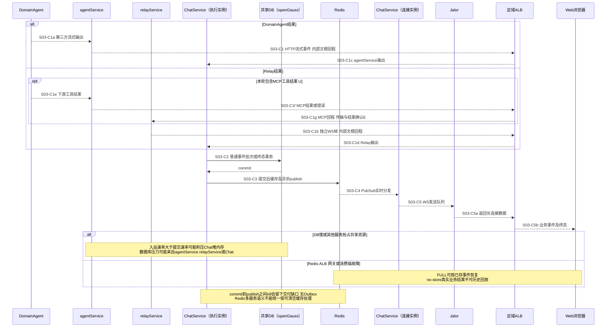
```mermaid
sequenceDiagram
    participant DA as DomainAgent
    participant AG as agentService
    participant RL as relayService
    participant C as ChatService（执行实例）
    participant D as 共享DB（openGauss）
    participant R as Redis
    participant W as ChatService（连接实例）
    participant G as Jalor
    participant L as 区域ALB
    participant U as Web浏览器
    alt DomainAgent结果
        DA-->>AG: S03-C1a 第三方流式输出
        AG-->>L: S03-C1 HTTP流式事件 内部文根回程
        L-->>C: S03-C1c agentService输出
    else Relay结果
        opt 本轮包含MCP工具结果 U
            DA-->>AG: S03-C1e 下游工具结果
            AG-->>L: S03-C1f MCP结果或错误
            L-->>RL: S03-C1g MCP回程 传输与结果确认E
        end
        RL-->>L: S03-C1b 独立WS帧 内部文根回程
        L-->>C: S03-C1d Relay输出
    end
    C->>D: S03-C2 普通事件批次或终态事务
    D-->>C: commit
    C->>R: S03-C3 提交后缓存及异步publish
    R-->>W: S03-C4 PubSub实时分发
    W-->>G: S03-C5 WS发送队列
    G-->>L: S03-C5a 返回长连接数据
    L-->>U: S03-C5b 业务事件及终态
    alt DB慢或其他服务抢占共享资源
        Note over AG,D: 入站速率大于提交速率可能积压Chat堆内存<br/>数据库压力可能来自agentService relayService或Chat
    else Redis ALB 网关或消费端故障
        Note over R,U: FULL可按已存事件恢复<br/>no-store真实业务结果不可历史回放
    end
    Note over C,R: commit到publish之间kill会留下交付缺口 无Outbox<br/>Redis多服务语义不能统一按可清空缓存处理
```

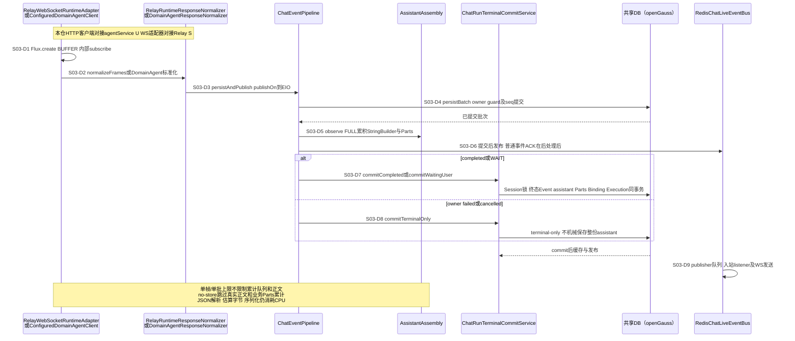
```mermaid
sequenceDiagram
    participant AD as RelayWebSocketRuntimeAdapter<br/>或ConfiguredDomainAgentClient
    participant N as RelayRuntimeResponseNormalizer<br/>或DomainAgentResponseNormalizer
    participant P as ChatEventPipeline
    participant ASM as AssistantAssembly
    participant T as ChatRunTerminalCommitService
    participant DB as 共享DB（openGauss）
    participant B as RedisChatLiveEventBus
    Note over AD,N: 本仓HTTP客户端对接agentService U WS适配器对接Relay S
    AD->>AD: S03-D1 Flux.create BUFFER 内部subscribe
    AD->>N: S03-D2 normalizeFrames或DomainAgent标准化
    N->>P: S03-D3 persistAndPublish publishOn到EIO
    P->>DB: S03-D4 persistBatch owner guard及seq提交
    DB-->>P: 已提交批次
    P->>ASM: S03-D5 observe FULL累积StringBuilder与Parts
    P->>B: S03-D6 提交后发布 普通事件ACK在后处理后
    alt completed或WAIT
        P->>T: S03-D7 commitCompleted或commitWaitingUser
        T->>DB: Session锁 终态Event assistant Parts Binding Execution同事务
    else owner failed或cancelled
        P->>T: S03-D8 commitTerminalOnly
        T->>DB: terminal-only 不机械保存整份assistant
    end
    DB-->>T: commit后缓存与发布
    B->>B: S03-D9 publisher队列 入站listener及WS发送
    Note over AD,ASM: 单帧/单批上限不限制累计队列和正文<br/>no-store跳过真实正文和业务Parts累计<br/>JSON解析 估算字节 序列化仍消耗CPU
```

| 步骤 | 当前保护与风险 | 加固/验收关注 |
|---|---|---|
| S03-D1-D5 | 16条/20ms/256KiB Event批次、Parts批次、单帧上限；BUFFER及全文累计仍可增长，R01/R26 | 双维度事件数/字节预算；高频小帧与长正文分别测heap/GC/CPU |
| S03-D4/D7/D8 | guard、fencing及事务防旧owner写入；慢SQL占EIO和共享池，R02/R07 | 原子终态和批处理开关两态；不可为吞吐删除guard |
| S03-D6/D9 | 发送端有队列；Redis listener未显式有界执行器，R04/R09 | 注入阻塞handler、拒绝信号可观察、FULL补读及no-store缺口统计 |

源码：[Relay BUFFER L234](../../../src/main/java/com/huawei/it/ex/one/infrastructure/runtime/relay/RelayWebSocketRuntimeAdapter.java#L234)、[DomainAgent客户端L185](../../../src/main/java/com/huawei/it/ex/one/infrastructure/runtime/domainagent/ConfiguredDomainAgentClient.java#L185)、[ChatEventPipeline L76](../../../src/main/java/com/huawei/it/ex/one/application/service/chat/ChatEventPipeline.java#L76)、[Assembly字段L27](../../../src/main/java/com/huawei/it/ex/one/application/service/chat/AssistantAssembly.java#L27)、[终态L137](../../../src/main/java/com/huawei/it/ex/one/application/service/chat/ChatRunTerminalCommitService.java#L137)、[Redis listener L86](../../../src/main/java/com/huawei/it/ex/one/infrastructure/persistence/RedisChatLiveEventBus.java#L86)。

### S04 人机交互、拒答与候选切换

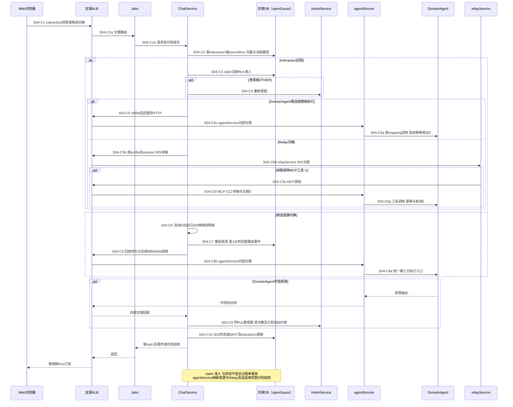
```mermaid
sequenceDiagram
    participant U as Web浏览器
    participant L as 区域ALB
    participant G as Jalor
    participant C as ChatService
    participant D as 共享DB（openGauss）
    participant I as intentService
    participant AG as agentService
    participant DA as DomainAgent
    participant RL as relayService
    U->>L: S04-C1 interaction回答或候选切换
    L->>G: S04-C1a 文根路由
    G->>C: S04-C1b 请求及可信身份
    C->>D: S04-C2 查Interaction或sourceRun 归属与当前路径
    alt Interaction回答
        C->>D: S04-C3 claim及新Run准入
        opt 澄清或OTHER
            C->>I: S04-C4 重新意图
        end
        alt DomainAgent候选或替换执行
            C->>L: S04-C5 skillId及回答经HTTP
            L->>AG: S04-C5c agentService内部文根
            AG->>DA: S04-C5a 按mapping调用 具体幂等保证E
        else Relay问卷
            C->>L: S04-C5b 原profile及session WS续接
            L->>RL: S04-C5d relayService WS文根
            opt 续跑调用MCP工具 U
                RL->>L: S04-C5e MCP调用
                L->>AG: S04-C5f MCP入口 传输与文根E
                AG->>DA: S04-C5g 工具调用 幂等与取消E
            end
        end
    else 候选直接切换
        C->>C: S04-C6 活动A先执行S05两类控制链
        C->>D: S04-C7 重验来源 准入B并回放路由事件
        C->>L: S04-C8 回放持久化后按B的skillId调用
        L->>AG: S04-C8b agentService内部文根
        AG->>DA: S04-C8a 统一第三方执行入口
    end
    opt DomainAgent可信拒答
        DA-->>AG: 拒答输出
        AG-->>L: 可信协议帧
        L-->>C: 内部文根回程
        C->>I: S04-C9 同Run重意图 受次数及已拒目标约束
    end
    C->>D: S04-C10 S03终态或WAIT及Interaction更新
    C-->>G: 新topic及事件或状态拒绝
    G-->>L: 返回
    L-->>U: 使用新Run订阅
    Note over C,D: claim 准入 与终态不是全过程单事务<br/>agentService映射变更与Relay会话连续性需分别验收
```

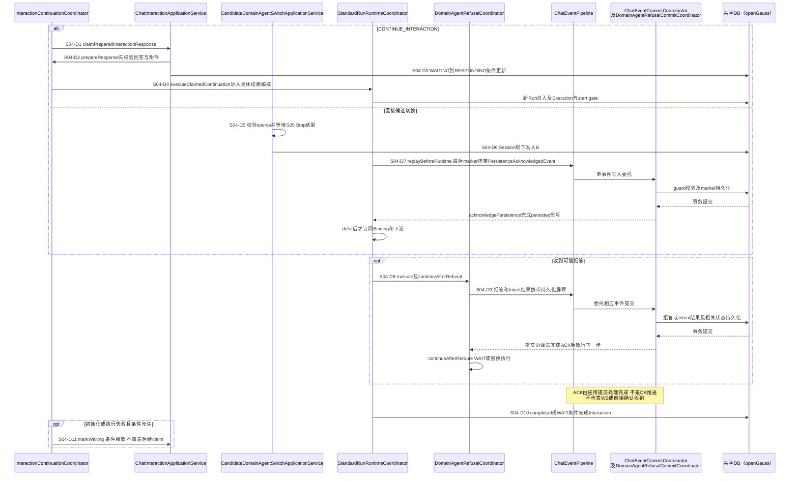
```mermaid
sequenceDiagram
    participant IC as InteractionContinuationCoordinator
    participant IS as ChatInteractionApplicationService
    participant CS as CandidateDomainAgentSwitchApplicationService
    participant RT as StandardRunRuntimeCoordinator
    participant RF as DomainAgentRefusalCoordinator
    participant PIPE as ChatEventPipeline
    participant COM as ChatEventCommitCoordinator<br/>及DomainAgentRefusalCommitCoordinator
    participant DB as 共享DB（openGauss）
    alt CONTINUE_INTERACTION
        IC->>IS: S04-D1 claimPreparedInteractionResponse
        IS->>IC: S04-D2 prepareResponse先校验回答与附件
        IS->>DB: S04-D3 WAITING到RESPONDING条件更新
        IC->>RT: S04-D4 executeClaimedContinuation进入具体续跑编排
        RT->>DB: 新Run准入及Execution与start gate
    else 直接候选切换
        CS->>CS: S04-D5 校验source并等待S05 Stop结果
        CS->>DB: S04-D6 Session锁下准入B
        RT->>PIPE: S04-D7 replayBeforeRuntime 最后marker携带PersistenceAcknowledgedEvent
        PIPE->>COM: 单事件写入委托
        COM->>DB: guard校验及marker持久化
        DB-->>COM: 事务提交
        COM-->>RT: acknowledgePersistence完成persisted信号
        RT->>RT: defer后才订阅Binding和下游
    end
    opt 收到可信拒答
        RT->>RF: S04-D8 execute及continueAfterRefusal
        RF->>PIPE: S04-D9 拒答和Intent结果携带持久化屏障
        PIPE->>COM: 委托相应事件提交
        COM->>DB: 拒答或Intent结果及相关状态持久化
        DB-->>COM: 事务提交
        COM-->>RF: 提交协调器完成ACK后放行下一步
        RF->>RF: continueAfterReroute WAIT或替换执行
    end
    Note over PIPE,COM: ACK由应用提交处理完成 不是DB推送<br/>不代表WS或前端确认收到
    RT->>DB: S04-D10 completed或WAIT条件完成Interaction
    opt 初始化或执行失败且条件允许
        IC->>IS: S04-D11 markWaiting 条件释放 不覆盖后继claim
    end
```

| 变体 | 必须保留的当前语义 | 风险与验证 |
|---|---|---|
| 澄清NEW_TURN / REUSE_ASSISTANT | 前者准入时可ANSWERED，后者completed/WAIT或async挂起事务时ANSWERED；不能统一“失败恢复WAITING” | S04-D3/D10/D11，R07/R13/R14；claim后kill、旧claim释放、新Run竞态 |
| Relay问卷 / DomainAgent拒答 | Relay续接可信profile/session；直接DomainAgent没有通用ask-user续跑状态机 | S04-C5/D8，R01/R05/R06；不根据任意业务文字触发拒答 |
| 候选A→B→C | A停止后B准入可能失败，A不自动恢复；回放≤32条/256KiB；ACK后下游才开始 | S04-D5-D7，R04/R08；STOP_PENDING/STALE_SOURCE及ACK失败不得调用B |
| 切换确认附件不支持 | Binding和route-switch-applied延迟到completed事务；不能预先宣称切换成功 | S04-D10，R07/R16/R21；stop/回滚不留下虚假应用事件 |

源码：[claim编排L122](../../../src/main/java/com/huawei/it/ex/one/application/service/chat/InteractionContinuationCoordinator.java#L122)、[条件释放L162](../../../src/main/java/com/huawei/it/ex/one/application/service/chat/ChatInteractionApplicationService.java#L162)、[候选准入L186](../../../src/main/java/com/huawei/it/ex/one/application/service/chat/ChatRunAdmissionCommitService.java#L186)、[回放屏障L172](../../../src/main/java/com/huawei/it/ex/one/application/service/chat/StandardRunRuntimeCoordinator.java#L172)、[拒答继续L259](../../../src/main/java/com/huawei/it/ex/one/application/service/chat/DomainAgentRefusalCoordinator.java#L259)。具体类型按本节差异表、上述claim/拒答方法及[Interaction状态表](#resources--22-interaction)核对；状态竞态整改见[W07](risks.md#w07)。

### S05 Stop、超时与终态竞争

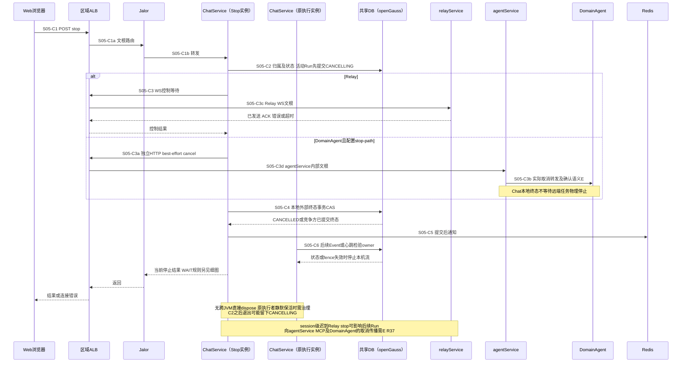
```mermaid
sequenceDiagram
    participant U as Web浏览器
    participant L as 区域ALB
    participant G as Jalor
    participant C as ChatService（Stop实例）
    participant O as ChatService（原执行实例）
    participant D as 共享DB（openGauss）
    participant RL as relayService
    participant AG as agentService
    participant DA as DomainAgent
    participant R as Redis
    U->>L: S05-C1 POST stop
    L->>G: S05-C1a 文根路由
    G->>C: S05-C1b 转发
    C->>D: S05-C2 归属及状态 活动Run先提交CANCELLING
    alt Relay
        C->>L: S05-C3 WS控制等待
        L->>RL: S05-C3c Relay WS文根
        RL-->>L: 已发送 ACK 错误或超时
        L-->>C: 控制结果
    else DomainAgent且配置stop-path
        C->>L: S05-C3a 独立HTTP best-effort cancel
        L->>AG: S05-C3d agentService内部文根
        AG->>DA: S05-C3b 实际取消转发及确认语义E
        Note over AG,DA: Chat本地终态不等待远端任务物理停止
    end
    C->>D: S05-C4 本地外部终态事务CAS
    D-->>C: CANCELLED或竞争方已提交终态
    C->>R: S05-C5 提交后通知
    O->>D: S05-C6 后续Event或心跳检验owner
    D-->>O: 状态或fence失效时停止本机流
    C-->>G: 当前停止结果 WAIT规则另见细图
    G-->>L: 返回
    L-->>U: 结果或连接错误
    Note over C,O: 无跨JVM直接dispose 原执行者静默保活时需治理<br/>C2之后退出可能留下CANCELLING
    Note over C,RL: session级迟到Relay stop可影响后续Run<br/>向agentService MCP及DomainAgent的取消传播需E R37
```

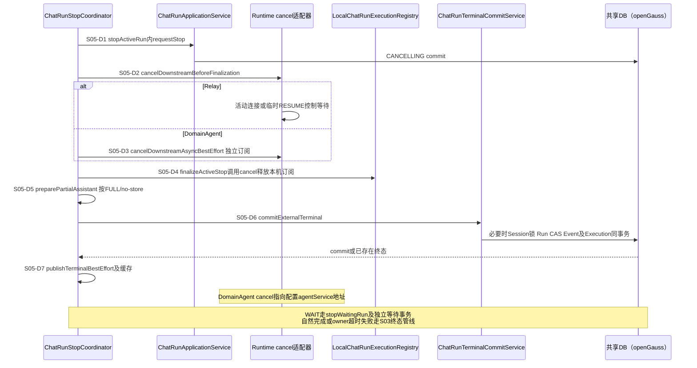
```mermaid
sequenceDiagram
    participant ST as ChatRunStopCoordinator
    participant RUN as ChatRunApplicationService
    participant AD as Runtime cancel适配器
    participant REG as LocalChatRunExecutionRegistry
    participant T as ChatRunTerminalCommitService
    participant DB as 共享DB（openGauss）
    ST->>RUN: S05-D1 stopActiveRun内requestStop
    RUN->>DB: CANCELLING commit
    ST->>AD: S05-D2 cancelDownstreamBeforeFinalization
    alt Relay
        AD->>AD: 活动连接或临时RESUME控制等待
    else DomainAgent
        ST->>AD: S05-D3 cancelDownstreamAsyncBestEffort 独立订阅
    end
    ST->>REG: S05-D4 finalizeActiveStop调用cancel释放本机订阅
    ST->>ST: S05-D5 preparePartialAssistant 按FULL/no-store
    ST->>T: S05-D6 commitExternalTerminal
    T->>DB: 必要时Session锁 Run CAS Event及Execution同事务
    DB-->>ST: commit或已存在终态
    ST->>ST: S05-D7 publishTerminalBestEffort及缓存
    Note over AD: DomainAgent cancel指向配置agentService地址
    Note over ST,DB: WAIT走stopWaitingRun及独立等待事务<br/>自然完成或owner超时失败走S03终态管线
```

| 步骤 | 当前保证边界 | 风险与加固 |
|---|---|---|
| S05-D1到D6 | CANCELLING仍阻止新Run；停止方可在中间退出 | R14：持久取消状态的有界治理；quiet owner持续heartbeat条件必须测 |
| S05-D2/D3 | Relay 5s控制等待可因发送完成结束，临时握手另计；固定专家Stop后保持ACTIVE并续用同runtimeSession；DA cancel可未配置或后台继续 | R05/R06：远端代次隔离及底层取消期限；不能把本地CANCELLED等同远端已停 |
| S05-D6/D7 | 自然完成/Stop/回调只允许终态胜者；提交后发布无可靠确认 | R02/R04：真实DB竞争与commit后kill；无partial时不保证最后屏幕正文已入历史 |

源码：[stopActiveRun L160](../../../src/main/java/com/huawei/it/ex/one/application/service/chat/ChatRunStopCoordinator.java#L160)、[下游控制L358](../../../src/main/java/com/huawei/it/ex/one/application/service/chat/ChatRunStopCoordinator.java#L358)、[external terminal L230](../../../src/main/java/com/huawei/it/ex/one/application/service/chat/ChatRunTerminalCommitService.java#L230)、[Relay interrupt L1380](../../../src/main/java/com/huawei/it/ex/one/infrastructure/runtime/relay/RelayWebSocketRuntimeAdapter.java#L1380)。

### S06 异步挂起与结果回调

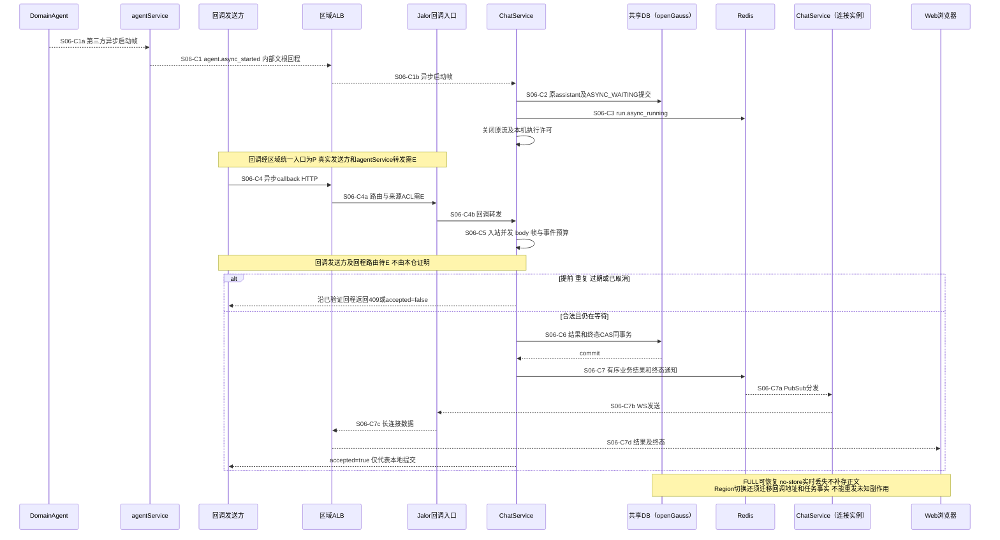
```mermaid
sequenceDiagram
    participant DA as DomainAgent
    participant AG as agentService
    participant CB as 回调发送方
    participant L as 区域ALB
    participant G as Jalor回调入口
    participant C as ChatService
    participant D as 共享DB（openGauss）
    participant R as Redis
    participant W as ChatService（连接实例）
    participant U as Web浏览器
    DA-->>AG: S06-C1a 第三方异步启动帧
    AG-->>L: S06-C1 agent.async_started 内部文根回程
    L-->>C: S06-C1b 异步启动帧
    C->>D: S06-C2 原assistant及ASYNC_WAITING提交
    C->>R: S06-C3 run.async_running
    C->>C: 关闭原流及本机执行许可
    Note over CB,G: 回调经区域统一入口为P 真实发送方和agentService转发需E
    CB->>L: S06-C4 异步callback HTTP
    L->>G: S06-C4a 路由与来源ACL需E
    G->>C: S06-C4b 回调转发
    C->>C: S06-C5 入站并发 body 帧与事件预算
    Note over CB,C: 回调发送方及回程路由待E 不由本仓证明
    alt 提前 重复 过期或已取消
        C-->>CB: 沿已验证回程返回409或accepted=false
    else 合法且仍在等待
        C->>D: S06-C6 结果和终态CAS同事务
        D-->>C: commit
        C->>R: S06-C7 有序业务结果和终态通知
        R-->>W: S06-C7a PubSub分发
        W-->>G: S06-C7b WS发送
        G-->>L: S06-C7c 长连接数据
        L-->>U: S06-C7d 结果及终态
        C-->>CB: accepted=true 仅代表本地提交
    end
    Note over D,U: FULL可恢复 no-store实时丢失不补存正文<br/>Region切换还须迁移回调地址和任务事实 不能重发未知副作用
```

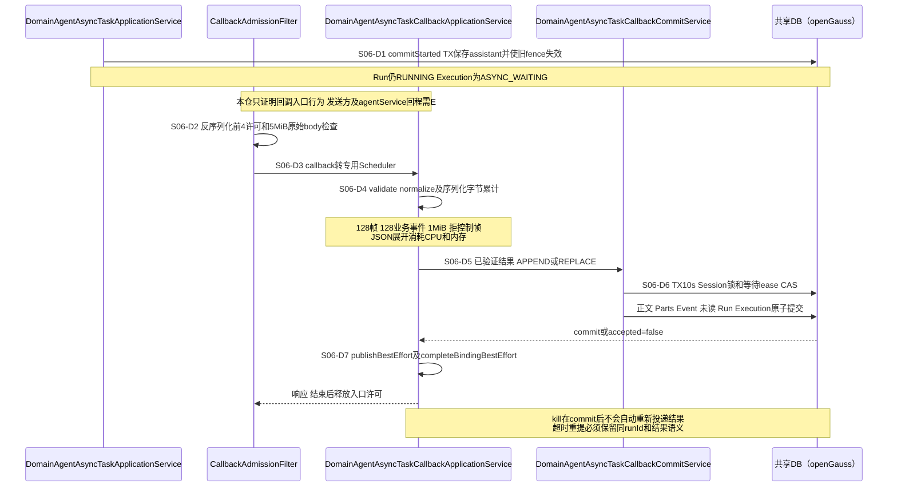
```mermaid
sequenceDiagram
    participant AS as DomainAgentAsyncTaskApplicationService
    participant F as CallbackAdmissionFilter
    participant CB as DomainAgentAsyncTaskCallbackApplicationService
    participant COM as DomainAgentAsyncTaskCallbackCommitService
    participant DB as 共享DB（openGauss）
    AS->>DB: S06-D1 commitStarted TX保存assistant并使旧fence失效
    Note over AS,DB: Run仍RUNNING Execution为ASYNC_WAITING
    Note over F,CB: 本仓只证明回调入口行为 发送方及agentService回程需E
    F->>F: S06-D2 反序列化前4许可和5MiB原始body检查
    F->>CB: S06-D3 callback转专用Scheduler
    CB->>CB: S06-D4 validate normalize及序列化字节累计
    Note over CB: 128帧 128业务事件 1MiB 拒控制帧<br/>JSON展开消耗CPU和内存
    CB->>COM: S06-D5 已验证结果 APPEND或REPLACE
    COM->>DB: S06-D6 TX10s Session锁和等待lease CAS
    COM->>DB: 正文 Parts Event 未读 Run Execution原子提交
    DB-->>CB: commit或accepted=false
    CB->>CB: S06-D7 publishBestEffort及completeBindingBestEffort
    CB-->>F: 响应 结束后释放入口许可
    Note over CB,DB: kill在commit后不会自动重新投递结果<br/>超时重提必须保留同runId和结果语义
```

| 变体/步骤 | 当前保护 | 风险与验证 |
|---|---|---|
| S06-D1 | 默认异步关闭；开启后默认24h lease；原流结束释放执行许可 | R02/R13：挂起总量无独立配额；到期积压与正常治理争资源 |
| S06-D2-D4 | 入站原始body与标准化事件分层限额；提前409和Retry-After，busy429 | R26：深层/高展开JSON、临界body、许可释放；逻辑小结果不代表原始解析成本小 |
| S06-D5-D7 | 并发终态CAS；纯终态帧不会REPLACE清空正文；FAILED可携带部分结果 | R04/R09：APPEND精确拼接、REPLACE只删本Run旧Parts；回调响应丢失与重复回调 |

源码：[挂起commitStarted L60](../../../src/main/java/com/huawei/it/ex/one/application/service/chat/DomainAgentAsyncTaskApplicationService.java#L60)、[callback L84](../../../src/main/java/com/huawei/it/ex/one/application/service/chat/DomainAgentAsyncTaskCallbackApplicationService.java#L84)、[normalize L177](../../../src/main/java/com/huawei/it/ex/one/application/service/chat/DomainAgentAsyncTaskCallbackApplicationService.java#L177)、[提交后发布L316](../../../src/main/java/com/huawei/it/ex/one/application/service/chat/DomainAgentAsyncTaskCallbackApplicationService.java#L316)。S06-D2和S06-D6分别对应[doFilterInternal L85](../../../src/main/java/com/huawei/it/ex/one/interfaces/chat/DomainAgentAsyncTaskCallbackAdmissionFilter.java#L85)和[commit L64](../../../src/main/java/com/huawei/it/ex/one/application/service/chat/DomainAgentAsyncTaskCallbackCommitService.java#L64)；图中未展开的分支以方法实现和[Run/Execution状态表](#resources--21-run和execution分开核对)核对。

### S07 连接、补读与恢复风暴

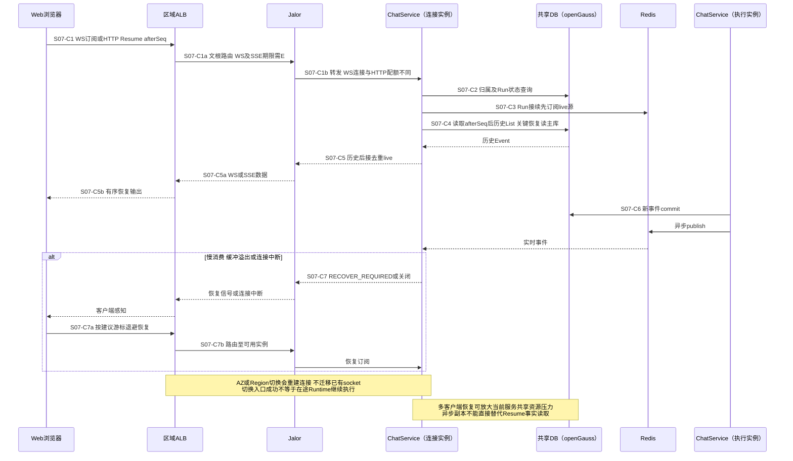
```mermaid
sequenceDiagram
    participant U as Web浏览器
    participant L as 区域ALB
    participant G as Jalor
    participant C as ChatService（连接实例）
    participant D as 共享DB（openGauss）
    participant R as Redis
    participant O as ChatService（执行实例）
    U->>L: S07-C1 WS订阅或HTTP Resume afterSeq
    L->>G: S07-C1a 文根路由 WS及SSE期限需E
    G->>C: S07-C1b 转发 WS连接与HTTP配额不同
    C->>D: S07-C2 归属及Run状态查询
    C->>R: S07-C3 Run接续先订阅live源
    C->>D: S07-C4 读取afterSeq后历史List 关键恢复读主库
    D-->>C: 历史Event
    C-->>G: S07-C5 历史后接去重live
    G-->>L: S07-C5a WS或SSE数据
    L-->>U: S07-C5b 有序恢复输出
    O->>D: S07-C6 新事件commit
    O->>R: 异步publish
    R-->>C: 实时事件
    alt 慢消费 缓冲溢出或连接中断
        C-->>G: S07-C7 RECOVER_REQUIRED或关闭
        G-->>L: 恢复信号或连接中断
        L-->>U: 客户端感知
        U->>L: S07-C7a 按建议游标退避恢复
        L->>G: S07-C7b 路由至可用实例
        G->>C: 恢复订阅
    end
    Note over L,C: AZ或Region切换会重建连接 不迁移已有socket<br/>切换入口成功不等于在途Runtime继续执行
    Note over C,D: 多客户端恢复可放大当前服务共享资源压力<br/>异步副本不能直接替代Resume事实读取
```

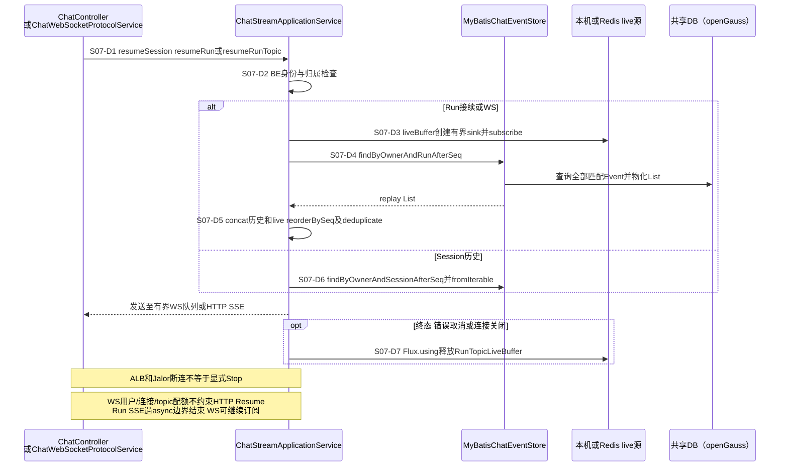
```mermaid
sequenceDiagram
    participant API as ChatController<br/>或ChatWebSocketProtocolService
    participant S as ChatStreamApplicationService
    participant STORE as MyBatisChatEventStore
    participant LIVE as 本机或Redis live源
    participant DB as 共享DB（openGauss）
    API->>S: S07-D1 resumeSession resumeRun或resumeRunTopic
    S->>S: S07-D2 BE身份与归属检查
    alt Run接续或WS
        S->>LIVE: S07-D3 liveBuffer创建有界sink并subscribe
        S->>STORE: S07-D4 findByOwnerAndRunAfterSeq
        STORE->>DB: 查询全部匹配Event并物化List
        STORE-->>S: replay List
        S->>S: S07-D5 concat历史和live reorderBySeq及deduplicate
    else Session历史
        S->>STORE: S07-D6 findByOwnerAndSessionAfterSeq并fromIterable
    end
    S-->>API: 发送至有界WS队列或HTTP SSE
    opt 终态 错误取消或连接关闭
        S->>LIVE: S07-D7 Flux.using释放RunTopicLiveBuffer
    end
    Note over API,S: ALB和Jalor断连不等于显式Stop
    Note over API,S: WS用户/连接/topic配额不约束HTTP Resume<br/>Run SSE遇async边界结束 WS可继续订阅
```

| 步骤 | 当前保护与缺口 | 加固/验收关注 |
|---|---|---|
| S07-D2 | owner校验已有；Resume/WS未统一拒绝已删除Session，R17 | 统一可访问状态语义，删除后新订阅与已有订阅分别测 |
| S07-D3-D6 | live有界、保序去重；历史List无分页、HTTP无独立恢复配额，R03/R02/R09 | 游标分页、恢复许可、live衔接无重无漏；正常Run和Stop混合压测 |
| S07-C7/D5 | 服务端可给较小recoveryAfterSeq；sequence为全局游标而非topic连续号，R20 | 联调样例与生产前端分开验；不使用本地最大seq跳过迟到事件 |

源码：[resumeSession L251](../../../src/main/java/com/huawei/it/ex/one/application/service/chat/ChatStreamApplicationService.java#L251)、[resumeRunTopic L298](../../../src/main/java/com/huawei/it/ex/one/application/service/chat/ChatStreamApplicationService.java#L298)、[liveBuffer L350](../../../src/main/java/com/huawei/it/ex/one/application/service/chat/ChatStreamApplicationService.java#L350)、[Run live tail L429](../../../src/main/java/com/huawei/it/ex/one/application/service/chat/ChatStreamApplicationService.java#L429)。

### S08 会话、历史与管理

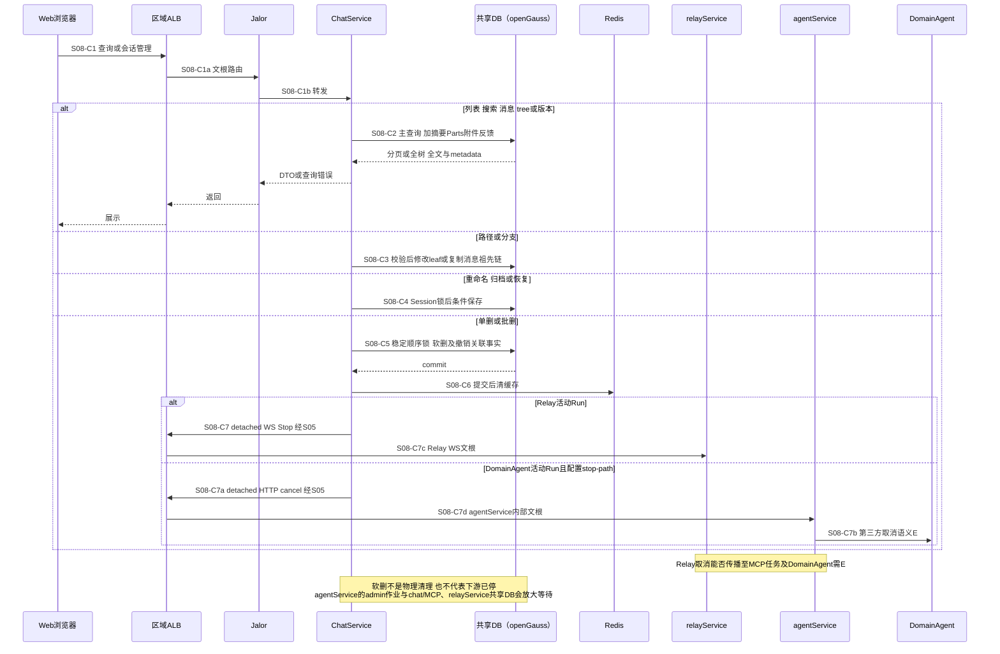
```mermaid
sequenceDiagram
    participant U as Web浏览器
    participant L as 区域ALB
    participant G as Jalor
    participant C as ChatService
    participant D as 共享DB（openGauss）
    participant R as Redis
    participant RL as relayService
    participant AG as agentService
    participant DA as DomainAgent
    U->>L: S08-C1 查询或会话管理
    L->>G: S08-C1a 文根路由
    G->>C: S08-C1b 转发
    alt 列表 搜索 消息 tree或版本
        C->>D: S08-C2 主查询 加摘要Parts附件反馈
        D-->>C: 分页或全树 全文与metadata
        C-->>G: DTO或查询错误
        G-->>L: 返回
        L-->>U: 展示
    else 路径或分支
        C->>D: S08-C3 校验后修改leaf或复制消息祖先链
    else 重命名 归档或恢复
        C->>D: S08-C4 Session锁后条件保存
    else 单删或批删
        C->>D: S08-C5 稳定顺序锁 软删及撤销关联事实
        D-->>C: commit
        C->>R: S08-C6 提交后清缓存
        alt Relay活动Run
            C->>L: S08-C7 detached WS Stop 经S05
            L->>RL: S08-C7c Relay WS文根
        else DomainAgent活动Run且配置stop-path
            C->>L: S08-C7a detached HTTP cancel 经S05
            L->>AG: S08-C7d agentService内部文根
            AG->>DA: S08-C7b 第三方取消语义E
        end
    end
    Note over RL,AG: Relay取消能否传播至MCP任务及DomainAgent需E
    Note over C,D: 软删不是物理清理 也不代表下游已停<br/>agentService的admin作业与chat/MCP、relayService共享DB会放大等待
```

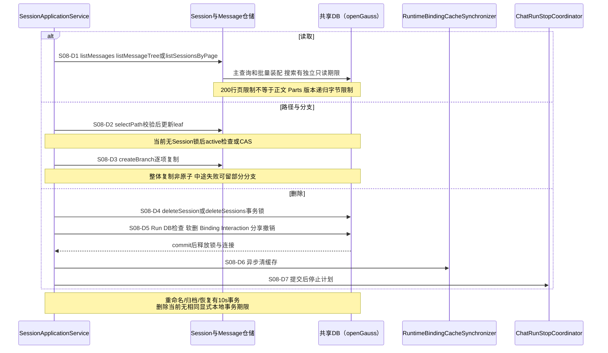
```mermaid
sequenceDiagram
    participant S as SessionApplicationService
    participant REPO as Session与Message仓储
    participant DB as 共享DB（openGauss）
    participant CACHE as RuntimeBindingCacheSynchronizer
    participant STOP as ChatRunStopCoordinator
    alt 读取
        S->>REPO: S08-D1 listMessages listMessageTree或listSessionsByPage
        REPO->>DB: 主查询和批量装配 搜索有独立只读期限
        Note over REPO,DB: 200行页限制不等于正文 Parts 版本递归字节限制
    else 路径与分支
        S->>REPO: S08-D2 selectPath校验后更新leaf
        Note over S,DB: 当前无Session锁后active检查或CAS
        S->>REPO: S08-D3 createBranch逐项复制
        Note over S,DB: 整体复制非原子 中途失败可留部分分支
    else 删除
        S->>DB: S08-D4 deleteSession或deleteSessions事务锁
        S->>DB: S08-D5 Run DB检查 软删 Binding Interaction 分享撤销
        DB-->>S: commit后释放锁与连接
        S->>CACHE: S08-D6 异步清缓存
        S->>STOP: S08-D7 提交后停止计划
    end
    Note over S,DB: 重命名/归档/恢复有10s事务<br/>删除当前无相同显式本地事务期限
```

| 步骤 | 风险 | 加固/验收关注 |
|---|---|---|
| S08-D1 | R02/R11/R15/R26；ILIKE、全tree、版本递归、大metadata、手工索引 | EXPLAIN真实数据、行/字节/时间预算；索引有效性及混合负载 |
| S08-D2/D3 | R18/R24；路径与运行中终态竞争、分支部分成功 | 明确运行中切路径语义；Session锁后重验/原子复制策略，故障点逐项注入 |
| S08-D4-D7 | R07已有部分修复不能重列；剩余R23锁等待、R14调度丢失、R18并发share | 反向批次、外部持锁、delete与准入/分享并发；commit后kill；不宣称删除已物理停止Runtime |

源码：[查询L216](../../../src/main/java/com/huawei/it/ex/one/application/service/chat/SessionApplicationService.java#L216)、[删除L401](../../../src/main/java/com/huawei/it/ex/one/application/service/chat/SessionApplicationService.java#L401)、[selectPath L836](../../../src/main/java/com/huawei/it/ex/one/application/service/chat/SessionApplicationService.java#L836)、[createBranch L848](../../../src/main/java/com/huawei/it/ex/one/application/service/chat/SessionApplicationService.java#L848)、[消息查询SQL L402](../../../src/main/resources/mapper/memory/ChatMessageMapper.opengauss.xml#L402)。

### S09 文档与附件生命周期

```mermaid
sequenceDiagram
    participant U as Web浏览器
    participant L as 区域ALB
    participant G as Jalor
    participant C as ChatService
    participant S as local卷或OBS或API Store
    participant D as 共享DB（openGauss）
    U->>L: S09-C1 multipart上传
    L->>G: S09-C1a 文根路由及请求体限制E
    G->>C: S09-C1b 转发 临时文件与期限需联合核对
    C->>S: S09-C2 存储写入 provider互斥选择
    S-->>C: objectKey或providerDocument
    C->>D: S09-C3 登记AVAILABLE记录
    C-->>G: documentId
    G-->>L: 返回
    L-->>U: 上传结果
    U->>L: S09-C4 状态 列表 preview或download
    L->>G: S09-C4a 文根路由
    G->>C: S09-C4b 转发下载请求
    C->>D: 归属及状态查询
    C->>S: S09-C5 获取内容流
    S-->>C: 存储流
    C-->>G: S09-C5a 后端持续下载
    G-->>L: S09-C5b 慢客户端与长连接期限E
    L-->>U: S09-C5c 文件内容
    U->>L: S09-C6 PATCH或DELETE
    L->>G: S09-C6a 文根路由
    G->>C: S09-C6b 更新转发
    C->>D: metadata更新或软删
    Note over C,S: 存储成功但登记失败可遗留对象<br/>ADS本地盘非跨AZ或Region存储保证 对象复制与地址切换需E
```

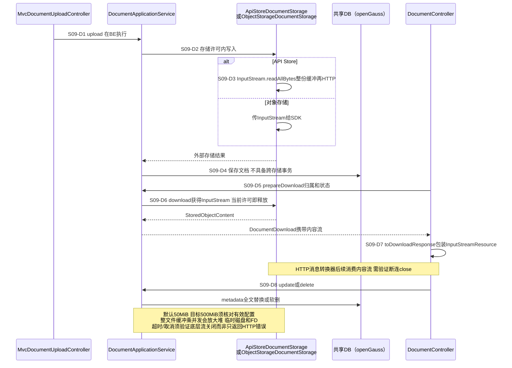
```mermaid
sequenceDiagram
    participant MVC as MvcDocumentUploadController
    participant DOC as DocumentApplicationService
    participant STORE as ApiStoreDocumentStorage<br/>或ObjectStorageDocumentStorage
    participant DB as 共享DB（openGauss）
    participant API as DocumentController
    MVC->>DOC: S09-D1 upload 在BE执行
    DOC->>STORE: S09-D2 存储许可内写入
    alt API Store
        STORE->>STORE: S09-D3 InputStream.readAllBytes整份缓冲再HTTP
    else 对象存储
        STORE->>STORE: 传InputStream给SDK
    end
    STORE-->>DOC: 外部存储结果
    DOC->>DB: S09-D4 保存文档 不具备跨存储事务
    API->>DOC: S09-D5 prepareDownload归属和状态
    DOC->>STORE: S09-D6 download获得InputStream 当前许可即释放
    STORE-->>DOC: StoredObjectContent
    DOC-->>API: DocumentDownload携带内容流
    API->>API: S09-D7 toDownloadResponse包装InputStreamResource
    Note over API,STORE: HTTP消息转换器后续消费内容流 需验证断连close
    API->>DOC: S09-D8 update或delete
    DOC->>DB: metadata全文替换或软删
    Note over DOC,STORE: 默认50MiB 目标500MiB须核对有效配置<br/>整文件缓冲乘并发会放大堆 临时磁盘和FD<br/>超时/取消须验证底层流关闭而非只返回HTTP错误
```

| 步骤 | 当前保护与风险 | 加固/验收关注 |
|---|---|---|
| S09-D2-D4 | 仓库默认单文件50MB/请求60MB；500MiB工作负载会被默认入口拒绝，若生产已放宽则API整份缓冲风险同步放大；跨存储无原子回滚，R12 | 核对ALB/Jalor/Servlet/存储各跳大小与期限；按500MiB×并发预算堆和临时盘，采用在途字节许可、流式/临时文件及孤儿对账 |
| S09-D5-D7 | 后端归属校验，preview为后端下载；许可未覆盖完整下载，R12 | 慢客户端与cancel下stream/FD/SDK连接归还；磁盘满 |
| S09-D8 | PATCH可替换服务端providerDocument，R21；OBS当前未显式启用证书及hostname验证，R22 | metadata白名单及可信字段；受信/不受信CA与错hostname验收 |

源码：[upload L74](../../../src/main/java/com/huawei/it/ex/one/application/service/document/DocumentApplicationService.java#L74)、[update L110](../../../src/main/java/com/huawei/it/ex/one/application/service/document/DocumentApplicationService.java#L110)、[prepareDownload L169](../../../src/main/java/com/huawei/it/ex/one/application/service/document/DocumentApplicationService.java#L169)、[API Store缓冲L206](../../../src/main/java/com/huawei/it/ex/one/infrastructure/storage/api/ApiStoreDocumentStorage.java#L206)、[后端下载L192](../../../src/main/java/com/huawei/it/ex/one/interfaces/document/DocumentController.java#L192)、[OBS配置L28](../../../src/main/java/com/huawei/it/ex/one/infrastructure/storage/object/s3/HuaweiS3StorageConfiguration.java#L28)。

### S10 分享、投递与反馈

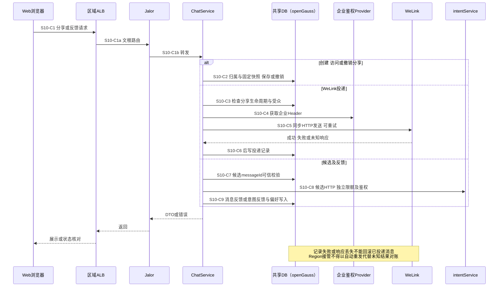
```mermaid
sequenceDiagram
    participant U as Web浏览器
    participant L as 区域ALB
    participant G as Jalor
    participant C as ChatService
    participant D as 共享DB（openGauss）
    participant H as 企业鉴权Provider
    participant W as WeLink
    participant I as intentService
    U->>L: S10-C1 分享或反馈请求
    L->>G: S10-C1a 文根路由
    G->>C: S10-C1b 转发
    alt 创建 访问或撤销分享
        C->>D: S10-C2 归属与固定快照 保存或撤销
    else WeLink投递
        C->>D: S10-C3 检查分享生命周期与受众
        C->>H: S10-C4 获取企业Header
        C->>W: S10-C5 同步HTTP发送 可重试
        W-->>C: 成功 失败或未知响应
        C->>D: S10-C6 后写投递记录
    else 候选及反馈
        C->>D: S10-C7 候选messageId可信校验
        C->>I: S10-C8 候选HTTP 独立限额及鉴权
        C->>D: S10-C9 消息反馈或意图反馈与偏好写入
    end
    C-->>G: DTO或错误
    G-->>L: 返回
    L-->>U: 展示或状态核对
    Note over D,W: 记录失败或响应丢失不能回滚已投递消息<br/>Region接管不得以自动重发代替未知结果对账
```

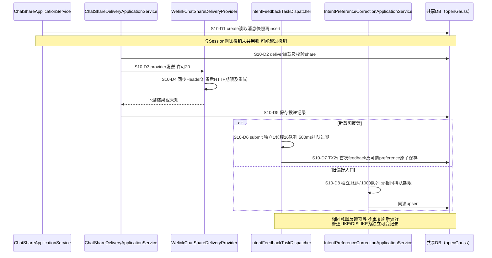
```mermaid
sequenceDiagram
    participant SHARE as ChatShareApplicationService
    participant DEL as ChatShareDeliveryApplicationService
    participant W as WelinkChatShareDeliveryProvider
    participant FB as IntentFeedbackTaskDispatcher
    participant PREF as IntentPreferenceCorrectionApplicationService
    participant DB as 共享DB（openGauss）
    SHARE->>DB: S10-D1 create读取消息快照再insert
    Note over SHARE,DB: 与Session删除撤销未共用锁 可能越过撤销
    DEL->>DB: S10-D2 deliver加载及校验share
    DEL->>W: S10-D3 provider发送 许可20
    W->>W: S10-D4 同步Header准备后HTTP期限及重试
    W-->>DEL: 下游结果或未知
    DEL->>DB: S10-D5 保存投递记录
    alt 新意图反馈
        FB->>FB: S10-D6 submit 独立1线程16队列 500ms排队过期
        FB->>DB: S10-D7 TX2s 首次feedback及可选preference原子保存
    else 旧偏好入口
        PREF->>PREF: S10-D8 独立1线程1000队列 无相同排队期限
        PREF->>DB: 同源upsert
    end
    Note over FB,DB: 相同意图反馈幂等 不重复刷新偏好<br/>普通LIKE/DISLIKE为独立可变记录
```

| 步骤 | 当前保护与风险 | 加固/验收关注 |
|---|---|---|
| S10-D1 | 选中快照有消息数/字节上限；分享创建与删除竞态，R08/R18 | 同Session锁后重验；快照上限、权限、过期和撤销；不把撤销当召回WeLink消息 |
| S10-D3-D5 | provider许可及单次HTTP期限；鉴权在期限外，响应未知可重复投递，R06/R19 | deliveryId/下游去重或UNKNOWN对账需协议任务；发送成功记录失败必须测 |
| S10-D6-D8 | 新反馈保护已存在；旧旁路不能套用同样期限，R02/R10 | worker阻塞但队列未满、迟到任务、SQL底层超时；反馈幂等不可推导NEXT幂等 |

源码：[share create L62](../../../src/main/java/com/huawei/it/ex/one/application/service/share/ChatShareApplicationService.java#L62)、[deliver L65](../../../src/main/java/com/huawei/it/ex/one/application/service/share/ChatShareDeliveryApplicationService.java#L65)、[WeLink L62](../../../src/main/java/com/huawei/it/ex/one/infrastructure/share/WelinkChatShareDeliveryProvider.java#L62)、[反馈调度L50](../../../src/main/java/com/huawei/it/ex/one/application/service/routing/IntentFeedbackTaskDispatcher.java#L50)、[旧偏好L85](../../../src/main/java/com/huawei/it/ex/one/application/service/routing/IntentPreferenceCorrectionApplicationService.java#L85)。

### S11 可选记忆、标题与记录旁路

```mermaid
sequenceDiagram
    participant C as ChatService
    participant L as 区域ALB（内部文根）
    participant D as 共享DB（openGauss）
    participant R as Redis
    participant T as 标题HTTP Provider
    participant I as intentService
    participant AG as agentService
    participant DA as DomainAgent
    participant RL as relayService
    opt 短期记忆启用
        C->>R: S11-C1 读短期记忆缓存
        C->>D: S11-C2 miss查询路径及历史
        C->>C: S11-C3 构建受预算的历史上下文
        alt Intent调用
            C->>I: S11-C3a 随识别请求传递约定历史
        else DomainAgent调用
            C->>L: S11-C3b skillId及上下文
            L->>AG: S11-C3e agentService内部文根
            AG->>DA: S11-C3c 实际第三方请求 U 内部处理E
        else Relay调用
            C->>L: S11-C3d WS请求上下文
            L->>RL: S11-C3f relayService WS文根
            opt Relay调用MCP工具 U
                RL->>L: S11-C3g MCP调用
                L->>AG: S11-C3h MCP入口 传输与文根E
                AG->>DA: S11-C3i 工具执行 配额重试与取消E
            end
        end
    end
    opt RouteMemory或Intent记录启用
        C->>D: S11-C4 独立旁路读取或异步写入
    end
    opt 标题启用且满足条件
        C->>D: S11-C5 准入后异步查询标题候选
        C->>T: S11-C6 取许可后生成标题HTTP
        T-->>C: 标题或错误
        C->>D: S11-C7 锁后校验人工标题及版本再提交
    end
    Note over C,R: 关闭分支无对应IO 失败开放不代表底层已取消<br/>旁路预算还须计入agentService relayService共享资源总量
```

```mermaid
sequenceDiagram
    participant MEM as RunMemoryContextAssembler及MemoryApplicationService
    participant TTL as SessionTitleApplicationService
    participant PROVIDER as SessionTitleProvider
    participant COM as SessionTitleCommitService
    participant DB as 共享DB（openGauss）
    participant REDIS as Redis
    MEM->>MEM: S11-D1 assemble到loadForRun
    opt 短期记忆启用且需要读取路径
        opt 缓存启用
            MEM->>REDIS: LayeredChatMessageRepository读取最近消息缓存
            REDIS-->>MEM: 命中或miss或无效路径或读取失败
        end
        opt 缓存未命中或禁用 且允许DB回源
            MEM->>DB: MyBatisChatMessageStore.findRecentMessages
            DB-->>MEM: 路径消息或读取失败后空上下文
            opt DB读取成功且缓存启用
                MEM->>REDIS: replaceSessionMessages 回填或清除旧key
            end
        end
    end
    MEM->>MEM: S11-D2 token与消息裁剪 序列化计算预算
    TTL->>TTL: S11-D3 schedule独立订阅 专用4线程及队列
    TTL->>DB: S11-D4 collectCandidate 查询Session 完整轻量路径及关联Run
    TTL->>TTL: S11-D5 generateTitle才获取8许可
    TTL->>PROVIDER: S11-D6 generate 有HTTP或应用timeout
    PROVIDER-->>TTL: 生成文本
    TTL->>COM: S11-D7 generateAndCommit调度apply
    COM->>DB: S11-D8 TX2s锁Session校验ACTIVE 人工标题和nodeOrder
    DB-->>TTL: applied或skipped
    Note over TTL,DB: 前置Q和提交排队不由生成许可/HTTP期限覆盖<br/>进程退出可能丢标题任务 无可靠补跑承诺
```

| 配置变体/步骤 | 当前事实与风险 | 加固/验收关注 |
|---|---|---|
| 全部关闭 | 按具体配置短路；标题、短期历史、Intent记录各有独立开关 | 关闭态验证零对应外呼，不用启用路径风险描述默认必现故障 |
| S11-D1/D2及RouteMemory | 读取失败开放与有界队列不等于JDBC可取消，R10/R26 | 缓存miss热点、长路径、预算序列化CPU、后台线程/连接残留 |
| S11-D3-D8 | 标题有生成许可及条件提交；候选Q/排队缺完整预算，R25/R02 | 慢候选查询、阻塞token、提交锁三处分别注入；人工改名及旧结果不得覆盖 |

源码：[标题schedule L84](../../../src/main/java/com/huawei/it/ex/one/application/service/chat/SessionTitleApplicationService.java#L84)、[generateAndCommit L110](../../../src/main/java/com/huawei/it/ex/one/application/service/chat/SessionTitleApplicationService.java#L110)、[collectCandidate L164](../../../src/main/java/com/huawei/it/ex/one/application/service/chat/SessionTitleApplicationService.java#L164)、[标题apply L27](../../../src/main/java/com/huawei/it/ex/one/application/service/chat/SessionTitleCommitService.java#L27)。其他旁路的源码入口：[RouteMemory读取 L86](../../../src/main/java/com/huawei/it/ex/one/application/service/memory/RouteMemoryApplicationService.java#L86)、[读写执行器 L19](../../../src/main/java/com/huawei/it/ex/one/application/config/RouteMemoryExecutorConfiguration.java#L19)、[偏好独立执行器 L17](../../../src/main/java/com/huawei/it/ex/one/application/config/IntentPreferenceExecutorConfiguration.java#L17)、[Intent记录recordAsync L68](../../../src/main/java/com/huawei/it/ex/one/application/service/routing/IntentRecognitionRecordService.java#L68)及[记录执行器 L21](../../../src/main/java/com/huawei/it/ex/one/application/config/IntentRecordExecutorConfiguration.java#L21)。这些方法未在标题细图中逐项展开；旁路隔离整改见[W08](risks.md#w08)，默认App exclusion provider为本地配置，不能把它画成已有远程依赖。

### S12 心跳、Watchdog、缓存与部署

```mermaid
sequenceDiagram
    participant P as ADS
    participant L as 区域ALB
    participant G as Jalor
    participant O as ChatService（原实例）
    participant N as ChatService（其他实例）
    participant SVC as agentService及relayService
    participant D as 共享DB（openGauss）
    participant R as Redis
    P->>L: S12-C1 发布摘流或异常移除 P 编排需E
    L->>G: S12-C1a 路由健康实例 P 文根及探针验收E
    O->>D: S12-C2 周期heartbeat owner及fence条件续租
    N->>D: S12-C3 Watchdog扫描过期和孤儿
    opt 其他服务并发负载 U
        SVC->>D: S12-C3a 配置 作业或业务访问 具体SQL和配额E
        SVC->>R: S12-C3b 共享Redis访问 具体状态语义E
    end
    alt lease有效
        D-->>N: 不允许普通过期接管
    else lease到期或满足治理条件
        N->>D: S12-C4 CAS claim及恢复策略终态提交
        N->>R: S12-C5 提交后缓存与终态通知
    end
    P->>O: S12-C6 正常退出或故障kill 处置顺序E
    Note over O,N: 已返回runId的后台任务不能只靠HTTP drain<br/>默认恢复不承诺Runtime无损接管
    opt DB或Redis切换
        N->>D: S12-C7 重建连接后的守卫查询
        N->>R: 重新订阅及客户端受控补读
    end
    opt 主备Region切换 P 详见DEP05与DEP06
        P->>D: S12-C7a 隔离旧写端 验证复制边界和单写权威
        P->>L: S12-C7b 验证依赖后开放目标区域流量
        Note over P,R: 切换能力和AZ分布需平台E<br/>DB fence只在同一权威数据库有效 不能跨独立双写库互斥
    end
```

```mermaid
sequenceDiagram
    participant L as ChatRunLeaseApplicationService
    participant W as ChatRunWatchdogScheduler
    participant REC as ChatRunRecoveryOrchestrator
    participant REPO as ChatRunExecutionRepository
    participant DB as 共享DB（openGauss）
    participant REG as LocalChatRunExecutionRegistry
    participant LIFE as Spring资源关闭回调
    L->>REG: S12-D1 heartbeatActiveRuns采集当前claims
    L->>DB: S12-D2 renewHeartbeatBatch 默认50条TX2s
    alt 明确失权
        L->>REG: S12-D3 取消对应本机订阅
    else DB异常
        L->>L: 告警等待后续心跳或Event guard
    end
    W->>W: S12-D4 scanExpiredRuns single-flight及jitter
    W->>REC: S12-D5 operational scheduler同步recoverExpiredRuns
    REC->>DB: S12-D6 Interaction对账 初始化孤儿 async过期
    REC->>REPO: S12-D7 过期候选扫描 claim及recoverCandidates
    REPO->>DB: 条件更新fence与lease
    REC->>DB: S12-D8 策略终态或恢复事实提交
    Note over W,DB: 4恢复许可和20每轮不覆盖所有分支<br/>scan/claim无独立SQL预算可能卡single-flight
    opt 容器退出
        LIFE->>LIFE: S12-D9 scheduler shutdown及Redis listener stop
        Note over REG,LIFE: ADS AZ或Region切换属于部署编排 不是此类的方法
        Note over REG,LIFE: Registry无全量drain回调 后台Run排空未实现<br/>kill无清理回调 依赖持久lease及下一轮治理
    end
```

| 步骤 | 当前保证与缺口 | 加固/验收关注 |
|---|---|---|
| S12-D1-D3 | 心跳默认15s/普通lease90s；DB异常不立即dispose | R02/R14：持续DB故障、恢复后旧owner写入与静默CANCELLING |
| S12-D4-D8 | single-flight、jitter、部分恢复许可已有；所有治理分支未共享完整尝试/时间预算，R13 | 锁住scan/claim后下一轮可继续；孤儿/async积压与正常Run并发 |
| S12-C1/C6/C7/D9 | 部分scheduler/listener有关闭回调，Registry无显式全量drain；不能证明生产摘流/探针/后台排空有效，R27 | 分别验证rolling、kill、DB/Redis切换、配置/证书变更；采集实际RTO及任务收口时间 |
| S12-C5 | 派生缓存与PubSub均在提交后，不是可靠补发机制 | R04/R09/R15：恢复事件缺口与索引部署、DDL有效性、数据维护窗口 |

源码：[heartbeatActiveRuns L147](../../../src/main/java/com/huawei/it/ex/one/application/service/chat/ChatRunLeaseApplicationService.java#L147)、[scanExpiredRuns L55](../../../src/main/java/com/huawei/it/ex/one/application/service/chat/ChatRunWatchdogScheduler.java#L55)、[recoverExpiredRuns L116](../../../src/main/java/com/huawei/it/ex/one/application/service/chat/ChatRunRecoveryOrchestrator.java#L116)、[recoverCandidates L318](../../../src/main/java/com/huawei/it/ex/one/application/service/chat/ChatRunRecoveryOrchestrator.java#L318)。未提供的生产控制面操作不属于已验证代码保证。

### 跨场景资源与五类退出检查

统一使用本页[资源生命周期与状态表](#resources)及其五类退出检查，避免另维护摘要表。配置默认值以[application.yml](../../../src/main/resources/application.yml)和各配置类核对，生产值还需核对环境覆盖；只返回504、429或取消信号不足以证明底层资源释放，仍需实际配置和测试证据。

### 图审查与后续取证规则

1. 每组变体至少有正常、慢、失败、取消和kill检查；不存在的分支记“不适用”并给出代码依据，不能默认“通过”。
2. 每个风险必须能回指图步骤；每个加固测试必须同时断言业务结果与资源回落，尤其是错误已返回而后台仍运行的情况。
3. FULL验证已提交事件的保序、去重和恢复；no-store分别统计控制事实恢复与真实业务结果丢失，不新增正文持久化冒充修复。
4. 生产网关、真实鉴权resolver、DB/Redis拓扑、前端恢复、Relay代次顺序、存储证书与实例资源参数仍需环境证据。本文源码复核不替代这些联合演练。
5. 本文没有执行故障注入，也不把既有验证报告的本地结果改写为本基线的实验结论；测试和演练的关闭证据由闭环矩阵逐项登记。

## 资源生命周期与状态转换核对

基线：`8f48d6cc084be91bcbaad90be43dac7181636cb4`，2026-09-21。与[双层时序图](#flows)、[风险登记](risks.md#risk-register)一起使用。本表描述现状；“验收要求”是整改完成条件，不能解读为已经有保护。

证据标记沿用：S=本仓源码，U=用户确认架构，P=尚未实施的目标，E=平台/联合验证。用户确认Web经区域ALB静态文根取得WCM资源，API经区域ALB按文根路由到Jalor及Chat；Chat经agentService的统一chat接口调用第三方DomainAgent，独立WS调用自部署Relay，并调用intentService。admin模块管理mapping、作业和页面；agentService、relayService和ChatService均为ADS上的Docker服务，共享DB和Redis（U）。服务间HTTP/WS也经同区域ALB内部文根（U），具体路径/目标组/有效URL属于E。其具体表、键、连接配额、跨AZ副本及Region复制机制仍需E。

区内跨AZ、跨Region主备以及WCM/ADS容灾是P，执行入口见[DEP01–DEP06](deployment.md)。下文将共享平台资源与Chat进程资源分开列示，不能把单个Chat实例的池、fence、缓存或生命周期保护推及当前服务整个部署。

### 1. 资源获取、持有和释放

| 资源/作用域 | 获取和持有 | 正常/异常/超时/取消的释放 | 进程退出残留、缺口及验收要求 |
|---|---|---|---|
| 用户速率窗口、本机租户Semaphore | `RunAdmissionControlService.acquire`在后台启动前；先记用户速率再取租户许可；默认60次/分钟、200流/租户 | `ChatRunStartCoordinator.finish`在`doFinally`关闭`RunPermitGuard`，原子防重复释放；不是HTTP返回时释放 | 本地许可随进程消失，DB仍可能RUNNING；userWindows定期清理，tenantSemaphores无对应淘汰，需测租户高基数长期占用。R02/R26 |
| 下游执行许可/本机 | `WorkloadConcurrencyLimiter`在订阅时tryAcquire；Relay与DomainAgent各自64 | `doFinally`释放，流结束/取消/WAIT/async边界均结束本次持有 | 不包括独立Stop临时连接，不代表挂起任务总量；需验证超时后socket、timer、引用也释放。R01/R05 |
| Hikari连接/Chat实例内共享 S | Chat业务、查询、事件、回调、心跳、Watchdog借用同一池，默认10；借用超时500ms。agentService与relayService及其他Chat实例另有连接消费，池配置E | 事务或数据库访问结束后归还；事务超时不等同所有阻塞Java代码可中断 | 连接断开后数据库回滚/锁释放依赖DB/驱动检测；事务内Redis、afterCommit回调都可能延长占用。全库预算须涵盖当前服务。R02/R07/R23/R28 |
| Relay入站事件与出站队列/连接 | `RelayWebSocketRuntimeAdapter`桥接Flux、接收JSON及内部发送sink | socket/订阅终止触发清理；当前BUFFER并不提供累计字节上限 | kill后堆消失但远端任务未必停止；单帧上限不保护总回答/排队内存。R01/R05/R26 |
| DomainAgent帧/Run正文与Parts | 网络分片拼装、normalizer、assembly、batch；单帧有上限；FULL在Assembly累计正文/Parts，placeholder/no-store跳过真实正文和业务Parts累计 | 流结束及上下文释放后对象可回收；FULL终态前可能保持累计正文/结构化内容，no-store仍有帧、标准化和队列分配 | 异常路径须验证释放；即使单帧有界，长时间输出仍可能放大堆和序列化CPU。R01/R26 |
| Event IO Scheduler/实例 | 显式boundedElastic，默认16平台线程、每backing thread队列参数10000 | 任务执行/取消后释放位置；排队本身仍持上下文 | 大队列不等于无积压；进程退出丢失未提交任务，已提交事实可查。不能将队列容量当可承载Run数。R01/R02/R04 |
| Chat Redis发布/接收任务 S | 发布executor及topic队列有界；listener未显式注入执行器，库默认平台线程无限并发；其他服务也访问共享Redis U | topic/连接清理释放本机状态；发布失败可提示恢复，no-store业务事件不能补回 | Pub/Sub非可靠存储；入站线程数缺口独立于发布队列。其他服务的Redis持久语义E，不能推定可全局flush后无损恢复。R04/R09/R29 |
| WS连接/发送缓冲 | 本机每用户8、每连接8topic、每topic128订阅；Servlet发送队列256条/2MiB | 关闭/错误/超限时清理注册表、订阅及队列；发送超时须验证真实socket | 无全实例连接总预算；kill后客户端重连形成恢复压力。共享连接队列不是每topic各2MiB。R03/R09/R20 |
| Resume回放/live衔接 | 查询持久化历史List，同时维护有界live缓冲与去重窗口 | 有限历史发送结束，或Run终态/WAIT/async/客户端取消结束订阅 | HTTP Resume不受WS注册表限额；需独立准入、分页和字节/时间预算，验证取消时无漏清理。R03 |
| 文档上传临时文件/byte[] | MVC/Reactive适配临时落盘；API Store读取整文件byte[]；存储操作默认32许可 | 上传资源按try/finally清理；存储成功与元数据提交是两阶段 | 上传成功DB失败可能留孤儿对象，kill可能留临时文件；默认50MiB下32份原始数组约1.56GiB；若放宽到500MiB，32份约15.63GiB，均未计复制/框架对象。500MiB不是当前配置已允许或已压测通过。R12 |
| 文档下载流/FD/存储连接 | 获取InputStream时受存储许可保护；返回`InputStreamResource`后继续传输 | MVC输出转换器关闭流；构造响应异常显式close；真实断连须测试 | 现有permit在取得流后即释放，不能限制全部在途慢下载。R12 |
| 反馈/偏好/RouteMemory任务 | 反馈专用1worker+16队列/500ms；旧偏好和RouteMemory各有独立池 | 反馈等待过期不执行；已开始DB事务按自身期限；旧队列的超时语义需分别核对 | caller timeout不能证明JDBC停止；kill丢失本机待办，不能作为可靠补偿。R10 |
| 标题完整任务 | 候选读DB→生成许可8→标题HTTP→独立提交TX2s；功能默认关闭 | 生成Publisher结束释放8许可；前后阶段不在该许可范围 | 候选/提交排队仍争用DB及Session锁；kill后无可靠补跑承诺。R25 |
| 心跳、扫描guard与恢复许可 | 共享调度池；心跳15s，lease90s；Watchdog扫描30s并有抖动；recover4/takeover1 | scan guard在finally复位，恢复许可按执行结束归还 | 若底层SQL长期不返回，finally尚未执行，后续扫描被guard跳过；期限必须覆盖整轮各分支。R13/R14 |

证据入口（配置取值受环境覆盖影响）：[准入](../../../src/main/java/com/huawei/it/ex/one/application/service/chat/RunAdmissionControlService.java#L55)、[启动和许可guard](../../../src/main/java/com/huawei/it/ex/one/application/service/chat/ChatRunStartCoordinator.java#L55)、[下游许可](../../../src/main/java/com/huawei/it/ex/one/application/service/runtime/WorkloadConcurrencyLimiter.java#L60)、[事件流水线](../../../src/main/java/com/huawei/it/ex/one/application/service/chat/ChatEventPipeline.java#L75)、[下载流](../../../src/main/java/com/huawei/it/ex/one/interfaces/document/DocumentController.java#L180)、[Watchdog guard](../../../src/main/java/com/huawei/it/ex/one/application/service/chat/ChatRunWatchdogScheduler.java#L58)、[运行配置](../../../src/main/java/com/huawei/it/ex/one/application/config/ChatRunOperationalProperties.java#L20)、[应用默认配置](../../../src/main/resources/application.yml)。

上述数量限制多数为本机作用域；多实例可分别消耗，同租户粘性和负载倾斜会导致单实例先耗尽。任何资源验收都要同时观察堆、native/direct、线程、FD、连接、锁及租约余量，不以一个指标下降证明全部释放。

#### 1.1 当前服务的职责、共享资源与证据边界

| 服务/组件 | 已确认职责与本仓边界 | 必须补齐的资源/状态事实 E | 故障传播与目标 P |
|---|---|---|---|
| ChatService U/S | Run/Execution、事件、消息、Interaction、Binding与恢复；实例内池和准入见上表 | ADS每实例CPU/内存/FD、数据库实际连接及长连接数、有效开关、实例/AZ分布 | 对自身限额负责，但不能替其他服务保留DB/Redis容量；治理和控制请求必须在共享资源故障时可按预算收口，R28/R29/R33 |
| agentService一体部署 U | 同一物理服务承载admin管理、技能运行查询、统一chat与MCP service/tool；chat及MCP分别接受Chat和relayService调用并执行DomainAgent | 模块间线程/队列/池是否隔离、查询与执行配额、MCP扇出/重试、mapping版本、外部结果查询与Stop语义；本仓只含Chat客户端 | admin/查询可能拖慢chat/MCP，反向也成立；Chat的64许可不是agentService或MCP总配额。目标拆分仍需配额/合同，R30/R36/R37 |
| relayService U | 自部署WS Runtime，Chat以profile/runtimeSessionId续接；工具执行可经agentService的MCP入口 | 会话状态位于DB/Redis/内存的比例、Redis是否承载任务、跨实例续接、远端停止代次、第三方或模型依赖、资源配额 | Chat换实例不等于Relay会话被迁移；跨AZ/Region恢复需独立证据，现阶段不承诺Runtime可靠接管，R05/R29/R34/R35 |
| agentService的admin模块 U，同一进程 | 配置mapping、作业和页面，访问同一DB/Redis；不是当前独立adminService | 表/键归属、作业选主与重复执行保护、批处理连接/锁预算、配置发布/回滚/版本确认、写缓存策略 | 管理作业与大批发布可能挤占业务/治理资源；目标为有界发布、作业隔离、配置版本兼容，R28/R29/R30 |
| agentService技能运行查询 U；Chat属性客户端 S | 前端与Chat均查询技能；Chat独立URL请求skillName/isSaveSession/attachmentType，同次快照决定留存/附件策略 | 前端API、Chat配置URL、字段和鉴权对应关系；关键/展示字段分类、缓存更新与跨区版本同步 | 关键配置不可统一降级；页面展示可否省略须业务确认。查询接口与chat/MCP执行mapping不等同，R16/R30/R36 |
| intentService与DomainAgent U | Intent决定路由；DomainAgent经agentService执行；本仓不包含第三方内部保护 | 各Region出口白名单、鉴权、配额、会话与回调地址、可用区/地域相关限制 | 当前服务和DB恢复不代表第三方可调用；故障与恢复同时核对外部副作用，R06/R30/R35 |

边界证据：[统一agentService请求的可信skillId](../../../src/main/java/com/huawei/it/ex/one/infrastructure/runtime/domainagent/DomainAgentChatRequestMapper.java#L53)、[HTTP执行端点](../../../src/main/java/com/huawei/it/ex/one/infrastructure/runtime/domainagent/ConfiguredDomainAgentClient.java#L66)、[Relay独立WS订阅](../../../src/main/java/com/huawei/it/ex/one/infrastructure/runtime/relay/RelayWebSocketRuntimeAdapter.java#L234)、[属性API请求](../../../src/main/java/com/huawei/it/ex/one/infrastructure/domainagentconfig/DefaultDomainAgentSkillConfigurationProvider.java#L60)。agentService各模块、relayService及MCP内部实现不由这些Chat客户端源码证明；未来拆分见[DEP01目标图](deployment.md#dep01)。

#### 1.2 平台资源生命周期与容灾验证

| 资源/作用域 | 已知持有关系 U/S | 目标及必须验证的切换语义 P/E | 风险/用例及部署场景 |
|---|---|---|---|
| 共享DB/区域写权威 | 当前服务共享资源U；Chat用事务、唯一约束和owner/fence保护事实S | 当前服务连接总预算及关键事务余量；跨AZ故障切换前后只有一个写权威。跨Region异步复制若丢已提交事实须按实测RPO报告，先隔离旧写端再开放新端；关键控制、权限与Resume读不能机械路由异步副本 | R28/T28；DEP02/DEP03/DEP05 |
| 共享Redis/缓存及其他服务状态 | Chat缓存与Pub/Sub S；agentService与relayService用途E | 逐服务键/状态清单和容量预算；先验证哪些可重建、哪些必须迁移。切换后受控回源、重新订阅，FULL补读；no-store结果不能靠Redis切换补出 | R29/T29；DEP02/DEP03/DEP05 |
| WCM静态资产与页面配置 | Web加载静态资源U；admin模块负责页面配置U，两者发布联动机制E | 目标按版本发布完整资产并保留可回退版本；跨Region切换验证HTML、资源、API入口及前后端协议一致。发布源故障与已有版本访问分别演练；WCM不代理业务API | R31/T31；DEP01/DEP04 |
| 区域ALB/Jalor路由及长连接 | 文根路由到Jalor、再到业务服务U；Chat同时有HTTP、SSE和WS S | 验证每文根、TLS、首字节/idle/总期限、请求体、健康检查、摘流与重连。故障或切换会断开已有socket，不承诺连接搬迁；禁止因响应未知盲重试Run或副作用请求 | R32/T32；DEP01/DEP02/DEP05/DEP06 |
| ADS上的Docker实例与宿主故障域 | 当前服务容器部署U；Chat有部分scheduler/listener关闭回调S | 验证平台跨AZ放置、重启与伸缩、镜像/配置/密钥/卷的恢复来源；有序限制准入和摘流是待落地P。不能假定ADS等同已配置反亲和、自动容灾或持久卷复制 | R33/T33；DEP02/DEP03 |
| 单AZ剩余容量 | 实际副本/AZ分布E | 目标是当前服务与入口跨AZ可用，共享依赖也能承受AZ损失；容量包含故障恢复、Pub/Sub重连、缓存回源和治理负载。admin模块作业先验证单次执行语义，不能直接多副本重复调度 | R34/T34；DEP02 |
| 主备Region的整套业务单元 | 当前只有instanceId、DB owner/fence；没有Region所有权协议S | 主备目标包含WCM/ALB/Jalor、ADS上的ChatService/relayService/当前agentService、DB/Redis、对象及配置、第三方网络/回调；服务拆分后按DEP01目标集合重新核对。接管和回切分别验证旧写端隔离、复制边界与依赖就绪；写权威不可同时开放，后台任务按可恢复/失败/未知结果分流 | R35/T35；DEP03/DEP05/DEP06 |

WCM、ALB、ADS及底层数据库/Redis故障切换能力都必须取得平台E，图中部署为U不等于容灾已通过。共享数据库和Redis的拓扑、备份、复制及数据保留须按当前服务共同职责验收，不能仅凭Chat FULL历史可恢复就宣称整套系统RPO为0。

### 2. 状态转换及一致性要求

#### 2.1 Run和Execution分开核对

公开Run枚举只有`RUNNING/CANCELLING/CANCELLED/COMPLETED/WAITING_USER/FAILED`。`ASYNC_WAITING/RECOVERING`属于Execution，不能作为新的公开Run状态。见[Run枚举](../../../src/main/java/com/huawei/it/ex/one/domain/chat/ChatRunStatus.java#L13)、[Execution枚举](../../../src/main/java/com/huawei/it/ex/one/domain/chat/ChatRunExecutionStatus.java#L14)。

| 触发 | Run事实变化 | Execution/其他事实 | 必须核对的边界 |
|---|---|---|---|
| 标准准入 | 新建RUNNING并关联消息 | Execution随后独立初始化owner/fencing；run.started随后持久化 | 准入与Execution不是一个大事务；初始化前崩溃由orphan治理处理，不能宣称无窗口 |
| 正常事件 | 保持RUNNING，推进sequence | guarded append核对Run及owner/fencing | 迟到owner不能写入；no-store业务事件与持久化控制事件分开 |
| 正常完成 | RUNNING→COMPLETED | Execution闭合，FULL正文/Parts和终态按提交路径落库 | DB完成不等于前端消费；发布失败后FULL可补读 |
| 等待交互 | RUNNING→WAITING_USER | Execution→WAITING_USER，创建Interaction WAITING | 对当前Run属于终态，不继续追加业务事件；后续创建新Run |
| 交互续跑 | 原Run保持WAITING_USER，新Run为RUNNING | 对Interaction claim并绑定continueRunId | 不是把旧Run改回RUNNING；重复回答不得创建多个有效续跑 |
| async_started | Run保持RUNNING | Execution→ASYNC_WAITING，释放本机执行流/owner，保存异步期限 | 仍占会话active唯一约束；本机执行许可已经释放 |
| 合法异步回调 | RUNNING→COMPLETED或FAILED | CAS异步等待/有效期/终态；FULL结果和终态同事务 | 提前回调可重试409，重复/过期不得覆盖终态；no-store实时业务结果不可恢复 |
| 用户Stop | RUNNING→CANCELLING→CANCELLED | 本机取消＋远端best-effort取消＋终态提交 | CANCELLING仍占active约束；本地成功不保证远端已停；失败窗口由治理补偿 |
| 执行异常/超时 | RUNNING→FAILED（合法owner/外部终态路径） | Execution闭合，记录可解释错误 | 已失权者不能再自行写失败终态，必须由合法执行者收口 |
| lease过期 | Run不因时钟到期自动改变 | DB条件claim后进入RECOVERING，再执行恢复策略 | 默认策略不承诺无损重跑；已完成/取消Run不得被复活 |

数据库active唯一约束只覆盖RUNNING/CANCELLING，WAITING_USER由Interaction准入保护。会话已删除、权限不符、绑定过期等限制不能只靠上述唯一索引实现。

证据：[启动Run](../../../src/main/java/com/huawei/it/ex/one/application/service/chat/ChatRunLeaseApplicationService.java#L71)、[心跳批量续租](../../../src/main/java/com/huawei/it/ex/one/application/service/chat/ChatRunLeaseApplicationService.java#L146)、[终态提交](../../../src/main/java/com/huawei/it/ex/one/application/service/chat/ChatRunTerminalCommitService.java)、[回调提交](../../../src/main/java/com/huawei/it/ex/one/application/service/chat/DomainAgentAsyncTaskCallbackCommitService.java#L63)、[恢复编排](../../../src/main/java/com/huawei/it/ex/one/application/service/chat/ChatRunRecoveryOrchestrator.java#L116)、[Mapper更新栅栏](../../../src/main/resources/mapper/persistence/ChatRunMapper.opengauss.xml#L100)。

#### 2.2 Interaction

| 转换 | 条件与提交边界 | 验收 |
|---|---|---|
| 创建→WAITING | 当前Run产生澄清/候选/问卷等待 | 等待内容与终态对应，不能先确认后丢失事实 |
| WAITING→RESPONDING | 归属、答案、附件校验后条件claim，写continueRunId | 同interaction并发提交最多一个claim成功，不能只依赖之前查到WAITING |
| RESPONDING→ANSWERED | 普通澄清在答案/新消息/续跑准入事务中消费；复用消息型在完成/WAIT或async挂起提交中消费 | 不能统一假设下游成功才消费；已受理的普通澄清不重开，避免重复答案；async路径见[commitStarted](../../../src/main/java/com/huawei/it/ex/one/application/service/chat/DomainAgentAsyncTaskApplicationService.java#L93) |
| RESPONDING→WAITING | 可重开分支的失败补偿匹配continueRunId；tracked Relay问卷还检查出站派发阶段及Binding恢复结果 | Relay响应进outbound前失败且Binding恢复成功才可重试；恢复失败不可重开。其他复用消息型失败可markWaiting，不能据此推定其下游副作用已撤销或幂等 |
| WAITING/RESPONDING→CANCELLED | Stop、删除、不可恢复会话等对应路径 | 迟到旧Run不得解除新的claim；出站已发送后失败不自动重放 |
| WAITING→EXPIRED | 配置有效期且读取/准入检查发现过期 | 前端倒计时与数据库过期不是同一机制；默认前端代选/忽略不等于后端定时提交 |

证据：[claim与校验](../../../src/main/java/com/huawei/it/ex/one/application/service/chat/ChatInteractionApplicationService.java#L117)、[孤立claim核对](../../../src/main/java/com/huawei/it/ex/one/application/service/chat/ChatInteractionApplicationService.java#L196)、[Interaction枚举](../../../src/main/java/com/huawei/it/ex/one/domain/chat/ChatInteractionStatus.java#L10)。结合[S04交互分支与方法索引](#s04)、[S06异步挂起](#s06)核对各转换触发条件。

#### 2.3 RuntimeBinding

| 转换/状态 | 当前含义 | 风险与验证重点 |
|---|---|---|
| 新建/续接→ACTIVE | DB中的当前路由，Redis是可重建缓存 | cache命中仍须符合当前状态/配置范围；缓存异常不得替代DB事实 |
| ACTIVE→ACTIVE（完成） | DomainAgent及所有Relay Domain Expert正常完成，保持后续续接 | 按Intent、固定、聚合专家来源分别验证，不能套用旧版仅固定专家规则 |
| ACTIVE→RESUMABLE（完成） | Relay Delegate完成释放自动路由，保留实际session供再次选中时恢复 | RESUMABLE不是findActive当前路由；错误路由可能重用旧上下文 |
| RESUMABLE→ACTIVE | 路由再次选中匹配Runtime/profile并满足复用条件 | 检查provider、专家范围、session可用性，不只比较sessionId |
| ACTIVE/RESUMABLE→CANCELLED | 各自适用的显式切换、WAIT取消、删除、过期或不可恢复路径 | 普通活动Run的Stop不统一取消Binding，固定专家和DomainAgent可保留；条件更新防止旧Run取消新绑定，Relay远端session级Stop另需代次保证 |

证据：[绑定解析](../../../src/main/java/com/huawei/it/ex/one/application/service/runtime/RuntimeBindingApplicationService.java#L129)、[完成后生命周期](../../../src/main/java/com/huawei/it/ex/one/application/service/runtime/RuntimeBindingApplicationService.java#L587)、[Binding枚举](../../../src/main/java/com/huawei/it/ex/one/domain/runtime/RuntimeBindingStatus.java#L10)。TTL默认0表示业务绑定不超时；Redis TTL只是热缓存过期，不能用作业务超时清理保证。

#### 2.4 AZ/Region切换不能替代业务状态转换

本节为部署目标P的约束，不增加当前公开状态或声称已有地域状态机。

| 状态事实 | 当前边界 S | 接管/回切必须满足的条件 P/E |
|---|---|---|
| Run/Execution owner及fence | DB内条件更新和唯一约束约束同一权威事实源；只有实例ID，无Region租约/epoch | 同一数据库的跨AZ切换要验证旧连接失效和新写权威；两个独立异步复制写库可能各自通过guard，必须在部署层隔离旧写端，不能以相同代码fence证明双写安全。回切在强制停写后取得或证明最终提交位点并追平，排空前水位不能作为最终屏障 |
| Binding及runtimeSessionId | 保存provider/profile与下游session引用，不保存下游进程内上下文，也不带区域路由字段 | agentService或Relay切地址后须证明旧session可访问且属于正确业务；仅复制Binding行不足。不能为恢复悄悄替换会话或重执行未知副作用；能力不足时按既定失败/人工确认策略收口 |
| Interaction WAITING/RESPONDING | claim依赖DB原子条件及continueRunId | 控制与权限判断读当前权威；切换后先对账悬挂claim，再放开续跑。不得让双Region各自接受同一等待的不同回答 |
| Async等待与回调 | 本机许可已释放，DB保存等待期限，回调竞争同一终态 | 迁移/校验回调入口、来源ACL、agentService转发及DNS缓存；重复回调仍只在唯一权威DB竞争。已外部完成但本地事实不明的任务先对账，不因换区自动重发 |
| FULL/no-store与实时序列 | FULL恢复已存事实；no-store仅存控制和占位。Pub/Sub没有持久交付承诺 | 以目标库实际恢复点定义可恢复范围，检查复制RPO和原客户端游标；不得将旧Region未复制事件视为已恢复，或额外存no-store正文掩盖结果缺口 |
| 分享撤销/会话删除/文档状态 | 可访问性和外部投递资格依赖当前持久状态；部分Resume删除校验尚有R17缺口 | 接管后核对撤销和删除事实；业务对象实际恢复点、DB引用和权限共同验证，不能以静态包已同步代替附件可读。权限/控制读不能因只读API或readOnly事务自动走落后副本；主库读取也不替代R17代码整改 |

证据：[实例ID](../../../src/main/java/com/huawei/it/ex/one/infrastructure/id/GeneratedApplicationInstanceIdProvider.java#L25)、[当前owner校验](../../../src/main/resources/mapper/persistence/ChatRunExecutionMapper.opengauss.xml#L95)、[本库恢复claim](../../../src/main/resources/mapper/persistence/ChatRunExecutionMapper.opengauss.xml#L227)、[Binding字段](../../../src/main/java/com/huawei/it/ex/one/domain/runtime/RuntimeBinding.java#L31)、[Resume历史与live衔接](../../../src/main/java/com/huawei/it/ex/one/application/service/chat/ChatStreamApplicationService.java#L429)。对应R28/R34/R35和[DEP05接管、DEP06回切](deployment.md)。

### 3. 五类退出路径的核对表

| 退出方式 | 预期动作 | 不可推导的保证 |
|---|---|---|
| 正常结束 | 先提交合法事实，再尽力派生缓存/推送；释放本机资源 | 客户端一定收到所有实时事件 |
| 异常 | 合法owner尽力写FAILED；清理订阅、许可、timer、临时文件；外部未知结果对账 | 数据库不可用时还能立即写终态 |
| 超时 | 结束逻辑等待，传播取消；核对底层IO/JDBC是否仍占用 | Reactor timeout必定中断阻塞调用 |
| 用户/客户端取消 | 显式Stop按状态机处理；单纯浏览器断线只释放订阅连接 | 关闭WS/SSE就等于停止后台Run |
| 进程退出 | 内存清空/连接断开，其他实例依据DB租约治理，客户端限速恢复 | finally一定执行、远端任务一定停止、未提交数据或no-store结果可恢复 |

测试必须同时抓取调用方结果、DB事实、下游副作用和资源曲线，不能只断言HTTP响应或单个mock调用。

当前关闭能力限定为S：`OperationalSchedulingConfig`配置scheduler shutdown并等待最多10秒；`RedisChatLiveEventBus`关闭listener；部分专用scheduler和存储SDK有销毁回调。`LocalChatRunExecutionRegistry`没有`@PreDestroy`、批量取消或完整Run drain协议。ADS正常停止Docker不自动补足“关准入→摘流→后台Run排空→安全退出”的业务编排；这是P且需T33/T34验证。kill、AZ丢失或Region隔离更不能依赖Java finally完成。

关闭证据：[scheduler](../../../src/main/java/com/huawei/it/ex/one/application/config/OperationalSchedulingConfig.java#L37)、[Redis listener](../../../src/main/java/com/huawei/it/ex/one/infrastructure/persistence/RedisChatLiveEventBus.java#L126)、[本机registry](../../../src/main/java/com/huawei/it/ex/one/application/service/chat/LocalChatRunExecutionRegistry.java#L25)。agentService与relayService的退出、作业选主与Runtime恢复能力均由其负责人提供E，不能复用Chat的检查结果作为通过证据。

### 4. 事务与锁顺序：显式行锁、隐式写锁及跨事务边界

下表是**源码中的调用顺序**，不是数据库已复现的死锁图。`→`表示同一事务内先后调用；`｜commit｜`表示前一事务已经结束，不应把两段持锁区间拼成一个循环。`UPDATE/INSERT/DELETE`、唯一约束及索引维护也可能等待；`EXISTS/JOIN`读取不是对每个被读表都加写锁。需在真实openGauss上记录SQL、事务ID、等待链、锁释放和失败码，关闭[R38](risks.md#r38)。本仓看不到agentService/relayService的事务；共享库检查必须由其负责人补充SQL证据。

| 路径与场景 | 已核对事务/锁访问顺序 | 已有保护 | 剩余验证及隐式等待 | 源码证据 |
|---|---|---|---|---|
| 准入/显式专家 S01/S02 | Session `FOR UPDATE`→消息/附件关联和leaf写入→Run INSERT；专家切换分支再取消Interaction/Binding、更新scope；TX默认10s | 锁后重读Session、活动Run唯一约束、外呼在后续运行阶段 | Message/Session UPDATE、Run/Binding唯一索引、批量取消行顺序；不能仅搜索FOR UPDATE | [commit L53](../../../src/main/java/com/huawei/it/ex/one/application/service/chat/ChatRunAdmissionCommitService.java#L53)、[commitRun L162](../../../src/main/java/com/huawei/it/ex/one/application/service/chat/ChatRunAdmissionCommitService.java#L162)、[Session锁SQL L103](../../../src/main/resources/mapper/session/ChatSessionMapper.opengauss.xml#L103) |
| 兼容创建/pinned专家中的事务内Redis S01/S02 | `createRunning/createInteractionRunning`：Session锁→Run INSERT（续跑还核对Interaction claim）→`cache.putActive`，TX10s；pinned专家：Run/Execution guard→Binding更新/取消→`cache.put`，TX2s | 标准准入已使用`insertRunning/insertInteractionRunning`并在提交后同步缓存；删除取DB active事实也已避免此处Redis | 仅对仍可达分支验证持锁等待Redis；不能把标准准入全写成持锁外呼，也不能假定所有Binding事务纯DB。R07/W04/T07 | [兼容创建 L115](../../../src/main/java/com/huawei/it/ex/one/application/service/chat/ChatRunApplicationService.java#L115)、[pinned专家 L144](../../../src/main/java/com/huawei/it/ex/one/application/service/runtime/RuntimeBindingApplicationService.java#L144)、[缓存写入 L191](../../../src/main/java/com/huawei/it/ex/one/application/service/runtime/RuntimeBindingApplicationService.java#L191)、[删除DB查询 L564](../../../src/main/java/com/huawei/it/ex/one/application/service/chat/ChatRunApplicationService.java#L564) |
| 最终路由/Binding S02 | 最终路由：Run `FOR UPDATE`→Execution行锁→Run route UPDATE，仓储TX默认2s；Binding guard按Run→Execution读锁后执行Binding写入 | owner/fence、Run先于Execution的显式顺序 | Guard JOIN读取与Binding UPDATE/唯一索引分开计；调用者已有外层事务时核对真实事务范围 | [路由仓储 L73](../../../src/main/java/com/huawei/it/ex/one/infrastructure/persistence/MyBatisChatRunRepository.java#L73)、[路由锁SQL L158](../../../src/main/resources/mapper/persistence/ChatRunMapper.opengauss.xml#L158)、[Binding guard L108](../../../src/main/resources/mapper/runtime/RuntimeBindingMapper.opengauss.xml#L108) |
| 普通事件/批次/no-store序号 S03 | Run `FOR SHARE NOWAIT`→Execution `FOR SHARE`→sequence分配→Event INSERT（no-store相应业务事件仅分配序号）；TX默认10s | Run锁竞争快速拒绝、owner/fence、批次有界 | Execution等待、sequence/INSERT/索引成本、外层终态事务加入情况；不能为消除等待删除guard | [append L132](../../../src/main/java/com/huawei/it/ex/one/infrastructure/persistence/MyBatisChatEventStore.java#L132)、[事件guard SQL L68](../../../src/main/resources/mapper/persistence/ChatEventMapper.opengauss.xml#L68)、[no-store L227](../../../src/main/java/com/huawei/it/ex/one/infrastructure/persistence/MyBatisChatEventStore.java#L227) |
| owner完成/WAIT S03/S04 | Session锁→Run UPDATE终态fence→Event guard/INSERT→assistant/Parts/Session水位→Run/Binding/Interaction更新→Execution终态；TX默认10s | 终态与正文/延迟Binding原子提交；已统一Session先于Run | 消息写入、Binding/Interaction UPDATE及Run锁模式变化；与删除/WAIT Stop并发 | [completed L136](../../../src/main/java/com/huawei/it/ex/one/application/service/chat/ChatRunTerminalCommitService.java#L136)、[WAIT L162](../../../src/main/java/com/huawei/it/ex/one/application/service/chat/ChatRunTerminalCommitService.java#L162)、[Run fence SQL L268](../../../src/main/resources/mapper/persistence/ChatRunMapper.opengauss.xml#L268) |
| owner仅失败/取消 S03/S05 | 不保存正文的`commitTerminalOnly`先Run fence→Event→Run/Interaction/Execution及适用Binding更新；不沿用完成路径的Session首锁 | 同一Run条件写入，迟到owner不可覆盖终态 | 与同Run普通事件、Stop、Interaction对账的锁模式/更新竞争；无Session锁不是已发生死锁的证据 | [terminalOnly L185](../../../src/main/java/com/huawei/it/ex/one/application/service/chat/ChatRunTerminalCommitService.java#L185) |
| 活动Stop S05 | `tryMarkCancelling`的Run UPDATE短TX10s｜commit｜Redis标记及Relay控制等待｜独立外部终态TX10s；有partial或async先Session锁→Run CAS，否则直接Run CAS；随后按分支保存assistant/Parts→Event→Run最终状态→Interaction→Execution | CANCELLING阻止同会话新准入；远端控制等待不持前一Run锁；取消本机生产后竞争终态 | 终态前进程退出仍可能遗留CANCELLING；远端MCP取消E；不把两次事务和网络等待串成“持锁外呼” | [Stop编排 L164](../../../src/main/java/com/huawei/it/ex/one/application/service/chat/ChatRunStopCoordinator.java#L164)、[短TX L179](../../../src/main/java/com/huawei/it/ex/one/infrastructure/persistence/MyBatisChatRunRepository.java#L179)、[外部终态 L230](../../../src/main/java/com/huawei/it/ex/one/application/service/chat/ChatRunTerminalCommitService.java#L230)、[可选Session锁 L419](../../../src/main/java/com/huawei/it/ex/one/application/service/chat/ChatRunTerminalCommitService.java#L419) |
| WAIT Stop S04/S05 | Session锁→若有continuation则Run锁/标CANCELLING→Interaction `FOR UPDATE`及取消→引用Binding、RouteMemory更新；TX10s｜commit｜下游取消/活动Run Stop | 当前continueRunId、状态重查，历史WAIT Run不被强行改成活动Run | 初始claim可能独立提交；迟到回答与取消之间核对最终claim及新Run，不做全流程大事务 | [cancelWaiting L65](../../../src/main/java/com/huawei/it/ex/one/application/service/chat/ChatWaitingStopCommitService.java#L65)、[Run先锁 L117](../../../src/main/java/com/huawei/it/ex/one/application/service/chat/ChatWaitingStopCommitService.java#L117) |
| Interaction claim与续跑 S04 | 答案/附件准备→Interaction条件UPDATE claim（独立SQL边界）｜后续准入TX：Session锁→消息准备→Interaction claim行锁→新Run INSERT；完成/等待/挂起时条件ANSWERED | 原子claim；续跑插入再次核对claim；失败释放限定continueRunId | claim成功但准入未提交的进程退出窗口；消息/Interaction/Run隐式索引等待；需核对Spring代理与仓储事务实际生效 | [claim L117](../../../src/main/java/com/huawei/it/ex/one/application/service/chat/ChatInteractionApplicationService.java#L117)、[续跑插入 L120](../../../src/main/java/com/huawei/it/ex/one/infrastructure/persistence/MyBatisChatRunRepository.java#L120)、[claim UPDATE L119](../../../src/main/resources/mapper/persistence/ChatInteractionRequestMapper.opengauss.xml#L119) |
| async挂起 S06 | Session锁→事件Run/Execution读锁及INSERT→assistant/Parts→Run UPDATE ASYNC_WAITING元数据→Execution UPDATE撤销owner/增fence→复用Interaction ANSWERED；TX10s | 挂起快照与旧owner失效原子提交 | 本事务持有读锁后更新相关行的锁转换；与Stop/心跳/提前回调交错需验证 | [commitStarted L59](../../../src/main/java/com/huawei/it/ex/one/application/service/chat/DomainAgentAsyncTaskApplicationService.java#L59) |
| async callback S06 | Session锁→Run外部终态CAS（条件读取Execution/lease）→Event INSERT→assistant/Parts修改→Run最终状态→Execution UPDATE→Session水位；TX10s | 同一Session先锁，重复/过期回调拒绝；APPEND/REPLACE同事务 | REPLACE删除Parts与写回、事件批次和unique索引等待；不要把CAS中EXISTS视作持有Execution写锁 | [callback commit L63](../../../src/main/java/com/huawei/it/ex/one/application/service/chat/DomainAgentAsyncTaskCallbackCommitService.java#L63)、[CAS SQL L294](../../../src/main/resources/mapper/persistence/ChatRunMapper.opengauss.xml#L294) |
| 单删/批删 S08 | 所有Session按ID升序锁并重读→查询活动Run计划→逐Session软删→Binding取消→Share撤销→Interaction取消｜commit｜调度缓存清理及Stop | 去重、最多100、先按稳定顺序锁Session、事务原子；外部Stop不在删除事务内 | 无显式事务期限；后续集合UPDATE与索引访问还需执行计划/等待证据。响应保留请求顺序不等于锁按请求顺序 | [delete L407](../../../src/main/java/com/huawei/it/ex/one/application/service/chat/SessionApplicationService.java#L407)、[排序锁 L437](../../../src/main/java/com/huawei/it/ex/one/application/service/chat/SessionApplicationService.java#L437)、[afterCommit L466](../../../src/main/java/com/huawei/it/ex/one/application/service/chat/SessionApplicationService.java#L466) |
| 心跳 S12 | 本机claim按runId排序→分批Execution UPDATE；每批独立TX2s；部分命中后回查有效claim | 已有排序、批次及短TX；异常不盲目取消仍可能合法的owner | 应用排序不能证明SQL `IN`更新的物理加锁顺序；在真实执行计划下验证，不声称顺序未处理 | [排序 L147](../../../src/main/java/com/huawei/it/ex/one/application/service/chat/ChatRunLeaseApplicationService.java#L147)、[批次仓储 L105](../../../src/main/java/com/huawei/it/ex/one/infrastructure/persistence/MyBatisChatRunExecutionRepository.java#L105)、[UPDATE SQL L127](../../../src/main/resources/mapper/persistence/ChatRunExecutionMapper.opengauss.xml#L127) |
| Watchdog/懒恢复 S07/S12 | 扫描/Redis恢复锁→Execution CAS claim（当前同步仓储SQL）｜后续独立外部终态TX：async先Session，非消息路径直接Run CAS；之后按分支保存消息→Event→Run/Interaction/Execution；其他孤儿/Interaction分支独立治理 | fencing、恢复许可、终态CAS；数据库权威不依赖Redis锁 | 原编排无覆盖整轮的大事务；不同分支的DB等待、连接预算与进程退出需分别测。不能推断持Execution锁跨到终态事务 | [recover L341](../../../src/main/java/com/huawei/it/ex/one/application/service/chat/ChatRunRecoveryOrchestrator.java#L341)、[claim与终态 L371](../../../src/main/java/com/huawei/it/ex/one/application/service/chat/ChatRunRecoveryOrchestrator.java#L371)、[claim仓储 L154](../../../src/main/java/com/huawei/it/ex/one/infrastructure/persistence/MyBatisChatRunExecutionRepository.java#L154) |

隐式SQL补充证据：[Message UPDATE/Parts INSERT](../../../src/main/resources/mapper/memory/ChatMessageMapper.opengauss.xml#L122)、[Binding UPDATE](../../../src/main/resources/mapper/runtime/RuntimeBindingMapper.opengauss.xml#L46)、[Session UPDATE](../../../src/main/resources/mapper/session/ChatSessionMapper.opengauss.xml#L59)。批量SQL涉及的实际行集合、唯一键冲突及隔离级别均需取证；这些状态不构成已证实死锁结论。异步订阅切线程之后，不能仅凭上层`@Transactional`推断整条Flux持有同一事务；检查代理进入点、SQL连接和提交时间。整改/实验统一挂[W04](risks.md#w04)、T38，不在此声明发生过死锁。

#### JVM锁、同步回调与等待环复核

JVM锁与数据库锁分开建图；下表记录锁对象和锁内操作，**没有取得可证明的反向锁环**。锁内`tryEmit`或`dispose`不意味着一定网络阻塞，也不能假定回调已异步化：需要跟踪实际订阅、取消、cleanup和线程切换。现有短临界区、锁外发送/释放的保护保留，关联R38/W04/T38/RB02/D02；局部慢回调可能造成线程停滞，即使没有死锁也应验收。

| 锁对象/场景 | 源码中的持有与调用 | 已有保护与条件性风险 | 必须取得的证据 |
|---|---|---|---|
| 用户窗口Deque；S01 | [acquire/cleanup L72/L95](../../../src/main/java/com/huawei/it/ex/one/application/service/chat/RunAdmissionControlService.java#L72)按用户窗口加monitor，清理/计数 | 锁内仅内存访问，租户`tryAcquire`不排队；未发现此处持锁外呼或多锁反序 | 热点用户竞争与清理耗时；不把所有`synchronized`登记为死锁 |
| 本机与Redis TopicSink；S03/S07 | [本机emit L145](../../../src/main/java/com/huawei/it/ex/one/application/service/chat/LocalChatEventStreamRegistry.java#L145)、[Redis emit L780](../../../src/main/java/com/huawei/it/ex/one/infrastructure/persistence/RedisChatLiveEventBus.java#L780)在每topic monitor内`tryEmitNext/Complete/Error` | sink/去重缓冲已有界；订阅回调可能同步执行，取消清理也可能触及listener。其他topic是否独立须实测，不能假定锁内没有用户回调 | slow subscriber、同步取消、重入/关闭交错时的实际monitor与回调栈；源码显示emit不等于证明慢IO一定在锁内 |
| WS连接注册表实例；S07 | [register/subscribe/unregister L49](../../../src/main/java/com/huawei/it/ex/one/interfaces/chat/websocket/LocalWebSocketConnectionRegistry.java#L49)持同一monitor；扫描连接计数、替换/注销中调用[close/dispose L236](../../../src/main/java/com/huawei/it/ex/one/interfaces/chat/websocket/LocalWebSocketConnectionRegistry.java#L236)；句柄执行[取消信号 L350](../../../src/main/java/com/huawei/it/ex/one/interfaces/chat/websocket/ChatWebSocketProtocolService.java#L350) | 每用户/topic限额和缺连接拒绝已有；全实例扫描成本、锁内取消/cleanup若慢可阻塞其他连接管理。未确认反向锁序，不声称已死锁 | 不同连接并发注册/换订阅/注销；线程dump标明monitor身份、owner及回调链；改为锁内摘除/锁外dispose时保留计数与竞态语义 |
| SubscriptionState去重；S07 | [markDelivered L290](../../../src/main/java/com/huawei/it/ex/one/interfaces/chat/websocket/LocalWebSocketConnectionRegistry.java#L290)锁内维护有界序号窗口 | 发送在返回决定之后执行，不把此锁误描述成持锁发送；仍需验证热点竞争 | 重复/乱序及取消交错下窗口大小、临界区耗时、保序结果 |
| Relay ShortRunExchange；S02/S05 | [send/completeSending L1343](../../../src/main/java/com/huawei/it/ex/one/infrastructure/runtime/relay/RelayWebSocketRuntimeAdapter.java#L1343)和[close L1420](../../../src/main/java/com/huawei/it/ex/one/infrastructure/runtime/relay/RelayWebSocketRuntimeAdapter.java#L1420)锁内emit；close的subscription dispose在锁外 | `interrupt`先同步send，之后才返回带ACK timeout的Mono；该ACK timer不覆盖此前monitor获取/同步emit耗时。锁外dispose保护保留，不能推断Stop始终最多等5秒 | 发送/关闭/取消交错、锁内同步回调的线程与持续时间；ACK期限、总调用期限、真实远端停止分别测 |
| Servlet发送队列/Redis TopicPublisher；S03/S07 | [Servlet队列 L29](../../../src/main/java/com/huawei/it/ex/one/interfaces/chat/websocket/ServletWebSocketOutboundQueue.java#L29)和[发布队列 L668](../../../src/main/java/com/huawei/it/ex/one/infrastructure/persistence/RedisChatLiveEventBus.java#L668)锁内仅队列/标记；[sendMessage L213](../../../src/main/java/com/huawei/it/ex/one/interfaces/chat/websocket/ChatServletWebSocketHandler.java#L213)、[publishWithRetry L465](../../../src/main/java/com/huawei/it/ex/one/infrastructure/persistence/RedisChatLiveEventBus.java#L465)在poll返回后调用 | 字节/条数与单drainer已有；慢网络会占发送worker，但不是这些queue monitor跨网络持有的证明 | 入队/出队/close竞态、worker饥饿、拒绝和回压；区分queue monitor与实际socket等待 |

对`submit→get/block`另核对执行器身份；例如[RouteMemory readSafely](../../../src/main/java/com/huawei/it/ex/one/application/service/memory/RouteMemoryApplicationService.java#L280)在独立readExecutor提交后限时get，未据此确认同池自等待死锁，但调用者超时不证明底层SQL退出。虚拟线程也须以实际JDK和栈/JFR验证承载线程、monitor与阻塞IO，不凭配置开关排除线程饥饿。

### 5. 全链路等待预算与取消后的真实释放

当前只有若干阶段预算，**没有由一个绝对截止时间覆盖所有入口、排队、鉴权、重试、SQL、控制和结果交付的实现**。下表数字是该提交的默认配置，环境覆盖、平台参数和下游合同需E；`idle`表示两次观测之间的间隔，`total`也仅覆盖其包裹的Publisher。不得简单相加这些值作为端到端SLO；重试、重路由和嵌套MCP会重复部分等待。W05的目标是传播剩余预算、明确每段失败语义，并预留终态/取消治理能力。

| 等待阶段/场景 | 当前计时与默认值 | 没有覆盖或未知的部分 | 超时/取消后的验收 | 证据与任务 |
|---|---|---|---|---|
| 浏览器→ALB→Jalor及身份 S01/S07/S09 | ALB/Jalor请求体、排队、鉴权、首字节/idle/总期限未提供E | 入口等待在Chat方法计时之前；重试可能使Run受理未知；500MiB上传需核对全部层 | 入口断开后确认后台是否已受理，按事实查询；不得盲重发 | [入口默认配置 L1](../../../src/main/resources/application.yml#L1)、S01；W05/W12 |
| Servlet接入/MVC异步 | Tomcat配置连接8192、线程max200、accept200、连接期限20s；MVC异步30m；启用虚拟线程 | 配置值不等于实际生效并发；20s连接期限不是业务总期限；BE排队及下游执行另计 | 请求结束不意味着后台Run结束；记录实际线程、队列、FD和容器边界 | [配置 L1–22](../../../src/main/resources/application.yml#L1)；R02/W09 |
| Run准入与首个持久化事件 S01 | 准入非等待许可：60次/用户/分钟、200订阅/租户；后台调度BE；首事件30s | 身份/此前请求排队不在首事件预算；首事件后任务继续；多个独立事务/cache等待 | 超时补偿并查询Run/Execution；permit/registry/socket最终释放分别取证 | [startStandard L57](../../../src/main/java/com/huawei/it/ex/one/application/service/chat/ChatRunStartCoordinator.java#L57)、[首事件timeout L213](../../../src/main/java/com/huawei/it/ex/one/application/service/chat/ChatRunStartCoordinator.java#L213)；W05/W07 |
| Scheduler排队 S01/S03/S06/S11 | EIO默认16线程、队列参数10000；反馈1worker/16队列/500ms等待；其他BE/专用队列各自配置 | 不能把队列上限当排队期限；标题候选和提交不全在8生成许可内 | 超时后排队任务不得迟到产生未经允许副作用；执行中任务与排队项分别观察 | [EIO L281](../../../src/main/resources/application.yml#L281)、[反馈 L159](../../../src/main/resources/application.yml#L159)、S11；W04/W08 |
| intentService流式鉴权 S02 | 专用鉴权调度器4线程/128队列、5s应用timeout，随后才开始HTTP流 | 阻塞token resolver可能继续占线程；每次尝试重复鉴权 | 调用方超时后测底层鉴权退出和线程归还，不以Mono错误为凭 | [resolveAuthHeaders L154](../../../src/main/java/com/huawei/it/ex/one/infrastructure/intent/FinEurekaIntentStreamClient.java#L154)；R06/W05 |
| HTTP DNS/TLS/连接建立/连接池等待 | 普通WebClient调用未在这些客户端统一显式配置DNS、连接池获取与connect阶段预算；Relay WS单独设置connect | 框架/平台实际默认值、连接复用、半开连接、企业定制Builder E；外层timeout不等于逐阶段有独立诊断 | 注入DNS黑洞/池满/TLS故障；错误需标识阶段并确认连接回收 | [agent chat L65](../../../src/main/java/com/huawei/it/ex/one/infrastructure/runtime/domainagent/ConfiguredDomainAgentClient.java#L65)、[Relay连接构造 L1455](../../../src/main/java/com/huawei/it/ex/one/infrastructure/runtime/relay/RelayWebSocketRuntimeAdapter.java#L1455)；W05/W11 |
| intentService响应及重试 S02/S04 | HTTP流首帧5s、帧间idle30s、每次请求流total120s；max-retries默认3（首次之外，受策略判定）；阻塞模式timeout5s | 流total从鉴权后的请求开始，未合并全部尝试；业务重路由再调用也需计总量 | 首帧、空帧/无有效业务结果、断流、429分别注入；计真实尝试和最终状态 | [requestStream L140](../../../src/main/java/com/huawei/it/ex/one/infrastructure/intent/FinEurekaIntentStreamClient.java#L140)、[重试 L311](../../../src/main/java/com/huawei/it/ex/one/infrastructure/intent/FinEurekaIntentStreamClient.java#L311)、[默认 L145](../../../src/main/resources/application.yml#L145)；W05 |
| 技能运行属性查询 S02 | Provider调用2s；缓存默认10m；专用IO缓存访问；cache miss可能重复回源 | Redis与排队未合并成统一2s；关键策略不能因服务慢统一放行；前端查询预算E | 缓存失效风暴、留存开启/关闭、附件Gate各语义分别验收，保留拒绝或失败边界 | [Provider L54](../../../src/main/java/com/huawei/it/ex/one/infrastructure/domainagentconfig/DefaultDomainAgentSkillConfigurationProvider.java#L54)、[配置 L99](../../../src/main/resources/application.yml#L99)、S02；R16/R36/W05/W11 |
| agentService统一chat S02/S03 | 原始HTTP chunk的idle默认300s、订阅起total15m、单待解析帧256KiB；本地DomainAgent许可64 | 有字节不等于有有效业务事件；不含前置路由/技能查询；agentService内部队列、mapping、DomainAgent重试E | 慢首字节、持续无效字节、超大帧、断流；timer/upstream dispose与远端实际停止分别核对 | [query L65](../../../src/main/java/com/huawei/it/ex/one/infrastructure/runtime/domainagent/ConfiguredDomainAgentClient.java#L65)、[total L180](../../../src/main/java/com/huawei/it/ex/one/infrastructure/runtime/domainagent/ConfiguredDomainAgentClient.java#L180)、[配置 L438](../../../src/main/resources/application.yml#L438)；R01/R06/R36/W05/W11 |
| relayService WS与MCP S02/S04 | connect5s、config握手10s、普通运行heartbeat响应90s、max-run30m；interrupt ACK5s；临时Stop连接idle60s | ACK timer不含interrupt此前同步send/monitor等待，见JVM锁表；Relay→agentService MCP→DomainAgent没有本仓可证明的总期限/扇出限制 | 联合注入每跳，记录工具数×尝试数；取消后MCP任务/远端副作用不持续增长，未知状态可对账 | [Relay配置 L358](../../../src/main/resources/application.yml#L358)、S02-C8e–C8g；R37/W11 |
| JDBC连接借用及执行 S01–S12 | Hikari默认10、借用500ms；部分查询TX2s；准入/事件/终态/回调TX10s；心跳2s；批删未显式TX期限 | 连接池借用期限不等于SQL/锁/网络读取期限；MyBatis无统一default-statement-timeout配置；驱动/DB级lock/statement/socket限制E | 分别池耗尽、锁等待、慢SQL、DB切换；检查应用错误后库端SQL终止、回滚和连接归还 | [DB配置 L25](../../../src/main/resources/application.yml#L25)、[锁表](#transaction-lock-order)；R02/R07/R23/R38/W04 |
| Redis命令/连接及提交后处理 | 命令和连接各500ms默认；发布重试默认2、backoff20ms；发布executor队列参数4096个任务；另每topic事件队列1024条/8MiB | executor任务数不是全实例累计事件/字节上限；缓存调用、重连/回源和其他模块没有一个总期限；提交后失败不回滚DB | 验证超时、拒绝、断网后队列/线程收敛；FULL补读，no-store业务缺口可观测 | [Redis L60](../../../src/main/resources/application.yml#L60)、[发布 L292](../../../src/main/resources/application.yml#L292)；W02/W11 |
| 文档上传/下载 S09 | API Store HTTP block30s；huawei-s3/OBS SDK connect10s/socket30s（不适用于local provider）；默认50MB/60MB入口；存储许可32 | `readAllBytes`在API HTTP等待前；500MiB要求需扩大兼容配置并限制总在途字节；慢下载许可不覆盖全程 | 大文件+慢存储+客户端断开下检查heap/临时盘/FD/连接，超时结果未知先查对象与登记 | [整读 L206](../../../src/main/java/com/huawei/it/ex/one/infrastructure/storage/api/ApiStoreDocumentStorage.java#L206)、[HTTP L95](../../../src/main/java/com/huawei/it/ex/one/infrastructure/storage/api/ApiStoreDocumentStorage.java#L95)、[存储配置 L389](../../../src/main/resources/application.yml#L389)；R12/W06 |
| 外部投递及可选标题 S10/S11 | WeLink单次HTTP5s、20许可；标题timeout须显式配置、生成许可8、提交TX2s | WeLink鉴权、结果记录不由HTTP期限完整覆盖；标题候选/排队/commit独立；任务重试可能重复副作用 | 不将响应超时等同未送达；人工标题和迟到生成并发不覆盖，底层任务退出单独测 | [WeLink L62](../../../src/main/java/com/huawei/it/ex/one/infrastructure/share/WelinkChatShareDeliveryProvider.java#L62)、S11；R19/R25/W05/W08 |
| Stop与取消释放 S05/S06/S09 | Relay按控制阶段预算；agentService stop-path默认空，配置后HTTP timeout默认120s；本地终态10s；dispose触发本机清理 | 不支持/失败的下游cancel可best-effort完成；本地响应、事务收口、远端停止是三件事；MCP取消合同E | 记录取消发起、本地终态、底层连接/任务停止各时间；迟到旧Stop不得伤害下一Run；无法确认则UNKNOWN | [cancel L110](../../../src/main/java/com/huawei/it/ex/one/infrastructure/runtime/domainagent/ConfiguredDomainAgentClient.java#L110)、[Stop L164](../../../src/main/java/com/huawei/it/ex/one/application/service/chat/ChatRunStopCoordinator.java#L164)；R05/R14/R37/W07/W11 |
| live消费、Resume和后台收口 S07/S12 | WS idle10m、live/发送队列有界；lease90s、heartbeat15s、Watchdog30s+抖动，初始孤儿宽限2m | 这些不是Resume端到端期限或最坏恢复时间；SQL阻塞/积压会延后扫描；无全局Run drain | 保留Stop/心跳/终态资源，压测恢复风暴后排队和租约回落；服务恢复与遗留任务收口分别量化 | [WS L300](../../../src/main/resources/application.yml#L300)、[租约 L230](../../../src/main/resources/application.yml#L230)、S07/S12；W03/W04/W13/W14 |

每个逻辑操作需记录入口开始、各阶段排队/执行时间、attempt、剩余预算和终止原因；跨`ChatService→agentService→DomainAgent`及`ChatService→relayService→agentService MCP→DomainAgent`分别计算，不把两条链的许可或期限互相替代。此项为待实施合同与观测任务，当前不得宣称已有完整透传deadline或跨服务trace。

## 全接口与前后端交互索引

2026-09-21在 `8f48d6cc` 重新核对：45个Controller handler、44个唯一HTTP操作与本文及OpenAPI集合一致。接口按下表关联本页S01–S12；默认容量仍须核对有效配置；500MiB文档工作负载的入口兼容和字节预算见S09。风险编号统一指当前R项，源码复核与Binding语义差异见[当前风险登记](risks.md#risk-register)和[资源状态表](#resources)。

### 口径

核对Controller与OpenAPI：45个handler对应44个唯一HTTP操作。`POST /v1/documents`有Servlet/Reactive互斥实现，生产Servlet只计一次。WS不是第45个REST操作；Actuator管理端点另列。

公共处理：企业身份和权限检查后进入Controller；多数阻塞服务以全局boundedElastic执行，MVC异步返回。反馈、候选鉴权、Event与回调另有专用资源。参数错误通常400；身份缺失401；**资源越权沿现有协议为HTTP200、body.code=ACCESS_DENIED**，前端不能只检查response.ok。运行已受理后的错误多为Event，不再改变早已返回的启动HTTP状态。

下表的S编号链接到本页双层时序图、场景差异及源码入口。资源获取、释放和作用域见[资源表](#resources)，配置默认值见[application.yml](../../../src/main/resources/application.yml)；风险和整改分别见[当前登记](risks.md#risk-register)及[加固工作包](risks.md#hardening)。

物理入口为ALB文根→Jalor→Chat；文根、身份与转发策略按实际配置验收。操作01依次关联[S01受理](#s01)、[S02路由](#s02)、[S03输出](#s03)，CONTINUE_INTERACTION和操作02另看[S04](#s04)；操作03看[S05](#s05)，异步回调看[S06](#s06)，操作06/07/08及WS看[S07](#s07)与[S12治理](#s12)。标题不是新增接口，触发来自操作01中合格的NEXT/EDIT，见[S11标题调度及提交](#s11)；结果由操作11/12/13等会话读取返回。

### 44个操作逐项覆盖

| ID | 方法与本地路径 | 视图/资源与差异 | 前端成功、失败及恢复规则 | 风险 |
|---|---|---|---|---|
| 01 | `POST /v1/chat/runs` | [S01](#s01)/[S02](#s02)；60次/用户/分钟、200订阅/租户；准入TX10s；可选[S11标题旁路](#s11) | 返回RunStart后订阅topic；超时先查stream-status，不盲目重复NEXT；active409 | R01 R02 R06 R07 R08 R25 |
| 02 | `POST /v1/chat/runs/{sourceRunId}/switch-domain-agent` | [S04](#s04)；归属及附件、Stop、Session锁、新Run、32条回放ACK | 用当前sourceRun和可信user消息；成功换B topic；409 stale/pending先刷新，不重建已成功B | R02 R05 R08 |
| 03 | `POST /v1/chat/runs/{runId}/stop` | [S05](#s05)；CANCELLING、下游取消、本地终态TX10s | 收到响应后仍按终态事实刷新；不假设远端一定停止；重复不覆盖终态 | R05 R14 |
| 04 | `POST /v1/chat/messages/{messageId}/feedback` | [S10](#s10)；普通点赞/点踩，与Intent反馈独立 | 更新消息反馈状态；可再次修改 | R02 |
| 05 | `DELETE /v1/chat/messages/{messageId}/feedback` | [S10](#s10)；取消普通消息反馈 | 清理展示；不能用来撤销不可变Intent反馈 | R02 |
| 06 | `GET /v1/chat/sessions/{sessionId}/events/resume` | [S07](#s07)；有限历史SSE，无独立配额；无分页List | afterSeq补会话历史，结束不代表新Run终态；不可等待未来回调 | R03 R17 |
| 07 | `GET /v1/chat/runs/{runId}/events/resume` | [S07](#s07)；历史+有界live；无WS注册限额 | 终态/WAIT/async或异常可结束；异常断开需查状态后退避重连 | R03 R04 R17 R20 |
| 08 | `GET /v1/chat/sessions/{sessionId}/stream-status` | [S07](#s07)；Run/Execution/Binding/Interaction及懒恢复，不是纯缓存GET | 页面刷新发现activeRun、firstSeq、async phase、selectedExpert；不紧密轮询 | R02 R13 R14 |
| 09 | `POST /v1/chat/sessions` | [S08](#s08)；会话INSERT | 返回会话，不创建Run；客户端超时后先检索，未提供通用幂等键 | R08 |
| 10 | `GET /v1/chat/sessions/apps` | [S08](#s08)；本人会话应用范围查询 | 展示筛选项，不查Intent | R11 |
| 11 | `GET /v1/chat/sessions` | [S08](#s08)；cursor/title；批量最后状态与首answer摘要 | 保持游标过滤绑定；lastRunSkillId=null；最后Run查询失败可空，首answer查询错误仍失败 | R11 R15 |
| 12 | `GET /v1/chat/sessions/page` | [S08](#s08)；keyword1到128码点，count+page TX2s（有keyword） | title旧非空参数400；超时503不回退全量；前端防抖；同最后Run返回状态/skill | R02 R11 R15 |
| 13 | `GET /v1/chat/sessions/{sessionId}` | [S08](#s08)；归属会话读取 | 无Run结果查询；不是主流程状态替代 | R02 |
| 14 | `POST /v1/chat/sessions/{sessionId}/read` | [S08](#s08)；已读水位更新 | 以已消费水位标记，不能把建立WS连接视为已读所有消息 | R02 |
| 15 | `GET /v1/chat/sessions/{sessionId}/messages` | [S08](#s08)；当前路径分页、Parts/附件/版本与反馈批量装配 | 当前assistant版本；intentFeedback在DTO关联，失败省略；普通LIKE/DISLIKE查询错误不降级 | R11 R17 |
| 16 | `GET /v1/chat/sessions/{sessionId}/messages/tree` | [S08](#s08)；全树及子数据 | 不能频繁刷新大树代替分页；无总节点/字节保护 | R11 |
| 17 | `GET /v1/chat/sessions/{sessionId}/messages/{messageId}/variants` | [S08](#s08)；sibling及关联数据，不装配versionInfo | 可查看A/B，展示不等于已切换当前path | R11 |
| 18 | `POST /v1/chat/sessions/{sessionId}/path` | [S08](#s08)；归属/未删除/消息归属检查，更新leaf；无active检查或CAS | 后续消息/候选操作基于新leaf；运行中切换有竞态，前端应避免 | R02 R08 R24 |
| 19 | `POST /v1/chat/sessions/{sessionId}/branches` | [S08](#s08)；复制祖先链快照、新session | 创建独立分支，Intent反馈不复制；失败可能留下部分分支，勿无限重试 | R18 |
| 20 | `PATCH /v1/chat/sessions/{sessionId}` | [S08](#s08)；rename TX10s，锁后最新快照 | 只改标题/人工标记；不覆盖专家scope/leaf | R02 |
| 21 | `POST /v1/chat/sessions/{sessionId}/archive` | [S08](#s08)；TX10s、锁后快照 | 归档与Stop不是同义词；按状态限制后续访问 | R02 |
| 22 | `POST /v1/chat/sessions/{sessionId}/restore` | [S08](#s08)；TX10s、锁后快照 | 恢复归档会话，不复活DELETED，不自动重启Run | R02 |
| 23 | `DELETE /v1/chat/sessions/{sessionId}` | [S08](#s08)；锁后DB停止计划、软删及关联处理；无显式TX期限 | DB删除先提交，再best-effort stop；不保证响应时远端已停 | R04 R14 R17 R18 R23 |
| 24 | `DELETE /v1/chat/sessions` | [S08](#s08)；最多100，去重、按ID稳定加锁，all-or-nothing；无显式TX期限 | 响应按请求顺序；回滚不调度缓存清理；同会话准入互斥 | R02 R04 R14 R23 |
| 25 | `POST /v1/chat/intent-candidates` | [S10](#s10)；8许可，1条role点查、独立auth、瞬态HTTP重试 | 返回裸数组；400/ACCESS_DENIED不查下游；429忙、504超时、502失败 | R02 R06 R10 |
| 26 | `POST /v1/chat/intent-preference-corrections` | [S10](#s10)；旧偏好write1+1000，原子upsert | Run受理后独立调用，成功204；失败503只重试偏好，不重建Run | R10 |
| 27 | `POST /v1/chat/runs/{runId}/intent-feedback` | [S10](#s10)；独立worker1/queue16/排队500ms、TX2s | 同请求幂等；不同反馈409；自动偏好与反馈原子；503只重试反馈 | R02 R10 |
| 28 | `GET /v1/chat/runs/{runId}/intent-feedback` | [S10](#s10)；同一feedback执行器，read TX2s | 未反馈204；主要供assistant未生成场景；历史不逐消息调用 | R02 R10 |
| 29 | `POST /v1/internal/domain-agent/async-tasks/callback` | [S06](#s06)；网关ACL、Servlet Filter4并发/5MiB，结果TX10s | accepted；409按Retry-After重试；413缩小；400修协议；不是前端用户操作 | R02 R04 R09 |
| 30 | `POST /v1/chat/messages/{messageId}/share` | [S10](#s10)；父user问题及assistant回答的单轮固定快照 | 返回share，可重复创建；不动态跟随原消息 | R18 |
| 31 | `POST /v1/chat/shares` | [S10](#s10)；选中最多50消息/5MiB快照 | 同一归属会话及祖先路径，按路径排序；不复制Intent反馈 | R11 R18 |
| 32 | `POST /v1/chat/messages/{messageId}/share/deliveries` | [S10](#s10)；单消息分享并投递，provider20并发 | 外部结果不等于投递记录原子成功；超时不盲目重发 | R06 R19 |
| 33 | `GET /v1/chat/shares/{shareId}` | [S10](#s10)；生命周期/租户/分享权限读取 | 默认为认证的同租户受众，非匿名公开；到期/撤销不可访问 | R18 |
| 34 | `POST /v1/chat/shares/{shareId}/deliveries` | [S10](#s10)；已有快照外部投递 | WeLink默认关闭；失败可能已在远端产生副作用 | R06 R19 |
| 35 | `DELETE /v1/chat/shares/{shareId}` | [S10](#s10)；撤销分享 | 撤销本地读取资格，不召回已发外部消息 | R18 |
| 36 | `GET /v1/chat/shares` | [S10](#s10)；owner分页分享列表 | 不触发外部投递 | R02 |
| 37 | `POST /v1/documents` | [S09](#s09)；Servlet multipart50MiB/60MiB，存储32 | 获得AVAILABLE documentId后用于Run；失败有孤儿对象可能 | R12 R21 R22 |
| 38 | `GET /v1/documents` | [S09](#s09)；owner分页元数据 | 不下载所有文件，不表示已解析正文 | R02 |
| 39 | `GET /v1/documents/{documentId}` | [S09](#s09)；owner单元数据 | metadata包含provider信息，须区分可信与可编辑部分 | R21 |
| 40 | `PATCH /v1/documents/{documentId}` | [S09](#s09)；名称/metadata更新 | 当前可整体替换metadata，存在providerDocument信任边界风险 | R21 |
| 41 | `DELETE /v1/documents/{documentId}` | [S09](#s09)；软删除记录 | 不能继续作为新附件；不是立即物理删除存储对象 | R12 |
| 42 | `GET /v1/documents/{documentId}/status` | [S09](#s09)；记录状态读取 | 不是轮询领域Agent任务状态 | R02 |
| 43 | `GET /v1/documents/{documentId}/preview-url` | [S09](#s09)；返回本服务相对下载URL，mode=BACKEND_STREAM，expiresAt=null | 非预签名URL；不支持下载的provider管理文档被拒绝 | R12 R21 |
| 44 | `GET /v1/documents/{documentId}/download` | [S09](#s09)；流式响应，存储getObject后继续读流 | 取消必须关闭资源；现有限流不覆盖完整传输生命周期 | R12 R21 R22 |

### 非REST入口

| 入口 | 运行视图 | 协议、资源与故障 |
|---|---|---|
| `/v1/chat/ws` | [S07](#s07) | 身份与origin握手；控制消息subscribe/unsubscribe及保活；max-inbound16KiB；不是用WS提交query或stop。8/8/128是本机限制 |
| Actuator | [S12](#s12) | 基线只暴露默认health，DB和Redis health默认关闭；不能把health=UP当作依赖可用证明。未提供Kubernetes实际探针配置 |
| heartbeat、watchdog、lazy recovery | [S12](#s12) | owner/lease数据库治理；有本机scan guard，仍需约束全部分支SQL |
| Redis listener/publisher、WS发送/idle清理 | [S03](#s03)/[S07](#s07)/[S12](#s12) | 发布队列有界，不代表接收Executor有界；见R09 |
| 标题、RouteMemory、偏好读写、识别记录 | [S10](#s10)/[S11](#s11) | 标题区分初始标题、完整候选读取、生成8许可及TX2s；其他旁路也各有deadline/队列，不等于完全不影响主资源 |
| 提交后删除Stop、缓存同步、补偿 | [S05](#s05)/[S08](#s08)/[S12](#s12) | JVM内任务，崩溃无法保证继续；由状态查询/Watchdog部分兜底 |

### 前端统一约束

1. 每个Run使用自己的topic、runId和已消费seq；候选切换成功后才切B，旧A版本保留。
2. 意图候选只查询不写反馈。切换B成功后提交A的INCORRECT_SWITCH反馈，失败只补反馈；不要再次切换，也不要重复写旧偏好接口。
3. FIRST_EVENT/HTTP超时属于未知结果窗口，先GET状态/历史再重试有副作用请求。Feedback的同请求幂等不能推广为NEXT或share也幂等。
4. 用户关闭页面/取消SSE不是stop。显式stop调用独立接口；异步任务是否完成以Run/历史事实判断。
5. 搜索防抖约300ms，恢复/忙错误使用指数退避和抖动；不要用无间隔轮询补偿Redis故障。
6. 前端要识别body中的ACCESS_DENIED；恢复信号游标可能小于本地最大seq，必须按事件身份去重后补缺。生产前端需单独验收，不能以仓库样例自动推定已符合。
