# 功能场景、依赖策略与接口索引

阅读顺序：[场景覆盖](#coverage-matrix) → [公共依赖策略](#dependency-policies) → [12张服务级时序图](#flows) → [关键资源与锁](#resources) → [44个HTTP操作及其他入口](#interfaces)。风险、加固、测试和预案分别见[风险登记](risks.md#risk-register)、[测试](tests.md)、[运行册](operations.md)。

代码基线 `8f48d6cc084be91bcbaad90be43dac7181636cb4`；核对日期 **2026-09-22**。本轮只改文档。**S**为本仓源码，**U**为用户确认的现状，**E**为需要环境/联合验证，**P**为尚未实施的目标。源码缺口不等于已复现事故；配置值是当前默认值，生产覆盖需另核对。

现状是Web经ALB获取WCM静态资源，API经**ALB → saas gateway（SaaS统一网关）→ ChatService**。ChatService按`skillId`调用一体`agentService`，独立WS调用`relayService`，并可调用`intentService（第三方）`。agentService包含admin技能管理、前端/Chat技能运行查询、统一chat和供Relay使用的MCP；relayService经agentService MCP访问下游DomainAgent（U）。当前服务以Docker运行在ADS，并共享DB和Redis；具体表/键职责、内部路由、鉴权和平台超时为E。图中的ALB是同一路由层的逻辑视图。

Chat以DB为持久化事实源，Redis承担派生缓存和实时分发；其他服务使用共享Redis的持久语义未核实，不能全库清空。未来三服务拆分及跨AZ/跨Region部署只在[部署方案](deployment.md)表达为P。本页12张图只画当前服务边界，步骤统一为`Sxx-01…`，源码细节集中于表和链接；不再维护代码层时序图。

## 场景与故障覆盖

HTTP编号对应[完整入口表](#interfaces)。每组覆盖正常、慢响应、失败和恢复后的资源回落；“有保护”仅表示S证据，仍需测试。X01–X03是外部服务入口，不计入Chat的44个HTTP操作。

| 场景/入口 | 必查变体 | 资源、已有保护与主要稳定性缺口 |
|---|---|---|
| [S01 受理](#s01)；01 | NEXT/EDIT/REGENERATE；身份、会话、附件、受理未知 | WCM/ALB/网关/DB；有准入许可、Session锁、首持久化事件期限；入口总预算E，DB争抢R09，入口故障R11/R12 |
| [S02 路由执行](#s02)；01/02、X01–03 | Binding续接、显式技能、专家、用例库、Intent、Relay兜底；技能查询命中/失效 | agentService/用例库/intentService/relayService/DomainAgent、DB/Redis；有阶段超时与许可，关键配置不能统一降级；R03/R16/R17/R19/R20/R21 |
| [S03 流式输出](#s03)；运行事件 | delta/snapshot/card/控制；FULL/no-store；完成/等待/错误 | 有单帧、批次和发送队列保护；累计正文、桥接缓冲、CPU和Redis接收仍需约束；R01/R04/R07/R09/R10 |
| [S04 人机交互](#s04)；01续跑/02 | 澄清、问卷、候选确认/拒绝、拒答重路由、候选切换、重复回答 | DB有claim及回放持久化屏障；重路由再用下游资源、锁等待与远端取消需联合验证；R03/R16/R18/R20/R21 |
| [S05 Stop](#s05)；03 | 本机/跨实例、WAIT、超时/异常、重复、下游取消失败 | 先提交CANCELLING再远端控制；ACK/本地终态不保证远端已停；R03/R17/R18/R19/R21 |
| [S06 异步](#s06)；29 | 关闭/启用、提前/并发/重复/过期回调、大结果 | 有回调并发/body/标准化上限及事务CAS；挂起规模、回调洪峰和收口资源需测；R01/R07/R09/R18/R19 |
| [S07 连接恢复](#s07)；06–08、WS | SSE/WS、断线、多页签、跨实例、慢消费、恢复风暴 | live有界；历史全量物化、HTTP恢复无独立配额；R02/R04/R09/R10/R12 |
| [S08 会话历史](#s08)；09–24 | 分页/搜索/树/版本/path/分支/归档/删除 | 部分页数及事务有界，批删按Session ID排序；全树、集合SQL、删除期限与共享池压力；R05/R09/R18 |
| [S09 文档](#s09)；37–44 | 上传/登记/附件、local/OBS/API Store、慢下载、取消、孤儿对象 | 默认50MB/60MB、存储并发32；500MiB需求下整读、在途字节、FD/磁盘与全程下载许可缺口；R06 |
| [S10 分享反馈](#s10)；04/05、25–28、30–36 | 快照/投递、候选查询、普通/意图反馈、旧偏好 | 快照/候选/反馈有各自限额；旁路共享DB与外部等待仍可能拖累聊天；R03/R05/R09/R20 |
| [S11 可选旁路](#s11)；随Run/反馈触发 | 记忆、标题、路由记忆、识别记录分别开/关 | 有开关及部分隔离，候选查询/排队/提交不全在生成许可内；R05/R07/R09 |
| [S12 后台部署](#s12)；定时、08、平台 | 心跳/Watchdog/缓存、发布/退出、依赖切换、AZ/Region故障 | 有租约/fencing及部分关闭回调；无全量Run排空或可靠Runtime接管；R08/R09/R10/R13/R14/R15 |
| X01前端技能查询、X02 admin配置 | 前端和Chat属性契约、mapping/作业/页面变更 | 同一agentService部署U；前端API、资源隔离、配置生效及回滚E；R09/R10/R16 |
| X03 Relay MCP | 工具扇出、多层重试、取消与任务查询 | Relay→agentService→DomainAgent为U；内部预算/全局并发/取消协议E，Chat许可不约束全部工具；R17 |

跨组验收统一检查十类故障：**内存、CPU/GC、线程/连接/FD、SQL/锁、Redis、网络/鉴权/重试、失控或残留任务、文件/磁盘、恢复/发布/故障域、配置/证书**。正文保留会扩大资源占用或中断业务的状态边界；低影响展示正确性不单独扩展为活跃高可用风险。未列直接依赖的场景仍可能受共享资源事故影响。

## 公共依赖调用策略与等待预算

下表是当前实现，不是建议值。`idle`是两次观测的间隔，`total`仅覆盖所包裹的请求；**没有一个绝对截止时间覆盖入口排队、鉴权、全部尝试、SQL和取消清理**。应用超时、连接释放、远端停止必须分别取证。外部服务内部策略一律标E，不能用本仓客户端超时推定其任务已终止。

| 依赖/阶段 | 当前默认期限和范围（S） | 重试、失败或降级（S）；未覆盖边界（E） | 证据 |
|---|---|---|---|
| 入口、身份、受理 | Tomcat连接20s、MVC异步30m；首个持久化事件30s；准入60次/用户/分钟、200订阅/租户 | 上述均非端到端预算；ALB/saas gateway排队、鉴权、请求体/idle和重试E。受理响应丢失先查状态 | [配置](../../../src/main/resources/application.yml#L1)、[首事件](../../../src/main/java/com/huawei/it/ex/one/application/service/chat/ChatRunStartCoordinator.java#L213) |
| 用例库服务 | 默认关闭；HTTP响应Publisher timeout5s | 无应用重试；空响应按未命中，异常记录后按未命中进入下一路由阶段（Intent或Relay）。同步鉴权、此前排队及服务内部策略E，不由HTTP的5s覆盖 | [默认配置](../../../src/main/resources/application.yml#L206)、[HTTP与鉴权](../../../src/main/java/com/huawei/it/ex/one/infrastructure/usecase/HttpUseCaseLibraryClient.java#L50)、[失败降级](../../../src/main/java/com/huawei/it/ex/one/application/service/routing/RouteSignalApplicationService.java#L421) |
| intentService主路由流式 | 默认关闭；每次鉴权5s；首有效事件5s、idle30s；每次HTTP流total120s | 首次+最多3次应用重试，无退避；耗尽默认RELAY_FALLBACK，可配FAIL_RUN。120s不含鉴权及全部重试；Relay降级增加下游负载 | [配置](../../../src/main/resources/application.yml#L124)、[请求/重试](../../../src/main/java/com/huawei/it/ex/one/infrastructure/intent/FinEurekaIntentStreamClient.java#L139)、[立即重试](../../../src/main/java/com/huawei/it/ex/one/infrastructure/intent/FinEurekaIntentStreamClient.java#L311) |
| Intent兼容HTTP / 候选查询 | 兼容HTTP单次5s；候选单次5s、独立并发8 | 候选首次+最多3次重试，有200ms–1s退避；不把候选策略套到主路由流。鉴权/底层阻塞退出另验 | [配置](../../../src/main/resources/application.yml#L145)、[候选尝试](../../../src/main/java/com/huawei/it/ex/one/infrastructure/intent/FinEurekaIntentCandidateProvider.java#L70) |
| agentService技能属性 | Provider HTTP2s；Redis缓存TTL10m | 无应用重试；2s不含缓存访问/排队。留存策略启用时查询失败阻止执行；仅附件Gate分支查询失败开放。前端查询及服务内部策略E | [Provider](../../../src/main/java/com/huawei/it/ex/one/infrastructure/domainagentconfig/DefaultDomainAgentSkillConfigurationProvider.java#L54)、[缓存](../../../src/main/java/com/huawei/it/ex/one/application/service/domainagentconfig/DomainAgentSkillConfigurationService.java#L59)、[Gate](../../../src/main/java/com/huawei/it/ex/one/application/service/agentdatapersistence/AgentDataPersistenceGate.java#L80) |
| agentService统一chat / DomainAgent | 默认关闭；启用后原始chunk首包及idle300s，单次订阅total15m，待解析帧256KiB；本地provider许可64 | 无应用重试；原始字节不等于有效业务首事件。agentService→DomainAgent队列/HTTP/重试/限流E；不含前置路由和配置查询 | [chat](../../../src/main/java/com/huawei/it/ex/one/infrastructure/runtime/domainagent/ConfiguredDomainAgentClient.java#L65)、[total](../../../src/main/java/com/huawei/it/ex/one/infrastructure/runtime/domainagent/ConfiguredDomainAgentClient.java#L180)、[配置](../../../src/main/resources/application.yml#L438) |
| agentService取消 | stop-path默认空；配置后HTTP120s | 默认不发远端取消；配置后失败记日志并返回空。返回成功/本地取消不证明DomainAgent停止；远端查询与取消合同E | [cancel](../../../src/main/java/com/huawei/it/ex/one/infrastructure/runtime/domainagent/ConfiguredDomainAgentClient.java#L110) |
| relayService运行WS | connect5s；Upgrade10s；config10s；心跳20s、任意入站空闲90s；Run30m | 无应用重试；心跳存活不等于业务进展。Relay→agentService MCP→DomainAgent各跳及扇出/重试E | [配置](../../../src/main/resources/application.yml#L358)、[连接/握手](../../../src/main/java/com/huawei/it/ex/one/infrastructure/runtime/relay/RelayWebSocketRuntimeAdapter.java#L383)、[连接配置](../../../src/main/java/com/huawei/it/ex/one/infrastructure/runtime/relay/RelayWebSocketRuntimeAdapter.java#L1455) |
| relayService Stop | 临时Stop连接idle60s；活跃连接Stop的ACK等待5s | 5s不含此前同步发送/锁等待，也不是远端全部停止期限；session级迟到Stop、MCP任务残留需联合验证 | [临时控制](../../../src/main/java/com/huawei/it/ex/one/infrastructure/runtime/relay/RelayWebSocketRuntimeAdapter.java#L359)、[活跃中断](../../../src/main/java/com/huawei/it/ex/one/infrastructure/runtime/relay/RelayWebSocketRuntimeAdapter.java#L1380) |
| 共享DB（openGauss） | Chat每实例Hikari10、借用500ms；准入/事件/终态/回调常用TX10s，心跳2s；删除无显式TX期限 | 借用timeout不限制SQL/行锁/网络读；无统一MyBatis statement期限；驱动/DB限制及所有服务总连接预算E | [配置](../../../src/main/resources/application.yml#L25)、[锁表](#transaction-locks) |
| Redis | 命令/连接各500ms；发布重试2、退避20ms；每topic事件队列1024条/8MiB | 发布执行器4096是任务队列，非全实例事件/字节上限；重连、listener调度和其他服务键语义E。发布失败不回滚DB | [配置](../../../src/main/resources/application.yml#L60)、[配置](../../../src/main/resources/application.yml#L292)、[发布队列](../../../src/main/java/com/huawei/it/ex/one/infrastructure/persistence/RedisChatLiveEventBus.java#L653) |
| API Store上传 | 先readAllBytes，再HTTP等待30s；存储操作许可32 | 无应用重试；30s不含整文件读取。远端成功/登记失败可能留孤儿；有效文件大小与在途字节需联合限制 | [整读](../../../src/main/java/com/huawei/it/ex/one/infrastructure/storage/api/ApiStoreDocumentStorage.java#L206)、[HTTP](../../../src/main/java/com/huawei/it/ex/one/infrastructure/storage/api/ApiStoreDocumentStorage.java#L95) |
| OBS / local文档 | 仅huawei-s3/OBS：connect10s、socket30s、连接200；入口默认单文件50MB/请求60MB | SDK重试及完整总期限E；不把SDK设置套到local。下载许可在取得流后归还，不覆盖慢客户端全部传输 | [配置](../../../src/main/resources/application.yml#L19)、[配置](../../../src/main/resources/application.yml#L389)、[下载](../../../src/main/java/com/huawei/it/ex/one/interfaces/document/DocumentController.java#L192) |
| WeLink / 标题等旁路 | WeLink默认关闭，启用后单次HTTP5s、首次+3次失败重试无退避、并发20；标题默认关闭、生成并发8、提交TX2s，生成期限须配置且≤30s | WeLink鉴权与结果登记另计，当前循环可重复失败投递，须加固UNKNOWN处理及总预算；标题生成期限涵盖鉴权与HTTP，无应用重试，候选/排队/提交另计 | [WeLink](../../../src/main/java/com/huawei/it/ex/one/infrastructure/share/WelinkChatShareDeliveryProvider.java#L62)、[标题](../../../src/main/java/com/huawei/it/ex/one/application/service/chat/SessionTitleApplicationService.java#L110) |
| 恢复、治理及取消释放 | WS idle10m；lease90s、心跳15s、Watchdog30s+抖动；初始化孤儿宽限2m | 这些不是最坏恢复时间；排队、SQL、扫描积压、dispose后底层IO退出需测。普通HTTP的DNS/TLS/连接池获取期限未统一明确 | [配置](../../../src/main/resources/application.yml#L230)、[配置](../../../src/main/resources/application.yml#L300)、[恢复](../../../src/main/java/com/huawei/it/ex/one/application/service/chat/ChatRunRecoveryOrchestrator.java#L116) |

各阶段排队、鉴权、DNS/TLS、HTTP连接池、JDBC、Redis、idle、total和取消释放均纳入T03/T09/T16–T21；底层任务是否退出由连接、线程、SQL和远端任务证据判断。SLO数值在真实容量测量后确定，不能由这些默认timeout相加得到。

## 服务级运行时序图

每场景一张图。`->>`为请求/调用，`-->>`为响应或异步事件；流式/异步在箭头中写明。图中timeout/retry/fallback沿用上表；E分支表示外部契约或平台策略待验证。源码链接用于追溯，不把类、线程池和锁画成服务。

### S01 请求受理与Run启动

入口覆盖NEXT、EDIT、REGENERATE和附件-only；已受理但响应丢失与未受理要区分。

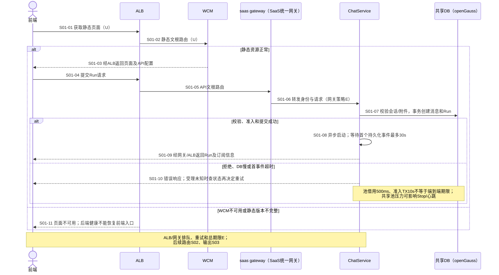

稳定性关注：R09/R11/R12。

源码：[HTTP入口](../../../src/main/java/com/huawei/it/ex/one/interfaces/chat/ChatController.java#L126)、[启动与首事件](../../../src/main/java/com/huawei/it/ex/one/application/service/chat/ChatRunStartCoordinator.java#L57)、[受理事务](../../../src/main/java/com/huawei/it/ex/one/application/service/chat/ChatRunAdmissionCommitService.java#L53)。

### S02 路由、技能查询与下游执行

当前agentService是一个物理服务；技能属性查询、chat执行mapping和admin配置职责不同。专家/Binding/用例库命中可绕过Intent；用例库和Intent默认关闭。

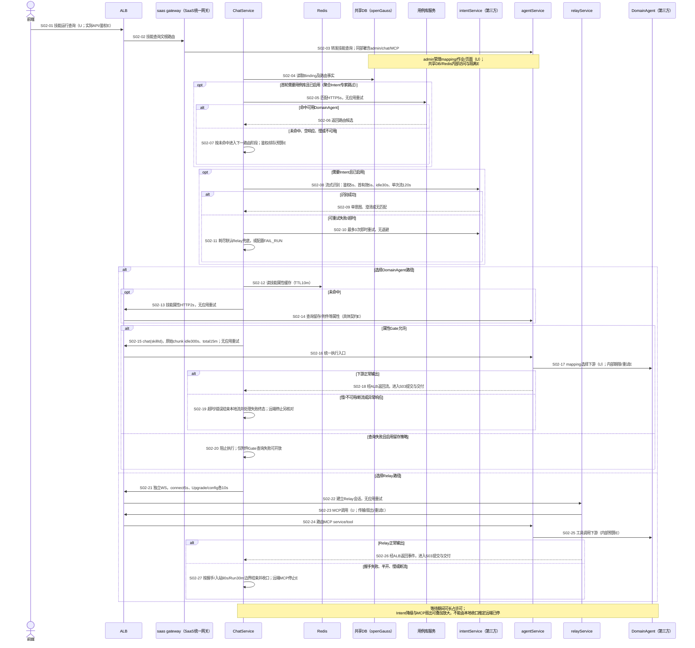

稳定性关注：R03/R16/R17/R19/R20/R21。关键技能配置不是可统一丢弃的旁路；外部服务及前端策略仍为E。

源码：[用例库HTTP](../../../src/main/java/com/huawei/it/ex/one/infrastructure/usecase/HttpUseCaseLibraryClient.java#L50)、[首轮路由及降级](../../../src/main/java/com/huawei/it/ex/one/application/service/routing/RouteSignalApplicationService.java#L139)、[路由](../../../src/main/java/com/huawei/it/ex/one/application/service/chat/ChatRuntimeDispatchCoordinator.java#L176)、[属性Gate](../../../src/main/java/com/huawei/it/ex/one/application/service/agentdatapersistence/AgentDataPersistenceGate.java#L80)、[统一chat](../../../src/main/java/com/huawei/it/ex/one/infrastructure/runtime/domainagent/ConfiguredDomainAgentClient.java#L65)、[Relay](../../../src/main/java/com/huawei/it/ex/one/infrastructure/runtime/relay/RelayWebSocketRuntimeAdapter.java#L113)。

### S03 流式输出、存储与实时交付

覆盖两条下游链路、FULL/no-store及正常结束、等待、错误。下图省略S02已画出的MCP内部路由。

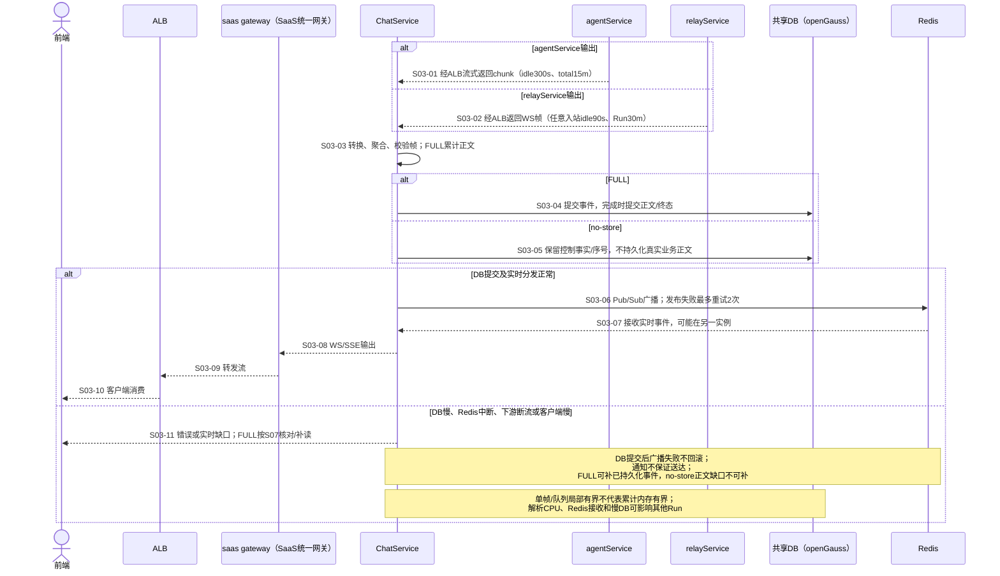

稳定性关注：R01/R04/R07/R09/R10。

源码：[流式桥接](../../../src/main/java/com/huawei/it/ex/one/infrastructure/runtime/relay/RelayWebSocketRuntimeAdapter.java#L234)、[事件处理](../../../src/main/java/com/huawei/it/ex/one/application/service/chat/ChatEventPipeline.java#L76)、[正文累计](../../../src/main/java/com/huawei/it/ex/one/application/service/chat/AssistantAssembly.java#L27)、[实时广播](../../../src/main/java/com/huawei/it/ex/one/infrastructure/persistence/RedisChatLiveEventBus.java#L86)。

### S04 人机交互、拒答与候选切换

覆盖澄清、问卷、候选确认/拒绝、OTHER、可信拒答重路由和A→B切换；重复/过期输入必须及时拒绝，避免再启动下游。

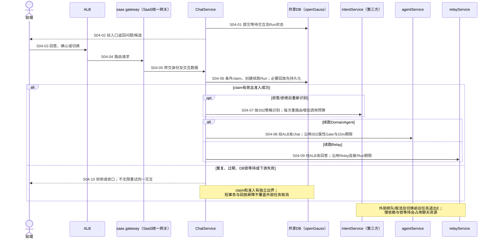

稳定性关注：R03/R16/R18/R20/R21。

源码：[交互续跑](../../../src/main/java/com/huawei/it/ex/one/application/service/chat/InteractionContinuationCoordinator.java#L122)、[候选准入](../../../src/main/java/com/huawei/it/ex/one/application/service/chat/ChatRunAdmissionCommitService.java#L186)、[回放屏障](../../../src/main/java/com/huawei/it/ex/one/application/service/chat/StandardRunRuntimeCoordinator.java#L172)、[拒答重路由](../../../src/main/java/com/huawei/it/ex/one/application/service/chat/DomainAgentRefusalCoordinator.java#L259)。

### S05 Stop、超时与终态收口

用户Stop、运行超时/异常、删除后Stop共享收口边界；本地终态、连接取消和远端停止分别验收。

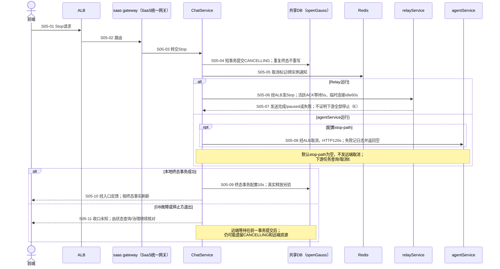

稳定性关注：R03/R17/R18/R19/R21。

源码：[Stop编排](../../../src/main/java/com/huawei/it/ex/one/application/service/chat/ChatRunStopCoordinator.java#L160)、[终态事务](../../../src/main/java/com/huawei/it/ex/one/application/service/chat/ChatRunTerminalCommitService.java#L230)、[Relay中断](../../../src/main/java/com/huawei/it/ex/one/infrastructure/runtime/relay/RelayWebSocketRuntimeAdapter.java#L1380)、[DomainAgent取消](../../../src/main/java/com/huawei/it/ex/one/infrastructure/runtime/domainagent/ConfiguredDomainAgentClient.java#L110)。

### S06 异步挂起与结果回调

异步默认关闭；启用后覆盖提前、重复、并发、过期回调及大结果。回调实际出口和经由agentService的方式需联合确认（E）。

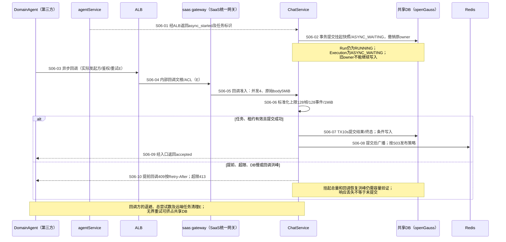

稳定性关注：R01/R07/R09/R18/R19。

源码：[挂起提交](../../../src/main/java/com/huawei/it/ex/one/application/service/chat/DomainAgentAsyncTaskApplicationService.java#L60)、[回调准入](../../../src/main/java/com/huawei/it/ex/one/interfaces/chat/DomainAgentAsyncTaskCallbackAdmissionFilter.java#L85)、[标准化](../../../src/main/java/com/huawei/it/ex/one/application/service/chat/DomainAgentAsyncTaskCallbackApplicationService.java#L177)、[回调提交](../../../src/main/java/com/huawei/it/ex/one/application/service/chat/DomainAgentAsyncTaskCallbackCommitService.java#L64)。

### S07 连接、补读与恢复风暴

Session Resume是有限历史；Run Resume衔接历史与live；WS支持topic订阅。多页签和跨实例重连不能绕过容量治理。

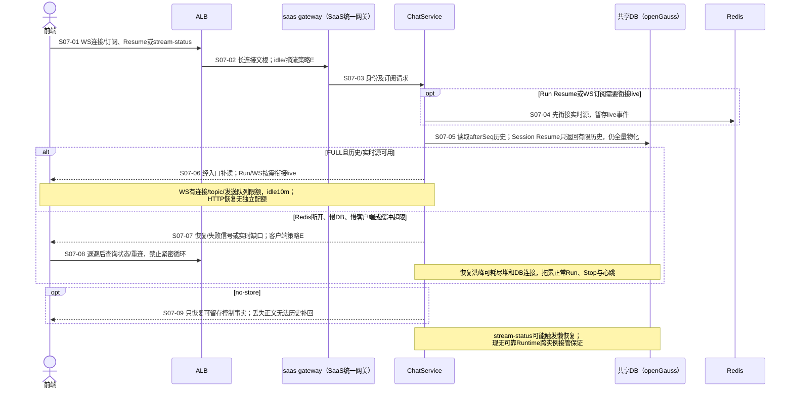

稳定性关注：R02/R04/R09/R10/R12。

源码：[Session补读](../../../src/main/java/com/huawei/it/ex/one/application/service/chat/ChatStreamApplicationService.java#L251)、[Run补读](../../../src/main/java/com/huawei/it/ex/one/application/service/chat/ChatStreamApplicationService.java#L298)、[live缓冲](../../../src/main/java/com/huawei/it/ex/one/application/service/chat/ChatStreamApplicationService.java#L350)、[WS注册](../../../src/main/java/com/huawei/it/ex/one/interfaces/chat/websocket/LocalWebSocketConnectionRegistry.java#L49)。

### S08 会话、历史与管理

保留全部列表、搜索、消息树/版本、path、分支、归档和单删/批删入口；重点检查查询规模、锁等待及删除后的资源回收。

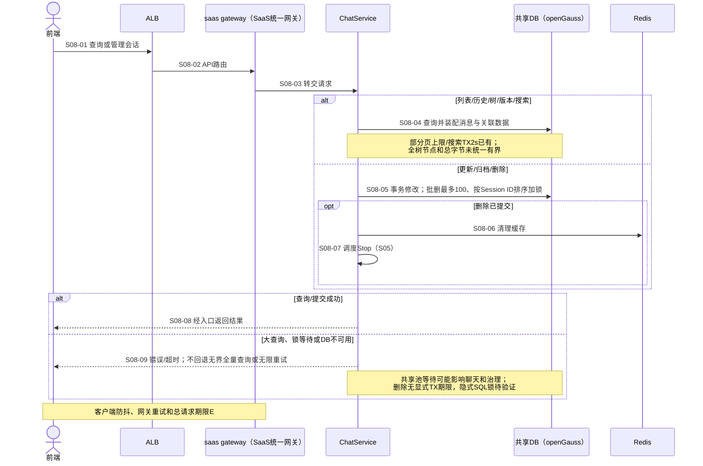

稳定性关注：R05/R09/R18。

源码：[会话查询](../../../src/main/java/com/huawei/it/ex/one/application/service/chat/SessionApplicationService.java#L216)、[删除及排序锁](../../../src/main/java/com/huawei/it/ex/one/application/service/chat/SessionApplicationService.java#L407)、[历史SQL](../../../src/main/resources/mapper/memory/ChatMessageMapper.opengauss.xml#L402)。

### S09 文档与附件

覆盖local、OBS、API Store上传/登记、状态、预览/下载、附件引用、软删和孤儿对象。用户500MiB文件需求与源码默认50MB/60MB需分开验收。

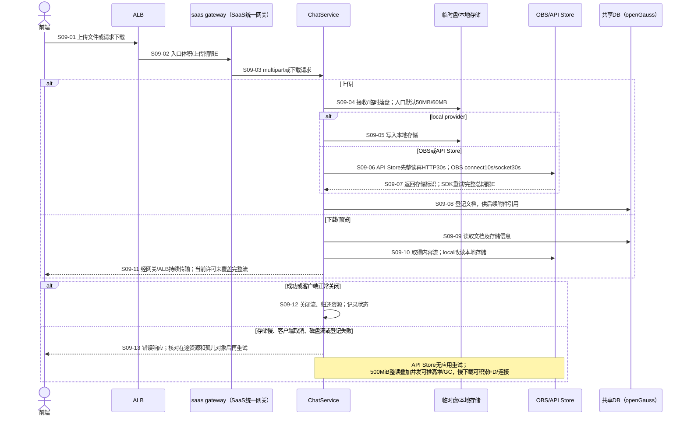

稳定性关注：R06。默认32个存储许可不是在途字节上限；32×500MiB仅原始数组即15.625GiB，不能把该估算当已复现OOM。

源码：[上传](../../../src/main/java/com/huawei/it/ex/one/application/service/document/DocumentApplicationService.java#L74)、[API Store整读](../../../src/main/java/com/huawei/it/ex/one/infrastructure/storage/api/ApiStoreDocumentStorage.java#L206)、[下载流](../../../src/main/java/com/huawei/it/ex/one/interfaces/document/DocumentController.java#L192)、[配置](../../../src/main/resources/application.yml#L389)。

### S10 分享、投递与反馈

分享快照/撤销、WeLink、普通反馈、意图反馈、旧偏好和候选查询均保留索引；本组关注依赖等待与共享资源压力。

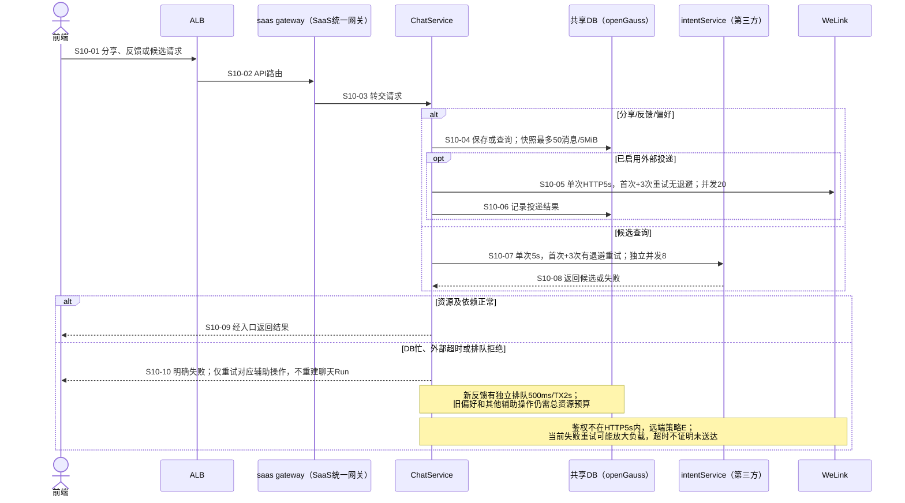

稳定性关注：R03/R05/R09/R20。

源码：[分享](../../../src/main/java/com/huawei/it/ex/one/application/service/share/ChatShareApplicationService.java#L62)、[投递](../../../src/main/java/com/huawei/it/ex/one/application/service/share/ChatShareDeliveryApplicationService.java#L65)、[反馈隔离](../../../src/main/java/com/huawei/it/ex/one/application/service/routing/IntentFeedbackTaskDispatcher.java#L50)、[候选](../../../src/main/java/com/huawei/it/ex/one/infrastructure/intent/FinEurekaIntentCandidateProvider.java#L70)。

### S11 可选记忆、标题与记录

分别验证启用和关闭；技能留存/附件策略不在本组，仍按S02关键依赖处理。标题服务为可配置外部依赖，不臆定由当前agentService实现。

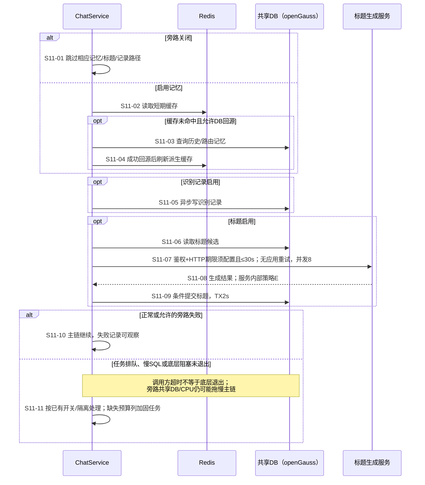

稳定性关注：R05/R07/R09。

源码：[标题任务](../../../src/main/java/com/huawei/it/ex/one/application/service/chat/SessionTitleApplicationService.java#L84)、[标题提交](../../../src/main/java/com/huawei/it/ex/one/application/service/chat/SessionTitleCommitService.java#L27)、[短期缓存/回源](../../../src/main/java/com/huawei/it/ex/one/infrastructure/memory/LayeredChatMessageRepository.java#L155)、[路由记忆等待](../../../src/main/java/com/huawei/it/ex/one/application/service/memory/RouteMemoryApplicationService.java#L280)。

### S12 心跳、治理与部署故障

覆盖心跳、Watchdog、懒恢复、缓存同步、滚动发布与退出。区域故障的目标切换程序见DEP02–DEP06，图中不把P视为当前能力。

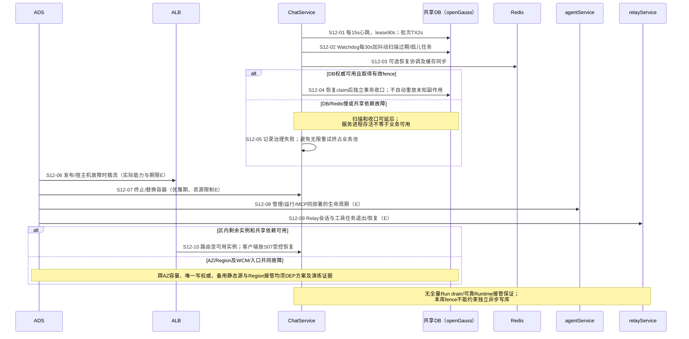

稳定性关注：R08/R09/R10/R13/R14/R15。

源码：[心跳](../../../src/main/java/com/huawei/it/ex/one/application/service/chat/ChatRunLeaseApplicationService.java#L147)、[Watchdog](../../../src/main/java/com/huawei/it/ex/one/application/service/chat/ChatRunWatchdogScheduler.java#L55)、[恢复](../../../src/main/java/com/huawei/it/ex/one/application/service/chat/ChatRunRecoveryOrchestrator.java#L116)、[实例身份](../../../src/main/java/com/huawei/it/ex/one/infrastructure/id/GeneratedApplicationInstanceIdProvider.java#L25)。

## 关键资源、状态与释放边界

正常结束、异常、超时、取消、实例退出五类路径都要检查实际资源回落。响应成功/失败、`dispose`调用或容器被替换，均不单独证明DB连接、FD、下游任务和副作用已清理。下表只保留能扩大故障影响的资源。

| 资源与作用域 | 当前获取/保护 | 释放及稳定性缺口 | 证据 |
|---|---|---|---|
| 准入/下游许可、Run本机登记 | 每用户速率、每租户200；Relay/DomainAgent各实例64 | 正常/异常/取消按guard及doFinally释放；进程退出不等于远端停止，无全量Run排空 | [准入](../../../src/main/java/com/huawei/it/ex/one/application/service/chat/RunAdmissionControlService.java#L55)、[许可](../../../src/main/java/com/huawei/it/ex/one/application/service/runtime/WorkloadConcurrencyLimiter.java#L60)、[运行登记](../../../src/main/java/com/huawei/it/ex/one/application/service/chat/LocalChatRunExecutionRegistry.java#L25) |
| 流式帧、累计正文、异步事件 | 有单帧/批次上限；FULL累计正文/Parts，no-store跳过真实业务正文累计及持久化 | 两种模式仍有帧/队列分配；桥接BUFFER和FULL累计量需加总界；清理必须跟随源任务结束 | [桥接](../../../src/main/java/com/huawei/it/ex/one/infrastructure/runtime/relay/RelayWebSocketRuntimeAdapter.java#L234)、[聚合](../../../src/main/java/com/huawei/it/ex/one/application/service/chat/AssistantAssembly.java#L27) |
| DB连接、事务和行锁 | 每Chat实例池10、借用500ms；部分事务2s/10s | 提交/回滚后归还，提交后回调仍可能延长调用占用；SQL/锁/驱动总期限及所有服务预算E | [配置](../../../src/main/resources/application.yml#L25)、[锁表](#transaction-locks) |
| Redis发布/接收、WS/Resume | 每topic发布1024条/8MiB，WS输出256条/2MiB；接收执行器未显式有界 | topic和订阅需解除；恢复历史仍全量，局部队列上限不是全实例内存上限；FULL/no-store补偿不同 | [Redis生命周期](../../../src/main/java/com/huawei/it/ex/one/infrastructure/persistence/RedisChatLiveEventBus.java#L86)、[恢复](../../../src/main/java/com/huawei/it/ex/one/application/service/chat/ChatStreamApplicationService.java#L298) |
| 文件、临时盘、存储连接/FD | 默认入口50MB/60MB，存储操作32；API Store整读 | 下载许可不覆盖完整流；500MiB要求在途字节和临时盘预算；取消须关流、对账孤儿 | [文档流](../../../src/main/java/com/huawei/it/ex/one/interfaces/document/DocumentController.java#L192)、[整读](../../../src/main/java/com/huawei/it/ex/one/infrastructure/storage/api/ApiStoreDocumentStorage.java#L206) |
| 异步挂起与回调 | 挂起撤销owner/fence；回调并发4和body/标准化上限 | 挂起总量、过期扫描和恢复后回调峰值需测；终态与旧owner拒写保持 | [挂起](../../../src/main/java/com/huawei/it/ex/one/application/service/chat/DomainAgentAsyncTaskApplicationService.java#L60)、[回调准入](../../../src/main/java/com/huawei/it/ex/one/interfaces/chat/DomainAgentAsyncTaskCallbackAdmissionFilter.java#L85) |
| 旁路、后台及容器生命周期 | 部分独立执行器/开关；调度器及Redis listener有关闭逻辑 | 无证据证明所有任务都在统一期限退出；本机Run registry无统一PreDestroy排空 | [调度关闭](../../../src/main/java/com/huawei/it/ex/one/application/config/OperationalSchedulingConfig.java#L37)、[listener关闭](../../../src/main/java/com/huawei/it/ex/one/infrastructure/persistence/RedisChatLiveEventBus.java#L126) |

当前一体agentService的admin/查询/chat/MCP共用进程故障域（U），内部线程、连接、作业和限额为E；Chat的64许可不限制MCP全局扇出。relayService管理自己的会话和工具任务（U/E）。全部服务对共享DB/Redis的连接、热点与清理需合并核对。WCM发布、ALB摘流、ADS容器/宿主机、AZ/Region资源属于平台证据；见[部署方案](deployment.md)，不能以Chat单实例检查替代。

### 影响资源回收的状态边界

| 对象 | 必须保留的稳定性语义 | 依据 |
|---|---|---|
| Run / Execution | Run公开状态为RUNNING/CANCELLING/CANCELLED/COMPLETED/WAITING_USER/FAILED；ASYNC_WAITING、RECOVERING属于Execution。挂起时不保留原owner执行权，恢复治理不等于重启远端任务 | [Run枚举](../../../src/main/java/com/huawei/it/ex/one/domain/chat/ChatRunStatus.java#L13)、[Execution枚举](../../../src/main/java/com/huawei/it/ex/one/domain/chat/ChatRunExecutionStatus.java#L14)、[挂起](../../../src/main/java/com/huawei/it/ex/one/application/service/chat/DomainAgentAsyncTaskApplicationService.java#L60) |
| Interaction | claim、续跑Run与最终回答有独立边界；重复/过期回答不能不断产生新执行。孤立claim需治理，不能用长期大事务包住人机等待 | [claim/对账](../../../src/main/java/com/huawei/it/ex/one/application/service/chat/ChatInteractionApplicationService.java#L117) |
| Binding / Runtime | ACTIVE绑定续接与远端Runtime存活分别判断；默认业务TTL0不自动过期，Redis TTL不承担任务收口；Region切换不保证原会话能接管 | [绑定解析](../../../src/main/java/com/huawei/it/ex/one/application/service/runtime/RuntimeBindingApplicationService.java#L129)、[绑定生命周期](../../../src/main/java/com/huawei/it/ex/one/application/service/runtime/RuntimeBindingApplicationService.java#L587) |

正常结束验证许可、正文及订阅释放；异常/超时验证底层IO和远端任务是否退出；取消验证Stop与自然结束交错；实例退出验证租约、残留任务和客户端恢复。FULL只承诺恢复已持久化内容；no-store不得通过新增正文持久化“补齐”恢复能力。

### 关键事务与等待链

下表是源码调用顺序，**不是已复现死锁**。`｜提交｜`表示持锁区间已结束。除显式行锁，UPDATE/INSERT、唯一约束及索引维护也会等待；SQL中的EXISTS/JOIN不等于对所有读取表加写锁。真实openGauss的事务ID、等待链、执行计划和失败码属于T18证据，外部服务SQL由其负责人补充。

| 场景 | 已有顺序/保护 | 高影响缺口与证据 |
|---|---|---|
| 准入/路由 S01/S02 | 准入Session锁→消息→Run INSERT，TX10s；路由Run→Execution guard；有活动Run唯一约束 | 标准准入已提交后写缓存；兼容createRunning/续跑及pinned Binding仍有事务内Redis，需验证可达路径。[准入](../../../src/main/java/com/huawei/it/ex/one/application/service/chat/ChatRunAdmissionCommitService.java#L53)、[兼容创建](../../../src/main/java/com/huawei/it/ex/one/application/service/chat/ChatRunApplicationService.java#L115)、[pinned Binding](../../../src/main/java/com/huawei/it/ex/one/application/service/runtime/RuntimeBindingApplicationService.java#L144) |
| 事件/终态 S03 | 普通事件Run SHARE NOWAIT→Execution SHARE→序号/Event；完成/WAIT先Session→Run，TX10s；纯失败/取消可从Run开始 | 不得移除fencing解决等待；检查隐式消息/Parts/Binding更新与终态竞争。[事件guard](../../../src/main/java/com/huawei/it/ex/one/infrastructure/persistence/MyBatisChatEventStore.java#L132)、[终态](../../../src/main/java/com/huawei/it/ex/one/application/service/chat/ChatRunTerminalCommitService.java#L136) |
| Stop/Interaction S04/S05 | 活动Stop：Run CANCELLING短事务｜提交｜远端控制｜独立终态事务；WAIT Stop先Session；claim独立，续跑准入Session→Interaction→Run | 远端等待没有持有前一Run锁；停止方退出/claim孤立仍要收口。[Stop](../../../src/main/java/com/huawei/it/ex/one/application/service/chat/ChatRunStopCoordinator.java#L164)、[WAIT Stop](../../../src/main/java/com/huawei/it/ex/one/application/service/chat/ChatWaitingStopCommitService.java#L65)、[续跑插入](../../../src/main/java/com/huawei/it/ex/one/infrastructure/persistence/MyBatisChatRunRepository.java#L120) |
| async挂起/回调 S06 | 挂起Session→事件guard→消息→Run/Execution；回调Session→Run CAS→Event/消息→Run/Execution；TX10s | 同Session先锁和重复回调保护已有；锁升级、批量Parts与Stop/心跳交错需测。[挂起](../../../src/main/java/com/huawei/it/ex/one/application/service/chat/DomainAgentAsyncTaskApplicationService.java#L59)、[回调](../../../src/main/java/com/huawei/it/ex/one/application/service/chat/DomainAgentAsyncTaskCallbackCommitService.java#L63) |
| 删除 S08 | 去重、最多100；所有Session按ID升序先加锁，再软删/Binding/Share/Interaction｜提交｜缓存清理/Stop | 已处理Session排序，不能写成完全无序；集合隐式锁仍需取证，删除未显式限事务期限。[排序与提交后动作](../../../src/main/java/com/huawei/it/ex/one/application/service/chat/SessionApplicationService.java#L407) |
| 心跳/恢复 S12 | 心跳claim按runId排序、每批TX2s；恢复Execution CAS提交后，再独立终态事务 | 排序不证明SQL IN物理加锁顺序；不把恢复两次事务串成持锁网络调用。[心跳排序](../../../src/main/java/com/huawei/it/ex/one/application/service/chat/ChatRunLeaseApplicationService.java#L147)、[恢复边界](../../../src/main/java/com/huawei/it/ex/one/application/service/chat/ChatRunRecoveryOrchestrator.java#L341) |

JVM只保留三条关键等待链：WS注册表在monitor内关闭/取消订阅；每topic sink在monitor内emit，回调是否同步需实测；Relay中断在ACK计时前先同步发送。尚无反向锁环证据，不宣称死锁。Servlet/Redis发送队列的网络发送在出队后，Relay关闭的subscription dispose在锁外，这些已有保护须保留。调用方超时后底层SQL/IO是否仍占线程，纳入R18/T18。

证据：[WS注册/取消](../../../src/main/java/com/huawei/it/ex/one/interfaces/chat/websocket/LocalWebSocketConnectionRegistry.java#L49)、[topic emit](../../../src/main/java/com/huawei/it/ex/one/infrastructure/persistence/RedisChatLiveEventBus.java#L780)、[Relay同步发送](../../../src/main/java/com/huawei/it/ex/one/infrastructure/runtime/relay/RelayWebSocketRuntimeAdapter.java#L1343)、[锁外dispose](../../../src/main/java/com/huawei/it/ex/one/infrastructure/runtime/relay/RelayWebSocketRuntimeAdapter.java#L1420)。

## 全入口索引

本仓有44个唯一HTTP操作、45个Controller处理方法；文档上传Servlet/Reactive实现互斥。同一路径不同方法分开计数。下表保持完整归属，资源默认值和失败策略以场景/公共策略为准；外部服务及Actuator不混入44项。

| ID | HTTP操作 | 场景 | 稳定性检查重点 |
|---|---|---|---|
| 01 | `POST /v1/chat/runs` | [S01](#s01) / [S02](#s02) / [S03](#s03) / [S11](#s11) | 受理准入、首事件和未知响应；路由/输出及可选旁路 |
| 02 | `POST /v1/chat/runs/{sourceRunId}/switch-domain-agent` | [S04](#s04) | 切换前Stop、回放、下游资源释放 |
| 03 | `POST /v1/chat/runs/{runId}/stop` | [S05](#s05) | 本地收口与远端真实停止分别确认 |
| 04 | `POST /v1/chat/messages/{messageId}/feedback` | [S10](#s10) | 普通反馈写入及共享DB压力 |
| 05 | `DELETE /v1/chat/messages/{messageId}/feedback` | [S10](#s10) | 普通反馈删除及共享DB压力 |
| 06 | `GET /v1/chat/sessions/{sessionId}/events/resume` | [S07](#s07) | 有限历史SSE，全量物化与恢复配额 |
| 07 | `GET /v1/chat/runs/{runId}/events/resume` | [S07](#s07) | 历史与live衔接、慢消费及恢复风暴 |
| 08 | `GET /v1/chat/sessions/{sessionId}/stream-status` | [S07](#s07) / [S12](#s12) | 状态查询可触发懒恢复；限制紧密轮询 |
| 09 | `POST /v1/chat/sessions` | [S08](#s08) | 会话创建与共享DB保护 |
| 10 | `GET /v1/chat/sessions/apps` | [S08](#s08) | 本人应用范围查询的SQL预算 |
| 11 | `GET /v1/chat/sessions` | [S08](#s08) | 游标列表及批量状态/摘要查询 |
| 12 | `GET /v1/chat/sessions/page` | [S08](#s08) | 关键词搜索count+page及TX2s |
| 13 | `GET /v1/chat/sessions/{sessionId}` | [S08](#s08) | 单会话查询与共享DB保护 |
| 14 | `POST /v1/chat/sessions/{sessionId}/read` | [S08](#s08) | 已读水位更新及共享DB保护 |
| 15 | `GET /v1/chat/sessions/{sessionId}/messages` | [S08](#s08) | 消息分页及Parts/附件/反馈装配规模 |
| 16 | `GET /v1/chat/sessions/{sessionId}/messages/tree` | [S08](#s08) | 全树节点、总字节和CPU边界 |
| 17 | `GET /v1/chat/sessions/{sessionId}/messages/{messageId}/variants` | [S08](#s08) | 版本/兄弟消息及关联数据规模 |
| 18 | `POST /v1/chat/sessions/{sessionId}/path` | [S08](#s08) | 路径修改与并发Run资源边界 |
| 19 | `POST /v1/chat/sessions/{sessionId}/branches` | [S08](#s08) | 祖先链复制成本及失败后的资源/数据核对 |
| 20 | `PATCH /v1/chat/sessions/{sessionId}` | [S08](#s08) | 重命名TX10s和Session锁 |
| 21 | `POST /v1/chat/sessions/{sessionId}/archive` | [S08](#s08) | 归档TX10s，不等同Stop |
| 22 | `POST /v1/chat/sessions/{sessionId}/restore` | [S08](#s08) | 恢复归档TX10s，不自动重启Run |
| 23 | `DELETE /v1/chat/sessions/{sessionId}` | [S08](#s08) | 删除事务无显式期限；提交后Stop |
| 24 | `DELETE /v1/chat/sessions` | [S08](#s08) | 最多100、排序Session锁、提交后清理 |
| 25 | `POST /v1/chat/intent-candidates` | [S10](#s10) | 独立并发8、单次5s和有退避重试 |
| 26 | `POST /v1/chat/intent-preference-corrections` | [S10](#s10) | 旧偏好队列、底层SQL及超时后释放 |
| 27 | `POST /v1/chat/runs/{runId}/intent-feedback` | [S10](#s10) | 独立反馈排队500ms和TX2s |
| 28 | `GET /v1/chat/runs/{runId}/intent-feedback` | [S10](#s10) | 反馈查询的独立执行器及TX2s |
| 29 | `POST /v1/internal/domain-agent/async-tasks/callback` | [S06](#s06) | 回调4并发/5MiB及结果TX10s |
| 30 | `POST /v1/chat/messages/{messageId}/share` | [S10](#s10) | 单轮快照读取与共享DB预算 |
| 31 | `POST /v1/chat/shares` | [S10](#s10) | 最多50消息/5MiB快照 |
| 32 | `POST /v1/chat/messages/{messageId}/share/deliveries` | [S10](#s10) | 分享后投递并发20、HTTP5s |
| 33 | `GET /v1/chat/shares/{shareId}` | [S10](#s10) | 分享读取与共享DB预算 |
| 34 | `POST /v1/chat/shares/{shareId}/deliveries` | [S10](#s10) | WeLink默认关闭；未知投递不得无限重发 |
| 35 | `DELETE /v1/chat/shares/{shareId}` | [S10](#s10) | 撤销记录与共享DB预算 |
| 36 | `GET /v1/chat/shares` | [S10](#s10) | owner分页列表及SQL预算 |
| 37 | `POST /v1/documents` | [S09](#s09) | 入口大小、在途字节、存储并发及孤儿对象 |
| 38 | `GET /v1/documents` | [S09](#s09) | 元数据分页，不读取全文件 |
| 39 | `GET /v1/documents/{documentId}` | [S09](#s09) | 单文档元数据查询的DB预算 |
| 40 | `PATCH /v1/documents/{documentId}` | [S09](#s09) | 元数据修改的DB预算 |
| 41 | `DELETE /v1/documents/{documentId}` | [S09](#s09) | 软删与存储对象后续对账 |
| 42 | `GET /v1/documents/{documentId}/status` | [S09](#s09) | 文档状态轮询频率及DB预算 |
| 43 | `GET /v1/documents/{documentId}/preview-url` | [S09](#s09) | 后端下载URL；并非预签名传输 |
| 44 | `GET /v1/documents/{documentId}/download` | [S09](#s09) | 完整流生命周期中的FD/连接/取消 |

### 非REST及外部入口

| 入口/触发 | 场景 | 归属与稳定性边界 |
|---|---|---|
| `/v1/chat/ws`连接、订阅、取消 | [S03](#s03)/[S07](#s07) | 本仓；连接/topic/发送队列、慢消费、跨实例恢复 |
| Actuator、容器探针、ALB摘流 | [S12](#s12) | 探针与平台配置E；默认DB/Redis health关闭，进程UP不能证明业务可用 |
| 心跳、Watchdog、懒恢复 | [S12](#s12) | 本仓；SQL预算、fencing、治理积压和退出 |
| Redis发布/接收、缓存同步、WS清理 | [S03](#s03)/[S07](#s07)/[S12](#s12) | 本仓；积压、线程、重连和订阅释放 |
| 标题、RouteMemory、偏好、识别记录 | [S10](#s10)/[S11](#s11) | 本仓；启停配置、辅助并发和共享DB压力 |
| 删除后Stop、缓存清理和补偿 | [S05](#s05)/[S08](#s08)/[S12](#s12) | 提交后的异步动作；进程退出窗口及残留治理 |
| X01前端/Chat技能运行查询 | [S02](#s02) | 当前agentService（U）；前端URL/鉴权/限流及属性契约E |
| X02 admin技能mapping/作业/页面 | [S02](#s02)/[S12](#s12) | 当前agentService内部（U）；发布、任务单执行权和隔离E |
| X03 relayService MCP service/tool | [S02](#s02)/[S05](#s05) | agentService调用DomainAgent（U）；扇出/多层重试/取消/任务查询E |
| WCM静态发布、ADS及AZ/Region事件 | [S01](#s01)/[S12](#s12) | 平台依赖；目标与演练见[DEP01–DEP06](deployment.md) |

前端需分别呈现受理、首事件、最终收口与恢复状态；恢复/轮询采用退避，避免把断线直接变为新Run重试。500MiB文档必须核对每层入口限制。具体退避参数及ALB/saas gateway失败透传属于联合验收E，不能假定本仓已经实现。
