# 功能场景、资源状态与接口索引

按需阅读：[12场景与24张时序图](#flows) → [资源生命周期及状态转换](#resources) → [44个HTTP操作与非REST入口](#interfaces)。资源表统一说明当前资源/状态口径；各场景的源码索引用于核对具体方法和边界。

## 按功能场景的双层运行时序图

基线：`00abae4f80b7e7e5b4d0ddca707035f1878a8ec8`；核对日期：2026-09-18。本文同时标出**当前代码、用户确认的部署关系和待落地的容灾目标**，箭头中的风险不是已经发生的事故。本次不修改业务实现。

证据标记：**S**=本仓源码；**U**=用户确认的生产架构；**P**=目标方案，尚未实施；**E**=需要平台或联合验证。粗图中未写P/E的业务处理沿用S/U事实，涉及外部服务内部步骤的箭头明确保留E，不把图当作外部源码证据。

用户确认的链路为：Web经区域ALB的静态文根从WCM取得资源，运行时API经**区域ALB按文根路由→Jalor→ChatService**；ChatService按`skillId`调用**ToolService→第三方DomainAgent**，另以独立WS调用**自部署Relay**，并调用第三方Intent。AdminService负责mapping、作业及页面配置。Admin、Tool、Relay、Chat均以Docker部署在ADS，共享数据库和Redis（U）。所有路由文根由ALB提供（U），包括Tool HTTP与Relay WS的内部文根；具体路径、目标组、有效URL和长连接策略为E。图中入口/内部文根是同一ALB路由层的逻辑视图，不代表额外部署多套ALB。WCM不是运行时API代理；全站资源和API入口的一致性仍需验收。

DB是Chat持久化事实源；Chat使用Redis做派生缓存和Pub/Sub分发。其他三服务的Redis用途、表/键归属及配额属于E，不能把整个共享Redis视为可无条件清空的缓存。图中共享DB不表示四服务共享同一个Hikari池：代码默认10连接仅属于每个Chat实例，全部服务/实例的连接和IO必须另做总预算。部署目标为区内跨AZ、跨Region主备与WCM/ADS容灾（P），详见[DEP01–DEP06](deployment.md)；现有代码不提供Region全局互斥或Runtime无损接管保证。

`->>` 表示调用，`-->>` 表示响应/通知；是否同步、异步或流式以箭头说明为准。细图中的BE表示`boundedElastic`，EIO表示Event IO Scheduler；一次Run会跨线程。JDBC借用Chat实例池，事务提交/回滚后归还；同步提交后回调也可能延长实际归还时间。ALB/Jalor的超时、限流、健康检查、ADS故障域及底层资源拓扑仍需E。

步骤编号`Sxx-Cn`为粗图、`Sxx-Dn`为细图；保留原编号，新增物理跳转使用`a/b/…`字母后缀。方法源码链接的`#L`按该基线核对；后续代码变动应同步更新。风险编号对应[当前风险登记](risks.md#risk-register)：R26为CPU、R27为运行治理，新增R28–R35分别覆盖共享DB、共享Redis、配置/Tool、WCM、ALB、ADS、AZ和Region，对应用例T28–T35。本文仍为12组场景、24张图，不声称主图穷尽所有事件交错。

技能**属性查询**是独立边界：Chat向单独配置的API请求`skillName/isSaveSession/attachmentType`，API归属未确认（E）；不能把它等同Tool执行mapping查询，更不能凭服务名称宣称Chat直接读Admin的mapping表。源码所称“DomainAgent直连”是相对绕开Relay的逻辑路径，部署图采用用户确认的Tool统一执行入口。

### 场景目录与覆盖规则

| 编号 | 功能组与必查变体 | 当前时序图及关联场景 |
|---|---|---|
| S01 | NEXT、EDIT_USER、REGENERATE；新/旧会话；附件-only；身份失败、准入拒绝、首事件超时、提交后响应丢失 | [S01受理与启动](#s01)；[S03输出](#s03)、[S11旁路](#s11) |
| S02 | ACTIVE Binding续接、显式DomainAgent、固定Relay专家、聚合Intent专家、用例库命中、Intent单意图/澄清/无匹配、Relay兜底、技能配置缓存命中/失效 | [S02路由与执行](#s02)；[S04交互](#s04) |
| S03 | Relay/DomainAgent帧；delta/snapshot/card/控制；FULL/no-store；批处理开/关；completed/WAIT/failed/cancelled | [S03输出与提交](#s03) |
| S04 | 澄清、模糊候选选择/OTHER、路由确认同意/拒绝、Relay问卷、可信拒答重意图、候选A→B→C、重复/过期回答 | [S04交互与切换](#s04)；[S01受理](#s01)、[S02路由](#s02)、[S03输出](#s03)、[S05停止](#s05) |
| S05 | 本机/跨实例Stop、WAIT取消、重复Stop、自然完成/回调竞态、无partial、远端取消失败、超时/异常、停止方退出 | [S05停止与竞态](#s05)；[S03终态](#s03)、[S12治理](#s12) |
| S06 | 异步关闭/开启；挂起；提前/重复/并发/过期回调；APPEND/REPLACE；FAILED带结果；纯终态帧；回调超限 | [S06挂起与回调](#s06)；[S03提交](#s03)、[S12治理](#s12) |
| S07 | Session SSE历史、Run SSE接续、WS topic；首次/断线/跨实例/多页签；慢消费/乱序/恢复风暴；异步等待 | [S07连接与恢复](#s07) |
| S08 | 列表/搜索/未读/消息页/tree/versions/variants；path切换；branch；重命名/归档/恢复；单删/批删及并发分享 | [S08会话与历史](#s08)；[S05停止](#s05)、[S10分享](#s10) |
| S09 | 上传/登记；local/OBS/API Store；文档列表/状态/更新/附件引用；preview/download；软删、存储成功DB失败 | [S09文档与附件](#s09) |
| S10 | 单轮/选中消息快照、访问/列表/撤销、WeLink启停/未知投递；普通反馈、意图反馈、旧偏好、候选查询 | [S10分享与反馈](#s10)；[S04候选切换](#s04) |
| S11 | 短期记忆、RouteMemory、标题、Intent记录分别关闭/启用；缓存miss；旁路超时/排队/迟到提交 | [S11可选旁路](#s11) |
| S12 | 心跳、过期租约、初始化孤儿、Interaction对账、async到期、缓存同步；滚动发布、进程退出、依赖切换 | [S12后台与部署](#s12) |

接口逐项索引见本页[44个HTTP操作与非REST入口](#interfaces)；REST 的同一路径不同方法是不同操作，不能用路径去重替代接口覆盖。全局身份解析、参数绑定和错误封装在每个 HTTP 入口成立；以下图省略其重复方法箭头，不省略其网关故障影响。

#### 部署故障如何进入业务场景

以下风险是对原场景的补充，不能因仅有Chat实例健康检查就宣布全链路可用。DEP编号指向[部署与容灾方案](deployment.md)，P措施需在E证据通过后才计入保障能力。

| 图步骤/场景 | 故障传播边界 | 风险及用例 | 部署场景 |
|---|---|---|---|
| S01-C1a | WCM不可达、发布不完整或静态版本/API地址不兼容，用户无法进入业务；后端健康不能弥补 | R31 / T31 | DEP01逻辑架构、DEP04 WCM切换 |
| S01-C1/C1b；S03-C5a/C5b；S07-C1a/C7a | ALB文根错路由、长连接idle期限、跨AZ摘流引发未知受理和恢复风暴 | R32 / T32 | DEP02跨AZ、DEP05接管、DEP06回切 |
| S02-C1a/C8/C8a/C8b；S04/S05 | Admin配置发布、Tool mapping或限流影响第三方技能；Relay是独立WS故障域，不能用Tool健康替代 | R30 / T30 | DEP01逻辑架构、DEP03主备Region |
| 所有访问DB的步骤，尤其S03-C2/S06-C6/S12-C3a | 任一服务的长事务、作业或连接洪峰影响四服务；单库fence不能扩展为两个异步写库的全局互斥 | R28 / T28 | DEP02、DEP03、DEP05 |
| S03-C3/C4、S07-C3、S12-C3b | 共享Redis的热点、阻塞、重连或清理可同时影响路由、会话或交付；其他服务持久语义未知 | R29 / T29 | DEP02、DEP03、DEP05 |
| S09-C2/C5；S12-C1/C6 | ADS宿主机、容器退出、临时盘、镜像/配置发布影响当前实例与在途任务；无现成全量Run drain | R33 / T33 | DEP02、DEP03 |
| S12-C1/C1a/C7 | 单AZ失效后ALB、Jalor、四服务和共享依赖须共同可用；仅增加Chat副本不足 | R34 / T34 | DEP02跨AZ |
| S12-C7a/C7b，关联S01/S05/S06/S07 | Region接管须验证唯一写权威、四服务配置、第三方出口/回调、WCM/API版本和Runtime会话；不自动重放未知副作用 | R35 / T35 | DEP03、DEP05、DEP06 |

属性API的归属、Tool内部重试/幂等、Admin作业调度语义和Relay会话持久化/恢复能力分别取证；四服务共用DB/Redis（U）不能替代这些专项证明。Chat的64下游许可也不是Tool对所有调用方的总配额。

### S01 请求受理与Run启动

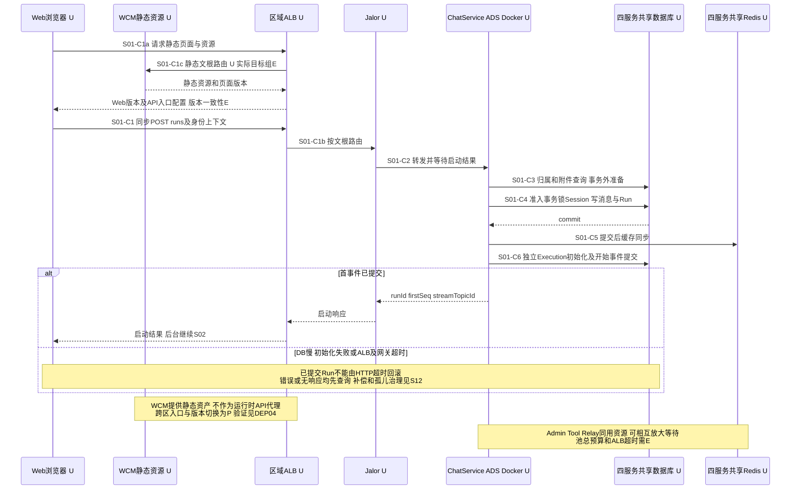
```mermaid
sequenceDiagram
    participant U as Web浏览器 U
    participant WCM as WCM静态资源 U
    participant L as 区域ALB U
    participant G as Jalor U
    participant C as ChatService ADS Docker U
    participant D as 四服务共享数据库 U
    participant R as 四服务共享Redis U
    U->>L: S01-C1a 请求静态页面与资源
    L->>WCM: S01-C1c 静态文根路由 U 实际目标组E
    WCM-->>L: 静态资源和页面版本
    L-->>U: Web版本及API入口配置 版本一致性E
    U->>L: S01-C1 同步POST runs及身份上下文
    L->>G: S01-C1b 按文根路由
    G->>C: S01-C2 转发并等待启动结果
    C->>D: S01-C3 归属和附件查询 事务外准备
    C->>D: S01-C4 准入事务锁Session 写消息与Run
    D-->>C: commit
    C->>R: S01-C5 提交后缓存同步
    C->>D: S01-C6 独立Execution初始化及开始事件提交
    alt 首事件已提交
        C-->>G: runId firstSeq streamTopicId
        G-->>L: 启动响应
        L-->>U: 启动结果 后台继续S02
    else DB慢 初始化失败或ALB及网关超时
        Note over U,D: 已提交Run不能由HTTP超时回滚<br/>错误或无响应均先查询 补偿和孤儿治理见S12
    end
    Note over WCM,L: WCM提供静态资产 不作为运行时API代理<br/>跨区入口与版本切换为P 验证见DEP04
    Note over C,R: Admin Tool Relay同用资源 可相互放大等待<br/>池总预算和ALB超时需E
```

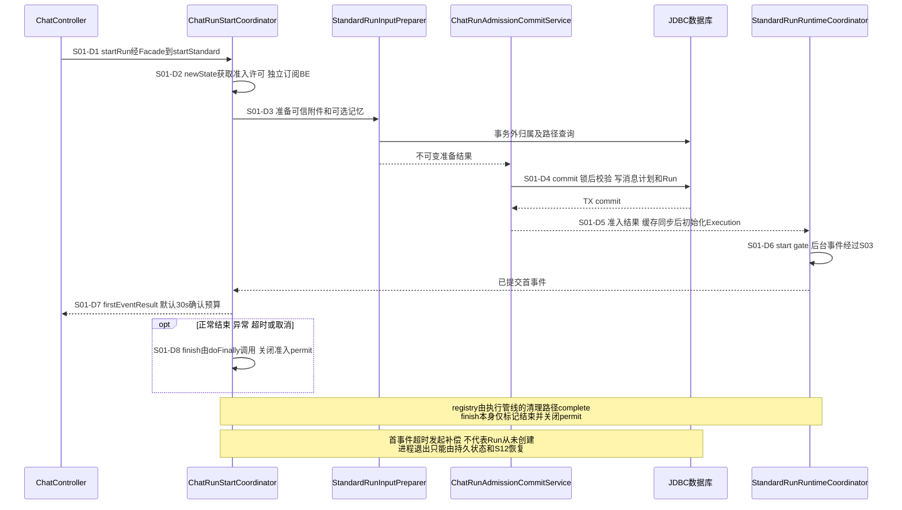
```mermaid
sequenceDiagram
    participant API as ChatController
    participant ST as ChatRunStartCoordinator
    participant PRE as StandardRunInputPreparer
    participant ADM as ChatRunAdmissionCommitService
    participant DB as JDBC数据库
    participant RT as StandardRunRuntimeCoordinator
    API->>ST: S01-D1 startRun经Facade到startStandard
    ST->>ST: S01-D2 newState获取准入许可 独立订阅BE
    ST->>PRE: S01-D3 准备可信附件和可选记忆
    PRE->>DB: 事务外归属及路径查询
    PRE-->>ADM: 不可变准备结果
    ADM->>DB: S01-D4 commit 锁后校验 写消息计划和Run
    DB-->>ADM: TX commit
    ADM-->>RT: S01-D5 准入结果 缓存同步后初始化Execution
    RT->>RT: S01-D6 start gate 后台事件经过S03
    RT-->>ST: 已提交首事件
    ST-->>API: S01-D7 firstEventResult 默认30s确认预算
    opt 正常结束 异常 超时或取消
        ST->>ST: S01-D8 finish由doFinally调用 关闭准入permit
    end
    Note over ST,RT: registry由执行管线的清理路径complete<br/>finish本身仅标记结束并关闭permit
    Note over ST,DB: 首事件超时发起补偿 不代表Run从未创建<br/>进程退出只能由持久状态和S12恢复
```

| 步骤 | 当前保护与剩余风险 | 加固/验收关注 |
|---|---|---|
| S01-C2/D1-D3 | 身份/归属、速率/租户准入、附件数量检查；准备阶段仍可占许可与DB，R02 | 测网关/身份慢与附件N次点查；统一准入预算 |
| S01-D4-D7 | Session锁和活动Run约束；准入/Execution/开始事件分三次提交，R08/R13 | 分别在commit前后kill；未知结果先查状态，协议级幂等另立任务 |
| S01-D8 | `doFinally`释放本机许可；kill不执行Java清理，R14/R27 | 记录许可与遗留Run，验证治理收口期限 |

源码：[入口startRun L126](../../../src/main/java/com/huawei/it/ex/one/interfaces/chat/ChatController.java#L126)、[startStandard L57](../../../src/main/java/com/huawei/it/ex/one/application/service/chat/ChatRunStartCoordinator.java#L57)、[commit L53](../../../src/main/java/com/huawei/it/ex/one/application/service/chat/ChatRunAdmissionCommitService.java#L53)、[执行编排L94](../../../src/main/java/com/huawei/it/ex/one/application/service/chat/StandardRunRuntimeCoordinator.java#L94)、[正常registry清理L93](../../../src/main/java/com/huawei/it/ex/one/application/service/chat/ChatRunExecutionGateCoordinator.java#L93)。专家路由与交互续跑分别结合[S02](#s02)、[S04](#s04)核对；准入事务和许可边界以以上方法及[资源表](#resources)为准。

### S02 路由选择与下游执行

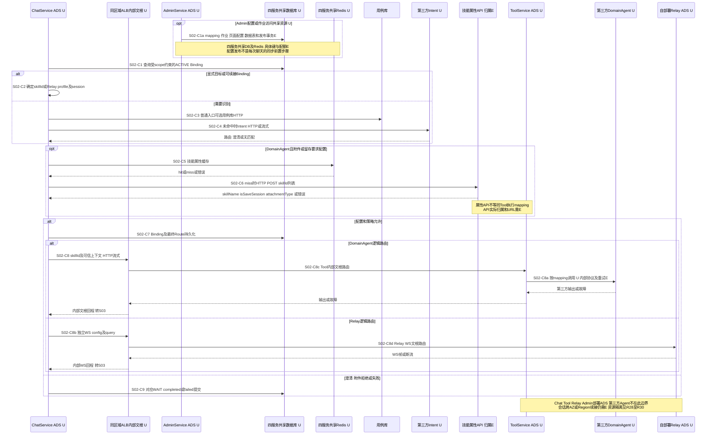
```mermaid
sequenceDiagram
    participant C as ChatService ADS U
    participant L as 同区域ALB内部文根 U
    participant ADM as AdminService ADS U
    participant D as 四服务共享数据库 U
    participant R as 四服务共享Redis U
    participant K as 用例库
    participant I as 第三方Intent U
    participant S as 技能属性API 归属E
    participant TOOL as ToolService ADS U
    participant DA as 第三方DomainAgent U
    participant RL as 自部署Relay ADS U
    opt Admin配置或作业访问共享资源 U
        ADM->>D: S02-C1a mapping 作业 页面配置 数据表和发布事务E
        Note over ADM,R: 四服务共享DB及Redis 具体键与配额E<br/>配置发布不是每次聊天的同步前置步骤
    end
    C->>D: S02-C1 查询受scope约束的ACTIVE Binding
    alt 显式目标或可续接Binding
        C->>C: S02-C2 确定skillId或Relay profile及session
    else 需要识别
        C->>K: S02-C3 普通入口可选用例库HTTP
        C->>I: S02-C4 未命中时Intent HTTP或流式
        I-->>C: 路由 澄清或无匹配
    end
    opt DomainAgent且附件或留存要求配置
        C->>R: S02-C5 技能属性缓存
        R-->>C: hit或miss或错误
        C->>S: S02-C6 miss时HTTP POST skillId列表
        S-->>C: skillName isSaveSession attachmentType 或错误
        Note over S,TOOL: 属性API不等同Tool执行mapping<br/>API实际归属和URL需E
    end
    alt 配置和策略允许
        C->>D: S02-C7 Binding及最终Route持久化
        alt DomainAgent逻辑路由
            C->>L: S02-C8 skillId及可信上下文 HTTP流式
            L->>TOOL: S02-C8c Tool内部文根路由
            TOOL->>DA: S02-C8a 按mapping调用 U 内部协议及重试E
            DA-->>TOOL: 第三方输出或故障
            TOOL-->>L: 输出或故障
            L-->>C: 内部文根回程 转S03
        else Relay逻辑路由
            C->>L: S02-C8b 独立WS config及query
            L->>RL: S02-C8d Relay WS文根路由
            RL-->>L: WS帧或断流
            L-->>C: 内部WS回程 转S03
        end
    else 澄清 附件拒绝或失败
        C->>D: S02-C9 对应WAIT completed或failed提交
    end
    Note over TOOL,RL: Chat Tool Relay Admin部署ADS 第三方Agent不在此边界<br/>会话跨AZ或Region续接仍需E 资源隔离见R28至R30
```

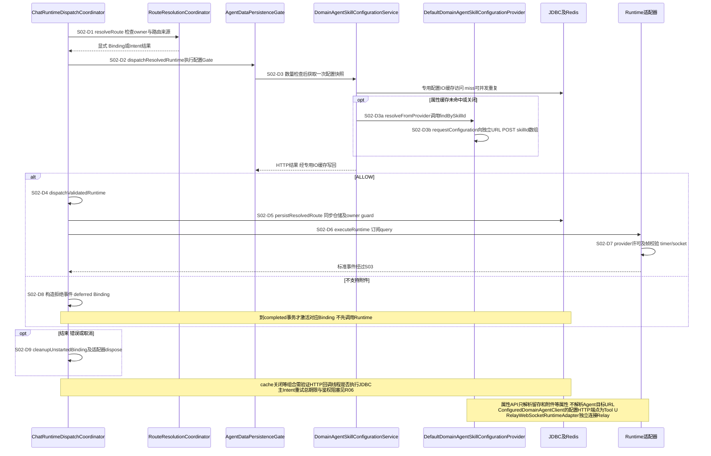
```mermaid
sequenceDiagram
    participant DIS as ChatRuntimeDispatchCoordinator
    participant RES as RouteResolutionCoordinator
    participant GATE as AgentDataPersistenceGate
    participant CFG as DomainAgentSkillConfigurationService
    participant PR as DefaultDomainAgentSkillConfigurationProvider
    participant DB as JDBC及Redis
    participant AD as Runtime适配器
    DIS->>RES: S02-D1 resolveRoute 检查owner与路由来源
    RES-->>DIS: 显式 Binding或Intent结果
    DIS->>GATE: S02-D2 dispatchResolvedRuntime执行配置Gate
    GATE->>CFG: S02-D3 数量检查后获取一次配置快照
    CFG->>DB: 专用配置IO缓存访问 miss可并发重复
    opt 属性缓存未命中或关闭
        CFG->>PR: S02-D3a resolveFromProvider调用findBySkillId
        PR->>PR: S02-D3b requestConfiguration向独立URL POST skillId数组
    end
    CFG-->>GATE: HTTP结果 经专用IO缓存写回
    alt ALLOW
        DIS->>DIS: S02-D4 dispatchValidatedRuntime
        DIS->>DB: S02-D5 persistResolvedRoute 同步仓储及owner guard
        DIS->>AD: S02-D6 executeRuntime 订阅query
        AD->>AD: S02-D7 provider许可及帧校验 timer/socket
        AD-->>DIS: 标准事件经过S03
    else 不支持附件
        DIS->>DIS: S02-D8 构造拒绝事件 deferred Binding
        Note over DIS,DB: 到completed事务才激活对应Binding 不先调用Runtime
    end
    opt 结束 错误或取消
        DIS->>DIS: S02-D9 cleanupUnstartedBinding及适配器dispose
    end
    Note over DIS,DB: cache关闭等组合需验证HTTP回调线程是否执行JDBC<br/>主Intent重试总期限与鉴权阻塞见R06
    Note over PR,AD: 属性API只解析留存和附件等属性 不解析Agent目标URL<br/>ConfiguredDomainAgentClient的配置HTTP端点为Tool U<br/>RelayWebSocketRuntimeAdapter独立连接Relay
```

| 变体/步骤 | 当前事实与风险 | 加固/验收关注 |
|---|---|---|
| S02-C3/C4/D1 | 显式目标及合法Binding跳过Intent；聚合专家跳过用例库；主Intent仍有重试放大，R06 | 401/429/黑洞/断流；按业务重路由次数与HTTP尝试数分别计量 |
| S02-D2-D5 | 留存/附件共用配置快照；cache miss未single-flight；部分配置回调可能同步JDBC，R16/R02 | cache on/off × 有无附件 × 留存on/off线程与并发矩阵 |
| S02-D6-D9 | 下游许可、单帧和运行期限已有；累计缓冲仍不有界，R01 | 配置服务故障不等同Runtime失败；错误/取消归还socket和许可 |

边界源码：[Tool请求skillId L53](../../../src/main/java/com/huawei/it/ex/one/infrastructure/runtime/domainagent/DomainAgentChatRequestMapper.java#L53)、[统一HTTP地址 L66](../../../src/main/java/com/huawei/it/ex/one/infrastructure/runtime/domainagent/ConfiguredDomainAgentClient.java#L66)、[独立技能属性API L60](../../../src/main/java/com/huawei/it/ex/one/infrastructure/domainagentconfig/DefaultDomainAgentSkillConfigurationProvider.java#L60)、[Relay端点 L953](../../../src/main/java/com/huawei/it/ex/one/infrastructure/runtime/relay/RelayWebSocketRuntimeAdapter.java#L953)。

源码：[resolveRoute L176](../../../src/main/java/com/huawei/it/ex/one/application/service/chat/ChatRuntimeDispatchCoordinator.java#L176)、[dispatchResolvedRuntime L204](../../../src/main/java/com/huawei/it/ex/one/application/service/chat/ChatRuntimeDispatchCoordinator.java#L204)、[persistResolvedRoute L304](../../../src/main/java/com/huawei/it/ex/one/application/service/chat/ChatRuntimeDispatchCoordinator.java#L304)、[技能配置L59](../../../src/main/java/com/huawei/it/ex/one/application/service/domainagentconfig/DomainAgentSkillConfigurationService.java#L59)、[Relay query L113](../../../src/main/java/com/huawei/it/ex/one/infrastructure/runtime/relay/RelayWebSocketRuntimeAdapter.java#L113)。出站实现继续核对[Intent流式尝试 L126](../../../src/main/java/com/huawei/it/ex/one/infrastructure/intent/FinEurekaIntentStreamClient.java#L126)和[Tool HTTP query L65](../../../src/main/java/com/huawei/it/ex/one/infrastructure/runtime/domainagent/ConfiguredDomainAgentClient.java#L65)；总期限、鉴权隔离和分类重试的整改范围见[W05](risks.md#w05)，不从主图推断已有统一总预算。

### S03 流式输出、聚合与提交

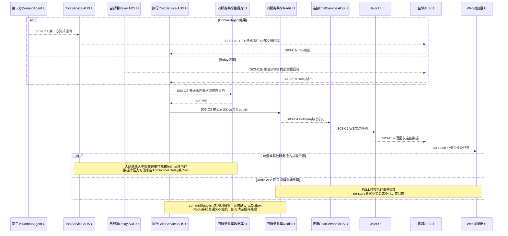
```mermaid
sequenceDiagram
    participant DA as 第三方DomainAgent U
    participant TOOL as ToolService ADS U
    participant RL as 自部署Relay ADS U
    participant C as 执行ChatService ADS U
    participant D as 四服务共享数据库 U
    participant R as 四服务共享Redis U
    participant W as 连接ChatService ADS U
    participant G as Jalor U
    participant L as 区域ALB U
    participant U as Web浏览器 U
    alt DomainAgent结果
        DA-->>TOOL: S03-C1a 第三方流式输出
        TOOL-->>L: S03-C1 HTTP流式事件 内部文根回程
        L-->>C: S03-C1c Tool输出
    else Relay结果
        RL-->>L: S03-C1b 独立WS帧 内部文根回程
        L-->>C: S03-C1d Relay输出
    end
    C->>D: S03-C2 普通事件批次或终态事务
    D-->>C: commit
    C->>R: S03-C3 提交后缓存及异步publish
    R-->>W: S03-C4 PubSub实时分发
    W-->>G: S03-C5 WS发送队列
    G-->>L: S03-C5a 返回长连接数据
    L-->>U: S03-C5b 业务事件及终态
    alt DB慢或其他服务抢占共享资源
        Note over TOOL,D: 入站速率大于提交速率可能积压Chat堆内存<br/>数据库压力可能来自Admin Tool Relay或Chat
    else Redis ALB 网关或消费端故障
        Note over R,U: FULL可按已存事件恢复<br/>no-store真实业务结果不可历史回放
    end
    Note over C,R: commit到publish之间kill会留下交付缺口 无Outbox<br/>Redis多服务语义不能统一按可清空缓存处理
```

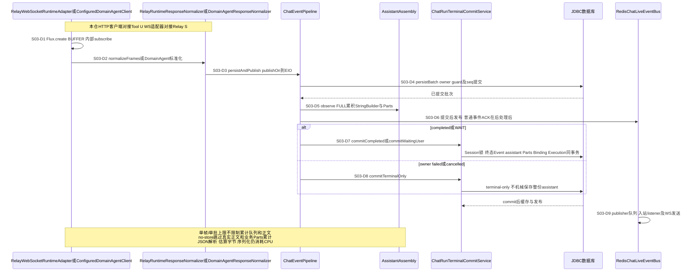
```mermaid
sequenceDiagram
    participant AD as RelayWebSocketRuntimeAdapter或ConfiguredDomainAgentClient
    participant N as RelayRuntimeResponseNormalizer或DomainAgentResponseNormalizer
    participant P as ChatEventPipeline
    participant ASM as AssistantAssembly
    participant T as ChatRunTerminalCommitService
    participant DB as JDBC数据库
    participant B as RedisChatLiveEventBus
    Note over AD,N: 本仓HTTP客户端对接Tool U WS适配器对接Relay S
    AD->>AD: S03-D1 Flux.create BUFFER 内部subscribe
    AD->>N: S03-D2 normalizeFrames或DomainAgent标准化
    N->>P: S03-D3 persistAndPublish publishOn到EIO
    P->>DB: S03-D4 persistBatch owner guard及seq提交
    DB-->>P: 已提交批次
    P->>ASM: S03-D5 observe FULL累积StringBuilder与Parts
    P->>B: S03-D6 提交后发布 普通事件ACK在后处理后
    alt completed或WAIT
        P->>T: S03-D7 commitCompleted或commitWaitingUser
        T->>DB: Session锁 终态Event assistant Parts Binding Execution同事务
    else owner failed或cancelled
        P->>T: S03-D8 commitTerminalOnly
        T->>DB: terminal-only 不机械保存整份assistant
    end
    DB-->>T: commit后缓存与发布
    B->>B: S03-D9 publisher队列 入站listener及WS发送
    Note over AD,ASM: 单帧/单批上限不限制累计队列和正文<br/>no-store跳过真实正文和业务Parts累计<br/>JSON解析 估算字节 序列化仍消耗CPU
```

| 步骤 | 当前保护与风险 | 加固/验收关注 |
|---|---|---|
| S03-D1-D5 | 16条/20ms/256KiB Event批次、Parts批次、单帧上限；BUFFER及全文累计仍可增长，R01/R26 | 双维度事件数/字节预算；高频小帧与长正文分别测heap/GC/CPU |
| S03-D4/D7/D8 | guard、fencing及事务防旧owner写入；慢SQL占EIO和共享池，R02/R07 | 原子终态和批处理开关两态；不可为吞吐删除guard |
| S03-D6/D9 | 发送端有队列；Redis listener未显式有界执行器，R04/R09 | 注入阻塞handler、拒绝信号可观察、FULL补读及no-store缺口统计 |

源码：[Relay BUFFER L234](../../../src/main/java/com/huawei/it/ex/one/infrastructure/runtime/relay/RelayWebSocketRuntimeAdapter.java#L234)、[DomainAgent客户端L185](../../../src/main/java/com/huawei/it/ex/one/infrastructure/runtime/domainagent/ConfiguredDomainAgentClient.java#L185)、[ChatEventPipeline L76](../../../src/main/java/com/huawei/it/ex/one/application/service/chat/ChatEventPipeline.java#L76)、[Assembly字段L27](../../../src/main/java/com/huawei/it/ex/one/application/service/chat/AssistantAssembly.java#L27)、[终态L137](../../../src/main/java/com/huawei/it/ex/one/application/service/chat/ChatRunTerminalCommitService.java#L137)、[Redis listener L86](../../../src/main/java/com/huawei/it/ex/one/infrastructure/persistence/RedisChatLiveEventBus.java#L86)。

### S04 人机交互、拒答与候选切换

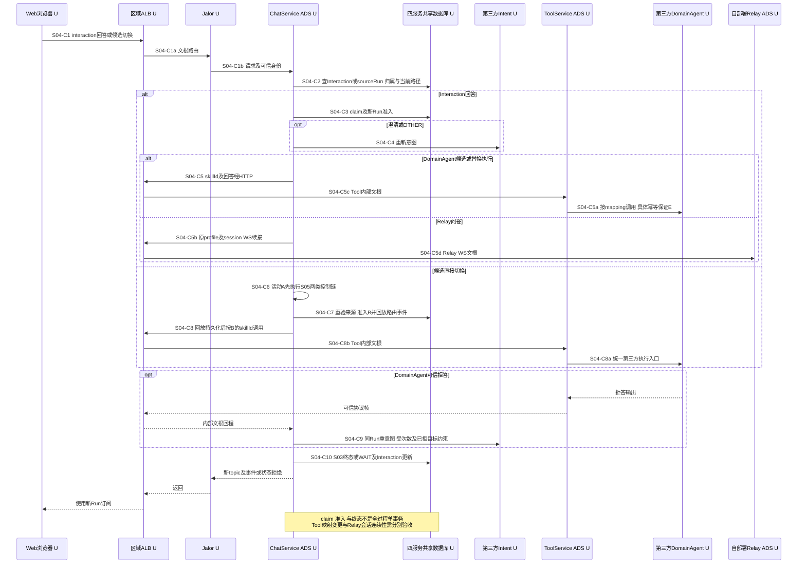
```mermaid
sequenceDiagram
    participant U as Web浏览器 U
    participant L as 区域ALB U
    participant G as Jalor U
    participant C as ChatService ADS U
    participant D as 四服务共享数据库 U
    participant I as 第三方Intent U
    participant TOOL as ToolService ADS U
    participant DA as 第三方DomainAgent U
    participant RL as 自部署Relay ADS U
    U->>L: S04-C1 interaction回答或候选切换
    L->>G: S04-C1a 文根路由
    G->>C: S04-C1b 请求及可信身份
    C->>D: S04-C2 查Interaction或sourceRun 归属与当前路径
    alt Interaction回答
        C->>D: S04-C3 claim及新Run准入
        opt 澄清或OTHER
            C->>I: S04-C4 重新意图
        end
        alt DomainAgent候选或替换执行
            C->>L: S04-C5 skillId及回答经HTTP
            L->>TOOL: S04-C5c Tool内部文根
            TOOL->>DA: S04-C5a 按mapping调用 具体幂等保证E
        else Relay问卷
            C->>L: S04-C5b 原profile及session WS续接
            L->>RL: S04-C5d Relay WS文根
        end
    else 候选直接切换
        C->>C: S04-C6 活动A先执行S05两类控制链
        C->>D: S04-C7 重验来源 准入B并回放路由事件
        C->>L: S04-C8 回放持久化后按B的skillId调用
        L->>TOOL: S04-C8b Tool内部文根
        TOOL->>DA: S04-C8a 统一第三方执行入口
    end
    opt DomainAgent可信拒答
        DA-->>TOOL: 拒答输出
        TOOL-->>L: 可信协议帧
        L-->>C: 内部文根回程
        C->>I: S04-C9 同Run重意图 受次数及已拒目标约束
    end
    C->>D: S04-C10 S03终态或WAIT及Interaction更新
    C-->>G: 新topic及事件或状态拒绝
    G-->>L: 返回
    L-->>U: 使用新Run订阅
    Note over C,D: claim 准入 与终态不是全过程单事务<br/>Tool映射变更与Relay会话连续性需分别验收
```

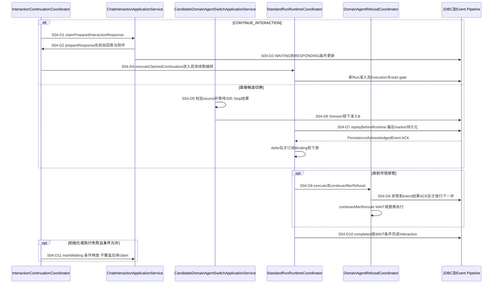
```mermaid
sequenceDiagram
    participant IC as InteractionContinuationCoordinator
    participant IS as ChatInteractionApplicationService
    participant CS as CandidateDomainAgentSwitchApplicationService
    participant RT as StandardRunRuntimeCoordinator
    participant RF as DomainAgentRefusalCoordinator
    participant DB as JDBC及Event Pipeline
    alt CONTINUE_INTERACTION
        IC->>IS: S04-D1 claimPreparedInteractionResponse
        IS->>IC: S04-D2 prepareResponse先校验回答与附件
        IS->>DB: S04-D3 WAITING到RESPONDING条件更新
        IC->>RT: S04-D4 executeClaimedContinuation进入具体续跑编排
        RT->>DB: 新Run准入及Execution与start gate
    else 直接候选切换
        CS->>CS: S04-D5 校验source并等待S05 Stop结果
        CS->>DB: S04-D6 Session锁下准入B
        RT->>DB: S04-D7 replayBeforeRuntime 最后marker持久化
        DB-->>RT: PersistenceAcknowledgedEvent ACK
        RT->>RT: defer后才订阅Binding和下游
    end
    opt 收到可信拒答
        RT->>RF: S04-D8 execute及continueAfterRefusal
        RF->>DB: S04-D9 拒答和Intent结果ACK后才放行下一步
        RF->>RF: continueAfterReroute WAIT或替换执行
    end
    RT->>DB: S04-D10 completed或WAIT条件完成Interaction
    opt 初始化或执行失败且条件允许
        IC->>IS: S04-D11 markWaiting 条件释放 不覆盖后继claim
    end
```

| 变体 | 必须保留的当前语义 | 风险与验证 |
|---|---|---|
| 澄清NEW_TURN / REUSE_ASSISTANT | 前者准入时可ANSWERED，后者completed/WAIT或async挂起事务时ANSWERED；不能统一“失败恢复WAITING” | S04-D3/D10/D11，R07/R13/R14；claim后kill、旧claim释放、新Run竞态 |
| Relay问卷 / DomainAgent拒答 | Relay续接可信profile/session；直接DomainAgent没有通用ask-user续跑状态机 | S04-C5/D8，R01/R05/R06；不根据任意业务文字触发拒答 |
| 候选A→B→C | A停止后B准入可能失败，A不自动恢复；回放≤32条/256KiB；ACK后下游才开始 | S04-D5-D7，R04/R08；STOP_PENDING/STALE_SOURCE及ACK失败不得调用B |
| 切换确认附件不支持 | Binding和route-switch-applied延迟到completed事务；不能预先宣称切换成功 | S04-D10，R07/R16/R21；stop/回滚不留下虚假应用事件 |

源码：[claim编排L122](../../../src/main/java/com/huawei/it/ex/one/application/service/chat/InteractionContinuationCoordinator.java#L122)、[条件释放L162](../../../src/main/java/com/huawei/it/ex/one/application/service/chat/ChatInteractionApplicationService.java#L162)、[候选准入L186](../../../src/main/java/com/huawei/it/ex/one/application/service/chat/ChatRunAdmissionCommitService.java#L186)、[回放屏障L172](../../../src/main/java/com/huawei/it/ex/one/application/service/chat/StandardRunRuntimeCoordinator.java#L172)、[拒答继续L259](../../../src/main/java/com/huawei/it/ex/one/application/service/chat/DomainAgentRefusalCoordinator.java#L259)。具体类型按本节差异表、上述claim/拒答方法及[Interaction状态表](#resources--22-interaction)核对；状态竞态整改见[W07](risks.md#w07)。

### S05 Stop、超时与终态竞争

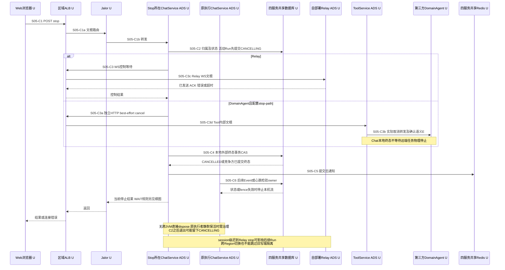
```mermaid
sequenceDiagram
    participant U as Web浏览器 U
    participant L as 区域ALB U
    participant G as Jalor U
    participant C as Stop所在ChatService ADS U
    participant O as 原执行ChatService ADS U
    participant D as 四服务共享数据库 U
    participant RL as 自部署Relay ADS U
    participant TOOL as ToolService ADS U
    participant DA as 第三方DomainAgent U
    participant R as 四服务共享Redis U
    U->>L: S05-C1 POST stop
    L->>G: S05-C1a 文根路由
    G->>C: S05-C1b 转发
    C->>D: S05-C2 归属及状态 活动Run先提交CANCELLING
    alt Relay
        C->>L: S05-C3 WS控制等待
        L->>RL: S05-C3c Relay WS文根
        RL-->>L: 已发送 ACK 错误或超时
        L-->>C: 控制结果
    else DomainAgent且配置stop-path
        C->>L: S05-C3a 独立HTTP best-effort cancel
        L->>TOOL: S05-C3d Tool内部文根
        TOOL->>DA: S05-C3b 实际取消转发及确认语义E
        Note over TOOL,DA: Chat本地终态不等待远端任务物理停止
    end
    C->>D: S05-C4 本地外部终态事务CAS
    D-->>C: CANCELLED或竞争方已提交终态
    C->>R: S05-C5 提交后通知
    O->>D: S05-C6 后续Event或心跳检验owner
    D-->>O: 状态或fence失效时停止本机流
    C-->>G: 当前停止结果 WAIT规则另见细图
    G-->>L: 返回
    L-->>U: 结果或连接错误
    Note over C,O: 无跨JVM直接dispose 原执行者静默保活时需治理<br/>C2之后退出可能留下CANCELLING
    Note over C,RL: session级迟到Relay stop可影响后续Run<br/>跨Region切换也不能跳过旧写端隔离
```

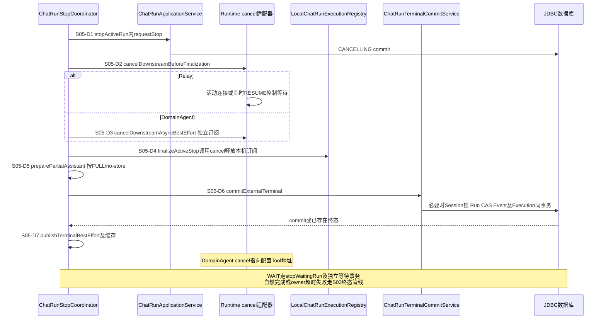
```mermaid
sequenceDiagram
    participant ST as ChatRunStopCoordinator
    participant RUN as ChatRunApplicationService
    participant AD as Runtime cancel适配器
    participant REG as LocalChatRunExecutionRegistry
    participant T as ChatRunTerminalCommitService
    participant DB as JDBC数据库
    ST->>RUN: S05-D1 stopActiveRun内requestStop
    RUN->>DB: CANCELLING commit
    ST->>AD: S05-D2 cancelDownstreamBeforeFinalization
    alt Relay
        AD->>AD: 活动连接或临时RESUME控制等待
    else DomainAgent
        ST->>AD: S05-D3 cancelDownstreamAsyncBestEffort 独立订阅
    end
    ST->>REG: S05-D4 finalizeActiveStop调用cancel释放本机订阅
    ST->>ST: S05-D5 preparePartialAssistant 按FULL/no-store
    ST->>T: S05-D6 commitExternalTerminal
    T->>DB: 必要时Session锁 Run CAS Event及Execution同事务
    DB-->>ST: commit或已存在终态
    ST->>ST: S05-D7 publishTerminalBestEffort及缓存
    Note over AD: DomainAgent cancel指向配置Tool地址
    Note over ST,DB: WAIT走stopWaitingRun及独立等待事务<br/>自然完成或owner超时失败走S03终态管线
```

| 步骤 | 当前保证边界 | 风险与加固 |
|---|---|---|
| S05-D1到D6 | CANCELLING仍阻止新Run；停止方可在中间退出 | R14：持久取消状态的有界治理；quiet owner持续heartbeat条件必须测 |
| S05-D2/D3 | Relay 5s控制等待可因发送完成结束，临时握手另计；固定专家Stop后保持ACTIVE并续用同runtimeSession；DA cancel可未配置或后台继续 | R05/R06：远端代次隔离及底层取消期限；不能把本地CANCELLED等同远端已停 |
| S05-D6/D7 | 自然完成/Stop/回调只允许终态胜者；提交后发布无可靠确认 | R02/R04：真实DB竞争与commit后kill；无partial时不保证最后屏幕正文已入历史 |

源码：[stopActiveRun L160](../../../src/main/java/com/huawei/it/ex/one/application/service/chat/ChatRunStopCoordinator.java#L160)、[下游控制L358](../../../src/main/java/com/huawei/it/ex/one/application/service/chat/ChatRunStopCoordinator.java#L358)、[external terminal L230](../../../src/main/java/com/huawei/it/ex/one/application/service/chat/ChatRunTerminalCommitService.java#L230)、[Relay interrupt L1380](../../../src/main/java/com/huawei/it/ex/one/infrastructure/runtime/relay/RelayWebSocketRuntimeAdapter.java#L1380)。

### S06 异步挂起与结果回调

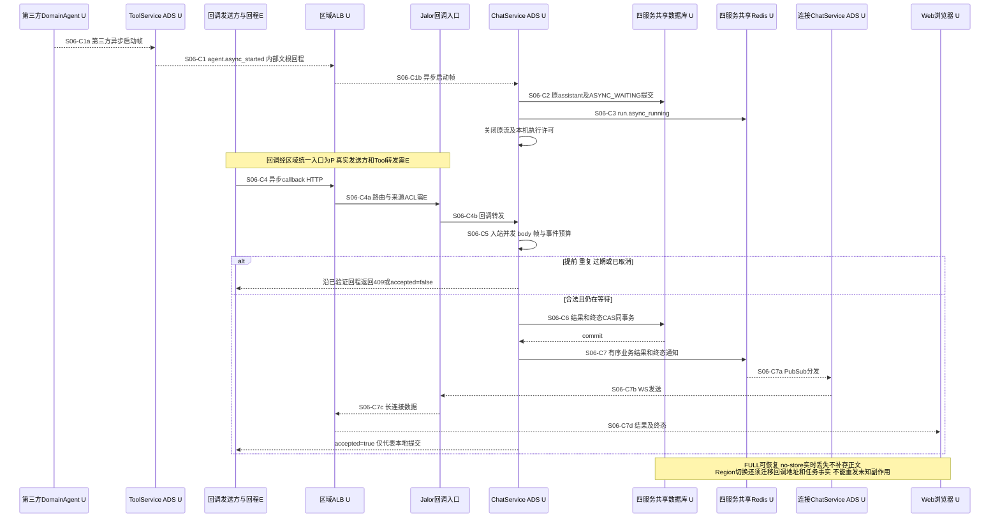
```mermaid
sequenceDiagram
    participant DA as 第三方DomainAgent U
    participant TOOL as ToolService ADS U
    participant CB as 回调发送方与回程E
    participant L as 区域ALB U
    participant G as Jalor回调入口
    participant C as ChatService ADS U
    participant D as 四服务共享数据库 U
    participant R as 四服务共享Redis U
    participant W as 连接ChatService ADS U
    participant U as Web浏览器 U
    DA-->>TOOL: S06-C1a 第三方异步启动帧
    TOOL-->>L: S06-C1 agent.async_started 内部文根回程
    L-->>C: S06-C1b 异步启动帧
    C->>D: S06-C2 原assistant及ASYNC_WAITING提交
    C->>R: S06-C3 run.async_running
    C->>C: 关闭原流及本机执行许可
    Note over CB,G: 回调经区域统一入口为P 真实发送方和Tool转发需E
    CB->>L: S06-C4 异步callback HTTP
    L->>G: S06-C4a 路由与来源ACL需E
    G->>C: S06-C4b 回调转发
    C->>C: S06-C5 入站并发 body 帧与事件预算
    alt 提前 重复 过期或已取消
        C-->>CB: 沿已验证回程返回409或accepted=false
    else 合法且仍在等待
        C->>D: S06-C6 结果和终态CAS同事务
        D-->>C: commit
        C->>R: S06-C7 有序业务结果和终态通知
        R-->>W: S06-C7a PubSub分发
        W-->>G: S06-C7b WS发送
        G-->>L: S06-C7c 长连接数据
        L-->>U: S06-C7d 结果及终态
        C-->>CB: accepted=true 仅代表本地提交
    end
    Note over D,U: FULL可恢复 no-store实时丢失不补存正文<br/>Region切换还须迁移回调地址和任务事实 不能重发未知副作用
```

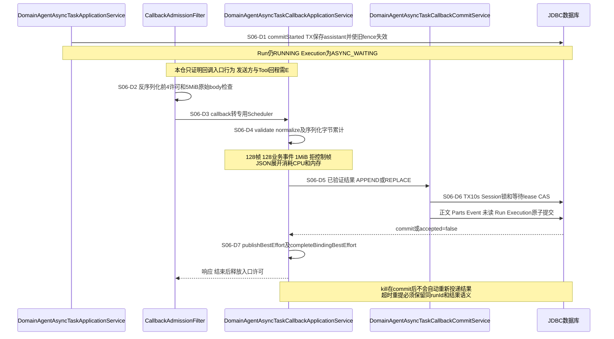
```mermaid
sequenceDiagram
    participant AS as DomainAgentAsyncTaskApplicationService
    participant F as CallbackAdmissionFilter
    participant CB as DomainAgentAsyncTaskCallbackApplicationService
    participant COM as DomainAgentAsyncTaskCallbackCommitService
    participant DB as JDBC数据库
    AS->>DB: S06-D1 commitStarted TX保存assistant并使旧fence失效
    Note over AS,DB: Run仍RUNNING Execution为ASYNC_WAITING
    Note over F,CB: 本仓只证明回调入口行为 发送方与Tool回程需E
    F->>F: S06-D2 反序列化前4许可和5MiB原始body检查
    F->>CB: S06-D3 callback转专用Scheduler
    CB->>CB: S06-D4 validate normalize及序列化字节累计
    Note over CB: 128帧 128业务事件 1MiB 拒控制帧<br/>JSON展开消耗CPU和内存
    CB->>COM: S06-D5 已验证结果 APPEND或REPLACE
    COM->>DB: S06-D6 TX10s Session锁和等待lease CAS
    COM->>DB: 正文 Parts Event 未读 Run Execution原子提交
    DB-->>CB: commit或accepted=false
    CB->>CB: S06-D7 publishBestEffort及completeBindingBestEffort
    CB-->>F: 响应 结束后释放入口许可
    Note over CB,DB: kill在commit后不会自动重新投递结果<br/>超时重提必须保留同runId和结果语义
```

| 变体/步骤 | 当前保护 | 风险与验证 |
|---|---|---|
| S06-D1 | 默认异步关闭；开启后默认24h lease；原流结束释放执行许可 | R02/R13：挂起总量无独立配额；到期积压与正常治理争资源 |
| S06-D2-D4 | 入站原始body与标准化事件分层限额；提前409和Retry-After，busy429 | R26：深层/高展开JSON、临界body、许可释放；逻辑小结果不代表原始解析成本小 |
| S06-D5-D7 | 并发终态CAS；纯终态帧不会REPLACE清空正文；FAILED可携带部分结果 | R04/R09：APPEND精确拼接、REPLACE只删本Run旧Parts；回调响应丢失与重复回调 |

源码：[挂起commitStarted L60](../../../src/main/java/com/huawei/it/ex/one/application/service/chat/DomainAgentAsyncTaskApplicationService.java#L60)、[callback L84](../../../src/main/java/com/huawei/it/ex/one/application/service/chat/DomainAgentAsyncTaskCallbackApplicationService.java#L84)、[normalize L177](../../../src/main/java/com/huawei/it/ex/one/application/service/chat/DomainAgentAsyncTaskCallbackApplicationService.java#L177)、[提交后发布L316](../../../src/main/java/com/huawei/it/ex/one/application/service/chat/DomainAgentAsyncTaskCallbackApplicationService.java#L316)。S06-D2和S06-D6分别对应[doFilterInternal L85](../../../src/main/java/com/huawei/it/ex/one/interfaces/chat/DomainAgentAsyncTaskCallbackAdmissionFilter.java#L85)和[commit L64](../../../src/main/java/com/huawei/it/ex/one/application/service/chat/DomainAgentAsyncTaskCallbackCommitService.java#L64)；图中未展开的分支以方法实现和[Run/Execution状态表](#resources--21-run和execution分开核对)核对。

### S07 连接、补读与恢复风暴

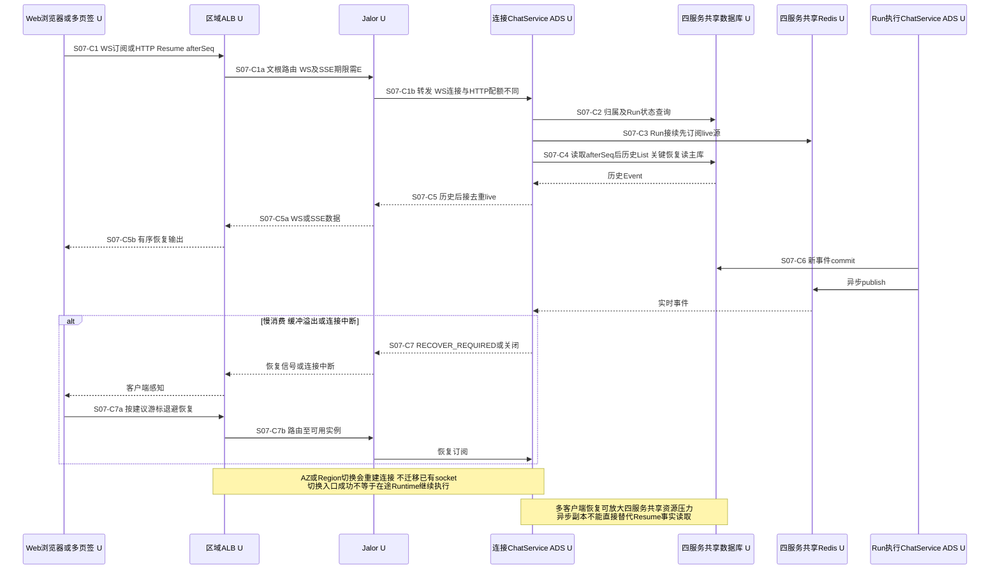
```mermaid
sequenceDiagram
    participant U as Web浏览器或多页签 U
    participant L as 区域ALB U
    participant G as Jalor U
    participant C as 连接ChatService ADS U
    participant D as 四服务共享数据库 U
    participant R as 四服务共享Redis U
    participant O as Run执行ChatService ADS U
    U->>L: S07-C1 WS订阅或HTTP Resume afterSeq
    L->>G: S07-C1a 文根路由 WS及SSE期限需E
    G->>C: S07-C1b 转发 WS连接与HTTP配额不同
    C->>D: S07-C2 归属及Run状态查询
    C->>R: S07-C3 Run接续先订阅live源
    C->>D: S07-C4 读取afterSeq后历史List 关键恢复读主库
    D-->>C: 历史Event
    C-->>G: S07-C5 历史后接去重live
    G-->>L: S07-C5a WS或SSE数据
    L-->>U: S07-C5b 有序恢复输出
    O->>D: S07-C6 新事件commit
    O->>R: 异步publish
    R-->>C: 实时事件
    alt 慢消费 缓冲溢出或连接中断
        C-->>G: S07-C7 RECOVER_REQUIRED或关闭
        G-->>L: 恢复信号或连接中断
        L-->>U: 客户端感知
        U->>L: S07-C7a 按建议游标退避恢复
        L->>G: S07-C7b 路由至可用实例
        G->>C: 恢复订阅
    end
    Note over L,C: AZ或Region切换会重建连接 不迁移已有socket<br/>切换入口成功不等于在途Runtime继续执行
    Note over C,D: 多客户端恢复可放大四服务共享资源压力<br/>异步副本不能直接替代Resume事实读取
```

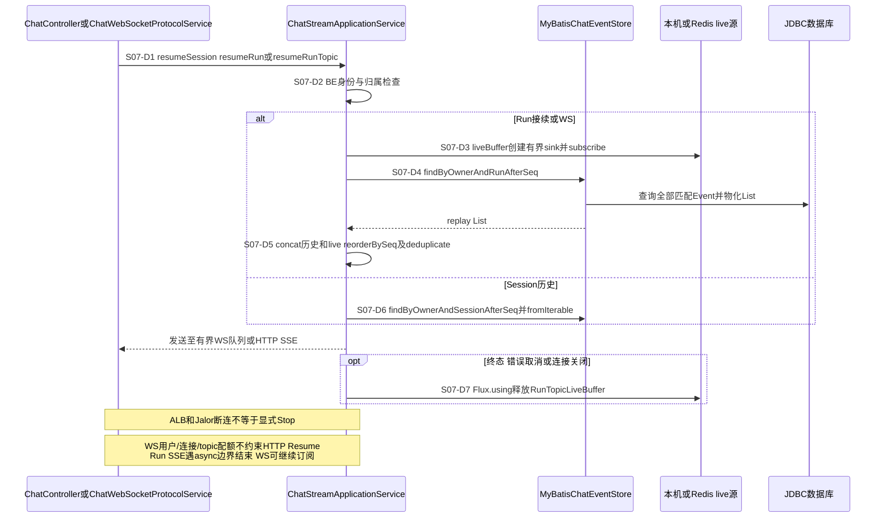
```mermaid
sequenceDiagram
    participant API as ChatController或ChatWebSocketProtocolService
    participant S as ChatStreamApplicationService
    participant STORE as MyBatisChatEventStore
    participant LIVE as 本机或Redis live源
    participant DB as JDBC数据库
    API->>S: S07-D1 resumeSession resumeRun或resumeRunTopic
    S->>S: S07-D2 BE身份与归属检查
    alt Run接续或WS
        S->>LIVE: S07-D3 liveBuffer创建有界sink并subscribe
        S->>STORE: S07-D4 findByOwnerAndRunAfterSeq
        STORE->>DB: 查询全部匹配Event并物化List
        STORE-->>S: replay List
        S->>S: S07-D5 concat历史和live reorderBySeq及deduplicate
    else Session历史
        S->>STORE: S07-D6 findByOwnerAndSessionAfterSeq并fromIterable
    end
    S-->>API: 发送至有界WS队列或HTTP SSE
    opt 终态 错误取消或连接关闭
        S->>LIVE: S07-D7 Flux.using释放RunTopicLiveBuffer
    end
    Note over API,S: ALB和Jalor断连不等于显式Stop
    Note over API,S: WS用户/连接/topic配额不约束HTTP Resume<br/>Run SSE遇async边界结束 WS可继续订阅
```

| 步骤 | 当前保护与缺口 | 加固/验收关注 |
|---|---|---|
| S07-D2 | owner校验已有；Resume/WS未统一拒绝已删除Session，R17 | 统一可访问状态语义，删除后新订阅与已有订阅分别测 |
| S07-D3-D6 | live有界、保序去重；历史List无分页、HTTP无独立恢复配额，R03/R02/R09 | 游标分页、恢复许可、live衔接无重无漏；正常Run和Stop混合压测 |
| S07-C7/D5 | 服务端可给较小recoveryAfterSeq；sequence为全局游标而非topic连续号，R20 | 联调样例与生产前端分开验；不使用本地最大seq跳过迟到事件 |

源码：[resumeSession L251](../../../src/main/java/com/huawei/it/ex/one/application/service/chat/ChatStreamApplicationService.java#L251)、[resumeRunTopic L298](../../../src/main/java/com/huawei/it/ex/one/application/service/chat/ChatStreamApplicationService.java#L298)、[liveBuffer L350](../../../src/main/java/com/huawei/it/ex/one/application/service/chat/ChatStreamApplicationService.java#L350)、[Run live tail L429](../../../src/main/java/com/huawei/it/ex/one/application/service/chat/ChatStreamApplicationService.java#L429)。

### S08 会话、历史与管理

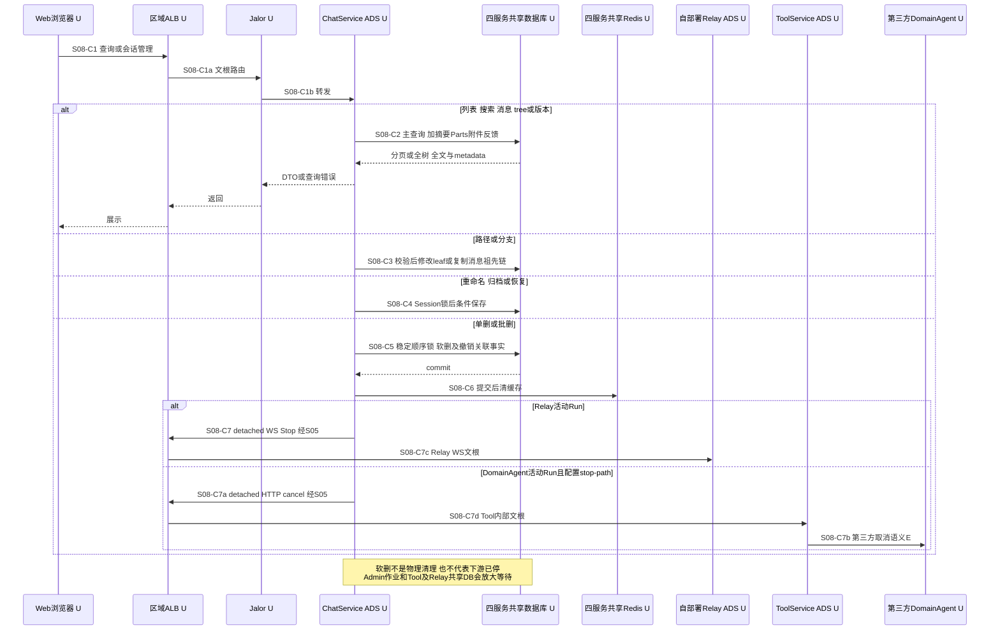
```mermaid
sequenceDiagram
    participant U as Web浏览器 U
    participant L as 区域ALB U
    participant G as Jalor U
    participant C as ChatService ADS U
    participant D as 四服务共享数据库 U
    participant R as 四服务共享Redis U
    participant RL as 自部署Relay ADS U
    participant TOOL as ToolService ADS U
    participant DA as 第三方DomainAgent U
    U->>L: S08-C1 查询或会话管理
    L->>G: S08-C1a 文根路由
    G->>C: S08-C1b 转发
    alt 列表 搜索 消息 tree或版本
        C->>D: S08-C2 主查询 加摘要Parts附件反馈
        D-->>C: 分页或全树 全文与metadata
        C-->>G: DTO或查询错误
        G-->>L: 返回
        L-->>U: 展示
    else 路径或分支
        C->>D: S08-C3 校验后修改leaf或复制消息祖先链
    else 重命名 归档或恢复
        C->>D: S08-C4 Session锁后条件保存
    else 单删或批删
        C->>D: S08-C5 稳定顺序锁 软删及撤销关联事实
        D-->>C: commit
        C->>R: S08-C6 提交后清缓存
        alt Relay活动Run
            C->>L: S08-C7 detached WS Stop 经S05
            L->>RL: S08-C7c Relay WS文根
        else DomainAgent活动Run且配置stop-path
            C->>L: S08-C7a detached HTTP cancel 经S05
            L->>TOOL: S08-C7d Tool内部文根
            TOOL->>DA: S08-C7b 第三方取消语义E
        end
    end
    Note over C,D: 软删不是物理清理 也不代表下游已停<br/>Admin作业和Tool及Relay共享DB会放大等待
```

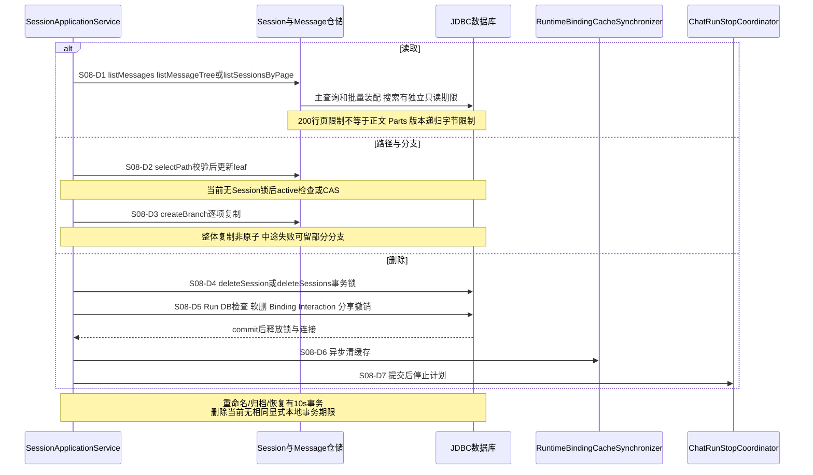
```mermaid
sequenceDiagram
    participant S as SessionApplicationService
    participant REPO as Session与Message仓储
    participant DB as JDBC数据库
    participant CACHE as RuntimeBindingCacheSynchronizer
    participant STOP as ChatRunStopCoordinator
    alt 读取
        S->>REPO: S08-D1 listMessages listMessageTree或listSessionsByPage
        REPO->>DB: 主查询和批量装配 搜索有独立只读期限
        Note over REPO,DB: 200行页限制不等于正文 Parts 版本递归字节限制
    else 路径与分支
        S->>REPO: S08-D2 selectPath校验后更新leaf
        Note over S,DB: 当前无Session锁后active检查或CAS
        S->>REPO: S08-D3 createBranch逐项复制
        Note over S,DB: 整体复制非原子 中途失败可留部分分支
    else 删除
        S->>DB: S08-D4 deleteSession或deleteSessions事务锁
        S->>DB: S08-D5 Run DB检查 软删 Binding Interaction 分享撤销
        DB-->>S: commit后释放锁与连接
        S->>CACHE: S08-D6 异步清缓存
        S->>STOP: S08-D7 提交后停止计划
    end
    Note over S,DB: 重命名/归档/恢复有10s事务<br/>删除当前无相同显式本地事务期限
```

| 步骤 | 风险 | 加固/验收关注 |
|---|---|---|
| S08-D1 | R02/R11/R15/R26；ILIKE、全tree、版本递归、大metadata、手工索引 | EXPLAIN真实数据、行/字节/时间预算；索引有效性及混合负载 |
| S08-D2/D3 | R18/R24；路径与运行中终态竞争、分支部分成功 | 明确运行中切路径语义；Session锁后重验/原子复制策略，故障点逐项注入 |
| S08-D4-D7 | R07已有部分修复不能重列；剩余R23锁等待、R14调度丢失、R18并发share | 反向批次、外部持锁、delete与准入/分享并发；commit后kill；不宣称删除已物理停止Runtime |

源码：[查询L216](../../../src/main/java/com/huawei/it/ex/one/application/service/chat/SessionApplicationService.java#L216)、[删除L401](../../../src/main/java/com/huawei/it/ex/one/application/service/chat/SessionApplicationService.java#L401)、[selectPath L836](../../../src/main/java/com/huawei/it/ex/one/application/service/chat/SessionApplicationService.java#L836)、[createBranch L848](../../../src/main/java/com/huawei/it/ex/one/application/service/chat/SessionApplicationService.java#L848)、[消息查询SQL L402](../../../src/main/resources/mapper/memory/ChatMessageMapper.opengauss.xml#L402)。

### S09 文档与附件生命周期

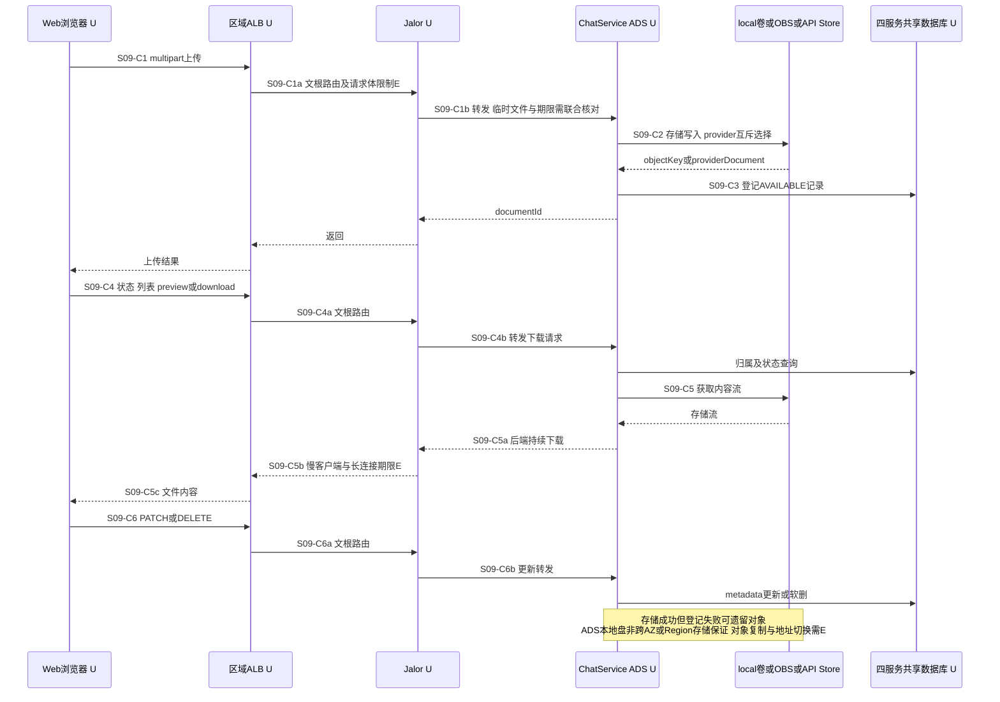
```mermaid
sequenceDiagram
    participant U as Web浏览器 U
    participant L as 区域ALB U
    participant G as Jalor U
    participant C as ChatService ADS U
    participant S as local卷或OBS或API Store
    participant D as 四服务共享数据库 U
    U->>L: S09-C1 multipart上传
    L->>G: S09-C1a 文根路由及请求体限制E
    G->>C: S09-C1b 转发 临时文件与期限需联合核对
    C->>S: S09-C2 存储写入 provider互斥选择
    S-->>C: objectKey或providerDocument
    C->>D: S09-C3 登记AVAILABLE记录
    C-->>G: documentId
    G-->>L: 返回
    L-->>U: 上传结果
    U->>L: S09-C4 状态 列表 preview或download
    L->>G: S09-C4a 文根路由
    G->>C: S09-C4b 转发下载请求
    C->>D: 归属及状态查询
    C->>S: S09-C5 获取内容流
    S-->>C: 存储流
    C-->>G: S09-C5a 后端持续下载
    G-->>L: S09-C5b 慢客户端与长连接期限E
    L-->>U: S09-C5c 文件内容
    U->>L: S09-C6 PATCH或DELETE
    L->>G: S09-C6a 文根路由
    G->>C: S09-C6b 更新转发
    C->>D: metadata更新或软删
    Note over C,S: 存储成功但登记失败可遗留对象<br/>ADS本地盘非跨AZ或Region存储保证 对象复制与地址切换需E
```

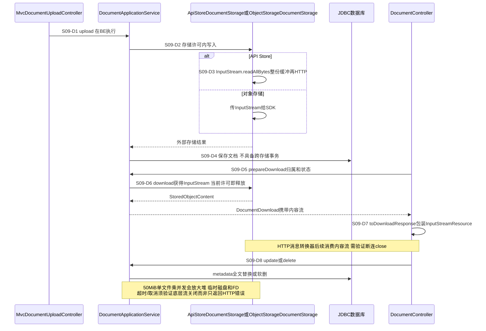
```mermaid
sequenceDiagram
    participant MVC as MvcDocumentUploadController
    participant DOC as DocumentApplicationService
    participant STORE as ApiStoreDocumentStorage或ObjectStorageDocumentStorage
    participant DB as JDBC数据库
    participant API as DocumentController
    MVC->>DOC: S09-D1 upload 在BE执行
    DOC->>STORE: S09-D2 存储许可内写入
    alt API Store
        STORE->>STORE: S09-D3 InputStream.readAllBytes整份缓冲再HTTP
    else 对象存储
        STORE->>STORE: 传InputStream给SDK
    end
    STORE-->>DOC: 外部存储结果
    DOC->>DB: S09-D4 保存文档 不具备跨存储事务
    API->>DOC: S09-D5 prepareDownload归属和状态
    DOC->>STORE: S09-D6 download获得InputStream 当前许可即释放
    STORE-->>DOC: StoredObjectContent
    DOC-->>API: DocumentDownload携带内容流
    API->>API: S09-D7 toDownloadResponse包装InputStreamResource
    Note over API,STORE: HTTP消息转换器后续消费内容流 需验证断连close
    API->>DOC: S09-D8 update或delete
    DOC->>DB: metadata全文替换或软删
    Note over DOC,STORE: 50MiB单文件乘并发会放大堆 临时磁盘和FD<br/>超时/取消须验证底层流关闭而非只返回HTTP错误
```

| 步骤 | 当前保护与风险 | 加固/验收关注 |
|---|---|---|
| S09-D2-D4 | 单文件及provider并发限额存在；API整份缓冲，跨存储无原子回滚，R12 | 在途字节许可、流式/临时文件、存储成功DB失败的清理对账 |
| S09-D5-D7 | 后端归属校验，preview为后端下载；许可未覆盖完整下载，R12 | 慢客户端与cancel下stream/FD/SDK连接归还；磁盘满 |
| S09-D8 | PATCH可替换服务端providerDocument，R21；OBS当前未显式启用证书及hostname验证，R22 | metadata白名单及可信字段；受信/不受信CA与错hostname验收 |

源码：[upload L74](../../../src/main/java/com/huawei/it/ex/one/application/service/document/DocumentApplicationService.java#L74)、[update L110](../../../src/main/java/com/huawei/it/ex/one/application/service/document/DocumentApplicationService.java#L110)、[prepareDownload L169](../../../src/main/java/com/huawei/it/ex/one/application/service/document/DocumentApplicationService.java#L169)、[API Store缓冲L206](../../../src/main/java/com/huawei/it/ex/one/infrastructure/storage/api/ApiStoreDocumentStorage.java#L206)、[后端下载L192](../../../src/main/java/com/huawei/it/ex/one/interfaces/document/DocumentController.java#L192)、[OBS配置L28](../../../src/main/java/com/huawei/it/ex/one/infrastructure/storage/object/s3/HuaweiS3StorageConfiguration.java#L28)。

### S10 分享、投递与反馈

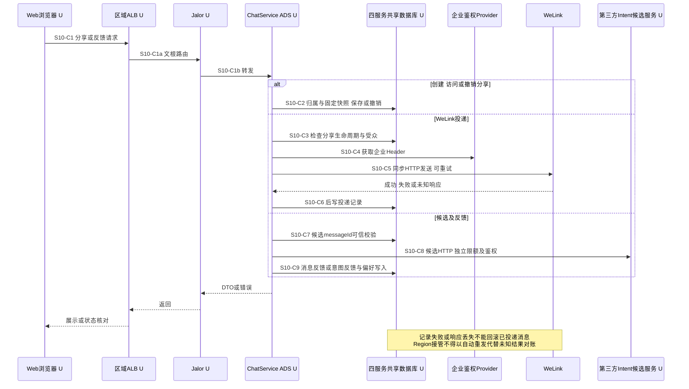
```mermaid
sequenceDiagram
    participant U as Web浏览器 U
    participant L as 区域ALB U
    participant G as Jalor U
    participant C as ChatService ADS U
    participant D as 四服务共享数据库 U
    participant H as 企业鉴权Provider
    participant W as WeLink
    participant I as 第三方Intent候选服务 U
    U->>L: S10-C1 分享或反馈请求
    L->>G: S10-C1a 文根路由
    G->>C: S10-C1b 转发
    alt 创建 访问或撤销分享
        C->>D: S10-C2 归属与固定快照 保存或撤销
    else WeLink投递
        C->>D: S10-C3 检查分享生命周期与受众
        C->>H: S10-C4 获取企业Header
        C->>W: S10-C5 同步HTTP发送 可重试
        W-->>C: 成功 失败或未知响应
        C->>D: S10-C6 后写投递记录
    else 候选及反馈
        C->>D: S10-C7 候选messageId可信校验
        C->>I: S10-C8 候选HTTP 独立限额及鉴权
        C->>D: S10-C9 消息反馈或意图反馈与偏好写入
    end
    C-->>G: DTO或错误
    G-->>L: 返回
    L-->>U: 展示或状态核对
    Note over D,W: 记录失败或响应丢失不能回滚已投递消息<br/>Region接管不得以自动重发代替未知结果对账
```

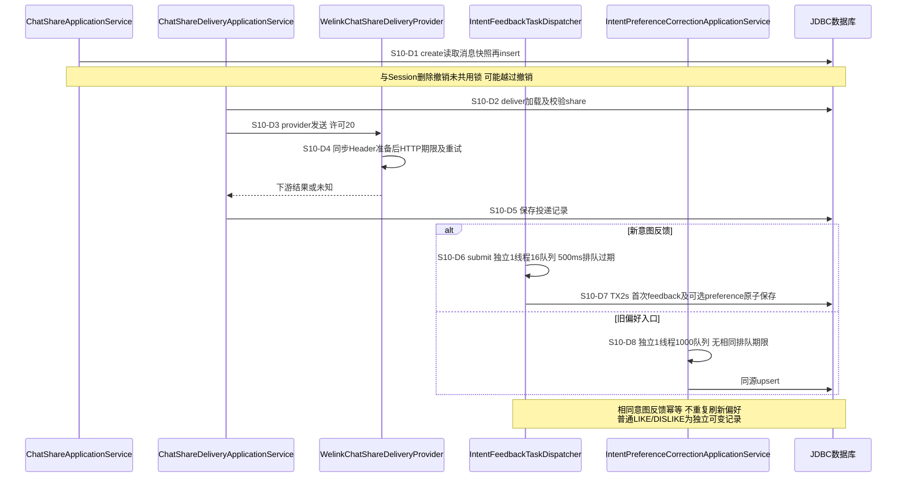
```mermaid
sequenceDiagram
    participant SHARE as ChatShareApplicationService
    participant DEL as ChatShareDeliveryApplicationService
    participant W as WelinkChatShareDeliveryProvider
    participant FB as IntentFeedbackTaskDispatcher
    participant PREF as IntentPreferenceCorrectionApplicationService
    participant DB as JDBC数据库
    SHARE->>DB: S10-D1 create读取消息快照再insert
    Note over SHARE,DB: 与Session删除撤销未共用锁 可能越过撤销
    DEL->>DB: S10-D2 deliver加载及校验share
    DEL->>W: S10-D3 provider发送 许可20
    W->>W: S10-D4 同步Header准备后HTTP期限及重试
    W-->>DEL: 下游结果或未知
    DEL->>DB: S10-D5 保存投递记录
    alt 新意图反馈
        FB->>FB: S10-D6 submit 独立1线程16队列 500ms排队过期
        FB->>DB: S10-D7 TX2s 首次feedback及可选preference原子保存
    else 旧偏好入口
        PREF->>PREF: S10-D8 独立1线程1000队列 无相同排队期限
        PREF->>DB: 同源upsert
    end
    Note over FB,DB: 相同意图反馈幂等 不重复刷新偏好<br/>普通LIKE/DISLIKE为独立可变记录
```

| 步骤 | 当前保护与风险 | 加固/验收关注 |
|---|---|---|
| S10-D1 | 选中快照有消息数/字节上限；分享创建与删除竞态，R08/R18 | 同Session锁后重验；快照上限、权限、过期和撤销；不把撤销当召回WeLink消息 |
| S10-D3-D5 | provider许可及单次HTTP期限；鉴权在期限外，响应未知可重复投递，R06/R19 | deliveryId/下游去重或UNKNOWN对账需协议任务；发送成功记录失败必须测 |
| S10-D6-D8 | 新反馈保护已存在；旧旁路不能套用同样期限，R02/R10 | worker阻塞但队列未满、迟到任务、SQL底层超时；反馈幂等不可推导NEXT幂等 |

源码：[share create L62](../../../src/main/java/com/huawei/it/ex/one/application/service/share/ChatShareApplicationService.java#L62)、[deliver L65](../../../src/main/java/com/huawei/it/ex/one/application/service/share/ChatShareDeliveryApplicationService.java#L65)、[WeLink L62](../../../src/main/java/com/huawei/it/ex/one/infrastructure/share/WelinkChatShareDeliveryProvider.java#L62)、[反馈调度L50](../../../src/main/java/com/huawei/it/ex/one/application/service/routing/IntentFeedbackTaskDispatcher.java#L50)、[旧偏好L85](../../../src/main/java/com/huawei/it/ex/one/application/service/routing/IntentPreferenceCorrectionApplicationService.java#L85)。

### S11 可选记忆、标题与记录旁路

```mermaid
sequenceDiagram
    participant C as ChatService ADS U
    participant L as 同区域ALB内部文根 U
    participant D as 四服务共享数据库 U
    participant R as 四服务共享Redis U
    participant T as 标题HTTP Provider
    participant I as 第三方Intent U
    participant TOOL as ToolService ADS U
    participant DA as 第三方DomainAgent U
    participant RL as 自部署Relay ADS U
    opt 短期记忆启用
        C->>R: S11-C1 读短期记忆缓存
        C->>D: S11-C2 miss查询路径及历史
        C->>C: S11-C3 构建受预算的历史上下文
        alt Intent调用
            C->>I: S11-C3a 随识别请求传递约定历史
        else DomainAgent调用
            C->>L: S11-C3b skillId及上下文
            L->>TOOL: S11-C3e Tool内部文根
            TOOL->>DA: S11-C3c 实际第三方请求 U 内部处理E
        else Relay调用
            C->>L: S11-C3d WS请求上下文
            L->>RL: S11-C3f Relay WS文根
        end
    end
    opt RouteMemory或Intent记录启用
        C->>D: S11-C4 独立旁路读取或异步写入
    end
    opt 标题启用且满足条件
        C->>D: S11-C5 准入后异步查询标题候选
        C->>T: S11-C6 取许可后生成标题HTTP
        T-->>C: 标题或错误
        C->>D: S11-C7 锁后校验人工标题及版本再提交
    end
    Note over C,R: 关闭分支无对应IO 失败开放不代表底层已取消<br/>旁路预算还须计入Admin Tool Relay共享资源总量
```

```mermaid
sequenceDiagram
    participant MEM as RunMemoryContextAssembler及MemoryApplicationService
    participant TTL as SessionTitleApplicationService
    participant PROVIDER as SessionTitleProvider
    participant COM as SessionTitleCommitService
    participant DB as JDBC及Redis
    MEM->>DB: S11-D1 assemble到loadForRun Cache miss回源
    MEM->>MEM: S11-D2 token与消息裁剪 序列化计算预算
    TTL->>TTL: S11-D3 schedule独立订阅 专用4线程及队列
    TTL->>DB: S11-D4 collectCandidate 查询Session 完整轻量路径及关联Run
    TTL->>TTL: S11-D5 generateTitle才获取8许可
    TTL->>PROVIDER: S11-D6 generate 有HTTP或应用timeout
    PROVIDER-->>TTL: 生成文本
    TTL->>COM: S11-D7 generateAndCommit调度apply
    COM->>DB: S11-D8 TX2s锁Session校验ACTIVE 人工标题和nodeOrder
    DB-->>TTL: applied或skipped
    Note over TTL,DB: 前置Q和提交排队不由生成许可/HTTP期限覆盖<br/>进程退出可能丢标题任务 无可靠补跑承诺
```

| 配置变体/步骤 | 当前事实与风险 | 加固/验收关注 |
|---|---|---|
| 全部关闭 | 按具体配置短路；标题、短期历史、Intent记录各有独立开关 | 关闭态验证零对应外呼，不用启用路径风险描述默认必现故障 |
| S11-D1/D2及RouteMemory | 读取失败开放与有界队列不等于JDBC可取消，R10/R26 | 缓存miss热点、长路径、预算序列化CPU、后台线程/连接残留 |
| S11-D3-D8 | 标题有生成许可及条件提交；候选Q/排队缺完整预算，R25/R02 | 慢候选查询、阻塞token、提交锁三处分别注入；人工改名及旧结果不得覆盖 |

源码：[标题schedule L84](../../../src/main/java/com/huawei/it/ex/one/application/service/chat/SessionTitleApplicationService.java#L84)、[generateAndCommit L110](../../../src/main/java/com/huawei/it/ex/one/application/service/chat/SessionTitleApplicationService.java#L110)、[collectCandidate L164](../../../src/main/java/com/huawei/it/ex/one/application/service/chat/SessionTitleApplicationService.java#L164)、[标题apply L27](../../../src/main/java/com/huawei/it/ex/one/application/service/chat/SessionTitleCommitService.java#L27)。其他旁路的源码入口：[RouteMemory读取 L86](../../../src/main/java/com/huawei/it/ex/one/application/service/memory/RouteMemoryApplicationService.java#L86)、[读写执行器 L19](../../../src/main/java/com/huawei/it/ex/one/application/config/RouteMemoryExecutorConfiguration.java#L19)、[偏好独立执行器 L17](../../../src/main/java/com/huawei/it/ex/one/application/config/IntentPreferenceExecutorConfiguration.java#L17)、[Intent记录recordAsync L68](../../../src/main/java/com/huawei/it/ex/one/application/service/routing/IntentRecognitionRecordService.java#L68)及[记录执行器 L21](../../../src/main/java/com/huawei/it/ex/one/application/config/IntentRecordExecutorConfiguration.java#L21)。这些方法未在标题细图中逐项展开；旁路隔离整改见[W08](risks.md#w08)，默认App exclusion provider为本地配置，不能把它画成已有远程依赖。

### S12 心跳、Watchdog、缓存与部署

```mermaid
sequenceDiagram
    participant P as ADS部署及运维 U 能力E
    participant L as 区域ALB U
    participant G as Jalor U
    participant O as 原ChatService Docker U
    participant N as 其他ChatService Docker U
    participant SVC as Admin Tool Relay Docker U
    participant D as 四服务共享数据库 U
    participant R as 四服务共享Redis U
    P->>L: S12-C1 发布摘流或异常移除 P 编排需E
    L->>G: S12-C1a 路由健康实例 P 文根及探针验收E
    O->>D: S12-C2 周期heartbeat owner及fence条件续租
    N->>D: S12-C3 Watchdog扫描过期和孤儿
    opt 其他服务并发负载 U
        SVC->>D: S12-C3a 配置 作业或业务访问 具体SQL和配额E
        SVC->>R: S12-C3b 共享Redis访问 具体状态语义E
    end
    alt lease有效
        D-->>N: 不允许普通过期接管
    else lease到期或满足治理条件
        N->>D: S12-C4 CAS claim及恢复策略终态提交
        N->>R: S12-C5 提交后缓存与终态通知
    end
    P->>O: S12-C6 正常退出或故障kill 处置顺序E
    Note over O,N: 已返回runId的后台任务不能只靠HTTP drain<br/>默认恢复不承诺Runtime无损接管
    opt DB或Redis切换
        N->>D: S12-C7 重建连接后的守卫查询
        N->>R: 重新订阅及客户端受控补读
    end
    opt 主备Region切换 P 详见DEP05与DEP06
        P->>D: S12-C7a 隔离旧写端 验证复制边界和单写权威
        P->>L: S12-C7b 验证依赖后开放目标区域流量
        Note over P,R: 切换能力和AZ分布需平台E<br/>DB fence只在同一权威数据库有效 不能跨独立双写库互斥
    end
```

```mermaid
sequenceDiagram
    participant L as ChatRunLeaseApplicationService
    participant W as ChatRunWatchdogScheduler
    participant REC as ChatRunRecoveryOrchestrator
    participant REPO as ChatRunExecutionRepository
    participant DB as JDBC数据库
    participant REG as LocalChatRunExecutionRegistry
    participant LIFE as Spring资源关闭回调
    L->>REG: S12-D1 heartbeatActiveRuns采集当前claims
    L->>DB: S12-D2 renewHeartbeatBatch 默认50条TX2s
    alt 明确失权
        L->>REG: S12-D3 取消对应本机订阅
    else DB异常
        L->>L: 告警等待后续心跳或Event guard
    end
    W->>W: S12-D4 scanExpiredRuns single-flight及jitter
    W->>REC: S12-D5 operational scheduler同步recoverExpiredRuns
    REC->>DB: S12-D6 Interaction对账 初始化孤儿 async过期
    REC->>REPO: S12-D7 过期候选扫描 claim及recoverCandidates
    REPO->>DB: 条件更新fence与lease
    REC->>DB: S12-D8 策略终态或恢复事实提交
    Note over W,DB: 4恢复许可和20每轮不覆盖所有分支<br/>scan/claim无独立SQL预算可能卡single-flight
    opt 容器退出
        LIFE->>LIFE: S12-D9 scheduler shutdown及Redis listener stop
        Note over REG,LIFE: ADS AZ或Region切换属于部署编排 不是此类的方法
        Note over REG,LIFE: Registry无全量drain回调 后台Run排空未实现<br/>kill无清理回调 依赖持久lease及下一轮治理
    end
```

| 步骤 | 当前保证与缺口 | 加固/验收关注 |
|---|---|---|
| S12-D1-D3 | 心跳默认15s/普通lease90s；DB异常不立即dispose | R02/R14：持续DB故障、恢复后旧owner写入与静默CANCELLING |
| S12-D4-D8 | single-flight、jitter、部分恢复许可已有；所有治理分支未共享完整尝试/时间预算，R13 | 锁住scan/claim后下一轮可继续；孤儿/async积压与正常Run并发 |
| S12-C1/C6/C7/D9 | 部分scheduler/listener有关闭回调，Registry无显式全量drain；不能证明生产摘流/探针/后台排空有效，R27 | 分别验证rolling、kill、DB/Redis切换、配置/证书变更；采集实际RTO及任务收口时间 |
| S12-C5 | 派生缓存与PubSub均在提交后，不是可靠补发机制 | R04/R09/R15：恢复事件缺口与索引部署、DDL有效性、数据维护窗口 |

源码：[heartbeatActiveRuns L147](../../../src/main/java/com/huawei/it/ex/one/application/service/chat/ChatRunLeaseApplicationService.java#L147)、[scanExpiredRuns L55](../../../src/main/java/com/huawei/it/ex/one/application/service/chat/ChatRunWatchdogScheduler.java#L55)、[recoverExpiredRuns L116](../../../src/main/java/com/huawei/it/ex/one/application/service/chat/ChatRunRecoveryOrchestrator.java#L116)、[recoverCandidates L318](../../../src/main/java/com/huawei/it/ex/one/application/service/chat/ChatRunRecoveryOrchestrator.java#L318)。未提供的生产控制面操作不属于已验证代码保证。

### 跨场景资源与五类退出检查

统一使用本页[资源生命周期与状态表](#resources)及其五类退出检查，避免另维护摘要表。配置默认值以[application.yml](../../../src/main/resources/application.yml)和各配置类核对，生产值还需核对环境覆盖；只返回504、429或取消信号不足以证明底层资源释放，仍需实际配置和测试证据。

### 图审查与后续取证规则

1. 每组变体至少有正常、慢、失败、取消和kill检查；不存在的分支记“不适用”并给出代码依据，不能默认“通过”。
2. 每个风险必须能回指图步骤；每个加固测试必须同时断言业务结果与资源回落，尤其是错误已返回而后台仍运行的情况。
3. FULL验证已提交事件的保序、去重和恢复；no-store分别统计控制事实恢复与真实业务结果丢失，不新增正文持久化冒充修复。
4. 生产网关、真实鉴权resolver、DB/Redis拓扑、前端恢复、Relay代次顺序、存储证书与实例资源参数仍需环境证据。本文源码复核不替代这些联合演练。
5. 本文没有执行故障注入，也不把既有验证报告的本地结果改写为本基线的实验结论；测试和演练的关闭证据由闭环矩阵逐项登记。

## 资源生命周期与状态转换核对

基线：`00abae4f80b7e7e5b4d0ddca707035f1878a8ec8`，2026-09-18。与[双层时序图](#flows)、[风险登记](risks.md#risk-register)一起使用。本表描述现状；“验收要求”是整改完成条件，不能解读为已经有保护。

证据标记沿用：S=本仓源码，U=用户确认架构，P=尚未实施的目标，E=平台/联合验证。用户确认Web经区域ALB静态文根取得WCM资源，API经区域ALB按文根路由到Jalor及Chat；Chat经ToolService统一调用第三方DomainAgent，独立WS调用自部署Relay，并调用第三方Intent。Admin管理mapping、作业和页面；Admin/Tool/Relay/Chat均为ADS上的Docker服务，共享DB和Redis（U）。服务间HTTP/WS也经同区域ALB内部文根（U），具体路径/目标组/有效URL属于E。其具体表、键、连接配额、跨AZ副本及Region复制机制仍需E。

区内跨AZ、跨Region主备以及WCM/ADS容灾是P，执行入口见[DEP01–DEP06](deployment.md)。下文将共享平台资源与Chat进程资源分开列示，不能把单个Chat实例的池、fence、缓存或生命周期保护推及四服务整个部署。

### 1. 资源获取、持有和释放

| 资源/作用域 | 获取和持有 | 正常/异常/超时/取消的释放 | 进程退出残留、缺口及验收要求 |
|---|---|---|---|
| 用户速率窗口、本机租户Semaphore | `RunAdmissionControlService.acquire`在后台启动前；先记用户速率再取租户许可；默认60次/分钟、200流/租户 | `ChatRunStartCoordinator.finish`在`doFinally`关闭`RunPermitGuard`，原子防重复释放；不是HTTP返回时释放 | 本地许可随进程消失，DB仍可能RUNNING；userWindows定期清理，tenantSemaphores无对应淘汰，需测租户高基数长期占用。R02/R26 |
| 下游执行许可/本机 | `WorkloadConcurrencyLimiter`在订阅时tryAcquire；Relay与DomainAgent各自64 | `doFinally`释放，流结束/取消/WAIT/async边界均结束本次持有 | 不包括独立Stop临时连接，不代表挂起任务总量；需验证超时后socket、timer、引用也释放。R01/R05 |
| Hikari连接/Chat实例内共享 S | Chat业务、查询、事件、回调、心跳、Watchdog借用同一池，默认10；借用超时500ms。其他三服务及其他Chat实例另有连接消费，池配置E | 事务或数据库访问结束后归还；事务超时不等同所有阻塞Java代码可中断 | 连接断开后数据库回滚/锁释放依赖DB/驱动检测；事务内Redis、afterCommit回调都可能延长占用。全库预算须涵盖四服务。R02/R07/R23/R28 |
| Relay入站事件与出站队列/连接 | `RelayWebSocketRuntimeAdapter`桥接Flux、接收JSON及内部发送sink | socket/订阅终止触发清理；当前BUFFER并不提供累计字节上限 | kill后堆消失但远端任务未必停止；单帧上限不保护总回答/排队内存。R01/R05/R26 |
| DomainAgent帧/Run正文与Parts | 网络分片拼装、normalizer、assembly、batch；单帧有上限；FULL在Assembly累计正文/Parts，placeholder/no-store跳过真实正文和业务Parts累计 | 流结束及上下文释放后对象可回收；FULL终态前可能保持累计正文/结构化内容，no-store仍有帧、标准化和队列分配 | 异常路径须验证释放；即使单帧有界，长时间输出仍可能放大堆和序列化CPU。R01/R26 |
| Event IO Scheduler/实例 | 显式boundedElastic，默认16平台线程、每backing thread队列参数10000 | 任务执行/取消后释放位置；排队本身仍持上下文 | 大队列不等于无积压；进程退出丢失未提交任务，已提交事实可查。不能将队列容量当可承载Run数。R01/R02/R04 |
| Chat Redis发布/接收任务 S | 发布executor及topic队列有界；listener未显式注入执行器，库默认平台线程无限并发；其他服务也访问共享Redis U | topic/连接清理释放本机状态；发布失败可提示恢复，no-store业务事件不能补回 | Pub/Sub非可靠存储；入站线程数缺口独立于发布队列。其他服务的Redis持久语义E，不能推定可全局flush后无损恢复。R04/R09/R29 |
| WS连接/发送缓冲 | 本机每用户8、每连接8topic、每topic128订阅；Servlet发送队列256条/2MiB | 关闭/错误/超限时清理注册表、订阅及队列；发送超时须验证真实socket | 无全实例连接总预算；kill后客户端重连形成恢复压力。共享连接队列不是每topic各2MiB。R03/R09/R20 |
| Resume回放/live衔接 | 查询持久化历史List，同时维护有界live缓冲与去重窗口 | 有限历史发送结束，或Run终态/WAIT/async/客户端取消结束订阅 | HTTP Resume不受WS注册表限额；需独立准入、分页和字节/时间预算，验证取消时无漏清理。R03 |
| 文档上传临时文件/byte[] | MVC/Reactive适配临时落盘；API Store读取整文件byte[]；存储操作默认32许可 | 上传资源按try/finally清理；存储成功与元数据提交是两阶段 | 上传成功DB失败可能留孤儿对象，kill可能留临时文件；32×50MiB仅原始数组可达1.56GiB，不含副本。R12 |
| 文档下载流/FD/存储连接 | 获取InputStream时受存储许可保护；返回`InputStreamResource`后继续传输 | MVC输出转换器关闭流；构造响应异常显式close；真实断连须测试 | 现有permit在取得流后即释放，不能限制全部在途慢下载。R12 |
| 反馈/偏好/RouteMemory任务 | 反馈专用1worker+16队列/500ms；旧偏好和RouteMemory各有独立池 | 反馈等待过期不执行；已开始DB事务按自身期限；旧队列的超时语义需分别核对 | caller timeout不能证明JDBC停止；kill丢失本机待办，不能作为可靠补偿。R10 |
| 标题完整任务 | 候选读DB→生成许可8→标题HTTP→独立提交TX2s；功能默认关闭 | 生成Publisher结束释放8许可；前后阶段不在该许可范围 | 候选/提交排队仍争用DB及Session锁；kill后无可靠补跑承诺。R25 |
| 心跳、扫描guard与恢复许可 | 共享调度池；心跳15s，lease90s；Watchdog扫描30s并有抖动；recover4/takeover1 | scan guard在finally复位，恢复许可按执行结束归还 | 若底层SQL长期不返回，finally尚未执行，后续扫描被guard跳过；期限必须覆盖整轮各分支。R13/R14 |

证据入口（配置取值受环境覆盖影响）：[准入](../../../src/main/java/com/huawei/it/ex/one/application/service/chat/RunAdmissionControlService.java#L55)、[启动和许可guard](../../../src/main/java/com/huawei/it/ex/one/application/service/chat/ChatRunStartCoordinator.java#L55)、[下游许可](../../../src/main/java/com/huawei/it/ex/one/application/service/runtime/WorkloadConcurrencyLimiter.java#L60)、[事件流水线](../../../src/main/java/com/huawei/it/ex/one/application/service/chat/ChatEventPipeline.java#L75)、[下载流](../../../src/main/java/com/huawei/it/ex/one/interfaces/document/DocumentController.java#L180)、[Watchdog guard](../../../src/main/java/com/huawei/it/ex/one/application/service/chat/ChatRunWatchdogScheduler.java#L58)、[运行配置](../../../src/main/java/com/huawei/it/ex/one/application/config/ChatRunOperationalProperties.java#L20)、[应用默认配置](../../../src/main/resources/application.yml)。

上述数量限制多数为本机作用域；多实例可分别消耗，同租户粘性和负载倾斜会导致单实例先耗尽。任何资源验收都要同时观察堆、native/direct、线程、FD、连接、锁及租约余量，不以一个指标下降证明全部释放。

#### 1.1 四服务的职责、共享资源与证据边界

| 服务/组件 | 已确认职责与本仓边界 | 必须补齐的资源/状态事实 E | 故障传播与目标 P |
|---|---|---|---|
| ChatService U/S | Run/Execution、事件、消息、Interaction、Binding与恢复；实例内池和准入见上表 | ADS每实例CPU/内存/FD、数据库实际连接及长连接数、有效开关、实例/AZ分布 | 对自身限额负责，但不能替其他服务保留DB/Redis容量；治理和控制请求必须在共享资源故障时可按预算收口，R28/R29/R33 |
| ToolService U | 接收Chat可信skillId，按Admin配置mapping统一调用第三方DomainAgent；本仓只有HTTP客户端 | 每skill/provider限额、HTTP池、鉴权和总期限、重试与幂等、mapping版本、缓存、回调及Stop转发语义 | Tool异常可覆盖多个技能；按调用方及provider隔离并验证全链路预算，不能把Chat的64许可当Tool全局保护，R30 |
| Relay U | 自部署WS Runtime，Chat以profile/runtimeSessionId续接 | 会话状态位于DB/Redis/内存的比例、Redis是否承载任务、跨实例续接、远端停止代次、第三方或模型依赖、资源配额 | Chat换实例不等于Relay会话被迁移；跨AZ/Region恢复需独立证据，现阶段不承诺Runtime可靠接管，R05/R29/R34/R35 |
| AdminService U | 配置mapping、作业和页面，访问同一DB/Redis | 表/键归属、作业选主与重复执行保护、批处理连接/锁预算、配置发布/回滚/版本确认、写缓存策略 | 管理作业与大批发布可能挤占业务/治理资源；目标为有界发布、作业隔离、配置版本兼容，R28/R29/R30 |
| 技能属性API S，服务归属E | Chat独立请求skillName/isSaveSession/attachmentType；共享同次配置快照用于留存与附件判断 | 实际URL归属Admin或Tool或其他服务、缓存更新机制、跨区版本同步及权限 | 不等同Tool的执行mapping接口；未知留存配置不能通过切Region或任意缓存降级放宽策略，R16/R30 |
| 第三方Intent与DomainAgent U | Intent决定路由；DomainAgent经Tool执行；本仓不包含第三方内部保护 | 各Region出口白名单、鉴权、配额、会话与回调地址、可用区/地域相关限制 | 四服务和DB恢复不代表第三方可调用；故障与恢复同时核对外部副作用，R06/R30/R35 |

边界证据：[统一Tool请求的可信skillId](../../../src/main/java/com/huawei/it/ex/one/infrastructure/runtime/domainagent/DomainAgentChatRequestMapper.java#L53)、[HTTP执行端点](../../../src/main/java/com/huawei/it/ex/one/infrastructure/runtime/domainagent/ConfiguredDomainAgentClient.java#L66)、[Relay独立WS订阅](../../../src/main/java/com/huawei/it/ex/one/infrastructure/runtime/relay/RelayWebSocketRuntimeAdapter.java#L234)、[属性API请求](../../../src/main/java/com/huawei/it/ex/one/infrastructure/domainagentconfig/DefaultDomainAgentSkillConfigurationProvider.java#L60)。Tool/Admin/Relay的内部实现不由这些Chat客户端源码证明。

#### 1.2 平台资源生命周期与容灾验证

| 资源/作用域 | 已知持有关系 U/S | 目标及必须验证的切换语义 P/E | 风险/用例及部署场景 |
|---|---|---|---|
| 共享DB/区域写权威 | 四服务共享资源U；Chat用事务、唯一约束和owner/fence保护事实S | 四服务连接总预算及关键事务余量；跨AZ故障切换前后只有一个写权威。跨Region异步复制若丢已提交事实须按实测RPO报告，先隔离旧写端再开放新端；关键控制、权限与Resume读不能机械路由异步副本 | R28/T28；DEP02/DEP03/DEP05 |
| 共享Redis/缓存及其他服务状态 | Chat缓存与Pub/Sub S；其他三服务用途E | 逐服务键/状态清单和容量预算；先验证哪些可重建、哪些必须迁移。切换后受控回源、重新订阅，FULL补读；no-store结果不能靠Redis切换补出 | R29/T29；DEP02/DEP03/DEP05 |
| WCM静态资产与页面配置 | Web加载静态资源U；Admin负责页面配置U，两者发布联动机制E | 目标按版本发布完整资产并保留可回退版本；跨Region切换验证HTML、资源、API入口及前后端协议一致。发布源故障与已有版本访问分别演练；WCM不代理业务API | R31/T31；DEP01/DEP04 |
| 区域ALB/Jalor路由及长连接 | 文根路由到Jalor、再到业务服务U；Chat同时有HTTP、SSE和WS S | 验证每文根、TLS、首字节/idle/总期限、请求体、健康检查、摘流与重连。故障或切换会断开已有socket，不承诺连接搬迁；禁止因响应未知盲重试Run或副作用请求 | R32/T32；DEP01/DEP02/DEP05/DEP06 |
| ADS上的Docker实例与宿主故障域 | 四服务容器部署U；Chat有部分scheduler/listener关闭回调S | 验证平台跨AZ放置、重启与伸缩、镜像/配置/密钥/卷的恢复来源；有序限制准入和摘流是待落地P。不能假定ADS等同已配置反亲和、自动容灾或持久卷复制 | R33/T33；DEP02/DEP03 |
| 单AZ剩余容量 | 实际副本/AZ分布E | 目标四服务及入口跨AZ可用，共享依赖也能承受AZ损失；容量包含故障恢复、Pub/Sub重连、缓存回源和治理负载。Admin作业先验证单次执行语义，不能直接多副本重复调度 | R34/T34；DEP02 |
| 主备Region的整套业务单元 | 当前只有instanceId、DB owner/fence；没有Region所有权协议S | 主备目标包含WCM/ALB/Jalor、ADS四服务、DB/Redis、对象及配置、第三方网络/回调。接管和回切分别验证旧写端隔离、复制边界与依赖就绪；写权威不可同时开放，后台任务按可恢复/失败/未知结果分流 | R35/T35；DEP03/DEP05/DEP06 |

WCM、ALB、ADS及底层数据库/Redis故障切换能力都必须取得平台E，图中部署为U不等于容灾已通过。共享数据库和Redis的拓扑、备份、复制及数据保留须按四服务共同职责验收，不能仅凭Chat FULL历史可恢复就宣称整套系统RPO为0。

### 2. 状态转换及一致性要求

#### 2.1 Run和Execution分开核对

公开Run枚举只有`RUNNING/CANCELLING/CANCELLED/COMPLETED/WAITING_USER/FAILED`。`ASYNC_WAITING/RECOVERING`属于Execution，不能作为新的公开Run状态。见[Run枚举](../../../src/main/java/com/huawei/it/ex/one/domain/chat/ChatRunStatus.java#L13)、[Execution枚举](../../../src/main/java/com/huawei/it/ex/one/domain/chat/ChatRunExecutionStatus.java#L14)。

| 触发 | Run事实变化 | Execution/其他事实 | 必须核对的边界 |
|---|---|---|---|
| 标准准入 | 新建RUNNING并关联消息 | Execution随后独立初始化owner/fencing；run.started随后持久化 | 准入与Execution不是一个大事务；初始化前崩溃由orphan治理处理，不能宣称无窗口 |
| 正常事件 | 保持RUNNING，推进sequence | guarded append核对Run及owner/fencing | 迟到owner不能写入；no-store业务事件与持久化控制事件分开 |
| 正常完成 | RUNNING→COMPLETED | Execution闭合，FULL正文/Parts和终态按提交路径落库 | DB完成不等于前端消费；发布失败后FULL可补读 |
| 等待交互 | RUNNING→WAITING_USER | Execution→WAITING_USER，创建Interaction WAITING | 对当前Run属于终态，不继续追加业务事件；后续创建新Run |
| 交互续跑 | 原Run保持WAITING_USER，新Run为RUNNING | 对Interaction claim并绑定continueRunId | 不是把旧Run改回RUNNING；重复回答不得创建多个有效续跑 |
| async_started | Run保持RUNNING | Execution→ASYNC_WAITING，释放本机执行流/owner，保存异步期限 | 仍占会话active唯一约束；本机执行许可已经释放 |
| 合法异步回调 | RUNNING→COMPLETED或FAILED | CAS异步等待/有效期/终态；FULL结果和终态同事务 | 提前回调可重试409，重复/过期不得覆盖终态；no-store实时业务结果不可恢复 |
| 用户Stop | RUNNING→CANCELLING→CANCELLED | 本机取消＋远端best-effort取消＋终态提交 | CANCELLING仍占active约束；本地成功不保证远端已停；失败窗口由治理补偿 |
| 执行异常/超时 | RUNNING→FAILED（合法owner/外部终态路径） | Execution闭合，记录可解释错误 | 已失权者不能再自行写失败终态，必须由合法执行者收口 |
| lease过期 | Run不因时钟到期自动改变 | DB条件claim后进入RECOVERING，再执行恢复策略 | 默认策略不承诺无损重跑；已完成/取消Run不得被复活 |

数据库active唯一约束只覆盖RUNNING/CANCELLING，WAITING_USER由Interaction准入保护。会话已删除、权限不符、绑定过期等限制不能只靠上述唯一索引实现。

证据：[启动Run](../../../src/main/java/com/huawei/it/ex/one/application/service/chat/ChatRunLeaseApplicationService.java#L71)、[心跳批量续租](../../../src/main/java/com/huawei/it/ex/one/application/service/chat/ChatRunLeaseApplicationService.java#L146)、[终态提交](../../../src/main/java/com/huawei/it/ex/one/application/service/chat/ChatRunTerminalCommitService.java)、[回调提交](../../../src/main/java/com/huawei/it/ex/one/application/service/chat/DomainAgentAsyncTaskCallbackCommitService.java#L63)、[恢复编排](../../../src/main/java/com/huawei/it/ex/one/application/service/chat/ChatRunRecoveryOrchestrator.java#L116)、[Mapper更新栅栏](../../../src/main/resources/mapper/persistence/ChatRunMapper.opengauss.xml#L100)。

#### 2.2 Interaction

| 转换 | 条件与提交边界 | 验收 |
|---|---|---|
| 创建→WAITING | 当前Run产生澄清/候选/问卷等待 | 等待内容与终态对应，不能先确认后丢失事实 |
| WAITING→RESPONDING | 归属、答案、附件校验后条件claim，写continueRunId | 同interaction并发提交最多一个claim成功，不能只依赖之前查到WAITING |
| RESPONDING→ANSWERED | 普通澄清在答案/新消息/续跑准入事务中消费；复用消息型在完成/WAIT或async挂起提交中消费 | 不能统一假设下游成功才消费；已受理的普通澄清不重开，避免重复答案；async路径见[commitStarted](../../../src/main/java/com/huawei/it/ex/one/application/service/chat/DomainAgentAsyncTaskApplicationService.java#L93) |
| RESPONDING→WAITING | 可重开分支的失败补偿匹配continueRunId；tracked Relay问卷还检查出站派发阶段及Binding恢复结果 | Relay响应进outbound前失败且Binding恢复成功才可重试；恢复失败不可重开。其他复用消息型失败可markWaiting，不能据此推定其下游副作用已撤销或幂等 |
| WAITING/RESPONDING→CANCELLED | Stop、删除、不可恢复会话等对应路径 | 迟到旧Run不得解除新的claim；出站已发送后失败不自动重放 |
| WAITING→EXPIRED | 配置有效期且读取/准入检查发现过期 | 前端倒计时与数据库过期不是同一机制；默认前端代选/忽略不等于后端定时提交 |

证据：[claim与校验](../../../src/main/java/com/huawei/it/ex/one/application/service/chat/ChatInteractionApplicationService.java#L117)、[孤立claim核对](../../../src/main/java/com/huawei/it/ex/one/application/service/chat/ChatInteractionApplicationService.java#L196)、[Interaction枚举](../../../src/main/java/com/huawei/it/ex/one/domain/chat/ChatInteractionStatus.java#L10)。结合[S04交互分支与方法索引](#s04)、[S06异步挂起](#s06)核对各转换触发条件。

#### 2.3 RuntimeBinding

| 转换/状态 | 当前含义 | 风险与验证重点 |
|---|---|---|
| 新建/续接→ACTIVE | DB中的当前路由，Redis是可重建缓存 | cache命中仍须符合当前状态/配置范围；缓存异常不得替代DB事实 |
| ACTIVE→ACTIVE（完成） | DomainAgent及所有Relay Domain Expert正常完成，保持后续续接 | 按Intent、固定、聚合专家来源分别验证，不能套用旧版仅固定专家规则 |
| ACTIVE→RESUMABLE（完成） | Relay Delegate完成释放自动路由，保留实际session供再次选中时恢复 | RESUMABLE不是findActive当前路由；错误路由可能重用旧上下文 |
| RESUMABLE→ACTIVE | 路由再次选中匹配Runtime/profile并满足复用条件 | 检查provider、专家范围、session可用性，不只比较sessionId |
| ACTIVE/RESUMABLE→CANCELLED | 各自适用的显式切换、WAIT取消、删除、过期或不可恢复路径 | 普通活动Run的Stop不统一取消Binding，固定专家和DomainAgent可保留；条件更新防止旧Run取消新绑定，Relay远端session级Stop另需代次保证 |

证据：[绑定解析](../../../src/main/java/com/huawei/it/ex/one/application/service/runtime/RuntimeBindingApplicationService.java#L129)、[完成后生命周期](../../../src/main/java/com/huawei/it/ex/one/application/service/runtime/RuntimeBindingApplicationService.java#L587)、[Binding枚举](../../../src/main/java/com/huawei/it/ex/one/domain/runtime/RuntimeBindingStatus.java#L10)。TTL默认0表示业务绑定不超时；Redis TTL只是热缓存过期，不能用作业务超时清理保证。

#### 2.4 AZ/Region切换不能替代业务状态转换

本节为部署目标P的约束，不增加当前公开状态或声称已有地域状态机。

| 状态事实 | 当前边界 S | 接管/回切必须满足的条件 P/E |
|---|---|---|
| Run/Execution owner及fence | DB内条件更新和唯一约束约束同一权威事实源；只有实例ID，无Region租约/epoch | 同一数据库的跨AZ切换要验证旧连接失效和新写权威；两个独立异步复制写库可能各自通过guard，必须在部署层隔离旧写端，不能以相同代码fence证明双写安全。回切在强制停写后取得或证明最终提交位点并追平，排空前水位不能作为最终屏障 |
| Binding及runtimeSessionId | 保存provider/profile与下游session引用，不保存下游进程内上下文，也不带区域路由字段 | Tool或Relay切地址后须证明旧session可访问且属于正确业务；仅复制Binding行不足。不能为恢复悄悄替换会话或重执行未知副作用；能力不足时按既定失败/人工确认策略收口 |
| Interaction WAITING/RESPONDING | claim依赖DB原子条件及continueRunId | 控制与权限判断读当前权威；切换后先对账悬挂claim，再放开续跑。不得让双Region各自接受同一等待的不同回答 |
| Async等待与回调 | 本机许可已释放，DB保存等待期限，回调竞争同一终态 | 迁移/校验回调入口、来源ACL、Tool转发及DNS缓存；重复回调仍只在唯一权威DB竞争。已外部完成但本地事实不明的任务先对账，不因换区自动重发 |
| FULL/no-store与实时序列 | FULL恢复已存事实；no-store仅存控制和占位。Pub/Sub没有持久交付承诺 | 以目标库实际恢复点定义可恢复范围，检查复制RPO和原客户端游标；不得将旧Region未复制事件视为已恢复，或额外存no-store正文掩盖结果缺口 |
| 分享撤销/会话删除/文档状态 | 可访问性和外部投递资格依赖当前持久状态；部分Resume删除校验尚有R17缺口 | 接管后核对撤销和删除事实；业务对象实际恢复点、DB引用和权限共同验证，不能以静态包已同步代替附件可读。权限/控制读不能因只读API或readOnly事务自动走落后副本；主库读取也不替代R17代码整改 |

证据：[实例ID](../../../src/main/java/com/huawei/it/ex/one/infrastructure/id/GeneratedApplicationInstanceIdProvider.java#L25)、[当前owner校验](../../../src/main/resources/mapper/persistence/ChatRunExecutionMapper.opengauss.xml#L95)、[本库恢复claim](../../../src/main/resources/mapper/persistence/ChatRunExecutionMapper.opengauss.xml#L227)、[Binding字段](../../../src/main/java/com/huawei/it/ex/one/domain/runtime/RuntimeBinding.java#L31)、[Resume历史与live衔接](../../../src/main/java/com/huawei/it/ex/one/application/service/chat/ChatStreamApplicationService.java#L429)。对应R28/R34/R35和[DEP05接管、DEP06回切](deployment.md)。

### 3. 五类退出路径的核对表

| 退出方式 | 预期动作 | 不可推导的保证 |
|---|---|---|
| 正常结束 | 先提交合法事实，再尽力派生缓存/推送；释放本机资源 | 客户端一定收到所有实时事件 |
| 异常 | 合法owner尽力写FAILED；清理订阅、许可、timer、临时文件；外部未知结果对账 | 数据库不可用时还能立即写终态 |
| 超时 | 结束逻辑等待，传播取消；核对底层IO/JDBC是否仍占用 | Reactor timeout必定中断阻塞调用 |
| 用户/客户端取消 | 显式Stop按状态机处理；单纯浏览器断线只释放订阅连接 | 关闭WS/SSE就等于停止后台Run |
| 进程退出 | 内存清空/连接断开，其他实例依据DB租约治理，客户端限速恢复 | finally一定执行、远端任务一定停止、未提交数据或no-store结果可恢复 |

测试必须同时抓取调用方结果、DB事实、下游副作用和资源曲线，不能只断言HTTP响应或单个mock调用。

当前关闭能力限定为S：`OperationalSchedulingConfig`配置scheduler shutdown并等待最多10秒；`RedisChatLiveEventBus`关闭listener；部分专用scheduler和存储SDK有销毁回调。`LocalChatRunExecutionRegistry`没有`@PreDestroy`、批量取消或完整Run drain协议。ADS正常停止Docker不自动补足“关准入→摘流→后台Run排空→安全退出”的业务编排；这是P且需T33/T34验证。kill、AZ丢失或Region隔离更不能依赖Java finally完成。

关闭证据：[scheduler](../../../src/main/java/com/huawei/it/ex/one/application/config/OperationalSchedulingConfig.java#L37)、[Redis listener](../../../src/main/java/com/huawei/it/ex/one/infrastructure/persistence/RedisChatLiveEventBus.java#L126)、[本机registry](../../../src/main/java/com/huawei/it/ex/one/application/service/chat/LocalChatRunExecutionRegistry.java#L25)。其他三服务的退出、作业选主与Runtime恢复能力均由其负责人提供E，不能复用Chat的检查结果作为通过证据。

## 全接口与前后端交互索引

2026-09-18在 `00abae4f` 重新核对：45个Controller handler、44个唯一HTTP操作与本文及OpenAPI集合一致。接口按下表关联本页S01–S12；默认容量仍须核对有效配置。风险编号统一指当前R项，源码复核与Binding语义差异见[当前风险登记](risks.md#risk-register)和[资源状态表](#resources)。

### 口径

核对Controller与OpenAPI：45个handler对应44个唯一HTTP操作。`POST /v1/documents`有Servlet/Reactive互斥实现，生产Servlet只计一次。WS不是第45个REST操作；Actuator管理端点另列。

公共处理：企业身份和权限检查后进入Controller；多数阻塞服务以全局boundedElastic执行，MVC异步返回。反馈、候选鉴权、Event与回调另有专用资源。参数错误通常400；身份缺失401；**资源越权沿现有协议为HTTP200、body.code=ACCESS_DENIED**，前端不能只检查response.ok。运行已受理后的错误多为Event，不再改变早已返回的启动HTTP状态。

下表的S编号链接到本页双层时序图、场景差异及源码入口。资源获取、释放和作用域见[资源表](#resources)，配置默认值见[application.yml](../../../src/main/resources/application.yml)；风险和整改分别见[当前登记](risks.md#risk-register)及[加固工作包](risks.md#hardening)。

物理入口为ALB文根→Jalor→Chat；文根、身份与转发策略按实际配置验收。操作01依次关联[S01受理](#s01)、[S02路由](#s02)、[S03输出](#s03)，CONTINUE_INTERACTION和操作02另看[S04](#s04)；操作03看[S05](#s05)，异步回调看[S06](#s06)，操作06/07/08及WS看[S07](#s07)与[S12治理](#s12)。标题不是新增接口，触发来自操作01中合格的NEXT/EDIT，见[S11标题调度及提交](#s11)；结果由操作11/12/13等会话读取返回。

### 44个操作逐项覆盖

| ID | 方法与本地路径 | 视图/资源与差异 | 前端成功、失败及恢复规则 | 风险 |
|---|---|---|---|---|
| 01 | `POST /v1/chat/runs` | [S01](#s01)/[S02](#s02)；60次/用户/分钟、200订阅/租户；准入TX10s；可选[S11标题旁路](#s11) | 返回RunStart后订阅topic；超时先查stream-status，不盲目重复NEXT；active409 | R01 R02 R06 R07 R08 R25 |
| 02 | `POST /v1/chat/runs/{sourceRunId}/switch-domain-agent` | [S04](#s04)；归属及附件、Stop、Session锁、新Run、32条回放ACK | 用当前sourceRun和可信user消息；成功换B topic；409 stale/pending先刷新，不重建已成功B | R02 R05 R08 |
| 03 | `POST /v1/chat/runs/{runId}/stop` | [S05](#s05)；CANCELLING、下游取消、本地终态TX10s | 收到响应后仍按终态事实刷新；不假设远端一定停止；重复不覆盖终态 | R05 R14 |
| 04 | `POST /v1/chat/messages/{messageId}/feedback` | [S10](#s10)；普通点赞/点踩，与Intent反馈独立 | 更新消息反馈状态；可再次修改 | R02 |
| 05 | `DELETE /v1/chat/messages/{messageId}/feedback` | [S10](#s10)；取消普通消息反馈 | 清理展示；不能用来撤销不可变Intent反馈 | R02 |
| 06 | `GET /v1/chat/sessions/{sessionId}/events/resume` | [S07](#s07)；有限历史SSE，无独立配额；无分页List | afterSeq补会话历史，结束不代表新Run终态；不可等待未来回调 | R03 R17 |
| 07 | `GET /v1/chat/runs/{runId}/events/resume` | [S07](#s07)；历史+有界live；无WS注册限额 | 终态/WAIT/async或异常可结束；异常断开需查状态后退避重连 | R03 R04 R17 R20 |
| 08 | `GET /v1/chat/sessions/{sessionId}/stream-status` | [S07](#s07)；Run/Execution/Binding/Interaction及懒恢复，不是纯缓存GET | 页面刷新发现activeRun、firstSeq、async phase、selectedExpert；不紧密轮询 | R02 R13 R14 |
| 09 | `POST /v1/chat/sessions` | [S08](#s08)；会话INSERT | 返回会话，不创建Run；客户端超时后先检索，未提供通用幂等键 | R08 |
| 10 | `GET /v1/chat/sessions/apps` | [S08](#s08)；本人会话应用范围查询 | 展示筛选项，不查Intent | R11 |
| 11 | `GET /v1/chat/sessions` | [S08](#s08)；cursor/title；批量最后状态与首answer摘要 | 保持游标过滤绑定；lastRunSkillId=null；最后Run查询失败可空，首answer查询错误仍失败 | R11 R15 |
| 12 | `GET /v1/chat/sessions/page` | [S08](#s08)；keyword1到128码点，count+page TX2s（有keyword） | title旧非空参数400；超时503不回退全量；前端防抖；同最后Run返回状态/skill | R02 R11 R15 |
| 13 | `GET /v1/chat/sessions/{sessionId}` | [S08](#s08)；归属会话读取 | 无Run结果查询；不是主流程状态替代 | R02 |
| 14 | `POST /v1/chat/sessions/{sessionId}/read` | [S08](#s08)；已读水位更新 | 以已消费水位标记，不能把建立WS连接视为已读所有消息 | R02 |
| 15 | `GET /v1/chat/sessions/{sessionId}/messages` | [S08](#s08)；当前路径分页、Parts/附件/版本与反馈批量装配 | 当前assistant版本；intentFeedback在DTO关联，失败省略；普通LIKE/DISLIKE查询错误不降级 | R11 R17 |
| 16 | `GET /v1/chat/sessions/{sessionId}/messages/tree` | [S08](#s08)；全树及子数据 | 不能频繁刷新大树代替分页；无总节点/字节保护 | R11 |
| 17 | `GET /v1/chat/sessions/{sessionId}/messages/{messageId}/variants` | [S08](#s08)；sibling及关联数据，不装配versionInfo | 可查看A/B，展示不等于已切换当前path | R11 |
| 18 | `POST /v1/chat/sessions/{sessionId}/path` | [S08](#s08)；归属/未删除/消息归属检查，更新leaf；无active检查或CAS | 后续消息/候选操作基于新leaf；运行中切换有竞态，前端应避免 | R02 R08 R24 |
| 19 | `POST /v1/chat/sessions/{sessionId}/branches` | [S08](#s08)；复制祖先链快照、新session | 创建独立分支，Intent反馈不复制；失败可能留下部分分支，勿无限重试 | R18 |
| 20 | `PATCH /v1/chat/sessions/{sessionId}` | [S08](#s08)；rename TX10s，锁后最新快照 | 只改标题/人工标记；不覆盖专家scope/leaf | R02 |
| 21 | `POST /v1/chat/sessions/{sessionId}/archive` | [S08](#s08)；TX10s、锁后快照 | 归档与Stop不是同义词；按状态限制后续访问 | R02 |
| 22 | `POST /v1/chat/sessions/{sessionId}/restore` | [S08](#s08)；TX10s、锁后快照 | 恢复归档会话，不复活DELETED，不自动重启Run | R02 |
| 23 | `DELETE /v1/chat/sessions/{sessionId}` | [S08](#s08)；锁后DB停止计划、软删及关联处理；无显式TX期限 | DB删除先提交，再best-effort stop；不保证响应时远端已停 | R04 R14 R17 R18 R23 |
| 24 | `DELETE /v1/chat/sessions` | [S08](#s08)；最多100，去重、按ID稳定加锁，all-or-nothing；无显式TX期限 | 响应按请求顺序；回滚不调度缓存清理；同会话准入互斥 | R02 R04 R14 R23 |
| 25 | `POST /v1/chat/intent-candidates` | [S10](#s10)；8许可，1条role点查、独立auth、瞬态HTTP重试 | 返回裸数组；400/ACCESS_DENIED不查下游；429忙、504超时、502失败 | R02 R06 R10 |
| 26 | `POST /v1/chat/intent-preference-corrections` | [S10](#s10)；旧偏好write1+1000，原子upsert | Run受理后独立调用，成功204；失败503只重试偏好，不重建Run | R10 |
| 27 | `POST /v1/chat/runs/{runId}/intent-feedback` | [S10](#s10)；独立worker1/queue16/排队500ms、TX2s | 同请求幂等；不同反馈409；自动偏好与反馈原子；503只重试反馈 | R02 R10 |
| 28 | `GET /v1/chat/runs/{runId}/intent-feedback` | [S10](#s10)；同一feedback执行器，read TX2s | 未反馈204；主要供assistant未生成场景；历史不逐消息调用 | R02 R10 |
| 29 | `POST /v1/internal/domain-agent/async-tasks/callback` | [S06](#s06)；网关ACL、Servlet Filter4并发/5MiB，结果TX10s | accepted；409按Retry-After重试；413缩小；400修协议；不是前端用户操作 | R02 R04 R09 |
| 30 | `POST /v1/chat/messages/{messageId}/share` | [S10](#s10)；父user问题及assistant回答的单轮固定快照 | 返回share，可重复创建；不动态跟随原消息 | R18 |
| 31 | `POST /v1/chat/shares` | [S10](#s10)；选中最多50消息/5MiB快照 | 同一归属会话及祖先路径，按路径排序；不复制Intent反馈 | R11 R18 |
| 32 | `POST /v1/chat/messages/{messageId}/share/deliveries` | [S10](#s10)；单消息分享并投递，provider20并发 | 外部结果不等于投递记录原子成功；超时不盲目重发 | R06 R19 |
| 33 | `GET /v1/chat/shares/{shareId}` | [S10](#s10)；生命周期/租户/分享权限读取 | 默认为认证的同租户受众，非匿名公开；到期/撤销不可访问 | R18 |
| 34 | `POST /v1/chat/shares/{shareId}/deliveries` | [S10](#s10)；已有快照外部投递 | WeLink默认关闭；失败可能已在远端产生副作用 | R06 R19 |
| 35 | `DELETE /v1/chat/shares/{shareId}` | [S10](#s10)；撤销分享 | 撤销本地读取资格，不召回已发外部消息 | R18 |
| 36 | `GET /v1/chat/shares` | [S10](#s10)；owner分页分享列表 | 不触发外部投递 | R02 |
| 37 | `POST /v1/documents` | [S09](#s09)；Servlet multipart50MiB/60MiB，存储32 | 获得AVAILABLE documentId后用于Run；失败有孤儿对象可能 | R12 R21 R22 |
| 38 | `GET /v1/documents` | [S09](#s09)；owner分页元数据 | 不下载所有文件，不表示已解析正文 | R02 |
| 39 | `GET /v1/documents/{documentId}` | [S09](#s09)；owner单元数据 | metadata包含provider信息，须区分可信与可编辑部分 | R21 |
| 40 | `PATCH /v1/documents/{documentId}` | [S09](#s09)；名称/metadata更新 | 当前可整体替换metadata，存在providerDocument信任边界风险 | R21 |
| 41 | `DELETE /v1/documents/{documentId}` | [S09](#s09)；软删除记录 | 不能继续作为新附件；不是立即物理删除存储对象 | R12 |
| 42 | `GET /v1/documents/{documentId}/status` | [S09](#s09)；记录状态读取 | 不是轮询领域Agent任务状态 | R02 |
| 43 | `GET /v1/documents/{documentId}/preview-url` | [S09](#s09)；返回本服务相对下载URL，mode=BACKEND_STREAM，expiresAt=null | 非预签名URL；不支持下载的provider管理文档被拒绝 | R12 R21 |
| 44 | `GET /v1/documents/{documentId}/download` | [S09](#s09)；流式响应，存储getObject后继续读流 | 取消必须关闭资源；现有限流不覆盖完整传输生命周期 | R12 R21 R22 |

### 非REST入口

| 入口 | 运行视图 | 协议、资源与故障 |
|---|---|---|
| `/v1/chat/ws` | [S07](#s07) | 身份与origin握手；控制消息subscribe/unsubscribe及保活；max-inbound16KiB；不是用WS提交query或stop。8/8/128是本机限制 |
| Actuator | [S12](#s12) | 基线只暴露默认health，DB和Redis health默认关闭；不能把health=UP当作依赖可用证明。未提供Kubernetes实际探针配置 |
| heartbeat、watchdog、lazy recovery | [S12](#s12) | owner/lease数据库治理；有本机scan guard，仍需约束全部分支SQL |
| Redis listener/publisher、WS发送/idle清理 | [S03](#s03)/[S07](#s07)/[S12](#s12) | 发布队列有界，不代表接收Executor有界；见R09 |
| 标题、RouteMemory、偏好读写、识别记录 | [S10](#s10)/[S11](#s11) | 标题区分初始标题、完整候选读取、生成8许可及TX2s；其他旁路也各有deadline/队列，不等于完全不影响主资源 |
| 提交后删除Stop、缓存同步、补偿 | [S05](#s05)/[S08](#s08)/[S12](#s12) | JVM内任务，崩溃无法保证继续；由状态查询/Watchdog部分兜底 |

### 前端统一约束

1. 每个Run使用自己的topic、runId和已消费seq；候选切换成功后才切B，旧A版本保留。
2. 意图候选只查询不写反馈。切换B成功后提交A的INCORRECT_SWITCH反馈，失败只补反馈；不要再次切换，也不要重复写旧偏好接口。
3. FIRST_EVENT/HTTP超时属于未知结果窗口，先GET状态/历史再重试有副作用请求。Feedback的同请求幂等不能推广为NEXT或share也幂等。
4. 用户关闭页面/取消SSE不是stop。显式stop调用独立接口；异步任务是否完成以Run/历史事实判断。
5. 搜索防抖约300ms，恢复/忙错误使用指数退避和抖动；不要用无间隔轮询补偿Redis故障。
6. 前端要识别body中的ACCESS_DENIED；恢复信号游标可能小于本地最大seq，必须按事件身份去重后补缺。生产前端需单独验收，不能以仓库样例自动推定已符合。
