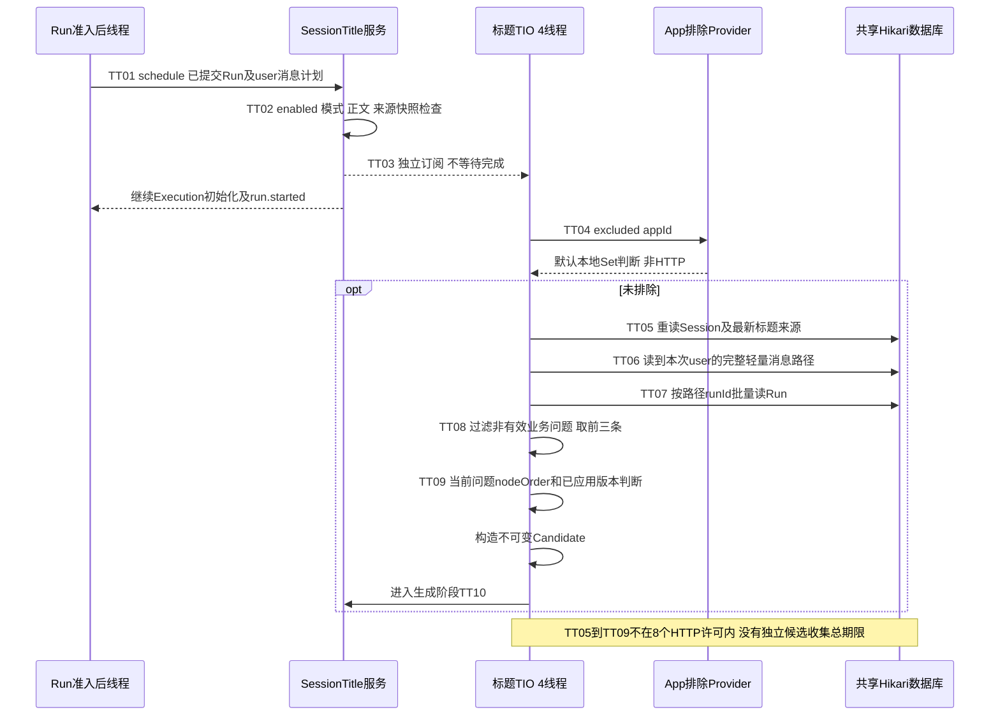
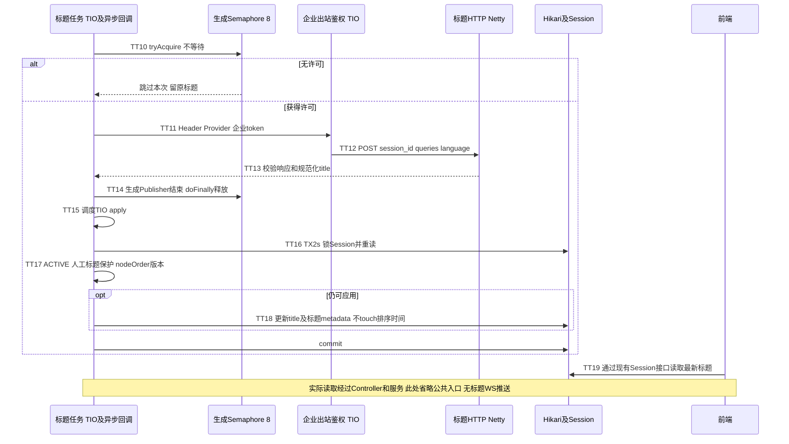

# 会话标题提炼专项运行视图

标题不是一个完全独立于Run资源的功能。**初始标题**在会话创建时同步生成；**第三方提炼**是默认关闭的旁路，在[启动步骤X03](run-startup-details.md#s5-准入后副作用execution与开始事件)调度。后者不等待结果，但仍与主流程共享数据库连接、Session锁、出站网络及进程内存。

## T1. 初始标题与触发条件

| 情况 | 当前实现 |
|---|---|
| 新Session，有正文 | `loadOrCreate`用问题生成初始标题，`shortTitle`保留前40个UTF-16代码单元；不调用标题Provider |
| 新Session，附件-only | 先解析可信附件，用首个可信附件名去最后扩展名生成初始标题；user正文仍可为空，不满足后续提炼触发条件 |
| 无可用初始文本 | 初始“新会话”，来源DEFAULT；非空初始文本来源AUTO |
| NEXT/EDIT_USER | 必须启用标题、user正文非空、非branch snapshot、当前标题来源允许自动替换，才调度提炼 |
| REGENERATE/候选切换 | 不触发。候选内部消息模式是REGENERATE，不是新问题 |
| Intent澄清/模糊候选/OTHER/问卷/路由确认 | 走专门续跑链，没有标准准入后的标题调度；以后标题候选收集也过滤带interactionId的Run |
| 人工标题/分支快照 | USER/LOCKED不自动替换；不是只在调度时检查，最终提交会再次检查最新来源 |
| 已成功采用前三个问题 | 更后的新问题通常不再提炼；EDIT的新路径/nodeOrder仍按版本规则判定。跳过判定发生在候选路径读取之后，不等于零DB访问 |

“前三个”是当前所读路径中符合业务条件的前三个user问题，不是前三条任意消息，也不是SQL LIMIT 3。标题和短期记忆不是同一个功能：即使短期记忆关闭，启用标题仍会查询消息路径和Run。

## T2. 调度与候选收集

| 步骤/源码 | 线程、调用与增长 | 时限/持有资源 | 失败状态、范围与恢复 | 保护、最小加固与验证 |
|---|---|---|---|---|
| TT01-TT02 / A、SA | X02 Run缓存同步后，调用eligibleTrigger；读取传入快照及messagePlan，零额外Q | 不持准入Session锁；标题disabled默认立即返回 | 不合格不调度，原标题不变；不影响Run成功判定 | 明确非Run审计事实；验证所有模式及附件-only触发矩阵 |
| TT03 / A、CFG | `.subscribeOn(sessionTitleIoScheduler)`后独立`.subscribe()`；4个平台线程，队列参数128/线程 | 非Boot全局虚拟BE；无独立排队deadline；满后调度拒绝记录日志 | 任务未执行/进程退出可能丢，Run继续；没有持久化待提炼记录 | R25；建议加候选阶段排队期限/按Session合并，先测拒绝率，不盲目加大队列 |
| TT04 / A、EX | 默认只查配置excludedAppIds的本地不可变Set，精确匹配；空appId不排除 | 自定义Provider可异步/阻塞；此层没有专用timeout，TT11的HTTP期限不覆盖它 | Provider异常告警并按未排除继续；不能假设任意扩展一定毫秒返回 | R25；扩展启用前约定总deadline及失败语义；默认测试断言无网络 |
| TT05 / A | TIO同步1次归属Session Q，重验来源DEFAULT/AUTO等；Session不存在则跳过 | 不在生成8许可或标题提交TX2s内；获取共享连接500ms，SQL由实际DB设置约束 | 失败被旁路onErrorResume吞并日志，原标题保留；非ACTIVE在提交时还会拦截 | R02/R25；为候选收集加只读期限是最小候选加固，非本轮代码变更 |
| TT06 / A、MSG | `findPathNodesToMessage`读到trigger user的轻量路径；不加载全部Parts/附件，但节点数H随路径增长 | 单路径查询返回H节点，不是只读3条；没有该方法专属TX2s注解 | 慢查询占TIO和Hikari；同进程Run也可能借不到连接 | R11/R25；长会话EXPLAIN与行数/字节指标；可后续投影有效问题并限制扫描预算 |
| TT07 / A、RUN | 收集distinct非空runId后一次批量仓储查Run；id集合规模≤H；空集合不查 | 1次批量调用不等于固定成本；读取Run字段并构造Map有传输/堆开销 | 查询失败不调用标题HTTP，无自动即时重试 | R25；记录H、ID数、耗时；不能以maxConcurrentRequests=8宣称该Q只并发8 |
| TT08-TT09 / A、STATE | 过滤user/非空/非branch snapshot，要求关联Run为NEXT或EDIT且无interactionId；选前3，比较queryCount/nodeOrder | O(H)内存处理；发送正文总字节未由“3条”给出硬上限 | 没有有效当前问题、已应用新版本等跳过；失败后后来合格问题可再次触发 | R25；验证前三条过滤及EDIT覆盖，输入大问题量化堆和出站体积 |

源码：A=[SessionTitleApplicationService.schedule/collectCandidate/eligibleTrigger](../../../src/main/java/com/huawei/it/ex/one/application/service/chat/SessionTitleApplicationService.java) L84/L164；SA=[StandardRunAdmissionCoordinator.completeAdmission](../../../src/main/java/com/huawei/it/ex/one/application/service/chat/StandardRunAdmissionCoordinator.java) L68；CFG=[SessionTitleProviderConfiguration](../../../src/main/java/com/huawei/it/ex/one/infrastructure/sessiontitle/SessionTitleProviderConfiguration.java)；EX=[DefaultSessionTitleAppExclusionProvider](../../../src/main/java/com/huawei/it/ex/one/infrastructure/sessiontitle/DefaultSessionTitleAppExclusionProvider.java)；MSG=[MyBatisChatMessageStore.findPathNodesToMessage](../../../src/main/java/com/huawei/it/ex/one/infrastructure/memory/MyBatisChatMessageStore.java) L426；RUN=[MyBatisChatRunRepository](../../../src/main/java/com/huawei/it/ex/one/infrastructure/persistence/MyBatisChatRunRepository.java)的findByTenantIdAndUserIdAndIds；STATE=[SessionTitleSummaryState](../../../src/main/java/com/huawei/it/ex/one/application/service/chat/SessionTitleSummaryState.java)。

## T3. 鉴权、提炼与条件提交

| 步骤/源码 | 线程、资源及副作用 | 预算、释放及空白区域 | 失败事实/前端表现 | 保护、最小加固与验收 |
|---|---|---|---|---|
| TT10 / A | 本机非等待8许可，只有到generateTitle才获取 | 不保护TT04-TT09前置查询；拒绝不排队，不自动重试 | 原标题保留，主Run继续；后续有效触发再尝试 | R25；监控busy和候选查询并发，不能用8估全部标题JDBC任务 |
| TT11 / P | `Mono.fromCallable(resolveAuthHeaders).subscribeOn(TIO)`；企业鉴权Registry根据service/operation调用扩展 | 应用外层+默认Provider内层timeout均包住生成阶段，使用同一duration，不能相加；不覆盖候选查询 | 超时取消订阅，阻塞且不响应中断的token可能仍占TIO；许可按逻辑Publisher释放 | R06/R25；token实现必须有自身IO deadline；隔离阻塞实验区分“返回超时”与“线程已释放” |
| TT12 / P | POST到配置base-url/path，body仅session_id/queries/language；WebClient共享Netty，响应读回对象 | 默认Provider启用要求显式正timeout≤30s；没有默认5s，没有即时HTTP重试；连接池获取也消耗生成期限 | 网络/非2xx/空响应/解析错误结束旁路，保留原标题 | 记录auth/HTTP分别耗时，校验Provider入参不夹带Run业务metadata |
| TT13 / A、P | Provider解析title；应用折叠空白、trim、空值拒绝，超过max-title-length默认50按Unicode码点截断 | 在生成链，CPU/JSON成本；和初始标题40 UTF-16规则不同 | 无效响应不提交，不清空现有标题 | 用中文/Emoji/纯空白测试；不以截断后的50字倒推入站响应上限 |
| TT14-TT15 / A | `doFinally`释放生成许可，flatMap单独安排TIO `commitService.apply` | **许可属于生成Publisher，不包住整个提交事务**；异步调度/信号传播可交错，不保证permit释放与另一线程实际执行的纳秒级先后 | 生成成功但提交排队拒绝/进程退出会丢该标题；不影响已受理Run | R25；区分generated、applied、discarded指标；无需假设8许可保护Session锁 |
| TT16 / COMMIT | TIO同步TX2s；现有Session行锁Q，再owner完整重读Q；共享Hikari | 锁持至提交/回滚；borrow/statement受驱动和事务剩余预算，排队在外 | DB失败回滚标题；可能阻塞同Session后续Run/rename/delete的行锁 | R02/R25；测标题commit持锁和Run准入等待；最小加固为完整旁路期限与并发预算 |
| TT17 / COMMIT、STATE | 锁后检查Session存在/ACTIVE、标题仍允许自动改、candidate nodeOrder/queryCount更新 | 人工改名、归档、删除或更晚标题已提交则返回false不写 | 旧任务不能覆盖人工标题；版本按nodeOrder优先，不能只比较问题数 | 并发手工rename、EDIT、旧HTTP后返回测试；此处已有正确性保护，不强行判为缺陷 |
| TT18 / COMMIT、S | 修改最新metadata中的标题状态并字段级更新title/metadata；不改updated_at/消息leaf/节点序号 | 最多1次W，整个标题TX最多2Q+1W；无Redis/外部HTTP/标题Event写入 | 提交成功后会话查询可见；不因标题变化将会话顶到列表最上方 | 验证排序时间、其他metadata及scope逐字段不变 |
| TT19 / C | 前端通过GET Session详情或列表重新读标题；复用既有接口Q/缓存策略 | 没有标题专用WebSocket事件/订阅，也无自动重放提炼结果协议 | 已连接WS不意味着标题会主动刷新；何时刷新列表属于前端联调约定 | 验证实际页面刷新行为，不虚构服务推送；标题失败应继续显示原名 |

源码：P=[DefaultSessionTitleProvider.generate/requestTitle](../../../src/main/java/com/huawei/it/ex/one/infrastructure/sessiontitle/DefaultSessionTitleProvider.java)；COMMIT=[SessionTitleCommitService.apply](../../../src/main/java/com/huawei/it/ex/one/application/service/chat/SessionTitleCommitService.java) L30；S=[SessionRepository.updateTitleWithoutTouch](../../../src/main/java/com/huawei/it/ex/one/application/integration/conversation/SessionRepository.java)及[ChatSessionMapper](../../../src/main/resources/mapper/session/ChatSessionMapper.opengauss.xml)；C=[ChatSessionController](../../../src/main/java/com/huawei/it/ex/one/interfaces/chat/ChatSessionController.java)。A、STATE同T2。

## T4. 配置与端到端预算

| 配置/代码常量 | 默认与生效语义 |
|---|---|
| `financeex.session-title.enabled` | false；关闭不做TT03后的工作，Scheduler Bean仍可被创建 |
| `base-url`、`path` | base-url空，path=`/session_title`；默认HTTP Provider启用必须补齐地址及鉴权要求 |
| `timeout` | YAML为空；默认HTTP Provider启用校验显式正值且≤30s；自定义Provider场景应用归一回退30s，不能混称“所有情况默认30s” |
| `max-concurrent-requests` | 8，只保护生成逻辑订阅，不保护整个旁路生命周期 |
| `excluded-app-ids` | 默认空，本地精确匹配；无隐含远程排除查询 |
| `default-language`、`max-title-length` | zh_CN、50码点；请求优先使用本次有效language |
| `sessionTitleIoScheduler` | 代码固定4平台线程，newBoundedElastic排队参数128/线程；不是全池只有128，不保证FIFO全局公平或排队期限 |
| `SessionTitleCommitService.apply` | 固定`@Transactional(timeout=2)`；不覆盖候选收集和鉴权 |

完整等待模型：`调度/排除等待 + 候选3次Q及CPU + 生成调度/鉴权/HTTP(受timeout) + 提交排队 + TX2s`。正常非空路径的候选阶段为Session Q、路径Q、批量Run Q；提交阶段另有锁Q、Session Q和可选UPDATE。**最多三个问题不意味着总共三条SQL，更不意味着端到端≤HTTP timeout+2s。**

配置来源：[application.yml](../../../src/main/resources/application.yml)的session-title节及[SessionTitleProperties](../../../src/main/java/com/huawei/it/ex/one/application/config/SessionTitleProperties.java)。此旁路不取消当前Run、不发送run.failed；但数据库慢、平台线程被阻塞或Session锁竞争会影响共享服务资源。因此归为启用条件下的R25/P2，是否升级为服务级过载需混合负载实测，不仅凭“异步”或“4线程”判断。

建议验收：默认关闭零调用；开启后的排除名单/各Run模式；前三有效问题与长历史；人工改名保护；旧结果晚到；token不响应中断；DB池耗尽；提交时stop/delete；进程在生成后退出。保留原标题是当前降级，不承诺重启后一定自动补提炼。
