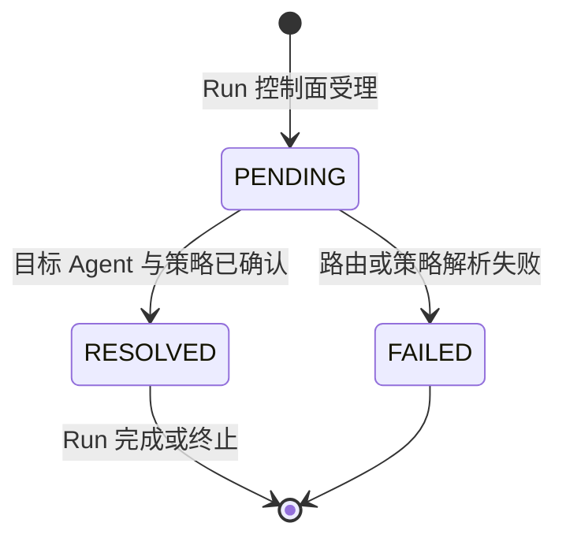
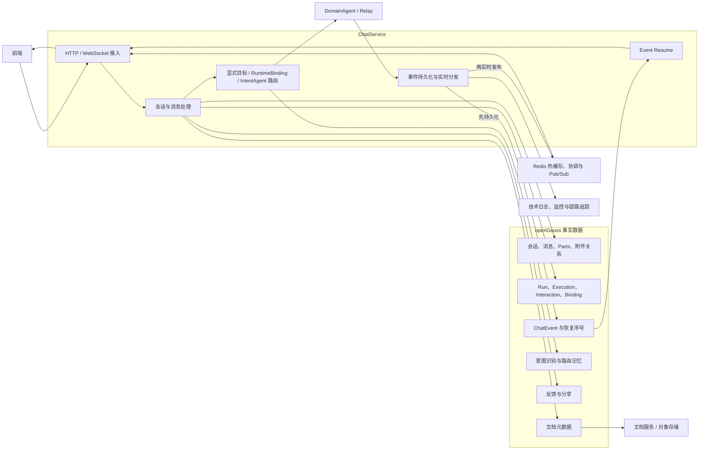
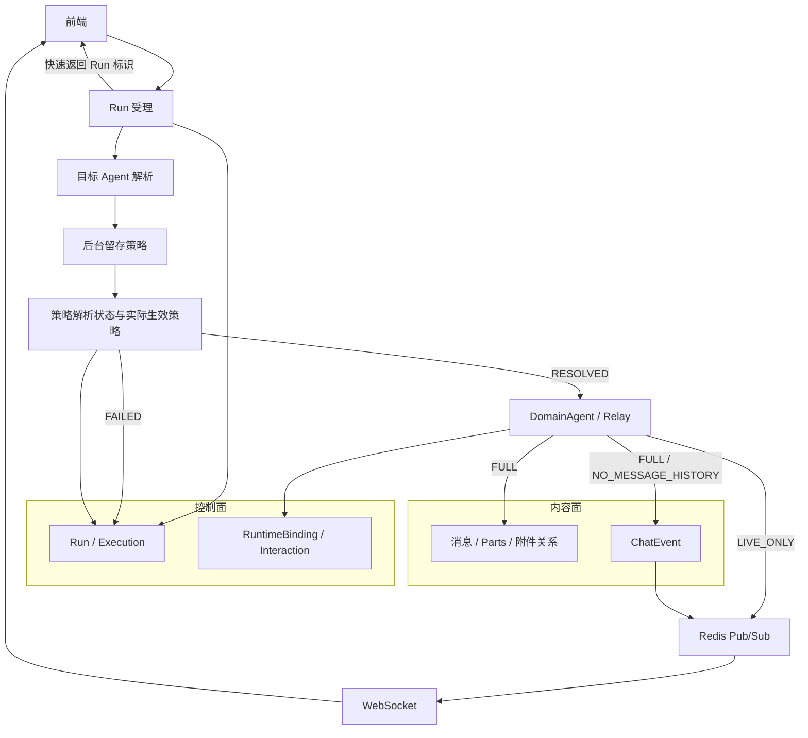
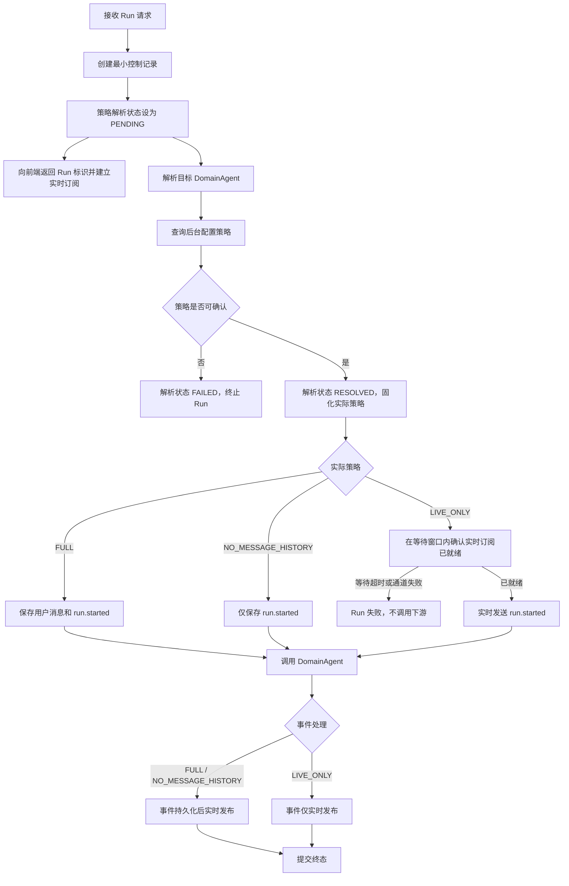
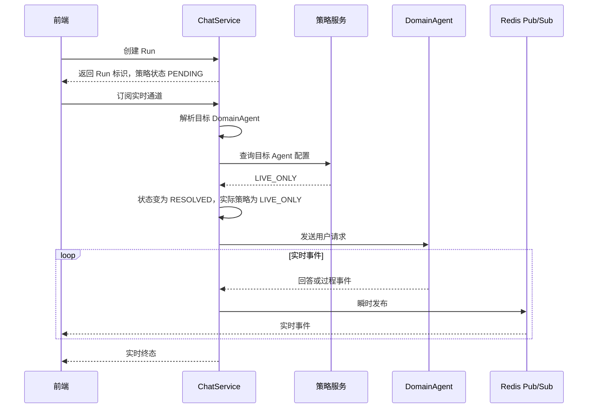

# DomainAgent NO_STORE 留存策略技术评审方案

| 文档属性 | 内容 |
|---|---|
| 文档状态 | 简化评审稿 |
| 版本 | v1.1 |
| 日期 | 2026-07-22 |
| 适用范围 | FinanceEXChatService |
| 业务数据库 | openGauss |
| 策略粒度 | Runtime Provider + DomainAgent SkillId |
| 实施状态 | 设计方案，当前代码尚未实现 |
| 关联文档 | `docs/agent-data-retention-design.md` |

## 1. 方案摘要

本方案用于按 DomainAgent 配置 ChatService 内的消息和事件留存方式。方案只控制 ChatService 的聊天消息、消息过程数据和聊天事件，不控制下游 DomainAgent、Relay、模型、工具、文档系统及其他业务表的留存行为。

后台可配置三种策略：

| 配置策略 | 消息历史 | ChatEvent | 实时输出 | 断线恢复 |
|---|---:|---:|---:|---:|
| `FULL` | 记录 | 记录 | 支持 | 支持 |
| `NO_MESSAGE_HISTORY` | 不记录 | 记录 | 支持 | 支持 |
| `LIVE_ONLY` | 不记录 | 不记录 | 支持 | 不支持 |

评审基线：

1. 未配置的 DomainAgent 使用 `FULL`，保持当前功能。
2. `NO_MESSAGE_HISTORY` 仅表示不生成聊天消息历史，ChatEvent 仍可能保存完整回答和过程内容。
3. `LIVE_ONLY` 表示消息和 ChatEvent 均不记录，事件只通过实时通道传输。
4. 自动路由确定目标 Agent 之前，系统处于策略解析 `PENDING` 状态，不写消息和事件。
5. `PENDING` 是 ChatService 运行状态，不是后台配置策略。
6. 策略无法确认时不调用下游 Agent，也不回退为 `FULL`。
7. 本方案不能作为端到端零留存或合规零留存声明。

## 2. 配置策略与运行状态

### 2.1 概念边界

| 概念 | 合法值 | 产生方 | 含义 |
|---|---|---|---|
| 后台配置策略 | `FULL`、`NO_MESSAGE_HISTORY`、`LIVE_ONLY` | 后台策略服务 | 某个 DomainAgent 被配置的留存要求 |
| 策略解析状态 | `PENDING`、`RESOLVED`、`FAILED` | ChatService | 当前 run 是否已经取得并确认策略 |
| 实际生效策略 | 空或三种后台策略之一 | ChatService | 当前 run 最终执行的留存策略 |
| Run 生命周期 | `RUNNING`、`WAITING_USER`、`COMPLETED`、`FAILED`、`CANCELLED` 等 | ChatService | 当前 run 的业务执行状态 |

四个概念相互独立：

- 后台只能配置三种留存策略，不能配置 `PENDING`、`RESOLVED` 或 `FAILED`；
- `PENDING` 时实际生效策略为空；
- 策略解析成功后，解析状态为 `RESOLVED`，实际生效策略为三种策略之一；
- 策略解析失败时，解析状态和 Run 生命周期均为 `FAILED`；
- 策略已经解析后发生 Redis、WebSocket 或下游异常，只改变 Run 生命周期，不改变已经固化的实际策略。

当前代码尚未实现上述策略解析状态和实际生效策略分层，现有所有 Run 的留存行为等同于 `FULL`。`PENDING` 是本方案目标架构中的运行状态。

典型状态组合：

| 阶段 | 策略解析状态 | 实际生效策略 | Run 生命周期 |
|---|---|---|---|
| Run 已受理，Agent 未确定 | `PENDING` | 空 | `RUNNING` |
| 策略解析完成 | `RESOLVED` | `FULL` / `NO_MESSAGE_HISTORY` / `LIVE_ONLY` | `RUNNING` |
| 策略无法确认 | `FAILED` | 空 | `FAILED` |
| 策略已确认但执行失败 | `RESOLVED` | 保持原策略 | `FAILED` |

### 2.2 解析状态图



`PENDING` 只描述“策略尚未确定”，不表示一种数据留存方式。

## 3. 当前系统架构

### 3.1 当前架构图



### 3.2 当前主流程

当前所有 DomainAgent 实际上都按 `FULL` 行为执行：

1. 创建或加载会话。
2. 解析附件并加载历史上下文。
3. 创建用户消息和运行记录。
4. 持久化 `run.started` 事件。
5. 根据前端目标、已有 RuntimeBinding 或 IntentAgent 选择下游 Agent。
6. 调用 DomainAgent 或 Relay。
7. 下游事件先写入 ChatEvent，再通过 Redis 和 WebSocket 实时推送。
8. Run 完成后保存 assistant 消息、结构化 Parts 和终态。
9. 页面刷新或跨实例连接时，通过 ChatEvent 恢复缺失事件。

当前用户消息发生在路由之前。自动路由场景下，消息写入时还不知道最终 DomainAgent，因此无法直接按 Agent 配置决定是否留存。这是引入策略解析状态和两阶段处理流程的主要原因。

## 4. 当前敏感数据表及作用

ChatService 当前业务数据库为 **openGauss**。本节只列出与本次消息、事件和敏感内容留存边界直接相关的表，不展开纯执行控制表、缓存和临时运行状态。

### 4.1 本方案直接控制的表

| openGauss 表 | 当前保存的敏感内容 | 主要作用 | 不同策略下的效果 |
|---|---|---|---|
| `fin_ex_chat_message_t` | 完整用户问题和 assistant 回答 | 聊天历史、上下文、编辑、重新生成、反馈与分享基础 | 仅 `FULL` 写入 |
| `fin_ex_chat_message_part_t` | 回答、思考、工具参数与结果、进度、引用、卡片、拒答和交互过程 | 恢复结构化回答过程 | 仅 `FULL` 写入 |
| `fin_ex_chat_message_attachment_t` | 消息与文档资产的关联、文件名、类型和大小 | 在聊天历史中还原本轮附件 | 仅 `FULL` 写入 |
| `fin_ex_chat_event_t` | 流式回答、进度、工具、引用、拒答和终态事件 | 实时事件事实源、断线恢复和部分回答重建 | `FULL`、`NO_MESSAGE_HISTORY` 写入；`LIVE_ONLY` 不写入 |

### 4.2 仍可能保存敏感内容的关联表

下列表不属于本次消息与 ChatEvent 的直接禁止范围，但可能继续保存用户输入、业务诊断或文件信息，是 NO_STORE 边界声明的一部分。

| openGauss 表 | 可能保存的敏感内容 | 主要作用 | 本方案影响 |
|---|---|---|---|
| `fin_ex_chat_session_t` | 由用户输入生成的会话标题、会话 metadata | 会话列表、消息树和未读管理 | 三种策略均保留 |
| `fin_ex_chat_run_t` | 路由目标、Runtime 信息和 run metadata | Run 状态、Stop、审计和故障处理 | 三种策略均保留必要控制记录 |
| `fin_ex_chat_interaction_request_t` | 澄清、审批和路由确认的请求与回答 | 等待用户输入和后续续接 | `FULL` 可保存正文；非 `FULL` 只保留最小控制状态 |
| `fin_ex_intent_recognition_t` | 用户 query、意图结果、原始响应和诊断 | 自动路由分析与问题排查 | 本次策略不控制 |
| `fin_ex_route_memory_t` | 用户 query、澄清问题、Agent 选择和路由结果 | 多轮路由记忆与澄清续接 | 本次策略不控制 |
| `fin_ex_uploaded_document_t` | 文档名称、类型、大小和存储引用 | 文档权限、状态和对象存储索引 | 本次策略不删除文档及元数据 |
| `fin_ex_runtime_binding_t` | 下游 Runtime 会话标识和 binding metadata | 复用下游上下文 | 三种策略均保留必要绑定 |
| `fin_ex_message_feedback_t` | 评分原因和用户评论 | 回答反馈 | 非 `FULL` 本轮无消息，不能创建反馈 |
| `fin_ex_chat_share_t` | 被分享消息的内容快照 | 固化聊天分享内容 | 非 `FULL` 本轮无消息，不能创建分享快照 |
| `fin_ex_chat_share_delivery_t` | 分享标题、内容、目标和投递结果 | 记录外部分享状态 | 非 `FULL` 本轮不触发消息分享 |

文件正文由文档服务或对象存储独立保存，不在 openGauss 聊天消息表中。DomainAgent、Relay、A2A、MCP、模型和工具系统中的数据也不受本方案控制。

## 5. 策略定义与效果

### 5.1 FULL

`FULL` 保持当前行为：

- 保存用户消息、assistant 消息、Parts 和附件关系；
- 保存全部 ChatEvent；
- 支持页面刷新、断线恢复和跨实例续接；
- 支持历史上下文、编辑、重新生成、反馈和分享；
- 支持 Stop 后根据已保存事件固化部分回答。

效果：功能完整、恢复能力最强、业务内容存储范围最大。

### 5.2 NO_MESSAGE_HISTORY

`NO_MESSAGE_HISTORY` 只关闭消息历史：

- 不保存本轮 user 和 assistant 消息；
- 不保存本轮 Message Parts 和消息附件关系；
- 仍保存完整 ChatEvent；
- 仍支持基于 ChatEvent 的断线恢复；
- 历史消息列表不显示本轮；
- 下一轮 ChatService 历史上下文不包含本轮；
- 本轮不能执行反馈、分享、编辑和重新生成。

效果：用户侧没有消息历史，但数据库仍可能通过 ChatEvent 保存完整回答、工具过程和业务数据。该策略不具有事件零留存效果。

### 5.3 LIVE_ONLY

`LIVE_ONLY` 同时关闭消息和事件留存：

- 不保存本轮消息、Parts 和消息附件关系；
- 不保存本轮 ChatEvent；
- 事件只通过 JVM 和 Redis Pub/Sub 实时传输；
- 前端必须在下游执行前完成实时订阅；
- 不支持页面刷新恢复、断线补发、跨设备续接和晚订阅；
- Redis、WebSocket 或执行实例故障会导致本轮输出不可恢复；
- 不保存 Stop 时的部分回答；
- 仍保留必要的 Run、Execution、Binding 和最小交互控制状态。

效果：ChatService 消息表和事件表不保存本轮内容，实时交付可靠性和恢复能力明显降低。

## 6. 策略选择规则

### 6.1 配置匹配

策略按 `Runtime Provider + SkillId` 匹配，覆盖以下路由路径：

| 路由路径 | 策略主体来源 |
|---|---|
| 前端显式选择 DomainAgent | 服务端确认后的目标 SkillId |
| 已存在 RuntimeBinding | Binding 对应的 DomainAgent SkillId |
| IntentAgent 自动路由 | 路由最终选中的 DomainAgent SkillId |
| 拒答后重新路由 | 新目标 DomainAgent SkillId |

规则：

1. 后台明确配置时使用配置策略。
2. 后台明确返回未配置时使用 `FULL`。
3. 策略在 Run 内固化，运行中配置变化只影响后续新 Run。
4. 策略查询超时或不可用时，可使用仍有效的缓存结果。
5. 无有效缓存时策略解析失败，不调用下游 Agent。
6. 前端参数不能覆盖后台策略。

### 6.2 策略来源方案对比

| 方案 | 优点 | 缺点与影响 | 实现难度 | 评审状态 |
|---|---|---|---:|---|
| 后台策略服务 + ChatService 缓存 | 集中治理、动态生效、支持版本与审计 | 引入策略服务可用性依赖，需处理缓存和失败边界 | 中 | 评审基线 |
| ChatService 本地配置 | 读取快、实现简单 | 配置变更依赖发布或配置刷新，多实例一致性和审计能力较弱 | 低 | 未选用 |
| DomainAgent 自行返回策略 | Agent 可声明自身能力 | 业务内容可能已发送，无法满足调用前决策，也不能作为统一治理来源 | 低 | 不满足本方案 |
| 无正文能力预检 | 可确认下游实际能力 | 增加调用时延和跨团队协议，属于端到端留存治理范围 | 高 | 不属于本方案范围 |

## 7. 目标架构



架构分为控制面和内容面：

- 控制面负责 Run 状态、执行权、停止、下游会话绑定和交互状态；
- 内容面负责聊天消息、过程 Parts 和 ChatEvent；
- 三种策略主要控制内容面写入，不取消必要的控制面记录；
- `LIVE_ONLY` 不写内容面，但依赖实时通道交付结果。

## 8. 目标流程

### 8.1 主流程图



### 8.2 LIVE_ONLY 实时流程



该流程没有事件恢复源。前端未订阅、连接中断、Redis 故障或 ChatService 实例退出时，已丢失事件不能补发。

## 9. 重新路由与策略变化

实际策略严格程度：

```text
FULL < NO_MESSAGE_HISTORY < LIVE_ONLY
```

| 当前实际策略 | 新目标配置策略 | 处理结果 |
|---|---|---|
| 尚未解析 | 任一策略 | 固化为目标策略 |
| `FULL` | `FULL` | 继续执行 |
| `NO_MESSAGE_HISTORY` | `FULL` | 保持 `NO_MESSAGE_HISTORY` |
| `NO_MESSAGE_HISTORY` | `NO_MESSAGE_HISTORY` | 继续执行 |
| `LIVE_ONLY` | 任一策略 | 保持 `LIVE_ONLY` |
| `FULL` | `NO_MESSAGE_HISTORY` 或 `LIVE_ONLY` | 阻断本次自动切换，创建新 Run 后执行 |
| `NO_MESSAGE_HISTORY` | `LIVE_ONLY` | 阻断本次自动切换，创建新 Run 后执行 |

已按较宽松策略写入的数据不能通过删除后继续的方式转换成严格策略。从严格策略切换到宽松策略时，当前 Run 仍保持原有严格策略。

## 10. 不同策略的数据效果

| 数据对象 | `FULL` | `NO_MESSAGE_HISTORY` | `LIVE_ONLY` |
|---|---|---|---|
| Session 与标题 | 记录 | 记录 | 记录 |
| User Message | 记录 | 不记录 | 不记录 |
| Assistant Message | 记录 | 不记录 | 不记录 |
| Message Parts | 记录 | 不记录 | 不记录 |
| 消息附件关系 | 记录 | 不记录 | 不记录 |
| ChatEvent | 记录 | 记录 | 不记录 |
| Event Resume | 支持 | 支持 | 不支持 |
| Run / Execution 控制数据 | 记录 | 记录 | 记录 |
| RuntimeBinding | 记录 | 记录 | 记录 |
| Interaction 正文 | 记录 | 不记录 | 不记录 |
| Interaction 最小状态 | 记录 | 记录 | 记录 |
| IntentRecognition | 记录 | 记录 | 记录 |
| RouteMemory | 记录 | 记录 | 记录 |
| Uploaded Document | 记录 | 记录 | 记录 |
| Feedback / Share | 支持 | 本轮不支持 | 本轮不支持 |
| Redis Pub/Sub | 实时分发 | 实时分发 | 唯一跨实例事件通道 |
| 短期记忆缓存 | 可使用历史消息 | 不包含本轮 | 不包含本轮 |
| 技术日志 | 只记录技术信息 | 只记录技术信息 | 只记录技术信息 |
| 下游 Agent 数据 | 不受本方案约束 | 不受本方案约束 | 不受本方案约束 |

边界说明：

- Session 标题可能由用户首轮输入生成；
- IntentRecognition 和 RouteMemory 可能保存用户 query、澄清和路由内容；
- Run、Binding 和其他 metadata 可能保存业务诊断信息；
- Uploaded Document 和对象存储不会因聊天策略自动删除；
- 因此 `LIVE_ONLY` 只能表述为“ChatService 消息和 ChatEvent 不留存”，不能表述为“ChatService 全部业务内容不留存”。

## 11. 功能与用户体验影响

| 能力 | `FULL` | `NO_MESSAGE_HISTORY` | `LIVE_ONLY` |
|---|---:|---:|---:|
| 当前页面实时回答 | 支持 | 支持 | 支持 |
| 页面刷新恢复 | 支持 | 支持 | 不支持 |
| 网络重连补发 | 支持 | 支持 | 不支持 |
| 跨设备查看运行中回答 | 支持 | 支持 | 不支持 |
| 历史消息列表展示 | 支持 | 不支持 | 不支持 |
| 下一轮 ChatService 历史上下文 | 包含本轮 | 不包含本轮 | 不包含本轮 |
| 编辑本轮问题 | 支持 | 不支持 | 不支持 |
| 重新生成本轮回答 | 支持 | 不支持 | 不支持 |
| 本轮反馈与分享 | 支持 | 不支持 | 不支持 |
| Stop 后保留部分回答 | 支持 | 不支持 | 不支持 |
| Redis 故障后的恢复 | 数据库事件恢复 | 数据库事件恢复 | 无法恢复 |

其他影响：

- 同一会话混合使用不同策略时，非 `FULL` 轮次不会出现在消息树中；
- 后续 `FULL` 消息仍连接到此前最后一条已记录消息；
- 下游 Agent 可能通过自己的 Runtime Session 记住非 `FULL` 内容，但 ChatService 无法保证或重建该上下文；
- 非 `FULL` 轮次使用过的附件不会出现在聊天历史中，但文档资产仍然存在；
- `LIVE_ONLY` 对前端实时连接、Redis 和当前执行实例的可用性要求最高。

## 12. 事件不留存方案对比

| 方案 | 事件存储事实 | 恢复能力 | 优点 | 缺点与影响 | 技术难度 | 评审状态 |
|---|---:|---:|---|---|---:|---|
| 严格实时传输 | 无 | 无 | 符合“不记录 ChatEvent”的定义 | 页面刷新、断线、实例退出均丢失，Redis 成为硬依赖 | 高 | `LIVE_ONLY` 评审基线 |
| Redis 短期重放 | 有，按 TTL 保存 | TTL 内可恢复 | 用户体验和短时容错较好 | 仍属于事件存储，需容量和清理治理 | 中高 | 只能定义为独立策略 |
| 数据库先存后删 | 有，终态前保存 | 运行中可恢复 | 可复用当前事件链路 | 崩溃、删除失败、备份均可能留下数据 | 中 | 不符合 LIVE_ONLY 定义 |

评审基线选择严格实时传输。Redis 短期重放和数据库先存后删均不能归入“不记录事件”的 `LIVE_ONLY`。

## 13. 风险与边界

| 风险 | 影响 |
|---|---|
| 策略服务不可用且无有效缓存 | Run 在调用下游前失败，原本可能使用 FULL 的 Agent 也会受影响 |
| 自动路由耗时 | 策略只能在 Agent 选定后确认，首个业务事件时间后移 |
| LIVE_ONLY 无恢复源 | 浏览器、网络、Redis 或实例故障会丢失输出 |
| NO_MESSAGE_HISTORY 仍保存事件 | 数据库中仍可能存在完整业务内容 |
| 辅助表仍保存 query 或 metadata | 不能形成 ChatService 全业务数据零留存结论 |
| 下游 Agent 独立保存内容 | ChatService 策略不能形成端到端零留存结论 |
| 混合策略会话 | 消息历史存在不可见轮次，ChatService Memory 不连续 |
| 附件独立存储 | 不记录消息附件关系不等于删除文档资产 |

## 14. 评审结论

1. 后台配置策略限定为 `FULL`、`NO_MESSAGE_HISTORY` 和 `LIVE_ONLY`。
2. `PENDING`、`RESOLVED`、`FAILED` 仅表示 ChatService 策略解析状态，不属于配置策略。
3. 策略按 Runtime Provider 和 DomainAgent SkillId 选择，未配置结果为 `FULL`。
4. 策略无法确认时采用 fail closed，不调用下游，不扩大留存范围。
5. `NO_MESSAGE_HISTORY` 只消除消息历史，不能消除 ChatEvent 数据。
6. `LIVE_ONLY` 采用严格实时传输，不提供事件恢复。
7. Session、IntentRecognition、RouteMemory、Run、Binding、文档资产和下游存储不在本方案禁止范围内。
8. 本方案最终能够确认的是“本轮是否写入 ChatService 消息和 ChatEvent”，不能确认端到端或全系统业务内容零留存。
