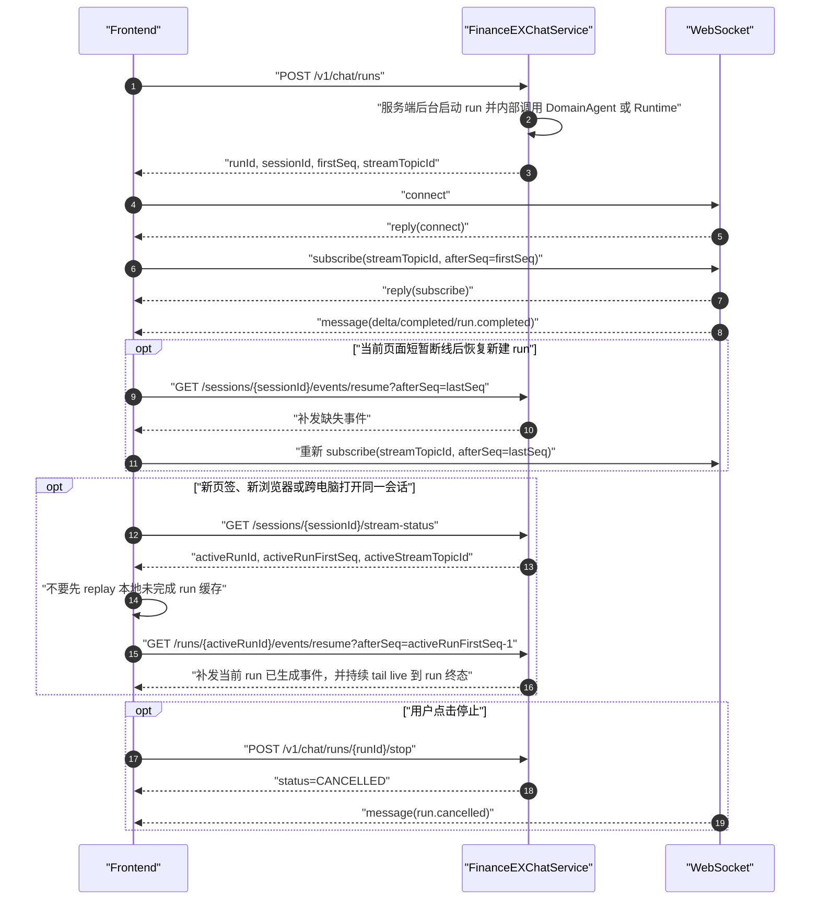

# FinanceEXChatService 前端联调文档

本文档面向 Web 前端联调，覆盖会话、文档上传、创建 run、WebSocket 实时订阅、Event Resume 断点恢复、停止回答和常见排障。当前正式版采用“后台 run + 实时订阅 + 事件恢复”的单一对话流协议：HTTP 负责创建和控制后台 run；WebSocket 负责当前页面新建 run 的实时订阅；Event Resume 负责恢复链路，其中会话级事件恢复是有限补发，run 级事件恢复在 active run 场景会先补发再接续 live 事件直到 run 终态。

流式事件的事实源、批量落库、Redis 跨实例扇出、WebSocket 队列及跨浏览器恢复原理，参见
[Chat 流式输出、断点续传与跨浏览器恢复设计](architecture/chat-streaming-and-resume.md)。

全部公开接口的 OpenAPI 3.0.3 定义见
[FinanceEX ChatService OpenAPI](openapi/financeex-chatservice-v1.yaml)。Swagger 文档中的命名 examples
覆盖普通请求、全部 Interaction WAIT、前端触发超时动作、页面恢复和等待态 stop；本联调文档继续说明
前端状态组织与调用顺序。

本文档以 FinanceEXChatService 的正式接口为准，采用系统自身的设计术语描述接口边界、调用顺序和错误处理；下游 Runtime、domain-agent 或浏览器实现细节只作为内部 adapter 行为说明，不作为前端协议依赖。

## 基础约定

- HTTP base URL：`http://localhost:8080`
- WebSocket URL：`ws://localhost:8080/v1/chat/ws`
- 如果后端配置了上下文根，例如 Servlet/MVC 模式下 `server.servlet.context-path=/fin/ex`
  或 WebFlux 模式下 `spring.webflux.base-path=/fin/ex`，则 WebSocket URL 也必须带上同一前缀：
  `ws://localhost:8080/fin/ex/v1/chat/ws`。
- 所有时间字段均为 ISO-8601 字符串。
- `seq` / `sequence` 是数据库生成的事件恢复游标，前端断点恢复只保存最后收到的最大 `sequence`。
- 前端只把 `sequence` 当作不透明数字游标，不要自行推算生成方式；服务端以事件表事实源保证同一会话内的恢复顺序。
- 前端不要传 `tenantId`、`userId`，也不要通过 Header/Query/Body 伪造用户身份；身份由后端请求入口通过 `AuthContextProvider` 从服务端上下文解析一次，后台 run 不会再次读取请求 ThreadLocal。
- 本文档中的 WebSocket 默认指前端到 FinanceEXChatService 的 `/v1/chat/ws` 连接。FinanceEXChatService 到下游 Relay 使用另一条服务端出站 WebSocket，承载普通问答、Interaction 续接和 stop；前端不直接连接 Relay，也不通过前端 WebSocket 发起 `AgentRuntime.query`。
- 当前 `ApplicationAuthContextProvider` 直接构造完整 `UserContext`，不再通过配置文件或环境变量模拟 tenant/user；接入企业身份源时只需替换该防腐层。

## 内部旁路能力

意图识别记录不新增前端接口，也不要求前端增加请求字段。后端只有在 `financeex.intent.enabled=true`
且本轮确实调用意图服务时，才会在 `financeex.intent-record.enabled=true` 的配置下异步记录本轮
query、routeAction、候选意图、最终路由是否采纳和调用耗时。DomainAgent、RuntimeBinding 续接、用例库已命中、
意图服务关闭或未调用时不会写记录。该记录使用专用 Servlet/MVC 线程池 best-effort 写入
`fin_ex_intent_recognition_t`，失败只影响统计排障数据，不影响 `/v1/chat/runs`、WebSocket 或 Event Resume。
意图服务的连接、超时、HTTP/JSON 异常和协议错误会按 `financeex.intent.max-retries` 重试，默认最多重试 3 次，运行时最多按 10 次生效。重试耗尽后由后端 `financeex.intent.failure-strategy` 决定：默认 `RELAY_FALLBACK` 进入 Relay；`FAIL_RUN` 返回 `INTENT_ROUTING_FAILED` 并提示用户手动选择技能。合法的 `NO_MATCH/ROUTE_MULTI` 始终进入 Relay，不受该策略影响，前端不需要为策略增加请求字段。`NO_MATCH` 的 `intent-result.payload.intentName` 由服务端组装，默认是“未识别到可用意图，进入 FIN Supervisor Agent”；部署可通过 `FINANCEEX_INTENT_NO_MATCH_AGENT_NAME` 修改其中的 Agent 展示名称，历史已落库事件不会回写。
部署可通过 `financeex.intent.invocation-mode=BLOCKING|STREAMING` 选择阻塞或 SSE 流式意图接口，默认 `STREAMING`。该选择不增加前端请求字段，也不改变最终 `intent-result`、路由、澄清或失败策略。

## 接口总览

| 场景 | 方法 | 路径 | 说明 |
| --- | --- | --- | --- |
| 创建会话 | `POST` | `/v1/chat/sessions` | 显式创建会话；也可以直接调用 `/v1/chat/runs`，不传 `sessionId` 时由后端创建或归一化 |
| 会话列表（游标） | `GET` | `/v1/chat/sessions?limit=20&cursor=...` | 当前用户会话游标分页 |
| 会话列表（页码） | `GET` | `/v1/chat/sessions/page?curPage=1&pageSize=20` | 当前用户历史会话页码分页，返回 totalRows |
| 会话详情 | `GET` | `/v1/chat/sessions/{sessionId}` | 查询单个会话元数据 |
| 标记会话已读 | `POST` | `/v1/chat/sessions/{sessionId}/read` | 提交已经实际展示到的 `readThroughSeq`，返回最新会话水位 |
| 历史消息 | `GET` | `/v1/chat/sessions/{sessionId}/messages?leafMessageId=...&limit=50` | 查询当前 active path 或指定 leaf path 的最近一页；使用 `nextCursor`向前翻页并 prepend，消息带轻量 `versionInfo` 和附件快照 |
| 消息树视图 | `GET` | `/v1/chat/sessions/{sessionId}/messages/tree` | 查询完整可见消息树 mapping，用于复杂版本树或调试，节点消息同样带附件快照 |
| 消息版本详情 | `GET` | `/v1/chat/sessions/{sessionId}/messages/{messageId}/variants` | 查询同父节点候选版本完整内容；普通聊天页优先使用 `/messages.versionInfo` |
| 切换路径 | `POST` | `/v1/chat/sessions/{sessionId}/path` | 将会话当前 leaf 切换到指定消息 |
| 新建分支 | `POST` | `/v1/chat/sessions/{sessionId}/branches` | 从某条消息创建只读历史快照分支 |
| 重命名会话 | `PATCH` | `/v1/chat/sessions/{sessionId}` | 更新会话标题 |
| 归档/恢复会话 | `POST` | `/v1/chat/sessions/{sessionId}/archive`、`/restore` | 会话列表管理 |
| 删除会话 | `DELETE` | `/v1/chat/sessions/{sessionId}` | 软删除单个会话，历史事实数据保留 |
| 批量删除会话 | `DELETE` | `/v1/chat/sessions` | 批量软删除会话，运行中的会话会先取消 run |
| 创建 run | `POST` | `/v1/chat/runs` | 唯一提问入口，返回 `streamTopicId` |
| WebSocket | `WS` | `/v1/chat/ws` | 用户级长连接，按 run topic 订阅实时事件 |
| 会话事件恢复 | `GET` | `/v1/chat/sessions/{sessionId}/events/resume?afterSeq={seq}` | 有限补发整个会话缺失事件 |
| Run 事件恢复 | `GET` | `/v1/chat/runs/{runId}/events/resume?afterSeq={seq}` | 跨页签、跨浏览器或跨电脑续接正在输出的当前回答 |
| 流状态 | `GET` | `/v1/chat/sessions/{sessionId}/stream-status` | 查询最新 `seq`、active run 和是否可取消 |
| 停止回答 | `POST` | `/v1/chat/runs/{runId}/stop` | 幂等停止当前 run |
| 消息反馈 | `POST` / `DELETE` | `/v1/chat/messages/{messageId}/feedback` | 对 assistant 消息点赞、点踩、切换或取消 |
| 创建分享 | `POST` | `/v1/chat/messages/{messageId}/share` | 对单条 assistant 消息创建固定问答快照分享 |
| 创建多消息分享 | `POST` | `/v1/chat/shares` | 对同一分支中明确选择的 user/assistant 消息创建固定快照 |
| 发送分享 | `POST` | `/v1/chat/shares/{shareId}/deliveries` | 把已有分享发送到 WeLink 等 provider |
| 创建并发送分享 | `POST` | `/v1/chat/messages/{messageId}/share/deliveries` | 一键创建分享快照并发送 |
| 分享详情 | `GET` | `/v1/chat/shares/{shareId}` | 登录后查看分享快照 |
| 撤销分享 | `DELETE` | `/v1/chat/shares/{shareId}` | 创建者撤销分享 |
| 我的分享 | `GET` | `/v1/chat/shares?curPage=1&pageSize=20` | 分页管理当前用户创建的分享 |
| 上传文档 | `POST` | `/v1/documents` | multipart 上传本地文件 |
| 文档列表 | `GET` | `/v1/documents?sessionId=...&limit=20&cursor=...` | 当前用户文档库；`sessionId` 可选，用于筛选会话关联文档 |
| 文档详情 | `GET` | `/v1/documents/{documentId}` | 查询单个文档 |
| 文档更新 | `PATCH` | `/v1/documents/{documentId}` | 更新展示名或元数据 |
| 文档状态 | `GET` | `/v1/documents/{documentId}/status` | 查询处理状态 |
| 文档预览/下载 | `GET` | `/v1/documents/{documentId}/preview-url`、`/download` | 后端受控流式访问 |
| 文档删除 | `DELETE` | `/v1/documents/{documentId}` | 软删除文档 |

正式版只有上表这些对外入口。前端不要再保留历史多入口聊天协议，也不要通过 WebSocket 发送聊天请求体；聊天必须先创建 run，再订阅或恢复 run 的事件。

仓库中提供了一个独立本地联调台：`local-test-frontend/`。它通过本地 Node 代理访问 `/v1/**`，可用于验证会话、消息树、文档库、run、WebSocket topic、Event Resume、stop 和跨页签续接，不会影响后端代码。

本地联调台支持类似 Postman 的自定义请求头配置。由于浏览器不能直接设置 `Cookie` 请求头，也不能给原生 `WebSocket` 自定义握手 header，联调台采用本地代理 profile：页面左侧“鉴权请求头”保存 `Cookie/Authorization/X-*` 后，浏览器只携带非敏感 profileId，`server.mjs` 代理在转发 HTTP、fetch Event Resume、文件下载和 WebSocket 握手时统一注入真实请求头。该能力只用于本地调试企业鉴权框架，不属于生产前端协议。

## 错误响应

HTTP 接口的错误响应结构稳定，前端可以统一解析 `code` 和 `message`：

```json
{
  "timestamp": "2026-05-17T01:06:00Z",
  "path": "/v1/chat/runs",
  "status": 409,
  "error": "Conflict",
  "code": "ACTIVE_RUN_EXISTS",
  "message": "ACTIVE_RUN_EXISTS: 当前会话已有运行中的回答，请先停止或等待完成。activeRunId=run_xxx"
}
```

常见 HTTP 错误码：

| HTTP | `code` | 场景 | 前端建议 |
| --- | --- | --- | --- |
| 400 | `BAD_REQUEST` | 参数为空、文档 ID 为空、非法 topic 等业务参数错误 | 提示用户修正输入或刷新状态 |
| 400 | `VALIDATION_FAILED` | 请求体字段长度、附件数量等 Bean Validation 失败 | 根据 `message` 标记表单字段 |
| 401 | `AUTH_CONTEXT_MISSING` | 后端入口没有解析到企业身份上下文 | 跳转登录或提示重新认证 |
| 200 | `ACCESS_DENIED` | 当前用户访问了不存在或不属于自己的 session/run/document/message | 按业务提示展示 `message`，清理本地缓存并重新加载会话列表 |
| 409 | `ACTIVE_RUN_EXISTS` | 同一 session 已有运行中 run | 保持“生成中/停止”状态，先 stop 或等待终态 |
| 409 | `SHARE_REVOKED` | 分享已被创建者或会话删除动作撤销 | 展示分享已撤销，不再重试 |
| 409 | `SHARE_EXPIRED` | 分享已超过 `expiresAt` | 展示分享已过期 |
| 409 | `CONFLICT` | 会话关闭、文档不可下载、快照消息不可编辑等状态冲突 | 按业务状态禁用相关操作 |

WebSocket 错误不使用 HTTP body，而是 envelope：

```json
{
  "id": "cmd-1",
  "type": "error",
  "topicId": "chat-run-run_xxx",
  "offset": "12019",
  "code": "RECOVER_REQUIRED",
  "message": "实时事件需要恢复，请使用 Event Resume 从 afterSeq=12002 补齐"
}
```

常见 WebSocket `code`：`WS_AUTH_FAILED`、`WS_ORIGIN_FORBIDDEN`、`WS_MESSAGE_TOO_LARGE`、
`BAD_WS_MESSAGE`、`SUBSCRIBE_ERROR`、`NOT_SUBSCRIBED`、`RECOVER_REQUIRED`。

## 接口使用速查

下面先给出前端接入路线图、关键字段关联关系、场景级调用编排和逐接口字段矩阵；后续章节给出更完整的 curl 和前端代码示例。新接入同学可以按本节顺序完成页面联调，不需要先阅读后端代码。

### 前端开发接入路线图

一个新前端开发人员建议按下面顺序完成集成，不要从 WebSocket 或 Event Resume 开始：

1. **身份与基础地址**：确认 HTTP base URL、WebSocket URL、context path、企业 Cookie/header 注入方式。所有接口都依赖同一个后端身份上下文，不在请求体传 `tenantId/userId`。
2. **会话列表与历史消息**：先接 `GET /chat/sessions`、`GET /chat/sessions/{sessionId}` 和 `GET /chat/sessions/{sessionId}/messages`。会话列表负责左侧导航，会话详情只取元数据，历史消息接口负责主面板渲染。
3. **创建 run 与实时输出**：接 `POST /v1/chat/runs`，拿到 `runId/sessionId/firstSeq/streamTopicId` 后，通过 WebSocket `subscribe(topicId, afterSeq)` 接实时事件。
4. **事件恢复与停止**：接 `stream-status`、run 级 `/events/resume` 和 `/runs/{runId}/stop`。这三者决定刷新、跨页签、跨电脑和停止回答时的正确行为。
5. **消息树功能**：接 `messages`、`variants`、`path`、`branches`，实现编辑历史问题、重新生成回答、版本切换和从消息新建分支。
6. **文档和反馈**：最后接文档库、附件引用、点赞点踩和取消反馈；这些能力都依赖已经能稳定渲染历史消息。

### 关键字段关联关系

| 字段 | 由哪个接口产生 | 后续在哪些接口使用 | 前端保存建议 |
| --- | --- | --- | --- |
| `sessionId` | `POST /v1/chat/sessions`、`POST /v1/chat/runs`、会话列表 | 所有会话、消息、stream-status、Event Resume、文档上传关联 | 作为路由参数和会话状态 key 持久保存 |
| `runId` | `POST /v1/chat/runs`、`stream-status.activeRunId` | stop、run 级 Event Resume、反馈可选关联、日志排障 | 当前 active run 保存到会话运行态，终态后可清空运行态但保留消息里的 `runId` |
| `streamTopicId` | `POST /v1/chat/runs`、`stream-status.activeStreamTopicId` | WebSocket `subscribe/unsubscribe` | 只用于实时订阅，不要手写；格式当前为 `chat-run-{runId}` |
| `sequence` / `seq` | WebSocket `payload.sequence`、Event Resume 事件 | Event Resume `afterSeq`、本地去重 | 每个 session 保存已处理最大值；渲染事件前按 `sessionId + sequence` 去重 |
| `firstSeq` | `POST /v1/chat/runs` | 新建 run 后首次 WebSocket subscribe 的 `afterSeq` | 创建 run 后立即保存；通常 `subscribe.afterSeq=firstSeq` |
| `activeRunFirstSeq` | `stream-status` | 新页签、新浏览器、跨电脑恢复 active run | 恢复 active run 时用 `activeRunFirstSeq - 1`，不要直接用 `latestSeq` |
| `interactionId` | `run.waiting_user`、`stream-status` | `CONTINUE_INTERACTION` 续接 | 只对当前等待请求有效；多页签提交通过同一 Interaction CAS 去重 |
| `assistantMessageId` | `run.waiting_user`、`stream-status`、Interaction 响应事件 | 定位等待卡片及跨 run 合并的 assistant | `AMBIGUOUS_ROUTE` 和 Relay 问卷的 run-A/run-B 复用该消息 ID |
| `messageId` | 历史消息接口、run completed 后的 assistant 消息 | variants、path、branch、feedback、编辑/重新生成入参 | 作为消息树节点 ID 保存到消息状态 |
| `leafMessageId` | 历史消息、variants、会话 `currentLeafMessageId` | `GET /messages?leafMessageId=...`、`POST /path` | 切换历史版本时保存当前选中的 leaf |
| `documentId` | 文档上传或文档列表 | `attachments[].documentId`、文档详情/状态/下载/删除 | 文档库资产 ID；只有 `AVAILABLE` 文档可作为附件 |
| `feedbackId` | 反馈提交/取消接口 | 前端通常只展示，不作为后续必填入参 | 可用于排障；按钮高亮以 `ChatMessageDto.feedback.rating` 为准 |
| `cursor` | 会话列表、文档列表分页响应 | 下一页查询参数 | 只对产生它的列表接口有效，不跨接口复用 |

### 场景级调用编排

| 场景 | 调用顺序 | 关键关联字段 | 前端状态处理 |
| --- | --- | --- | --- |
| 首次打开应用 | `GET /chat/sessions?limit=20` -> 用户选择会话后记录 `latestMessageSeq` -> `GET /chat/sessions/{sessionId}/messages`、`GET /chat/sessions/{sessionId}/stream-status` -> 最新历史真正渲染后 `POST /chat/sessions/{sessionId}/read` -> 可选连接 WS `connect` | `sessionId`、`latestMessageSeq`、`currentLeafMessageId`、`streamStatus.activeRunId` | 左侧列表用 `hasUnread` 展示红点；只提交打开时实际观察到的水位，新到达消息仍保持未读；仅翻看旧 leaf/旧分页不清除当前会话未读 |
| 新会话首轮提问 | 可选 `POST /v1/chat/sessions`，或直接 `POST /v1/chat/runs` 不传 `sessionId` -> WS `subscribe(streamTopicId, firstSeq)` | `runId`、`sessionId`、`firstSeq`、`streamTopicId` | 乐观渲染 user 消息；收到 `message.delta` 创建/追加 assistant 草稿，收到 `message.snapshot` 替换草稿；终态后关闭 loading |
| 已有会话继续提问 | `GET /v1/chat/sessions/{sessionId}/stream-status` 确认无 active run -> `POST /v1/chat/runs(sessionId, runMode=NEXT)` -> WS subscribe | `sessionId`、`parentMessageId` 可选、`streamTopicId` | 同一 session 存在 active run 时不要再次发送；遇到 409 使用 stop 或等待终态 |
| 当前页短暂断线重连 | 本地保存 `lastSeq` -> 重建 WS -> `subscribe(topicId, afterSeq=lastSeq)`；如果收到 `RECOVER_REQUIRED`，先 Event Resume 再重新 subscribe | `topicId`、`lastSeq`、`sequence` | 以 `sessionId + sequence` 去重；不要重复追加同一 delta |
| 新页签/新浏览器/跨电脑打开 active run | `GET /messages` 渲染历史 -> `GET /stream-status` -> 若有 `activeRunId`，调用 `GET /runs/{activeRunId}/events/resume?afterSeq=activeRunFirstSeq-1` | `activeRunId`、`activeRunFirstSeq`、`activeStreamTopicId`；可复用 continuation 还返回 `assistantMessageId` | run 级 Event Resume 会先补发已落库事件再 tail 实时源；`assistantMessageId` 非空时先定位已有 assistant，再把 run-B 事件追加到该消息；live tail 异常时当前恢复流结束且不发送 `done`，前端退避后重新 resume；同一个 run 恢复期间不要再 WebSocket subscribe |
| DomainAgent后台任务 | 收到`run.async_running` -> 保留当前run的运行中和停止按钮 -> 可保留WebSocket topic订阅；刷新后读取`stream-status` | `activeRunId`、`assistantMessageId`、`activeRunPhase=ASYNC_RUNNING`、`asyncExpiresAt` | 原Run Resume在异步边界结束且不发送done，不要立即重连循环；同会话禁止新Query。回调有结果时先收到`run.async_result_started`，再按普通DomainAgent标准事件更新展示；页面关闭后用历史消息和Resume恢复 |
| 停止回答 | 用户点击停止 -> `POST /runs/{runId}/stop` -> 等待 WS 或 Event Resume 收到 `run.cancelled` | `runId`、stop 前本地 `lastSeq` | stop 不是关闭 WebSocket；若 stop 前已有正文或用户可见 parts，历史消息会保存 partial assistant |
| 编辑历史 user 消息 | 用户点击编辑 -> `POST /v1/chat/runs(runMode=EDIT_USER, editedMessageId, message)` -> 订阅新 run -> `run.completed` 后重新 `GET /v1/chat/sessions/{sessionId}/messages` | `editedMessageId`、新 user `messageId`、新 assistant `messageId`、`versionInfo` | 旧消息不覆盖；新 user sibling 进入旧 user 的 `versionInfo.variants` |
| 重新生成 assistant | 用户点击重新生成 -> `POST /v1/chat/runs(runMode=REGENERATE_ASSISTANT, regeneratedMessageId)` -> 订阅新 run -> `run.completed` 后重新 `GET /v1/chat/sessions/{sessionId}/messages` | `regeneratedMessageId`、原父 user messageId、新 assistant messageId、`versionInfo` | 复用原 user 节点，新 assistant sibling 进入旧 assistant 的 `versionInfo.variants` |
| 普通意图澄清等待 | 收到 `run.waiting_user(interactionType=INTENT_CLARIFICATION)` 且 `clarificationType` 不是 `AMBIGUOUS_ROUTE` -> 展示澄清 assistant -> `POST /v1/chat/runs(runMode=CONTINUE_INTERACTION, interactionId)` 提交答案、附件和本轮 metadata -> 订阅新 topic | `interactionId`、`assistantMessageId`、新 `runId/streamTopicId`、`expiresAt` | 使用 `NEW_TURN`：每次提交生成新的 user 回答节点，下一轮澄清或最终 Agent 回答生成新的 assistant 节点；后端以 `routeTrigger=clarify_answer` 继续意图服务 |
| 歧义路由候选等待 | 收到 `run.waiting_user(clarificationType=AMBIGUOUS_ROUTE)` -> 展示 `candidateIntents/actions` -> 按 `autoSelectAt` 建立前端定时器 -> 指定候选、到期代选或提交“其他” -> 订阅 run-B topic | run-A `assistantMessageId`、`interactionId`、`autoSelectAt`、run-B `runId/streamTopicId` | 使用 `REUSE_ASSISTANT`：run-A 和 run-B 是不同 run，但复用同一 user/assistant；指定候选或代选跳过 Intent，其他文本/附件重新调用 Intent；页面恢复时通过 stream-status 重建定时器 |
| 拒答路由切换确认 | 收到 `run.waiting_user(interactionType=ROUTE_SWITCH_CONFIRMATION)` -> 展示候选目标 -> 按 `autoActionAt` 建立前端定时器 -> 人工同意/拒绝，或到期提交 `approved=true` -> 订阅 run-B topic | run-A `assistantMessageId`、`interactionId`、`autoActionAt`、`autoActionType=APPROVE_ROUTE_SWITCH`、run-B `runId/streamTopicId` | 与 AMBIGUOUS_ROUTE 共用等待时长；后端不设定时任务，页面恢复时通过 stream-status 重建定时器；超时与人工同意共用现有切换流程 |
| Relay 问卷等待 | 收到 `run.waiting_user(interactionType=AGENT_CLARIFICATION)` -> 从历史 `AGENT_CLARIFICATION_REQUEST` part 渲染问卷 -> 手动提交答案，或在 `autoActionAt` 到达后提交忽略 -> 订阅 run-B topic | run-A `assistantMessageId`、`interactionId`、`autoActionAt`、run-B `runId/streamTopicId` | run-A 关闭下游连接但保留 ACTIVE Relay Binding；run-B 跳过 Intent，以同一 Relay session 执行 `RESUME + approval-response`，并把结果追加到原 assistant |
| 等待态主动直连 DomainAgent | `POST /v1/chat/runs(runMode=NEXT,targetType=DOMAIN_AGENT,targetId,message,metadata,attachments)` -> 订阅返回的 `streamTopicId` | 当前 `sessionId`、新 `runId`、所选 `targetId` | 优先于意图、Relay 和开放 Interaction；服务端原子取消该会话的 `WAITING/RESPONDING` Interaction，并把新 user 节点挂到等待 assistant 后。仅使用本轮请求参数，不合并旧澄清上下文；真正存在 `RUNNING/CANCELLING` run 时仍返回 active-run 冲突 |
| Agent 澄清等待 | 收到 `run.waiting_user(interactionType=AGENT_CLARIFICATION)` 或刷新后 `stream-status.waitingUserInput=true` -> 展示 `/messages` 中的 `AGENT_CLARIFICATION_REQUEST` part -> `POST /v1/chat/runs(runMode=CONTINUE_INTERACTION, interactionId)` -> 订阅返回的 `streamTopicId` | `interactionId`、`assistantMessageId`、`runId`、`streamTopicId`、`expiresAt` | 续接不创建新 user 消息；用户答案会作为 `AGENT_CLARIFICATION_RESPONSE` part 追加到同一 assistant，最终 `run.completed.payload.assistantMessageId` 仍是原 assistant；超过 `expiresAt` 后提交会返回 `INTERACTION_EXPIRED` |
| 切换历史版本 | 从当前消息 `versionInfo.variants` 取目标项 -> `GET /messages?leafMessageId={switchLeafMessageId}` 重渲染 -> 后台 `POST /path` 保存选择 | `versionInfo.currentIndex/total`、`switchLeafMessageId`、`currentLeafMessageId` | 先刷新展示路径，不创建 run，不调用 Runtime；`/path` 只负责持久化当前 leaf |
| 从消息新建分支 | `POST /sessions/{sessionId}/branches(sourceMessageId)` -> 选择新 `sessionId` -> `GET /messages`、`GET /stream-status` | `sourceMessageId`、新 `sessionId`、`sourceSessionId/sourceMessageId` | 分支快照消息 `locked=true`，禁用编辑、删除和重新生成 |
| 上传文件并作为附件提问 | `POST /v1/documents(file, sessionId)` -> 等状态 `AVAILABLE` -> `POST /v1/chat/runs(attachments[{documentId}])` | `documentId`、`sessionId`、`attachments[].documentId` | 附件不是消息类型；PROCESSING/FAILED/DELETED 不可作为聊天附件 |
| 选中 DomainAgent 并带文档提问 | `POST /v1/documents(file,metadata.skillId)` -> `POST /v1/chat/runs(targetType=DOMAIN_AGENT,targetId,attachments,metadata)` | `documentId`、`targetId`、`metadata.sceneParam.docList` | 后端绑定 `provider=domain-agent`、`routeSource=front-selected`；metadata 作为业务扩展传给下游，但 `skillId/query/sessionId` 由服务端按绑定和本轮问题覆盖；attachments 独立校验归属和状态，docList 只校验基本结构，不要求二者匹配 |
| 点赞/点踩/取消 | 历史消息中找到 assistant `messageId` -> `POST /messages/{messageId}/feedback`；再次点击已选按钮 -> `DELETE /feedback` | `messageId`、可选 `runId`、`feedback.rating/status` | 历史消息 `feedback` 非空时高亮；取消后返回 `status=CANCELLED`，历史消息再查为 `feedback=null` |
| 会话归档/恢复/删除 | 单个：`POST /archive`、`POST /restore`、`DELETE /sessions/{sessionId}`；批量：`DELETE /sessions` body `sessionIds[]` | `sessionId`、`sessionIds[]` | 删除是软删除；有 active run 时后端会先主动取消 run |
| 文档库管理 | `GET /documents` -> `GET /documents/{documentId}`/`status`/`preview-url`/`download`/`PATCH`/`DELETE` | `documentId`、`cursor`、`status` | 列表默认不返回 DELETED；下载和预览只允许 AVAILABLE |

### 逐接口字段矩阵

| 接口 | 请求字段 | 响应字段 | 后续关联 |
| --- | --- | --- | --- |
| `POST /chat/sessions` | Body：`title` 会话标题，可空；`channel` 来源渠道，可空 | `ChatSessionDto` 全字段 | 使用 `sessionId` 作为会话路由和后续 run 入参 |
| `GET /chat/sessions` | Query：`appId/appScope/title/channel` 可选；`appScope=MAIN_SITE`只查主站；`limit`页大小；`cursor`上一页游标 | `items[]`、`nextCursor`；item带首条assistant摘要及`lastRunStatus` | MAIN_SITE不能同时传appId；后续页沿用全部过滤条件 |
| `GET /chat/sessions/page` | Query：`appId/appScope/keyword/channel`可选；`curPage`默认1；`pageSize`默认20 | `items[]`、`curPage`、`pageSize`、`totalRows`、`totalPages`；item带首条assistant正文、metadata、`lastRunStatus`及`lastRunSkillId` | keyword搜索标题及已持久化问答；旧title非空返回400；搜索超时返回503 |
| `GET /chat/sessions/{sessionId}` | Path：`sessionId` | `ChatSessionDto` | 只拿元数据，不返回历史和流状态 |
| `POST /chat/sessions/{sessionId}/read` | Path：`sessionId`；Body：`readThroughSeq` 必填且不小于 0 | 更新后的 `ChatSessionDto` | 历史消息或实时终态实际展示后提交；服务端不允许回退或越过最新水位 |
| `GET /chat/sessions/{sessionId}/messages` | Path：`sessionId`；Query：`leafMessageId` 可选，`cursor` 为上一页游标，`limit` | `ChatMessagePageDto.items[]`、`nextCursor`；item 可能带 `versionInfo`，并原样返回 `metadataJson` 字符串 | 首页取最近消息；后续页 prepend。cursor 固定首次 leaf，损坏、跨会话或 leaf 不匹配返回400 |
| `GET /chat/sessions/{sessionId}/messages/tree` | Path：`sessionId` | `ChatMessageTreeDto`：`sessionId`、`currentLeafMessageId`、`rootMessageIds[]`、`mapping` | 读取完整可见消息树；不返回 hidden system 或下游工具原始节点 |
| `GET /chat/sessions/{sessionId}/messages/{messageId}/variants` | Path：`sessionId`、`messageId` | `ChatMessageDto[]` | 查询完整候选内容和排障；普通聊天页优先使用 `/messages` 的 `versionInfo` |
| `POST /chat/sessions/{sessionId}/path` | Path：`sessionId`；Body：`leafMessageId` | `ChatSessionDto` | 持久化当前 active leaf；UI 切换可先用 `/messages?leafMessageId=` 刷新，不必阻塞等待该接口 |
| `POST /chat/sessions/{sessionId}/branches` | Path：源 `sessionId`；Body：`sourceMessageId`、`title` 可选 | 新分支 `ChatSessionDto` | 使用返回的新 `sessionId` 进入分支会话 |
| `PATCH /chat/sessions/{sessionId}` | Path：`sessionId`；Body：`title` | `ChatSessionDto` | 更新左侧列表标题 |
| `POST /chat/sessions/{sessionId}/archive` | Path：`sessionId` | `ChatSessionDto(status=ARCHIVED)` | 可从普通列表隐藏；恢复用 restore |
| `POST /chat/sessions/{sessionId}/restore` | Path：`sessionId` | `ChatSessionDto(status=ACTIVE)` | 恢复后可继续发 run |
| `DELETE /chat/sessions/{sessionId}` | Path：`sessionId` | `ChatSessionDto(status=DELETED)` | 删除后清理本地当前会话状态和订阅 |
| `DELETE /chat/sessions` | Body：`sessionIds[]` | `deletedCount`、`items[]` | 批量删除成功后从列表移除这些 session |
| `POST /v1/chat/runs` | Body：`commandId`、`sessionId`、`conversationId`、`message`、`runMode`、`channel`、消息树、Interaction、附件和路由字段 | `runId`、`sessionId`、`firstSeq`、`createdAt`、`streamTopicId` | 移动端统一传 `channel=mobile`；省略时自动创建的会话默认为 `web` |
| `POST /v1/chat/runs/{sourceRunId}/switch-domain-agent` | Path：当前或历史source Run；Body：可信user `messageId`、目标`skillId`、`selectedIntent`及本轮可选metadata | replacement Run的标准`ChatRunStartDto` | 服务端先停止A再创建B；成功后改订阅B的topic，偏好记录仍独立异步提交 |
| `POST /v1/chat/runs/{runId}/stop` | Path：运行态传 `activeRunId`，等待态传 `waitingSourceRunId`；Header：可选 Cookie | 原有 run 字段，以及可选 `interactionId/interactionStatus/interactionCancelledAt/effectiveRunId` | 运行态用 Event Resume 补齐 `run.cancelled`；等待态不新增事件，stop 后重新查询 `stream-status` |
| `GET /chat/sessions/{sessionId}/events/resume` | Path：`sessionId`；Query：`afterSeq` | SSE data：`ConversationTurnStreamDto` | 补会话缺失事件；`ConversationTurnStreamDto.payload.encodedItem.data` 中的 ChatEvent 更新本地 `lastSeq` |
| `GET /chat/runs/{runId}/events/resume` | Path：`runId`；Query：`afterSeq` | SSE data：`ConversationTurnStreamDto`；普通active run持续到终态，DomainAgent异步run在`run.async_running`边界结束且不发送done | 新页签/跨设备恢复active run首选；异步回调完成后可再次调用以补发完成通知和终态 |
| `GET /chat/sessions/{sessionId}/stream-status` | Path：`sessionId` | `ChatStreamStatusDto` | 判断active run、stop按钮、恢复起点及`ASYNC_RUNNING`后台任务阶段 |
| `POST /chat/messages/{messageId}/feedback` | Path：`messageId`；Body：`runId`、`rating`、`reasonCode`、`commentText`、`metadata` | `MessageFeedbackDto(status=ACTIVE)` | 更新历史消息按钮高亮 |
| `DELETE /chat/messages/{messageId}/feedback` | Path：`messageId`；Query：`runId` 可选 | `MessageFeedbackDto(status=CANCELLED)` | 取消按钮高亮 |
| `POST /chat/messages/{messageId}/share` | Path：assistant `messageId`；Body：`title`、`expiresAt` 可选 | `ChatShareDto(status=ACTIVE)` | 用 `shareId` 拼接分享页路由 |
| `POST /chat/shares` | Body：`sessionId`、`messageIds[]` 必填；`title`、`expiresAt` 可选 | `ChatShareDto(scope=SELECTED_MESSAGES)` | 只保存明确选择且位于同一分支的消息 |
| `GET /chat/shares/{shareId}` | Path：`shareId` | 单轮返回 `question/answer/parts`；多消息增加 `messages[]` | 登录后访问；过期/撤销返回稳定错误码 |
| `DELETE /chat/shares/{shareId}` | Path：`shareId` | `ChatShareDto(status=REVOKED)` | 默认仅创建者可撤销 |
| `GET /chat/shares` | Query：`curPage`、`pageSize`，默认20、最大100 | `ChatSharePageDto` | 只返回分享元数据，不加载固定快照 |
| `POST /documents` | multipart：`file`；`sessionId` 可选 | `UploadedDocumentDto` | 用返回 `id` 作为 `attachments[].documentId` |
| `GET /documents` | Query：`sessionId` 可选，`limit`，`cursor` | `DocumentLibraryPageDto.items[]`、`nextCursor` | 文档选择器和最近文档列表 |
| `GET /documents/{documentId}` | Path：`documentId` | `UploadedDocumentDto` | 详情弹窗 |
| `PATCH /documents/{documentId}` | Path：`documentId`；Body：`originalName`、`metadataJson` | `UploadedDocumentDto` | 更新文档展示 |
| `DELETE /documents/{documentId}` | Path：`documentId` | `UploadedDocumentDto(status=DELETED)` | 从选择器移除，不再允许作为附件 |
| `GET /documents/{documentId}/status` | Path：`documentId` | `documentId`、`status`、`tokenSize` | 轮询处理状态或展示失败 |
| `GET /documents/{documentId}/preview-url` | Path：`documentId` | `documentId`、`accessUrl`、`accessType`、`expiresAt` | 前端打开后端受控预览/下载地址 |
| `GET /documents/{documentId}/download` | Path：`documentId` | 二进制流 | 浏览器下载或预览 |

### 会话接口

| 接口 | 使用场景 | 入参 | 出参 | 注意事项 |
| --- | --- | --- | --- | --- |
| `POST /v1/chat/sessions` | 用户点击“新建会话”时显式创建。 | JSON body：`title/channel/appId/appName` 均可选。 | `ChatSessionDto`：包含 `appId/appName`。 | `appName` 不能脱离 `appId`；前端不传租户和用户。 |
| `GET /v1/chat/sessions/apps` | 初始化会话分类栏。 | Query：`channel` 可选。 | `ChatSessionAppListDto`：`items[].appId/appName`。 | 移动端传 `mobile`；PC 端省略后返回全部渠道分类。 |
| `GET /v1/chat/sessions` | 左侧会话列表游标分页加载。 | Query：`appId/appScope/title/channel`可选；主站使用`appScope=MAIN_SITE`；`limit`默认20；`cursor`可选。 | `ChatSessionPageDto`：`items[]`、`nextCursor`；每项含首条assistant摘要及`lastRunStatus`。 | 完整恢复和WAIT详情仍查stream-status。 |
| `GET /v1/chat/sessions/page` | 左侧会话列表页码分页加载。 | Query：`appId/appScope/keyword/channel`可选；`curPage`默认1；`pageSize`默认20，最大200。 | `ChatSessionNumberPageDto`：`items[]`、`curPage`、`pageSize`、`totalRows`、`totalPages`；每项含`lastRunStatus/lastRunSkillId`。 | keyword按标题、user问题和assistant回答搜索；建议300ms防抖；不返回`DELETED`会话。 |
| `GET /v1/chat/sessions/{sessionId}` | 只需要会话元数据时使用。 | Path：`sessionId`。 | `ChatSessionDto`。 | 会校验当前用户是否拥有该会话。 |
| `POST /v1/chat/sessions/{sessionId}/read` | 最新历史消息或实时 assistant 终态已经展示。 | Path：`sessionId`；JSON body：`readThroughSeq` 必填、最小为 0。 | 更新后的 `ChatSessionDto`。 | 提交列表/详情中观察到的 `latestMessageSeq`，或实时 `run.completed/run.waiting_user` 的 sequence；不会更新会话 `updatedAt`。 |
| `GET /v1/chat/sessions/{sessionId}/messages` | 历史消息路径回看。 | Path：`sessionId`；Query：`leafMessageId` 可选，`limit` 默认 50，`cursor` 为上一页返回值。 | `ChatMessagePageDto`：`items[]`、`nextCursor`。 | 首页返回路径最近一页；后续页读取更早消息并 prepend。cursor 固定首次 leaf，后续可调整 limit。 |
| `GET /v1/chat/sessions/{sessionId}/messages/tree` | 复杂前端读取完整消息树，或联调排查版本关系。 | Path：`sessionId`。 | `ChatMessageTreeDto`。 | 只读接口；不改变当前路径，不创建 run；mapping 只包含业务可见 user/assistant 消息。 |
| `GET /v1/chat/sessions/{sessionId}/messages/{messageId}/variants` | 切换编辑/重新生成后的候选版本。 | Path：`sessionId`、`messageId`。 | `ChatMessageDto[]`。 | 返回同父节点、同角色的 sibling 版本。 |
| `POST /v1/chat/sessions/{sessionId}/path` | 用户选择某个历史版本作为当前路径。 | Path：`sessionId`；JSON body：`leafMessageId`。 | `ChatSessionDto`。 | 只切换 `currentLeafMessageId`，不创建 run。 |
| `POST /v1/chat/sessions/{sessionId}/branches` | 从某条消息新建只读历史快照分支。 | Path：来源 `sessionId`；JSON body：`sourceMessageId` 必填，`title` 可选。 | 新分支 `ChatSessionDto`。 | 复制 root 到来源消息路径；快照消息 locked，不可编辑/重新生成。 |
| `PATCH /v1/chat/sessions/{sessionId}` | 用户重命名会话。 | Path：`sessionId`；JSON body：`title`。 | `ChatSessionDto`。 | `title` 为空时保留原值。 |
| `POST /v1/chat/sessions/{sessionId}/archive` | 用户归档会话。 | Path：`sessionId`。 | `ChatSessionDto`。 | 归档通常用于列表隐藏，不删除历史。 |
| `POST /v1/chat/sessions/{sessionId}/restore` | 用户恢复归档会话。 | Path：`sessionId`。 | `ChatSessionDto`。 | 恢复后可重新出现在普通会话列表。 |
| `DELETE /v1/chat/sessions/{sessionId}` | 用户删除会话。 | Path：`sessionId`。 | `ChatSessionDto`，`status=DELETED`。 | 软删除，不物理删除历史事实数据；如果会话存在 active run，后端会先主动取消 run，再删除会话。 |
| `DELETE /v1/chat/sessions` | 用户批量删除会话。 | JSON body：`sessionIds[]`。 | `BatchDeleteChatSessionsDto`：`deletedCount`、`items[]`。 | all-or-nothing；任意会话不存在或不属于当前用户时整体失败，不做部分删除；运行中的会话会先取消 run。 |

删除接口成功后，前端可以立即从列表和聊天区移除该会话，并主动 unsubscribe 该会话当前 topic。
如果删除前 WebSocket 仍在订阅，随后收到该 run 的 `run.cancelled` 或 `done` 可直接忽略。

### Run 与流式接口

| 接口 | 使用场景 | 入参 | 出参 | 注意事项 |
| --- | --- | --- | --- | --- |
| `POST /v1/chat/runs` | 唯一任务提交入口，创建后台 run 或续接 Interaction。 | JSON body：现有字段外增加可选 `channel`，最大64字符。 | `ChatRunStartDto`：`runId`、`sessionId`、`firstSeq`、`createdAt`、`streamTopicId`。 | 移动端统一传 `mobile`；自动建会话时保存该值，省略则默认 `web`。已有会话显式传入时必须一致，PC 省略后仍可访问任意渠道。 |
| `POST /v1/chat/intent-candidates` | 用户主动查看某条user消息的Intent候选技能。 | JSON body：`messageId`必填，trim后最大64字符。 | 候选裸数组；每项为`intentId/accessName/skillId/intentName/confidence`。 | 仅允许当前用户的user消息；`accessName`保留下游原值，`skillId`只移除一次服务端通用前缀。不缓存候选；本机容量满返回`429/INTENT_CANDIDATES_BUSY`，上游失败返回502，HTTP响应超时重试耗尽返回504。前端收到BUSY后应延迟重试。 |
| `POST /v1/chat/intent-preference-corrections` | 用户勾选“记录我的偏好”后独立保存所选意图。 | `selectionType=INTENT_CANDIDATE`时提交`sourceMessageId + selectedIntent`；`AMBIGUOUS_ROUTE`时提交`interactionId`；两者均可提交`intentAccessName`。 | `204 No Content`。 | 必须先等待对应Run成功受理，再异步调用本接口。偏好失败返回`503/INTENT_PREFERENCE_UNAVAILABLE`，不得取消当前Run；可独立重试。 |
| `POST /v1/chat/runs/{runId}/stop` | 用户停止运行中的回答，或取消当前会话的等待输入。 | Path：运行态传 `activeRunId`；等待态传 `waitingSourceRunId`。 | `ChatRunStopDto`：原有字段，以及 `waitingUserInput`、`interactionId`、`interactionStatus`、`interactionCancelledAt`、`effectiveRunId`。 | 幂等；停止语义不是关闭 WebSocket。等待态历史 run-A 不改写为 `CANCELLED`。 |
| `GET /v1/chat/sessions/{sessionId}/events/resume` | 断线、刷新、复制页签后补齐整个会话缺失 event。 | Path：`sessionId`；Query：`afterSeq` 默认 0。 | `text/event-stream`，data 为 `ConversationTurnStreamDto`。 | 使用本地已处理最大 `sequence` 作为 `afterSeq`；只处理 `stream-item` 中的 `encodedItem.data`。 |
| `GET /v1/chat/runs/{runId}/events/resume` | 跨页签、跨浏览器或跨电脑续接当前正在输出的 active run。 | Path：`runId`；Query：`afterSeq` 默认 0。 | `text/event-stream`，data 为 `ConversationTurnStreamDto`。 | 页面初始化恢复 active run 时，统一使用 `activeRunFirstSeq - 1` 作为 `afterSeq`；该连接会先补发历史事件，再持续输出 live 事件直到 run 终态，并以 `done` 闭合。live source 异常时当前 tail 会结束且不会自动轮询数据库，前端应使用已处理的最大 `sequence` 重新请求。 |
| `GET /v1/chat/sessions/{sessionId}/stream-status` | 判断是否存在 active run、是否可停止、从哪里恢复、是否等待用户澄清输入，以及当前会话绑定的 DomainAgent/Runtime 摘要。 | Path：`sessionId`。 | `ChatStreamStatusDto`：`latestSeq`、`activeRunId`、`activeStreamTopicId`、`activeRunFirstSeq`、`activeRunLastSeq`、`cancellable`、`waitingUserInput`、`waitingSourceRunId`、`interactionId`、`interactionType`、`assistantMessageId`、`expiresAt`、`autoSelectAt`、`autoSelectTimeoutMs`、`autoActionAt`、`autoActionTimeoutMs`、`autoActionType`、`bindingProvider`、`bindingTargetType`、`bindingTargetId`、`bindingIntentCode`、`bindingIntentName`、`bindingRouteSource`、`bindingUpdatedAt`、`bindingAgentMode`。 | `latestSeq` 是服务端事实源最新位置，不是客户端已消费位置；等待态 stop 必须使用服务端返回的 `waitingSourceRunId`。Interaction 默认 24h 过期，且必须长于已配置的前端自动动作等待时间。 |
| `POST /v1/chat/messages/{messageId}/feedback` | 用户对完整 assistant 消息点赞、点踩或切换反馈。 | Path：`messageId`；JSON body：`runId` 可选，`rating=LIKE/DISLIKE`，`reasonCode` 可选，`commentText` 可选，`metadata` 可选。 | `MessageFeedbackDto`：`feedbackId`、`messageId`、`runId`、`rating`、`status=ACTIVE`、`reasonCode`、`commentText`、`metadata`、`createdAt`、`updatedAt`。 | 同一用户同一消息最多一条当前反馈；重复提交表示修改当前反馈。 |
| `DELETE /v1/chat/messages/{messageId}/feedback` | 用户取消已点赞或已点踩状态。 | Path：`messageId`；Query：`runId` 可选。 | `MessageFeedbackDto`：`status=CANCELLED`。 | 幂等；没有历史反馈时也返回取消成功。历史消息中的 `feedback` 会返回 `null`。 |

同一会话同一时间只允许一个 active run。若发送时已有 `RUNNING/CANCELLING` run，
`POST /v1/chat/runs` 会返回 HTTP 409，错误码 `ACTIVE_RUN_EXISTS`。前端应保持“生成中/停止”
按钮状态，先调用 stop 或等待终态后再允许同一会话再次发送。

### WebSocket 控制消息

| 消息 | 使用场景 | 入参 | 出参 | 注意事项 |
| --- | --- | --- | --- | --- |
| `connect` | WebSocket 打开后声明连接状态。 | `id`、`type=connect`、`presence=foreground/background`。 | `reply(connect)`，含 `connectionId`。 | 用户身份来自握手入口的后端上下文，不通过消息体传入。 |
| `subscribe` | 订阅某个 run 的实时输出。 | `id`、`type=subscribe`、`topicId`、`afterSeq`。 | `reply(subscribe)`，随后收到 `message` envelope。 | `topicId` 必须来自 `/v1/chat/runs` 或 `stream-status.activeStreamTopicId`。 |
| `unsubscribe` | 不再关注某个 run topic。 | `id`、`type=unsubscribe`、`topicId`。 | `reply(unsubscribe)`。 | 切换会话不一定要断开 WebSocket，可以只取消旧 topic。 |
| `presence` | 页面前后台切换。 | `id`、`type=presence`、`state=foreground/background`。 | `reply(presence)`。 | 只作为在线状态和资源治理信号，不影响 run 生命周期。 |

### 文档接口

| 接口 | 使用场景 | 入参 | 出参 | 注意事项 |
| --- | --- | --- | --- | --- |
| `POST /v1/documents` | 上传本地文件到文档库。 | multipart：`file` 必填，`sessionId` 可选，`metadata` 可选 JSON 字符串；Header 可带标准 `Cookie`。 | `UploadedDocumentDto`。 | 存储方式只由后端 `financeex.storage.provider=local/huawei-s3/api-store` 决定。api-store 模式下从 `metadata.skillId` 读取并透传给下游；只要 `metadata` 显式包含 `skillId` 字段就会发送，包括 `{"skillId":""}`；只有 `financeex.storage.api-store.forward-cookie=true` 时入口 Cookie 才会作为下游 upload HTTP header 透传。 |
| `GET /v1/documents` | 文档库列表或最近文档选择器。 | Query：`sessionId` 可选，`limit` 默认 20，`cursor` 可选。 | `DocumentLibraryPageDto`：`items[]`、`nextCursor`。 | 默认不返回 `DELETED` 文档。 |
| `GET /v1/documents/{documentId}` | 查询文档详情。 | Path：`documentId`。 | `UploadedDocumentDto`。 | 可查看 `AVAILABLE/PROCESSING/FAILED` 等非删除状态。 |
| `PATCH /v1/documents/{documentId}` | 修改展示文件名或扩展元数据。 | Path：`documentId`；JSON body：`originalName`、`metadataJson`。 | `UploadedDocumentDto`。 | 空字段表示保留原值。 |
| `DELETE /v1/documents/{documentId}` | 软删除文档。 | Path：`documentId`。 | `UploadedDocumentDto`。 | 删除后不能再作为聊天附件。 |
| `GET /v1/documents/{documentId}/status` | 查询解析状态或失败原因扩展信息。 | Path：`documentId`。 | `DocumentStatusDto`：`documentId`、`status`、`tokenSize`。 | `PROCESSING/FAILED` 可查状态，但不能下载、预览或作为聊天附件。 |
| `GET /v1/documents/{documentId}/preview-url` | 获取后端受控预览地址。 | Path：`documentId`。 | `DocumentAccessDto`。 | 当前返回后端 download 地址；provider 未启用 download 时返回 `DOCUMENT_CONTENT_MANAGED_BY_PROVIDER`。 |
| `GET /v1/documents/{documentId}/download` | 下载文档原始内容。 | Path：`documentId`。 | 二进制流，带 `Content-Disposition`。 | 只允许 `AVAILABLE` 文档下载；provider 未启用 download 时返回 `DOCUMENT_CONTENT_MANAGED_BY_PROVIDER`。 |

### 逐接口最小入参示例

下面是每个对外入口的最小可用入参。复杂场景请继续参考后续章节中的完整 curl 和 JSON body。

| 接口 | 最小入参示例 |
| --- | --- |
| `POST /v1/chat/sessions` | Body：`{"title":"资金分析","channel":"web","appId":"fund-app","appName":"资金助手"}`；四个字段都可省略，但 `appName` 不能单独出现。 |
| `GET /v1/chat/sessions/apps` | 移动端 Query：`?channel=mobile`；PC 端不传 channel。 |
| `GET /v1/chat/sessions` | Query：`?appScope=MAIN_SITE&title=利润&channel=mobile&limit=20&cursor=cursor_xxx`；也可使用具体`appId`，同一cursor不得切换过滤条件。 |
| `GET /v1/chat/sessions/page` | Query：`?appScope=MAIN_SITE&keyword=利润&channel=mobile&curPage=1&pageSize=20`；省略`appScope/appId`时查询全量。 |
| `GET /v1/chat/sessions/{sessionId}` | Path：`session_xxx`。 |
| `POST /v1/chat/sessions/{sessionId}/read` | Body：`{"readThroughSeq":63252}`；使用已经实际展示的会话水位或实时终态 sequence。 |
| `GET /v1/chat/sessions/{sessionId}/messages` | Query：`?limit=50`；查看指定版本路径时传 `?leafMessageId=msg_xxx&limit=50`。 |
| `GET /v1/chat/sessions/{sessionId}/messages/tree` | Path：`session_xxx`。 |
| `GET /v1/chat/sessions/{sessionId}/messages/{messageId}/variants` | Path：`session_xxx`、`msg_xxx`。 |
| `POST /v1/chat/sessions/{sessionId}/path` | Body：`{"leafMessageId":"msg_leaf_xxx"}`。 |
| `POST /v1/chat/sessions/{sessionId}/branches` | Body：`{"sourceMessageId":"msg_xxx","title":"费用分析分支"}`。 |
| `PATCH /v1/chat/sessions/{sessionId}` | Body：`{"title":"新的会话标题"}`。 |
| `POST /v1/chat/sessions/{sessionId}/archive` | Path：`session_xxx`；无 body。 |
| `POST /v1/chat/sessions/{sessionId}/restore` | Path：`session_xxx`；无 body。 |
| `DELETE /v1/chat/sessions/{sessionId}` | Path：`session_xxx`；无 body。 |
| `DELETE /v1/chat/sessions` | Body：`{"sessionIds":["session_a","session_b"]}`。 |
| `POST /v1/chat/runs` 普通提问 | PC 已有会话：`{"sessionId":"session_xxx","runMode":"NEXT","message":"帮我分析一下费用趋势"}`。移动端自动建会话：`{"runMode":"NEXT","message":"分析资金趋势","channel":"mobile"}`。 |
| `POST /v1/chat/runs` 用户主动纠正路由 | Body：`{"sessionId":"session_xxx","runMode":"NEXT","message":"重新判断应该由哪个技能处理","forceReroute":true,"metadata":{"lastIntentRejectReason":{"lastIntent":"旧意图","domainRejectMessage":"用户主动重新选择"}}}`；`forceReroute` 为非必填，只有用户主动要求重新路由时传 `true`。 |
| `POST /v1/chat/runs` 显式 DomainAgent | Body：`{"sessionId":"session_xxx","runMode":"NEXT","message":"查询支付成功率","targetType":"DOMAIN_AGENT","targetId":"skill_xxx","selectedIntent":{"intentId":"payment_success","intentName":"支付成功率"},"metadata":{}}`；`selectedIntent` 可整体省略。 |
| `POST /v1/chat/runs` 固定 Relay 专家 | Body：`{"sessionId":"session_xxx","runMode":"NEXT","message":"分析当前经营情况","targetType":"DOMAIN_EXPERT","targetId":"financial-analysis","selectedIntent":{"intentId":"finance_analysis","intentName":"经营分析专家"},"metadata":{}}`；`targetId` 直接作为 Relay `chat_expert.roleName`。 |
| `POST /v1/chat/runs` 编辑 user | Body：`{"sessionId":"session_xxx","runMode":"EDIT_USER","editedMessageId":"msg_user_old","message":"新的问题"}`。 |
| `POST /v1/chat/runs` 重新生成 assistant | Body：`{"sessionId":"session_xxx","runMode":"REGENERATE_ASSISTANT","regeneratedMessageId":"msg_assistant_old"}`。 |
| `POST /v1/chat/runs` 续接 Interaction | 普通澄清：`{"sessionId":"session_xxx","runMode":"CONTINUE_INTERACTION","interactionId":"interaction_xxx","questionnaireAnswers":{"问题":"答案"}}`。Relay 问卷必须使用 `{"label":{"问题":"答案"}}` 或 `{"ignore":true}`，详见后文。 |
| `POST /v1/chat/runs/{sourceRunId}/switch-domain-agent` | Body：`{"messageId":"msg_user_xxx","skillId":"skill_b","selectedIntent":{"intentId":"intent_b","intentName":"候选技能B"},"metadata":{},"intentAccessName":"finance_pc_entry"}`。 |
| `POST /v1/chat/runs/{runId}/stop` | Path：`run_xxx`；无 body。 |
| `GET /v1/chat/sessions/{sessionId}/events/resume` | Query：`?afterSeq=12000`；首次补齐可传 `?afterSeq=0`。 |
| `GET /v1/chat/runs/{runId}/events/resume` | Query：`?afterSeq={activeRunFirstSeq - 1}`。 |
| `GET /v1/chat/sessions/{sessionId}/stream-status` | Path：`session_xxx`。 |
| `POST /v1/chat/messages/{messageId}/feedback` | Body：`{"runId":"run_xxx","rating":"DISLIKE","reasonCode":"INACCURATE","commentText":"金额不准确"}`。 |
| `DELETE /v1/chat/messages/{messageId}/feedback` | Query：`?runId=run_xxx`；`runId` 可选。 |
| `POST /v1/chat/messages/{messageId}/share` | Body：`{"title":"报销流程答复","expiresAt":"2026-06-30T10:00:00Z"}`；两个字段都可省略。 |
| `POST /v1/chat/shares` | Body：`{"sessionId":"session_xxx","messageIds":["msg_user_1","msg_assistant_2"]}`。 |
| `GET /v1/chat/shares/{shareId}` | Path：`share_xxx`。 |
| `POST /v1/chat/shares/{shareId}/deliveries` | Body：`{"provider":"welink","targetAccounts":["u001"],"groupIds":[],"content":"请查看这条问答分享"}`。 |
| `POST /v1/chat/messages/{messageId}/share/deliveries` | Body：`{"provider":"welink","targetAccounts":["u001"],"title":"报销流程答复"}`。 |
| `DELETE /v1/chat/shares/{shareId}` | Path：`share_xxx`；无 body。 |
| `GET /v1/chat/shares` | Query：`?curPage=1&pageSize=20`。 |
| `WS /v1/chat/ws` connect | Message：`{"id":"1","type":"connect","presence":"foreground"}`。 |
| `WS /v1/chat/ws` subscribe | Message：`{"id":"2","type":"subscribe","topicId":"chat-run-run_xxx","afterSeq":12001}`。 |
| `WS /v1/chat/ws` unsubscribe | Message：`{"id":"3","type":"unsubscribe","topicId":"chat-run-run_xxx"}`。 |
| `WS /v1/chat/ws` presence | Message：`{"id":"4","type":"presence","state":"background"}`。 |
| `POST /v1/documents` | multipart：`file=@report.pdf`；可选 `sessionId=session_xxx`、`metadata={"skillId":"skill_xxx"}`。 |
| `GET /v1/documents` | Query：`?sessionId=session_xxx&limit=20&cursor=cursor_xxx`；`sessionId/cursor` 可省略。 |
| `GET /v1/documents/{documentId}` | Path：`doc_xxx`。 |
| `PATCH /v1/documents/{documentId}` | Body：`{"originalName":"费用明细.xlsx","metadataJson":{"tag":"monthly"}}`；两个字段都可选。 |
| `DELETE /v1/documents/{documentId}` | Path：`doc_xxx`；无 body。 |
| `GET /v1/documents/{documentId}/status` | Path：`doc_xxx`。 |
| `GET /v1/documents/{documentId}/preview-url` | Path：`doc_xxx`。 |
| `GET /v1/documents/{documentId}/download` | Path：`doc_xxx`；响应为二进制流。 |

## 公共 DTO 字段

这些字段在多个接口中复用，前端实现时建议按表统一建类型。

### `ChatSessionDto`

| 字段 | 含义 |
| --- | --- |
| `sessionId` | 前端聊天会话 ID，路由参数和列表 key 使用 |
| `tenantId` / `userId` | 服务端身份上下文解析出的归属字段，仅用于调试展示，不要回传 |
| `title` | 会话标题 |
| `status` | `ACTIVE`、`ARCHIVED`、`DELETED` 等会话状态；`DELETED` 会话对列表和详情不可见 |
| `lastRunStatus` | 两个会话列表接口返回最后创建的Run状态，可为`RUNNING/CANCELLING/COMPLETED/WAITING_USER/FAILED/CANCELLED`；无Run、其他接口或批量读取失败时为`null` |
| `lastRunSkillId` | 页码会话列表返回与`lastRunStatus`同一最后Run的最终Runtime调用标识；DomainAgent为技能ID，专家/敏感Relay为规范化accessName，合法NO_MATCH为`NO_MATCH`；普通Relay fallback、无Run、其他接口或批量读取失败时为`null` |
| `channel` | 会话来源渠道，例如 `web`、`mobile`、`web-local-test` |
| `appId` | 可选、大小写敏感的应用分组键；最大 128 字符，未分组会话为 `null` |
| `appName` | 可选应用展示名称快照；最大 256 字符，创建后不可变，未传为 `null` |
| `currentLeafMessageId` | 当前激活消息树路径的叶子；历史查询默认返回 root 到该 leaf |
| `rootSessionId` | 分支族根会话 ID |
| `branchSourceSessionId` | 当前会话从哪个源会话分支而来，普通会话为空 |
| `branchSourceMessageId` | 当前会话从源会话哪条消息分支而来，普通会话为空 |
| `hasUnread` | 是否存在尚未确认展示的 assistant 消息，等价于 `latestMessageSeq > lastReadSeq` |
| `latestMessageSeq` | 当前会话最新可见 assistant 消息水位；来自已保存消息对应的终态事件 sequence |
| `lastReadSeq` | 前端已确认展示的消息水位；服务端保证单调递增且不超过 `latestMessageSeq` |
| `firstAssistantAnswer` | 会话第一条 assistant 完整回答，仅会话分页列表保证装配；创建、详情、state 等非列表场景可为空 |
| `firstAssistantMetadataJson` | 与`firstAssistantAnswer`来自同一条assistant消息的原始metadata字符串；分页列表保证装配，前端按需`JSON.parse`，非列表场景可为空 |
| `createdAt` / `updatedAt` | 创建和最后更新时间 |

### `BatchDeleteChatSessionsRequest`

| 字段 | 含义 |
| --- | --- |
| `sessionIds` | 待软删除会话 ID 列表；服务端会去重，单次最多处理 100 个。 |

### `BatchDeleteChatSessionsDto`

| 字段 | 含义 |
| --- | --- |
| `deletedCount` | 成功软删除的会话数量。 |
| `items` | 删除后的 `ChatSessionDto[]`，每个状态均为 `DELETED`。 |

### 会话管理请求 DTO

| DTO | 字段 | 含义 |
| --- | --- | --- |
| `CreateChatSessionRequest` | `title` | 新会话标题；为空时后端使用默认标题。 |
| `CreateChatSessionRequest` | `channel` | 会话来源渠道，最大64字符；PC端可省略并默认 `web`，移动端统一传小写 `mobile`。 |
| `CreateChatSessionRequest` | `appId` | 可选稳定分组键；trim 后保存，空字符串按未传处理。 |
| `CreateChatSessionRequest` | `appName` | 可选展示名称快照；不能脱离 `appId` 单独使用。 |
| `UpdateChatSessionRequest` | `title` | 重命名后的会话标题；为空时保留原值。 |
| `SelectChatPathRequest` | `leafMessageId` | 目标 active path 叶子消息 ID；必须属于当前会话。 |
| `CreateChatBranchRequest` | `sourceMessageId` | 从当前会话哪条消息创建只读快照分支。 |
| `CreateChatBranchRequest` | `title` | 新分支会话标题；为空时由后端生成。 |

### `ChatMessageDto`

| 字段 | 含义 |
| --- | --- |
| `messageId` | 完整历史消息 ID |
| `sessionId` | 消息所属会话 ID |
| `parentMessageId` | 消息树父节点 |
| `nodeOrder` | 会话内消息节点创建顺序 |
| `treeDepth` | 消息树深度 |
| `siblingIndex` | 同一父节点下同角色版本序号，用于 `1/3` 版本游标 |
| `role` | `user` 或 `assistant` |
| `content` | 完整消息正文；正常完成保存完整回答，用户主动 stop 且已有正文时保存截至 stop 的 partial 回答；只有卡片/引用/思考等 parts 时可为空字符串 |
| `tokenCount` | token 估算值，可为空 |
| `runId` | 产生该消息的 run ID；分支快照可能为空 |
| `assistantSource` | assistant 消息来源，来自对应 run 的 `runtimeProvider`，典型值为 `relay` 或 `domain-agent`；user 消息、无 runId 或 run 记录缺失时为空 |
| `originType` | `NORMAL` 或 `BRANCH_SNAPSHOT` |
| `locked` | 是否只读；分支快照消息为 `true` |
| `sourceSessionId` / `sourceMessageId` | 分支快照来源 |
| `editedFromMessageId` | 编辑历史 user 消息时的新版本来源 |
| `regeneratedFromMessageId` | 重新生成 assistant 消息时的新版本来源 |
| `metadataJson` | 消息扩展元数据原始 JSON 字符串，可为空；前端按需执行 `JSON.parse`。assistant消息中的服务端单值字段`skillId`记录当前`message.runId`最后一次实际调用的技能/Intent标识；user消息及最终无标识的assistant不写该key |
| `parts` | assistant 消息结构化过程信息，包括思考、工具、进度、agent 调用和 ANSWER 快照；user 消息通常为空数组 |
| `attachments` | 消息关联附件展示快照；通常用于 user 消息回显上传文档，下载/预览仍需调用文档库接口 |
| `feedback` | 当前用户对该 assistant 消息的有效反馈；user 消息或已取消反馈为 `null` |
| `versionInfo` | 同父同角色候选版本摘要；无可切换版本时为 `null` |
| `createdAt` | 消息创建时间 |

### `ChatMessageAttachmentDto`

| 字段 | 含义 |
| --- | --- |
| `attachmentId` | 消息附件引用 ID。 |
| `documentId` | 文档库资产 ID；下载、预览、状态查询继续使用文档库接口鉴权。 |
| `attachmentOrder` | 同一消息内附件展示顺序。 |
| `name` | 附件展示名称快照。 |
| `contentType` | 附件 MIME 类型快照。 |
| `sizeBytes` | 附件大小快照。 |
| `sourceAttachmentId` | 分支复制时的来源附件引用 ID；普通消息为空。 |
| `createdAt` | 附件引用创建时间。 |

### `ChatMessageVersionInfoDto`

| 字段 | 含义 |
| --- | --- |
| `role` | 当前消息角色，通常为 `user` 或 `assistant`。 |
| `currentMessageId` | 当前 active path 中的消息 ID。 |
| `currentIndex` | 当前版本序号，从 1 开始。 |
| `total` | 同父同角色 sibling 版本总数。 |
| `variants` | 轻量候选版本列表，按版本序号排列。 |

### `ChatMessageVersionItemDto`

| 字段 | 含义 |
| --- | --- |
| `messageId` | 候选版本消息 ID。 |
| `index` | 候选版本序号，从 1 开始。 |
| `selected` | 是否为当前 active path 选中的版本。 |
| `switchLeafMessageId` | 切换该版本时应传给 `/messages?leafMessageId=` 和 `/path` 的 leaf。 |
| `locked` | 候选消息是否只读；分支快照通常为 `true`。 |
| `originType` | `NORMAL` 或 `BRANCH_SNAPSHOT`。 |
| `editedFromMessageId` | user 编辑版本来源；非编辑版本为空。 |
| `regeneratedFromMessageId` | assistant 重新生成版本来源；非重生成版本为空。 |
| `createdAt` | 候选消息创建时间。 |

### `ChatMessagePartDto`

| 字段 | 含义 |
| --- | --- |
| `partId` | 消息 part ID。 |
| `messageId` | 所属 assistant 消息 ID。 |
| `runId` | 产生该 part 的 run ID。 |
| `partType` | `ANSWER`、`PROGRESS`、`METADATA`、`AGENT`、`THINKING`、`TOOL`、`RUNTIME_EVENT`。 |
| `sourceType` | 下游原始事件类型，例如 `agent`、`relay-progress`、`tool_call_streaming`。 |
| `contentText` | 可展示文本摘要，例如进度文本、工具输入预览、最终回答正文。 |
| `title` | 前端展示标题，例如“运行进度”“思考过程”“工具调用”。 |
| `status` | 展示状态：`INFO`、`STARTED`、`STREAMING`、`COMPLETED`、`FAILED`、`UNKNOWN`。 |
| `channel` | 展示频道：`answer`、`progress`、`metadata`、`agent`、`thinking`、`tool`、`runtime`。 |
| `displayHint` | 展示建议：`inline`、`collapsible`、`hidden`、`debug`。 |
| `visible` | 是否默认展示；`ANSWER` 和 debug runtime event 默认不展示。 |
| `payload` | 结构化展示载荷，已脱敏和标准化。 |
| `partOrder` | 同一 assistant 消息内的展示顺序。 |
| `createdAt` | part 创建时间。 |

### `ChatMessageTreeDto`

| 字段 | 含义 |
| --- | --- |
| `sessionId` | 会话 ID。 |
| `currentLeafMessageId` | 当前 active path 叶子消息 ID。 |
| `rootMessageIds` | 根消息 ID 列表，通常是会话第一条 user 消息。 |
| `mapping` | `messageId -> ChatMessageTreeNodeDto` 映射。 |

`ChatMessageTreeNodeDto` 字段：

| 字段 | 含义 |
| --- | --- |
| `id` | 节点 ID，与 `message.messageId` 一致。 |
| `message` | 当前节点的 `ChatMessageDto`，assistant 消息仍包含 `parts` 与 `feedback`。 |
| `parentMessageId` | 父消息 ID；根节点为空。 |
| `children` | 子消息 ID 列表，按会话内创建顺序排列。 |

### `ConversationTurnStreamDto`

WebSocket `message.payload` 和 Event Resume SSE `data` 都使用同一个 turn stream 结构：

| 字段 | 含义 |
| --- | --- |
| `type` | 固定为 `conversation-turn-stream`。 |
| `payload.type` | `stream-item`、`heartbeat` 或 `done`。 |
| `payload.conversationId` | 当前会话 ID，等于 ChatService `sessionId`。 |
| `payload.turnId` | 当前 run ID，等于 ChatService `runId`。 |
| `payload.streamItemId` | stream-item 稳定标识，首版由事件 `sequence` 派生。 |
| `payload.serverTimestampMs` | 服务端生成该片段的毫秒时间戳。 |
| `payload.encodedItem.encoding` | 当前固定为 `chat-event-json-v1`。 |
| `payload.encodedItem.event` | ChatService 标准事件类型，例如 `message.delta`。 |
| `payload.encodedItem.data` | 真正的 `ChatEventDto`，只有 `payload.type=stream-item` 时存在。 |
| `payload.lastSeq` | heartbeat/done 看到的最新事件 seq；不代表新的事件。 |
| `payload.terminalEventType` | done 对应的终态事件类型，例如 `run.completed`。 |

前端只把 `ConversationTurnStreamDto.payload.encodedItem.data` 当聊天事件渲染，并在本地更新 `lastSeq`。`heartbeat` 只更新连接活跃时间，
不要推进 `afterSeq`；`done` 只表示本轮 turn 传输闭合，通常可关闭 loading 或释放 run topic 订阅。

### `ChatEventDto`

| 字段 | 含义 |
| --- | --- |
| `runId` | 事件所属 run |
| `sessionId` | 事件所属会话；前端必须按该字段分发到对应会话面板 |
| `sequence` | 数据库生成的事件恢复游标；WebSocket offset 和 Event Resume `afterSeq` 都使用它 |
| `type` | `run.started`、`message.delta`、`message.snapshot`、`message.completed`、`runtime.progress`、`runtime.metadata`、`runtime.agent`、`runtime.thinking`、`runtime.tool`、`runtime.reference`、`runtime.card`、`runtime.event`、`run.completed`、`run.failed`、`run.cancelled`、`run.recovered` |
| `payload` | 事件载荷；`message.delta` 使用 `payload.delta` 追加文本，`message.snapshot` 使用 `payload.content` 替换当前草稿 |

### `ChatAttachmentDto`

| 字段 | 含义 |
| --- | --- |
| `documentId` | 文档上传或文档库选择后得到的文档 ID；这是聊天附件唯一可信引用。 |
| `name` | 附件展示名称；前端可传但服务端会按文档库事实源回填。 |
| `contentType` | MIME 类型；前端可传但不作为事实源。 |
| `sizeBytes` | 文件大小，单位字节；前端可传但不作为事实源。 |
| `tokenSize` | 文档解析后的 token 数；可为空。 |
| `source` | 附件来源，例如 `LOCAL_UPLOAD`、`LIBRARY`、`CONNECTOR`。 |

### `ChatRunStartDto`

| 字段 | 含义 |
| --- | --- |
| `runId` | 本轮后台 run 标识；stop、run 级事件恢复、排障使用。 |
| `sessionId` | 本轮 run 所属会话；前端应以服务端返回值为准。 |
| `firstSeq` | `run.started` 的事件序号；当前页面首次订阅该 run topic 时通常作为 `afterSeq`。 |
| `createdAt` | run 创建时间。 |
| `streamTopicId` | 本轮回答的 WebSocket run topic；必须来自服务端返回，不允许前端拼接或手写。 |

### `ChatRunStopDto`

| 字段 | 含义 |
| --- | --- |
| `runId` | 被停止的 run 标识。 |
| `sessionId` | run 所属会话。 |
| `status` | stop 后 run 状态，通常为 `CANCELLED`；已终态 run 会幂等返回当前状态。 |
| `latestSeq` | 服务端事实源中该 run 或会话当前最新事件序号；不是当前页签已消费游标。 |
| `stoppedAt` | stop 完成或幂等响应时间。 |
| `messageReady` | stop 后是否已经固化出可反馈的 assistant 消息。 |
| `assistantMessageId` | `messageReady=true` 时返回，表示 partial assistant 消息 ID。 |
| `feedbackTargetMessageId` | `messageReady=true` 时返回，前端点赞/点踩使用该 ID。 |
| `waitingUserInput` | stop 完成后是否仍在等待输入；当前成功取消等待时固定为 `false`。 |
| `interactionId` | 等待态 stop 实际定位到的 Interaction。普通运行态 stop 时为空。 |
| `interactionStatus` | stop 后 Interaction 状态；成功取消时为 `CANCELLED`。 |
| `interactionCancelledAt` | Interaction 的服务端取消时间。 |
| `effectiveRunId` | run-A 正在切换到 continuation run-B 时，实际被停止的 run-B；否则为空。 |

### `ChatStreamStatusDto`

| 字段 | 含义 |
| --- | --- |
| `sessionId` | 被查询的会话 ID。 |
| `latestSeq` | 当前会话已落库的最大事件序号。 |
| `activeRunId` | 仍在运行或取消中的 run；无 active run 时为空。 |
| `activeRunStatus` | active run 状态，例如 `RUNNING`、`CANCELLING`。 |
| `activeStreamTopicId` | active run 的 WebSocket topic；当前页重连时可用。 |
| `activeRunFirstSeq` | active run 首个事件序号；跨页签/跨电脑恢复时使用 `activeRunFirstSeq - 1`。 |
| `activeRunLastSeq` | active run 最近一个已持久化事件序号。 |
| `cancellable` | 当前 active run 是否允许调用 stop。 |
| `waitingUserInput` | 当前会话是否停在等待用户交互输入状态。 |
| `waitingSourceRunId` | 当前等待请求的来源 run-A；取消等待时必须将该值作为 stop 路径中的 `runId`。 |
| `interactionId` | 等待态返回待续接请求 ID；active run 是 `REUSE_ASSISTANT` continuation 时继续返回，用于刷新后关联 run-B。 |
| `interactionType` | 等待或 active continuation 的交互类型，例如 `INTENT_CLARIFICATION`、`AGENT_CLARIFICATION`、`ROUTE_SWITCH_CONFIRMATION`。 |
| `assistantMessageId` | 等待卡片挂载的 assistant 消息 ID；`REUSE_ASSISTANT` 的 run-B active 期间继续返回，前端据此把 Resume 事件追加到原 assistant。普通 run 和 `NEW_TURN` Intent 澄清为空。 |
| `expiresAt` | Interaction 过期时间；为空表示不过期。 |
| `autoSelectAt` | `AMBIGUOUS_ROUTE` 前端提交代为选择的服务端截止时间；其他 Interaction 为 `null`。 |
| `autoSelectTimeoutMs` | `AMBIGUOUS_ROUTE` 前端建议等待毫秒数；其他 Interaction 为 `null`。 |
| `autoActionAt` | Relay 问卷前端提交自动动作的绝对截止时间；未配置时为 `null`。 |
| `autoActionTimeoutMs` | Relay 问卷前端建议等待毫秒数；未配置时为 `null`。 |
| `autoActionType` | 当前固定为 `IGNORE_QUESTIONNAIRE`；未配置时为 `null`。 |
| `bindingProvider` | 当前会话绑定 provider，例如 `domain-agent` 或 `relay`。 |
| `bindingTargetType` / `bindingTargetId` | 当前绑定目标类型和目标 ID；DomainAgent 绑定时目标 ID 通常是 DomainAgentId/skillId。 |
| `bindingIntentCode` / `bindingIntentName` | 当前绑定对应的意图编码和名称；无意图来源时为空。 |
| `bindingRouteSource` | 绑定来源，例如 `front-selected`、`intent-agent`、`use-case-library`。 |
| `bindingUpdatedAt` | 当前绑定最近更新时间。 |
| `bindingAgentMode` | 当前 active DomainAgent binding 的 Agent 模式记录；Relay、未设置或当前无 active DomainAgent 时为 `null`。 |
| `activeRunPhase` | DomainAgent后台任务等待时为`ASYNC_RUNNING`；普通运行态为空。此阶段`activeRunStatus`仍为`RUNNING`。 |
| `asyncExpiresAt` | DomainAgent后台任务等待截止时间；超时由服务端收口为`run.failed(code=DOMAIN_AGENT_ASYNC_TIMEOUT)`。 |

### `MessageFeedbackDto`

| 字段 | 含义 |
| --- | --- |
| `feedbackId` | 反馈记录 ID。 |
| `messageId` | 被反馈的 assistant 消息 ID。 |
| `runId` | 反馈关联 run，可为空；传入时必须与消息属于同一会话。 |
| `rating` | `LIKE` 或 `DISLIKE`；取消后可能保留最后一次评级，仅用于审计展示。 |
| `status` | `ACTIVE` 表示当前反馈有效；`CANCELLED` 表示已取消。 |
| `reasonCode` | 可选结构化原因编码，例如 `INACCURATE`、`UNHELPFUL`。 |
| `commentText` | 可选用户反馈文本；历史消息也会返回当前 ACTIVE 反馈的该字段。 |
| `metadata` | 反馈扩展诊断对象；未提供时返回空对象 `{}`，无需前端再次解析。 |
| `createdAt` / `updatedAt` | 创建和最后更新时间。 |

### `MessageFeedbackRequest`

| 字段 | 含义 |
| --- | --- |
| `runId` | 可选 run ID；存在时服务端校验它与消息属于同一会话。 |
| `rating` | 必填反馈评级，取值 `LIKE` 或 `DISLIKE`。 |
| `reasonCode` | 可选结构化原因编码，例如 `INACCURATE`、`UNHELPFUL`；具体枚举可由前端产品定义。 |
| `commentText` | 可选用户补充说明。 |
| `metadata` | 可选前端诊断扩展，例如 `clientTraceId`；不要放 Cookie、token 等敏感信息。 |

### `UploadedDocumentDto`

| 字段 | 含义 |
| --- | --- |
| `id` | 文档库资产 ID；聊天附件使用 `attachments[].documentId` 引用它 |
| `tenantId` | 文档所属租户 |
| `userId` | 文档所属用户 |
| `sessionId` | 文档关联会话，可为空 |
| `originalName` | 展示文件名 |
| `contentType` | MIME 类型 |
| `sizeBytes` | 文件大小 |
| `status` | `AVAILABLE`、`PROCESSING`、`FAILED`、`DELETED`；只有 `AVAILABLE` 可下载、预览和作为聊天附件 |
| `source` | 来源，例如 `LOCAL_UPLOAD`、`LIBRARY`、`CONNECTOR`、`EDM_UPLOAD`、`S3_UPLOAD` |
| `bucket` | 存储位置字段；local/huawei-s3 表示对象存储 bucket，api-store 固定为 `api-store` |
| `objectKey` | 存储稳定定位符；local/huawei-s3 表示对象 key，api-store 可为下游 `docId` 或 `api-store-url:{sha256(url)}` |
| `metadataJson` | JSON object/null；存储扩展元数据。api-store 文档的 `providerDocument` 是组装 DomainAgent `sceneParam.docList` 的事实源。数据库内部仍以 JSON 字符串保存，但响应会解析成对象返回 |
| `tokenSize` | 解析后 token 数，可为空 |
| `createdAt` / `updatedAt` | 创建和更新时间 |

### 文档访问 DTO

| DTO | 字段 | 含义 |
| --- | --- | --- |
| `DocumentLibraryPageDto` | `items` | 当前页 `UploadedDocumentDto[]`。 |
| `DocumentLibraryPageDto` | `nextCursor` | 下一页游标；为空表示没有更多数据。 |
| `DocumentStatusDto` | `documentId` | 被查询状态的文档 ID。 |
| `DocumentStatusDto` | `status` | 文档处理状态，例如 `AVAILABLE`、`PROCESSING`、`FAILED`、`DELETED`。 |
| `DocumentStatusDto` | `tokenSize` | 文档解析后的 token 数，可为空。 |
| `DocumentAccessDto` | `documentId` | 被访问的文档 ID。 |
| `DocumentAccessDto` | `accessUrl` | 后端受控预览或下载地址。 |
| `DocumentAccessDto` | `accessType` | 访问方式，当前为 `BACKEND_STREAM`。 |
| `DocumentAccessDto` | `expiresAt` | 访问地址过期时间；后端受控流当前可为空。 |
| `UpdateDocumentRequest` | `originalName` | 新展示文件名；为空时保留原值。 |
| `UpdateDocumentRequest` | `metadataJson` | 新扩展元数据 JSON 字符串；为空时保留原值。注意这是写入请求字段，和响应里的结构化 `metadataJson` 不同。 |

## 协议边界

### 短期记忆字段

短期记忆由 ChatService 根据当前会话消息路径组装，前端不提交历史 `messages`，也不在 metadata 中维护
上下文窗口。功能关闭时，下游请求保持原格式；功能开启时，ChatService 只在普通 Relay
`user-message.messages` 或 DomainAgent 请求根节点 `messages` 中增加受轮次和 Token 预算限制的历史。
当前用户输入继续使用 `content/query`，不会重复进入 `messages`。历史数组中的assistant使用服务端保存的
单值`skillId`，同轮user使用当前active path直接子assistant的相同标识；存量消息或普通fallback没有可信
标识时省略该字段。该字段由ChatService组装，前端metadata不能覆盖。

Intent 的短期上下文不是公开请求字段。它只在领域拒答、用户纠偏及其后续澄清中，以
`domainSessionMessages` 附加到服务端生成的最近 route history；普通首次意图、普通澄清、Relay 问卷、
stop 和其他控制请求不携带该字段。冻结快照只保存在 Interaction 私有上下文，不会出现在 ChatEvent、
历史 Parts、RouteMemory 事实或前端响应中。

前端只需要理解 FinanceEXChatService 对外协议：

```text
POST /v1/chat/runs
 -> 创建后台 run，拿到 runId/sessionId/firstSeq/streamTopicId
WS /v1/chat/ws
 -> connect / subscribe(streamTopicId, afterSeq)
GET /v1/chat/runs/{activeRunId}/events/resume?afterSeq=resumeSeq
 -> active run 恢复时补发当前 run 已生成事件，并接续 live 事件直到终态
POST /v1/chat/runs/{runId}/stop
 -> 停止本轮回答
```

`streamTopicId` 是 ChatService 的 run 级订阅 topic，不是 Relay 的会话 ID。后端内部 `AgentRuntime.query` 固定通过出站 Relay WebSocket 执行，但这个内部实现不改变前端协议。

如果 `POST /v1/chat/runs`、`POST /v1/chat/runs/{runId}/stop` 或 `POST /v1/documents` 请求携带标准 `Cookie` 头，后端会在入口捕获一次，并只把它透传给可信下游：Relay WebSocket、DomainAgent chat/cancel、DomainAgent技能配置查询，以及配置了 `forward-cookie=true` 的 api-store 文档上传。该 Cookie 不会出现在请求 body、multipart form、metadata、事件、历史消息、文档元数据或前端响应中。

DomainAgent chat、绑定续接和 stop 会统一发送后端配置的标准 `Referer` 请求头。该值来自 `FINANCEEX_DOMAIN_AGENT_REFERER`，未配置或为空时回退到 `FINANCEEX_DOMAIN_AGENT_BASE_URL`；前端无需也不能通过 metadata 或 Cookie 覆盖，Referer 配置值不会进入下游 body、ChatEvent 或历史数据。

集成服务鉴权请求头由后端 `AuthHeaderProviderRegistry` 统一注入，前端不需要传 Sgov token，也不要在请求体中放服务鉴权信息。当前可配置接入的 serviceCode 包括 `welink-share`、`intent-service` 和 `use-case-library`；Relay Runtime、DomainAgent、技能配置查询和文档存储 adapter 默认不走该集成服务鉴权层。技能配置查询使用独立 Provider 防腐接口，默认HTTP实现只透传当前run入口Cookie；前端无需提供配置查询参数，也不得把Cookie放入metadata。

DomainAgent 技能配置可能要求 assistant 历史使用占位投影。该策略不增加任何前端请求字段或 ChatEvent 字段：

- WebSocket 仍实时返回完整业务 ChatEvent，事件 JSON 格式不变；
- Event Resume 只返回已持久化的 Intent、路由、WAIT、拒答、确认和 run 终态，不补发业务内容 Event；
- 历史消息中的 assistant `content` 返回服务端配置的占位文案；
- 历史 `parts` 不包含真实回答、思考、工具、引用或普通卡片，只保留完成 WAIT 流程所需的控制 Parts；
- 分享和反馈仍引用原 assistant messageId，但分享内容同样是占位投影；
- 业务 Event 的 sequence 可能不会出现在事件表，前端不得把 sequence 缺口视为丢包；
- `stream-status.latestSeq` 只表示最新持久化位置。页面未提前订阅或断线期间遗漏的业务内容不可恢复。

因此前端无需识别策略字段，但必须在创建 run 后立即订阅 `streamTopicId`。在占位策略可能生效的环境中，
不能承诺通过刷新页面、Event Resume 或历史消息恢复完整回答；Resume 只负责恢复控制状态和终态。

## 推荐前端流程



注意：上图里的 WebSocket 只负责订阅 `streamTopicId` 对应的 ChatEvent。后台 run 的执行由 `POST /v1/chat/runs` 在服务端启动，WebSocket `subscribe` 不会触发 DomainAgent 或 Runtime query。

### Intent目标、DomainAgent绑定与切换

- 意图服务完成 `ROUTE_SINGLE` 后会先推送 `runtime.progress(payload.sourceType=intent-result)`。其中 `intentId` 是原始意图编码，`skillId` 是后端完成可选通用前缀归一化后的可信 `accessName`；普通 DomainAgent 目标还会返回相同值的 `targetId`：
  ```json
  {
    "source": "intent-agent",
    "sourceType": "intent-result",
    "routeAction": "ROUTE_SINGLE",
    "intentId": "4e455fe219e64920bc5f0628ea0c6ed5",
    "intentName": "知识问答",
    "skillId": "cccaaadfsfsfsf",
    "targetProvider": "domain-agent",
    "targetId": "cccaaadfsfsfsf"
  }
  ```
- 意图技术或协议失败重试耗尽后也会先返回 `intent-result`。默认 Relay 兜底示例：
  ```json
  {
    "source": "intent-agent",
    "sourceType": "intent-result",
    "routeAction": "DEGRADED",
    "failureStrategy": "RELAY_FALLBACK",
    "targetProvider": "relay"
  }
  ```
- 后端配置 `FAIL_RUN` 时，事件顺序为 `run.started -> intent-start -> intent-result -> run.failed`，不会调用 Relay/DomainAgent，也不会生成 assistant 历史消息。`intent-result` 和终态示例：
  ```json
  {
    "source": "intent-agent",
    "sourceType": "intent-result",
    "routeAction": "DEGRADED",
    "failureStrategy": "FAIL_RUN",
    "targetProvider": "none",
    "suggestedAction": "SELECT_DOMAIN_AGENT"
  }
  ```
  ```json
  {
    "code": "INTENT_ROUTING_FAILED",
    "message": "暂时无法自动识别合适的技能，请手动选择技能后重试",
    "source": "intent-agent",
    "failureStrategy": "FAIL_RUN",
    "suggestedAction": "SELECT_DOMAIN_AGENT",
    "retryable": true
  }
  ```
  前端可展示技能选择入口，用户选中后重新调用 `/v1/chat/runs`，传 `targetType=DOMAIN_AGENT,targetId=<skillId>`。
- 前端手动选择领域 Agent 时，调用 `/v1/chat/runs` 传 `targetType=DOMAIN_AGENT,targetId=...`。后端会把该会话绑定到目标 DomainAgent，`stream-status` 中可通过 `bindingProvider/bindingTargetId/bindingRouteSource` 查看当前绑定。
- 未传 target 时，后端优先续接当前 active DomainAgent binding。普通 Relay 回答正常完成后把 binding 改为 `RESUMABLE`，因此下次提交问题仍调用用例库或意图服务；再次进入 Relay 时只恢复 Profile、`appMode` 和 `roleName` 都匹配的 session。意图服务 `ROUTE_SINGLE.items[0].accessName` 先移除一次可选通用前缀；归一化值若精确命中后端敏感信息配置则进入 Relay Delegate，否则命中专家前缀时移除该前缀并把剩余后缀作为 Relay Domain Expert 的动态 `roleName`，均未命中才作为 `DomainAgentId/skillId`。前端直接选择同名 DomainAgent不会触发该转换。

- 敏感信息和 Domain Expert 的公开 `intent-result` 都保留原始 `routeAction=ROUTE_SINGLE`、`intentId/intentName/skillId`，但返回 `routeType=AGENT_RUNTIME,targetProvider=relay`，不返回 DomainAgent `targetId`。敏感信息使用普通 Delegate `user-message`并共享 Delegate Binding；专家使用动态 `roleName` 和独立 Profile。前端不需要提交 Runtime Profile、`appMode` 或 `roleName`。敏感信息 run 仍逐帧接收 `message.delta/message.snapshot`及必要的会话状态和问卷卡片，但不会收到 Relay thinking、progress、agent、tool、reference、普通 card 或未知过程事件；这些过程事件也不支持 Resume。下一轮普通 Delegate 不继承该过滤模式。
- DomainAgent 下游 body 以 `metadata` 为业务扩展，但 `skillId/query/sessionId` 由后端按当前绑定和本轮问题强制写入，前端传同名字段也不会覆盖。
- 意图服务上下文由后端 RouteMemory 维护：首次路由传 `routeTrigger=first_turn`；最新 Relay/no_match route 的来源 run 正常完成时传 `fallback_followup`；DomainAgent 拒答重路由传 `domain_reject` 和本次拒答摘要；提交意图澄清后传 `clarify_answer`；前端 `forceReroute=true` 由后端转换为用户纠正触发原因。目标 binding 成功后、调用 Runtime 前即异步记录 `ROUTE`，所以后续任务失败、取消或拒答仍会保留本次路由；但 `routeSource=front-selected` 只作为路由事实保存，不进入发送给 IntentAgent 的 history，也不占用 TopK，前端无需为直选结果提供意图名称。`user-confirmed` 和 `intent-agent` 路由仍进入 history；已有 binding 的普通追问和 Agent Interaction 续接不新增 route。只有 `ROUTE_MULTI/NO_MATCH/RELAY_FALLBACK` 的 Delegate route 保存为 `intent=no_match,intentCode=relay` 并在正常完成后影响下一轮 trigger；敏感信息 Delegate保留原始 `ROUTE_SINGLE` 意图，不视为 no-match fallback。手动 Agent 拒答后的候选在默认确认模式下要等用户确认并成功绑定后才记录；开启拒答自动切换后则在新 Binding 生效、调用候选 Runtime 前记录。RouteMemory 始终 best-effort，不阻断 `/v1/chat/runs`。
- DomainAgent 流式返回 `type=agent.refusal,code=FN-EX-CAHT-BIZ-DAG-001` 后，后端立即终止旧 Agent 流并以 `routeTrigger=domain_reject` 重新调用 intent-agent。若意图返回澄清，后续每轮请求使用 `routeTrigger=clarify_answer` 并继续携带本次拒答摘要；普通澄清不携带该字段。旧拒答编码和单独的 `reasonCode` 不再触发重路由。
- 如果当前绑定来自意图或用例库，后端自动切换到新 DomainAgent；合法 `NO_MATCH/ROUTE_MULTI` 或失败策略为 `RELAY_FALLBACK` 时执行 Relay。后端直接采用本次 Intent 结果，返回当前或曾拒答技能时仍会重新调用，并由 `max-reroutes` 防止无界循环。若当前绑定来源为 `front-selected/user-confirmed`，默认会先返回 `run.waiting_user`，消息 parts 包含 `DOMAIN_AGENT_REFUSAL` 和 `ROUTE_SWITCH_CONFIRMATION_REQUEST`；同意后使用原问题调用候选 Runtime，拒绝后保留原绑定。确认调用需要附件时，前端必须在本次 `approved=true` 请求中重新提交完整 `attachments`；后端不继承 run-A 附件，也不改写原 user 消息附件。等待事件返回 `autoActionAt/autoActionTimeoutMs/autoActionType=APPROVE_ROUTE_SWITCH`，并与 AMBIGUOUS_ROUTE 共用默认30秒配置；到期后前端提交现有 `approved=true` 请求。重意图返回当前技能时目标未变化，不生成切换确认。部署配置 `financeex.domain-agent.refusal-auto-switch-enabled=true` 后，手动来源拒答时也会原子取消旧 Binding，并直接调用重意图得到的 DomainAgent 或 Relay，不生成路由切换 Interaction。意图本身要求澄清时仍进入 `INTENT_CLARIFICATION`。等待确认阶段不生成 `ANSWER`，最终回答、拒答与确认过程复用同一个 assistantMessageId。

路由切换等待事件的关键字段示例：

```json
{
  "type": "run.waiting_user",
  "payload": {
    "interactionType": "ROUTE_SWITCH_CONFIRMATION",
    "interactionId": "interaction_xxx",
    "assistantMessageId": "msg_xxx",
    "currentProvider": "domain-agent",
    "currentTargetId": "tax-agent",
    "currentRouteSource": "front-selected",
    "candidateProvider": "domain-agent",
    "candidateTargetId": "accounting-agent",
    "candidateIntentName": "账务问答",
    "refusalCode": "FN-EX-CAHT-BIZ-DAG-001",
    "refusalReasonCode": "OUT_OF_DOMAIN",
    "refusalRecoverable": false,
    "originalQuery": "原始用户问题",
    "autoActionAt": "2026-08-05T10:00:30Z",
    "autoActionTimeoutMs": 30000,
    "autoActionType": "APPROVE_ROUTE_SWITCH"
  }
}
```

## 会话接口

创建会话：

```bash
curl -X POST http://localhost:8080/v1/chat/sessions \
  -H 'Content-Type: application/json' \
  -d '{"title":"资金分析","channel":"web","appId":"fund-app","appName":"资金助手"}'
```

响应示例：

```json
{
  "sessionId": "session_xxx",
  "tenantId": "tenant_dev",
  "userId": "user_dev",
  "title": "资金分析",
  "status": "ACTIVE",
  "channel": "web",
  "appId": "fund-app",
  "appName": "资金助手",
  "currentLeafMessageId": null,
  "rootSessionId": "session_xxx",
  "branchSourceSessionId": null,
  "branchSourceMessageId": null,
  "hasUnread": false,
  "latestMessageSeq": 0,
  "lastReadSeq": 0,
  "firstAssistantAnswer": null,
  "firstAssistantMetadataJson": null,
  "createdAt": "2026-05-17T01:00:00Z",
  "updatedAt": "2026-05-17T01:00:00Z"
}
```

前端展示可以使用 `sessionId` 作为会话路由参数，并按 `appId` 分组、用 `appName` 展示分组名称。tag 创建后不可变；分支会话自动继承。移动端创建会话时传 `channel=mobile`，PC端省略后默认创建 `web` 会话。租户和用户字段只用于调试展示，不应回传给聊天接口。

初始化分类栏时查询：

```bash
curl "http://localhost:8080/v1/chat/sessions/apps?channel=mobile"
```

```json
{
  "items": [
    {
      "appId": "fund-app",
      "appName": "资金助手"
    },
    {
      "appId": "tax-app",
      "appName": null
    }
  ]
}
```

分类按各 `appId` 最近一条非删除会话的活动时间倒序返回；时间相同时按 `appId` 升序。同一 `appId`
只返回一次，`appName` 使用最近更新会话中的非空快照。接口包含 `ACTIVE/ARCHIVED` 会话，排除
`DELETED` 和未设置 `appId` 的主站会话；“全部”和“主站”入口由前端自行增加。示例中的 `channel=mobile`
只返回移动端会话，PC端省略该参数即可查询全部渠道。

查询会话列表，游标分页用于无限滚动：

```bash
curl "http://localhost:8080/v1/chat/sessions?appId=fund-app&title=%E5%88%A9%E6%B6%A6&channel=mobile&limit=20"
```

主站会话使用独立范围参数：

```bash
curl "http://localhost:8080/v1/chat/sessions?appScope=MAIN_SITE&channel=mobile&limit=20"
```

响应按更新时间倒序返回：

```json
{
  "items": [
    {
      "sessionId": "session_xxx",
      "tenantId": "tenant_dev",
      "userId": "user_dev",
      "title": "财经问答",
      "status": "ACTIVE",
      "lastRunStatus": "RUNNING",
      "lastRunSkillId": null,
      "channel": "web",
      "appId": "fund-app",
      "appName": "资金助手",
      "currentLeafMessageId": "msg_002",
      "rootSessionId": "session_xxx",
      "branchSourceSessionId": null,
      "branchSourceMessageId": null,
      "hasUnread": true,
      "latestMessageSeq": 63252,
      "lastReadSeq": 63180,
      "firstAssistantAnswer": "从趋势看，差旅费在三月出现明显上升...",
      "firstAssistantMetadataJson": "{\"finishReason\":\"STOP\"}",
      "createdAt": "2026-05-17T01:00:00Z",
      "updatedAt": "2026-05-17T01:10:00Z"
    }
  ],
  "nextCursor": null
}
```

`title` 最大256字符，服务端 trim 后执行大小写不敏感的包含搜索；空白值等同未传，`%`、`_` 和 `!`
按普通标题字符匹配。`appScope=MAIN_SITE`严格匹配数据库`app_id IS NULL`，不能与具体`appId`同时使用；
省略`appScope/appId`时查询主站和作业系统全量会话。范围、标题与渠道条件取交集，channel精确匹配并区分大小写。
后续游标页必须继续提交相同的`appScope/appId/title/channel`；切换条件时应丢弃旧`cursor`并从第一页重新查询。
主站查询使用v5游标；既有v2/v3/v4游标继续兼容。`lastRunStatus`按Run创建时间返回最后一轮业务状态；
没有任何Run时为`null`。游标列表不读取最后Run metadata，因此`lastRunSkillId=null`。前端可将
`RUNNING/CANCELLING`视为运行中，其他值均为当前轮终态。

查询会话列表，页码分页用于传统分页组件：

```bash
curl "http://localhost:8080/v1/chat/sessions/page?appId=fund-app&keyword=%E5%88%A9%E6%B6%A6&channel=mobile&curPage=1&pageSize=20"
```

`keyword` trim后为空表示不搜索，非空时为2到128个Unicode码点；它对会话标题、已持久化user问题和
assistant回答执行大小写不敏感的连续子串匹配，并与`appId/appScope/channel`取交集。`%`、`_`和`!`
按普通字符处理。该搜索不覆盖Parts、附件、metadata及no-store未持久化内容；旧`title`参数仅属于游标接口，
在页码接口提交非空`title`会返回400。建议输入防抖约300毫秒；数据库搜索超过配置预算时返回
`503/SESSION_SEARCH_TIMEOUT`，前端应保留当前列表并提示稍后重试。

页码分页响应会返回总行数：

```json
{
  "items": [
    {
      "sessionId": "session_xxx",
      "tenantId": "tenant_dev",
      "userId": "user_dev",
      "title": "财经问答",
      "status": "ACTIVE",
      "lastRunStatus": "COMPLETED",
      "lastRunSkillId": "skill_finance_query",
      "channel": "web",
      "appId": "fund-app",
      "appName": "资金助手",
      "currentLeafMessageId": "msg_002",
      "rootSessionId": "session_xxx",
      "branchSourceSessionId": null,
      "branchSourceMessageId": null,
      "hasUnread": true,
      "latestMessageSeq": 63252,
      "lastReadSeq": 63180,
      "firstAssistantAnswer": "从趋势看，差旅费在三月出现明显上升...",
      "firstAssistantMetadataJson": "{\"finishReason\":\"STOP\"}",
      "createdAt": "2026-05-17T01:00:00Z",
      "updatedAt": "2026-05-17T01:10:00Z"
    }
  ],
  "curPage": 1,
  "pageSize": 20,
  "totalRows": 42,
  "totalPages": 3
}
```

选择会话后推荐按职责分别查询会话元数据、历史消息和流状态：

```bash
curl "http://localhost:8080/v1/chat/sessions/session_xxx"
curl "http://localhost:8080/v1/chat/sessions/session_xxx/messages?limit=50"
curl "http://localhost:8080/v1/chat/sessions/session_xxx/stream-status"
```

会话详情只返回元数据：

```json
{
  "sessionId": "session_xxx",
  "tenantId": "tenant_dev",
  "userId": "user_dev",
  "title": "财经问答",
  "status": "ACTIVE",
  "channel": "web",
  "currentLeafMessageId": "msg_002",
  "rootSessionId": "session_xxx",
  "branchSourceSessionId": null,
  "branchSourceMessageId": null,
  "hasUnread": true,
  "latestMessageSeq": 63252,
  "lastReadSeq": 63180,
  "firstAssistantAnswer": null,
  "firstAssistantMetadataJson": null,
  "createdAt": "2026-05-17T01:00:00Z",
  "updatedAt": "2026-05-17T01:10:00Z"
}
```

最新历史消息渲染完成后，使用打开会话时观察到的水位标记已读：

```bash
curl -X POST "http://localhost:8080/v1/chat/sessions/session_xxx/read" \
  -H 'Content-Type: application/json' \
  -d '{"readThroughSeq":63252}'
```

服务端执行 `lastReadSeq=max(lastReadSeq,min(readThroughSeq,latestMessageSeq))`。如果加载期间又产生了 `sequence=63260` 的新回答，提交 `63252` 后仍返回 `hasUnread=true`；前端不得为了清红点临时重查最新水位后直接提交尚未展示的值。

单独分页查询历史消息：

```bash
curl "http://localhost:8080/v1/chat/sessions/session_xxx/messages?limit=50"

# 查询某个历史版本 leaf 的路径
curl "http://localhost:8080/v1/chat/sessions/session_xxx/messages?leafMessageId=msg_older_leaf&limit=50"

# 使用第一页返回的nextCursor读取紧邻的更早一页；leafMessageId可省略
curl "http://localhost:8080/v1/chat/sessions/session_xxx/messages?cursor=opaque_cursor&limit=50"
```

第一页是所选路径最近的 `limit` 条；每页内部按 root 到 leaf 方向正序返回。收到下一页后应将
`items` 整页 prepend 到已有消息列表，而不是 append。`nextCursor` 固定第一页实际使用的 leaf，
所以翻页过程中即使会话收到新消息或切换 current leaf，旧 cursor 仍沿原路径读取。后续页允许调整
`limit`；若同时携带 `leafMessageId`，它必须与 cursor 固定的 leaf 一致。损坏、跨会话、起点不存在或
leaf 不匹配均返回 `400 BAD_REQUEST`。

响应示例：

```json
{
  "items": [
    {
      "messageId": "msg_001",
      "sessionId": "session_xxx",
      "parentMessageId": null,
      "nodeOrder": 1,
      "treeDepth": 0,
      "siblingIndex": 1,
      "role": "user",
      "content": "帮我分析一下这个费用趋势",
      "tokenCount": null,
      "runId": "run_xxx",
      "originType": "NORMAL",
      "locked": false,
      "sourceSessionId": null,
      "sourceMessageId": null,
      "editedFromMessageId": null,
      "regeneratedFromMessageId": null,
      "parts": [],
      "attachments": [
        {
          "attachmentId": "msg_att_001",
          "documentId": "doc_001",
          "attachmentOrder": 1,
          "name": "report.pdf",
          "contentType": "application/pdf",
          "sizeBytes": 1024,
          "sourceAttachmentId": null,
          "createdAt": "2026-05-17T01:00:50Z"
        }
      ],
      "feedback": null,
      "versionInfo": null,
      "createdAt": "2026-05-17T01:01:00Z"
    },
    {
      "messageId": "msg_002",
      "sessionId": "session_xxx",
      "parentMessageId": "msg_001",
      "nodeOrder": 2,
      "treeDepth": 1,
      "siblingIndex": 1,
      "role": "assistant",
      "content": "从趋势看，差旅费在三月出现明显上升...",
      "tokenCount": null,
      "runId": "run_xxx",
      "originType": "NORMAL",
      "locked": false,
      "sourceSessionId": null,
      "sourceMessageId": null,
      "editedFromMessageId": null,
      "regeneratedFromMessageId": null,
      "parts": [],
      "attachments": [],
      "feedback": null,
      "versionInfo": null,
      "createdAt": "2026-05-17T01:01:10Z"
    }
  ],
  "nextCursor": "opaque_cursor"
}
```

会话管理：

```bash
curl -X PATCH http://localhost:8080/v1/chat/sessions/session_xxx \
  -H 'Content-Type: application/json' \
  -d '{"title":"新的会话标题"}'

curl -X POST http://localhost:8080/v1/chat/sessions/session_xxx/archive
curl -X POST http://localhost:8080/v1/chat/sessions/session_xxx/restore
curl -X DELETE http://localhost:8080/v1/chat/sessions/session_xxx

curl -X DELETE http://localhost:8080/v1/chat/sessions \
  -H 'Content-Type: application/json' \
  -d '{"sessionIds":["session_xxx","session_yyy"]}'
```

历史消息接口返回的是已经完整落库的 user/assistant 消息，并会批量返回每条消息关联的 `attachments` 快照。
附件快照只用于气泡回显，不授予文件下载权限；下载、预览和状态查询仍应使用 `/v1/documents/{documentId}` 系列接口。
若所选会话仍有 active run 正在输出，前端应继续调用 `stream-status` 和 run 级事件恢复缺失事件，把正在输出的增量接到当前 assistant 草稿上。

## 消息版本与分支

### 完整消息树视图

普通聊天页推荐继续使用 `GET /sessions/{sessionId}/messages`，它只返回当前 active path。
如果前端需要展示完整版本树，或在联调时排查 parent/children 关系，使用只读 tree 接口：

```bash
curl "http://localhost:8080/v1/chat/sessions/session_xxx/messages/tree"
```

响应中的 `mapping` 只包含当前用户当前会话内可见的 user/assistant 消息；不会返回 hidden system、
下游工具原始节点。每个节点的 `message.attachments` 可用于回显文档附件；每个 assistant 节点仍带 `parts`，前端过程面板应优先使用
`part.title/status/channel/displayHint/visible`，而不是解析 Relay 私有 payload。

### 普通聊天页版本游标

当用户编辑历史问题或重新生成回答后，同一个父节点下会出现多个 sibling。普通聊天页优先使用
`GET /sessions/{sessionId}/messages` 返回的 `ChatMessageDto.versionInfo` 展示 `< 1/3 >`：

```json
{
  "messageId": "msg_q3_v2",
  "role": "user",
  "content": "编辑后的问题",
  "versionInfo": {
    "role": "user",
    "currentMessageId": "msg_q3_v2",
    "currentIndex": 2,
    "total": 2,
    "variants": [
      {
        "messageId": "msg_q3_v1",
        "index": 1,
        "selected": false,
        "switchLeafMessageId": "msg_a3_v1"
      },
      {
        "messageId": "msg_q3_v2",
        "index": 2,
        "selected": true,
        "switchLeafMessageId": "msg_a4_v1"
      }
    ]
  }
}
```

`switchLeafMessageId` 由后端按该候选版本所在分支计算。若 `Q3-2/A3-2` 后已经继续产生
`Q4/A4`，切换到 `Q3-2` 时该字段会指向 `A4`，从而让前端直接展示完整分支。

`GET /messages/{messageId}/variants` 仍保留，用于查看候选版本完整内容或排障；普通聊天页不需要为每条消息逐个调用它。

### 切换当前路径

用户在历史版本之间切换时，推荐先刷新展示路径，再保存当前 leaf：

```bash
curl "http://localhost:8080/v1/chat/sessions/session_xxx/messages?leafMessageId=msg_a4_v1&limit=50"
```

前端用返回的 `items[]` 替换聊天区后，再调用 path 接口持久化当前选择：

```bash
curl -X POST http://localhost:8080/v1/chat/sessions/session_xxx/path \
  -H 'Content-Type: application/json' \
  -d '{"leafMessageId":"msg_a4_v1"}'
```

`/messages?leafMessageId=...` 只用于临时展示，不修改会话 `currentLeafMessageId`。`/path`
用于刷新页面后恢复同一路径，以及下一轮不传 `parentMessageId` 时确定默认追加位置。

如果前端切换后马上继续提问，建议把当前展示路径最后一条消息 ID 显式作为 `/v1/chat/runs`
的 `parentMessageId`，这样即使 `/path` 保存还在路上，也不会把新消息挂错分支。

### 编辑历史 user 与重新生成 assistant

编辑历史 user：

```bash
curl -X POST http://localhost:8080/v1/chat/runs \
  -H 'Content-Type: application/json' \
  -d '{"sessionId":"session_xxx","runMode":"EDIT_USER","editedMessageId":"msg_user_old","message":"新的问题"}'
```

重新生成 assistant：

```bash
curl -X POST http://localhost:8080/v1/chat/runs \
  -H 'Content-Type: application/json' \
  -d '{"sessionId":"session_xxx","runMode":"REGENERATE_ASSISTANT","regeneratedMessageId":"msg_assistant_old"}'
```

两种操作都会创建新的 sibling，不覆盖旧消息。前端在新 run 终态后重新查询 `/messages`，
即可在对应 user 或 assistant 的 `versionInfo.variants` 中看到新版本。

### 从某条消息新建分支

```bash
curl -X POST http://localhost:8080/v1/chat/sessions/session_xxx/branches \
  -H 'Content-Type: application/json' \
  -d '{"sourceMessageId":"msg_002","title":"费用分析分支"}'
```

服务端会把 root 到 `sourceMessageId` 的路径复制到新会话。复制出的历史消息：

- `originType=BRANCH_SNAPSHOT`
- `locked=true`
- `sourceSessionId/sourceMessageId` 指向来源消息

这些快照消息只读，不能编辑、删除或重新生成；分支后续新增的普通消息仍然可以使用 `NEXT/EDIT_USER/REGENERATE_ASSISTANT`。

## 创建 Run

请求：

```bash
curl -X POST http://localhost:8080/v1/chat/runs \
  -H 'Content-Type: application/json' \
  -d '{
    "commandId": "cmd_001",
    "sessionId": "session_xxx",
    "conversationId": "session_xxx",
    "message": "帮我分析一下这个费用趋势",
    "runMode": "NEXT",
    "intentAccessName": "finance_pc_entry",
    "language": "zh_CN",
    "parentMessageId": null,
    "editedMessageId": null,
    "regeneratedMessageId": null,
    "attachments": [],
    "metadata": {
      "clientMessageId": "msg_001"
    }
  }'
```

请求字段：

| 字段 | 类型 | 必填 | 说明 |
| --- | --- | --- | --- |
| `commandId` | string | 否 | 前端命令 ID，用于排障和幂等扩展 |
| `sessionId` | string | 否 | 聊天会话 ID；为空时后端会创建或归一化 |
| `conversationId` | string | 否 | 前端对话 ID，通常与 `sessionId` 一致 |
| `message` | string | 条件必填 | `EDIT_USER` 必填；`NEXT` 必须提供非空 message 或至少一个有效附件。附件-only 的历史正文和 Runtime query 为 `""`；仅 IntentAgent query 会使用可信文件名生成 `[用户上传文档] xxx.pdf，xxx.xls`。未传`sessionId`自动创建会话时，可信文件名去除最后扩展名后同时作为初始标题。`REGENERATE_ASSISTANT` 和 `CONTINUE_INTERACTION` 可为空 |
| `intentAccessName` | string | 否 | 本次Intent调用的入口名称，最大128字符并保留大小写。trim后非空时优先于服务端`FINANCEEX_INTENT_ACCESS_NAME`；未传或空白时使用服务端配置。该字段不进入metadata、DomainAgent或Relay请求。同一run内拒答重意图继续使用本次值；`CONTINUE_INTERACTION`创建的run-B不继承source run，需要特定入口时应再次提交。 |
| `runMode` | string | 否 | 消息树写入模式：`NEXT`、`EDIT_USER`、`REGENERATE_ASSISTANT`、`CONTINUE_INTERACTION`，默认 `NEXT` |
| `parentMessageId` | string | 否 | `NEXT` 模式显式父节点；为空时使用会话 `currentLeafMessageId` |
| `editedMessageId` | string | EDIT_USER 必填 | 被编辑的未锁定 user 消息 |
| `regeneratedMessageId` | string | REGENERATE_ASSISTANT 必填 | 被重新生成的未锁定 assistant 消息 |
| `forceReroute` | boolean | 否 | 非必填，默认 `false`。仅普通 run 可传；`true` 表示用户主动要求重新路由，后端会忽略当前 active DomainAgent binding 并自动组装内部用户纠正触发原因。 |
| `interactionId` | string | CONTINUE_INTERACTION 必填 | `run.waiting_user` 或 `stream-status` 返回的 Interaction 请求 ID |
| `interactionAction` | string | 否 | 仅 `AMBIGUOUS_ROUTE + CONTINUE_INTERACTION` 支持 `AUTO_SELECT`，表示立即由服务端选择最高 confidence 的有效候选；不能与 `targetType/targetId`、答案或附件同时提交 |
| `approved` | boolean | 审批/确认类必填 | 澄清类可省略，服务端默认 true |
| `scope` | string | 否 | 授权或确认范围，澄清类默认 `once` |
| `questionnaireAnswers` | object | 澄清类通常必填 | 普通意图澄清以问题文案为 key；Relay 问卷严格使用 `label` 嵌套对象或 `ignore=true`；`INTENT_CLARIFICATION` 可用有效附件代替文本答案 |
| `attachments` | array | 否 | 文档附件引用列表；Interaction续接中支持`INTENT_CLARIFICATION`，以及`approved=true`的`ROUTE_SWITCH_CONFIRMATION`。路由切换只使用本次显式附件，不继承原run附件。 |
| `targetType` | string | 否 | 普通 run 显式直连支持 `DOMAIN_AGENT/DOMAIN_EXPERT`，大小写不敏感；`AMBIGUOUS_ROUTE` 候选选择仍使用 `DOMAIN_AGENT` |
| `targetId` | string | 传入targetType时必填 | `DOMAIN_AGENT` 时为技能 ID；`DOMAIN_EXPERT` 时直接作为区分大小写的 Relay `roleName`；歧义路由选择时必须精确等于等待卡片中的可信候选 `skillId` |
| `selectedIntent` | object | 否 | 显式选择 DomainAgent 或 Relay 专家时的展示摘要；`intentId` 可选且最长 128，`intentName` 必填且最长 256；仅用于生成 binding 和选择事件的展示信息，不写 run metadata，也不发送给用例库、IntentAgent 或 Runtime；专家未传时以 roleName 作为展示名称 |
| `agentMode` | object | 否 | Agent 模式完整快照。`selections` 最多 16 项；每项 `scheme`、`code` 必填，`displayName` 可选，同一请求不允许重复 `scheme`。缺失或 `null` 对同一 active DomainAgent 表示不更新，新 Binding 不继承；`selections=[]` 表示清除。仅记录到 DomainAgent RuntimeBinding，不进入 IntentAgent、Relay 或 DomainAgent 请求。澄清及切换确认的最终请求需要重新提交 |
| `metadata` | object | 否 | 本轮扩展字段，最多50个顶层属性；可通过`bizContext`描述当前业务应用和页面。DomainAgent路由时会作为下游业务扩展，不能覆盖服务端保留的`messageId/skillId/query/sessionId` |
| `appId` | string | 否 | 会话分组键，最大 128；无 `sessionId` 时保存到新会话，已有会话中显式传入时必须与原值完全一致 |
| `appName` | string | 否 | 会话分组展示名称快照，最大 256；不能脱离 `appId`，已有会话中显式传入时必须与原值完全一致 |
| `language` | string | 否 | 会话标题总结语言，最大32字符；中文使用 `zh_CN`，英文使用 `en_US`，trim后为空使用服务端默认 `zh_CN`。不进入 metadata、IntentAgent、DomainAgent 或 Relay 请求，不改变本轮路由和回答 |
| `channel` | string | 否 | 会话来源渠道，最大64字符。移动端统一传小写 `mobile`；自动创建会话时省略则默认 `web`。已有会话显式传入时必须与会话原值一致，`CONTINUE_INTERACTION` 在 claim 前执行相同校验；PC省略时不限制访问渠道 |

响应：

```json
{
  "runId": "run_xxx",
  "sessionId": "session_xxx",
  "firstSeq": 12001,
  "createdAt": "2026-05-17T01:01:00Z",
  "streamTopicId": "chat-run-run_xxx"
}
```

响应字段：

| 字段 | 说明 |
| --- | --- |
| `runId` | 本轮回答的执行 ID，stop 和排障使用 |
| `sessionId` | 本轮所属会话 |
| `firstSeq` | `run.started` 事件序号，订阅时可作为 `afterSeq` |
| `createdAt` | run started 时间 |
| `streamTopicId` | WebSocket 订阅 topic，只能由当前用户订阅 |

前端不需要后端返回 WebSocket/Event Resume/stop URL，这些 URL 应由前端环境配置或网关配置管理。

#### 业务上下文 `bizContext`

前端可以在每次`POST /v1/chat/runs`的`metadata.bizContext`中提交用户当前所在的业务应用与页面信息。
该对象只描述业务使用上下文，不表示浏览器、操作系统或开发、测试、生产等部署环境：

```json
{
  "metadata": {
    "bizContext": {
      "contextVersion": 1,
      "application": {
        "appId": "com.huawei.finance.front.one",
        "name": "财经作业平台",
        "description": "面向财经作业人员的业务系统"
      },
      "page": {
        "pageId": "country-cfo-summary",
        "name": "事项进展总结",
        "description": "用于生成事项总结结论"
      }
    }
  }
}
```

| 字段 | 说明 |
| --- | --- |
| `contextVersion` | `bizContext`结构版本，当前使用`1` |
| `application.appId` | 应用服务稳定标识；请求顶层`appId`只用于会话分组，不会自动复制到此处 |
| `application.name` | 应用服务名称 |
| `application.description` | 应用服务业务描述 |
| `page.pageId` | 页面稳定标识 |
| `page.name` | 页面名称 |
| `page.description` | 页面业务描述 |

这些字段当前均为可选扩展信息，ChatService不增加内容校验。普通DomainAgent调用会在下游请求根节点携带
`bizContext`；Relay Delegate在`user-message.metadata.bizContext`中携带，Domain Expert在
`chat_expert.metadata.bizContext`中携带。前端必须在每个需要下游使用该信息的run中显式提交：拒答后的
`ROUTE_SWITCH_CONFIRMATION`确认请求只使用本次`CONTINUE_INTERACTION`重新提交的metadata和attachments，不继承第一轮；
Relay问卷续接只发送`approval-response`控制帧，不携带普通metadata。

`bizContext`不得包含Cookie、Token、Authorization、密码或其他凭据，也不要放入带鉴权参数的完整页面URL。
Relay虽然会递归过滤敏感键，但前端不能依赖该过滤代替输入治理。

#### 会话标题自动总结

服务端启用标题总结后，会在有效 `NEXT` 或 `EDIT_USER` 用户消息提交后异步调用标题服务。当前消息路径中的
第1、2、3个有效业务问题会分别触发一次调用，`queries` 按路径顺序累计并保留重复值；普通意图澄清回答、
`AMBIGUOUS_ROUTE` 选择、Relay问卷、拒答确认、重新生成和分支快照消息不参与统计。如果完整前三问总结尚未成功，
第4个及后续有效问题会继续触发补偿，但`queries`仍只包含前三问；完整总结成功后不再触发。

标题更新不阻塞 `/runs` 首事件、Intent或Runtime调用，也不会产生WebSocket/SSE事件。前端无需轮询专用接口，
在下一次查询会话列表或详情时读取新的 `title` 即可。显式创建标题、用户手动重命名、只读分支和没有标题状态
标记的存量会话不会被自动覆盖。每实例默认最多执行8个在途标题请求，容量不足或调用超过30秒时仅保留当前标题，
不影响本轮聊天。`language`只传递给标题服务，不能放入`metadata`代替该字段。

服务端通过可替换的App排除Provider按当前会话`appId`判断是否提炼。默认实现读取
`FINANCEEX_SESSION_TITLE_EXCLUDED_APP_IDS`配置的逗号分隔集合，trim、忽略空项并去重后按大小写敏感的
精确值匹配；命中的会话保留默认、首问或用户手动标题，不执行前三轮提炼和晚轮补偿。`appId=null`的主站会话
继续提炼。部署可替换Provider改用第三方配置来源，前端无需增加请求字段或分支逻辑。

### `/v1/chat/runs` 不同场景请求体示例

普通首轮提问。`sessionId` 可以不传，后端会创建或归一化会话：

```json
{
  "commandId": "cmd_001",
  "message": "帮我分析一下这个费用趋势",
  "runMode": "NEXT",
  "appId": "fund-app",
  "appName": "资金助手",
  "attachments": [],
  "metadata": {
    "clientMessageId": "msg_001",
    "bizContext": {
      "contextVersion": 1,
      "application": {
        "appId": "com.huawei.finance.front.one",
        "name": "财经作业平台",
        "description": "面向财经作业人员的业务系统"
      },
      "page": {
        "pageId": "country-cfo-summary",
        "name": "事项进展总结",
        "description": "用于生成事项总结结论"
      }
    }
  }
}
```

已有会话继续提问。`parentMessageId` 可选；不传时后端使用当前会话 active leaf：

```json
{
  "commandId": "cmd_002",
  "sessionId": "session_xxx",
  "conversationId": "session_xxx",
  "message": "继续看华南区域",
  "runMode": "NEXT",
  "parentMessageId": "msg_assistant_leaf",
  "attachments": [
    {
      "documentId": "doc_xxx"
    }
  ],
  "metadata": {
    "clientMessageId": "msg_002"
  }
}
```

普通附件-only 提问。`message` 可以省略、传 `null` 或空字符串；附件校验成功后，历史 user 消息正文
保存为 `""` 并返回标准附件。若本轮实际调用 IntentAgent，服务端使用真实文件名生成临时路由 query；
最终 Relay/DomainAgent query 仍为 `""`。前端传入的附件名称不会被采用。若同时省略`sessionId`，服务端
使用文档库第一个可信附件的文件名生成初始会话标题：移除其最后扩展名，并直接写入创建
会话的原INSERT；不会额外查询或更新标题。已有会话不执行该标题替换：

```json
{
  "commandId": "cmd_attachment_only_001",
  "sessionId": "session_xxx",
  "runMode": "NEXT",
  "message": null,
  "attachments": [
    {
      "documentId": "doc_xxx"
    }
  ],
  "metadata": {}
}
```

用户主动纠正路由。只有前端明确希望本轮重新判断能力归属时才传顶层 `forceReroute=true`；不传或传 `false` 都按默认路由规则处理：

```json
{
  "commandId": "cmd_correction_001",
  "sessionId": "session_xxx",
  "message": "重新判断一下，我其实想查账务审批方案",
  "runMode": "NEXT",
  "forceReroute": true,
  "metadata": {
    "lastIntentRejectReason": {
      "lastIntent": "旧的领域能力",
      "domainRejectMessage": "用户主动纠正路由"
    }
  }
}
```

前端显式选择 DomainAgent。`targetType=DOMAIN_AGENT,targetId=...` 会绑定该会话；`attachments[]` 会按当前用户校验归属和可用状态，`metadata.sceneParam.docList` 只需符合 DomainAgent 的基本结构，不要求与附件匹配：

```json
{
  "commandId": "cmd_domain_agent_001",
  "sessionId": "session_xxx",
  "message": "请基于附件出具税务意见",
  "runMode": "NEXT",
  "targetType": "DOMAIN_AGENT",
  "targetId": "skill_tax_opinion",
  "selectedIntent": {
    "intentId": "tax_opinion",
    "intentName": "税务意见"
  },
  "attachments": [
    {
      "documentId": "doc_domain_agent_xxx"
    }
  ],
  "metadata": {
    "platform": "PC",
    "qaType": "normalQa",
    "sceneParam": {
      "taxYear": "2026",
      "docList": [
        {
          "docId": "M3T1A4768N1281393779526066372",
          "docName": "AI辅助测试设计穿刺.pptx"
        }
      ]
    }
  }
}
```

附件-only 直连 DomainAgent。历史 user 消息正文和下游 `query` 均为 `""`，附件通过标准
`attachments[]` 和现有 metadata 文档引用传递，不拼接文件名；其他授权规则与带文本的直连请求一致：

```json
{
  "commandId": "cmd_domain_agent_attachment_only_001",
  "sessionId": "session_xxx",
  "runMode": "NEXT",
  "message": null,
  "targetType": "DOMAIN_AGENT",
  "targetId": "skill_tax_opinion",
  "attachments": [
    {
      "documentId": "doc_domain_agent_xxx"
    }
  ],
  "metadata": {
    "sceneParam": {
      "docList": [
        {
          "docId": "M3T1A4768N1281393779526066372"
        }
      ]
    }
  }
}
```

编辑历史 user 消息。新问题会成为被编辑 user 的 sibling，不覆盖旧消息：

```json
{
  "sessionId": "session_xxx",
  "message": "把刚才的问题改成只分析差旅费",
  "runMode": "EDIT_USER",
  "editedMessageId": "msg_user_old",
  "attachments": []
}
```

重新生成 assistant。复用原 user 消息，生成新的 assistant sibling：

```json
{
  "sessionId": "session_xxx",
  "runMode": "REGENERATE_ASSISTANT",
  "regeneratedMessageId": "msg_assistant_old",
  "attachments": []
}
```

普通意图澄清续接。前端收到 `run.waiting_user.payload.interactionType=INTENT_CLARIFICATION` 且
`clarificationType` 不是 `AMBIGUOUS_ROUTE`，或刷新后 `stream-status.waitingUserInput=true`，使用同一个
`/v1/chat/runs` 入口提交答案：

```json
{
  "sessionId": "session_xxx",
  "runMode": "CONTINUE_INTERACTION",
  "interactionId": "interaction_xxx",
  "questionnaireAnswers": {
    "您提到的方案具体是指哪个方案？": "我是说账务审批的方案"
  },
  "metadata": {}
}
```

提交成功后，`questionnaireAnswers` 不会作为旧 assistant 的 response part 保存。服务端会把答案保存为新的普通 user 消息，父节点是本轮 `run.waiting_user.payload.assistantMessageId`；如果 intent-agent 再次返回 `CLARIFY`，新的澄清 assistant 挂在该 user 下并返回新的 `interactionId/assistantMessageId`。如果最终返回 `ROUTE_SINGLE/ROUTE_MULTI/NO_MATCH`，DomainAgent/Relay 的最终 assistant 同样挂在最近的回答 user 下。前端每一轮仍使用 `runMode=CONTINUE_INTERACTION`，不要改用 `NEXT`。

附件-only 的意图澄清请求：

```json
{
  "sessionId": "session_xxx",
  "runMode": "CONTINUE_INTERACTION",
  "interactionId": "interaction_xxx",
  "attachments": [
    { "documentId": "doc_xxx", "name": "前端展示名.pdf" }
  ],
  "metadata": {
    "language": "zh_CN",
    "sceneParam": { "region": "CN" }
  }
}
```

服务端回查真实文件名后，发送给 intent-agent 的本轮 query 类似 `[用户上传文档] 真实文件名.pdf`。
本轮历史 user 消息的 `content` 为 `""`，附件通过标准 `attachments[]` 返回。前端的
`name/contentType/sizeBytes/source` 只用于提交前展示，不作为历史或下游事实。

文本加多附件的意图澄清请求：

```json
{
  "sessionId": "session_xxx",
  "runMode": "CONTINUE_INTERACTION",
  "interactionId": "interaction_xxx",
  "questionnaireAnswers": {
    "请补充分析范围": "帮我看下这个方案"
  },
  "attachments": [
    { "documentId": "doc_pdf" },
    { "documentId": "doc_xls" }
  ],
  "metadata": {
    "language": "zh_CN",
    "sceneParam": { "region": "CN", "docList": [{ "docId": "untrusted" }] }
  }
}
```

发送给 IntentAgent 的本轮 query 类似 `帮我看下这个方案 [用户上传文档] 方案.pdf，测算.xls`，但历史
user 消息正文仍为 `帮我看下这个方案`。多轮澄清按首次出现的 `documentId` 累计附件；metadata 不累计，
最终 DomainAgent/Relay 只使用命中路由这一轮的 metadata，并接收包含各轮可信文件名的完整折叠 query。
服务端保留 `sceneParam` 其他字段，并用累计文档已保存的完整 `providerDocument` 对象覆盖 `docList`；
对象包含上传响应中的 `docId/url/docName/docSize/serverName/docVersion` 等受控字段。累计附件为空时移除前端
传入的 `docList`。IntentAgent 始终只接收文本 query/history，
不接收文档 ID、URL 或完整 metadata。澄清 user 消息的历史 `attachments[]` 与普通 user 消息格式一致。

单个答案直接保存答案值；多个答案按问题名稳定排序并保存为多行 `问题：答案`。文本答案和附件都为空会返回参数错误，Interaction 仍保持 `WAITING`。

### Relay 问卷续接

Relay 返回 `approval-request(operation_type=questionnaire)` 时，run-A 保存完整卡片和
`AGENT_CLARIFICATION_REQUEST` part，然后以 `run.waiting_user` 结束。下游 WebSocket 随 run-A 关闭，
但 Interaction 会保存 `runtimeBindingId/runtimeSessionId/approvalId/assistantMessageId`，对应 Relay Binding
保持 `ACTIVE`。前端不直接连接 Relay。

等待事件的关键字段如下；`financeex.relay.questionnaire-wait-timeout=0s` 时三个 `autoAction*` 字段为空：

```json
{
  "type": "run.waiting_user",
  "payload": {
    "interactionType": "AGENT_CLARIFICATION",
    "interactionId": "interaction_xxx",
    "assistantMessageId": "msg_assistant_xxx",
    "expiresAt": "2026-08-02T10:00:00Z",
    "autoActionAt": "2026-08-01T10:00:30Z",
    "autoActionTimeoutMs": 30000,
    "autoActionType": "IGNORE_QUESTIONNAIRE"
  }
}
```

单选、多选和自定义文本统一放在 `questionnaireAnswers.label` 中。key 必须与卡片中的问题文本一致；
单选值为非空字符串，多选值为非空字符串数组：

```json
{
  "sessionId": "session_xxx",
  "runMode": "CONTINUE_INTERACTION",
  "interactionId": "interaction_xxx",
  "approved": true,
  "scope": "once",
  "questionnaireAnswers": {
    "label": {
      "请选择技术方案": "方案A",
      "请选择部署环境": ["开发环境", "测试环境"]
    }
  },
  "metadata": {}
}
```

到达 `autoActionAt` 后，前端使用同一个接口提交忽略。后端不注册定时任务；页面关闭时不会自行执行，
再次打开后应查询 `stream-status`，若截止时间已过则立即提交：

```json
{
  "sessionId": "session_xxx",
  "runMode": "CONTINUE_INTERACTION",
  "interactionId": "interaction_xxx",
  "approved": false,
  "scope": "once",
  "questionnaireAnswers": {
    "ignore": true
  },
  "metadata": {}
}
```

`label` 与 `ignore` 互斥；旧扁平答案、未知问题、单选数组、多选字符串以及
`approved=true + ignore=true` 会在 Interaction claim 前返回参数错误，原 Interaction 仍为 `WAITING`。
续接请求不支持附件。Cookie 只使用本次 HTTP 请求头，不得写入 metadata。

提交成功返回新的 `ChatRunStartDto`：

```json
{
  "runId": "run_B",
  "sessionId": "session_xxx",
  "firstSeq": 4201,
  "createdAt": "2026-08-01T10:00:31Z",
  "streamTopicId": "chat-run-run_B"
}
```

前端使用 `firstSeq` 订阅 run-B。ChatService 不调用 IntentAgent，而是校验 run-A 保存的 ACTIVE Relay
Binding 和 execution owner/fencing，建立新的下游短连接，发送 `config(sessionMode=resume)`；收到
`session-ready` 后再发送严格的 `approval-response`。run-A 与 run-B 的事件按 runId 分开，但复用同一个
assistant。刷新页面时先用 `/messages` 恢复 run-A 卡片，再通过
`stream-status.activeRunId/assistantMessageId` 定位该 assistant，并用 run 级 Resume 追加 run-B；最终
`run.completed` 后重新读取历史即可得到同一 assistant 的完整 parts 和正文。

Relay 入站问卷卡片继续返回 `approval_id`，前端不需要读取或回传该字段。ChatService 使用 Interaction
保存的值组装出站 `request_id`；前端正常回答仍只提交 `questionnaireAnswers.label`，adapter 转发时自动增加
`questionnaire_answers.ignore=false`。忽略问卷仍使用 `questionnaireAnswers.ignore=true`。

run-B 启动 Relay 前会先以 execution owner/fencing 条件持久化本轮最终 Runtime 路由。路由写入失败或
`approval-response` 发送前发生 config 握手、`session-ready` 等错误时，Relay 不会收到答案；run-B 返回
`run.failed`，Interaction 恢复为 `WAITING`，前端可以保留问卷卡片并使用同一 `interactionId` 重试。
如果答案已进入 WebSocket outbound 后才断连、超时或协议失败，Relay 处理结果无法判定，后端会将
Interaction 和仍由 run-B 持有的 ACTIVE Binding 取消。此时前端应禁用原卡片并发起新的 `NEXT`，不得自动
重发同一个 `request_id`。`RUNTIME_SESSION_UNAVAILABLE` 以及 Binding 条件恢复失败也按不可重试处理。

多页签提交竞争同一 Interaction CAS。收到 `INTERACTION_ALREADY_HANDLED` 的页签应重新查询
`stream-status`；若存在 active run，使用 `activeRunFirstSeq - 1` 打开 run 级 Resume。run-B 再次收到问卷时，
后端会保存新的 WAITING Interaction，并重复相同流程。

### AMBIGUOUS_ROUTE 候选选择

当 intent-agent 返回 `routeAction=CLARIFY` 且
`clarification.type=AMBIGUOUS_ROUTE` 时，ChatService 把候选 `accessName` 按
`financeex.intent.response-access-name-prefix` 规则规范化为 `skillId`。run-A 输出候选卡片后进入
`WAITING_USER`，不会创建 RuntimeBinding 或占用 Runtime 连接。

候选卡片的关键 payload：

```json
{
  "source": "intent-agent",
  "sourceType": "intent-clarification-request",
  "interactionType": "INTENT_CLARIFICATION",
  "routeAction": "CLARIFY",
  "clarificationType": "AMBIGUOUS_ROUTE",
  "clarifyQuestion": "请选择处理技能",
  "candidateIntents": [
    {
      "intentId": "finance_data_query",
      "intentName": "财经智能问数",
      "confidence": 0.91,
      "accessName": "domain_agent_finance_data_query",
      "skillId": "finance_data_query",
      "resourceInstruction": {
        "resourceId": "resource_finance_data_query"
      }
    }
  ],
  "actions": [
    {
      "type": "AUTO_SELECT",
      "displayName": "代为选择"
    },
    {
      "type": "OTHER",
      "displayName": "其他"
    }
  ],
  "autoSelectAt": "2026-07-30T10:00:30Z",
  "autoSelectTimeoutMs": 30000
}
```

只有存在有效 `skillId` 时才返回 `AUTO_SELECT` 和前端代选截止时间；`OTHER` 始终返回。随后
`run.waiting_user.payload` 会返回同一组 `candidateIntents/actions/autoSelectAt/autoSelectTimeoutMs`，
并补充：

```json
{
  "status": "WAITING_USER",
  "interactionType": "INTENT_CLARIFICATION",
  "interactionId": "interaction_xxx",
  "assistantMessageId": "msg_assistant_xxx",
  "messageReady": true,
  "expiresAt": "2026-07-31T10:00:00Z",
  "clarificationType": "AMBIGUOUS_ROUTE"
}
```

指定候选技能。`targetId` 必须精确匹配卡片中的 `skillId`：

```json
{
  "sessionId": "session_xxx",
  "runMode": "CONTINUE_INTERACTION",
  "interactionId": "interaction_xxx",
  "targetType": "DOMAIN_AGENT",
  "targetId": "finance_data_query",
  "metadata": {
    "language": "zh_CN"
  }
}
```

代为选择。服务端立即选择最高 confidence 的有效候选；confidence 缺失或非法按 `0` 处理，
相同 confidence 按候选原始顺序：

```json
{
  "sessionId": "session_xxx",
  "runMode": "CONTINUE_INTERACTION",
  "interactionId": "interaction_xxx",
  "interactionAction": "AUTO_SELECT",
  "metadata": {
    "language": "zh_CN"
  }
}
```

选择“其他”并提交文本。没有 `targetType/targetId/interactionAction` 时按“其他”处理并重新调用
IntentAgent：

```json
{
  "sessionId": "session_xxx",
  "runMode": "CONTINUE_INTERACTION",
  "interactionId": "interaction_xxx",
  "questionnaireAnswers": {
    "请选择处理技能": "我需要分析合同文档"
  },
  "metadata": {
    "language": "zh_CN"
  }
}
```

选择“其他”并仅提交附件：

```json
{
  "sessionId": "session_xxx",
  "runMode": "CONTINUE_INTERACTION",
  "interactionId": "interaction_xxx",
  "attachments": [
    {
      "documentId": "doc_xxx"
    }
  ],
  "metadata": {
    "language": "zh_CN"
  }
}
```

指定候选和代为选择都跳过 IntentAgent，直接创建对应 DomainAgent Binding 并调用 Runtime；不会伪造
`intent-result`。run-B 会先输出一条 `runtime.card(sourceType=intent-clarification-response)`，其中包含：

```json
{
  "interactionId": "interaction_xxx",
  "interactionType": "INTENT_CLARIFICATION",
  "clarificationType": "AMBIGUOUS_ROUTE",
  "assistantMessageId": "msg_assistant_xxx",
  "sourceRunId": "run-A",
  "selectionSource": "USER",
  "interactionAction": "SELECT_CANDIDATE",
  "selectedSkillId": "finance_data_query",
  "selectedIntentId": "finance_data_query",
  "selectedIntentName": "财经智能问数"
}
```

用户点击“代为选择”以及前端到达 `autoSelectAt` 后自动提交时，均使用
`selectionSource=DELEGATED` 和 `interactionAction=AUTO_SELECT`。该关联事件用于把 run-B 的后续事件
追加到 run-A 候选卡片所在的 assistant。随后仍会输出现有 `selectedDomainAgent` 及 DomainAgent 运行事件。

提交候选选择或代选时，不得同时提交 `approved/scope/questionnaireAnswers/attachments`，也不得同时提交
`targetType/targetId` 和 `interactionAction`。非 `AMBIGUOUS_ROUTE` Interaction 携带这些选择字段、
候选 `targetId` 不在服务端列表中、或不存在可自动选择候选时，服务端会在 claim 前返回参数错误，
Interaction 保持 `WAITING`。多个页签或人工操作与到期代选请求竞争同一
`WAITING -> RESPONDING` CAS；失败方收到 `INTERACTION_ALREADY_HANDLED`，不会产生第二个 run。

run-A 和 run-B 使用不同 runId，但消息展示仍是一轮：

```text
原 user
-> 原 assistant:
   INTENT_CLARIFICATION_REQUEST (run-A)
   INTENT_CLARIFICATION_RESPONSE (run-B)
   selectedDomainAgent / Runtime parts (run-B)
   ANSWER (run-B)
```

run-B 不创建新的可见 user 或 assistant 消息，最终更新原 assistant 的正文和关联 runId。选择“其他”时，
本轮文本语义作为 response part 追加到同一 assistant，新附件则追加到原 user 消息的标准
`attachments[]`；若再次得到 `AMBIGUOUS_ROUTE`，新候选卡片继续复用该 assistant。普通
`UNCLEAR_REFERENCE` 等 Intent 澄清仍采用 `NEW_TURN`，不能按此规则合并。

### 候选技能立即切换

对于`POST /v1/chat/intent-candidates`返回的其他候选，不要先分别调用stop和普通`POST /runs`。
使用以下独立接口，由服务端保证A终态后才创建B：

```http
POST /v1/chat/runs/{sourceRunId}/switch-domain-agent
```

```json
{
  "messageId": "msg_user_xxx",
  "skillId": "skill_b",
  "selectedIntent": {
    "intentId": "intent_b",
    "intentName": "候选技能B"
  },
  "metadata": {},
  "agentMode": null,
  "intentAccessName": "finance_pc_entry"
}
```

前端在请求期间继续保留A的订阅，以接收标准`run.cancelled`。接口成功返回标准
`ChatRunStartDto`后，清空A尚未固化的临时思维链和正文，改订阅B的`streamTopicId`；B的漏失事件按普通
Run使用`GET /v1/chat/runs/{runB}/events/resume`恢复。页面刷新时，`stream-status`会把B作为当前active Run。

服务端复用A关联的可信user正文和附件，不创建第二条query，也不继承A的metadata。A已有可保存assistant时，
B保存为同一user下的新assistant版本，默认`/messages`展示B，`versionInfo`可切回A；A没有可保存assistant时，
历史只有一个user和assistant-B。`CANDIDATE_SWITCH_STOP_PENDING`表示A尚未形成终态，可稍后用相同请求重试；
`CANDIDATE_SWITCH_STALE_SOURCE`表示会话路径已变化，必须刷新后重新选择。

用户人工指定候选并勾选“记录我的偏好”时，必须先等待上述候选切换接口成功受理，再独立提交：

```json
{
  "selectionType": "AMBIGUOUS_ROUTE",
  "interactionId": "interaction_xxx",
  "intentAccessName": "finance_pc_entry"
}
```

从`POST /v1/chat/intent-candidates`结果选择新技能时，Run成功受理后提交原user消息和所选摘要：

```json
{
  "selectionType": "INTENT_CANDIDATE",
  "sourceMessageId": "msg_original",
  "selectedIntent": {
    "intentId": "intent_xxx",
    "intentName": "支付成功率分析"
  },
  "intentAccessName": "finance_pc_entry"
}
```

偏好接口成功返回`204`。不能与Run并行提交，否则Run失败时偏好仍可能保存。偏好保存失败只单独提示或重试，
不得stop或撤销已经启动的Run。使用非默认Intent入口时，两次请求必须提交相同的`intentAccessName`；省略时均
使用服务端默认入口。`AUTO_SELECT`、选择“其他”、取消和过期Interaction不能记录偏好。

Cookie 只通过本次 `CONTINUE_INTERACTION` HTTP 请求头进入下游，禁止放入 `metadata`。后端不保留
run-A 入口 Cookie、TraceContext 或 metadata，也不注册本机自动选择任务。前端到期提交时应携带当前
metadata 和可选 agentMode；刷新后使用当前页面状态重新组装，请求敏感头仍由浏览器会话或企业网关提供。

`autoSelectAt` 是服务端给出的前端触发截止时间。前端处理顺序：

1. 首次收到 `run.waiting_user` 时按 `autoSelectAt` 注册页面定时器；页面恢复可见状态时重新比较当前时间。
2. 到期后提交现有 `CONTINUE_INTERACTION + interactionAction=AUTO_SELECT`，网络或服务端瞬时错误每隔
   1秒重试，最多5次；失败后保留候选卡片供用户操作。
3. 页面刷新或跨页签打开时查询 `GET /v1/chat/sessions/{sessionId}/stream-status`；若仍是同一
   `WAITING` Interaction 且截止时间已到，立即提交代选。
4. 收到 `INTERACTION_ALREADY_HANDLED` 后查询 stream-status；存在 `activeRunId` 时，仅对该 run-B 调用
   `GET /v1/chat/runs/{activeRunId}/events/resume?afterSeq={activeRunFirstSeq-1}`。
5. Interaction 已结束且没有 active run 时刷新历史消息。没有在线前端时服务端不会主动创建run-B。

run 级 Resume 只返回 URL 中指定的一个 runId，不会把 run-A 和 run-B 混在同一条流中。会话级 Resume
可能补发多个 run 的已落库事件，但没有实时 tail。恢复 run-B 时，前端通过 response 事件中的
`assistantMessageId/sourceRunId` 合并展示，并继续按 `(sessionId, sequence)` 去重。

Agent 对话澄清续接。Relay questionnaire 等 Runtime 内部澄清同样使用 `CONTINUE_INTERACTION`，不创建新的普通 user 消息：

```json
{
  "sessionId": "session_xxx",
  "runMode": "CONTINUE_INTERACTION",
  "interactionId": "interaction_agent_xxx",
  "questionnaireAnswers": {
    "您对哪个方向感兴趣？": "约束规范"
  },
  "metadata": {
    "clientAction": "answer-agent-questionnaire"
  }
}
```

受保护路由切换确认。同意切换时传 `approved=true`；拒绝切换时传 `approved=false`，后端不会调用候选 DomainAgent/Relay，并保留原手动绑定：

```json
{
  "sessionId": "session_xxx",
  "runMode": "CONTINUE_INTERACTION",
  "interactionId": "interaction_switch_xxx",
  "approved": true,
  "scope": "once",
  "metadata": {
    "clientAction": "confirm-route-switch"
  }
}
```

```json
{
  "sessionId": "session_xxx",
  "runMode": "CONTINUE_INTERACTION",
  "interactionId": "interaction_switch_xxx",
  "approved": false,
  "scope": "once",
  "metadata": {
    "clientAction": "decline-route-switch"
  }
}
```

当 `autoActionType=APPROVE_ROUTE_SWITCH` 且 `autoActionAt` 已到时，前端发送与人工同意相同的
`approved=true` 请求。页面刷新或重新进入会话后，从 `stream-status` 恢复绝对截止时间；如果截止时间
已经过去则立即提交。多页签并发提交由 Interaction CAS 保证最多一个成功。

`CONTINUE_INTERACTION` 模式只用于等待态续接：必须传 `interactionId`；不要传 `message`、`parentMessageId`、`editedMessageId`、`regeneratedMessageId` 或 `forceReroute=true`。`targetType/targetId/interactionAction` 仅用于上文的 `AMBIGUOUS_ROUTE` 候选操作，其他 Interaction 禁止传入。`INTENT_CLARIFICATION`可以携带附件；`ROUTE_SWITCH_CONFIRMATION`仅在`approved=true`时可以携带本次显式附件。Agent澄清、审批、拒绝路由切换及其他确认携带附件会在claim前返回参数错误。澄清类 `approved/scope` 可省略，服务端默认 `true/once`；审批、确认和路由切换确认类必须显式传 `approved`。

## 反馈

重新生成回答统一使用 `POST /v1/chat/runs`，并传入 `runMode=REGENERATE_ASSISTANT` 与
`regeneratedMessageId`。这样新回答会作为原 user 消息下的 assistant sibling 保存，前端可以通过
`variants` 和 `path` 接口按版本游标切换。

对 assistant 消息提交点赞或点踩：

```bash
curl -X POST http://localhost:8080/v1/chat/messages/msg_002/feedback \
  -H 'Content-Type: application/json' \
  -d '{
    "runId": "run_xxx",
    "rating": "DISLIKE",
    "reasonCode": "INACCURATE",
    "commentText": "金额汇总不准确",
    "metadata": {
      "clientTraceId": "trace_001"
    }
  }'
```

响应：

```json
{
  "feedbackId": "feedback_xxx",
  "messageId": "msg_002",
  "runId": "run_xxx",
  "rating": "DISLIKE",
  "status": "ACTIVE",
  "reasonCode": "INACCURATE",
  "commentText": "金额汇总不准确",
  "createdAt": "2026-05-17T01:05:00Z",
  "updatedAt": "2026-05-17T01:05:00Z"
}
```

再次对同一消息提交另一个 `rating` 会切换当前反馈；点击已高亮的同一按钮时，前端应调用取消接口：

```bash
curl -X DELETE "http://localhost:8080/v1/chat/messages/msg_002/feedback?runId=run_xxx"
```

取消响应：

```json
{
  "feedbackId": "feedback_xxx",
  "messageId": "msg_002",
  "runId": "run_xxx",
  "rating": "DISLIKE",
  "status": "CANCELLED",
  "reasonCode": "INACCURATE",
  "commentText": "金额汇总不准确",
  "createdAt": "2026-05-17T01:05:00Z",
  "updatedAt": "2026-05-17T01:06:00Z"
}
```

历史消息接口会在 `ChatMessageDto.feedback` 返回当前用户的有效反馈状态。`feedback=null` 表示该消息没有当前反馈，或者反馈已取消。

## 聊天消息分享

### 单轮问答分享

分享用于把某一轮问答固定成可访问快照。前端选择一条完整 `assistant` 消息，调用创建接口：

```bash
curl -X POST http://localhost:8080/v1/chat/messages/msg_assistant_001/share \
  -H 'Content-Type: application/json' \
  -d '{
    "title": "报销流程答复",
    "expiresAt": "2026-06-30T10:00:00Z"
  }'
```

请求字段：

| 字段 | 必填 | 说明 |
| --- | --- | --- |
| `messageId` | 是 | Path 参数，必须是当前用户可访问的 `assistant` 消息。 |
| `title` | 否 | 分享标题；为空时服务端使用父 user 问题生成。最多120个Unicode字符且UTF-8不超过256字节，服务端超限时安全截断。 |
| `expiresAt` | 否 | 分享过期时间；为空表示不过期，传入时必须晚于当前时间。 |

前端提交前应同时校验字符数和UTF-8字节数，不能只使用输入框的`maxlength`：

```js
function normalizeShareTitle(value) {
  return String(value ?? "").replace(/\s+/gu, " ").trim();
}

function isShareTitleWithinLimit(value) {
  const title = normalizeShareTitle(value);
  return Array.from(title).length <= 120
    && new TextEncoder().encode(title).length <= 256;
}
```

后端仍执行相同边界的安全截断。创建成功后，前端应使用响应中的`title`作为最终展示值。

创建响应：

```json
{
  "shareId": "share_xxx",
  "title": "报销流程答复",
  "scope": "SINGLE_TURN",
  "visibility": "INTERNAL",
  "status": "ACTIVE",
  "expiresAt": "2026-06-30T10:00:00Z",
  "sourceSessionId": "session_xxx",
  "sourceUserMessageId": "msg_user_001",
  "sourceAssistantMessageId": "msg_assistant_001",
  "sourceRunId": "run_xxx",
  "createdAt": "2026-06-21T05:30:00Z",
  "updatedAt": "2026-06-21T05:30:00Z"
}
```

查看分享：

```bash
curl http://localhost:8080/v1/chat/shares/share_xxx
```

详情响应：

```json
{
  "share": {
    "shareId": "share_xxx",
    "title": "报销流程答复",
    "scope": "SINGLE_TURN",
    "visibility": "INTERNAL",
    "status": "ACTIVE",
    "expiresAt": "2026-06-30T10:00:00Z",
    "sourceSessionId": "session_xxx",
    "sourceUserMessageId": "msg_user_001",
    "sourceAssistantMessageId": "msg_assistant_001",
    "sourceRunId": "run_xxx",
    "createdAt": "2026-06-21T05:30:00Z",
    "updatedAt": "2026-06-21T05:30:00Z"
  },
  "question": {
    "messageId": "msg_user_001",
    "sessionId": "session_xxx",
    "role": "user",
    "content": "报销流程是什么？",
    "runId": "run_xxx",
    "metadataJson": null,
    "attachments": [
      {
        "documentId": "doc_xxx",
        "name": "invoice.pdf",
        "contentType": "application/pdf",
        "sizeBytes": 1024
      }
    ],
    "createdAt": "2026-06-21T05:29:50Z"
  },
  "answer": {
    "messageId": "msg_assistant_001",
    "sessionId": "session_xxx",
    "role": "assistant",
    "content": "请先提交发票和审批单。",
    "runId": "run_xxx",
    "metadataJson": null,
    "attachments": [],
    "createdAt": "2026-06-21T05:30:10Z"
  },
  "parts": [
    {
      "partId": "part_xxx",
      "messageId": "msg_assistant_001",
      "runId": "run_xxx",
      "partType": "REFERENCE",
      "sourceType": "sourcesDocuments",
      "contentText": "引用文档",
      "title": "引用来源",
      "status": "INFO",
      "channel": "reference",
      "displayHint": "collapsible",
      "visible": true,
      "payload": {
        "referenceType": "sourcesDocuments"
      },
      "partOrder": 1,
      "createdAt": "2026-06-21T05:30:10Z"
    }
  ]
}
```

### 多消息可选分享

前端可以从同一会话的一条消息分支中选择任意 user/assistant 消息。允许只选 user、只选 assistant
或混合选择，因此失败后没有 assistant 的 user 消息也可以单独分享：

```bash
curl -X POST http://localhost:8080/v1/chat/shares \
  -H 'Content-Type: application/json' \
  -d '{
    "sessionId": "session_xxx",
    "messageIds": ["msg_user_001", "msg_assistant_002"],
    "title": "财务分析摘录",
    "expiresAt": "2026-09-01T00:00:00Z"
  }'
```

| 字段 | 必填 | 说明 |
| --- | --- | --- |
| `sessionId` | 是 | 所选消息共同所属的会话。 |
| `messageIds` | 是 | 原始数组最多50项；服务端 trim、过滤空项并有序去重，结果至少一项。 |
| `title` | 否 | 默认取第一条非空 user 正文；没有 user 时取第一条非空选中消息。沿用120个Unicode字符及256个UTF-8字节限制。 |
| `expiresAt` | 否 | 为空表示不过期；存在时必须晚于当前时间。 |

服务端会校验所有消息属于当前用户、指定会话及同一条 root-to-leaf 分支，然后按真实消息路径排序。
只保存 `messageIds` 明确选择的节点，不会自动补入其父消息、子消息或两个选择之间的消息。序列化后的
固定快照默认最多 5MiB，超限请求返回400且不会创建分享。

纯 user 分享的创建响应示例：

```json
{
  "shareId": "share_failed_user",
  "title": "本轮执行失败",
  "scope": "SELECTED_MESSAGES",
  "visibility": "INTERNAL",
  "status": "ACTIVE",
  "expiresAt": null,
  "sourceSessionId": "session_xxx",
  "sourceUserMessageId": "msg_failed_user",
  "sourceAssistantMessageId": null,
  "sourceRunId": null,
  "createdAt": "2026-08-02T10:00:00Z",
  "updatedAt": "2026-08-02T10:00:00Z"
}
```

多消息分享详情继续使用 `GET /v1/chat/shares/{shareId}`：

```json
{
  "share": {
    "shareId": "share_selected",
    "title": "财务分析摘录",
    "scope": "SELECTED_MESSAGES",
    "visibility": "INTERNAL",
    "status": "ACTIVE",
    "expiresAt": null,
    "sourceSessionId": "session_xxx",
    "sourceUserMessageId": "msg_user_001",
    "sourceAssistantMessageId": "msg_assistant_002",
    "sourceRunId": null,
    "createdAt": "2026-08-02T10:00:00Z",
    "updatedAt": "2026-08-02T10:00:00Z"
  },
  "question": null,
  "answer": null,
  "parts": [],
  "messages": [
    {
      "messageId": "msg_user_001",
      "sessionId": "session_xxx",
      "parentMessageId": null,
      "nodeOrder": 1,
      "role": "user",
      "content": "分析利润变化",
      "runId": "run_001",
      "metadataJson": null,
      "attachments": [],
      "parts": [],
      "createdAt": "2026-08-02T09:59:50Z"
    },
    {
      "messageId": "msg_assistant_002",
      "sessionId": "session_xxx",
      "parentMessageId": "msg_user_002",
      "nodeOrder": 4,
      "role": "assistant",
      "content": "利润同比增长12%。",
      "runId": "run_002",
      "metadataJson": null,
      "attachments": [],
      "parts": [
        {
          "partId": "part_card_001",
          "messageId": "msg_assistant_002",
          "runId": "run_002",
          "partType": "CARD",
          "sourceType": "specificSceneInfo",
          "contentText": "授权信息",
          "title": "卡片展示",
          "status": "INFO",
          "channel": "card",
          "displayHint": "inline",
          "visible": true,
          "payload": {},
          "partOrder": 1,
          "createdAt": "2026-08-02T10:00:00Z"
        }
      ],
      "createdAt": "2026-08-02T10:00:00Z"
    }
  ]
}
```

`messages[].parts` 只包含创建分享时 `visible=true` 的 Parts，并按 `partOrder` 排序。单轮分享详情保持
原有 `question/answer/parts` 结构，响应中不会出现空的 `messages` 字段。多消息分享创建后仍使用
`POST /v1/chat/shares/{shareId}/deliveries` 发送，不提供新的创建并发送快捷接口。

分享规则：

- 分享必须登录后访问；默认实现允许同租户登录用户查看，后续企业权限由后端 `ChatShareAccessPolicy` 替换。
- 分享是固定快照；原会话后续编辑、重新生成、切换版本、反馈变化不会改变分享内容。
- 单轮快照包含父 user 问题、assistant 正文、问题附件展示快照和 `visible=true` 的 parts；多消息快照按消息保存相同展示数据。
- 快照不包含 feedback、下游原始响应、隐藏/debug parts、Cookie、Authorization 或企业鉴权信息。
- 附件只用于展示名称、类型、大小和 `documentId`，不授予下载权限。
- 会话软删除时，当前用户创建的该会话 ACTIVE 分享会被同步撤销。

发送已有分享到 provider：

```bash
curl -X POST http://localhost:8080/v1/chat/shares/share_xxx/deliveries \
  -H 'Content-Type: application/json' \
  -d '{
    "provider": "welink",
    "targetAccounts": ["u001", "u002"],
    "groupIds": ["g001"],
    "title": "报销流程答复",
    "content": "请查看这条问答分享",
    "language": "zh_CN"
  }'
```

发送请求字段：

| 字段 | 必填 | 说明 |
| --- | --- | --- |
| `provider` | 是 | 发送 provider 编码，首版支持 `welink`；未知或未启用 provider 返回明确错误。 |
| `targetAccounts` | 否 | 被分享人账号列表，服务端会去空、去重，并转为 WeLink `targetAccount="u001,u002"`。 |
| `groupIds` | 否 | 被分享群组 ID 列表，服务端会去空、去重，并转为 WeLink `groupID="g001"`。 |
| `title` | 否 | 分享卡片标题；为空时使用 `share.title`。沿用120个Unicode字符及256个UTF-8字节限制，服务端超限时安全截断。 |
| `content` | 否 | 分享卡片正文；严格使用本次请求值，null、空字符串或纯空白均发送空字符串且不回退快照。原始值按JavaScript `length`最多8192，超限返回400；非空值由服务端移除HTML并转换为纯文本，默认最多200个Unicode字符。 |
| `language` | 否 | 前端透传给 provider。 |

`targetAccounts` 和 `groupIds` 至少需要一个非空目标。WeLink 发送时，后端会用
`financeex.share.share-url-prefix + shareId` 生成 `linkUrl`，并使用当前登录用户的 `userId`
作为 `userAccount`。发送记录中的 `content` 与 WeLink 请求完全一致；纯文本转换会删除HTML注释、
`script/style`及其他HTML标签，合并空白，同时保留中文、Emoji、标点、斜杠和数学符号。
WeLink 出站请求会自动设置 `Referer`，默认取 `financeex.share.delivery.providers.welink.base-url`，
也可通过 `financeex.share.delivery.providers.welink.referer` 覆盖。如果分享发送接口请求带有标准
`Cookie` header，后端会把该 Cookie 作为 WeLink 出站 header 透传；前端不要把 Cookie 放入 JSON body，
后端也不会把 Cookie 写入分享快照、发送记录或响应。
分享发送有本机并发保护，默认 `financeex.share.delivery.max-concurrency=20`；超过上限时会返回
`delivery.status=FAILED` 和 `errorCode=SHARE_DELIVERY_BUSY`，分享快照仍保留，前端可稍后重试。
WeLink 调用失败后默认最多重试 3 次，可通过 `financeex.share.delivery.providers.welink.max-retries`
调整，运行时最多按 10 次生效。

发送响应：

```json
{
  "deliveryId": "share_delivery_xxx",
  "shareId": "share_xxx",
  "provider": "welink",
  "status": "SUCCESS",
  "linkUrl": "https://finex.example.com/share/share_xxx",
  "errorCode": null,
  "errorMessage": null,
  "sentAt": "2026-06-21T05:31:00Z",
  "createdAt": "2026-06-21T05:31:00Z",
  "updatedAt": "2026-06-21T05:31:00Z"
}
```

发送失败时，响应仍返回发送记录，`status=FAILED`，并带 `errorCode/errorMessage`。已创建的分享快照不会被删除、撤销或回滚，前端可以再次调用发送接口重试。

一键创建并发送：

```bash
curl -X POST http://localhost:8080/v1/chat/messages/msg_assistant_001/share/deliveries \
  -H 'Content-Type: application/json' \
  -d '{
    "title": "报销流程答复",
    "expiresAt": "2026-06-30T10:00:00Z",
    "provider": "welink",
    "targetAccounts": ["u001"],
    "groupIds": [],
    "content": "请查看这条问答分享",
    "language": "zh_CN"
  }'
```

便捷接口会先创建分享快照，再调用 provider 发送。即使 provider 发送失败，返回中也会包含已创建的 `share`
和 `delivery.status=FAILED`，前端可跳转分享详情或展示重试入口。

便捷接口响应：

```json
{
  "share": {
    "shareId": "share_xxx",
    "title": "报销流程答复",
    "scope": "SINGLE_TURN",
    "visibility": "INTERNAL",
    "status": "ACTIVE",
    "expiresAt": "2026-06-30T10:00:00Z",
    "sourceSessionId": "session_xxx",
    "sourceUserMessageId": "msg_user_001",
    "sourceAssistantMessageId": "msg_assistant_001",
    "sourceRunId": "run_xxx",
    "createdAt": "2026-06-21T05:30:00Z",
    "updatedAt": "2026-06-21T05:30:00Z"
  },
  "delivery": {
    "deliveryId": "share_delivery_xxx",
    "shareId": "share_xxx",
    "provider": "welink",
    "status": "FAILED",
    "linkUrl": "https://finex.example.com/share/share_xxx",
    "errorCode": "WELINK_STATUS",
    "errorMessage": "WeLink 返回状态不是成功值: 500",
    "sentAt": "2026-06-21T05:31:00Z",
    "createdAt": "2026-06-21T05:31:00Z",
    "updatedAt": "2026-06-21T05:31:00Z"
  }
}
```

撤销分享：

```bash
curl -X DELETE http://localhost:8080/v1/chat/shares/share_xxx
```

管理当前用户创建的分享：

```bash
curl "http://localhost:8080/v1/chat/shares?curPage=1&pageSize=20"
```

`pageSize` 默认20、最大100。该接口只读取分享元数据，不返回 `snapshot_json` 对应的
`question/answer/parts/messages`；需要查看固定快照时调用分享详情接口。

分页响应：

```json
{
  "items": [
    {
      "shareId": "share_xxx",
      "title": "报销流程答复",
      "scope": "SINGLE_TURN",
      "visibility": "INTERNAL",
      "status": "ACTIVE",
      "expiresAt": null,
      "sourceSessionId": "session_xxx",
      "sourceUserMessageId": "msg_user_001",
      "sourceAssistantMessageId": "msg_assistant_001",
      "sourceRunId": "run_xxx",
      "createdAt": "2026-06-21T05:30:00Z",
      "updatedAt": "2026-06-21T05:30:00Z"
    }
  ],
  "curPage": 1,
  "pageSize": 20,
  "totalRows": 1,
  "totalPages": 1
}
```

## WebSocket 协议

WebSocket 是用户级长连接，切换会话时不需要重建连接，也不要求释放其他会话的 run topic。
同一连接可以同时订阅多个 session 的多个 run topic，服务端会在订阅前校验 topic 归属，
并在输出前校验 `topicId/runId/sessionId` 一致。前端收到 `message` envelope 后必须按
`payload.sessionId` 分发到对应会话面板；单会话页面如果不想继续接收后台会话输出，可以主动
`unsubscribe(topicId)`。

服务端不会信任 Redis Pub/Sub 或本机 live source 的 payload。所有 WebSocket/Event Resume 输出都来自
已经落库的 ChatEvent，补发查询使用 `tenantId/userId/sessionId/runId` 联合条件；如果实时通道
收到 topic 与 `runId/sessionId` 不一致的事件，会直接丢弃并记录日志。

后端同时支持 WebFlux 和 Servlet/MVC 两种 WebSocket 服务端入口。企业框架引入
`spring-boot-starter-web` 后，应用通常会以 MVC/Servlet 模式启动，此时 WebSocket 仍然使用
同一条 `/v1/chat/ws` 协议路径，只是上下文根应来自 `server.servlet.context-path`。
MVC/Servlet 模式下，后端会在 WebSocket handshake 阶段读取企业权限上下文并固化用户身份；
连接建立后的 subscribe、unsubscribe 不再读取 ThreadLocal。因此前端只需要确保握手请求
携带企业鉴权 cookie/header，协议消息体中不要传 tenantId/userId。

企业 Cookie 有两类用途：请求入口身份解析，以及在进入可信下游 adapter 时透传给 Relay、DomainAgent 或 api-store 文档上传服务。透传只发生在创建 run、stop run 和配置允许的文档上传 HTTP 入口；WebSocket subscribe、Event Resume、历史查询、文档下载等接口不会把 Cookie 继续转发给下游 Agent。

生产环境必须配置 `financeex.websocket.allowed-origin-patterns` 为企业前端域名，避免 Cookie
鉴权场景下的跨站 WebSocket 滥用。服务端还会限制单用户连接数、单连接
订阅数、单 topic 本机订阅数、控制消息大小、出站队列和空闲时间；超限时会返回明确错误并关闭
连接或取消订阅。

实时事件来源由 `financeex.chat-stream.live-source-mode` 控制，生产默认 `redis-only`：WebSocket 和
run 级 Event Resume live tail 只消费 Redis Pub/Sub，避免本机 local sink 与 Redis 双源合并导致
同一 topic 乱序。`merge` 仅用于兼容排障，`local-only` 仅用于单机调试；可靠恢复始终以
`/events/resume` 从事件表补发为准。

### 连接

```js
const ws = new WebSocket("ws://localhost:8080/v1/chat/ws");

ws.onopen = () => {
  ws.send(JSON.stringify({
    id: "1",
    type: "connect",
    presence: "foreground"
  }));
};
```

服务端回复：

```json
{
  "id": "1",
  "type": "reply",
  "reply": {
    "type": "connect",
    "connectionId": "xxx",
    "presence": "foreground"
  }
}
```

### 订阅 run topic

```js
ws.send(JSON.stringify({
  id: "2",
  type: "subscribe",
  topicId: runStart.streamTopicId,
  afterSeq: runStart.firstSeq
}));
```

`afterSeq` 表示“客户端已经处理到的最大事件序号”。`POST /v1/chat/runs` 已经把 `run.started` 的 `firstSeq` 返回给前端，因此首订阅通常可以使用 `afterSeq=firstSeq`；刷新或复制页签时应使用本地保存的 `lastSeq`。服务端会先按 `runId + afterSeq` 补发历史事件，再接入实时事件。订阅成功回复：

```json
{
  "id": "2",
  "type": "reply",
  "reply": {
    "type": "subscribe",
    "topicId": "chat-run-run_xxx",
    "recovered": true,
    "lastSeq": 12001
  }
}
```

实时消息 envelope：

```json
{
  "type": "message",
  "topicId": "chat-run-run_xxx",
  "offset": "12002",
  "payload": {
    "type": "conversation-turn-stream",
    "payload": {
      "type": "stream-item",
      "conversationId": "session_xxx",
      "turnId": "run_xxx",
      "streamItemId": "evt_12002",
      "serverTimestampMs": 1770000000000,
      "encodedItem": {
        "encoding": "chat-event-json-v1",
        "event": "message.delta",
        "data": {
          "runId": "run_xxx",
          "sessionId": "session_xxx",
          "sequence": 12002,
          "type": "message.delta",
          "payload": {
            "delta": "这里是增量文本"
          }
        }
      }
    }
  }
}
```

heartbeat 和 done 使用同一个 envelope，不携带 `encodedItem`，也不推进 `offset`：

```json
{
  "type": "message",
  "topicId": "chat-run-run_xxx",
  "payload": {
    "type": "conversation-turn-stream",
    "payload": {
      "type": "heartbeat",
      "conversationId": "session_xxx",
      "turnId": "run_xxx",
      "lastSeq": 12002,
      "serverTimestampMs": 1770000005000
    }
  }
}
```

事件类型：

| 事件类型 | 说明 | 前端处理 |
| --- | --- | --- |
| `run.started` | run 已创建 | 可记录 run 状态为 running |
| `run.async_running` | DomainAgent已转入后台任务；包含`assistantMessageId/expiresAt` | 保持会话运行中、禁用新Query并保留stop；结束当前Run Resume但不要按终态处理 |
| `run.async_result_started` | DomainAgent后台任务开始回填结果；包含`resultMode/assistantMessageId/messageReady` | `APPEND`保留当前展示，`REPLACE`先清空当前assistant正文及当前run的Parts，再消费后续标准事件 |
| `run.async_finished` | DomainAgent后台任务完成或失败；包含`status/assistantMessageId/messageReady` | 清除异步运行展示，随后按`message.completed`和run终态关闭本轮 |
| `message.delta` | assistant 文本增量 | 追加 `payload.delta` 到当前 assistant 消息 |
| `message.snapshot` | assistant 回答快照，例如 Relay `type=agent,is_streaming=false` 或 `type=generate-response` | 使用 `payload.content` 替换当前 assistant 草稿，不要追加；历史消息会把每个 snapshot 保存为 `MESSAGE_SNAPSHOT` part |
| `runtime.progress` | 运行进度文本，例如 ChatService `route-progress`、Relay `relay-progress` | 展示到运行进度区域，不要拼入 assistant 正文 |
| `runtime.metadata` | 下游 Runtime 元数据，例如 `project_home`、`available-modes` | 更新运行态面板、工作区链接或模式列表，不要拼入 assistant 正文 |
| `runtime.agent` | 下游 agent 调用生命周期，例如 `agent-call` | 展示当前 agent、模型和任务信息 |
| `runtime.thinking` | 下游思考过程开始/结束 | 展示思考状态或可折叠过程 |
| `runtime.tool` | 下游工具调用过程，例如 `tool_call_streaming` | 展示工具名、输入预览和调用状态 |
| `runtime.reference` | 引用来源、网站引用、文件引用或安全 URL 信息 | 展示引用面板，不要拼入 assistant 正文 |
| `runtime.card` | 下游卡片资源或结构化卡片信息 | 展示卡片，不要拼入 assistant 正文 |
| `runtime.event` | 未识别但合法的下游 Runtime JSON 事件 | 按 `payload.channel/displayHint/sourceType` 兜底展示，不要拼入 assistant 正文 |
| `message.completed` | assistant 消息结束 | 可停止当前消息输入光标 |
| `run.completed` | 本轮 run 正常结束；若 `payload.messageReady=true`，`payload.assistantMessageId` 即可作为点赞/点踩目标 | 关闭 loading，保存 latestSeq，并用 `assistantMessageId` 绑定当前回答的反馈按钮 |
| `run.waiting_user` | 本轮进入等待用户交互状态，可能是意图澄清、Agent questionnaire、审批/确认或路由切换确认 | 关闭当前 loading，展示对应卡片；后续调用 `POST /v1/chat/runs(runMode=CONTINUE_INTERACTION, interactionId)` 续接 |
| `run.failed` | 本轮 run 失败 | 展示错误信息，关闭 loading |
| `run.cancelled` | 用户停止本轮回答；若 `payload.messageReady=true`，`payload.assistantMessageId` 即为 partial assistant 反馈目标 | 展示已停止，关闭 loading，并在有反馈目标时启用点赞/点踩 |

DomainAgent异步任务先输出`run.async_running`。无结果回调保持
`run.async_finished -> message.completed -> run.completed/run.failed`；有结果回调固定为
`run.async_result_started -> 标准业务事件 -> run.async_finished -> message.completed -> run.completed/run.failed`。
纯`message.completed/agent.async_finished`回调帧仍按无结果处理，不会发送`run.async_result_started`，
即使下游指定`REPLACE`也不要清空已有展示；同帧携带正文、卡片或引用时才按业务结果处理。
`run.async_running`不是终态，不会伴随`message.completed`、`run.completed`或SSE `done`。

ChatService 会在 Runtime adapter 边界把下游 Relay 的 plain text、JSON chunk 或 SSE-like `data:` chunk 归一化成上表事件。下游原始响应不再单独持久化；Relay JSON frame 会作为标准事件的 `payload` 保存、推送和恢复。Relay payload 保留原始字段名和嵌套结构，后端只额外补充 `source=relay`、`sourceType=<Relay原始type>`、`runtimeSessionId`，前端可以按 Relay 接口文档解析 payload。

Relay WebSocket 始终使用短连接：每个 run 新建下游 WS，先发送 `config`，首轮 `config.sessionId` 使用 ChatService `sessionId`，只以 `session-ready` 作为 config 阶段唯一完成信号。adapter 会将 `session-ready` 转成 `runtime.metadata`，payload 保留原始 `session_id/session_mode` 等字段，并补充 `runtimeSessionId` 用于回填 run/RuntimeBinding 的真实会话 ID；其他配置阶段初始化响应会被隔离。`/runs` 入口会通过服务端 `TraceContextProvider` 捕获当前 traceId，存在时发送到 `config.traceId`；普通问答随后还会把同一个值发送到顶层 `user-message.traceId`。该上下文不由前端提供、不持久化，前端 metadata 中同名 `traceId` 会被移除。adapter 把 `/v1/chat/runs.metadata` 中其余非敏感业务扩展作为 `user-message.metadata` 透传给 Relay；Cookie、token、Authorization、secret、password 等敏感 key 会被递归移除。Relay 出站 metadata 会由后端补充 `globalUserId` 和 `userAccount`，来源为入口固化的 `UserContext`，前端不需要传入且同名字段会被后端身份覆盖。本轮输出结束后释放物理连接；如果本轮正常 `run.completed`，ChatService 将 Relay RuntimeBinding 改为 `RESUMABLE`，下次普通提问重新路由；如果再次进入 Relay，则使用原真实 session ID 发送 `resume`。如果本轮进入 `AGENT_CLARIFICATION` 等待态，则保留 active RuntimeBinding，后续 `CONTINUE_INTERACTION` 新建短连接并发送 `config(RESUME) -> approval-response`，新的入口 traceId 只进入 config，不修改 approval-response。配置阶段若收到 `clear-session` 或明确的 session not found/corrupted，会永久取消该 binding 并让本轮失败；普通 `error/session-mismatch` 仍直接失败但不会在同一 run 内自动改发 `new`。`user-message` 后会丢弃回答开始前的前置 `session-state=idle/ready/running/agent_thinking` 和迟到 `config`；`relay-start` 或首个业务帧会打开回答阶段，`session-state=completed/waiting_user_input/paused` 即使没有前置业务帧也可闭合空输出轮次。普通问答阶段按 `FINANCEEX_RELAY_WS_HEARTBEAT_INTERVAL` 定时发送 `{ "type": "heartbeat" }`，`heartbeat-response` 不写入事件表、不推送前端；任意业务帧或 `heartbeat-response` 都会刷新活跃时间，超过 `FINANCEEX_RELAY_WS_HEARTBEAT_RESPONSE_TIMEOUT` 无回包时，本轮转为 `run.failed` 并尽力发送 `stop_all_agents`。`FINANCEEX_RELAY_WS_CONFIG_HANDSHAKE_TIMEOUT` 分别约束 HTTP Upgrade opening handshake 和 Upgrade 后的 `config -> session-ready`，每个阶段独立计时；opening 超时会取消待升级连接并以 `RELAY_WS_CONFIG_TIMEOUT` 结束普通或 Interaction run。其他 WS 配置继续分别约束最长运行、stop ack、控制连接空闲和单帧大小。这些配置不改变前端协议，也不负责拆分超大事件。Relay `approval-request(operation_type=questionnaire)` 会创建 `AGENT_CLARIFICATION` Interaction 等待态并输出 `run.waiting_user`；该帧本身会闭合当前用户轮次。单独的 `session-state=waiting_user_input` 仍只作为本次下游连接终态；`session-state=paused` 仅作为 stop 确认。

终态规则以本次统一协议为准：业务消息发送后，终态 `session-state` 即使前面没有 `relay-start`
或正文事件也会被推送并闭合空输出轮次。前端不得自行等待 `agent-call(false)` 或
`generate-response(is_final=true)`。

上一段的 `session-ready/user-message` 描述适用于 Delegate。Domain Expert 还接受明确包含 `Ready to chat` 的 system config 帧，并发送带动态 `roleName` 的 `chat_expert`；专家 Profile 和角色不出现在公开请求字段中。Delegate 与不同专家角色分别保留匹配的 `RESUMABLE` Binding，下一次普通问题仍先走 Intent。问卷续接只发送 `approval-response`。Delegate 与专家均只在终态 `session-state=completed/waiting_user_input/paused` 后闭合；`idle`、`agent-call(false)`、`generate-response(is_final=true)`、`stream-complete/[DONE]` 均不得让前端提前结束本轮。

等待用户输入后的续接统一从 `POST /v1/chat/runs` + `runMode=CONTINUE_INTERACTION` 进入。普通 `INTENT_CLARIFICATION` 属于路由阶段，会把回答保存为独立 user 消息并继续调用 intent-agent，下一轮问题或最终回答也保存为新的 assistant；`AMBIGUOUS_ROUTE` 是例外，指定候选或代选时跳过 intent-agent，输入“其他”时才重新调用，并始终复用原 assistant。`AGENT_CLARIFICATION` 属于 Runtime 执行阶段，由 `AgentRuntimeInteraction` 承载并继续复用原 assistant，当前 Relay WebSocket adapter 会发送 Relay `approval-response`；`ROUTE_SWITCH_CONFIRMATION` 属于 ChatService 路由确认，用户同意后才切换到候选 DomainAgent 或 Relay。

| 事件类型 | 标准 payload |
| --- | --- |
| `message.delta` | Relay 原始字段 + `{ "source": "relay", "sourceType": "agent", "runtimeSessionId": "可选", "delta": "增量文本" }` |
| `message.snapshot` | Relay 原始字段 + `{ "source": "relay", "sourceType": "generate-response/agent", "runtimeSessionId": "可选", "content": "完整最终回答" }` |
| `runtime.progress` | Relay 原始字段 + `{ "source": "relay", "sourceType": "relay-progress/plan-update/approval-result/approval-response/..." }` |
| `runtime.metadata` | Relay 原始字段 + `{ "source": "relay", "sourceType": "session-ready/session-state/project-home/available-modes/...", "runtimeSessionId": "可选" }` |
| `runtime.agent` | Relay `agent-call` 原始字段 + `{ "source": "relay", "sourceType": "agent-call", "runtimeSessionId": "可选" }` |
| `runtime.thinking` | Relay `agent-reasoning/thinking-*` 原始字段 + `{ "source": "relay", "sourceType": "Relay原始type" }` |
| `runtime.tool` | Relay `tool-call-streaming/tool-execution/tool-structured-result` 原始字段 + `{ "source": "relay", "sourceType": "Relay原始type" }` |
| `runtime.reference` | Relay 引用/来源类原始字段 + `{ "source": "relay", "sourceType": "url-moderation/search-result-groups/content-references/..." }` |
| `runtime.card` | Relay `approval-request` 原始字段 + `{ "source": "relay", "sourceType": "approval-request" }`；domain-agent 卡片仍按 DomainAgent payload 规则返回 |
| `runtime.event` | 未识别合法 Relay JSON 原始字段 + `{ "source": "relay", "sourceType": "未知下游 type" }` |
| `message.completed` | `{ "status": "MESSAGE_COMPLETED", "finishReason": "可选", "runtimeSessionId": "可选", "agentSessionId": "可选" }` |
| `run.failed` | `{ "code": "错误码", "message": "错误说明", "recoverable": "可选", "recoveryOptions": "可选" }` |

Relay 映射规则：

- `type=agent,is_streaming=true` 且存在 `content/context` 时，默认映射为 `message.delta`，前端追加 `payload.delta`。
- `type=agent,is_streaming=false` 且存在 `content/context` 时，映射为 `message.snapshot`，这是更权威的回答快照；前端用 `payload.content` 替换当前草稿。
- `type=generate-response` 且存在 `content` 时映射为 `message.snapshot`，用于以 Relay 最终完整总结覆盖前面的流式草稿；它本身不代表 run 完成，仍等待终态 `session-state`。
- run 结束保存历史消息时，所有 `message.snapshot` 会按接收顺序进入 `parts[]`，partType 为 `MESSAGE_SNAPSHOT` 且默认 `visible=false`；assistant `content` 和最终 `ANSWER` part 仍使用最后一个 snapshot。
- 纯文本 `steam-complete`、`stream-complete`、`stream_complete`、`stream.complete`、`stream-completed`、`[DONE]` 不结束正式 Relay WebSocket 轮次；adapter 会过滤兼容 normalizer 产生的中间完成事件。
- `relay-start/relay-progress/relay-end/clarified-query/plan-update/subagent-plan-created/subagent-subtask/approval-result/approval-response` 映射为 `runtime.progress`；`session-ready/session-state/project-home/available-modes/self-evolution-status/token-update` 映射为 `runtime.metadata`；Relay WebSocket 的 `heartbeat-response` 在 adapter 内部过滤；所有 `agent-call` 都映射为 `runtime.agent`；`agent-reasoning/thinking-operation-*/thinking-content-update` 映射为 `runtime.thinking`；工具和引用事件保持现有映射；`approval-request` 与 `expert_rejection` 映射为 `runtime.card`。`expert_rejection` 不触发 DomainAgent 拒答重路由，仍等待终态 `session-state`。
- ChatService 在调用意图服务前会先推送一条 `runtime.progress`：`payload.source=intent-agent`、`payload.sourceType=intent-start`、`payload.stage=intent_calling`、`payload.message=正在识别问题意图`。该事件只用于等待态提示，不包含意图 prompt、history 或原始响应。SSE 模式下，意图服务的 `progress` 继续映射为 `runtime.progress(sourceType=intent-progress)`，`delta` 映射为 `runtime.thinking(sourceType=intent-delta)`，payload 带 `attempt/maxAttempts`；标准 SSE `: ping` 和未知事件不推送。`intent-start/intent-progress/intent-delta` 可通过实时流和 Event Resume 获取，但不进入历史消息 `parts[]` 或分享快照。只有完整 `result` 参与原有路由并产生 `sourceType=intent-result`，该结果仍保存为历史 part，最终以 `run.completed/run.waiting_user/run.failed` 判断本轮结果。
- Relay WebSocket 中 `approval-request(operation_type=questionnaire)` 是 Interaction 等待信号，adapter 会在输出对应 `runtime.card` 后闭合当前用户轮次，由应用层生成 `run.waiting_user`。
- `tool-structured-result` 是 Relay 内部工具调用的结构化结果，本轮不再拆分 `result_data/resultData.widget.data`，统一作为 `runtime.tool` 输出。payload 完整保留原字段，`result_data.is_last=true` 不表示本轮完成；只认终态 `session-state`，WebSocket 正常关闭但缺少终态帧会被视为 Relay 协议异常。
- domain-agent DomainAgent 指定调用响应中，`content` 的 `<think>...</think>` 片段映射为 `runtime.thinking`，不会拼入 assistant 正文；非 think 内容映射为 `message.delta`。实时流仍按原始事件顺序处理；历史正文若存在“非空正文A -> DomainAgent思维链 -> 非空正文B”，服务端返回 `正文A<!--DOMAIN_AGENT_CONTENT_SEGMENT-->正文B`，前端应在渲染历史消息前按完整标识分割。连续思维链只产生一个标识，开头或结尾不会产生空段；标识会随历史正文进入分享、搜索及下游短期上下文。独立流式 `contentAgent` 是自定义卡片内部 MD，每帧映射为 `runtime.card`，payload 固定包含`source=domain-agent`、`sourceType=contentAgent`、`cardType=contentAgent`、`cardSources=[contentAgent]` 和原始 `contentAgent`；空串及 `<think>` 标记也原样推送，前端按同一 run 的事件顺序追加到最近的自定义卡片，不得拼入普通回答正文。历史消息会把同一段连续片段合并为一个可见 `CARD` part，合并内容只保存在 `payload.contentAgent`，`contentText` 为 `null`；DomainAgent 拒答或新结构化卡片会结束当前聚合段，后续Agent的内容生成新Part。`traceId/sessionId/messageId` 映射为 `runtime.metadata`；单独出现的 `intent/domainAgentId` 映射为 `runtime.metadata`；如果 `intent/domainAgentId` 与某个卡片字段同帧出现，则一起放入 `runtime.card`。当前 domain-agent 协议下 `cardUrl/diyCardScene/cardList/openCard/specificSceneInfo` 通常不会在同一个 chunk 中同时出现，因此卡片事件会保留原始 `sourceType`，例如 `diyCardScene`、`openCard` 或 `specificSceneInfo`；服务端仅保留 `sourceType=domain-agent-card/cardType=mixed` 作为非预期混合帧的防御兜底。`specificSceneInfo` 位于 `payload.specificSceneInfo`，对应历史 `CARD` part 默认可见并进入新创建的分享快照。`processResult` 映射为 `runtime.progress`，`searchList/sourcesDocuments` 映射为 `runtime.reference`，`endFlag=true` 映射为 `message.completed`。
- 启用DomainAgent异步任务协议后，ChatService会在请求根节点补充可信`runId`。DomainAgent返回独立帧`{"type":"agent.async_started","message":"任务已转入后台执行"}`时，当前HTTP响应流结束，但run保持`RUNNING`并发出`run.async_running`。前端可继续保留原Run topic WebSocket；刷新后的Run Resume在该边界完成，不保持长连接。后台回调可只通知终态，也可回填APPEND/REPLACE结果；前端不调用该企业网关ACL保护的内部接口。若实时发布发生在客户端断线期间或提交后发布失败，前端重新进入会话时使用最后成功处理的sequence执行Run Resume，并以历史assistant正文和Parts为最终事实。
- DomainAgent `openCard`同帧返回的`recommendedQuestions`完整保存在`runtime.card.payload.recommendedQuestions`中；数组顺序、嵌套`metadata`及业务扩展字段保持不变，且该字段不参与`cardSources`分类。
- DomainAgent `searchList`同帧返回的`metadata`保存在同一个`runtime.reference.payload.metadata`中，不额外生成metadata事件；`sourcesDocuments/sourceDocuments`保持原有映射。
- 当 domain-agent 的 `diyCardScene/openCard/specificSceneInfo/searchList/sourcesDocuments/processResult` 等结构化对象跨多个网络 DataBuffer 到达时，服务端会在默认 `256KB` 的单帧上限内完成增量 UTF-8 解码和 JSON 闭合，再输出一个完整的 `runtime.card`、`runtime.reference` 或 `runtime.progress`。前端直接读取标准 payload，不再按 `fragment/itemId/delta/complete` 重组 DomainAgent 对象；超出单帧上限的响应会失败且不会输出残缺事件。
- 未识别合法 Relay JSON 映射为 `runtime.event`，payload 仍保留脱敏后的原字段，不再包一层 `sourcePayload`。
- Relay 原始 `type` 不会成为 ChatService 顶层 `type`，只会作为 `payload.sourceType` 等受控字段返回。

当前生产版本按下游标准事件原粒度输出 `message.delta`，前端只需要按 `seq`
顺序追加 `payload.delta`，不要假设一个 delta 等于一个 token，也不要依赖任何 Relay 私有字段。
历史消息中，最终正文保存在 `ChatMessageDto.content`；过程信息通过
`ChatMessageDto.parts` 返回，刷新会话后也可以回显思考、工具、进度和 agent 调用过程。

### 本地消费游标

前端每处理完一个 `stream-item` 事件后，应在本地保存当前会话的最大 `sequence`，用于后续
`/events/resume?afterSeq=...`。服务端不再接收 WebSocket 消费确认命令，也不保存服务端消费游标；
如果旧前端继续发送消费确认 command，服务端会按不支持的 WebSocket command 返回 `BAD_WS_MESSAGE`。

这个本地游标只能代表当前页面或当前前端存储已经渲染到哪里。恢复 active run 时仍建议从
`activeRunFirstSeq - 1` 打开 run 级事件恢复；该事件恢复连接会补发历史并继续 tail live 事件直到 run 终态。
事件事实源始终是 `fin_ex_chat_event_t`。

### 取消订阅和前后台状态

```js
ws.send(JSON.stringify({
  id: "4",
  type: "unsubscribe",
  topicId: "chat-run-run_xxx"
}));

ws.send(JSON.stringify({
  id: "5",
  type: "presence",
  state: "background"
}));
```

WebSocket 不接受 `{"type":"chat"}` 或旧 `CreateChatRunRequest`。发送旧聊天请求会得到 `BAD_WS_MESSAGE`。

如果服务端检测到当前连接收到乱序实时事件，会返回恢复提示而不是静默丢弃：

```json
{
  "type": "error",
  "topicId": "chat-run-run_xxx",
  "offset": "12019",
  "code": "RECOVER_REQUIRED",
  "message": "实时事件需要恢复，请使用 Event Resume 从 afterSeq=12018 补齐",
  "details": {
    "reason": "SEQ_ROLLBACK",
    "topicId": "chat-run-run_xxx",
    "recoveryAfterSeq": 12018,
    "actualSeq": 12019,
    "highestDeliveredSeq": 12021,
    "lastSentSeq": 12021
  }
}
```

收到 `RECOVER_REQUIRED` 后，前端应暂停该 topic 的实时拼接。错误详情存在 `recoveryAfterSeq` 时直接使用
该值调用 Event Resume；字段缺失时才回退本地最近成功处理的 `lastSeq`。补发期间继续按
`sessionId + sequence` 去重，完成后再按新的 `lastSeq` 重新 subscribe。

`sequence` 是数据库事件游标，不是 run topic 内连续序号；同一个 topic 出现 `19 -> 21` 并不一定是缺口，
可能是其他会话或其他 run 使用了 `20`。前端只需要按 `sessionId + sequence` 去重，不要用
`expectedNextSeq` 做连续性校验。`RECOVER_REQUIRED.details.recoveryAfterSeq` 是服务端建议的最小补发起点。
它可能小于本地最高 `lastSeq`，用于覆盖迟到的低序号事件，因此不能取两者最大值；否则会跳过触发回退的事件。

服务端会在 WebSocket 和 run 级 Event Resume live tail 的实时源后做短窗口排序，默认配置为
`financeex.chat-stream.live-reorder-enabled=true`、`live-reorder-window=20ms`、
`live-reorder-max-events=128`。该阶段只把窗口内已经收到的事件按 `sequence` 升序逐条输出，不合并
`message.delta`，也不会等待 `seq+1`，因此不会把 `19 -> 21` 误判为必须等待 `20`。

`RECOVER_REQUIRED` 也可能由慢客户端、run topic live buffer 溢出、Redis 跨实例实时发布失败或 Redis
订阅注册失败触发。Servlet/MVC 生产模式下，服务端还会用单连接有界发送队列保护 WebSocket 阻塞发送；
如果浏览器、网关或网络过慢导致队列溢出，服务端可能直接关闭当前 WebSocket 连接。此时不要继续等待
同一个 WebSocket 订阅恢复，正确做法仍是关闭当前 topic 拼接、通过 run 级事件恢复补齐、再重新 subscribe。
Redis Pub/Sub 只负责实时 fanout：服务端会先把事件写入数据库事实源，再进入本机 live sink 和 Redis
后台发布队列。Redis 发布会按 topic 串行短重试；重试失败时不会阻塞 run 主链路，但会通过恢复提示要求
前端用 Event Resume 补齐已经落库的缺口。

## Event Resume 断点恢复

Event Resume 不作为本页新建 run 的首选实时通道；新建 run 的实时输出仍由 WebSocket topic 承载。事件恢复有两种粒度：

- 会话级：`GET /v1/chat/sessions/{sessionId}/events/resume?afterSeq={seq}`，适合补齐整个会话缺失事件。
- Run 级：`GET /v1/chat/runs/{runId}/events/resume?afterSeq={seq}`，适合跨页签、跨浏览器或跨电脑续接正在输出的当前回答；如果 run 尚未终止，服务端会在补发后继续 tail live 事件直到 run 终态。live source 异常时当前 SSE 会结束且不会自动轮询数据库；前端应退避后从最后实际处理成功的 `sequence` 再次恢复。

```js
async function resumeEvents(sessionId, lastSeq) {
  const response = await fetch(`/v1/chat/sessions/${sessionId}/events/resume?afterSeq=${lastSeq}`);
  const reader = response.body.getReader();
  const decoder = new TextDecoder();
  let buffer = "";

  while (true) {
    const { value, done } = await reader.read();
    if (done) {
      break;
    }
    buffer += decoder.decode(value, { stream: true });
    const blocks = buffer.split(/\r?\n\r?\n/);
    buffer = blocks.pop() || "";
    for (const block of blocks) {
      const data = block
        .split(/\r?\n/)
        .filter(line => line.startsWith("data:"))
        .map(line => line.slice(5).trimStart())
        .join("\n");
      if (!data) {
        continue;
      }
      const turn = JSON.parse(data);
      const turnPayload = turn.payload || {};
      if (turnPayload.type === "heartbeat") {
        markConnectionAlive(turnPayload.lastSeq);
        continue;
      }
      if (turnPayload.type === "done") {
        markRunDone(turnPayload.turnId, turnPayload.terminalEventType);
        continue;
      }
      const dto = turnPayload.encodedItem?.data;
      if (!dto) {
        continue;
      }
      handleChatEvent(dto);
      lastSeq = Math.max(lastSeq, dto.sequence);
    }
  }
  return lastSeq;
}
```

跨页签、跨浏览器、跨电脑恢复 active run 时推荐使用 run 级接口：

```js
async function resumeActiveRun(status) {
  const resumeSeq = Math.max(0, status.activeRunFirstSeq - 1);
  const response = await fetch(`/v1/chat/runs/${status.activeRunId}/events/resume?afterSeq=${resumeSeq}`);
  // 解析方式与会话级事件恢复 完全一致。
}
```

前端可以保留本地事件缓存做 UI 加速，但 active run 恢复时不要在 run 级事件恢复之前 replay 未完成 run 的缓存事件，也不要让 BroadcastChannel 抢先渲染当前 run。正确顺序是：加载已完成历史消息 -> 打开 run 级事件恢复 -> 事件恢复先补发再持续 tail live 事件直到本轮 run 终态。这样新页签、新浏览器或新电脑看到的未完成回答都来自服务端事实源和服务端 live topic，而不是某个浏览器实例的内存或 localStorage。

服务端 Event Resume 的 SSE event name 固定为 `conversation-turn-stream`，data 是 `ConversationTurnStreamDto`。会话级事件恢复是有限补发；run 级事件恢复在 run 未终止时会保持连接并继续输出 live 事件直到终态。占位留存策略下，数据库 catchup 不包含 live-only 业务 Event，但建立恢复连接后的新实时 Event 仍会继续输出。推荐使用 `fetch` 读取响应流，避免 `EventSource` 在短流结束后自动重连造成重复补发。若必须使用 `EventSource`，需要监听 `conversation-turn-stream`，并在收到 `done` 后主动关闭。

run 级事件恢复会在无业务事件时发送 turn stream `heartbeat`，用于防止 MVC Servlet async、
网关或代理把连接误判为空闲。前端收到 heartbeat 时只更新连接活跃状态，不要把它渲染成聊天消息，也不要把 `lastSeq` 当作新事件游标写入本地。

```json
{
  "type": "conversation-turn-stream",
  "payload": {
    "type": "stream-item",
    "conversationId": "session_xxx",
    "turnId": "run_xxx",
    "streamItemId": "evt_12003",
    "lastSeq": null,
    "encodedItem": {
      "encoding": "chat-event-json-v1",
      "event": "message.delta",
      "data": {
        "runId": "run_xxx",
        "sessionId": "session_xxx",
        "sequence": 12003,
        "type": "message.delta",
        "payload": {
          "delta": "补发文本"
        }
      }
    }
  }
}
```

建议前端策略：

- 每处理一个 WebSocket/Event Resume 事件后，把最大 `sequence` 保存到当前会话状态。
- 页面重开后先调用 `stream-status` 判断是否存在 active run，但 事件恢复的 `afterSeq` 不能直接用 `stream-status.latestSeq`。
- 如果存在 `activeRunId`，优先用 run 级事件恢复从 `activeRunFirstSeq - 1` 补发当前回答，并保持该事件恢复连接直到 run 终态；不要再对同一个 run 发 WebSocket subscribe。
## 流状态

```bash
curl http://localhost:8080/v1/chat/sessions/session_xxx/stream-status
```

响应：

```json
{
  "sessionId": "session_xxx",
  "latestSeq": 12005,
  "activeRunId": "run_xxx",
  "activeRunStatus": "RUNNING",
  "activeStreamTopicId": "chat-run-run_xxx",
  "activeRunFirstSeq": 12001,
  "activeRunLastSeq": 12005,
  "cancellable": true
}
```

字段说明：

| 字段 | 说明 |
| --- | --- |
| `latestSeq` | 当前会话已落库的最大事件序号；只表示服务端事实源位置，不等于当前页签已消费游标 |
| `activeRunId` | 仍在运行或取消中的 run |
| `activeRunStatus` | `RUNNING`、`CANCELLING`、`CANCELLED`、`COMPLETED`、`FAILED` |
| `activeStreamTopicId` | active run 对应的 WebSocket topic；用于当前页面重连订阅或诊断。新渲染实例恢复 active run 时优先用 run 级事件恢复，不要直接跳到 WebSocket 订阅 |
| `activeRunFirstSeq` | active run 的首个事件序号；新页签、新浏览器或新电脑恢复 active run 时使用 `activeRunFirstSeq - 1` 补发 |
| `activeRunLastSeq` | active run 当前最后一个已持久化事件序号，用于展示当前 run 进度 |
| `cancellable` | 当前 active run 是否可停止 |

## 停止回答

```bash
curl -X POST http://localhost:8080/v1/chat/runs/run_xxx/stop
```

响应：

```json
{
  "runId": "run_xxx",
  "sessionId": "session_xxx",
  "status": "CANCELLED",
  "latestSeq": 12006,
  "stoppedAt": "2026-05-17T01:02:00Z"
}
```

stop 是 REST 生命周期接口，不是 WebSocket command。重复 stop 是幂等的：如果 run 已经 `COMPLETED`、`FAILED` 或 `CANCELLED`，会返回当前状态，不再追加新的取消事件。

前端必须先读取 `stream-status` 决定 stop 目标：存在 `activeRunId` 时停止该运行态 run；不存在 active run 且
`waitingUserInput=true` 时，使用 `waitingSourceRunId` 取消等待。等待态 stop 不追加新的 ChatEvent，也不把历史
run-A 从 `WAITING_USER` 改成 `CANCELLED`；它会把 Interaction 改为 `CANCELLED`，使同一会话可以立即提交新的
`NEXT`。如果 Interaction 已经创建 run-B，响应的 `effectiveRunId` 表示实际被停止的 run-B。stop 完成后应重新查询
`stream-status` 并刷新历史消息，保留原等待卡片但禁用其提交操作。

等待态响应示例：

```json
{
  "runId": "run-A",
  "sessionId": "session_xxx",
  "status": "WAITING_USER",
  "latestSeq": 12006,
  "stoppedAt": "2026-08-01T10:00:00Z",
  "waitingUserInput": false,
  "interactionId": "interaction_xxx",
  "interactionStatus": "CANCELLED",
  "interactionCancelledAt": "2026-08-01T10:00:00Z",
  "effectiveRunId": "run-B"
}
```

用户主动 stop 时，如果该 run 已经有 `message.delta`、`message.snapshot` 或用户可见的 `runtime.progress/runtime.tool/runtime.thinking/runtime.reference/runtime.card` 成功落库，后端会把截至 stop 时的内容保存为一条 assistant 历史消息。该消息的 `metadataJson` 会包含 `partial=true`、`finishReason=USER_STOP`、`runStatus=CANCELLED`。如果 stop 时只有 trace、domain-agent session 等内部 `runtime.metadata`，则不会创建空 assistant 消息；这些内部事件仍可通过 Event Resume 或事件表排障。

前端点击停止后，不应把关闭 WebSocket 当作取消语义。推荐流程是：保存当前本地 `lastSeq`，调用 stop，随后继续通过 WebSocket 等待 `run.cancelled`；如果页面已经断线或没有收到终态事件，则用 stop 前保存的 `lastSeq` 调 Event Resume 补齐 `run.cancelled`。当 stop 前已有正文或用户可见 parts 时，`run.cancelled.payload.messageReady=true`，并携带 `assistantMessageId/feedbackTargetMessageId`；HTTP stop 响应也会返回同样的反馈目标作为兜底。stop 响应里的 `latestSeq` 是服务端事实源位置，不代表当前页签已经消费到该事件。

stop 请求如果携带 Cookie，后端会按同一规则把 Cookie 透传给可信 Relay WebSocket 或 DomainAgent cancel adapter，用于下游企业权限校验。Relay 优先在本机 active WS 上发送 `{"type":"stop_all_agents"}`，并在 `interrupt-ack-timeout` 内等待发送链完成或 stop 后的 `session-state=paused`；这段时间 run 保持 `CANCELLING`，同会话不能创建新 run。如果 stop 请求落到其他实例、本机连接已清理或处于 Relay 问卷等待，后端会新建临时 Relay WS，使用可信 `runtimeSessionId` 发送 `config(sessionMode=resume, supports_incremental_recovery=true)`，收到 `session-ready` 后再发送 `stop_all_agents`，然后等待 `session-state=paused` 或 ack 超时后释放临时连接。确认、失败或超时后都会提交本地取消终态。固定专家的运行态 stop 不取消 Binding，下一轮继续使用同一 `runtimeSessionId` 执行 `RESUME`。DomainAgent 等待链使用 source/effective run 的真实技能标识调用现有 cancel 接口。等待态本地事务会先取消 Interaction 及其精确关联的 ACTIVE Binding；即使下游 cancel 失败，也不会恢复等待，不阻止用户提交下一条问题。无关的 `RESUMABLE` Relay Binding 不会被取消。

## Run 故障恢复事件

如果执行 run 的服务实例宕机或长时间没有心跳，后台 watchdog 会把该 run 收敛到终态，避免会话永久显示“生成中”。前端无需调用额外接口，只需要像处理普通流式事件一样处理 `run.failed`：

```json
{
  "type": "run.failed",
  "runId": "run_xxx",
  "sessionId": "session_xxx",
  "sequence": 12008,
  "payload": {
    "code": "RUN_EXECUTOR_LOST",
    "message": "本轮回答执行实例失联，请选择重新生成或作为新问题重试。",
    "recoveryActionRequired": true,
    "recoveryOptions": ["REGENERATE_ASSISTANT", "RETRY_AS_NEW_RUN"]
  }
}
```

`RUN_EXECUTOR_LOST` 表示服务端已经确认当前 run 的执行租约过期，并通过数据库条件抢占完成状态收敛。前端收到该事件后应停止当前 loading 状态，保留已输出草稿作为只读失败草稿，不要保存为正式 assistant 历史消息；用户可以选择用 `runMode=REGENERATE_ASSISTANT` 重新生成，或发起新的 `NEXT` run。

`RUN_EXECUTION_INIT_FAILED` 表示业务 run 已创建，但服务端运行控制面初始化失败，后端已经主动把本轮 run 闭合为 `run.failed` 并释放 active run。前端处理方式与普通 `run.failed` 一致：停止 loading、展示错误、允许用户重新发送或重新生成，不要把半截输出保存为正式 assistant 历史消息。

如果未来 Runtime 支持可靠接管，服务端可能先输出 `run.recovered`，随后继续输出同一个 run 的 `message.delta`。当前正式默认策略链是 `MANUAL_CONFIRMATION,FAIL_FAST`，因此通常表现为 `run.failed`。

## 文档上传与聊天附件

上传本地文件到默认文档库 provider：

```bash
curl -X POST http://localhost:8080/v1/documents \
  -F "file=@./demo.xlsx" \
  -F "sessionId=session_xxx"
```

如果后端配置了上下文根，例如 `server.servlet.context-path=/fin/ex`，则上传地址同步变为
`http://localhost:8080/fin/ex/v1/documents`。前端始终使用标准 multipart 字段：
`file` 放文件内容，`sessionId` 可选；后端在 Servlet/MVC 下绑定为 `MultipartFile`，在纯
WebFlux 下绑定为 `FilePart`，前端不需要区分。

当后端配置 `financeex.storage.provider=api-store` 时，仍然使用同一个
`POST /v1/documents` 接口。前端不再传 `targetProvider`；如果要让下游上传到企业 EDM，
把技能 ID 放到 `metadata.skillId`：

```bash
curl -X POST http://localhost:8080/v1/documents \
  -F "file=@./invoice.pdf" \
  -F "sessionId=session_xxx" \
  -F 'metadata={"skillId":"skill_tax_opinion","source":"skill-picker"}'
```

字段说明：

| 字段 | 必填 | 说明 |
| --- | --- | --- |
| `file` | 是 | 用户选择的本地文件内容。 |
| `sessionId` | 否 | 上传时关联的会话；为空时作为用户文档库资产保存。 |
| `metadata` | 否 | 上传上下文 JSON 字符串；api-store 模式下显式存在的 `metadata.skillId` 会透传为下游 multipart `skillId`，包括空字符串；不要放 Cookie、token 等敏感信息。 |

Cookie 说明：当前请求可以携带标准 `Cookie` 头用于后端身份解析。只有当存储方式为 `api-store`
且 `financeex.storage.api-store.forward-cookie=true` 时，后端才会把该 Cookie 作为 upload HTTP header
透传给下游；普通 `local/huawei-s3` 上传不会透传。Cookie 不会进入 multipart form、`metadata`、
`UploadedDocumentDto.metadataJson` 或响应体。

响应中的 `id` 就是聊天附件的 `documentId`：

```json
{
  "id": "doc_xxx",
  "sessionId": "session_xxx",
  "originalName": "demo.xlsx",
  "contentType": "application/vnd.openxmlformats-officedocument.spreadsheetml.sheet",
  "sizeBytes": 10240,
  "status": "AVAILABLE",
  "source": "LOCAL_UPLOAD",
  "metadataJson": {
    "storageProvider": "local",
    "capabilities": {
      "download": true,
      "status": false
    }
  },
  "tokenSize": null,
  "createdAt": "2026-05-17T01:03:00Z",
  "updatedAt": "2026-05-17T01:03:00Z"
}
```

api-store 不带 `metadata.skillId` 字段，或字段为 JSON `null` 时，下游不会收到 `skillId`，通常返回 `url`：

```bash
curl -X POST http://localhost:8080/v1/documents \
  -F "file=@./report.pdf"
```

响应中的 `source` 为 `S3_UPLOAD`，`bucket` 为 `api-store`；如果下游只返回 `url`，则 `objectKey`
会保存为 `api-store-url:{sha256(url)}`，完整 URL 位于 `metadataJson.providerDocument.url`。
`source` 最终以实际响应为准：返回有效 `docId` 时为 `EDM_UPLOAD`，仅返回 `url` 时为 `S3_UPLOAD`，
与上传请求是否携带 `metadata.skillId` 无关；如果同时返回两者，以 `docId/EDM_UPLOAD` 为准。

api-store S3 文档响应示例：

```json
{
  "id": "doc_api_s3_xxx",
  "originalName": "report.pdf",
  "status": "AVAILABLE",
  "source": "S3_UPLOAD",
  "bucket": "api-store",
  "objectKey": "api-store-url:8c195f0a...",
  "metadataJson": {
    "providerCode": "api-store",
    "storageProvider": "api-store",
    "providerDocument": {
      "providerLocatorType": "URL",
      "docName": "report.pdf",
      "url": "https://s3.example/report.pdf"
    },
    "capabilities": {
      "download": false,
      "status": false
    }
  }
}
```

api-store 带 `metadata.skillId` 时，下游通常上传到企业 EDM 并返回 `docId`。这类实际返回 `docId`
的文档 `source` 为 `EDM_UPLOAD`，可作为聊天附件引用。普通提问实际调用 IntentAgent 后，前端只需传
`attachments[].documentId`，服务端在意图确定 DomainAgent/Relay 后把已保存的完整 `providerDocument`
覆盖到 `metadata.sceneParam.docList`。显式 DomainAgent 直连和 active binding 续接不再将前端 `docList`
与附件做权限关联，只校验其基本结构；意图澄清续接仍使用累计可信附件由服务端覆盖。

EDM docId 模式的 `metadataJson.providerDocument` 示例：

```json
{
  "id": "doc_domain_agent_xxx",
  "originalName": "invoice.pdf",
  "status": "AVAILABLE",
  "source": "EDM_UPLOAD",
  "bucket": "api-store",
  "objectKey": "domain_doc_1",
  "metadataJson": {
    "providerCode": "api-store",
    "storageProvider": "api-store",
    "skillId": "skill_tax_opinion",
    "providerDocument": {
      "providerLocatorType": "DOC_ID",
      "docId": "domain_doc_1",
      "docName": "invoice.pdf",
      "docSize": 19800,
      "serverName": "shenzhen",
      "docVersion": "V1"
    },
    "capabilities": {
      "download": false,
      "status": false
    }
  }
}
```

查询文档库和文档状态：

```bash
curl "http://localhost:8080/v1/documents?limit=20&cursor=..."
curl http://localhost:8080/v1/documents/doc_xxx/status
```

更新展示名称或软删除：

```bash
curl -X PATCH http://localhost:8080/v1/documents/doc_xxx \
  -H 'Content-Type: application/json' \
  -d '{"originalName":"费用明细.xlsx"}'

curl -X DELETE http://localhost:8080/v1/documents/doc_xxx
```

预览和下载仍走后端受控流，不直接暴露对象存储临时签名。对于 `domain-agent.download.enabled=false`
这类 provider 托管文档，预览和下载会返回 `DOCUMENT_CONTENT_MANAGED_BY_PROVIDER`，前端应提示“该文档由下游服务托管，当前不可下载”：

```bash
curl http://localhost:8080/v1/documents/doc_xxx/preview-url
curl -OJ http://localhost:8080/v1/documents/doc_xxx/download
```

`preview-url` 响应：

```json
{
  "documentId": "doc_xxx",
  "accessUrl": "/v1/documents/doc_xxx/download",
  "accessType": "BACKEND_STREAM",
  "expiresAt": null
}
```

带附件提问：

```json
{
  "commandId": "cmd_file_001",
  "sessionId": "session_xxx",
  "message": "分析一下这个文件里的费用异常",
  "attachments": [
    {
      "documentId": "doc_xxx"
    }
  ],
  "metadata": {
    "clientMessageId": "msg_file_001"
  }
}
```

后端会按当前用户回查文档库，补齐可信的文件名、MIME、大小、来源和 tokenSize。前端传入的附件展示字段不会被当作事实源。

指定 DomainAgent 调用时，`targetType=DOMAIN_AGENT` 和 `targetId` 触发 `DOMAIN_AGENT` 路由，并把当前会话绑定到该 DomainAgent。
`metadata` 会作为下游业务扩展传递，但后端会按绑定和本轮问题强制写入 `skillId/query/sessionId`，前端传入同名字段也不会覆盖。
`metadata.sceneParam.docList` 存在时必须是 JSON 数组，每项必须是对象并包含非空 `docId` 或 `url`；它不要求与
`attachments[]` 匹配。`attachments[]` 仍由后端独立校验当前用户归属、AVAILABLE 状态和数量上限：

```json
{
  "commandId": "cmd_domain_agent_001",
  "sessionId": "session_xxx",
  "message": "请基于附件出具税务意见",
  "targetType": "DOMAIN_AGENT",
  "targetId": "skill_tax_opinion",
  "selectedIntent": {
    "intentId": "tax_opinion",
    "intentName": "税务意见"
  },
  "attachments": [
    {
      "documentId": "doc_domain_agent_xxx"
    }
  ],
  "metadata": {
    "skillId": "skill_tax_opinion",
    "query": "请基于附件出具税务意见",
    "platform": "PC",
    "qaType": "normalQa",
    "streamFlag": "stream",
    "sceneParam": {
      "regionCode": "CN-SZ",
      "taxYear": "2026",
      "docList": [
        {
          "docId": "M3T1A4768N1281393779526066372",
          "docName": "AI辅助测试设计穿刺.pptx"
        }
      ]
    }
  }
}
```

DomainAgent 路由会跳过用例库和意图服务，并创建或覆盖当前会话的 `provider=domain-agent` RuntimeBinding，后续未指定 target 的普通提问会优先续接该绑定。`selectedIntent` 可整体省略；传入时只作为可信度较低的展示摘要保存到 binding，第二轮续接无需再次传入。`metadata.sceneParam.docList` 可以缺失或为空数组；存在内容时只校验数组项结构，不校验资源归属。ChatService 不校验 `targetId` 或 `docList` 资源是否可调用；相关权限由下游服务负责。

当请求携带标准`attachments[]`且最终路由为DomainAgent时，ChatService会使用文档库返回的可信文件名扩展名
校验技能配置中的`attachmentType`。例如`.xlsx.xls;.rar;.zip`表示支持`.xlsx/.xls/.rar/.zip`，比较忽略大小写；
无扩展名文件和空限制直接放行。任一附件格式不支持时不会调用DomainAgent，事件顺序为：

```text
runtime.progress
-> runtime.card
-> message.completed
-> run.completed
```

`runtime.progress/runtime.card`共享以下结构化字段，前端据此生成本地化提示，不依赖正文文案：

```json
{
  "source": "chatservice",
  "sourceType": "domain-agent-attachment-validation",
  "code": "DOMAIN_AGENT_ATTACHMENT_TYPE_UNSUPPORTED",
  "skillId": "skill_tax_opinion",
  "skillName": "税务意见",
  "supportedAttachmentTypes": [".xlsx", ".xls", ".rar", ".zip"],
  "unsupportedAttachmentTypes": [".pdf"],
  "unsupportedAttachments": [
    {
      "documentId": "doc_xxx",
      "name": "report.pdf",
      "extension": ".pdf"
    }
  ]
}
```

其中progress额外包含`stage=attachment_validation,status=FAILED`，card额外包含
`cardType=domainAgentAttachmentUnsupported,cardSources=[attachmentValidation]`；`message.completed`包含
`finishReason=ATTACHMENT_TYPE_UNSUPPORTED,skillInvocationStarted=false`。该场景按业务完成处理，不产生
`message.delta`；FULL历史保存结构化Parts，no-store历史保存占位正文和这些必要控制Parts，Event Resume可恢复。
只有上述`run.completed`与assistant成功落库后，服务端才在同一终态事务中激活最终选中的DomainAgent Binding，
所以下一轮未显式改选时会继续直连该技能。终态失败、取消或失权不会激活候选Binding；
`skillInvocationStarted=false`仅表示本轮因附件校验失败而没有向该技能发起Runtime请求。
若该结果来自`ROUTE_SWITCH_CONFIRMATION`，`route-switch-confirmation-response`只表示用户确认已受理；
`route-switch-applied`会与候选Binding及`run.completed`在同一终态事务提交，并按
`message.completed -> route-switch-applied -> run.completed`发布。终态被stop抢占或事务失败时不会产生
`route-switch-applied`，Event Resume也不会回放未实际生效的切换成功事实。

该显式路径只有 `runMode=NEXT` 可以绕过等待态。若会话存在意图澄清、Relay/Agent 澄清、审批、确认或路由切换确认，服务端会在消息/run admission 的同一短事务中取消所有开放 Interaction，然后以当前请求的 `message/metadata/attachments` 调用指定 DomainAgent；旧澄清答案和 `questionnaireAnswers` 不会进入下游。旧等待 run 保留为历史，新 user 消息接在等待 assistant 后。当前 ACTIVE Relay/DomainAgent binding 会被取消并替换为 `routeSource=front-selected` 的目标 binding，历史 `RESUMABLE` Relay binding 不删除。该能力不会抢占 `RUNNING/CANCELLING` run。
本轮显式选择的 DomainAgent 会进入 `runtime.metadata`，并在历史 assistant 的 `parts` 返回：
`partType=METADATA`、`payload.metadataType=selected_domain_agent`、`payload.targetType=DOMAIN_AGENT`、`payload.targetId=所选目标 ID`、
`payload.intentId/payload.intentName` 和 `payload.intentResult.intentId/intentName`（有展示摘要时）、
`payload.intentResult.source=front-selected`。前端历史页可以用该 part 展示“本轮调用技能”。自动意图路由会填入真实意图；
后续复用 active binding 时从 binding metadata 恢复相同字段，前端无需重传。
`agentMode` 不写入 `selectedDomainAgent` 实时事件或历史 part。前端需要展示当前记录时，读取
`GET /v1/chat/sessions/{sessionId}/stream-status` 的 `bindingAgentMode`；该字段只对当前 active
DomainAgent binding 返回值。
服务端写入场景及非继承边界参见
[AgentMode 仅记录技术设计](architecture/agent-mode-recording.md)。

```json
{
  "partType": "METADATA",
  "sourceType": "selectedDomainAgent",
  "payload": {
    "metadataType": "selected_domain_agent",
    "targetId": "skill_tax_opinion",
    "routeSource": "front-selected",
    "intentId": "tax_opinion",
    "intentName": "税务意见",
    "intentResult": {
      "accepted": true,
      "source": "front-selected",
      "intentId": "tax_opinion",
      "intentName": "税务意见",
      "skillId": "skill_tax_opinion",
      "resourceId": "skill_tax_opinion"
    }
  }
}
```

### Relay 专家直连与固定 Binding

前端可通过 `targetType=DOMAIN_EXPERT` 直接选择 Relay 专家；`targetId` 会原样作为
`chat_expert.roleName`，该路径跳过用例库和 IntentAgent：

```json
{
  "sessionId": "session_xxx",
  "runMode": "NEXT",
  "message": "分析当前经营情况",
  "targetType": "DOMAIN_EXPERT",
  "targetId": "financial-analysis",
  "selectedIntent": {
    "intentId": "finance_analysis",
    "intentName": "经营分析专家"
  },
  "metadata": {}
}
```

首次选择会创建或恢复与该 `roleName` 精确匹配的 Relay Domain Expert Binding。正常完成后 Binding
保持 `ACTIVE`，后续普通提问无需再传 target，仍通过 `chat_expert` 续接同一专家；再次显式选择同一专家时
复用当前 Binding，选择其他专家或 DomainAgent 时取消旧 ACTIVE Binding 并切换。`forceReroute=true`、
等待态 stop、会话删除或 Relay session 不可恢复会取消固定关系；运行中 stop 只停止当前 run，Binding 保留。
由 Intent 动态选择的 Domain Expert 没有固定标记，正常完成后仍转为 `RESUMABLE`，不会改变既有行为。

每轮固定专家调用前会先推送并持久化一个 `runtime.metadata`，历史中对应 `METADATA` Part：

```json
{
  "type": "runtime.metadata",
  "payload": {
    "source": "chatservice",
    "sourceType": "selectedDomainExpert",
    "metadataType": "selected_domain_expert",
    "routeType": "AGENT_RUNTIME",
    "targetType": "DOMAIN_EXPERT",
    "targetId": "financial-analysis",
    "roleName": "financial-analysis",
    "routeSource": "front-selected",
    "intentId": "finance_analysis",
    "intentName": "经营分析专家",
    "intentResult": {
      "accepted": true,
      "source": "front-selected",
      "resourceId": "financial-analysis",
      "skillId": "financial-analysis",
      "intentId": "finance_analysis",
      "intentName": "经营分析专家"
    }
  }
}
```

`selectedIntent` 省略时不返回 `intentId`，`intentName` 使用 roleName。assistant metadata 的
`skillId` 为 roleName；`stream-status` 返回 `bindingProvider=relay`、
`bindingTargetType=DOMAIN_EXPERT`、`bindingTargetId=roleName`，并携带可用的展示摘要和
`bindingRouteSource=front-selected`。

## 前端联调最小示例

```js
let lastSeq = 0;
let currentRunId = null;
let currentTopicId = null;

const ws = new WebSocket("ws://localhost:8080/v1/chat/ws");

ws.onopen = () => {
  ws.send(JSON.stringify({ id: "connect-1", type: "connect", presence: "foreground" }));
};

ws.onmessage = event => {
  const envelope = JSON.parse(event.data);
  if (envelope.type === "error") {
    console.error("ws error", envelope.code, envelope.message);
    return;
  }
  if (envelope.type !== "message") {
    return;
  }

  const chatEvent = envelope.payload;
  lastSeq = Math.max(lastSeq, chatEvent.sequence);

  if (chatEvent.type === "message.delta") {
    appendAssistantDelta(chatEvent.payload.delta || "");
  }
  if (chatEvent.type === "message.snapshot") {
    replaceAssistantDraft(chatEvent.payload.content || "");
  }
  if (chatEvent.type.startsWith("runtime.")) {
    renderRuntimeEvent(chatEvent.payload);
  }
  if ((chatEvent.type === "run.completed" || chatEvent.type === "run.cancelled")
      && chatEvent.payload?.messageReady === true) {
    bindFeedbackTarget(chatEvent.payload.feedbackTargetMessageId || chatEvent.payload.assistantMessageId);
  }
  if (["run.completed", "run.failed", "run.cancelled"].includes(chatEvent.type)) {
    setLoading(false);
  }

};

async function ask(message, sessionId) {
  setLoading(true);
  const response = await fetch("/v1/chat/runs", {
    method: "POST",
    headers: { "Content-Type": "application/json" },
    body: JSON.stringify({
      commandId: crypto.randomUUID(),
      sessionId,
      message,
      attachments: [],
      metadata: { clientMessageId: crypto.randomUUID() }
    })
  });
  const runStart = await response.json();
  currentRunId = runStart.runId;
  currentTopicId = runStart.streamTopicId;
  lastSeq = Math.max(lastSeq, runStart.firstSeq);

  ws.send(JSON.stringify({
    id: `sub-${runStart.runId}`,
    type: "subscribe",
    topicId: runStart.streamTopicId,
    afterSeq: runStart.firstSeq
  }));
}

async function stopCurrentRun() {
  if (!currentRunId) {
    return;
  }
  await fetch(`/v1/chat/runs/${currentRunId}/stop`, { method: "POST" });
}
```

本地联调台的“鉴权请求头”如果配置了 `Cookie: finex_proxy_profile=...` 或企业登录 Cookie，Node 代理会把该 Cookie 注入 `/v1/chat/runs`、`/v1/chat/runs/{runId}/stop` 和 `/v1/documents`。后端随后会根据 `financeex.agent-runtime.forward-cookie.*` 与文档存储的 `forward-cookie` 配置决定是否透传给 Relay Runtime、DomainAgent 或 api-store 文档上传接口；前端不需要在请求体或 multipart form 里放 Cookie。

## 排障清单

- `WS_AUTH_FAILED`：后端没有解析到有效用户身份。接入企业身份源后，需检查 `ApplicationAuthContextProvider` 或替换实现是否能解析完整 `UserContext`。
- `SUBSCRIBE_ERROR` 且提示 run 不存在或不属于当前用户：确认 `streamTopicId` 来自当前用户刚创建的 `/v1/chat/runs` 响应，不要手写 topic。
- WebSocket 收不到实时事件：先调用 Event Resume 检查控制和终态事实。`FULL` 策略下若能补发，通常是 WebSocket 连接、订阅 topic 或 Redis 跨实例 fanout 问题；占位策略下业务 Event 本来就不会出现在 Resume，不能据此判断下游没有输出。run 级 Event Resume 若遇到 live source 异常会结束当前连接，不会自动按事件表轮询；前端应使用最后已处理的持久化 `sequence` 重新请求。
- stop 后仍看到少量 delta：前端应以 `run.cancelled` 为终态，忽略同一 run 后续迟到的非终态事件；后端也会在事件追加前检查 cancel flag。
- 上传后聊天提示文档不可用：确认文档 `status=AVAILABLE`，并且上传文档和聊天请求使用同一个后端用户上下文。
- 复制页签后重复显示文本：前端需要按 `sessionId + sequence` 去重。active run 恢复会刻意从 `activeRunFirstSeq - 1` 补发，重复事件是可预期的，不能只依赖“是否大于本地 lastSeq”来判断是否渲染。
