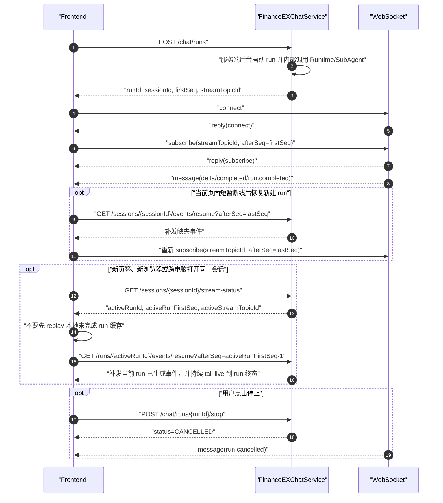

# FinanceEXChatService 前端联调文档

本文档面向 Web 前端联调，覆盖会话、文档上传、创建 run、WebSocket 实时订阅、Event Resume 断点恢复、停止回答和常见排障。当前正式版采用 ChatGPT-like 单一对话流协议：HTTP 负责创建/控制后台 run；WebSocket 负责当前页面新建 run 的实时订阅；Event Resume 负责恢复链路，其中会话级事件恢复是有限补发，run 级事件恢复在 active run 场景会先补发再接续 live 事件直到 run 终态。

## 基础约定

- HTTP base URL：`http://localhost:8080`
- WebSocket URL：`ws://localhost:8080/api/v1/ex/chat/ws`
- 如果后端配置了上下文根，例如 Servlet/MVC 模式下 `server.servlet.context-path=/fin/ex`
  或 WebFlux 模式下 `spring.webflux.base-path=/fin/ex`，则 WebSocket URL 也必须带上同一前缀：
  `ws://localhost:8080/fin/ex/api/v1/ex/chat/ws`。
- 所有时间字段均为 ISO-8601 字符串。
- `seq` / `sequence` 是 openGauss 生成的事件恢复游标，前端断点恢复只保存最后收到的最大 `sequence`。
- 前端只把 `sequence` 当作不透明数字游标，不要自行推算生成方式；服务端以事件表事实源保证同一会话内的恢复顺序。
- 前端不要传 `tenantId`、`userId`，也不要通过 Header/Query/Body 伪造用户身份；身份由后端请求入口通过 `AuthContextProvider` 从服务端上下文解析一次，后台 run 不会再次读取请求 ThreadLocal。
- 本文档中的 WebSocket 只指前端到 FinanceEXChatService 的 `/api/v1/ex/chat/ws` 连接。FinanceEXChatService 到下游 RelayAgent 当前只保留 streamable HTTP adapter；前端不直接连接 RelayAgent，也不通过前端 WebSocket 发起 `AgentRuntime.query`。
- 本地开发需要后端显式配置：

```bash
export FINANCEEX_DEV_TENANT_ID=tenant_dev
export FINANCEEX_DEV_USER_ID=user_dev
export FINANCEEX_DEV_USERNAME=developer
```

## 接口总览

| 场景 | 方法 | 路径 | 说明 |
| --- | --- | --- | --- |
| 创建会话 | `POST` | `/api/v1/ex/chat/sessions` | 显式创建会话；也可以直接调用 `/chat/runs`，不传 `sessionId` 时由后端创建或归一化 |
| 会话列表（游标） | `GET` | `/api/v1/ex/chat/sessions?limit=20&cursor=...` | 当前用户会话游标分页 |
| 会话列表（页码） | `GET` | `/api/v1/ex/chat/sessions/page?curPage=1&pageSize=20` | 当前用户历史会话页码分页，返回 totalRows |
| 会话详情 | `GET` | `/api/v1/ex/chat/sessions/{sessionId}` | 查询单个会话元数据 |
| 会话状态 | `GET` | `/api/v1/ex/chat/sessions/{sessionId}/state?messageLimit=50` | 切换会话时聚合会话、历史消息和流状态 |
| 历史消息 | `GET` | `/api/v1/ex/chat/sessions/{sessionId}/messages?leafMessageId=...&limit=50` | 查询当前 active path 或指定 leaf path |
| 消息树视图 | `GET` | `/api/v1/ex/chat/sessions/{sessionId}/messages/tree` | 查询完整可见消息树 mapping，用于复杂版本树或调试 |
| 消息版本 | `GET` | `/api/v1/ex/chat/sessions/{sessionId}/messages/{messageId}/variants` | 查询同父节点候选版本 |
| 切换路径 | `POST` | `/api/v1/ex/chat/sessions/{sessionId}/path` | 将会话当前 leaf 切换到指定消息 |
| 新建分支 | `POST` | `/api/v1/ex/chat/sessions/{sessionId}/branches` | 从某条消息创建只读历史快照分支 |
| 重命名会话 | `PATCH` | `/api/v1/ex/chat/sessions/{sessionId}` | 更新会话标题 |
| 归档/恢复会话 | `POST` | `/api/v1/ex/chat/sessions/{sessionId}/archive`、`/restore` | 会话列表管理 |
| 删除会话 | `DELETE` | `/api/v1/ex/chat/sessions/{sessionId}` | 软删除单个会话，历史事实数据保留 |
| 批量删除会话 | `DELETE` | `/api/v1/ex/chat/sessions` | 批量软删除会话，active run 存在时整体失败 |
| 创建 run | `POST` | `/api/v1/ex/chat/runs` | 唯一提问入口，返回 `streamTopicId` |
| WebSocket | `WS` | `/api/v1/ex/chat/ws` | 用户级长连接，按 run topic 订阅实时事件 |
| 会话事件恢复 | `GET` | `/api/v1/ex/chat/sessions/{sessionId}/events/resume?afterSeq={seq}` | 有限补发整个会话缺失事件 |
| Run 事件恢复 | `GET` | `/api/v1/ex/chat/runs/{runId}/events/resume?afterSeq={seq}` | 跨页签、跨浏览器或跨电脑续接正在输出的当前回答 |
| 流状态 | `GET` | `/api/v1/ex/chat/sessions/{sessionId}/stream-status` | 查询最新 `seq`、active run 和是否可取消 |
| 停止回答 | `POST` | `/api/v1/ex/chat/runs/{runId}/stop` | 幂等停止当前 run |
| 消息反馈 | `POST` / `DELETE` | `/api/v1/ex/chat/messages/{messageId}/feedback` | 对 assistant 消息点赞、点踩、切换或取消 |
| 上传文档 | `POST` | `/api/v1/ex/documents` | multipart 上传本地文件 |
| 文档列表 | `GET` | `/api/v1/ex/documents?sessionId=...&limit=20&cursor=...` | 当前用户文档库；`sessionId` 可选，用于筛选会话关联文档 |
| 文档详情 | `GET` | `/api/v1/ex/documents/{documentId}` | 查询单个文档 |
| 文档更新 | `PATCH` | `/api/v1/ex/documents/{documentId}` | 更新展示名或元数据 |
| 文档状态 | `GET` | `/api/v1/ex/documents/{documentId}/status` | 查询处理状态 |
| 文档预览/下载 | `GET` | `/api/v1/ex/documents/{documentId}/preview-url`、`/download` | 后端受控流式访问 |
| 文档删除 | `DELETE` | `/api/v1/ex/documents/{documentId}` | 软删除文档 |

正式版只有上表这些对外入口。前端不要再保留历史多入口聊天协议，也不要通过 WebSocket 发送聊天请求体；聊天必须先创建 run，再订阅或恢复 run 的事件。

仓库中提供了一个独立本地联调台：`local-test-frontend/`。它通过本地 Node 代理访问 `/api/v1/ex/**`，可用于验证会话、消息树、文档库、run、WebSocket topic、Event Resume、stop 和跨页签续接，不会影响后端代码。

本地联调台支持类似 Postman 的自定义请求头配置。由于浏览器不能直接设置 `Cookie` 请求头，也不能给原生 `WebSocket` 自定义握手 header，联调台采用本地代理 profile：页面左侧“鉴权请求头”保存 `Cookie/Authorization/X-*` 后，浏览器只携带非敏感 profileId，`server.mjs` 代理在转发 HTTP、fetch Event Resume、文件下载和 WebSocket 握手时统一注入真实请求头。该能力只用于本地调试企业鉴权框架，不属于生产前端协议。

## 错误响应

HTTP 接口的错误响应结构稳定，前端可以统一解析 `code` 和 `message`：

```json
{
  "timestamp": "2026-05-17T01:06:00Z",
  "path": "/api/v1/ex/chat/runs",
  "status": 409,
  "error": "Conflict",
  "code": "ACTIVE_RUN_EXISTS",
  "message": "ACTIVE_RUN_EXISTS: 当前会话已有运行中的回答，请先停止或等待完成。activeRunId=run_xxx"
}
```

常见 HTTP 错误码：

| HTTP | `code` | 场景 | 前端建议 |
| --- | --- | --- | --- |
| 400 | `BAD_REQUEST` | 参数为空、文档 ID 为空、非法 topic 等业务参数错误 | 提示用户修正输入或刷新状态 |
| 400 | `VALIDATION_FAILED` | 请求体字段长度、附件数量等 Bean Validation 失败 | 根据 `message` 标记表单字段 |
| 401 | `AUTH_CONTEXT_MISSING` | 后端入口没有解析到企业身份上下文 | 跳转登录或提示重新认证 |
| 403 | `ACCESS_DENIED` | 当前用户访问了不属于自己的 session/run/document/message | 清理本地缓存并重新加载会话列表 |
| 409 | `ACTIVE_RUN_EXISTS` | 同一 session 已有运行中 run | 保持“生成中/停止”状态，先 stop 或等待终态 |
| 409 | `CONFLICT` | 会话关闭、文档不可下载、快照消息不可编辑等状态冲突 | 按业务状态禁用相关操作 |

WebSocket 错误不使用 HTTP body，而是 envelope：

```json
{
  "id": "cmd-1",
  "type": "error",
  "topicId": "chat-run-run_xxx",
  "offset": "12019",
  "code": "RECOVER_REQUIRED",
  "message": "实时事件需要恢复，请使用 Event Resume 从 afterSeq=12002 补齐"
}
```

常见 WebSocket `code`：`WS_AUTH_FAILED`、`WS_ORIGIN_FORBIDDEN`、`WS_MESSAGE_TOO_LARGE`、
`BAD_WS_MESSAGE`、`SUBSCRIBE_ERROR`、`NOT_SUBSCRIBED`、`RECOVER_REQUIRED`。

## 接口使用速查

下面先给出前端接入路线图、关键字段关联关系、场景级调用编排和逐接口字段矩阵；后续章节给出更完整的 curl 和前端代码示例。新接入同学可以按本节顺序完成页面联调，不需要先阅读后端代码。

### 前端开发接入路线图

一个新前端开发人员建议按下面顺序完成集成，不要从 WebSocket 或 Event Resume 开始：

1. **身份与基础地址**：确认 HTTP base URL、WebSocket URL、context path、企业 Cookie/header 注入方式。所有接口都依赖同一个后端身份上下文，不在请求体传 `tenantId/userId`。
2. **会话列表与会话状态**：先接 `GET /chat/sessions` 和 `GET /chat/sessions/{sessionId}/state`。会话列表负责左侧导航，state 负责进入会话后一次性拿到历史消息和 active run 状态。
3. **创建 run 与实时输出**：接 `POST /chat/runs`，拿到 `runId/sessionId/firstSeq/streamTopicId` 后，通过 WebSocket `subscribe(topicId, afterSeq)` 接实时事件。
4. **事件恢复与停止**：接 `stream-status`、run 级 `/events/resume` 和 `/runs/{runId}/stop`。这三者决定刷新、跨页签、跨电脑和停止回答时的正确行为。
5. **消息树功能**：接 `messages`、`variants`、`path`、`branches`，实现编辑历史问题、重新生成回答、版本切换和从消息新建分支。
6. **文档和反馈**：最后接文档库、附件引用、点赞点踩和取消反馈；这些能力都依赖已经能稳定渲染历史消息。

### 关键字段关联关系

| 字段 | 由哪个接口产生 | 后续在哪些接口使用 | 前端保存建议 |
| --- | --- | --- | --- |
| `sessionId` | `POST /chat/sessions`、`POST /chat/runs`、会话列表 | 所有会话、消息、stream-status、Event Resume、文档上传关联 | 作为路由参数和会话状态 key 持久保存 |
| `runId` | `POST /chat/runs`、`stream-status.activeRunId` | stop、run 级 Event Resume、反馈可选关联、日志排障 | 当前 active run 保存到会话运行态，终态后可清空运行态但保留消息里的 `runId` |
| `streamTopicId` | `POST /chat/runs`、`stream-status.activeStreamTopicId` | WebSocket `subscribe/unsubscribe` | 只用于实时订阅，不要手写；格式当前为 `chat-run-{runId}` |
| `sequence` / `seq` | WebSocket `payload.sequence`、Event Resume 事件 | Event Resume `afterSeq`、本地去重 | 每个 session 保存已处理最大值；渲染事件前按 `sessionId + sequence` 去重 |
| `firstSeq` | `POST /chat/runs` | 新建 run 后首次 WebSocket subscribe 的 `afterSeq` | 创建 run 后立即保存；通常 `subscribe.afterSeq=firstSeq` |
| `activeRunFirstSeq` | `stream-status` | 新页签、新浏览器、跨电脑恢复 active run | 恢复 active run 时用 `activeRunFirstSeq - 1`，不要直接用 `latestSeq` |
| `messageId` | 历史消息接口、run completed 后的 assistant 消息 | variants、path、branch、feedback、编辑/重新生成入参 | 作为消息树节点 ID 保存到消息状态 |
| `leafMessageId` | 历史消息、variants、会话 `currentLeafMessageId` | `GET /messages?leafMessageId=...`、`POST /path` | 切换历史版本时保存当前选中的 leaf |
| `documentId` | 文档上传或文档列表 | `attachments[].documentId`、文档详情/状态/下载/删除 | 文档库资产 ID；只有 `AVAILABLE` 文档可作为附件 |
| `feedbackId` | 反馈提交/取消接口 | 前端通常只展示，不作为后续必填入参 | 可用于排障；按钮高亮以 `ChatMessageDto.feedback.rating` 为准 |
| `cursor` | 会话列表、文档列表分页响应 | 下一页查询参数 | 只对产生它的列表接口有效，不跨接口复用 |

### 场景级调用编排

| 场景 | 调用顺序 | 关键关联字段 | 前端状态处理 |
| --- | --- | --- | --- |
| 首次打开应用 | `GET /chat/sessions?limit=20` -> 用户选择会话后 `GET /chat/sessions/{sessionId}/state` -> 可选连接 WS `connect` | `sessionId`、`currentLeafMessageId`、`streamStatus.activeRunId` | 左侧列表使用 `firstAssistantAnswer` 做摘要；主面板用 state.messages 渲染历史 |
| 新会话首轮提问 | 可选 `POST /chat/sessions`，或直接 `POST /chat/runs` 不传 `sessionId` -> WS `subscribe(streamTopicId, firstSeq)` | `runId`、`sessionId`、`firstSeq`、`streamTopicId` | 乐观渲染 user 消息；收到 `message.delta` 创建/追加 assistant 草稿，收到 `message.snapshot` 替换草稿；终态后关闭 loading |
| 已有会话继续提问 | `GET /state` 确认无 active run -> `POST /chat/runs(sessionId, runMode=NEXT)` -> WS subscribe | `sessionId`、`parentMessageId` 可选、`streamTopicId` | 同一 session 存在 active run 时不要再次发送；遇到 409 使用 stop 或等待终态 |
| 当前页短暂断线重连 | 本地保存 `lastSeq` -> 重建 WS -> `subscribe(topicId, afterSeq=lastSeq)`；如果收到 `RECOVER_REQUIRED`，先 Event Resume 再重新 subscribe | `topicId`、`lastSeq`、`sequence` | 以 `sessionId + sequence` 去重；不要重复追加同一 delta |
| 新页签/新浏览器/跨电脑打开 active run | `GET /state` 或 `stream-status` -> 若有 `activeRunId`，调用 `GET /runs/{activeRunId}/events/resume?afterSeq=activeRunFirstSeq-1` | `activeRunId`、`activeRunFirstSeq`、`activeStreamTopicId` | run 级 Event Resume 会补发并 tail 到终态；同一个 run 恢复期间不要再 WebSocket subscribe |
| 停止回答 | 用户点击停止 -> `POST /runs/{runId}/stop` -> 等待 WS 或 Event Resume 收到 `run.cancelled` | `runId`、stop 前本地 `lastSeq` | stop 不是关闭 WebSocket；若 stop 前已有正文或用户可见 parts，历史消息会保存 partial assistant |
| 编辑历史 user 消息 | 用户点击编辑 -> `POST /chat/runs(runMode=EDIT_USER, editedMessageId, message)` -> 订阅新 run -> `variants` 刷新版本游标 | `editedMessageId`、新 user `messageId`、新 assistant `messageId` | 旧消息不覆盖；新 user sibling 和新 assistant sibling 进入消息树 |
| 重新生成 assistant | 用户点击重新生成 -> `POST /chat/runs(runMode=REGENERATE_ASSISTANT, regeneratedMessageId)` -> 订阅新 run -> `variants` 刷新版本游标 | `regeneratedMessageId`、原父 user messageId、新 assistant messageId | 复用原 user 节点，新 assistant 作为 sibling 保存 |
| 切换历史版本 | `GET /messages/{messageId}/variants` -> 用户选择某个候选 -> `POST /sessions/{sessionId}/path(leafMessageId)` -> `GET /messages` 重渲染 | `messageId`、`leafMessageId`、`currentLeafMessageId` | 只切换展示路径，不创建 run，不调用 Runtime |
| 从消息新建分支 | `POST /sessions/{sessionId}/branches(sourceMessageId)` -> 选择新 `sessionId` -> `GET /state` | `sourceMessageId`、新 `sessionId`、`sourceSessionId/sourceMessageId` | 分支快照消息 `locked=true`，禁用编辑、删除和重新生成 |
| 上传文件并作为附件提问 | `POST /documents(file, sessionId)` -> 等状态 `AVAILABLE` -> `POST /chat/runs(attachments[{documentId}])` | `documentId`、`sessionId`、`attachments[].documentId` | 附件不是消息类型；PROCESSING/FAILED/DELETED 不可作为聊天附件 |
| 选中历史技能并带文档提问 | `POST /documents(file,targetProvider=legacy-agent,skillId)` -> `POST /chat/runs(metadata.selectedSkillId,attachments)` | `documentId`、`metadata.selectedSkillId`、`metadata.legacyAgent` | 显式技能路由不创建 RuntimeBinding；附件必须来自 `legacy-agent` provider |
| 点赞/点踩/取消 | 历史消息中找到 assistant `messageId` -> `POST /messages/{messageId}/feedback`；再次点击已选按钮 -> `DELETE /feedback` | `messageId`、可选 `runId`、`feedback.rating/status` | 历史消息 `feedback` 非空时高亮；取消后返回 `status=CANCELLED`，历史消息再查为 `feedback=null` |
| 会话归档/恢复/删除 | 单个：`POST /archive`、`POST /restore`、`DELETE /sessions/{sessionId}`；批量：`DELETE /sessions` body `sessionIds[]` | `sessionId`、`sessionIds[]` | 删除是软删除；有 active run 时先 stop，否则删除失败 |
| 文档库管理 | `GET /documents` -> `GET /documents/{documentId}`/`status`/`preview-url`/`download`/`PATCH`/`DELETE` | `documentId`、`cursor`、`status` | 列表默认不返回 DELETED；下载和预览只允许 AVAILABLE |

### 逐接口字段矩阵

| 接口 | 请求字段 | 响应字段 | 后续关联 |
| --- | --- | --- | --- |
| `POST /chat/sessions` | Body：`title` 会话标题，可空；`channel` 来源渠道，可空 | `ChatSessionDto` 全字段 | 使用 `sessionId` 作为会话路由和后续 run 入参 |
| `GET /chat/sessions` | Query：`limit` 页大小；`cursor` 上一页游标 | `items[]`、`nextCursor`；item 带 `firstAssistantAnswer` | 游标分页；`nextCursor` 查下一页；`sessionId` 进入 state |
| `GET /chat/sessions/page` | Query：`curPage` 当前页，默认 1；`pageSize` 页大小，默认 20 | `items[]`、`curPage`、`pageSize`、`totalRows`、`totalPages`；item 带 `firstAssistantAnswer` | 页码分页；适合传统分页组件，旧游标接口保持不变 |
| `GET /chat/sessions/{sessionId}` | Path：`sessionId` | `ChatSessionDto` | 只拿元数据，不返回历史和流状态 |
| `GET /chat/sessions/{sessionId}/state` | Path：`sessionId`；Query：`messageLimit` | `session`、`messages.items[]`、`messages.nextCursor`、`streamStatus` | 页面切换会话首选接口；根据 `streamStatus.activeRunId` 决定是否恢复 |
| `GET /chat/sessions/{sessionId}/messages` | Path：`sessionId`；Query：`leafMessageId` 可选，`cursor` 保留，`limit` | `ChatMessagePageDto.items[]`、`nextCursor` | 用 `messageId` 做反馈、版本、分支和重新生成 |
| `GET /chat/sessions/{sessionId}/messages/tree` | Path：`sessionId` | `ChatMessageTreeDto`：`sessionId`、`currentLeafMessageId`、`rootMessageIds[]`、`mapping` | 读取完整可见消息树；不返回 hidden system、raw log 或下游工具原始节点 |
| `GET /chat/sessions/{sessionId}/messages/{messageId}/variants` | Path：`sessionId`、`messageId` | `ChatMessageDto[]` | 用候选消息的 `messageId` 调 `path` 切换版本 |
| `POST /chat/sessions/{sessionId}/path` | Path：`sessionId`；Body：`leafMessageId` | `ChatSessionDto` | 切换成功后重新查 `messages` 渲染 active path |
| `POST /chat/sessions/{sessionId}/branches` | Path：源 `sessionId`；Body：`sourceMessageId`、`title` 可选 | 新分支 `ChatSessionDto` | 使用返回的新 `sessionId` 进入分支会话 |
| `PATCH /chat/sessions/{sessionId}` | Path：`sessionId`；Body：`title` | `ChatSessionDto` | 更新左侧列表标题 |
| `POST /chat/sessions/{sessionId}/archive` | Path：`sessionId` | `ChatSessionDto(status=ARCHIVED)` | 可从普通列表隐藏；恢复用 restore |
| `POST /chat/sessions/{sessionId}/restore` | Path：`sessionId` | `ChatSessionDto(status=ACTIVE)` | 恢复后可继续发 run |
| `DELETE /chat/sessions/{sessionId}` | Path：`sessionId` | `ChatSessionDto(status=DELETED)` | 删除后清理本地当前会话状态和订阅 |
| `DELETE /chat/sessions` | Body：`sessionIds[]` | `deletedCount`、`items[]` | 批量删除成功后从列表移除这些 session |
| `POST /chat/runs` | Body：`commandId`、`sessionId`、`conversationId`、`message`、`runMode`、`parentMessageId`、`editedMessageId`、`regeneratedMessageId`、`attachments[]`、`metadata` | `runId`、`sessionId`、`firstSeq`、`createdAt`、`streamTopicId` | 用 `streamTopicId` 订阅；用 `runId` stop/恢复/反馈 |
| `POST /chat/runs/{runId}/stop` | Path：`runId`；Header：可选 Cookie | `runId`、`sessionId`、`status`、`latestSeq`、`stoppedAt` | 用 Event Resume 补齐 `run.cancelled` |
| `GET /chat/sessions/{sessionId}/events/resume` | Path：`sessionId`；Query：`afterSeq` | SSE data：`ConversationTurnStreamDto` | 补会话缺失事件；`ConversationTurnStreamDto.payload.encodedItem.data` 中的 ChatEvent 更新本地 `lastSeq` |
| `GET /chat/runs/{runId}/events/resume` | Path：`runId`；Query：`afterSeq` | SSE data：`ConversationTurnStreamDto`，active run 会持续到终态 | 新页签/跨设备恢复 active run 首选；会额外发送 heartbeat/done |
| `GET /chat/sessions/{sessionId}/stream-status` | Path：`sessionId` | `ChatStreamStatusDto` | 判断 active run、stop 按钮、恢复起点 |
| `POST /chat/messages/{messageId}/feedback` | Path：`messageId`；Body：`runId`、`rating`、`reasonCode`、`commentText`、`metadata` | `MessageFeedbackDto(status=ACTIVE)` | 更新历史消息按钮高亮 |
| `DELETE /chat/messages/{messageId}/feedback` | Path：`messageId`；Query：`runId` 可选 | `MessageFeedbackDto(status=CANCELLED)` | 取消按钮高亮 |
| `POST /documents` | multipart：`file`；`sessionId` 可选 | `UploadedDocumentDto` | 用返回 `id` 作为 `attachments[].documentId` |
| `GET /documents` | Query：`sessionId` 可选，`limit`，`cursor` | `DocumentLibraryPageDto.items[]`、`nextCursor` | 文档选择器和最近文档列表 |
| `GET /documents/{documentId}` | Path：`documentId` | `UploadedDocumentDto` | 详情弹窗 |
| `PATCH /documents/{documentId}` | Path：`documentId`；Body：`originalName`、`metadataJson` | `UploadedDocumentDto` | 更新文档展示 |
| `DELETE /documents/{documentId}` | Path：`documentId` | `UploadedDocumentDto(status=DELETED)` | 从选择器移除，不再允许作为附件 |
| `GET /documents/{documentId}/status` | Path：`documentId` | `documentId`、`status`、`tokenSize` | 轮询处理状态或展示失败 |
| `GET /documents/{documentId}/preview-url` | Path：`documentId` | `documentId`、`accessUrl`、`accessType`、`expiresAt` | 前端打开后端受控预览/下载地址 |
| `GET /documents/{documentId}/download` | Path：`documentId` | 二进制流 | 浏览器下载或预览 |

### 会话接口

| 接口 | 使用场景 | 入参 | 出参 | 注意事项 |
| --- | --- | --- | --- | --- |
| `POST /api/v1/ex/chat/sessions` | 用户点击“新建会话”时显式创建。 | JSON body：`title` 可选，`channel` 可选，默认可为空。 | `ChatSessionDto`：`sessionId`、`title`、`status`、`channel`、`createdAt`、`updatedAt`。 | 前端不传租户和用户；后端从身份上下文解析。 |
| `GET /api/v1/ex/chat/sessions` | 左侧会话列表游标分页加载。 | Query：`limit` 可选，默认 20；`cursor` 可选。 | `ChatSessionPageDto`：`items[]`、`nextCursor`；每个 `ChatSessionDto` 带 `firstAssistantAnswer`。 | 返回按最近更新时间倒序排列；`nextCursor=null` 表示无下一页；`firstAssistantAnswer` 是会话第一条完整 assistant 回答，可为空。 |
| `GET /api/v1/ex/chat/sessions/page` | 左侧会话列表页码分页加载。 | Query：`curPage` 可选，默认 1；`pageSize` 可选，默认 20，最大 100。 | `ChatSessionNumberPageDto`：`items[]`、`curPage`、`pageSize`、`totalRows`、`totalPages`；每个 `ChatSessionDto` 带 `firstAssistantAnswer`。 | 不返回 `DELETED` 会话；适合需要总行数的传统分页组件；旧游标分页不受影响。 |
| `GET /api/v1/ex/chat/sessions/{sessionId}` | 只需要会话元数据时使用。 | Path：`sessionId`。 | `ChatSessionDto`。 | 会校验当前用户是否拥有该会话。 |
| `GET /api/v1/ex/chat/sessions/{sessionId}/state` | 切换会话或跨电脑打开会话时首选。 | Path：`sessionId`；Query：`messageLimit` 可选，默认 50。 | `ChatSessionStateDto`：`session`、`messages`、`streamStatus`。 | `messages` 返回当前 active path；正在输出的草稿仍走事件流，用户主动 stop 后已落库正文或用户可见 parts 会作为 partial assistant 返回。 |
| `GET /api/v1/ex/chat/sessions/{sessionId}/messages` | 历史消息路径回看。 | Path：`sessionId`；Query：`leafMessageId` 可选，`limit` 默认 50，`cursor` 保留。 | `ChatMessagePageDto`：`items[]`、`nextCursor`。 | 不传 `leafMessageId` 时返回当前 active path；传入时返回 root 到该 leaf 的路径。 |
| `GET /api/v1/ex/chat/sessions/{sessionId}/messages/tree` | 复杂前端读取完整消息树，或联调排查版本关系。 | Path：`sessionId`。 | `ChatMessageTreeDto`。 | 只读接口；不改变当前路径，不创建 run；mapping 只包含业务可见 user/assistant 消息。 |
| `GET /api/v1/ex/chat/sessions/{sessionId}/messages/{messageId}/variants` | 切换编辑/重新生成后的候选版本。 | Path：`sessionId`、`messageId`。 | `ChatMessageDto[]`。 | 返回同父节点、同角色的 sibling 版本。 |
| `POST /api/v1/ex/chat/sessions/{sessionId}/path` | 用户选择某个历史版本作为当前路径。 | Path：`sessionId`；JSON body：`leafMessageId`。 | `ChatSessionDto`。 | 只切换 `currentLeafMessageId`，不创建 run。 |
| `POST /api/v1/ex/chat/sessions/{sessionId}/branches` | 从某条消息新建只读历史快照分支。 | Path：来源 `sessionId`；JSON body：`sourceMessageId` 必填，`title` 可选。 | 新分支 `ChatSessionDto`。 | 复制 root 到来源消息路径；快照消息 locked，不可编辑/重新生成。 |
| `PATCH /api/v1/ex/chat/sessions/{sessionId}` | 用户重命名会话。 | Path：`sessionId`；JSON body：`title`。 | `ChatSessionDto`。 | `title` 为空时保留原值。 |
| `POST /api/v1/ex/chat/sessions/{sessionId}/archive` | 用户归档会话。 | Path：`sessionId`。 | `ChatSessionDto`。 | 归档通常用于列表隐藏，不删除历史。 |
| `POST /api/v1/ex/chat/sessions/{sessionId}/restore` | 用户恢复归档会话。 | Path：`sessionId`。 | `ChatSessionDto`。 | 恢复后可重新出现在普通会话列表。 |
| `DELETE /api/v1/ex/chat/sessions/{sessionId}` | 用户删除会话。 | Path：`sessionId`。 | `ChatSessionDto`，`status=DELETED`。 | 软删除，不物理删除历史事实数据；如果会话存在 active run，需先调用 stop。 |
| `DELETE /api/v1/ex/chat/sessions` | 用户批量删除会话。 | JSON body：`sessionIds[]`。 | `BatchDeleteChatSessionsDto`：`deletedCount`、`items[]`。 | all-or-nothing；任意会话不存在、不属于当前用户或存在 active run 时整体失败，不做部分删除。 |

### Run 与流式接口

| 接口 | 使用场景 | 入参 | 出参 | 注意事项 |
| --- | --- | --- | --- | --- |
| `POST /api/v1/ex/chat/runs` | 唯一提问入口，创建后台 run。 | JSON body：`commandId` 可选，`sessionId` 可选，`conversationId` 可选，`message`、`runMode`、`parentMessageId`、`editedMessageId`、`regeneratedMessageId`、`attachments[]`、`metadata`。 | `ChatRunStartDto`：`runId`、`sessionId`、`firstSeq`、`createdAt`、`streamTopicId`。 | `runMode` 默认 `NEXT`；`metadata.selectedSkillId` 存在时进入显式技能兼容路由，不读取或创建 RuntimeBinding。 |
| `POST /api/v1/ex/chat/runs/{runId}/stop` | 用户点击停止回答。 | Path：`runId`。 | `ChatRunStopDto`：`runId`、`sessionId`、`status`、`latestSeq`、`stoppedAt`。 | 幂等；停止语义不是关闭 WebSocket。 |
| `GET /api/v1/ex/chat/sessions/{sessionId}/events/resume` | 断线、刷新、复制页签后补齐整个会话缺失 event。 | Path：`sessionId`；Query：`afterSeq` 默认 0。 | `text/event-stream`，data 为 `ConversationTurnStreamDto`。 | 使用本地已处理最大 `sequence` 作为 `afterSeq`；只处理 `stream-item` 中的 `encodedItem.data`。 |
| `GET /api/v1/ex/chat/runs/{runId}/events/resume` | 跨页签、跨浏览器或跨电脑续接当前正在输出的 active run。 | Path：`runId`；Query：`afterSeq` 默认 0。 | `text/event-stream`，data 为 `ConversationTurnStreamDto`。 | 页面初始化恢复 active run 时，统一使用 `activeRunFirstSeq - 1` 作为 `afterSeq`；该连接会先补发历史事件，再持续输出 live 事件直到 run 终态，并以 `done` 闭合。 |
| `GET /api/v1/ex/chat/sessions/{sessionId}/stream-status` | 判断是否存在 active run、是否可停止、从哪里恢复。 | Path：`sessionId`。 | `ChatStreamStatusDto`：`latestSeq`、`activeRunId`、`activeStreamTopicId`、`activeRunFirstSeq`、`activeRunLastSeq`、`cancellable`。 | `latestSeq` 是服务端事实源最新位置，不是客户端已消费位置。 |
| `POST /api/v1/ex/chat/messages/{messageId}/feedback` | 用户对完整 assistant 消息点赞、点踩或切换反馈。 | Path：`messageId`；JSON body：`runId` 可选，`rating=LIKE/DISLIKE`，`reasonCode` 可选，`commentText` 可选，`metadata` 可选。 | `MessageFeedbackDto`：`feedbackId`、`messageId`、`runId`、`rating`、`status=ACTIVE`、`createdAt`、`updatedAt`。 | 同一用户同一消息最多一条当前反馈；重复提交表示修改当前反馈。 |
| `DELETE /api/v1/ex/chat/messages/{messageId}/feedback` | 用户取消已点赞或已点踩状态。 | Path：`messageId`；Query：`runId` 可选。 | `MessageFeedbackDto`：`status=CANCELLED`。 | 幂等；没有历史反馈时也返回取消成功。历史消息中的 `feedback` 会返回 `null`。 |

同一会话同一时间只允许一个 active run。若发送时已有 `RUNNING/CANCELLING` run，
`POST /chat/runs` 会返回 HTTP 409，错误码 `ACTIVE_RUN_EXISTS`。前端应保持“生成中/停止”
按钮状态，先调用 stop 或等待终态后再允许同一会话再次发送。

### WebSocket 控制消息

| 消息 | 使用场景 | 入参 | 出参 | 注意事项 |
| --- | --- | --- | --- | --- |
| `connect` | WebSocket 打开后声明连接状态。 | `id`、`type=connect`、`presence=foreground/background`。 | `reply(connect)`，含 `connectionId`。 | 用户身份来自握手入口的后端上下文，不通过消息体传入。 |
| `subscribe` | 订阅某个 run 的实时输出。 | `id`、`type=subscribe`、`topicId`、`afterSeq`。 | `reply(subscribe)`，随后收到 `message` envelope。 | `topicId` 必须来自 `/chat/runs` 或 `stream-status.activeStreamTopicId`。 |
| `unsubscribe` | 不再关注某个 run topic。 | `id`、`type=unsubscribe`、`topicId`。 | `reply(unsubscribe)`。 | 切换会话不一定要断开 WebSocket，可以只取消旧 topic。 |
| `presence` | 页面前后台切换。 | `id`、`type=presence`、`state=foreground/background`。 | `reply(presence)`。 | 只作为在线状态和资源治理信号，不影响 run 生命周期。 |

### 文档接口

| 接口 | 使用场景 | 入参 | 出参 | 注意事项 |
| --- | --- | --- | --- | --- |
| `POST /api/v1/ex/documents` | 上传本地文件到文档库。 | multipart：`file` 必填，`sessionId` 可选，`targetProvider` 可选，`skillId` 可选，`metadata` 可选 JSON 字符串；Header 可带标准 `Cookie`。 | `UploadedDocumentDto`。 | 不传 `targetProvider` 使用 default-storage；`targetProvider=legacy-agent` 时后端转发配置化老 Agent upload 接口，并把 provider docId 或 url 写入统一文档库。只有 provider 配置 `forward-cookie=true` 时，入口 Cookie 才会作为下游 upload HTTP header 透传。 |
| `GET /api/v1/ex/documents` | 文档库列表或最近文档选择器。 | Query：`sessionId` 可选，`limit` 默认 20，`cursor` 可选。 | `DocumentLibraryPageDto`：`items[]`、`nextCursor`。 | 默认不返回 `DELETED` 文档。 |
| `GET /api/v1/ex/documents/{documentId}` | 查询文档详情。 | Path：`documentId`。 | `UploadedDocumentDto`。 | 可查看 `AVAILABLE/PROCESSING/FAILED` 等非删除状态。 |
| `PATCH /api/v1/ex/documents/{documentId}` | 修改展示文件名或扩展元数据。 | Path：`documentId`；JSON body：`originalName`、`metadataJson`。 | `UploadedDocumentDto`。 | 空字段表示保留原值。 |
| `DELETE /api/v1/ex/documents/{documentId}` | 软删除文档。 | Path：`documentId`。 | `UploadedDocumentDto`。 | 删除后不能再作为聊天附件。 |
| `GET /api/v1/ex/documents/{documentId}/status` | 查询解析状态或失败原因扩展信息。 | Path：`documentId`。 | `DocumentStatusDto`：`documentId`、`status`、`tokenSize`。 | `PROCESSING/FAILED` 可查状态，但不能下载、预览或作为聊天附件。 |
| `GET /api/v1/ex/documents/{documentId}/preview-url` | 获取后端受控预览地址。 | Path：`documentId`。 | `DocumentAccessDto`。 | 当前返回后端 download 地址；provider 未启用 download 时返回 `DOCUMENT_CONTENT_MANAGED_BY_PROVIDER`。 |
| `GET /api/v1/ex/documents/{documentId}/download` | 下载文档原始内容。 | Path：`documentId`。 | 二进制流，带 `Content-Disposition`。 | 只允许 `AVAILABLE` 文档下载；provider 未启用 download 时返回 `DOCUMENT_CONTENT_MANAGED_BY_PROVIDER`。 |

## 公共 DTO 字段

这些字段在多个接口中复用，前端实现时建议按表统一建类型。

### `ChatSessionDto`

| 字段 | 含义 |
| --- | --- |
| `sessionId` | 前端聊天会话 ID，路由参数和列表 key 使用 |
| `tenantId` / `userId` | 服务端身份上下文解析出的归属字段，仅用于调试展示，不要回传 |
| `title` | 会话标题 |
| `status` | `ACTIVE`、`ARCHIVED`、`DELETED` 等会话状态；`DELETED` 会话对列表和详情不可见 |
| `channel` | 会话来源渠道，例如 `web`、`web-local-test` |
| `currentLeafMessageId` | 当前激活消息树路径的叶子；历史查询默认返回 root 到该 leaf |
| `rootSessionId` | 分支族根会话 ID |
| `branchSourceSessionId` | 当前会话从哪个源会话分支而来，普通会话为空 |
| `branchSourceMessageId` | 当前会话从源会话哪条消息分支而来，普通会话为空 |
| `firstAssistantAnswer` | 会话第一条 assistant 完整回答，仅会话分页列表保证装配；创建、详情、state 等非列表场景可为空 |
| `createdAt` / `updatedAt` | 创建和最后更新时间 |

### `BatchDeleteChatSessionsRequest`

| 字段 | 含义 |
| --- | --- |
| `sessionIds` | 待软删除会话 ID 列表；服务端会去重，单次最多处理 100 个。 |

### `BatchDeleteChatSessionsDto`

| 字段 | 含义 |
| --- | --- |
| `deletedCount` | 成功软删除的会话数量。 |
| `items` | 删除后的 `ChatSessionDto[]`，每个状态均为 `DELETED`。 |

### 会话管理请求 DTO

| DTO | 字段 | 含义 |
| --- | --- | --- |
| `CreateChatSessionRequest` | `title` | 新会话标题；为空时后端使用默认标题。 |
| `CreateChatSessionRequest` | `channel` | 会话来源渠道；普通 Web 端可传 `web`，本地联调台可传 `web-local-test`。 |
| `UpdateChatSessionRequest` | `title` | 重命名后的会话标题；为空时保留原值。 |
| `SelectChatPathRequest` | `leafMessageId` | 目标 active path 叶子消息 ID；必须属于当前会话。 |
| `CreateChatBranchRequest` | `sourceMessageId` | 从当前会话哪条消息创建只读快照分支。 |
| `CreateChatBranchRequest` | `title` | 新分支会话标题；为空时由后端生成。 |

### `ChatMessageDto`

| 字段 | 含义 |
| --- | --- |
| `messageId` | 完整历史消息 ID |
| `sessionId` | 消息所属会话 ID |
| `parentMessageId` | 消息树父节点 |
| `nodeOrder` | 会话内消息节点创建顺序 |
| `treeDepth` | 消息树深度 |
| `siblingIndex` | 同一父节点下同角色版本序号，用于 `1/3` 版本游标 |
| `role` | `user` 或 `assistant` |
| `content` | 完整消息正文；正常完成保存完整回答，用户主动 stop 且已有正文时保存截至 stop 的 partial 回答；只有卡片/引用/思考等 parts 时可为空字符串 |
| `tokenCount` | token 估算值，可为空 |
| `runId` | 产生该消息的 run ID；分支快照可能为空 |
| `originType` | `NORMAL` 或 `BRANCH_SNAPSHOT` |
| `locked` | 是否只读；分支快照消息为 `true` |
| `sourceSessionId` / `sourceMessageId` | 分支快照来源 |
| `editedFromMessageId` | 编辑历史 user 消息时的新版本来源 |
| `regeneratedFromMessageId` | 重新生成 assistant 消息时的新版本来源 |
| `parts` | assistant 消息结构化过程信息，包括思考、工具、进度、agent 调用和 ANSWER 快照；user 消息通常为空数组 |
| `feedback` | 当前用户对该 assistant 消息的有效反馈；user 消息或已取消反馈为 `null` |
| `createdAt` | 消息创建时间 |

### `ChatMessagePartDto`

| 字段 | 含义 |
| --- | --- |
| `partId` | 消息 part ID。 |
| `messageId` | 所属 assistant 消息 ID。 |
| `runId` | 产生该 part 的 run ID。 |
| `partType` | `ANSWER`、`PROGRESS`、`METADATA`、`AGENT`、`THINKING`、`TOOL`、`RUNTIME_EVENT`。 |
| `sourceType` | 下游原始事件类型，例如 `agent`、`relay-progress`、`tool_call_streaming`。 |
| `contentText` | 可展示文本摘要，例如进度文本、工具输入预览、最终回答正文。 |
| `title` | 前端展示标题，例如“运行进度”“思考过程”“工具调用”。 |
| `status` | 展示状态：`INFO`、`STARTED`、`STREAMING`、`COMPLETED`、`FAILED`、`UNKNOWN`。 |
| `channel` | 展示频道：`answer`、`progress`、`metadata`、`agent`、`thinking`、`tool`、`runtime`。 |
| `displayHint` | 展示建议：`inline`、`collapsible`、`hidden`、`debug`。 |
| `visible` | 是否默认展示；`ANSWER` 和 debug runtime event 默认不展示。 |
| `payload` | 结构化展示载荷，已脱敏和标准化。 |
| `partOrder` | 同一 assistant 消息内的展示顺序。 |
| `createdAt` | part 创建时间。 |

### `ChatMessageTreeDto`

| 字段 | 含义 |
| --- | --- |
| `sessionId` | 会话 ID。 |
| `currentLeafMessageId` | 当前 active path 叶子消息 ID。 |
| `rootMessageIds` | 根消息 ID 列表，通常是会话第一条 user 消息。 |
| `mapping` | `messageId -> ChatMessageTreeNodeDto` 映射。 |

`ChatMessageTreeNodeDto` 字段：

| 字段 | 含义 |
| --- | --- |
| `id` | 节点 ID，与 `message.messageId` 一致。 |
| `message` | 当前节点的 `ChatMessageDto`，assistant 消息仍包含 `parts` 与 `feedback`。 |
| `parentMessageId` | 父消息 ID；根节点为空。 |
| `children` | 子消息 ID 列表，按会话内创建顺序排列。 |

### `ConversationTurnStreamDto`

WebSocket `message.payload` 和 Event Resume SSE `data` 都使用同一个 turn stream 结构：

| 字段 | 含义 |
| --- | --- |
| `type` | 固定为 `conversation-turn-stream`。 |
| `payload.type` | `stream-item`、`heartbeat` 或 `done`。 |
| `payload.conversationId` | 当前会话 ID，等于 ChatService `sessionId`。 |
| `payload.turnId` | 当前 run ID，等于 ChatService `runId`。 |
| `payload.streamItemId` | stream-item 稳定标识，首版由事件 `sequence` 派生。 |
| `payload.serverTimestampMs` | 服务端生成该片段的毫秒时间戳。 |
| `payload.encodedItem.encoding` | 当前固定为 `chat-event-json-v1`。 |
| `payload.encodedItem.event` | ChatService 标准事件类型，例如 `message.delta`。 |
| `payload.encodedItem.data` | 真正的 `ChatEventDto`，只有 `payload.type=stream-item` 时存在。 |
| `payload.lastSeq` | heartbeat/done 看到的最新事件 seq；不代表新的事件。 |
| `payload.terminalEventType` | done 对应的终态事件类型，例如 `run.completed`。 |

前端只把 `ConversationTurnStreamDto.payload.encodedItem.data` 当聊天事件渲染，并在本地更新 `lastSeq`。`heartbeat` 只更新连接活跃时间，
不要推进 `afterSeq`；`done` 只表示本轮 turn 传输闭合，通常可关闭 loading 或释放 run topic 订阅。

### `ChatEventDto`

| 字段 | 含义 |
| --- | --- |
| `runId` | 事件所属 run |
| `sessionId` | 事件所属会话；前端必须按该字段分发到对应会话面板 |
| `sequence` | openGauss 生成的事件恢复游标；WebSocket offset 和 Event Resume `afterSeq` 都使用它 |
| `type` | `run.started`、`message.delta`、`message.snapshot`、`message.completed`、`runtime.progress`、`runtime.metadata`、`runtime.agent`、`runtime.thinking`、`runtime.thinking.delta`、`runtime.tool`、`runtime.reference`、`runtime.reference.delta`、`runtime.reference.completed`、`runtime.card`、`runtime.card.delta`、`runtime.card.completed`、`runtime.event`、`run.completed`、`run.failed`、`run.cancelled`、`run.recovered` |
| `payload` | 事件载荷；`message.delta` 使用 `payload.delta` 追加文本，`message.snapshot` 使用 `payload.content` 替换当前草稿 |

### `ChatAttachmentDto`

| 字段 | 含义 |
| --- | --- |
| `documentId` | 文档上传或文档库选择后得到的文档 ID；这是聊天附件唯一可信引用。 |
| `name` | 附件展示名称；前端可传但服务端会按文档库事实源回填。 |
| `contentType` | MIME 类型；前端可传但不作为事实源。 |
| `sizeBytes` | 文件大小，单位字节；前端可传但不作为事实源。 |
| `tokenSize` | 文档解析后的 token 数；可为空。 |
| `source` | 附件来源，例如 `LOCAL_UPLOAD`、`LIBRARY`、`CONNECTOR`。 |

### `ChatRunStartDto`

| 字段 | 含义 |
| --- | --- |
| `runId` | 本轮后台 run 标识；stop、run 级事件恢复、排障使用。 |
| `sessionId` | 本轮 run 所属会话；前端应以服务端返回值为准。 |
| `firstSeq` | `run.started` 的事件序号；当前页面首次订阅该 run topic 时通常作为 `afterSeq`。 |
| `createdAt` | run 创建时间。 |
| `streamTopicId` | 本轮回答的 WebSocket run topic；必须来自服务端返回，不允许前端拼接或手写。 |

### `ChatRunStopDto`

| 字段 | 含义 |
| --- | --- |
| `runId` | 被停止的 run 标识。 |
| `sessionId` | run 所属会话。 |
| `status` | stop 后 run 状态，通常为 `CANCELLED`；已终态 run 会幂等返回当前状态。 |
| `latestSeq` | 服务端事实源中该 run 或会话当前最新事件序号；不是当前页签已消费游标。 |
| `stoppedAt` | stop 完成或幂等响应时间。 |

### `ChatStreamStatusDto`

| 字段 | 含义 |
| --- | --- |
| `sessionId` | 被查询的会话 ID。 |
| `latestSeq` | 当前会话已落库的最大事件序号。 |
| `activeRunId` | 仍在运行或取消中的 run；无 active run 时为空。 |
| `activeRunStatus` | active run 状态，例如 `RUNNING`、`CANCELLING`。 |
| `activeStreamTopicId` | active run 的 WebSocket topic；当前页重连时可用。 |
| `activeRunFirstSeq` | active run 首个事件序号；跨页签/跨电脑恢复时使用 `activeRunFirstSeq - 1`。 |
| `activeRunLastSeq` | active run 最近一个已持久化事件序号。 |
| `cancellable` | 当前 active run 是否允许调用 stop。 |

### `MessageFeedbackDto`

| 字段 | 含义 |
| --- | --- |
| `feedbackId` | 反馈记录 ID。 |
| `messageId` | 被反馈的 assistant 消息 ID。 |
| `runId` | 反馈关联 run，可为空；传入时必须与消息属于同一会话。 |
| `rating` | `LIKE` 或 `DISLIKE`；取消后可能保留最后一次评级，仅用于审计展示。 |
| `status` | `ACTIVE` 表示当前反馈有效；`CANCELLED` 表示已取消。 |
| `createdAt` / `updatedAt` | 创建和最后更新时间。 |

### `MessageFeedbackRequest`

| 字段 | 含义 |
| --- | --- |
| `runId` | 可选 run ID；存在时服务端校验它与消息属于同一会话。 |
| `rating` | 必填反馈评级，取值 `LIKE` 或 `DISLIKE`。 |
| `reasonCode` | 可选结构化原因编码，例如 `INACCURATE`、`UNHELPFUL`；具体枚举可由前端产品定义。 |
| `commentText` | 可选用户补充说明。 |
| `metadata` | 可选前端诊断扩展，例如 `clientTraceId`；不要放 Cookie、token 等敏感信息。 |

### `UploadedDocumentDto`

| 字段 | 含义 |
| --- | --- |
| `id` | 文档库资产 ID；聊天附件使用 `attachments[].documentId` 引用它 |
| `tenantId` | 文档所属租户 |
| `userId` | 文档所属用户 |
| `sessionId` | 文档关联会话，可为空 |
| `originalName` | 展示文件名 |
| `contentType` | MIME 类型 |
| `sizeBytes` | 文件大小 |
| `status` | `AVAILABLE`、`PROCESSING`、`FAILED`、`DELETED`；只有 `AVAILABLE` 可下载、预览和作为聊天附件 |
| `source` | 来源，例如 `LOCAL_UPLOAD`、`LIBRARY`、`CONNECTOR`、`LEGACY_AGENT_UPLOAD` |
| `bucket` | provider 位置字段；default-storage 表示对象存储 bucket，HTTP provider 表示 providerCode |
| `objectKey` | provider 稳定定位符；default-storage 表示对象 key，legacy-agent 可为老 Agent docId 或 `legacy-url:{sha256(url)}` |
| `metadataJson` | JSON object/null；provider 扩展元数据。legacy-agent 文档的 `providerDocument` 是组装老 Agent `sceneParam.docList` 的事实源。数据库内部仍以 JSON 字符串保存，但响应会解析成对象返回 |
| `tokenSize` | 解析后 token 数，可为空 |
| `createdAt` / `updatedAt` | 创建和更新时间 |

### 文档访问 DTO

| DTO | 字段 | 含义 |
| --- | --- | --- |
| `DocumentLibraryPageDto` | `items` | 当前页 `UploadedDocumentDto[]`。 |
| `DocumentLibraryPageDto` | `nextCursor` | 下一页游标；为空表示没有更多数据。 |
| `DocumentStatusDto` | `documentId` | 被查询状态的文档 ID。 |
| `DocumentStatusDto` | `status` | 文档处理状态，例如 `AVAILABLE`、`PROCESSING`、`FAILED`、`DELETED`。 |
| `DocumentStatusDto` | `tokenSize` | 文档解析后的 token 数，可为空。 |
| `DocumentAccessDto` | `documentId` | 被访问的文档 ID。 |
| `DocumentAccessDto` | `accessUrl` | 后端受控预览或下载地址。 |
| `DocumentAccessDto` | `accessType` | 访问方式，当前为 `BACKEND_STREAM`。 |
| `DocumentAccessDto` | `expiresAt` | 访问地址过期时间；后端受控流当前可为空。 |
| `UpdateDocumentRequest` | `originalName` | 新展示文件名；为空时保留原值。 |
| `UpdateDocumentRequest` | `metadataJson` | 新扩展元数据 JSON 字符串；为空时保留原值。注意这是写入请求字段，和响应里的结构化 `metadataJson` 不同。 |

## 协议边界

前端只需要理解 FinanceEXChatService 对外协议：

```text
POST /api/v1/ex/chat/runs
 -> 创建后台 run，拿到 runId/sessionId/firstSeq/streamTopicId
WS /api/v1/ex/chat/ws
 -> connect / subscribe(streamTopicId, afterSeq)
GET /api/v1/ex/chat/runs/{activeRunId}/events/resume?afterSeq=resumeSeq
 -> active run 恢复时补发当前 run 已生成事件，并接续 live 事件直到终态
POST /api/v1/ex/chat/runs/{runId}/stop
 -> 停止本轮回答
```

`streamTopicId` 是 ChatService 的 run 级订阅 topic，不是 RelayAgent 的会话 ID。当前后端内部的 `AgentRuntime.query` 通过 streamable HTTP 调用下游 Relay；这个内部实现不改变前端协议。

如果 `POST /chat/runs`、`POST /chat/runs/{runId}/stop` 或 `POST /documents` 请求携带标准 `Cookie` 头，后端会在入口捕获一次，并只把它透传给可信下游 adapter：Relay streamable HTTP、显式技能 legacy Agent chat/cancel，以及配置了 `forward-cookie=true` 的 legacy 文档 upload provider。该 Cookie 不会出现在请求 body、multipart form、metadata、事件、历史消息、文档元数据或前端响应中。

## 推荐前端流程



注意：上图里的 WebSocket 只负责订阅 `streamTopicId` 对应的 ChatEvent。后台 run 的执行由 `POST /chat/runs` 在服务端启动，WebSocket `subscribe` 不会触发 Runtime 或 SubAgent query。

## 会话接口

创建会话：

```bash
curl -X POST http://localhost:8080/api/v1/ex/chat/sessions \
  -H 'Content-Type: application/json' \
  -d '{"title":"财经问答","channel":"web"}'
```

响应示例：

```json
{
  "sessionId": "session_xxx",
  "tenantId": "tenant_dev",
  "userId": "user_dev",
  "title": "财经问答",
  "status": "ACTIVE",
  "channel": "web",
  "currentLeafMessageId": null,
  "rootSessionId": "session_xxx",
  "branchSourceSessionId": null,
  "branchSourceMessageId": null,
  "firstAssistantAnswer": null,
  "createdAt": "2026-05-17T01:00:00Z",
  "updatedAt": "2026-05-17T01:00:00Z"
}
```

前端展示可以使用 `sessionId` 作为会话路由参数。租户和用户字段只用于调试展示，不应回传给聊天接口。

查询会话列表，游标分页用于无限滚动：

```bash
curl "http://localhost:8080/api/v1/ex/chat/sessions?limit=20"
```

响应按更新时间倒序返回：

```json
{
  "items": [
    {
      "sessionId": "session_xxx",
      "tenantId": "tenant_dev",
      "userId": "user_dev",
      "title": "财经问答",
      "status": "ACTIVE",
      "channel": "web",
      "currentLeafMessageId": "msg_002",
      "rootSessionId": "session_xxx",
      "branchSourceSessionId": null,
      "branchSourceMessageId": null,
      "firstAssistantAnswer": "从趋势看，差旅费在三月出现明显上升...",
      "createdAt": "2026-05-17T01:00:00Z",
      "updatedAt": "2026-05-17T01:10:00Z"
    }
  ],
  "nextCursor": null
}
```

查询会话列表，页码分页用于传统分页组件：

```bash
curl "http://localhost:8080/api/v1/ex/chat/sessions/page?curPage=1&pageSize=20"
```

页码分页响应会返回总行数：

```json
{
  "items": [
    {
      "sessionId": "session_xxx",
      "tenantId": "tenant_dev",
      "userId": "user_dev",
      "title": "财经问答",
      "status": "ACTIVE",
      "channel": "web",
      "currentLeafMessageId": "msg_002",
      "rootSessionId": "session_xxx",
      "branchSourceSessionId": null,
      "branchSourceMessageId": null,
      "firstAssistantAnswer": "从趋势看，差旅费在三月出现明显上升...",
      "createdAt": "2026-05-17T01:00:00Z",
      "updatedAt": "2026-05-17T01:10:00Z"
    }
  ],
  "curPage": 1,
  "pageSize": 20,
  "totalRows": 42,
  "totalPages": 3
}
```

选择会话后推荐先查询聚合状态：

```bash
curl "http://localhost:8080/api/v1/ex/chat/sessions/session_xxx/state?messageLimit=50"
```

响应包含会话元数据、最近一页历史消息和流状态：

```json
{
  "session": {
    "sessionId": "session_xxx",
    "tenantId": "tenant_dev",
    "userId": "user_dev",
    "title": "财经问答",
    "status": "ACTIVE",
    "channel": "web",
    "currentLeafMessageId": "msg_002",
    "rootSessionId": "session_xxx",
    "branchSourceSessionId": null,
    "branchSourceMessageId": null,
    "firstAssistantAnswer": null,
    "createdAt": "2026-05-17T01:00:00Z",
    "updatedAt": "2026-05-17T01:10:00Z"
  },
  "messages": {
    "items": [
      {
        "messageId": "msg_001",
        "sessionId": "session_xxx",
        "parentMessageId": null,
        "nodeOrder": 1,
        "treeDepth": 0,
        "siblingIndex": 1,
        "role": "user",
        "content": "帮我分析一下这个费用趋势",
        "tokenCount": null,
        "runId": "run_xxx",
        "originType": "NORMAL",
        "locked": false,
        "sourceSessionId": null,
        "sourceMessageId": null,
        "editedFromMessageId": null,
        "regeneratedFromMessageId": null,
        "createdAt": "2026-05-17T01:01:00Z"
      }
    ],
    "nextCursor": null
  },
  "streamStatus": {
    "sessionId": "session_xxx",
    "latestSeq": 12005,
    "activeRunId": "run_xxx",
    "activeRunStatus": "RUNNING",
    "activeStreamTopicId": "chat-run-run_xxx",
    "activeRunFirstSeq": 12001,
    "activeRunLastSeq": 12005,
    "cancellable": true
  }
}
```

单独分页查询历史消息：

```bash
curl "http://localhost:8080/api/v1/ex/chat/sessions/session_xxx/messages?limit=50"

# 查询某个历史版本 leaf 的路径
curl "http://localhost:8080/api/v1/ex/chat/sessions/session_xxx/messages?leafMessageId=msg_older_leaf&limit=50"
```

响应按创建时间正序返回，适合直接渲染历史消息气泡：

```json
{
  "items": [
    {
      "messageId": "msg_001",
      "sessionId": "session_xxx",
      "parentMessageId": null,
      "nodeOrder": 1,
      "treeDepth": 0,
      "siblingIndex": 1,
      "role": "user",
      "content": "帮我分析一下这个费用趋势",
      "tokenCount": null,
      "runId": "run_xxx",
      "originType": "NORMAL",
      "locked": false,
      "sourceSessionId": null,
      "sourceMessageId": null,
      "editedFromMessageId": null,
      "regeneratedFromMessageId": null,
      "createdAt": "2026-05-17T01:01:00Z"
    },
    {
      "messageId": "msg_002",
      "sessionId": "session_xxx",
      "parentMessageId": "msg_001",
      "nodeOrder": 2,
      "treeDepth": 1,
      "siblingIndex": 1,
      "role": "assistant",
      "content": "从趋势看，差旅费在三月出现明显上升...",
      "tokenCount": null,
      "runId": "run_xxx",
      "originType": "NORMAL",
      "locked": false,
      "sourceSessionId": null,
      "sourceMessageId": null,
      "editedFromMessageId": null,
      "regeneratedFromMessageId": null,
      "createdAt": "2026-05-17T01:01:10Z"
    }
  ],
  "nextCursor": null
}
```

会话管理：

```bash
curl -X PATCH http://localhost:8080/api/v1/ex/chat/sessions/session_xxx \
  -H 'Content-Type: application/json' \
  -d '{"title":"新的会话标题"}'

curl -X POST http://localhost:8080/api/v1/ex/chat/sessions/session_xxx/archive
curl -X POST http://localhost:8080/api/v1/ex/chat/sessions/session_xxx/restore
curl -X DELETE http://localhost:8080/api/v1/ex/chat/sessions/session_xxx

curl -X DELETE http://localhost:8080/api/v1/ex/chat/sessions \
  -H 'Content-Type: application/json' \
  -d '{"sessionIds":["session_xxx","session_yyy"]}'
```

历史消息接口返回的是已经完整落库的 user/assistant 消息。若所选会话仍有 active run 正在输出，前端应继续调用 `stream-status` 和 run 级事件恢复缺失事件，把正在输出的增量接到当前 assistant 草稿上。

## 消息版本与分支

### 完整消息树视图

普通聊天页推荐继续使用 `GET /sessions/{sessionId}/messages`，它只返回当前 active path。
如果前端需要像 ChatGPT 一样展示完整版本树、调试 parent/children 关系，使用只读 tree 接口：

```bash
curl "http://localhost:8080/api/v1/ex/chat/sessions/session_xxx/messages/tree"
```

响应中的 `mapping` 只包含当前用户当前会话内可见的 user/assistant 消息；不会返回 hidden system、
raw log 或下游工具原始节点。每个 assistant 节点仍带 `parts`，前端过程面板应优先使用
`part.title/status/channel/displayHint/visible`，而不是解析 Relay 私有 payload。

### 查询候选版本

当用户编辑历史问题或重新生成回答后，同一个父节点下会出现多个 sibling。前端推荐像 ChatGPT 一样在消息下方展示
`< 1/3 >` 形式的顺序版本游标，而不是把所有候选展开成列表。版本数量和当前位置来自 variants 接口：

```bash
curl "http://localhost:8080/api/v1/ex/chat/sessions/session_xxx/messages/msg_002/variants"
```

响应是 `ChatMessageDto[]`，其中 `siblingIndex` 表示候选序号，`editedFromMessageId` 和 `regeneratedFromMessageId` 用于说明版本来源。

### 切换当前路径

用户在历史版本之间切换时，只需要更新会话当前 leaf：

```bash
curl -X POST http://localhost:8080/api/v1/ex/chat/sessions/session_xxx/path \
  -H 'Content-Type: application/json' \
  -d '{"leafMessageId":"msg_variant_leaf"}'
```

切换成功后，再查询 `GET /sessions/{sessionId}/messages` 会返回 root 到新 leaf 的 active path。
如果前端在 user 消息游标上切换版本，服务端会优先把路径落到该 user 下最新的 assistant 子节点；
这样用户看到的是“问题版本 + 对应回答”，而不是只剩一个 user 气泡。

### 从某条消息新建分支

```bash
curl -X POST http://localhost:8080/api/v1/ex/chat/sessions/session_xxx/branches \
  -H 'Content-Type: application/json' \
  -d '{"sourceMessageId":"msg_002","title":"费用分析分支"}'
```

服务端会把 root 到 `sourceMessageId` 的路径复制到新会话。复制出的历史消息：

- `originType=BRANCH_SNAPSHOT`
- `locked=true`
- `sourceSessionId/sourceMessageId` 指向来源消息

这些快照消息只读，不能编辑、删除或重新生成；分支后续新增的普通消息仍然可以使用 `NEXT/EDIT_USER/REGENERATE_ASSISTANT`。

## 创建 Run

请求：

```bash
curl -X POST http://localhost:8080/api/v1/ex/chat/runs \
  -H 'Content-Type: application/json' \
  -d '{
    "commandId": "cmd_001",
    "sessionId": "session_xxx",
    "conversationId": "session_xxx",
    "message": "帮我分析一下这个费用趋势",
    "runMode": "NEXT",
    "parentMessageId": null,
    "editedMessageId": null,
    "regeneratedMessageId": null,
    "attachments": [],
    "metadata": {
      "clientMessageId": "msg_001"
    }
  }'
```

请求字段：

| 字段 | 类型 | 必填 | 说明 |
| --- | --- | --- | --- |
| `commandId` | string | 否 | 前端命令 ID，用于排障和幂等扩展 |
| `sessionId` | string | 否 | 聊天会话 ID；为空时后端会创建或归一化 |
| `conversationId` | string | 否 | 前端对话 ID，通常与 `sessionId` 一致 |
| `message` | string | NEXT/EDIT_USER 必填 | 用户本轮输入；`REGENERATE_ASSISTANT` 可为空，服务端复用原 assistant 的父 user 消息 |
| `runMode` | string | 否 | 消息树写入模式：`NEXT`、`EDIT_USER`、`REGENERATE_ASSISTANT`，默认 `NEXT` |
| `parentMessageId` | string | 否 | `NEXT` 模式显式父节点；为空时使用会话 `currentLeafMessageId` |
| `editedMessageId` | string | EDIT_USER 必填 | 被编辑的未锁定 user 消息 |
| `regeneratedMessageId` | string | REGENERATE_ASSISTANT 必填 | 被重新生成的未锁定 assistant 消息 |
| `attachments` | array | 否 | 文档附件引用列表 |
| `metadata` | object | 否 | 扩展字段，例如 `clientMessageId`、`forceNewTask`、`selectedSkillId` |

响应：

```json
{
  "runId": "run_xxx",
  "sessionId": "session_xxx",
  "firstSeq": 12001,
  "createdAt": "2026-05-17T01:01:00Z",
  "streamTopicId": "chat-run-run_xxx"
}
```

响应字段：

| 字段 | 说明 |
| --- | --- |
| `runId` | 本轮回答的执行 ID，stop 和排障使用 |
| `sessionId` | 本轮所属会话 |
| `firstSeq` | `run.started` 事件序号，订阅时可作为 `afterSeq` |
| `createdAt` | run started 时间 |
| `streamTopicId` | WebSocket 订阅 topic，只能由当前用户订阅 |

前端不需要后端返回 WebSocket/Event Resume/stop URL，这些 URL 应由前端环境配置或网关配置管理。

编辑历史问题示例：

```json
{
  "sessionId": "session_xxx",
  "message": "把刚才的问题改成只分析差旅费",
  "runMode": "EDIT_USER",
  "editedMessageId": "msg_user_old",
  "attachments": []
}
```

重新生成回答示例：

```json
{
  "sessionId": "session_xxx",
  "runMode": "REGENERATE_ASSISTANT",
  "regeneratedMessageId": "msg_assistant_old",
  "attachments": []
}
```

## 反馈

重新生成回答统一使用 `POST /api/v1/ex/chat/runs`，并传入 `runMode=REGENERATE_ASSISTANT` 与
`regeneratedMessageId`。这样新回答会作为原 user 消息下的 assistant sibling 保存，前端可以通过
`variants` 和 `path` 接口按版本游标切换。

对 assistant 消息提交点赞或点踩：

```bash
curl -X POST http://localhost:8080/api/v1/ex/chat/messages/msg_002/feedback \
  -H 'Content-Type: application/json' \
  -d '{
    "runId": "run_xxx",
    "rating": "DISLIKE",
    "reasonCode": "INACCURATE",
    "commentText": "金额汇总不准确",
    "metadata": {
      "clientTraceId": "trace_001"
    }
  }'
```

响应：

```json
{
  "feedbackId": "feedback_xxx",
  "messageId": "msg_002",
  "runId": "run_xxx",
  "rating": "DISLIKE",
  "status": "ACTIVE",
  "createdAt": "2026-05-17T01:05:00Z",
  "updatedAt": "2026-05-17T01:05:00Z"
}
```

再次对同一消息提交另一个 `rating` 会切换当前反馈；点击已高亮的同一按钮时，前端应调用取消接口：

```bash
curl -X DELETE "http://localhost:8080/api/v1/ex/chat/messages/msg_002/feedback?runId=run_xxx"
```

取消响应：

```json
{
  "feedbackId": "feedback_xxx",
  "messageId": "msg_002",
  "runId": "run_xxx",
  "rating": "DISLIKE",
  "status": "CANCELLED",
  "createdAt": "2026-05-17T01:05:00Z",
  "updatedAt": "2026-05-17T01:06:00Z"
}
```

历史消息接口会在 `ChatMessageDto.feedback` 返回当前用户的有效反馈状态。`feedback=null` 表示该消息没有当前反馈，或者反馈已取消。

## WebSocket 协议

WebSocket 是用户级长连接，切换会话时不需要重建连接，也不要求释放其他会话的 run topic。
同一连接可以同时订阅多个 session 的多个 run topic，服务端会在订阅前校验 topic 归属，
并在输出前校验 `topicId/runId/sessionId` 一致。前端收到 `message` envelope 后必须按
`payload.sessionId` 分发到对应会话面板；单会话页面如果不想继续接收后台会话输出，可以主动
`unsubscribe(topicId)`。

服务端不会信任 Redis Pub/Sub 或本机 live source 的 payload。所有 WebSocket/Event Resume 输出都来自
已经落库的 ChatEvent，补发查询使用 `tenantId/userId/sessionId/runId` 联合条件；如果实时通道
收到 topic 与 `runId/sessionId` 不一致的事件，会直接丢弃并记录日志。

后端同时支持 WebFlux 和 Servlet/MVC 两种 WebSocket 服务端入口。企业框架引入
`spring-boot-starter-web` 后，应用通常会以 MVC/Servlet 模式启动，此时 WebSocket 仍然使用
同一条 `/api/v1/ex/chat/ws` 协议路径，只是上下文根应来自 `server.servlet.context-path`。
MVC/Servlet 模式下，后端会在 WebSocket handshake 阶段读取企业权限上下文并固化用户身份；
连接建立后的 subscribe、unsubscribe 不再读取 ThreadLocal。因此前端只需要确保握手请求
携带企业鉴权 cookie/header，协议消息体中不要传 tenantId/userId。

企业 Cookie 有两类用途：请求入口身份解析，以及在进入可信下游 adapter 时透传给 Relay、显式技能 legacy Agent 或 legacy 文档 upload provider。透传只发生在创建 run、stop run 和配置允许的文档上传 HTTP 入口；WebSocket subscribe、Event Resume、历史查询、文档下载等接口不会把 Cookie 继续转发给下游 Agent。

生产环境必须配置 `financeex.websocket.allowed-origin-patterns` 为企业前端域名。默认值只允许
localhost，避免 Cookie 鉴权场景下的跨站 WebSocket 滥用。服务端还会限制单用户连接数、单连接
订阅数、单 topic 本机订阅数、控制消息大小、出站队列和空闲时间；超限时会返回明确错误并关闭
连接或取消订阅。

### 连接

```js
const ws = new WebSocket("ws://localhost:8080/api/v1/ex/chat/ws");

ws.onopen = () => {
  ws.send(JSON.stringify({
    id: "1",
    type: "connect",
    presence: "foreground"
  }));
};
```

服务端回复：

```json
{
  "id": "1",
  "type": "reply",
  "reply": {
    "type": "connect",
    "connectionId": "xxx",
    "presence": "foreground"
  }
}
```

### 订阅 run topic

```js
ws.send(JSON.stringify({
  id: "2",
  type: "subscribe",
  topicId: runStart.streamTopicId,
  afterSeq: runStart.firstSeq
}));
```

`afterSeq` 表示“客户端已经处理到的最大事件序号”。`POST /chat/runs` 已经把 `run.started` 的 `firstSeq` 返回给前端，因此首订阅通常可以使用 `afterSeq=firstSeq`；刷新或复制页签时应使用本地保存的 `lastSeq`。服务端会先按 `runId + afterSeq` 补发历史事件，再接入实时事件。订阅成功回复：

```json
{
  "id": "2",
  "type": "reply",
  "reply": {
    "type": "subscribe",
    "topicId": "chat-run-run_xxx",
    "recovered": true,
    "lastSeq": 12001
  }
}
```

实时消息 envelope：

```json
{
  "type": "message",
  "topicId": "chat-run-run_xxx",
  "offset": "12002",
  "payload": {
    "type": "conversation-turn-stream",
    "payload": {
      "type": "stream-item",
      "conversationId": "session_xxx",
      "turnId": "run_xxx",
      "streamItemId": "evt_12002",
      "serverTimestampMs": 1770000000000,
      "encodedItem": {
        "encoding": "chat-event-json-v1",
        "event": "message.delta",
        "data": {
          "runId": "run_xxx",
          "sessionId": "session_xxx",
          "sequence": 12002,
          "type": "message.delta",
          "payload": {
            "delta": "这里是增量文本"
          }
        }
      }
    }
  }
}
```

heartbeat 和 done 使用同一个 envelope，不携带 `encodedItem`，也不推进 `offset`：

```json
{
  "type": "message",
  "topicId": "chat-run-run_xxx",
  "payload": {
    "type": "conversation-turn-stream",
    "payload": {
      "type": "heartbeat",
      "conversationId": "session_xxx",
      "turnId": "run_xxx",
      "lastSeq": 12002,
      "serverTimestampMs": 1770000005000
    }
  }
}
```

事件类型：

| 事件类型 | 说明 | 前端处理 |
| --- | --- | --- |
| `run.started` | run 已创建 | 可记录 run 状态为 running |
| `message.delta` | assistant 文本增量 | 追加 `payload.delta` 到当前 assistant 消息 |
| `message.snapshot` | assistant 最终回答快照，例如 Relay `type=agent,is_streaming=false` | 使用 `payload.content` 替换当前 assistant 草稿，不要追加 |
| `runtime.progress` | 下游 Runtime 进度文本，例如 Relay `relay-progress` | 展示到运行进度区域，不要拼入 assistant 正文 |
| `runtime.metadata` | 下游 Runtime 元数据，例如 `project_home`、`available-modes` | 更新运行态面板、工作区链接或模式列表，不要拼入 assistant 正文 |
| `runtime.agent` | 下游 agent 调用生命周期，例如 `agent-call` | 展示当前 agent、模型和任务信息 |
| `runtime.thinking` | 下游思考过程开始/结束 | 展示思考状态或可折叠过程 |
| `runtime.tool` | 下游工具调用过程，例如 `tool_call_streaming` | 展示工具名、输入预览和调用状态 |
| `runtime.reference` | 引用来源、网站引用、文件引用或安全 URL 信息 | 展示引用面板，不要拼入 assistant 正文 |
| `runtime.card` | 下游卡片资源或结构化卡片信息 | 展示卡片，不要拼入 assistant 正文 |
| `runtime.event` | 未识别但合法的下游 Runtime JSON 事件 | 按 `payload.channel/displayHint/sourceType` 兜底展示，不要拼入 assistant 正文 |
| `message.completed` | assistant 消息结束 | 可停止当前消息输入光标 |
| `run.completed` | 本轮 run 正常结束 | 关闭 loading，保存 latestSeq |
| `run.failed` | 本轮 run 失败 | 展示错误信息，关闭 loading |
| `run.cancelled` | 用户停止本轮回答 | 展示已停止，关闭 loading |

ChatService 会在 Runtime adapter 边界把下游 Relay 的 plain text、JSON chunk 或 SSE-like `data:` chunk 归一化成上表事件。Runtime raw log 是可选诊断旁路，默认关闭；后续接入企业 MQ 时，后端可以在 normalizer 之前 best-effort 发布原始 chunk，由消费端异步写入 `fin_ex_runtime_raw_stream_log_t`。raw log 仅用于排障，不参与前端恢复、WebSocket 推送或 assistant 历史消息拼接；前端不得解析 Relay 原始响应，只消费 ChatService 标准 payload：

| 事件类型 | 标准 payload |
| --- | --- |
| `message.delta` | `{ "delta": "增量文本", "sourceType": "agent", "runtimeSessionId": "可选", "agentSessionId": "可选", "agentName": "可选", "timestamp": "可选" }` |
| `message.snapshot` | `{ "content": "完整最终回答", "sourceType": "agent", "runtimeSessionId": "可选", "agentSessionId": "可选", "agentName": "可选", "timestamp": "可选" }` |
| `runtime.progress` | `{ "source": "relay", "sourceType": "relay-progress", "text": "进度文本", "runtimeSessionId": "可选", "timestamp": "可选" }` |
| `runtime.metadata` | `{ "source": "relay", "sourceType": "project_home", "metadataType": "project_home", "projectHome": "/tmp/xxx", "timestamp": "可选" }` 或 `{ "metadataType": "available_modes", "modes": [...] }` |
| `runtime.agent` | `{ "source": "relay", "sourceType": "agent-call", "agentName": "delegate-agent", "started": true, "task": "任务描述", "modelName": "可选", "runtimeSessionId": "可选", "timestamp": "可选" }` |
| `runtime.thinking` | `{ "source": "relay", "sourceType": "thinking-operation-start", "status": "STARTED", "operationId": "可选", "agentName": "可选", "availableTools": [...] }` |
| `runtime.tool` | `{ "source": "relay", "sourceType": "tool_call_streaming", "status": "STREAMING", "agentName": "可选", "toolName": "工具名", "inputPreview": "输入预览" }` |
| `runtime.reference` | `{ "source": "relay", "sourceType": "url_moderation", "referenceType": "url_moderation", "url": "可选", "title": "可选", "references": "可选数组", "sourcePayload": { "...": "脱敏限长后的引用扩展信息" } }` |
| `runtime.card` | `{ "source": "legacy-agent", "sourceType": "cardUrl/diyCardScene/cardList", "cardType": "url/diyCardScene/cardList", "cardSources": ["原始卡片字段"], "cardUrl": "可选", "intent": "可选", "skillId": "可选", "diyCardScene": "可选对象", "cardList": "可选数组" }` |
| `runtime.event` | `{ "source": "relay", "sourceType": "未知下游 type", "eventKind": "event", "channel": "runtime", "displayHint": "runtime", "text": "可选展示文本", "sourcePayload": { "...": "脱敏限长后的下游扩展载荷" } }` |
| `message.completed` | `{ "status": "MESSAGE_COMPLETED", "finishReason": "可选", "runtimeSessionId": "可选", "agentSessionId": "可选" }` |
| `run.failed` | `{ "code": "错误码", "message": "错误说明", "recoverable": "可选", "recoveryOptions": "可选" }` |

Relay 映射规则：

- `type=agent,is_streaming=true` 且存在 `content/context` 时，默认映射为 `message.delta`，前端追加 `payload.delta`。
- `type=agent,is_streaming=false` 且存在 `content/context` 时，映射为 `message.snapshot`，这是更权威的最终回答快照；前端用 `payload.content` 替换当前草稿。
- 纯文本 `steam-complete`、`stream-complete`、`stream_complete`、`stream.complete`、`stream-completed`、`[DONE]` 映射为 `message.completed`。
- `relay-progress`、`project_home`、`available-modes/availbale-modes`、`agent-call`、`thinking-operation-start/thinkink-operation-start`、`thinking-operation-end/thinking_operation-end`、`tool_call_streaming`、引用/来源类事件映射为对应 `runtime.*`。
- legacy-agent 指定技能响应中，`content` 的 `<think>...</think>` 片段映射为 `runtime.thinking`，不会拼入 assistant 正文；非 think 内容映射为 `message.delta`。`traceId/sessionId/messageId` 映射为 `runtime.metadata`；单独出现的 `intent/skillId` 映射为 `runtime.metadata`；如果 `intent/skillId` 与某个卡片字段同帧出现，则一起放入 `runtime.card`。当前 legacy 协议下 `cardUrl/diyCardScene/cardList` 不会在同一个 chunk 中同时出现，因此卡片事件会保留原始 `sourceType`，例如 `diyCardScene`；服务端仅保留 `sourceType=legacy-card/cardType=mixed` 作为非预期混合帧的防御兜底。`processResult` 映射为 `runtime.thinking`，`searchList/sourcesDocuments` 映射为 `runtime.reference`，`endFlag=true` 映射为 `message.completed`。
- 当 legacy 的 `diyCardScene/searchList/sourcesDocuments` 大对象被网络截断到多个 chunk 时，服务端会先识别字段类型，再输出 typed fragment：`runtime.card.delta/completed` 或 `runtime.reference.delta/completed`。前端按 `payload.itemId` 拼接相同对象的 `payload.delta`；`completed` 表示该对象片段结束。fragment 只用于卡片、引用、思考等过程展示，不应拼入 assistant 正文。
- 未识别合法 JSON 映射为 `runtime.event`。`sourcePayload` 会脱敏和限长，不能作为稳定字段依赖。
- Relay 原始 `type` 不会成为 ChatService 顶层 `type`，只会作为 `payload.sourceType` 或 raw log 排障信息。

服务端可能把下游逐 token 输出合并为几十毫秒级 `message.delta` 文本片段。前端只需要按 `seq`
顺序追加 `payload.delta`，不要假设一个 delta 等于一个 token，也不要依赖任何 Relay 私有字段。
`message.snapshot`、`runtime.progress/runtime.metadata/runtime.agent/runtime.thinking/runtime.tool/runtime.reference/runtime.card/runtime.event`
不参与 delta 合并。历史消息中，最终正文保存在 `ChatMessageDto.content`；过程信息通过
`ChatMessageDto.parts` 返回，刷新会话后也可以回显思考、工具、进度和 agent 调用过程。

### 本地消费游标

前端每处理完一个 `stream-item` 事件后，应在本地保存当前会话的最大 `sequence`，用于后续
`/events/resume?afterSeq=...`。服务端不再接收 WebSocket 消费确认命令，也不保存服务端消费游标；
如果旧前端继续发送消费确认 command，服务端会按不支持的 WebSocket command 返回 `BAD_WS_MESSAGE`。

这个本地游标只能代表当前页面或当前前端存储已经渲染到哪里。恢复 active run 时仍建议从
`activeRunFirstSeq - 1` 打开 run 级事件恢复；该事件恢复连接会补发历史并继续 tail live 事件直到 run 终态。
事件事实源始终是 `fin_ex_chat_event_t`。

### 取消订阅和前后台状态

```js
ws.send(JSON.stringify({
  id: "4",
  type: "unsubscribe",
  topicId: "chat-run-run_xxx"
}));

ws.send(JSON.stringify({
  id: "5",
  type: "presence",
  state: "background"
}));
```

WebSocket 不接受 `{"type":"chat"}` 或旧 `CreateChatRunRequest`。发送旧聊天请求会得到 `BAD_WS_MESSAGE`。

如果服务端检测到当前连接收到乱序实时事件，会返回恢复提示而不是静默丢弃：

```json
{
  "type": "error",
  "topicId": "chat-run-run_xxx",
  "offset": "12019",
  "code": "RECOVER_REQUIRED",
  "message": "实时事件需要恢复，请使用 Event Resume 从 afterSeq=12002 补齐"
}
```

收到 `RECOVER_REQUIRED` 后，前端应暂停该 topic 的实时拼接，使用本地最近成功处理的 `lastSeq`
调用 Event Resume 补发，然后再按新的 `lastSeq` 重新 subscribe。

`RECOVER_REQUIRED` 也可能由慢客户端或 run topic live buffer 溢出触发。此时不要继续等待同一个
WebSocket 订阅恢复，正确做法仍是关闭当前 topic 拼接、通过 run 级事件恢复补齐、再重新 subscribe。

## Event Resume 断点恢复

Event Resume 不作为本页新建 run 的首选实时通道；新建 run 的实时输出仍由 WebSocket topic 承载。事件恢复有两种粒度：

- 会话级：`GET /api/v1/ex/chat/sessions/{sessionId}/events/resume?afterSeq={seq}`，适合补齐整个会话缺失事件。
- Run 级：`GET /api/v1/ex/chat/runs/{runId}/events/resume?afterSeq={seq}`，适合跨页签、跨浏览器或跨电脑续接正在输出的当前回答；如果 run 尚未终止，服务端会在补发后继续 tail live 事件直到 run 终态。

```js
async function resumeEvents(sessionId, lastSeq) {
  const response = await fetch(`/api/v1/ex/chat/sessions/${sessionId}/events/resume?afterSeq=${lastSeq}`);
  const reader = response.body.getReader();
  const decoder = new TextDecoder();
  let buffer = "";

  while (true) {
    const { value, done } = await reader.read();
    if (done) {
      break;
    }
    buffer += decoder.decode(value, { stream: true });
    const blocks = buffer.split(/\r?\n\r?\n/);
    buffer = blocks.pop() || "";
    for (const block of blocks) {
      const data = block
        .split(/\r?\n/)
        .filter(line => line.startsWith("data:"))
        .map(line => line.slice(5).trimStart())
        .join("\n");
      if (!data) {
        continue;
      }
      const turn = JSON.parse(data);
      const turnPayload = turn.payload || {};
      if (turnPayload.type === "heartbeat") {
        markConnectionAlive(turnPayload.lastSeq);
        continue;
      }
      if (turnPayload.type === "done") {
        markRunDone(turnPayload.turnId, turnPayload.terminalEventType);
        continue;
      }
      const dto = turnPayload.encodedItem?.data;
      if (!dto) {
        continue;
      }
      handleChatEvent(dto);
      lastSeq = Math.max(lastSeq, dto.sequence);
    }
  }
  return lastSeq;
}
```

跨页签、跨浏览器、跨电脑恢复 active run 时推荐使用 run 级接口：

```js
async function resumeActiveRun(status) {
  const resumeSeq = Math.max(0, status.activeRunFirstSeq - 1);
  const response = await fetch(`/api/v1/ex/chat/runs/${status.activeRunId}/events/resume?afterSeq=${resumeSeq}`);
  // 解析方式与会话级事件恢复 完全一致。
}
```

前端可以保留本地事件缓存做 UI 加速，但 active run 恢复时不要在 run 级事件恢复之前 replay 未完成 run 的缓存事件，也不要让 BroadcastChannel 抢先渲染当前 run。正确顺序是：加载已完成历史消息 -> 打开 run 级事件恢复 -> 事件恢复先补发再持续 tail live 事件直到本轮 run 终态。这样新页签、新浏览器或新电脑看到的未完成回答都来自服务端事实源和服务端 live topic，而不是某个浏览器实例的内存或 localStorage。

服务端 Event Resume 的 SSE event name 固定为 `conversation-turn-stream`，data 是 `ConversationTurnStreamDto`。会话级事件恢复是有限补发；run 级事件恢复在 run 未终止时会保持连接并继续输出 live 事件直到终态。推荐使用 `fetch` 读取响应流，避免 `EventSource` 在短流结束后自动重连造成重复补发。若必须使用 `EventSource`，需要监听 `conversation-turn-stream`，并在收到 `done` 后主动关闭。

run 级事件恢复会在无业务事件时发送 turn stream `heartbeat`，用于防止 MVC Servlet async、
网关或代理把连接误判为空闲。前端收到 heartbeat 时只更新连接活跃状态，不要把它渲染成聊天消息，也不要把 `lastSeq` 当作新事件游标写入本地。

```json
{
  "type": "conversation-turn-stream",
  "payload": {
    "type": "stream-item",
    "conversationId": "session_xxx",
    "turnId": "run_xxx",
    "streamItemId": "evt_12003",
    "lastSeq": null,
    "encodedItem": {
      "encoding": "chat-event-json-v1",
      "event": "message.delta",
      "data": {
        "runId": "run_xxx",
        "sessionId": "session_xxx",
        "sequence": 12003,
        "type": "message.delta",
        "payload": {
          "delta": "补发文本"
        }
      }
    }
  }
}
```

建议前端策略：

- 每处理一个 WebSocket/Event Resume 事件后，把最大 `sequence` 保存到当前会话状态。
- 页面重开后先调用 `stream-status` 判断是否存在 active run，但 事件恢复的 `afterSeq` 不能直接用 `stream-status.latestSeq`。
- 如果存在 `activeRunId`，优先用 run 级事件恢复从 `activeRunFirstSeq - 1` 补发当前回答，并保持该事件恢复连接直到 run 终态；不要再对同一个 run 发 WebSocket subscribe。
## 流状态

```bash
curl http://localhost:8080/api/v1/ex/chat/sessions/session_xxx/stream-status
```

响应：

```json
{
  "sessionId": "session_xxx",
  "latestSeq": 12005,
  "activeRunId": "run_xxx",
  "activeRunStatus": "RUNNING",
  "activeStreamTopicId": "chat-run-run_xxx",
  "activeRunFirstSeq": 12001,
  "activeRunLastSeq": 12005,
  "cancellable": true
}
```

字段说明：

| 字段 | 说明 |
| --- | --- |
| `latestSeq` | 当前会话已落库的最大事件序号；只表示服务端事实源位置，不等于当前页签已消费游标 |
| `activeRunId` | 仍在运行或取消中的 run |
| `activeRunStatus` | `RUNNING`、`CANCELLING`、`CANCELLED`、`COMPLETED`、`FAILED` |
| `activeStreamTopicId` | active run 对应的 WebSocket topic；用于当前页面重连订阅或诊断。新渲染实例恢复 active run 时优先用 run 级事件恢复，不要直接跳到 WebSocket 订阅 |
| `activeRunFirstSeq` | active run 的首个事件序号；新页签、新浏览器或新电脑恢复 active run 时使用 `activeRunFirstSeq - 1` 补发 |
| `activeRunLastSeq` | active run 当前最后一个已持久化事件序号，用于展示当前 run 进度 |
| `cancellable` | 当前 active run 是否可停止 |

## 停止回答

```bash
curl -X POST http://localhost:8080/api/v1/ex/chat/runs/run_xxx/stop
```

响应：

```json
{
  "runId": "run_xxx",
  "sessionId": "session_xxx",
  "status": "CANCELLED",
  "latestSeq": 12006,
  "stoppedAt": "2026-05-17T01:02:00Z"
}
```

stop 是 REST 生命周期接口，不是 WebSocket command。重复 stop 是幂等的：如果 run 已经 `COMPLETED`、`FAILED` 或 `CANCELLED`，会返回当前状态，不再追加新的取消事件。

用户主动 stop 时，如果该 run 已经有 `message.delta`、`message.snapshot` 或用户可见的 `runtime.progress/runtime.tool/runtime.thinking/runtime.reference/runtime.card` 成功落库，后端会把截至 stop 时的内容保存为一条 assistant 历史消息。该消息的 `metadataJson` 会包含 `partial=true`、`finishReason=USER_STOP`、`runStatus=CANCELLED`。如果 stop 时只有 trace、legacy session 等内部 `runtime.metadata`，则不会创建空 assistant 消息；这些内部事件仍可通过 Event Resume 或事件表排障。

前端点击停止后，不应把关闭 WebSocket 当作取消语义。推荐流程是：保存当前本地 `lastSeq`，调用 stop，随后继续通过 WebSocket 等待 `run.cancelled`；如果页面已经断线或没有收到终态事件，则用 stop 前保存的 `lastSeq` 调 Event Resume 补齐 `run.cancelled`。stop 响应里的 `latestSeq` 是服务端事实源位置，不代表当前页签已经消费到该事件。

stop 请求如果携带 Cookie，后端会按同一规则把 Cookie 透传给可信 Relay 或显式技能 legacy Agent 的 cancel adapter，用于下游企业权限校验。即使下游 cancel 失败，本服务仍以本地 `run.cancelled` 终态为准。

## Run 故障恢复事件

如果执行 run 的服务实例宕机或长时间没有心跳，后台 watchdog 会把该 run 收敛到终态，避免会话永久显示“生成中”。前端无需调用额外接口，只需要像处理普通流式事件一样处理 `run.failed`：

```json
{
  "type": "run.failed",
  "runId": "run_xxx",
  "sessionId": "session_xxx",
  "sequence": 12008,
  "payload": {
    "code": "RUN_EXECUTOR_LOST",
    "message": "本轮回答执行实例失联，请选择重新生成或作为新问题重试。",
    "recoveryActionRequired": true,
    "recoveryOptions": ["REGENERATE_ASSISTANT", "RETRY_AS_NEW_RUN"]
  }
}
```

`RUN_EXECUTOR_LOST` 表示服务端已经确认当前 run 的执行租约过期，并通过 openGauss 条件抢占完成状态收敛。前端收到该事件后应停止当前 loading 状态，保留已输出草稿作为只读失败草稿，不要保存为正式 assistant 历史消息；用户可以选择用 `runMode=REGENERATE_ASSISTANT` 重新生成，或发起新的 `NEXT` run。

`RUN_EXECUTION_INIT_FAILED` 表示业务 run 已创建，但服务端运行控制面初始化失败，后端已经主动把本轮 run 闭合为 `run.failed` 并释放 active run。前端处理方式与普通 `run.failed` 一致：停止 loading、展示错误、允许用户重新发送或重新生成，不要把半截输出保存为正式 assistant 历史消息。

如果未来 Runtime 支持可靠接管，服务端可能先输出 `run.recovered`，随后继续输出同一个 run 的 `message.delta`。当前正式默认策略链是 `MANUAL_CONFIRMATION,FAIL_FAST`，因此通常表现为 `run.failed`。

## 文档上传与聊天附件

上传本地文件到默认文档库 provider：

```bash
curl -X POST http://localhost:8080/api/v1/ex/documents \
  -F "file=@./demo.xlsx" \
  -F "sessionId=session_xxx"
```

如果后端配置了上下文根，例如 `server.servlet.context-path=/fin/ex`，则上传地址同步变为
`http://localhost:8080/fin/ex/api/v1/ex/documents`。前端始终使用标准 multipart 字段：
`file` 放文件内容，`sessionId` 可选；后端在 Servlet/MVC 下绑定为 `MultipartFile`，在纯
WebFlux 下绑定为 `FilePart`，前端不需要区分。

当用户在前端选择存量 Agent 技能，并且该技能要求先把文档上传到老 Agent 文件服务时，仍然使用同一个
`POST /api/v1/ex/documents` 接口，只是增加 provider 上下文字段：

```bash
curl -X POST http://localhost:8080/api/v1/ex/documents \
  -F "file=@./invoice.pdf" \
  -F "sessionId=session_xxx" \
  -F "targetProvider=legacy-agent" \
  -F "skillId=skill_tax_opinion" \
  -F 'metadata={"source":"skill-picker"}'
```

字段说明：

| 字段 | 必填 | 说明 |
| --- | --- | --- |
| `file` | 是 | 用户选择的本地文件内容。 |
| `sessionId` | 否 | 上传时关联的会话；为空时作为用户文档库资产保存。 |
| `targetProvider` | 否 | 目标文档 provider；为空使用 `default-storage`，选中历史技能上传时使用 `legacy-agent`。 |
| `skillId` | 否 | 上传时关联的技能 ID；provider adapter 可把它透传给下游上传接口或用于审计。 |
| `metadata` | 否 | 上传上下文 JSON 字符串；不要放 Cookie、token 等敏感信息。 |

Cookie 说明：当前请求可以携带标准 `Cookie` 头用于后端身份解析。只有当 `targetProvider=legacy-agent`
且 provider 配置 `forward-cookie=true` 时，后端才会把该 Cookie 作为老 Agent upload HTTP header
透传给下游；普通 `default-storage` 上传不会透传。Cookie 不会进入 multipart form、`metadata`、
`UploadedDocumentDto.metadataJson` 或响应体。

响应中的 `id` 就是聊天附件的 `documentId`：

```json
{
  "id": "doc_xxx",
  "sessionId": "session_xxx",
  "originalName": "demo.xlsx",
  "contentType": "application/vnd.openxmlformats-officedocument.spreadsheetml.sheet",
  "sizeBytes": 10240,
  "status": "AVAILABLE",
  "source": "LOCAL_UPLOAD",
  "metadataJson": {
    "providerCode": "default-storage",
    "capabilities": {
      "download": true,
      "status": false
    }
  },
  "tokenSize": null,
  "createdAt": "2026-05-17T01:03:00Z",
  "updatedAt": "2026-05-17T01:03:00Z"
}
```

`targetProvider=legacy-agent` 时，响应仍然是同一个 `UploadedDocumentDto`，但 `source` 为
`LEGACY_AGENT_UPLOAD`，`bucket` 语义上是 providerCode。若老 Agent 返回 `docid`，`objectKey`
为该 docId；若只返回 `url`，`objectKey` 为 `legacy-url:{sha256(url)}`，完整 URL 放在
`metadataJson.providerDocument.url`。

docId 模式的 `metadataJson.providerDocument` 示例：

```json
{
  "id": "doc_legacy_xxx",
  "originalName": "invoice.pdf",
  "status": "AVAILABLE",
  "source": "LEGACY_AGENT_UPLOAD",
  "metadataJson": {
    "providerCode": "legacy-agent",
    "providerDocument": {
      "providerLocatorType": "DOC_ID",
      "docId": "legacy_doc_1",
      "docName": "invoice.pdf",
      "docSize": 19800,
      "levelCode": "IP",
      "serverName": "shenzhen",
      "version": "V1"
    },
    "capabilities": {
      "download": false,
      "status": false
    }
  }
}
```

URL 模式的 `metadataJson.providerDocument` 示例：

```json
{
  "id": "doc_legacy_url_xxx",
  "originalName": "invoice.pdf",
  "status": "AVAILABLE",
  "source": "LEGACY_AGENT_UPLOAD",
  "objectKey": "legacy-url:6a1b...",
  "metadataJson": {
    "providerCode": "legacy-agent",
    "providerDocument": {
      "providerLocatorType": "URL",
      "docId": null,
      "url": "https://legacy.example/files/invoice.pdf",
      "docName": "invoice.pdf",
      "docSize": 19800
    },
    "capabilities": {
      "download": false,
      "status": false
    }
  }
}
```

URL-only 文档表示文档库上传成功，但当前不会自动作为指定技能 `sceneParam.docList` 附件使用。
如果后续要在 `selectedSkillId` run 中引用该文档，需要按对应 skillId 重新上传并拿到老 Agent `docId`。

查询文档库和文档状态：

```bash
curl "http://localhost:8080/api/v1/ex/documents?limit=20&cursor=..."
curl http://localhost:8080/api/v1/ex/documents/doc_xxx/status
```

更新展示名称或软删除：

```bash
curl -X PATCH http://localhost:8080/api/v1/ex/documents/doc_xxx \
  -H 'Content-Type: application/json' \
  -d '{"originalName":"费用明细.xlsx"}'

curl -X DELETE http://localhost:8080/api/v1/ex/documents/doc_xxx
```

预览和下载仍走后端受控流，不直接暴露对象存储临时签名。对于 `legacy-agent.download.enabled=false`
这类 provider 托管文档，预览和下载会返回 `DOCUMENT_CONTENT_MANAGED_BY_PROVIDER`，前端应提示“该文档由下游服务托管，当前不可下载”：

```bash
curl http://localhost:8080/api/v1/ex/documents/doc_xxx/preview-url
curl -OJ http://localhost:8080/api/v1/ex/documents/doc_xxx/download
```

`preview-url` 响应：

```json
{
  "documentId": "doc_xxx",
  "accessUrl": "/api/v1/ex/documents/doc_xxx/download",
  "accessType": "BACKEND_STREAM",
  "expiresAt": null
}
```

带附件提问：

```json
{
  "commandId": "cmd_file_001",
  "sessionId": "session_xxx",
  "message": "分析一下这个文件里的费用异常",
  "attachments": [
    {
      "documentId": "doc_xxx"
    }
  ],
  "metadata": {
    "clientMessageId": "msg_file_001"
  }
}
```

后端会按当前用户回查文档库，补齐可信的文件名、MIME、大小、来源和 tokenSize。前端传入的附件展示字段不会被当作事实源。

指定历史技能调用时，`metadata.selectedSkillId` 触发 `EXPLICIT_SKILL` 路由。后端会用文档库中的
`providerDocument` 可信元数据组装老 Agent 所需的 `sceneParam.docList`。前端可以通过
`metadata.legacyAgent.sceneParam` 传入其他业务扩展参数，但不要依赖自己传入的 `docList`；即使传了，
后端也会用已鉴权附件生成的可信 `docList` 覆盖：

```json
{
  "commandId": "cmd_legacy_skill_001",
  "sessionId": "session_xxx",
  "message": "请基于附件出具税务意见",
  "attachments": [
    {
      "documentId": "doc_legacy_xxx"
    }
  ],
  "metadata": {
    "selectedSkillId": "skill_tax_opinion",
    "legacyAgent": {
      "isThinking": 1,
      "platform": "PC",
      "qaType": "normalQa",
      "streamFlag": "stream",
      "supMsg": "",
      "sceneParam": {
        "regionCode": "CN-SZ",
        "taxYear": "2026"
      }
    }
  }
}
```

显式技能路由不会读取或创建 RuntimeBinding，也不会调用用例库/意图服务。它只用于前端明确选择历史技能的兼容场景；如果附件不是 `legacy-agent` provider 上传的文档，后端会拒绝本轮 run，要求前端先按 legacy provider 重新上传。

## 前端联调最小示例

```js
let lastSeq = 0;
let currentRunId = null;
let currentTopicId = null;

const ws = new WebSocket("ws://localhost:8080/api/v1/ex/chat/ws");

ws.onopen = () => {
  ws.send(JSON.stringify({ id: "connect-1", type: "connect", presence: "foreground" }));
};

ws.onmessage = event => {
  const envelope = JSON.parse(event.data);
  if (envelope.type === "error") {
    console.error("ws error", envelope.code, envelope.message);
    return;
  }
  if (envelope.type !== "message") {
    return;
  }

  const chatEvent = envelope.payload;
  lastSeq = Math.max(lastSeq, chatEvent.sequence);

  if (chatEvent.type === "message.delta") {
    appendAssistantDelta(chatEvent.payload.delta || "");
  }
  if (chatEvent.type === "message.snapshot") {
    replaceAssistantDraft(chatEvent.payload.content || "");
  }
  if (chatEvent.type.startsWith("runtime.")) {
    renderRuntimeEvent(chatEvent.payload);
  }
  if (["run.completed", "run.failed", "run.cancelled"].includes(chatEvent.type)) {
    setLoading(false);
  }

};

async function ask(message, sessionId) {
  setLoading(true);
  const response = await fetch("/api/v1/ex/chat/runs", {
    method: "POST",
    headers: { "Content-Type": "application/json" },
    body: JSON.stringify({
      commandId: crypto.randomUUID(),
      sessionId,
      message,
      attachments: [],
      metadata: { clientMessageId: crypto.randomUUID() }
    })
  });
  const runStart = await response.json();
  currentRunId = runStart.runId;
  currentTopicId = runStart.streamTopicId;
  lastSeq = Math.max(lastSeq, runStart.firstSeq);

  ws.send(JSON.stringify({
    id: `sub-${runStart.runId}`,
    type: "subscribe",
    topicId: runStart.streamTopicId,
    afterSeq: runStart.firstSeq
  }));
}

async function stopCurrentRun() {
  if (!currentRunId) {
    return;
  }
  await fetch(`/api/v1/ex/chat/runs/${currentRunId}/stop`, { method: "POST" });
}
```

本地联调台的“鉴权请求头”如果配置了 `Cookie: finex_proxy_profile=...` 或企业登录 Cookie，Node 代理会把该 Cookie 注入 `/chat/runs`、`/chat/runs/{runId}/stop` 和 `/documents`。后端随后会根据 `financeex.agent-runtime.forward-cookie.*` 与文档 provider 的 `forward-cookie` 配置决定是否透传给 Relay Runtime、显式技能 legacy Agent 或 legacy 文档上传接口；前端不需要在请求体或 multipart form 里放 Cookie。

## 排障清单

- `WS_AUTH_FAILED`：后端没有解析到有效用户身份。本地检查 `FINANCEEX_DEV_TENANT_ID`、`FINANCEEX_DEV_USER_ID`、`FINANCEEX_DEV_USERNAME`。
- `SUBSCRIBE_ERROR` 且提示 run 不存在或不属于当前用户：确认 `streamTopicId` 来自当前用户刚创建的 `/chat/runs` 响应，不要手写 topic。
- WebSocket 收不到实时事件：先调用 Event Resume 看事件是否已落库；如果 Event Resume 能补发，通常是 WebSocket 连接、订阅 topic 或 Redis 跨实例 fanout 问题。
- stop 后仍看到少量 delta：前端应以 `run.cancelled` 为终态，忽略同一 run 后续迟到的非终态事件；后端也会在事件追加前检查 cancel flag。
- 上传后聊天提示文档不可用：确认文档 `status=AVAILABLE`，并且上传文档和聊天请求使用同一个后端用户上下文。
- 复制页签后重复显示文本：前端需要按 `sessionId + sequence` 去重。active run 恢复会刻意从 `activeRunFirstSeq - 1` 补发，重复事件是可预期的，不能只依赖“是否大于本地 lastSeq”来判断是否渲染。
