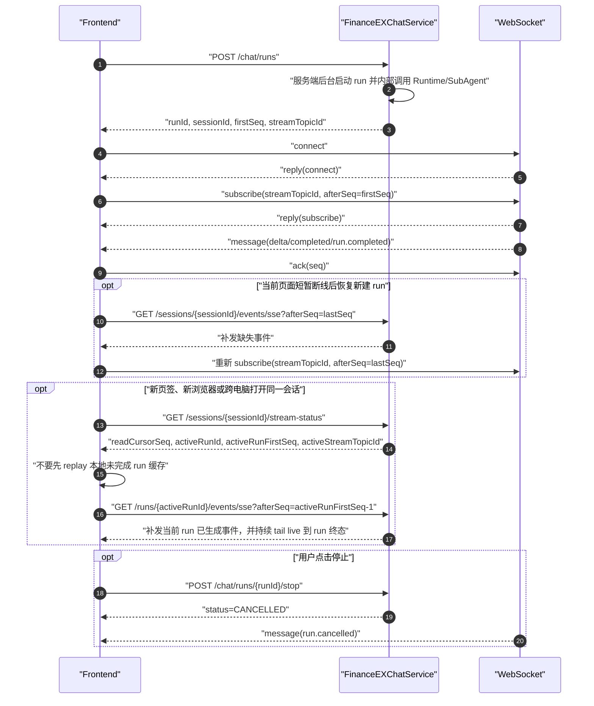

# FinanceEXChatService 前端联调文档

本文档面向 Web 前端联调，覆盖会话、文档上传、创建 run、WebSocket 实时订阅、SSE 断点补发、停止回答和常见排障。当前正式版采用 ChatGPT-like 单一对话流协议：HTTP 负责创建/控制后台 run；WebSocket 负责当前页面新建 run 的实时订阅；SSE 负责恢复链路，其中会话级 SSE 是有限补发，run 级 SSE 在 active run 场景会先补发再接续 live 事件直到 run 终态。

## 基础约定

- HTTP base URL：`http://localhost:8080`
- WebSocket URL：`ws://localhost:8080/api/v1/ex/chat/ws`
- 如果后端配置了上下文根，例如 Servlet/MVC 模式下 `server.servlet.context-path=/fin/ex`
  或 WebFlux 模式下 `spring.webflux.base-path=/fin/ex`，则 WebSocket URL 也必须带上同一前缀：
  `ws://localhost:8080/fin/ex/api/v1/ex/chat/ws`。
- 所有时间字段均为 ISO-8601 字符串。
- `seq` / `sequence` 是 openGauss 生成的事件恢复游标，前端断点恢复只保存最后收到的最大 `sequence`。
- 前端只把 `sequence` 当作不透明数字游标，不要自行推算生成方式；服务端以事件表事实源保证同一会话内的恢复顺序。
- 前端不要传 `tenantId`、`userId`，也不要通过 Header/Query/Body 伪造用户身份；身份由后端请求入口通过 `AuthContextProvider` 从服务端上下文解析一次，后台 run 不会再次读取请求 ThreadLocal。
- 本文档中的 WebSocket 只指前端到 FinanceEXChatService 的 `/api/v1/ex/chat/ws` 连接。RelayAgent 如果配置 `financeex.agent-runtime.api-adapter=relay-websocket`，那是 FinanceEXChatService 后端到 RelayAgent 的出站 adapter，前端不直接连接 RelayAgent，也不通过前端 WebSocket 发起 `AgentRuntime.query`。
- 本地开发需要后端显式配置：

```bash
export FINANCEEX_DEV_TENANT_ID=tenant_dev
export FINANCEEX_DEV_USER_ID=user_dev
export FINANCEEX_DEV_USERNAME=developer
```

## 接口总览

| 场景 | 方法 | 路径 | 说明 |
| --- | --- | --- | --- |
| 创建会话 | `POST` | `/api/v1/ex/chat/sessions` | 显式创建会话；也可以直接调用 `/chat/runs`，不传 `sessionId` 时由后端创建或归一化 |
| 会话列表 | `GET` | `/api/v1/ex/chat/sessions?limit=20&cursor=...` | 当前用户会话分页 |
| 会话详情 | `GET` | `/api/v1/ex/chat/sessions/{sessionId}` | 查询单个会话元数据 |
| 会话状态 | `GET` | `/api/v1/ex/chat/sessions/{sessionId}/state?messageLimit=50` | 切换会话时聚合会话、历史消息和流状态 |
| 历史消息 | `GET` | `/api/v1/ex/chat/sessions/{sessionId}/messages?leafMessageId=...&limit=50` | 查询当前 active path 或指定 leaf path |
| 消息版本 | `GET` | `/api/v1/ex/chat/sessions/{sessionId}/messages/{messageId}/variants` | 查询同父节点候选版本 |
| 切换路径 | `POST` | `/api/v1/ex/chat/sessions/{sessionId}/path` | 将会话当前 leaf 切换到指定消息 |
| 新建分支 | `POST` | `/api/v1/ex/chat/sessions/{sessionId}/branches` | 从某条消息创建只读历史快照分支 |
| 重命名会话 | `PATCH` | `/api/v1/ex/chat/sessions/{sessionId}` | 更新会话标题 |
| 归档/恢复会话 | `POST` | `/api/v1/ex/chat/sessions/{sessionId}/archive`、`/restore` | 会话列表管理 |
| 关闭会话 | `POST` | `/api/v1/ex/chat/sessions/{sessionId}/close` | 将会话置为关闭状态 |
| 创建 run | `POST` | `/api/v1/ex/chat/runs` | 唯一提问入口，返回 `streamTopicId` |
| WebSocket | `WS` | `/api/v1/ex/chat/ws` | 用户级长连接，按 run topic 订阅实时事件 |
| 会话 SSE 补发 | `GET` | `/api/v1/ex/chat/sessions/{sessionId}/events/sse?afterSeq={seq}` | 有限补发整个会话缺失事件 |
| Run SSE 恢复 | `GET` | `/api/v1/ex/chat/runs/{runId}/events/sse?afterSeq={seq}` | 跨页签、跨浏览器或跨电脑续接正在输出的当前回答 |
| 流状态 | `GET` | `/api/v1/ex/chat/sessions/{sessionId}/stream-status` | 查询最新 `seq`、read cursor、active run 和是否可取消 |
| 停止回答 | `POST` | `/api/v1/ex/chat/runs/{runId}/stop` | 幂等停止当前 run |
| 消息反馈 | `POST` | `/api/v1/ex/chat/messages/{messageId}/feedback` | 对 assistant 消息点赞/点踩 |
| 上传文档 | `POST` | `/api/v1/ex/documents` | multipart 上传本地文件 |
| 文档列表 | `GET` | `/api/v1/ex/documents?sessionId=...&limit=20&cursor=...` | 当前用户文档库；`sessionId` 可选，用于筛选会话关联文档 |
| 文档详情 | `GET` | `/api/v1/ex/documents/{documentId}` | 查询单个文档 |
| 文档更新 | `PATCH` | `/api/v1/ex/documents/{documentId}` | 更新展示名或元数据 |
| 文档状态 | `GET` | `/api/v1/ex/documents/{documentId}/status` | 查询处理状态 |
| 文档预览/下载 | `GET` | `/api/v1/ex/documents/{documentId}/preview-url`、`/download` | 后端受控流式访问 |
| 文档删除 | `DELETE` | `/api/v1/ex/documents/{documentId}` | 软删除文档 |

旧版 `POST /chat/sse`、`POST /chat/stream`、NDJSON resume、WebSocket 直接发聊天请求均已删除，前端不要继续调用。

仓库中提供了一个独立本地联调台：`local-test-frontend/`。它通过本地 Node 代理访问 `/api/v1/ex/**`，可用于验证会话、消息树、文档库、run、WebSocket topic、SSE resume、stop 和跨页签续接，不会影响后端代码。

本地联调台支持类似 Postman 的自定义请求头配置。由于浏览器不能直接设置 `Cookie` 请求头，也不能给原生 `WebSocket` 自定义握手 header，联调台采用本地代理 profile：页面左侧“鉴权请求头”保存 `Cookie/Authorization/X-*` 后，浏览器只携带非敏感 profileId，`server.mjs` 代理在转发 HTTP、fetch SSE、文件下载和 WebSocket 握手时统一注入真实请求头。该能力只用于本地调试企业鉴权框架，不属于生产前端协议。

## 接口使用速查

本节把每个对外接口的使用场景、入参和出参集中说明。后续章节给出更完整的 curl 和前端代码示例。

### 会话接口

| 接口 | 使用场景 | 入参 | 出参 | 注意事项 |
| --- | --- | --- | --- | --- |
| `POST /api/v1/ex/chat/sessions` | 用户点击“新建会话”时显式创建。 | JSON body：`title` 可选，`channel` 可选，默认可为空。 | `ChatSessionDto`：`sessionId`、`title`、`status`、`channel`、`createdAt`、`updatedAt`。 | 前端不传租户和用户；后端从身份上下文解析。 |
| `GET /api/v1/ex/chat/sessions` | 左侧会话列表分页加载。 | Query：`limit` 可选，默认 20；`cursor` 可选。 | `ChatSessionPageDto`：`items[]`、`nextCursor`。 | 返回按最近更新时间倒序排列；`nextCursor=null` 表示无下一页。 |
| `GET /api/v1/ex/chat/sessions/{sessionId}` | 只需要会话元数据时使用。 | Path：`sessionId`。 | `ChatSessionDto`。 | 会校验当前用户是否拥有该会话。 |
| `GET /api/v1/ex/chat/sessions/{sessionId}/state` | 切换会话或跨电脑打开会话时首选。 | Path：`sessionId`；Query：`messageLimit` 可选，默认 50。 | `ChatSessionStateDto`：`session`、`messages`、`streamStatus`。 | `messages` 返回当前 active path；该接口不会返回正在输出的半截 assistant 历史消息。 |
| `GET /api/v1/ex/chat/sessions/{sessionId}/messages` | 历史消息路径回看。 | Path：`sessionId`；Query：`leafMessageId` 可选，`limit` 默认 50，`cursor` 保留。 | `ChatMessagePageDto`：`items[]`、`nextCursor`。 | 不传 `leafMessageId` 时返回当前 active path；传入时返回 root 到该 leaf 的路径。 |
| `GET /api/v1/ex/chat/sessions/{sessionId}/messages/{messageId}/variants` | 切换编辑/重新生成后的候选版本。 | Path：`sessionId`、`messageId`。 | `ChatMessageDto[]`。 | 返回同父节点、同角色的 sibling 版本。 |
| `POST /api/v1/ex/chat/sessions/{sessionId}/path` | 用户选择某个历史版本作为当前路径。 | Path：`sessionId`；JSON body：`leafMessageId`。 | `ChatSessionDto`。 | 只切换 `currentLeafMessageId`，不创建 run。 |
| `POST /api/v1/ex/chat/sessions/{sessionId}/branches` | 从某条消息新建只读历史快照分支。 | Path：来源 `sessionId`；JSON body：`sourceMessageId` 必填，`title` 可选。 | 新分支 `ChatSessionDto`。 | 复制 root 到来源消息路径；快照消息 locked，不可编辑/重新生成。 |
| `PATCH /api/v1/ex/chat/sessions/{sessionId}` | 用户重命名会话。 | Path：`sessionId`；JSON body：`title`。 | `ChatSessionDto`。 | `title` 为空时保留原值。 |
| `POST /api/v1/ex/chat/sessions/{sessionId}/archive` | 用户归档会话。 | Path：`sessionId`。 | `ChatSessionDto`。 | 归档通常用于列表隐藏，不删除历史。 |
| `POST /api/v1/ex/chat/sessions/{sessionId}/restore` | 用户恢复归档会话。 | Path：`sessionId`。 | `ChatSessionDto`。 | 恢复后可重新出现在普通会话列表。 |
| `POST /api/v1/ex/chat/sessions/{sessionId}/close` | 用户关闭会话或业务侧终止会话。 | Path：`sessionId`。 | `ChatSessionDto`。 | 关闭是会话状态变更，不等于停止当前 run；停止回答请调用 stop。 |

### Run 与流式接口

| 接口 | 使用场景 | 入参 | 出参 | 注意事项 |
| --- | --- | --- | --- | --- |
| `POST /api/v1/ex/chat/runs` | 唯一提问入口，创建后台 run。 | JSON body：`commandId` 可选，`sessionId` 可选，`conversationId` 可选，`message`、`runMode`、`parentMessageId`、`editedMessageId`、`regeneratedMessageId`、`attachments[]`、`metadata`。 | `ChatRunStartDto`：`runId`、`sessionId`、`firstSeq`、`createdAt`、`streamTopicId`。 | `runMode` 默认 `NEXT`；编辑和重新生成不会覆盖历史消息。 |
| `POST /api/v1/ex/chat/runs/{runId}/stop` | 用户点击停止回答。 | Path：`runId`。 | `ChatRunStopDto`：`runId`、`sessionId`、`status`、`latestSeq`、`stoppedAt`。 | 幂等；停止语义不是关闭 WebSocket。 |
| `GET /api/v1/ex/chat/sessions/{sessionId}/events/sse` | 断线、刷新、复制页签后补齐整个会话缺失 event。 | Path：`sessionId`；Query：`afterSeq` 默认 0。 | `text/event-stream`，data 为 `ChatEventDto`。 | 使用本地已处理最大 `sequence` 作为 `afterSeq`。 |
| `GET /api/v1/ex/chat/runs/{runId}/events/sse` | 跨页签、跨浏览器或跨电脑续接当前正在输出的 active run。 | Path：`runId`；Query：`afterSeq` 默认 0。 | `text/event-stream`，data 为 `ChatEventDto`。 | 页面初始化恢复 active run 时，统一使用 `activeRunFirstSeq - 1` 作为 `afterSeq`；该连接会先补发历史事件，再持续输出 live 事件直到 run 终态。 |
| `GET /api/v1/ex/chat/sessions/{sessionId}/stream-status` | 判断是否存在 active run、是否可停止、从哪里恢复。 | Path：`sessionId`。 | `ChatStreamStatusDto`：`latestSeq`、`readCursorSeq`、`activeRunId`、`activeStreamTopicId`、`activeRunFirstSeq`、`activeRunLastSeq`、`cancellable`。 | `latestSeq` 是服务端事实源最新位置，不是客户端已消费位置。 |
| `POST /api/v1/ex/chat/messages/{messageId}/feedback` | 用户对完整 assistant 消息点赞、点踩或提交原因。 | Path：`messageId`；JSON body：`runId` 可选，`rating`，`reasonCode` 可选，`commentText` 可选，`metadata` 可选。 | `MessageFeedbackDto`：`feedbackId`、`messageId`、`runId`、`rating`、`createdAt`。 | 如果传 `runId`，服务端会校验 message、session、run 归属一致。 |

同一会话同一时间只允许一个 active run。若发送时已有 `RUNNING/CANCELLING` run，
`POST /chat/runs` 会返回 HTTP 409，错误码 `ACTIVE_RUN_EXISTS`。前端应保持“生成中/停止”
按钮状态，先调用 stop 或等待终态后再允许同一会话再次发送。

### WebSocket 控制消息

| 消息 | 使用场景 | 入参 | 出参 | 注意事项 |
| --- | --- | --- | --- | --- |
| `connect` | WebSocket 打开后声明连接状态。 | `id`、`type=connect`、`presence=foreground/background`。 | `reply(connect)`，含 `connectionId`。 | 用户身份来自握手入口的后端上下文，不通过消息体传入。 |
| `subscribe` | 订阅某个 run 的实时输出。 | `id`、`type=subscribe`、`topicId`、`afterSeq`。 | `reply(subscribe)`，随后收到 `message` envelope。 | `topicId` 必须来自 `/chat/runs` 或 `stream-status.activeStreamTopicId`。 |
| `ack` | 告诉服务端当前连接已消费到哪个 event。 | `id`、`type=ack`、`topicId`、`seq`。 | `reply(ack)` 或错误。 | ack 会刷新 read cursor，用于展示消费进度、诊断和非 active 场景减少重复；新渲染实例恢复 active run 时不要用它跳过 run SSE catchup。 |
| `unsubscribe` | 不再关注某个 run topic。 | `id`、`type=unsubscribe`、`topicId`。 | `reply(unsubscribe)`。 | 切换会话不一定要断开 WebSocket，可以只取消旧 topic。 |
| `presence` | 页面前后台切换。 | `id`、`type=presence`、`state=foreground/background`。 | `reply(presence)`。 | 只作为在线状态和资源治理信号，不影响 run 生命周期。 |

### 文档接口

| 接口 | 使用场景 | 入参 | 出参 | 注意事项 |
| --- | --- | --- | --- | --- |
| `POST /api/v1/ex/documents` | 上传本地文件到文档库。 | multipart：`file` 必填，`sessionId` 可选。 | `UploadedDocument`。 | 文件先到统一后端，再通过 ObjectStorage 写入 Huawei OBS S3 或其他对象存储实现；Servlet/MVC 与 WebFlux 启动模式共用同一外部契约。 |
| `GET /api/v1/ex/documents` | 文档库列表或最近文档选择器。 | Query：`sessionId` 可选，`limit` 默认 20，`cursor` 可选。 | `DocumentLibraryPage`：`items[]`、`nextCursor`。 | 默认不返回 `DELETED` 文档。 |
| `GET /api/v1/ex/documents/{documentId}` | 查询文档详情。 | Path：`documentId`。 | `UploadedDocument`。 | 可查看 `AVAILABLE/PROCESSING/FAILED` 等非删除状态。 |
| `PATCH /api/v1/ex/documents/{documentId}` | 修改展示文件名或扩展元数据。 | Path：`documentId`；JSON body：`originalName`、`metadataJson`。 | `UploadedDocument`。 | 空字段表示保留原值。 |
| `DELETE /api/v1/ex/documents/{documentId}` | 软删除文档。 | Path：`documentId`。 | `UploadedDocument`。 | 删除后不能再作为聊天附件。 |
| `GET /api/v1/ex/documents/{documentId}/status` | 查询解析状态或失败原因扩展信息。 | Path：`documentId`。 | `DocumentStatusDto`：`documentId`、`status`、`tokenSize`。 | `PROCESSING/FAILED` 可查状态，但不能下载、预览或作为聊天附件。 |
| `GET /api/v1/ex/documents/{documentId}/preview-url` | 获取后端受控预览地址。 | Path：`documentId`。 | `DocumentAccessDto`。 | 当前返回后端 download 地址，不暴露对象存储签名。 |
| `GET /api/v1/ex/documents/{documentId}/download` | 下载文档原始内容。 | Path：`documentId`。 | 二进制流，带 `Content-Disposition`。 | 只允许 `AVAILABLE` 文档下载。 |

## 协议边界

前端只需要理解 FinanceEXChatService 对外协议：

```text
POST /api/v1/ex/chat/runs
 -> 创建后台 run，拿到 runId/sessionId/firstSeq/streamTopicId
WS /api/v1/ex/chat/ws
 -> connect / subscribe(streamTopicId, afterSeq) / ack
GET /api/v1/ex/chat/runs/{activeRunId}/events/sse?afterSeq=resumeSeq
 -> active run 恢复时补发当前 run 已生成事件，并接续 live 事件直到终态
POST /api/v1/ex/chat/runs/{runId}/stop
 -> 停止本轮回答
```

`streamTopicId` 是 ChatService 的 run 级订阅 topic，不是 RelayAgent 的会话 ID。当前后端内部的 `AgentRuntime.query` 通过 `financeex.agent-runtime.api-adapter` 选择 `relay-stream-http`、`deepseek-chat-completions` 或 `relay-websocket`；这个选择不改变前端协议。

## 推荐前端流程



注意：上图里的 WebSocket 只负责订阅 `streamTopicId` 对应的 ChatEvent。后台 run 的执行由 `POST /chat/runs` 在服务端启动，WebSocket `subscribe` 不会触发 Runtime 或 SubAgent query。

## 会话接口

创建会话：

```bash
curl -X POST http://localhost:8080/api/v1/ex/chat/sessions \
  -H 'Content-Type: application/json' \
  -d '{"title":"财经问答","channel":"web"}'
```

响应示例：

```json
{
  "sessionId": "session_xxx",
  "tenantId": "tenant_dev",
  "userId": "user_dev",
  "title": "财经问答",
  "status": "ACTIVE",
  "channel": "web",
  "createdAt": "2026-05-17T01:00:00Z",
  "updatedAt": "2026-05-17T01:00:00Z"
}
```

前端展示可以使用 `sessionId` 作为会话路由参数。租户和用户字段只用于调试展示，不应回传给聊天接口。

查询会话列表：

```bash
curl "http://localhost:8080/api/v1/ex/chat/sessions?limit=20"
```

响应按更新时间倒序返回：

```json
{
  "items": [
    {
      "sessionId": "session_xxx",
      "tenantId": "tenant_dev",
      "userId": "user_dev",
      "title": "财经问答",
      "status": "ACTIVE",
      "channel": "web",
      "createdAt": "2026-05-17T01:00:00Z",
      "updatedAt": "2026-05-17T01:10:00Z"
    }
  ],
  "nextCursor": null
}
```

选择会话后推荐先查询聚合状态：

```bash
curl "http://localhost:8080/api/v1/ex/chat/sessions/session_xxx/state?messageLimit=50"
```

响应包含会话元数据、最近一页历史消息和流状态：

```json
{
  "session": {
    "sessionId": "session_xxx",
    "tenantId": "tenant_dev",
    "userId": "user_dev",
    "title": "财经问答",
    "status": "ACTIVE",
    "channel": "web",
    "currentLeafMessageId": "msg_002",
    "rootSessionId": "session_xxx",
    "branchSourceSessionId": null,
    "branchSourceMessageId": null,
    "createdAt": "2026-05-17T01:00:00Z",
    "updatedAt": "2026-05-17T01:10:00Z"
  },
  "messages": {
    "items": [
      {
        "messageId": "msg_001",
        "sessionId": "session_xxx",
        "parentMessageId": null,
        "nodeOrder": 1,
        "treeDepth": 0,
        "siblingIndex": 1,
        "role": "user",
        "content": "帮我分析一下这个费用趋势",
        "tokenCount": null,
        "runId": "run_xxx",
        "originType": "NORMAL",
        "locked": false,
        "sourceSessionId": null,
        "sourceMessageId": null,
        "editedFromMessageId": null,
        "regeneratedFromMessageId": null,
        "createdAt": "2026-05-17T01:01:00Z"
      }
    ],
    "nextCursor": null
  },
  "streamStatus": {
    "sessionId": "session_xxx",
    "latestSeq": 12005,
    "readCursorSeq": 12002,
    "activeRunId": "run_xxx",
    "activeRunStatus": "RUNNING",
    "activeStreamTopicId": "chat-run-run_xxx",
    "activeRunFirstSeq": 12001,
    "activeRunLastSeq": 12005,
    "cancellable": true
  }
}
```

单独分页查询历史消息：

```bash
curl "http://localhost:8080/api/v1/ex/chat/sessions/session_xxx/messages?limit=50"

# 查询某个历史版本 leaf 的路径
curl "http://localhost:8080/api/v1/ex/chat/sessions/session_xxx/messages?leafMessageId=msg_older_leaf&limit=50"
```

响应按创建时间正序返回，适合直接渲染历史消息气泡：

```json
{
  "items": [
    {
      "messageId": "msg_001",
      "sessionId": "session_xxx",
      "parentMessageId": null,
      "nodeOrder": 1,
      "treeDepth": 0,
      "siblingIndex": 1,
      "role": "user",
      "content": "帮我分析一下这个费用趋势",
      "tokenCount": null,
      "runId": "run_xxx",
      "originType": "NORMAL",
      "locked": false,
      "sourceSessionId": null,
      "sourceMessageId": null,
      "editedFromMessageId": null,
      "regeneratedFromMessageId": null,
      "createdAt": "2026-05-17T01:01:00Z"
    },
    {
      "messageId": "msg_002",
      "sessionId": "session_xxx",
      "parentMessageId": "msg_001",
      "nodeOrder": 2,
      "treeDepth": 1,
      "siblingIndex": 1,
      "role": "assistant",
      "content": "从趋势看，差旅费在三月出现明显上升...",
      "tokenCount": null,
      "runId": "run_xxx",
      "originType": "NORMAL",
      "locked": false,
      "sourceSessionId": null,
      "sourceMessageId": null,
      "editedFromMessageId": null,
      "regeneratedFromMessageId": null,
      "createdAt": "2026-05-17T01:01:10Z"
    }
  ],
  "nextCursor": null
}
```

会话管理：

```bash
curl -X PATCH http://localhost:8080/api/v1/ex/chat/sessions/session_xxx \
  -H 'Content-Type: application/json' \
  -d '{"title":"新的会话标题"}'

curl -X POST http://localhost:8080/api/v1/ex/chat/sessions/session_xxx/archive
curl -X POST http://localhost:8080/api/v1/ex/chat/sessions/session_xxx/restore
curl -X POST http://localhost:8080/api/v1/ex/chat/sessions/session_xxx/close
```

历史消息接口返回的是已经完整落库的 user/assistant 消息。若所选会话仍有 active run 正在输出，前端应继续调用 `stream-status` 和 run SSE 恢复缺失事件，把正在输出的增量接到当前 assistant 草稿上。

## 消息版本与分支

### 查询候选版本

当用户编辑历史问题或重新生成回答后，同一个父节点下会出现多个 sibling。前端推荐像 ChatGPT 一样在消息下方展示
`< 1/3 >` 形式的顺序版本游标，而不是把所有候选展开成列表。版本数量和当前位置来自 variants 接口：

```bash
curl "http://localhost:8080/api/v1/ex/chat/sessions/session_xxx/messages/msg_002/variants"
```

响应是 `ChatMessageDto[]`，其中 `siblingIndex` 表示候选序号，`editedFromMessageId` 和 `regeneratedFromMessageId` 用于说明版本来源。

### 切换当前路径

用户在历史版本之间切换时，只需要更新会话当前 leaf：

```bash
curl -X POST http://localhost:8080/api/v1/ex/chat/sessions/session_xxx/path \
  -H 'Content-Type: application/json' \
  -d '{"leafMessageId":"msg_variant_leaf"}'
```

切换成功后，再查询 `GET /sessions/{sessionId}/messages` 会返回 root 到新 leaf 的 active path。
如果前端在 user 消息游标上切换版本，服务端会优先把路径落到该 user 下最新的 assistant 子节点；
这样用户看到的是“问题版本 + 对应回答”，而不是只剩一个 user 气泡。

### 从某条消息新建分支

```bash
curl -X POST http://localhost:8080/api/v1/ex/chat/sessions/session_xxx/branches \
  -H 'Content-Type: application/json' \
  -d '{"sourceMessageId":"msg_002","title":"费用分析分支"}'
```

服务端会把 root 到 `sourceMessageId` 的路径复制到新会话。复制出的历史消息：

- `originType=BRANCH_SNAPSHOT`
- `locked=true`
- `sourceSessionId/sourceMessageId` 指向来源消息

这些快照消息只读，不能编辑、删除或重新生成；分支后续新增的普通消息仍然可以使用 `NEXT/EDIT_USER/REGENERATE_ASSISTANT`。

## 创建 Run

请求：

```bash
curl -X POST http://localhost:8080/api/v1/ex/chat/runs \
  -H 'Content-Type: application/json' \
  -d '{
    "commandId": "cmd_001",
    "sessionId": "session_xxx",
    "conversationId": "session_xxx",
    "message": "帮我分析一下这个费用趋势",
    "runMode": "NEXT",
    "parentMessageId": null,
    "editedMessageId": null,
    "regeneratedMessageId": null,
    "attachments": [],
    "metadata": {
      "clientMessageId": "msg_001"
    }
  }'
```

请求字段：

| 字段 | 类型 | 必填 | 说明 |
| --- | --- | --- | --- |
| `commandId` | string | 否 | 前端命令 ID，用于排障和幂等扩展 |
| `sessionId` | string | 否 | 聊天会话 ID；为空时后端会创建或归一化 |
| `conversationId` | string | 否 | 前端对话 ID，通常与 `sessionId` 一致 |
| `message` | string | NEXT/EDIT_USER 必填 | 用户本轮输入；`REGENERATE_ASSISTANT` 可为空，服务端复用原 assistant 的父 user 消息 |
| `runMode` | string | 否 | 消息树写入模式：`NEXT`、`EDIT_USER`、`REGENERATE_ASSISTANT`，默认 `NEXT` |
| `parentMessageId` | string | 否 | `NEXT` 模式显式父节点；为空时使用会话 `currentLeafMessageId` |
| `editedMessageId` | string | EDIT_USER 必填 | 被编辑的未锁定 user 消息 |
| `regeneratedMessageId` | string | REGENERATE_ASSISTANT 必填 | 被重新生成的未锁定 assistant 消息 |
| `attachments` | array | 否 | 文档附件引用列表 |
| `metadata` | object | 否 | 扩展字段，例如 `clientMessageId`、`forceNewTask` |

响应：

```json
{
  "runId": "run_xxx",
  "sessionId": "session_xxx",
  "firstSeq": 12001,
  "createdAt": "2026-05-17T01:01:00Z",
  "streamTopicId": "chat-run-run_xxx"
}
```

响应字段：

| 字段 | 说明 |
| --- | --- |
| `runId` | 本轮回答的执行 ID，stop 和排障使用 |
| `sessionId` | 本轮所属会话 |
| `firstSeq` | `run.started` 事件序号，订阅时可作为 `afterSeq` |
| `createdAt` | run started 时间 |
| `streamTopicId` | WebSocket 订阅 topic，只能由当前用户订阅 |

前端不需要后端返回 WebSocket/SSE/stop URL，这些 URL 应由前端环境配置或网关配置管理。

编辑历史问题示例：

```json
{
  "sessionId": "session_xxx",
  "message": "把刚才的问题改成只分析差旅费",
  "runMode": "EDIT_USER",
  "editedMessageId": "msg_user_old",
  "attachments": []
}
```

重新生成回答示例：

```json
{
  "sessionId": "session_xxx",
  "runMode": "REGENERATE_ASSISTANT",
  "regeneratedMessageId": "msg_assistant_old",
  "attachments": []
}
```

## 反馈

重新生成回答统一使用 `POST /api/v1/ex/chat/runs`，并传入 `runMode=REGENERATE_ASSISTANT` 与
`regeneratedMessageId`。这样新回答会作为原 user 消息下的 assistant sibling 保存，前端可以通过
`variants` 和 `path` 接口按版本游标切换。

对 assistant 消息提交反馈：

```bash
curl -X POST http://localhost:8080/api/v1/ex/chat/messages/msg_002/feedback \
  -H 'Content-Type: application/json' \
  -d '{
    "runId": "run_xxx",
    "rating": "DISLIKE",
    "reasonCode": "INACCURATE",
    "commentText": "金额汇总不准确",
    "metadata": {
      "clientTraceId": "trace_001"
    }
  }'
```

响应：

```json
{
  "feedbackId": "feedback_xxx",
  "messageId": "msg_002",
  "runId": "run_xxx",
  "rating": "DISLIKE",
  "createdAt": "2026-05-17T01:05:00Z"
}
```

## WebSocket 协议

WebSocket 是用户级长连接，切换会话时不需要重建连接，也不要求释放其他会话的 run topic。
同一连接可以同时订阅多个 session 的多个 run topic，服务端会在订阅前校验 topic 归属，
并在输出前校验 `topicId/runId/sessionId` 一致。前端收到 `message` envelope 后必须按
`payload.sessionId` 分发到对应会话面板；单会话页面如果不想继续接收后台会话输出，可以主动
`unsubscribe(topicId)`。

服务端不会信任 Redis Pub/Sub 或本机 live source 的 payload。所有 WebSocket/SSE 输出都来自
已经落库的 ChatEvent，补发查询使用 `tenantId/userId/sessionId/runId` 联合条件；如果实时通道
收到 topic 与 `runId/sessionId` 不一致的事件，会直接丢弃并记录日志。

后端同时支持 WebFlux 和 Servlet/MVC 两种 WebSocket 服务端入口。企业框架引入
`spring-boot-starter-web` 后，应用通常会以 MVC/Servlet 模式启动，此时 WebSocket 仍然使用
同一条 `/api/v1/ex/chat/ws` 协议路径，只是上下文根应来自 `server.servlet.context-path`。
MVC/Servlet 模式下，后端会在 WebSocket handshake 阶段读取企业权限上下文并固化用户身份；
连接建立后的 subscribe、ack、unsubscribe 不再读取 ThreadLocal。因此前端只需要确保握手请求
携带企业鉴权 cookie/header，协议消息体中不要传 tenantId/userId。

生产环境必须配置 `financeex.websocket.allowed-origin-patterns` 为企业前端域名。默认值只允许
localhost，避免 Cookie 鉴权场景下的跨站 WebSocket 滥用。服务端还会限制单用户连接数、单连接
订阅数、单 topic 本机订阅数、控制消息大小、出站队列和空闲时间；超限时会返回明确错误并关闭
连接或取消订阅。

### 连接

```js
const ws = new WebSocket("ws://localhost:8080/api/v1/ex/chat/ws");

ws.onopen = () => {
  ws.send(JSON.stringify({
    id: "1",
    type: "connect",
    presence: "foreground"
  }));
};
```

服务端回复：

```json
{
  "id": "1",
  "type": "reply",
  "reply": {
    "type": "connect",
    "connectionId": "xxx",
    "presence": "foreground"
  }
}
```

### 订阅 run topic

```js
ws.send(JSON.stringify({
  id: "2",
  type: "subscribe",
  topicId: runStart.streamTopicId,
  afterSeq: runStart.firstSeq
}));
```

`afterSeq` 表示“客户端已经处理到的最大事件序号”。`POST /chat/runs` 已经把 `run.started` 的 `firstSeq` 返回给前端，因此首订阅通常可以使用 `afterSeq=firstSeq`；刷新或复制页签时应使用本地保存的 `lastSeq`。服务端会先按 `runId + afterSeq` 补发历史事件，再接入实时事件。订阅成功回复：

```json
{
  "id": "2",
  "type": "reply",
  "reply": {
    "type": "subscribe",
    "topicId": "chat-run-run_xxx",
    "recovered": true,
    "lastSeq": 12001
  }
}
```

实时消息 envelope：

```json
{
  "type": "message",
  "topicId": "chat-run-run_xxx",
  "offset": "12002",
  "payload": {
    "runId": "run_xxx",
    "sessionId": "session_xxx",
    "sequence": 12002,
    "type": "message.delta",
    "payload": {
      "delta": "这里是增量文本"
    }
  }
}
```

事件类型：

| 事件类型 | 说明 | 前端处理 |
| --- | --- | --- |
| `run.started` | run 已创建 | 可记录 run 状态为 running |
| `message.delta` | assistant 文本增量 | 追加 `payload.delta` 到当前 assistant 消息 |
| `message.completed` | assistant 消息结束 | 可停止当前消息输入光标 |
| `run.completed` | 本轮 run 正常结束 | 关闭 loading，保存 latestSeq |
| `run.failed` | 本轮 run 失败 | 展示错误信息，关闭 loading |
| `run.cancelled` | 用户停止本轮回答 | 展示已停止，关闭 loading |

### ACK

前端每处理完一个事件，可以回传最新 `sequence`。后端会把 ack 写入服务端 read cursor：

- Redis 热缓存 key：`fin_ex:chat_read_cursor:{tenantId}:{userId}:{sessionId}`。
- openGauss 表：`fin_ex_chat_read_cursor_t`。
- Redis 每次 ack 都刷新，openGauss 按配置节流写入；连接关闭时会 best-effort flush。

这个游标只能说明“该用户某个连接确认消费到哪里”，不能说明“当前新页签、新浏览器或新电脑已经渲染到哪里”。恢复 active run 时应从 `activeRunFirstSeq - 1` 打开 run SSE；该 SSE 会补发历史并继续 tail live 事件直到 run 终态。cursor 可用于展示、诊断或非 active 场景减少重复。它不替代 `fin_ex_chat_event_t`，事件事实源仍然是 ChatEvent 表。

```js
ws.send(JSON.stringify({
  id: "3",
  type: "ack",
  topicId: "chat-run-run_xxx",
  seq: 12002
}));
```

### 取消订阅和前后台状态

```js
ws.send(JSON.stringify({
  id: "4",
  type: "unsubscribe",
  topicId: "chat-run-run_xxx"
}));

ws.send(JSON.stringify({
  id: "5",
  type: "presence",
  state: "background"
}));
```

WebSocket 不接受 `{"type":"chat"}` 或旧 `CreateChatRunRequest`。发送旧聊天请求会得到 `BAD_WS_MESSAGE`。

如果服务端检测到当前连接收到乱序实时事件，会返回恢复提示而不是静默丢弃：

```json
{
  "type": "error",
  "topicId": "chat-run-run_xxx",
  "offset": "12019",
  "code": "RECOVER_REQUIRED",
  "message": "实时事件需要恢复，请使用 SSE resume 从 afterSeq=12002 补齐"
}
```

收到 `RECOVER_REQUIRED` 后，前端应暂停该 topic 的实时拼接，使用本地最近 ACK 或最近成功处理的 `lastSeq`
调用 SSE resume 补发，然后再按新的 `lastSeq` 重新 subscribe。

`RECOVER_REQUIRED` 也可能由慢客户端或 run topic live buffer 溢出触发。此时不要继续等待同一个
WebSocket 订阅恢复，正确做法仍是关闭当前 topic 拼接、通过 run SSE 补齐、再重新 subscribe。

## SSE 断点恢复

SSE 不作为本页新建 run 的首选实时通道；新建 run 的实时输出仍由 WebSocket topic 承载。SSE 有两种恢复粒度：

- 会话级：`GET /api/v1/ex/chat/sessions/{sessionId}/events/sse?afterSeq={seq}`，适合补齐整个会话缺失事件。
- Run 级：`GET /api/v1/ex/chat/runs/{runId}/events/sse?afterSeq={seq}`，适合跨页签、跨浏览器或跨电脑续接正在输出的当前回答；如果 run 尚未终止，服务端会在补发后继续 tail live 事件直到 run 终态。

```js
async function resumeEvents(sessionId, lastSeq) {
  const response = await fetch(`/api/v1/ex/chat/sessions/${sessionId}/events/sse?afterSeq=${lastSeq}`);
  const reader = response.body.getReader();
  const decoder = new TextDecoder();
  let buffer = "";

  while (true) {
    const { value, done } = await reader.read();
    if (done) {
      break;
    }
    buffer += decoder.decode(value, { stream: true });
    const blocks = buffer.split(/\r?\n\r?\n/);
    buffer = blocks.pop() || "";
    for (const block of blocks) {
      const data = block
        .split(/\r?\n/)
        .filter(line => line.startsWith("data:"))
        .map(line => line.slice(5).trimStart())
        .join("\n");
      if (!data) {
        continue;
      }
      const dto = JSON.parse(data);
      handleChatEvent(dto);
      lastSeq = Math.max(lastSeq, dto.sequence);
    }
  }
  return lastSeq;
}
```

跨页签、跨浏览器、跨电脑恢复 active run 时推荐使用 run 级接口：

```js
async function resumeActiveRun(status) {
  const resumeSeq = Math.max(0, status.activeRunFirstSeq - 1);
  const response = await fetch(`/api/v1/ex/chat/runs/${status.activeRunId}/events/sse?afterSeq=${resumeSeq}`);
  // 解析方式与会话级 SSE 完全一致。
}
```

前端可以保留本地事件缓存做 UI 加速，但 active run 恢复时不要在 run SSE 之前 replay 未完成 run 的缓存事件，也不要让 BroadcastChannel 抢先渲染当前 run。正确顺序是：加载已完成历史消息 -> 打开 run SSE -> SSE 先 catchup 再持续 tail live 事件直到本轮 run 终态。这样新页签、新浏览器或新电脑看到的未完成回答都来自服务端事实源和服务端 live topic，而不是某个浏览器实例的内存或 localStorage。

服务端 SSE event name 等于事件 `type`，data 是 `ChatEventDto`。会话级 SSE 是有限补发；run 级 SSE 在 run 未终止时会保持连接并继续输出 live 事件直到终态。推荐使用 `fetch` 读取响应流，避免 `EventSource` 在短流结束后自动重连造成重复补发。若必须使用 `EventSource`，需要按具名 event 注册监听，并在补发完成或收到终态后主动关闭。

run 级 SSE 会在无业务事件时发送 `heartbeat` 事件或 keepalive comment，用于防止 MVC Servlet async、
网关或代理把连接误判为空闲。前端收到 heartbeat 时只更新连接活跃状态，不要把它渲染成聊天消息。

```json
{
  "runId": "run_xxx",
  "sessionId": "session_xxx",
  "sequence": 12003,
  "type": "message.delta",
  "payload": {
    "delta": "补发文本"
  }
}
```

建议前端策略：

- 每处理一个 WebSocket/SSE 事件后，把最大 `sequence` 保存到当前会话状态。
- 页面重开后先调用 `stream-status` 判断是否存在 active run，但 SSE 的 `afterSeq` 不能直接用 `stream-status.latestSeq`。
- 如果存在 `activeRunId`，优先用 run 级 SSE 从 `activeRunFirstSeq - 1` 补发当前回答，并保持该 SSE 直到 run 终态；不要再对同一个 run 发 WebSocket subscribe。
- `readCursorSeq` 表示“该用户某个连接已经确认消费到哪里”，不是当前新页签或新浏览器已经渲染到哪里；自动恢复 active run 时不要用它跳过 SSE catchup。

## 流状态

```bash
curl http://localhost:8080/api/v1/ex/chat/sessions/session_xxx/stream-status
```

响应：

```json
{
  "sessionId": "session_xxx",
  "latestSeq": 12005,
  "readCursorSeq": 12002,
  "activeRunId": "run_xxx",
  "activeRunStatus": "RUNNING",
  "activeStreamTopicId": "chat-run-run_xxx",
  "activeRunFirstSeq": 12001,
  "activeRunLastSeq": 12005,
  "cancellable": true
}
```

字段说明：

| 字段 | 说明 |
| --- | --- |
| `latestSeq` | 当前会话已落库的最大事件序号；只表示服务端事实源位置，不等于当前页签已消费游标 |
| `readCursorSeq` | 服务端记录的当前用户已消费最大事件序号，可用于展示或诊断；新渲染实例恢复 active run 时不要把它当作 SSE 起点 |
| `activeRunId` | 仍在运行或取消中的 run |
| `activeRunStatus` | `RUNNING`、`CANCELLING`、`CANCELLED`、`COMPLETED`、`FAILED` |
| `activeStreamTopicId` | active run 对应的 WebSocket topic；用于当前页面重连订阅或诊断。新渲染实例恢复 active run 时优先用 run SSE，不要直接跳到 WebSocket 订阅 |
| `activeRunFirstSeq` | active run 的首个事件序号；新页签、新浏览器或新电脑恢复 active run 时使用 `activeRunFirstSeq - 1` 补发 |
| `activeRunLastSeq` | active run 当前最后一个已持久化事件序号，用于展示当前 run 进度 |
| `cancellable` | 当前 active run 是否可停止 |

## 停止回答

```bash
curl -X POST http://localhost:8080/api/v1/ex/chat/runs/run_xxx/stop
```

响应：

```json
{
  "runId": "run_xxx",
  "sessionId": "session_xxx",
  "status": "CANCELLED",
  "latestSeq": 12006,
  "stoppedAt": "2026-05-17T01:02:00Z"
}
```

stop 是 REST 生命周期接口，不是 WebSocket command。重复 stop 是幂等的：如果 run 已经 `COMPLETED`、`FAILED` 或 `CANCELLED`，会返回当前状态，不再追加新的取消事件。

前端点击停止后，不应把关闭 WebSocket 当作取消语义。推荐流程是：保存当前本地 `lastSeq`，调用 stop，随后继续通过 WebSocket 等待 `run.cancelled`；如果页面已经断线或没有收到终态事件，则用 stop 前保存的 `lastSeq` 调 SSE resume 补齐 `run.cancelled`。stop 响应里的 `latestSeq` 是服务端事实源位置，不代表当前页签已经消费到该事件。

## Run 故障恢复事件

如果执行 run 的服务实例宕机或长时间没有心跳，后台 watchdog 会把该 run 收敛到终态，避免会话永久显示“生成中”。前端无需调用额外接口，只需要像处理普通流式事件一样处理 `run.failed`：

```json
{
  "type": "run.failed",
  "runId": "run_xxx",
  "sessionId": "session_xxx",
  "sequence": 12008,
  "payload": {
    "code": "RUN_EXECUTOR_LOST",
    "message": "本轮回答执行实例失联，请选择重新生成或作为新问题重试。",
    "recoveryActionRequired": true,
    "recoveryOptions": ["REGENERATE_ASSISTANT", "RETRY_AS_NEW_RUN"]
  }
}
```

`RUN_EXECUTOR_LOST` 表示服务端已经确认当前 run 的执行租约过期，并通过 openGauss 条件抢占完成状态收敛。前端收到该事件后应停止当前 loading 状态，保留已输出草稿作为只读失败草稿，不要保存为正式 assistant 历史消息；用户可以选择用 `runMode=REGENERATE_ASSISTANT` 重新生成，或发起新的 `NEXT` run。

`RUN_EXECUTION_INIT_FAILED` 表示业务 run 已创建，但服务端运行控制面初始化失败，后端已经主动把本轮 run 闭合为 `run.failed` 并释放 active run。前端处理方式与普通 `run.failed` 一致：停止 loading、展示错误、允许用户重新发送或重新生成，不要把半截输出保存为正式 assistant 历史消息。

如果未来 Runtime 支持可靠接管，服务端可能先输出 `run.recovered`，随后继续输出同一个 run 的 `message.delta`。当前正式默认策略链是 `MANUAL_CONFIRMATION,FAIL_FAST`，因此通常表现为 `run.failed`。

## 文档上传与聊天附件

上传本地文件：

```bash
curl -X POST http://localhost:8080/api/v1/ex/documents \
  -F "file=@./demo.xlsx" \
  -F "sessionId=session_xxx"
```

如果后端配置了上下文根，例如 `server.servlet.context-path=/fin/ex`，则上传地址同步变为
`http://localhost:8080/fin/ex/api/v1/ex/documents`。前端始终使用标准 multipart 字段：
`file` 放文件内容，`sessionId` 可选；后端在 Servlet/MVC 下绑定为 `MultipartFile`，在纯
WebFlux 下绑定为 `FilePart`，前端不需要区分。

响应中的 `id` 就是聊天附件的 `documentId`：

```json
{
  "id": "doc_xxx",
  "sessionId": "session_xxx",
  "originalName": "demo.xlsx",
  "contentType": "application/vnd.openxmlformats-officedocument.spreadsheetml.sheet",
  "sizeBytes": 10240,
  "status": "AVAILABLE",
  "source": "LOCAL_UPLOAD",
  "tokenSize": null,
  "createdAt": "2026-05-17T01:03:00Z",
  "updatedAt": "2026-05-17T01:03:00Z"
}
```

查询文档库和文档状态：

```bash
curl "http://localhost:8080/api/v1/ex/documents?limit=20&cursor=..."
curl http://localhost:8080/api/v1/ex/documents/doc_xxx/status
```

更新展示名称或软删除：

```bash
curl -X PATCH http://localhost:8080/api/v1/ex/documents/doc_xxx \
  -H 'Content-Type: application/json' \
  -d '{"originalName":"费用明细.xlsx"}'

curl -X DELETE http://localhost:8080/api/v1/ex/documents/doc_xxx
```

预览和下载仍走后端受控流，不直接暴露对象存储临时签名：

```bash
curl http://localhost:8080/api/v1/ex/documents/doc_xxx/preview-url
curl -OJ http://localhost:8080/api/v1/ex/documents/doc_xxx/download
```

`preview-url` 响应：

```json
{
  "documentId": "doc_xxx",
  "accessUrl": "/api/v1/ex/documents/doc_xxx/download",
  "accessType": "BACKEND_STREAM",
  "expiresAt": null
}
```

带附件提问：

```json
{
  "commandId": "cmd_file_001",
  "sessionId": "session_xxx",
  "message": "分析一下这个文件里的费用异常",
  "attachments": [
    {
      "documentId": "doc_xxx"
    }
  ],
  "metadata": {
    "clientMessageId": "msg_file_001"
  }
}
```

后端会按当前用户回查文档库，补齐可信的文件名、MIME、大小、来源和 tokenSize。前端传入的附件展示字段不会被当作事实源。

## 前端联调最小示例

```js
let lastSeq = 0;
let currentRunId = null;
let currentTopicId = null;

const ws = new WebSocket("ws://localhost:8080/api/v1/ex/chat/ws");

ws.onopen = () => {
  ws.send(JSON.stringify({ id: "connect-1", type: "connect", presence: "foreground" }));
};

ws.onmessage = event => {
  const envelope = JSON.parse(event.data);
  if (envelope.type === "error") {
    console.error("ws error", envelope.code, envelope.message);
    return;
  }
  if (envelope.type !== "message") {
    return;
  }

  const chatEvent = envelope.payload;
  lastSeq = Math.max(lastSeq, chatEvent.sequence);

  if (chatEvent.type === "message.delta") {
    appendAssistantDelta(chatEvent.payload.delta || "");
  }
  if (["run.completed", "run.failed", "run.cancelled"].includes(chatEvent.type)) {
    setLoading(false);
  }

  ws.send(JSON.stringify({
    id: `ack-${chatEvent.sequence}`,
    type: "ack",
    topicId: envelope.topicId,
    seq: chatEvent.sequence
  }));
};

async function ask(message, sessionId) {
  setLoading(true);
  const response = await fetch("/api/v1/ex/chat/runs", {
    method: "POST",
    headers: { "Content-Type": "application/json" },
    body: JSON.stringify({
      commandId: crypto.randomUUID(),
      sessionId,
      message,
      attachments: [],
      metadata: { clientMessageId: crypto.randomUUID() }
    })
  });
  const runStart = await response.json();
  currentRunId = runStart.runId;
  currentTopicId = runStart.streamTopicId;
  lastSeq = Math.max(lastSeq, runStart.firstSeq);

  ws.send(JSON.stringify({
    id: `sub-${runStart.runId}`,
    type: "subscribe",
    topicId: runStart.streamTopicId,
    afterSeq: runStart.firstSeq
  }));
}

async function stopCurrentRun() {
  if (!currentRunId) {
    return;
  }
  await fetch(`/api/v1/ex/chat/runs/${currentRunId}/stop`, { method: "POST" });
}
```

## 排障清单

- `WS_AUTH_FAILED`：后端没有解析到有效用户身份。本地检查 `FINANCEEX_DEV_TENANT_ID`、`FINANCEEX_DEV_USER_ID`、`FINANCEEX_DEV_USERNAME`。
- `SUBSCRIBE_ERROR` 且提示 run 不存在或不属于当前用户：确认 `streamTopicId` 来自当前用户刚创建的 `/chat/runs` 响应，不要手写 topic。
- WebSocket 收不到实时事件：先调用 SSE resume 看事件是否已落库；如果 SSE 能补发，通常是 WebSocket 连接、订阅 topic 或 Redis 跨实例 fanout 问题。
- stop 后仍看到少量 delta：前端应以 `run.cancelled` 为终态，忽略同一 run 后续迟到的非终态事件；后端也会在事件追加前检查 cancel flag。
- 上传后聊天提示文档不可用：确认文档 `status=AVAILABLE`，并且上传文档和聊天请求使用同一个后端用户上下文。
- 复制页签后重复显示文本：前端需要按 `sessionId + sequence` 去重。active run 恢复会刻意从 `activeRunFirstSeq - 1` 补发，重复事件是可预期的，不能只依赖“是否大于本地 lastSeq”来判断是否渲染。
