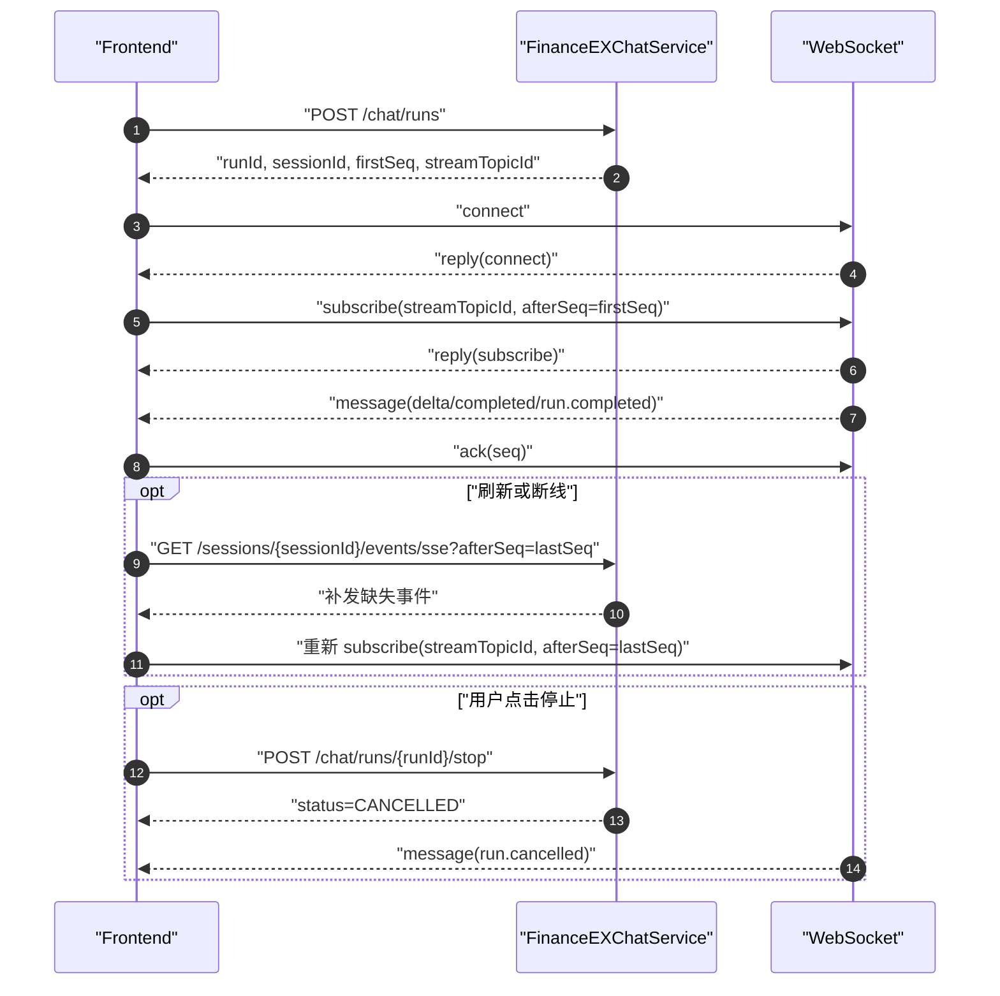

# FinanceEXChatService 前端联调文档

本文档面向 Web 前端联调，覆盖会话、文档上传、创建 run、WebSocket 实时订阅、SSE 断点补发、停止回答和常见排障。当前正式版采用 ChatGPT-like 单一对话流协议：HTTP 只负责创建/控制后台 run，WebSocket 负责实时输出，SSE 只负责断线后的缺失事件补发。

## 基础约定

- HTTP base URL：`http://localhost:8080`
- WebSocket URL：`ws://localhost:8080/api/v1/ex/chat/ws`
- 所有时间字段均为 ISO-8601 字符串。
- `seq` / `sequence` 是 openGauss 生成的事件恢复游标，前端断点恢复只保存最后收到的最大 `sequence`。
- 前端只把 `sequence` 当作不透明数字游标，不要自行推算生成方式；服务端以事件表事实源保证同一会话内的恢复顺序。
- 前端不要传 `tenantId`、`userId`，也不要通过 Header/Query/Body 伪造用户身份；身份由后端请求入口通过 `AuthContextProvider` 从服务端上下文解析一次，后台 run 不会再次读取请求 ThreadLocal。
- 本地开发需要后端显式配置：

```bash
export FINANCEEX_DEV_TENANT_ID=tenant_dev
export FINANCEEX_DEV_USER_ID=user_dev
export FINANCEEX_DEV_USERNAME=developer
```

## 接口总览

| 场景 | 方法 | 路径 | 说明 |
| --- | --- | --- | --- |
| 创建会话 | `POST` | `/api/v1/ex/chat/sessions` | 可选，未传 `sessionId` 时后端会按请求创建或归一化会话 |
| 会话列表 | `GET` | `/api/v1/ex/chat/sessions?limit=20&cursor=...` | 当前用户会话分页 |
| 会话状态 | `GET` | `/api/v1/ex/chat/sessions/{sessionId}/state?messageLimit=50` | 切换会话时聚合会话、历史消息和流状态 |
| 历史消息 | `GET` | `/api/v1/ex/chat/sessions/{sessionId}/messages?limit=50&cursor=...` | 选择会话后分页查询历史消息 |
| 重命名会话 | `PATCH` | `/api/v1/ex/chat/sessions/{sessionId}` | 更新会话标题 |
| 归档/恢复会话 | `POST` | `/api/v1/ex/chat/sessions/{sessionId}/archive`、`/restore` | 会话列表管理 |
| 创建 run | `POST` | `/api/v1/ex/chat/runs` | 唯一提问入口，返回 `streamTopicId` |
| 重新生成 | `POST` | `/api/v1/ex/chat/runs/{runId}/retry` | 基于原 run 所属会话创建新 run |
| WebSocket | `WS` | `/api/v1/ex/chat/ws` | 用户级长连接，按 run topic 订阅实时事件 |
| SSE 补发 | `GET` | `/api/v1/ex/chat/sessions/{sessionId}/events/sse?afterSeq={seq}` | 断线、刷新、复制页签后补缺失事件 |
| 流状态 | `GET` | `/api/v1/ex/chat/sessions/{sessionId}/stream-status` | 查询最新 `seq`、active run 和是否可取消 |
| 停止回答 | `POST` | `/api/v1/ex/chat/runs/{runId}/stop` | 幂等停止当前 run |
| 消息反馈 | `POST` | `/api/v1/ex/chat/messages/{messageId}/feedback` | 对 assistant 消息点赞/点踩 |
| 上传文档 | `POST` | `/api/v1/ex/documents` | multipart 上传本地文件 |
| 文档列表 | `GET` | `/api/v1/ex/documents?limit=20&cursor=...` | 当前用户文档库 |
| 文档详情 | `GET` | `/api/v1/ex/documents/{documentId}` | 查询单个文档 |
| 文档更新 | `PATCH` | `/api/v1/ex/documents/{documentId}` | 更新展示名或元数据 |
| 文档状态 | `GET` | `/api/v1/ex/documents/{documentId}/status` | 查询处理状态 |
| 文档预览/下载 | `GET` | `/api/v1/ex/documents/{documentId}/preview-url`、`/download` | 后端受控流式访问 |
| 文档删除 | `DELETE` | `/api/v1/ex/documents/{documentId}` | 软删除文档 |

旧版 `POST /chat/sse`、`POST /chat/stream`、NDJSON resume、WebSocket 直接发聊天请求均已删除，前端不要继续调用。

## 推荐前端流程



## 会话接口

创建会话：

```bash
curl -X POST http://localhost:8080/api/v1/ex/chat/sessions \
  -H 'Content-Type: application/json' \
  -d '{"title":"财经问答","channel":"web"}'
```

响应示例：

```json
{
  "sessionId": "session_xxx",
  "tenantId": "tenant_dev",
  "userId": "user_dev",
  "title": "财经问答",
  "status": "ACTIVE",
  "channel": "web",
  "createdAt": "2026-05-17T01:00:00Z",
  "updatedAt": "2026-05-17T01:00:00Z"
}
```

前端展示可以使用 `sessionId` 作为会话路由参数。租户和用户字段只用于调试展示，不应回传给聊天接口。

查询会话列表：

```bash
curl "http://localhost:8080/api/v1/ex/chat/sessions?limit=20"
```

响应按更新时间倒序返回：

```json
{
  "items": [
    {
      "sessionId": "session_xxx",
      "tenantId": "tenant_dev",
      "userId": "user_dev",
      "title": "财经问答",
      "status": "ACTIVE",
      "channel": "web",
      "createdAt": "2026-05-17T01:00:00Z",
      "updatedAt": "2026-05-17T01:10:00Z"
    }
  ],
  "nextCursor": null
}
```

选择会话后推荐先查询聚合状态：

```bash
curl "http://localhost:8080/api/v1/ex/chat/sessions/session_xxx/state?messageLimit=50"
```

响应包含会话元数据、最近一页历史消息和流状态：

```json
{
  "session": {
    "sessionId": "session_xxx",
    "tenantId": "tenant_dev",
    "userId": "user_dev",
    "title": "财经问答",
    "status": "ACTIVE",
    "channel": "web",
    "createdAt": "2026-05-17T01:00:00Z",
    "updatedAt": "2026-05-17T01:10:00Z"
  },
  "messages": {
    "items": [
      {
        "messageId": "msg_001",
        "sessionId": "session_xxx",
        "role": "user",
        "content": "帮我分析一下这个费用趋势",
        "tokenCount": null,
        "createdAt": "2026-05-17T01:01:00Z"
      }
    ],
    "nextCursor": null
  },
  "streamStatus": {
    "sessionId": "session_xxx",
    "latestSeq": 12005,
    "activeRunId": "run_xxx",
    "activeRunStatus": "RUNNING",
    "activeStreamTopicId": "chat-run-run_xxx",
    "cancellable": true
  }
}
```

单独分页查询历史消息：

```bash
curl "http://localhost:8080/api/v1/ex/chat/sessions/session_xxx/messages?limit=50&cursor=..."
```

响应按创建时间正序返回，适合直接渲染历史消息气泡：

```json
{
  "items": [
    {
      "messageId": "msg_001",
      "sessionId": "session_xxx",
      "role": "user",
      "content": "帮我分析一下这个费用趋势",
      "tokenCount": null,
      "createdAt": "2026-05-17T01:01:00Z"
    },
    {
      "messageId": "msg_002",
      "sessionId": "session_xxx",
      "role": "assistant",
      "content": "从趋势看，差旅费在三月出现明显上升...",
      "tokenCount": null,
      "createdAt": "2026-05-17T01:01:10Z"
    }
  ],
  "nextCursor": null
}
```

会话管理：

```bash
curl -X PATCH http://localhost:8080/api/v1/ex/chat/sessions/session_xxx \
  -H 'Content-Type: application/json' \
  -d '{"title":"新的会话标题"}'

curl -X POST http://localhost:8080/api/v1/ex/chat/sessions/session_xxx/archive
curl -X POST http://localhost:8080/api/v1/ex/chat/sessions/session_xxx/restore
```

历史消息接口返回的是已经完整落库的 user/assistant 消息。若所选会话仍有 active run 正在输出，前端应继续调用 `stream-status` 和 SSE/WebSocket 恢复缺失事件，把正在输出的增量接到当前 assistant 草稿上。

## 创建 Run

请求：

```bash
curl -X POST http://localhost:8080/api/v1/ex/chat/runs \
  -H 'Content-Type: application/json' \
  -d '{
    "commandId": "cmd_001",
    "sessionId": "session_xxx",
    "conversationId": "session_xxx",
    "message": "帮我分析一下这个费用趋势",
    "attachments": [],
    "metadata": {
      "clientMessageId": "msg_001"
    }
  }'
```

请求字段：

| 字段 | 类型 | 必填 | 说明 |
| --- | --- | --- | --- |
| `commandId` | string | 否 | 前端命令 ID，用于排障和幂等扩展 |
| `sessionId` | string | 否 | 聊天会话 ID；为空时后端会创建或归一化 |
| `conversationId` | string | 否 | 前端对话 ID，通常与 `sessionId` 一致 |
| `message` | string | 是 | 用户本轮输入 |
| `attachments` | array | 否 | 文档附件引用列表 |
| `metadata` | object | 否 | 扩展字段，例如 `clientMessageId`、`forceNewTask` |

响应：

```json
{
  "runId": "run_xxx",
  "sessionId": "session_xxx",
  "firstSeq": 12001,
  "createdAt": "2026-05-17T01:01:00Z",
  "streamTopicId": "chat-run-run_xxx"
}
```

响应字段：

| 字段 | 说明 |
| --- | --- |
| `runId` | 本轮回答的执行 ID，stop 和排障使用 |
| `sessionId` | 本轮所属会话 |
| `firstSeq` | `run.started` 事件序号，订阅时可作为 `afterSeq` |
| `createdAt` | run started 时间 |
| `streamTopicId` | WebSocket 订阅 topic，只能由当前用户订阅 |

前端不需要后端返回 WebSocket/SSE/stop URL，这些 URL 应由前端环境配置或网关配置管理。

## 重新生成与反馈

重新生成会基于原 run 所属会话创建一个新的 run，不覆盖旧 run 事件：

```bash
curl -X POST http://localhost:8080/api/v1/ex/chat/runs/run_xxx/retry \
  -H 'Content-Type: application/json' \
  -d '{
    "commandId": "cmd_retry_001",
    "message": null,
    "attachments": [],
    "metadata": {
      "clientMessageId": "msg_retry_001"
    }
  }'
```

`message=null` 时，后端复用该会话最近一条用户消息；传入 `message` 时表示基于同一会话发起一次修订提问。响应与创建 run 一致：

```json
{
  "runId": "run_retry_xxx",
  "sessionId": "session_xxx",
  "firstSeq": 12020,
  "createdAt": "2026-05-17T01:04:00Z",
  "streamTopicId": "chat-run-run_retry_xxx"
}
```

对 assistant 消息提交反馈：

```bash
curl -X POST http://localhost:8080/api/v1/ex/chat/messages/msg_002/feedback \
  -H 'Content-Type: application/json' \
  -d '{
    "runId": "run_xxx",
    "rating": "DISLIKE",
    "reasonCode": "INACCURATE",
    "commentText": "金额汇总不准确",
    "metadata": {
      "clientTraceId": "trace_001"
    }
  }'
```

响应：

```json
{
  "feedbackId": "feedback_xxx",
  "messageId": "msg_002",
  "runId": "run_xxx",
  "rating": "DISLIKE",
  "createdAt": "2026-05-17T01:05:00Z"
}
```

## WebSocket 协议

WebSocket 是用户级长连接，一个连接可以订阅多个 run topic。切换会话时不需要重建连接，只需要订阅新的 `streamTopicId`，必要时取消旧订阅。

### 连接

```js
const ws = new WebSocket("ws://localhost:8080/api/v1/ex/chat/ws");

ws.onopen = () => {
  ws.send(JSON.stringify({
    id: "1",
    type: "connect",
    presence: "foreground"
  }));
};
```

服务端回复：

```json
{
  "id": "1",
  "type": "reply",
  "reply": {
    "type": "connect",
    "connectionId": "xxx",
    "presence": "foreground"
  }
}
```

### 订阅 run topic

```js
ws.send(JSON.stringify({
  id: "2",
  type: "subscribe",
  topicId: runStart.streamTopicId,
  afterSeq: runStart.firstSeq
}));
```

服务端会先按 `runId + afterSeq` 补发历史事件，再接入实时事件。订阅成功回复：

```json
{
  "id": "2",
  "type": "reply",
  "reply": {
    "type": "subscribe",
    "topicId": "chat-run-run_xxx",
    "recovered": true,
    "lastSeq": 12001
  }
}
```

实时消息 envelope：

```json
{
  "type": "message",
  "topicId": "chat-run-run_xxx",
  "offset": "12002",
  "payload": {
    "runId": "run_xxx",
    "sessionId": "session_xxx",
    "sequence": 12002,
    "type": "message.delta",
    "payload": {
      "delta": "这里是增量文本"
    }
  }
}
```

事件类型：

| 事件类型 | 说明 | 前端处理 |
| --- | --- | --- |
| `run.started` | run 已创建 | 可记录 run 状态为 running |
| `message.delta` | assistant 文本增量 | 追加 `payload.delta` 到当前 assistant 消息 |
| `message.completed` | assistant 消息结束 | 可停止当前消息输入光标 |
| `run.completed` | 本轮 run 正常结束 | 关闭 loading，保存 latestSeq |
| `run.failed` | 本轮 run 失败 | 展示错误信息，关闭 loading |
| `run.cancelled` | 用户停止本轮回答 | 展示已停止，关闭 loading |

### ACK

前端每处理完一个事件，可以回传最新 `sequence`。首版后端只记录连接态 ack，用于后续资源治理；恢复仍以客户端本地保存的 `lastSeq` 为准。

```js
ws.send(JSON.stringify({
  id: "3",
  type: "ack",
  topicId: "chat-run-run_xxx",
  seq: 12002
}));
```

### 取消订阅和前后台状态

```js
ws.send(JSON.stringify({
  id: "4",
  type: "unsubscribe",
  topicId: "chat-run-run_xxx"
}));

ws.send(JSON.stringify({
  id: "5",
  type: "presence",
  state: "background"
}));
```

WebSocket 不接受 `{"type":"chat"}` 或旧 `CreateChatRunRequest`。发送旧聊天请求会得到 `BAD_WS_MESSAGE`。

如果服务端检测到当前连接收到乱序实时事件，会返回恢复提示而不是静默丢弃：

```json
{
  "type": "error",
  "topicId": "chat-run-run_xxx",
  "offset": "12019",
  "code": "RECOVER_REQUIRED",
  "message": "检测到实时事件乱序，请使用 SSE resume 从 afterSeq=12002 补齐"
}
```

收到 `RECOVER_REQUIRED` 后，前端应暂停该 topic 的实时拼接，使用本地最近 ACK 或最近成功处理的 `lastSeq`
调用 SSE resume 补发，然后再按新的 `lastSeq` 重新 subscribe。

## SSE 断点补发

SSE 只用于补发，不用于首选实时输出。前端刷新、复制页签、WebSocket 断开后，可以先用本地保存的 `lastSeq` 请求缺失事件：

```js
const url = `/api/v1/ex/chat/sessions/${sessionId}/events/sse?afterSeq=${lastSeq}`;
const source = new EventSource(url);

const handleSse = event => {
  const dto = JSON.parse(event.data);
  handleChatEvent(dto);
  lastSeq = Math.max(lastSeq, dto.sequence);
};

[
  "run.started",
  "message.delta",
  "message.completed",
  "run.completed",
  "run.failed",
  "run.cancelled"
].forEach(type => source.addEventListener(type, handleSse));
```

服务端 SSE event name 等于事件 `type`，data 是 `ChatEventDto`。浏览器的 `EventSource.onmessage` 只处理默认 `message` 事件，因此前端需要按上面的方式注册具名事件监听：

```json
{
  "runId": "run_xxx",
  "sessionId": "session_xxx",
  "sequence": 12003,
  "type": "message.delta",
  "payload": {
    "delta": "补发文本"
  }
}
```

建议前端策略：

- 每处理一个 WebSocket/SSE 事件后，把最大 `sequence` 保存到当前会话状态。
- 页面重开后先调用 `stream-status`，再按本地 `lastSeq` 调 SSE 补发。
- 如果 `stream-status.cancellable=true`，说明仍有 active run，可以补发后重新 WebSocket subscribe。

## 流状态

```bash
curl http://localhost:8080/api/v1/ex/chat/sessions/session_xxx/stream-status
```

响应：

```json
{
  "sessionId": "session_xxx",
  "latestSeq": 12005,
  "activeRunId": "run_xxx",
  "activeRunStatus": "RUNNING",
  "activeStreamTopicId": "chat-run-run_xxx",
  "cancellable": true
}
```

字段说明：

| 字段 | 说明 |
| --- | --- |
| `latestSeq` | 当前会话已落库的最大事件序号 |
| `activeRunId` | 仍在运行或取消中的 run |
| `activeRunStatus` | `RUNNING`、`CANCELLING`、`CANCELLED`、`COMPLETED`、`FAILED` |
| `activeStreamTopicId` | active run 对应的 WebSocket topic，可直接用于恢复订阅 |
| `cancellable` | 当前 active run 是否可停止 |

## 停止回答

```bash
curl -X POST http://localhost:8080/api/v1/ex/chat/runs/run_xxx/stop
```

响应：

```json
{
  "runId": "run_xxx",
  "sessionId": "session_xxx",
  "status": "CANCELLED",
  "latestSeq": 12006,
  "stoppedAt": "2026-05-17T01:02:00Z"
}
```

stop 是 REST 生命周期接口，不是 WebSocket command。重复 stop 是幂等的：如果 run 已经 `COMPLETED`、`FAILED` 或 `CANCELLED`，会返回当前状态，不再追加新的取消事件。

## 文档上传与聊天附件

上传本地文件：

```bash
curl -X POST http://localhost:8080/api/v1/ex/documents \
  -F "file=@./demo.xlsx" \
  -F "sessionId=session_xxx"
```

响应中的 `id` 就是聊天附件的 `documentId`：

```json
{
  "id": "doc_xxx",
  "sessionId": "session_xxx",
  "originalName": "demo.xlsx",
  "contentType": "application/vnd.openxmlformats-officedocument.spreadsheetml.sheet",
  "sizeBytes": 10240,
  "status": "AVAILABLE",
  "source": "LOCAL_UPLOAD",
  "tokenSize": null,
  "createdAt": "2026-05-17T01:03:00Z",
  "updatedAt": "2026-05-17T01:03:00Z"
}
```

查询文档库和文档状态：

```bash
curl "http://localhost:8080/api/v1/ex/documents?limit=20&cursor=..."
curl http://localhost:8080/api/v1/ex/documents/doc_xxx/status
```

更新展示名称或软删除：

```bash
curl -X PATCH http://localhost:8080/api/v1/ex/documents/doc_xxx \
  -H 'Content-Type: application/json' \
  -d '{"originalName":"费用明细.xlsx"}'

curl -X DELETE http://localhost:8080/api/v1/ex/documents/doc_xxx
```

预览和下载仍走后端受控流，不直接暴露对象存储临时签名：

```bash
curl http://localhost:8080/api/v1/ex/documents/doc_xxx/preview-url
curl -OJ http://localhost:8080/api/v1/ex/documents/doc_xxx/download
```

`preview-url` 响应：

```json
{
  "documentId": "doc_xxx",
  "accessUrl": "/api/v1/ex/documents/doc_xxx/download",
  "accessType": "BACKEND_STREAM",
  "expiresAt": null
}
```

带附件提问：

```json
{
  "commandId": "cmd_file_001",
  "sessionId": "session_xxx",
  "message": "分析一下这个文件里的费用异常",
  "attachments": [
    {
      "documentId": "doc_xxx"
    }
  ],
  "metadata": {
    "clientMessageId": "msg_file_001"
  }
}
```

后端会按当前用户回查文档库，补齐可信的文件名、MIME、大小、来源和 tokenSize。前端传入的附件展示字段不会被当作事实源。

## 前端联调最小示例

```js
let lastSeq = 0;
let currentRunId = null;
let currentTopicId = null;

const ws = new WebSocket("ws://localhost:8080/api/v1/ex/chat/ws");

ws.onopen = () => {
  ws.send(JSON.stringify({ id: "connect-1", type: "connect", presence: "foreground" }));
};

ws.onmessage = event => {
  const envelope = JSON.parse(event.data);
  if (envelope.type === "error") {
    console.error("ws error", envelope.code, envelope.message);
    return;
  }
  if (envelope.type !== "message") {
    return;
  }

  const chatEvent = envelope.payload;
  lastSeq = Math.max(lastSeq, chatEvent.sequence);

  if (chatEvent.type === "message.delta") {
    appendAssistantDelta(chatEvent.payload.delta || "");
  }
  if (["run.completed", "run.failed", "run.cancelled"].includes(chatEvent.type)) {
    setLoading(false);
  }

  ws.send(JSON.stringify({
    id: `ack-${chatEvent.sequence}`,
    type: "ack",
    topicId: envelope.topicId,
    seq: chatEvent.sequence
  }));
};

async function ask(message, sessionId) {
  setLoading(true);
  const response = await fetch("/api/v1/ex/chat/runs", {
    method: "POST",
    headers: { "Content-Type": "application/json" },
    body: JSON.stringify({
      commandId: crypto.randomUUID(),
      sessionId,
      message,
      attachments: [],
      metadata: { clientMessageId: crypto.randomUUID() }
    })
  });
  const runStart = await response.json();
  currentRunId = runStart.runId;
  currentTopicId = runStart.streamTopicId;
  lastSeq = Math.max(lastSeq, runStart.firstSeq);

  ws.send(JSON.stringify({
    id: `sub-${runStart.runId}`,
    type: "subscribe",
    topicId: runStart.streamTopicId,
    afterSeq: runStart.firstSeq
  }));
}

async function stopCurrentRun() {
  if (!currentRunId) {
    return;
  }
  await fetch(`/api/v1/ex/chat/runs/${currentRunId}/stop`, { method: "POST" });
}
```

## 排障清单

- `WS_AUTH_FAILED`：后端没有解析到有效用户身份。本地检查 `FINANCEEX_DEV_TENANT_ID`、`FINANCEEX_DEV_USER_ID`、`FINANCEEX_DEV_USERNAME`。
- `SUBSCRIBE_ERROR` 且提示 run 不存在或不属于当前用户：确认 `streamTopicId` 来自当前用户刚创建的 `/chat/runs` 响应，不要手写 topic。
- WebSocket 收不到实时事件：先调用 SSE resume 看事件是否已落库；如果 SSE 能补发，通常是 WebSocket 连接、订阅 topic 或 Redis 跨实例 fanout 问题。
- stop 后仍看到少量 delta：前端应以 `run.cancelled` 为终态，忽略同一 run 后续迟到的非终态事件；后端也会在事件追加前检查 cancel flag。
- 上传后聊天提示文档不可用：确认文档 `status=AVAILABLE`，并且上传文档和聊天请求使用同一个后端用户上下文。
- 复制页签后重复显示文本：前端需要按 `sequence` 去重，同一会话内只处理大于本地 `lastSeq` 的事件。
