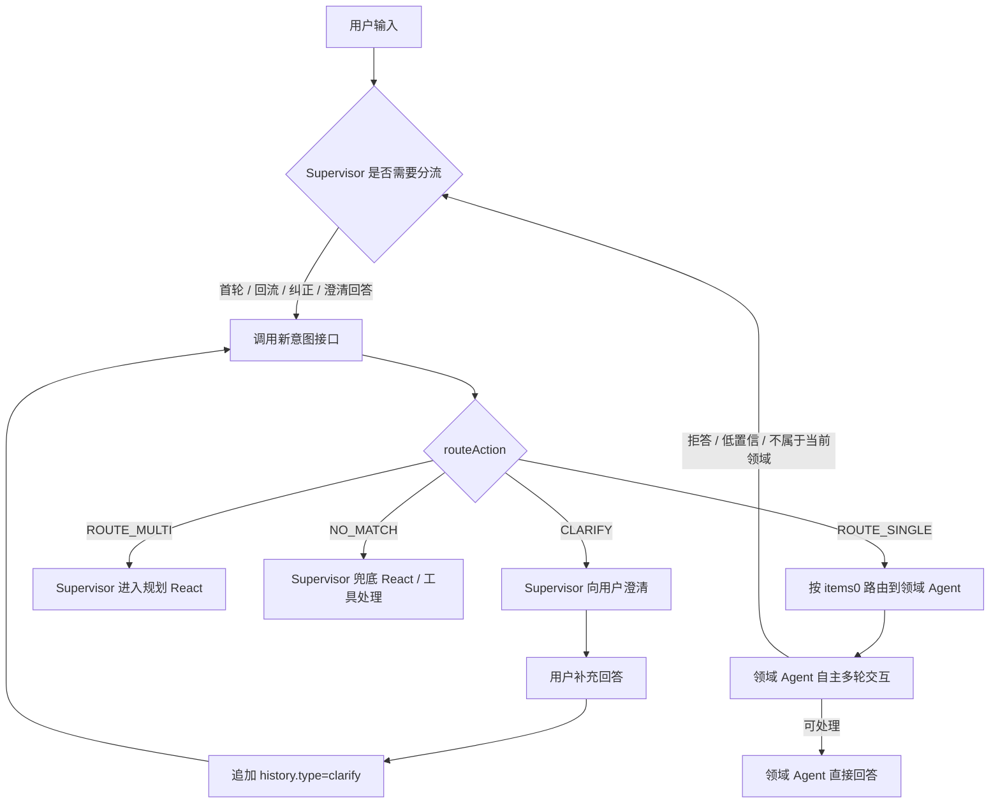

## 3. 整体链路

新接口为：

```text
POST /getIntentDecision
```

本文统一使用 `/getIntentDecision` 作为“获取意图决策”接口。Supervisor 必须优先读取 `data.result.routeAction`，不能再只通过 `items.length` 判断路由结果。
0703



`routeAction` 行为说明：

| routeAction      | items        | clarification | Supervisor 行为                                |
| ---------------- | ------------ | ------------- | ---------------------------------------------- |
| `ROUTE_SINGLE` | 1 个         | null          | 直接转发 `items[0]` 对应领域 Agent。         |
| `ROUTE_MULTI`  | 多个         | null          | 进入 Supervisor 自身规划 React。               |
| `NO_MATCH`     | 空           | null          | 当前配置领域无命中，进入兜底 React。           |
| `CLARIFY`      | 空或候选建议 | 非空          | 向用户展示 `clarification.clarifyQuestion`。 |

注意：

- `CLARIFY` 不是最终路由结果，不调用领域 Agent，也不写成功 route 历史。
- `items=[]` 不等价于无命中，必须结合 `routeAction` 判断。

---

## 4. 示例会话

```text
👤 U1：查一下 3 月 19 到 20 号各渠道支付成功率有没有明显下降
        │
        ▼
🧭 Supervisor → 📊 财经智能问数 Agent
        │
        └─ 📊 A1：整体支付成功率从 96.8% 降到 94.1%，渠道 A 下降最明显。
        │
        ├─ 👤 U2：那渠道 A 主要是哪个省份拖累的？
        └─ 📊 A2：广东省下降最明显。
        │
        ├─ 👤 U3：支付成功率这个指标口径是怎么算的？
        └─ 📊 拒答/回流：这是指标口径解释，不属于问数。
        ▼
🧭 Supervisor → 📘 财经知识助手 Agent
        │
        └─ 📘 A3：支付成功率 = 支付成功订单数 / 支付发起订单数。
        │
        ├─ 👤 U4：那广东为什么会下降？
        └─ 📘 拒答/回流：这是数据归因分析，不是口径解释。
        ▼
🧭 Supervisor → 🔍 深度分析 Agent
        │
        └─ 🔍 A4：可能与银行通道波动、支付方式占比变化有关。
        │
        ├─ 👤 U5：那继续帮我拆到银行维度看一下
        └─ 🔍 拒答/回流：需要重新查明细数据，不是直接研究分析。
        ▼
🧭 Supervisor → 📊 财经智能问数 Agent
        │
        └─ 📊 A5：广东地区主要是 XX 银行通道下降明显。
        │
        ├─ 👤 U6：再帮我看下方案
        └─ 📊 拒答/回流：不在问数服务范围，回 Supervisor。
        ▼
🧭 Supervisor：意图不明确，先澄清
        │
        └─ ❓ A6：你是想查询业务/项目方案，还是继续分析支付成功率处理方案？
        │
        ├─ 👤 U7：我是想看支付成功率下降后怎么处理
        ▼
🧭 Supervisor → 🔍 深度分析 Agent
        │
        └─ 🔍 A7：可以，建议先切换或降权异常银行通道，并拉取错误码验证。
```

---

## 5. 每次调用意图服务时的上下文组织

Supervisor 每次需要重新分流时，给意图模型这些信息：

1. 当前用户输入 `query`，即最新一轮待分类用户问题。
2. 顶层 `conversationContext`，承载本轮路由上下文。
3. `conversationContext.routeTrigger`，表示触发路由的原因。
4. `conversationContext.lastIntentRejectReason`，表示上一个跳出的意图及拒答原因。但前几轮切换路由时的拒答不需要提供，避免噪音累积。
5. `conversationContext.history`，承载历史已生效路由消息和澄清消息。这里的“已生效”指目标 binding 已成功持久化，不要求下游任务执行成功。只取最新 TopK 条记录给意图服务，完整细节保存在1号的Chatservice审计日志，不进入意图服务的在线路由上下文。

以下为多轮中每轮需要提供的信息示例：

### 5.1 首轮路由

```text
---
【当前问题】
👤 U1：查一下 3 月 19 到 20 号各渠道支付成功率有没有明显下降

【历史信息】
    无
---
```

此时：

* `query` 为当前用户问题。
* `conversationContext.routeTrigger = first_turn`。
* `conversationContext.history` 为空。
* `conversationContext.lastIntentRejectReason` 为空。

---

### 5.2 领域 Agent 拒答后重新分流

```text
---
【当前问题】
👤 U3：支付成功率这个指标口径是怎么算的？

【历史信息】
👤 U1：查一下 3 月 19 到 20 号各渠道支付成功率有没有明显下降 → 📊 财经智能问数 Agent
        ├─ 👤 U3：支付成功率这个指标口径是怎么算的？
        └─ 📊 拒答/回流：这是指标口径解释，不属于问数。
---
```

对应语义：

* 当前问题是 U3。
* 当前跳出的意图是 `finance_data_query`。
* 当前拒答原因是“这是指标口径解释，不属于问数”。
* 历史已生效路由中已有 U1 → `finance_data_query`。

---

### 5.3 多次跨领域后的重新分流

```text
---
【当前问题】
👤 U5：那继续帮我拆到银行维度看一下

【历史信息】
👤 U1：查一下 3 月 19 到 20 号各渠道支付成功率有没有明显下降 → 📊 财经智能问数 Agent
👤 U3：支付成功率这个指标口径是怎么算的？→ 📘 财经知识助手 Agent
👤 U4：那广东为什么会下降？ → 🔍 深度分析 Agent
        ├─ 👤 U5：那继续帮我拆到银行维度看一下
        └─ 🔍 拒答/回流：需要重新查明细数据，不是直接研究分析。
---
```

这里需要给意图服务的信息是：

* 当前用户问题：U5。
* 当前跳出的意图：`deep_analysis`。
* 当前拒答原因：需要重新查明细数据，不是直接研究分析。
* 历史已生效路由：

  * U1 → `finance_data_query`
  * U3 → `finance_knowledge`
  * U4 → `deep_analysis`

---

## 6. Supervisor 澄清场景

0703
本节澄清指“路由前置澄清”，由新接口返回 `routeAction=CLARIFY` 触发。Supervisor 负责展示澄清问题、接收用户回答并维护 `conversationContext.history`。澄清期间不进入领域 Agent，也不代表一次成功路由。

### 6.1 澄清期间

澄清期间，每一轮 0号意图服务提供的澄清问和用户回答都经过 Supervisor 交互，因此也算在历史会话里。

ChatService 将该过程保存为完整消息链，而不是反复覆盖同一条 assistant：

```text
user 原始问题 -> assistant 澄清问题 -> user 澄清回答 -> assistant 下一轮澄清/最终回答
```

澄清 assistant 的正文为 `clarifyQuestion`，并保留 `INTENT_CLARIFICATION_REQUEST` part；用户回答是独立 user 消息。`intent-clarification-response` 仍作为实时和恢复事件保留，但不重复写入 assistant parts。

```text
---
【当前问题】
👤 U8：是解决这次成功率下降的处理措施

【历史信息】
👤 U1：查一下 3 月 19 到 20 号各渠道支付成功率有没有明显下降 → finance_data_query
👤 U3：支付成功率这个指标口径是怎么算的？ → finance_knowledge
👤 U4：那广东为什么会下降？ → deep_analysis
👤 U5：那继续帮我拆到银行维度看一下 → finance_data_query
👤 U6：再帮我看下方案 → ❓ Supervisor 澄清
        ├─ ❓ Supervisor：你是想继续分析支付成功率下降后的处理方案，还是想查询某个业务/项目方案？
        ├─ 👤 U7：都可以，先看跟支付相关的
        ├─ ❓ Supervisor：你说的“跟支付相关的”，是指解决这次支付成功率下降的处理措施，还是查询支付业务项目方案文档？
        └─ 👤 U8：是解决这次成功率下降的处理措施

【意图服务结果】
🔍 deep_analysis
---
```

### 6.2 澄清完成后的历史折叠

澄清期间可以保留多轮 clarify 明细。
但一旦澄清后分类成功，应将整段澄清折叠成一条成功 route 记录，旧 clarify 明细从在线 history 中移除。

折叠前：

```text
👤 U6：再帮我看下方案 → ❓ Supervisor 澄清
        ├─ ❓ Supervisor：你是想继续分析支付成功率下降后的处理方案，还是想查询某个业务/项目方案？
        ├─ 👤 U7：都可以，先看跟支付相关的
        ├─ ❓ Supervisor：你说的“跟支付相关的”，是指解决这次支付成功率下降的处理措施，还是查询支付业务项目方案文档？
        └─ 👤 U8：是解决这次成功率下降的处理措施
```

折叠后：

```text
👤 U6：再帮我看下方案；澄清后用户确认：解决这次支付成功率下降的处理措施 → deep_analysis
```

折叠后的下一轮历史示例：

```text
---
【当前问题】
👤 U8：回到问数进行查询渠道总和

【历史信息】
👤 U1：user: 查一下 3 月 19 到 20 号各渠道支付成功率有没有明显下降 → finance_data_query
👤 U3：user: 支付成功率这个指标口径是怎么算的？ → finance_knowledge
👤 U4：user: 那广东为什么会下降？ → deep_analysis
👤 U5：user: 那继续帮我拆到银行维度看一下 → finance_data_query
👤 U6：【再帮我看下方案；澄清后用户确认：解决这次支付成功率下降的处理措施】（没有合并就简单拼接会话和回答，见下方示例） → deep_analysis
👤 U8：回到问数进行查询渠道总和

```

0703 待办：确认有没有合并？没有

简单拼接澄清期间会话和回答，状态作为路由分类的用户query,给到的history内容如下：

user: 再帮我看下方案
assistant: 你是想继续分析支付成功率下降后的处理方案，还是想查询某个业务/项目方案？
user: 都可以，先看跟支付相关的
assistant: 你说的“跟支付相关的”，是指解决这次支付成功率下降的处理措施，还是查询支付业务项目方案文档？
user: 是解决这次成功率下降的处理措施

→ deep_analysis

---

## 7. JSON 交互结构

### 7.1 推荐方案：统一 `conversationContext.history`

采用顶层 `conversationContext.history` 字段，统一承载成功路由记录和澄清记录。

```json
{
  "accessName": "financial_supervisor",
  "query": "是解决这次成功率下降的处理措施",
  "userId": "u1001",
  "conversationContext": {
    "routeTrigger": "clarify_answer",
    "lastIntentRejectReason": {
      "lastIntent": null,
      "domainRejectMessage": null
    },
    "history": [
      {
        "type": "route",
        "query": "查一下 3 月 19 到 20 号各渠道支付成功率有没有明显下降",
        "intent": "finance_data_query"
      },
      {
        "type": "route",
        "query": "支付成功率这个指标口径是怎么算的？",
        "intent": "finance_knowledge"
      },
      {
        "type": "route",
        "query": "那广东为什么会下降？",
        "intent": "deep_analysis"
      },
      {
        "type": "route",
        "query": "那继续帮我拆到银行维度看一下",
        "intent": "finance_data_query"
      },
      {
        "type": "clarify",
        "query": "再帮我看下方案",
        "clarifyQuestion": "你是想继续分析支付成功率下降后的处理方案，还是想查询某个业务/项目方案？",
        "clarificationType": "AMBIGUOUS_ROUTE"
      },
      {
        "type": "clarify",
        "query": "都可以，先看跟支付相关的",
        "clarifyQuestion": "你说的“跟支付相关的”，是指解决这次支付成功率下降的处理措施，还是查询支付业务项目方案文档？",
        "clarificationType": "AMBIGUOUS_ROUTE"
      }
    ]
  }
}
```

0703 clarify类型的字段修改
-
## 8. 字段说明

### 8.1 顶层字段

| 字段                                           | 类型    | 是否必填 | 说明                                                                   |
| ---------------------------------------------- | ------- | -------: | ---------------------------------------------------------------------- |
| `accessName` / `intentID` / `entranceID` | string  |   三选一 | 意图入口。具体取值由意图服务配置决定。                                 |
| `query`                                      | string  |       是 | 当前待分类用户问题，即最新一轮用户输入。澄清回答场景下填用户最新回答。 |
| `userId`                                     | string  |       否 | 用户工号，用于画像增强或日志。                                         |
| `conversationContext`                        | object  |       否 | 多轮路由上下文。首轮可为空，但建议显式传空结构。                       |
| `options.trace`                              | boolean |       否 | 是否返回 trace。                                                       |

---

### 8.2 `conversationContext` 字段

| 字段                       | 类型   | 是否必填 | 说明                                                   |
| -------------------------- | ------ | -------: | ------------------------------------------------------ |
| `routeTrigger`           | string |       否 | 触发 Supervisor 重新分流的原因。                       |
| `lastIntentRejectReason` | object |       否 | 上一个跳出的意图及其拒答原因。首轮或澄清中可为空对象。 |
| `history`                | array  |       否 | 历史已生效路由记录和当前未完成澄清链路。               |

---

### 8.3 `routeTrigger` 枚举

| 枚举值              | 含义                                                    | 是否调用意图服务 |
| ------------------- | ------------------------------------------------------- | ---------------: |
| `first_turn`      | 首轮路由                                                |               是 |
| `domain_reject`   | 领域 Agent 拒答或低置信，回 Supervisor 重新分流         |               是 |
| `user_correction` | 用户纠正路由，例如手工关闭当前领域 Agent 窗口后重新判断 |               是 |
| `clarify_answer`  | 用户回答 Supervisor 澄清问题后，需要再次分类            |               是 |
| `fallback_followup` | NO_MATCH 后进入通用服务（relay）处理，后续用户输入走到意图服务重新判断            |               是 |
| `explicit_switch` | 用户通过手工方式明确选择意图类别                        |               否 |

说明：

* `explicit_switch` 不走意图服务。
* 但如果发生 `explicit_switch`，仍需要将该次选择结果追加到在线 history，作为后续路由上下文。

---

### 8.4 `lastIntentRejectReason`

```json
{
  "lastIntent": "deep_analysis",
  "domainRejectMessage": "需要重新查明细数据，不是直接研究分析。"
}
```

字段说明：

| 字段                    | 类型          | 说明                                                                  |
| ----------------------- | ------------- | --------------------------------------------------------------------- |
| `lastIntent`          | string / null | 当前跳出的意图。首轮或澄清阶段可为空。                                |
| `domainRejectMessage` | string / null | 当前这一次领域 Agent 的拒答或回流说明。只传当前这次，不传前几轮拒答。 |

不同触发场景下取值：

| routeTrigger        | lastIntent           | domainRejectMessage                                                      |
| ------------------- | -------------------- | ------------------------------------------------------------------------ |
| `first_turn`      | null                 | null                                                                     |
| `domain_reject`   | 当前跳出的意图       | 当前领域 Agent 拒答说明                                                  |
| `user_correction` | 被用户纠正的当前意图 | 填用户纠正说明，示例“用户手动选择关闭该路由结果” 0703 用户关闭时的确认 |
| `clarify_answer`  | null                 | null                                                                     |

---

### 8.5 `history`

`conversationContext.history` 是数组，按时间从早到晚排列。
JSON 数组顺序是稳定的，因此可以用来表达历史顺序。

在线 `conversationContext.history` 默认取最新 TopK，K 暂定为 5。
在澄清期间，TopK 需要覆盖当前澄清链路，避免澄清上下文被截断。

#### type = no_match

表示已经成功路由，但是为匹配到任何领域agent的场景。此场景无需给意图

```json
{
  "type": "no_match",
  "query": "那广东为什么会下降？",
  "intent": ""
}
```

#### type = route

表示已经成功路由过的历史锚点。

```json
{
  "type": "route",
  "query": "那广东为什么会下降？",
  "intent": "deep_analysis"
}
```

字段说明：

| 字段       | 类型   | 说明                   |
| ---------- | ------ | ---------------------- |
| `type`   | string | 固定为 `route`       |
| `query`  | string | 当时成功路由的用户问题 |
| `intent` | string | 当时命中的意图         |

#### type = clarify

0703 明确澄清过程中字段的内容
表示 Supervisor 澄清过程。

```json
{
  "type": "clarify",
  "query": "再帮我看下方案",
  "clarifyQuestion": "你是想继续分析支付成功率下降后的处理方案，还是想查询某个业务/项目方案？",
  "clarificationType": "AMBIGUOUS_ROUTE"
}
```

字段说明：

| 字段                  | 类型   | 说明                                                                                |
| --------------------- | ------ | ----------------------------------------------------------------------------------- |
| `type`              | string | 固定为 `clarify`。                                                                |
| `query`             | string | 触发这轮澄清的用户输入。                                                            |
| `clarifyQuestion`   | string | 意图服务返回、Supervisor 展示给用户的澄清问题。                                     |
| `clarificationType` | string | 可选。意图服务返回的澄清类型，当前为 `AMBIGUOUS_ROUTE` 或 `UNCLEAR_REFERENCE`。 |

说明：

* 不单独设计 `pending_clarify`。
* `clarify` 一条记录表达用户“触发澄清的问题 + Supervisor 澄清问题”；用户回答作为本轮再次调用 `/getIntentDecision` 的 `query` 传入，不在 `clarify` 记录中重复保存。
* 多轮澄清时追加多条 `clarify`。
* 澄清成功后，将多条 `clarify` 折叠成一条 `route`。

---

## 8.6 `/getIntentDecision` 响应结构

0703 修改了响应结构，增加标志位routeAction确认场景，增加澄清时的返回结构

```json
{
  "status": "success",
  "code": 200,
  "message": "success",
  "data": {
    "result": {
      "routeAction": "CLARIFY",
      "items": [],
      "clarification": {
        "type": "AMBIGUOUS_ROUTE",
        "clarifyQuestion": "你想看处理方案还是项目方案？",
        "candidateIntents": [
          {
            "intentId": "deep_analysis",
            "intentName": "深度分析",
            "confidence": 0.72
          }
        ]
      }
    }
  }
}
```

`routeAction` 以服务端最终裁决为准：

| routeAction      | 含义               | Supervisor 行为                                                                         |
| ---------------- | ------------------ | --------------------------------------------------------------------------------------- |
| `ROUTE_SINGLE` | 单意图命中         | 转发 `items[0]` 对应领域 Agent。                                                      |
| `ROUTE_MULTI`  | 多意图命中         | 进入 Supervisor 自身规划 React。                                                        |
| `NO_MATCH`     | 当前配置领域无命中 | 进入兜底 React / 工具处理。                                                             |
| `CLARIFY`      | 需要路由前置澄清   | 展示 `clarification.clarifyQuestion`，等待用户回答后再次调用 `/getIntentDecision`。 |

`clarification.type` 当前只保留两类：

| type                  | 含义                                                                 | candidateIntents                              |
| --------------------- | -------------------------------------------------------------------- | --------------------------------------------- |
| `AMBIGUOUS_ROUTE`   | 多个已配置领域 Agent 都可能承接，但证据不足                          | 可返回 Top2-3 个候选，Supervisor 可展示选项。 |
| `UNCLEAR_REFERENCE` | 用户问题存在“这个/该附件/帮我分析下”等指代、附件、对象或上下文缺失 | 通常为空，不展示领域候选。                    |

澄清话术约束：

- `clarifyQuestion` 控制在 40 个中文字符以内，只问一个问题。
- 只追问完成路由判断所需的信息，不采集领域 Agent 执行业务所需的具体参数。
- `UNCLEAR_REFERENCE` 只让用户补充对象或上下文，不提前展示领域 Agent 选项。

---

## 9. 1号传给0号的 history 的维护规则

### 9.1 成功路由时

0703
当历史消息中的意图服务有命中时(`/getIntentDecision` 返回 `routeAction=ROUTE_SINGLE`)，Supervisor 成功路由到某个意图后，向 `conversationContext.history`  追加一条：

```json
{
  "type": "route",
  "query": "当前用户问题",
  "intent": "命中的意图"
}
```

0703 如何存进入了react的历史？【待定】

当 `/getIntentDecision` 返回 `routeAction=NO_MATCH` 时，Supervisor 进入自身规划 React。此时路由历史记录为 NO_MATCH，明确不在领域范围内。

当 `/getIntentDecision` 返回 `routeAction=ROUTE_MULTI` 时，Supervisor 进入自身规划 React。ChatService 在 Relay binding 成功后、调用 Relay 前写入一条 route 记录：

```json
{
  "type": "route",
  "query": "当前用户问题",
  "intent": "no_match"
}
```

该记录不代表 Relay 被绑定为会话长期领域。只有该记录关联的 source run 最终为 `COMPLETED`，下一轮才生成 `conversationContext.routeTrigger=fallback_followup`；任务失败或取消仍保留 route 事实，但不会触发该 trigger。

### 9.2 领域拒答时

领域 Agent 拒答回流时，保留首次 binding 成功时已经写入的 route；拒答信息本身不新增 route，也不删除原记录。
Supervisor 调用意图服务时，将拒答说明放入：

```json
"conversationContext": {
  "routeTrigger": "domain_reject",
  "lastIntentRejectReason": {
    "lastIntent": "当前跳出的意图",
    "domainRejectMessage": "当前这一次拒答说明"
  }
}
```

### 9.3 澄清中

如果还在澄清中未路由（ 上一轮 `/getIntentDecision` 返回 `routeAction=CLARIFY`），Supervisor 向用户澄清。
用户回答后，再次调用 `/getIntentDecision` 时，将触发澄清的问题和澄清问题作为 `clarify` 写入 history；用户回答放在本轮 `query` 中。

多轮澄清期间，保留多条 clarify。

再次调用时必须满足：

- `query` 使用用户对澄清问题的最新回答。
- `conversationContext.routeTrigger` 使用 `clarify_answer`。
- `conversationContext.lastIntentRejectReason` 可以置空，避免上一轮拒答原因在澄清链路中重复放大。
- 上一轮触发澄清的问题、澄清问题写入一条 `history.type=clarify`；用户回答使用本轮 `query` 传入。
- 如果 `/getIntentDecision` 继续返回 `CLARIFY`，继续追加下一条 `clarify`；建议chatservice最多澄清 3 轮，超过后由 Supervisor 兜底 React。
- 前端每轮回答仍调用 `/v1/chat/runs` 且使用 `runMode=CONTINUE_INTERACTION`。回答 admission 成功后旧 Interaction 立即成为 `ANSWERED`，后续执行失败不会重复开放该 Interaction。

### 9.4 澄清成功后

一旦澄清后分类成功，应合并多轮的澄清过程，只给一条路由记录。完整 clarify 明细只保留在1号的会话日志里，用于排查、评测和回放。

```text
多条 clarify → 一条 route
```

折叠格式建议：

```json
{
  "type": "route",
  "query": "再帮我看下方案；澄清后用户确认：解决这次支付成功率下降的处理措施",
  "intent": "deep_analysis"
}
```

然后从在线 `conversationContext.history` 中移除旧的 clarify 明细。完整 clarify 明细只保留在Supervisor领域入口的会话日志里，用于排查、评测和回放。

0703 待确认是否有折叠能力？没有

目前 Supervisor 没有 query 合并能力，因此对于多轮澄清过程，Supervisor 暂时先对（过程中的用户query+澄清问？） 做直接拼接，不做语义改写：

```json
{
  "type": "route",
  "query": "user:原始触发澄清问题；澄清问：xxx ....用户：用户最后一次澄清回答",
  "intent": "命中的意图"
}
```

拼接成一条后的query内容示例：

```python
'''
user: 再帮我看下方案
assistant: 你是想继续分析支付成功率下降后的处理方案，还是想查询某个业务/项目方案？
user: 都可以，先看跟支付相关的
assistant: 你说的“跟支付相关的”，是指解决这次支付成功率下降的处理措施，还是查询支付业务项目方案文档？
user: 是解决这次成功率下降的处理措施
'''
```

当前 ChatService 会把这条折叠文本作为最终 DomainAgent/Relay 的 `query`；再次调用意图服务时仍保持顶层 `query=最新澄清回答`，折叠前的原始问题和澄清问答通过 `conversationContext.history` 传入。

下一轮再次调用 `/getIntentDecision` 时：

- `query` 只传当前用户最新输入。
- `conversationContext.history` 只传折叠后的 `route`，不要继续传旧的多条 `clarify` 明细。
- 旧的多条 `clarify` 明细只保留在日志或审计表中，用于排查和回放。

> 备注
> 未来若会话太长可考虑：
> 方法1 query和澄清问题做裁剪，只保留 query，或者只保留第一次和最后一次澄清记录。既要保留对下一轮路由有用的上下文锚点，又避免把完整澄清链路长期放入 prompt，降低噪声。
> 方法2 由 `/getIntentDecision` 在澄清后成功路由的响应中返回 `routeMemory`总结用户意图，Supervisor 原样写入在线 history 。
> 目前开发时间有限暂不实现，先采用直接拼接方法，而且已有top5限制 历史不会太长

---

## 10. 0号内部的处理

### 10.1  0号给1号返回的意图结果

见前面接口出参

### 10.2 提示词模板结构

虽然接口层可以使用 JSON，但给小模型看时，建议渲染成固定顺序的文本模板。
模型输出只是服务端裁决输入，不直接暴露给 Supervisor。新接口最终响应必须由服务端统一裁决成 `routeAction`。

备注：任务说明、候选意图和输出格式放在system里。这里仅是结果格式的示例，具体prompt以代码里的为准
system

```text
你是一个意图分流分类器，需要根据当前用户问题判断应该路由到哪个意图。

判断原则：
1. 当前待分类用户问题优先级最高。
2. 当前领域拒答说明是重要参考，用于判断为什么上一个意图处理不了。
3. 历史信息只用于理解“那、这个、刚才、继续、方案、为什么”等上下文依赖表达。
4. 如果当前用户问题本身已经表达清楚新任务，不要被历史信息带偏。
5. 只能从候选意图中选择；不确定则返回澄清。

【候选意图】
{candidate_intents}

【输出格式】
{
  "action": "MATCH | NO_MATCH | CLARIFY",
  "intent": [["候选意图名称", 0.95]],
  "clarification": null
}

```

user

```
【当前待分类用户问题】
{query}

【触发原因】
{conversationContext.routeTrigger}

【上一个跳出的意图及拒答原因】
lastIntent：{conversationContext.lastIntentRejectReason.lastIntent}
domainRejectMessage：{conversationContext.lastIntentRejectReason.domainRejectMessage}

【用户本轮对话的历史消息及路由结果，按时间顺序】
{conversationContext.history}


```

---

### 10.2 普通拒答回流示例

user部分

```text
【当前待分类用户问题】
那继续帮我拆到银行维度看一下

【触发原因】
domain_reject

【上一个跳出的意图及拒答原因】
lastIntent：deep_analysis
domainRejectMessage：需要重新查明细数据，不是直接研究分析。

【用户本轮对话的历史消息及路由结果，按时间顺序】
1. [已路由] 查一下 3 月 19 到 20 号各渠道支付成功率有没有明显下降 -> finance_data_query
2. [已路由] 支付成功率这个指标口径是怎么算的？ -> finance_knowledge
3. [已路由] 那广东为什么会下降？ -> deep_analysis


【输出格式】
{
  "action": "MATCH | NO_MATCH | CLARIFY",
  "intent": [["候选意图名称", 0.95]],
  "clarification": null
}
```

期望输出：

```json
{
  "action": "MATCH",
  "intent": [["finance_data_query", 0.86]],
  "clarification": null
}
```

---

### 10.3 澄清回答示例

```text
【当前待分类用户问题】
是解决这次成功率下降的处理措施

【触发原因】
clarify_answer

【上一个跳出的意图及拒答原因】
lastIntent：无
domainRejectMessage：无

【用户本轮对话的历史消息及路由结果，按时间顺序】
1. [已路由] 查一下 3 月 19 到 20 号各渠道支付成功率有没有明显下降 -> finance_data_query
2. [已路由] 支付成功率这个指标口径是怎么算的？ -> finance_knowledge
3. [已路由] 那广东为什么会下降？ -> deep_analysis
4. [已路由] 那继续帮我拆到银行维度看一下 -> finance_data_query
5. [澄清] 用户：再帮我看下方案
   Supervisor：你是想继续分析支付成功率下降后的处理方案，还是想查询某个业务/项目方案？
6. [澄清] 用户：都可以，先看跟支付相关的
   Supervisor：你说的“跟支付相关的”，是指解决这次支付成功率下降的处理措施，还是查询支付业务项目方案文档？


```

期望输出：

```json
{
  "action": "MATCH",
  "intent": [["deep_analysis", 0.88]],
  "clarification": null
}
```

---

## 11. 关键规则总结

1. Supervisor 调用新接口后，必须优先读取 `data.result.routeAction`，不要只用 `items.length` 判断。
2. `ROUTE_SINGLE` 直接转发领域 Agent；`ROUTE_MULTI` 进入 Supervisor 规划 React；`NO_MATCH` 进入兜底 React。
3. `CLARIFY` 只做路由前置澄清，不调用领域 Agent，不写成功 route。
4. 用户回答澄清后，`query` 使用用户最新回答，`conversationContext.routeTrigger` 使用 `clarify_answer`。
5. `conversationContext.history` 数组按时间顺序排列，类型包括 `route` 和 `clarify`。
6. 拒答原因只传当前这一次，放入 `conversationContext.lastIntentRejectReason`，不传前几轮拒答。
7. 澄清期间保留多轮 clarify；澄清成功后，将多轮 clarify 折叠为一条 route。
8. 在线 history 只取最新 TopK，K 暂定为 5；未完成澄清链路优先保留，避免被普通历史挤掉。
9. 完整澄清明细保留在独立 user/assistant 消息链和 RouteMemory 澄清事实中；最终折叠后不再作为多条 clarify 进入后续在线路由上下文。
10. `explicit_switch` 不调用意图服务，但需要写入 history，作为后续路由锚点。
11. 给小模型时建议将 JSON 渲染为固定顺序文本模板；模型输出只作为服务端裁决输入，对外响应统一使用 `routeAction`。
