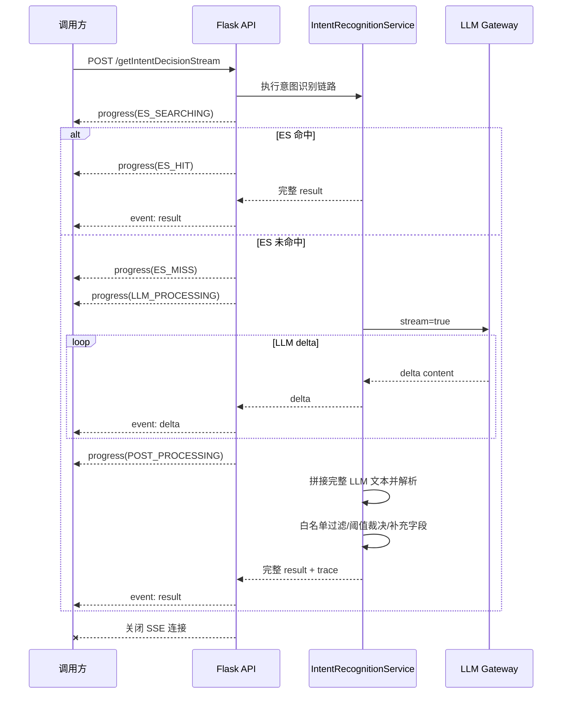

# 意图识别接口流式输出完整方案

## 1. 需求背景

当前意图识别服务已有两个核心入口：

- `/getIntentResult`：历史意图识别接口，返回 `data.result.items`。
- `/getIntentDecision`：领域入口 Agent 专用决策接口，返回 `data.result.routeAction/items/clarification`。

现有链路是同步 HTTP JSON 响应。ES 高置信命中时返回较快；ES 未命中后会进入 Prompt 增强和 LLM 路由判断，耗时不稳定。调用方希望在走 LLM 时获得流式输出，降低长等待期间的空白感知，同时仍然需要最后拿到一个完整、经过服务端校验和字段补充后的整体请求结果。

本方案目标：

1. 给 `/getIntentResult` 和 `/getIntentDecision` 增加对应流式能力。
2. 如果本次请求未走 LLM，例如 ES 直接命中，也要以流式协议返回最终结果，保证调用方协议统一。
3. 如果走了 LLM，将 LLM 的增量内容按 SSE 事件转发给请求方。
4. LLM 输出结束后，服务端必须继续执行原有解析、白名单过滤、阈值裁决、字段补充、日志落库等后处理，再发送最终 `result` 事件。
5. 明确 ping 保活、连接超时、空闲超时、总超时的边界，避免长连接被代理、网关或客户端误断。

## 2. 协议精简结论

SSE 对外只定义四种业务事件：

- `progress`：返回当前处理阶段，例如 ES 检索中、ES 命中、ES 未命中、进入 LLM。
- `delta`：转发 LLM 增量文本，仅用于过程展示或观测。
- `result`：返回经过服务端完整后处理的最终结果，是唯一可驱动业务决策的事件。
- `error`：返回流建立后的处理异常。

连接保活不增加业务事件类型，统一使用标准 SSE 注释：

```text
: ping

```

删除 `start`、`heartbeat`、`final`、`done` 事件。HTTP 连接建立已经代表请求开始；`result` 或 `error` 发送后直接关闭连接，连接关闭即代表本次流结束。

## 3. 现状与 Gap

当前工程现状：

- `api/routes.py` 已有 `/getIntentResult` 和 `/getIntentDecision` 两个同步接口。
- `IntentRecognitionService.decide_stream` 已预留流式入口，但当前只复用 `_execute_decision_pipeline`，没有真正输出 SSE。
- `infrastructure/gateways/intent_llm_gateway.py` 当前固定 `stream: false`，只返回完整模型文本。
- 当前日志落库逻辑集中在 `api/routes.py`，流式接口也必须保证最终成功、失败、中断可观测。
- Gunicorn 启动脚本当前 `--timeout 1800`、`--worker-class gthread`，具备承载较长请求的基础，但还需要确认代理层是否关闭响应缓冲。

Gap 清单：

| Gap          | 现状                  | 目标                                                     |
| -------------- | ----------------------- | ---------------------------------------------------------- |
| 对外流式接口 | 无                    | 新增`/getIntentResultStream`、`/getIntentDecisionStream` |
| LLM 网关     | 非流式`invoke_model`  | 增加`stream_invoke_model`，逐段返回 delta                |
| 业务后处理   | 依赖完整 LLM 文本     | 流式转发同时缓冲完整文本，结束后复用原解析裁决           |
| 心跳         | 无                    | SSE 空闲阶段定时发送`: ping`注释                         |
| 超时         | requests 单次 timeout | 拆分连接、首包、空闲、总超时                             |
| 调用方契约   | 同步 JSON             | SSE 多事件，只有`result`可驱动业务                       |
| 中断处理     | 同步异常              | 捕获客户端断开，关闭上游 LLM 响应并记录日志              |

## 4. 总体技术方案

新增两个流式接口，保留两个同步接口不变：

- `POST /getIntentResultStream`
- `POST /getIntentDecisionStream`

不建议通过 `options.stream=true` 改变原接口响应类型。同步 JSON 与 SSE 的响应体、Content-Type、错误处理方式不同，复用同一路径会提高调用方兼容成本，也容易让老调用方误解析。

流式接口使用 SSE：

```text
Content-Type: text/event-stream; charset=utf-8
Cache-Control: no-cache
Connection: keep-alive
X-Accel-Buffering: no
```

整体链路：



关键原则：

- `delta` 只用于展示模型生成过程，不允许调用方据此路由。
- `result` 是唯一可用于业务决策的事件。
- `result.data` 的结构必须与同步接口 `data` 内部结构保持一致。
- LLM 流式失败且无法得到完整可解析结果时，发送 `error` 事件并关闭连接；不得拼出半成品 `result`。
- LLM 已完整结束但服务端后处理失败时，也发送 `error`，并记录后处理失败原因。

## 5. SSE 事件协议

### 5.1 事件数据原则

SSE 事件分为过程事件和终态事件，采用不同的 payload 约束：

- `progress`、`delta` 是过程通知，`data` 直接使用精简业务对象，不携带 `status/code/message/data` 统一外层。
- `result`、`error` 是终态事件，继续复用现有统一响应结构。
- `result` 的整个 JSON 必须与相同请求调用非流式接口得到的 HTTP JSON 完全一致，不能增加、删除或移动字段。
- `error` 使用现有 `error_response(...)` 构造，保留流建立后无法通过 HTTP 状态码表达的错误码。
- `: ping` 是 SSE 注释，不是业务报文，不包含 JSON。

过程事件格式：

```text
event: progress | delta
data: <精简事件数据JSON，单行>

```

终态事件格式：

```text
event: result | error
data: <现有统一响应JSON，单行>

```

所有内容使用 UTF-8，每个事件以空行结束。JSON 使用紧凑单行序列化，避免调用方按行解析时出现歧义。

### 5.2 事件类型

| event      | 触发时机                    | 是否业务结果 | 说明                   |
| ------------ | ----------------------------- | -------------- | ------------------------ |
| `progress` | ES、LLM、结果后处理阶段切换 | 否           | 当前处理阶段           |
| `delta`    | 收到 LLM token/chunk        | 否           | 仅当走 LLM 时出现      |
| `result`   | 完整结果组装成功            | 是           | 唯一可信的最终业务结果 |
| `error`    | 流建立后请求处理失败        | 是，失败结果 | 发送后关闭连接         |

`: ping` 是 SSE 保活注释，不属于事件类型，也不进入调用方业务处理。

### 5.3 progress 事件

```text
event: progress
data: {"stage":"ES_SEARCHING","stageMessage":"ES检索中"}

event: progress
data: {"stage":"ES_HIT","stageMessage":"ES已命中"}

event: progress
data: {"stage":"ES_MISS","stageMessage":"ES未命中"}

event: progress
data: {"stage":"LLM_PROCESSING","stageMessage":"进入LLM意图识别"}

event: progress
data: {"stage":"POST_PROCESSING","stageMessage":"正在校验并组装结果"}

```

`stage` 是调用方判断阶段的稳定枚举，`stageMessage` 只用于展示，不作为程序判断条件。

| stage             | 触发时机                       | 后续事件                              |
| ------------------- | -------------------------------- | --------------------------------------- |
| `ES_SEARCHING`    | 开始 ES 检索前                 | `ES_HIT` 或 `ES_MISS`                 |
| `ES_HIT`          | ES 结果达到直接命中条件        | `result`                              |
| `ES_MISS`         | ES 未达到直接命中条件          | `LLM_PROCESSING`                      |
| `LLM_PROCESSING`  | 即将调用 LLM                   | `delta`、`POST_PROCESSING` 或 `error` |
| `POST_PROCESSING` | LLM 完成，开始解析、校验和组装 | `result` 或 `error`                   |

未实际执行的阶段不发送。例如请求跳过 ES，则不伪造 `ES_SEARCHING/ES_HIT/ES_MISS`。

### 5.4 delta 事件

服务端解析上游 LLM SSE 后，对外发送统一增量结构，不直接暴露不同模型网关的原始事件：

```text
event: delta
data: {"index":1,"content":"{\"action\""}

event: delta
data: {"index":2,"content":":\"MATCH\""}

```

字段说明：

| 字段      | 含义                    |
| ----------- | ------------------------- |
| `index`   | 当前增量序号，从 1 开始 |
| `content` | 本次新增模型文本        |

服务端在发送 `delta` 的同时累积完整模型文本。模型结束后使用累积文本执行 JSON 解析、白名单校验、置信度裁决和字段补充。

### 5.5 ping 保活

```text
: ping

```

默认空闲间隔建议为 `10s`。只有最近一个 ping 间隔内没有发送任何 `progress`、`delta`、`result` 或 `error` 时才发送 ping；业务事件持续输出时不发送。Ping 只刷新连接空闲时间，不延长请求总超时。

### 5.6 result 事件

`result` 的事件数据直接使用非流式接口的完整响应 payload。

`/getIntentDecisionStream`：

```text
event: result
data: {"status":"success","code":200,"message":"success","data":{"result":{"routeAction":"ROUTE_SINGLE","items":[{"intentId":"xxx","intentName":"知识问答","confidence":0.95,"source":"llm"}],"clarification":null},"trace":{}}}

```

`/getIntentResultStream`：

```text
event: result
data: {"status":"success","code":200,"message":"success","data":{"result":{"items":[{"intentId":"xxx","intentName":"知识问答","source":"llm","confidence":0.95}]}}}

```

强制约束：

- 对同一份 `ServiceResult`，`json.loads(result_event.data)` 必须等于非流式接口序列化出的完整 HTTP JSON 响应。
- `options.trace=false` 时，流式和非流式都不返回 `data.trace`。
- `options.trace=true` 时，流式和非流式的 `data.trace` 位置及结构相同。
- `result` 发送完成后直接关闭连接。

### 5.7 error 事件

流已经建立后发生错误，使用现有 `error_response(message, status_code)` 生成事件数据：

```text
event: error
data: {"status":"fail","code":504,"message":"llm stream idle timeout","data":null}

```

错误处理分为两个阶段：

1. SSE 响应建立前：请求体为空、字段非法等参数错误，继续按现有接口方式返回 HTTP `4xx` 和统一 JSON 错误报文。
2. SSE 响应建立后：HTTP 状态已经是 `200`，无法再修改状态码；发送 `event:error`，其中 `data.code` 保留原本应返回的业务/HTTP 错误码，然后关闭连接。

不在错误 payload 中新增流式专用字段。`requestId` 如需返回，沿用现有链路的响应头或 trace 设计，不改变统一错误报文。

| code  | 场景                                               |
| ------- | ---------------------------------------------------- |
| `400` | 流建立前的请求参数错误                             |
| `429` | 上游 LLM 限流                                      |
| `499` | 客户端主动断开，仅记录日志，通常无法再发送给客户端 |
| `502` | 上游 LLM 返回异常格式或 HTTP 错误                  |
| `504` | 首包、空闲或总超时                                 |
| `500` | 服务端未知异常                                     |

## 6. 两个接口的差异

### 6.1 `/getIntentResultStream`

目标是兼容历史 `/getIntentResult` 结果协议。

流式行为：

- ES 命中：依次发送 `progress(ES_SEARCHING)`、`progress(ES_HIT)`、`result`，没有 `delta`。
- ES 未命中并进入 LLM：依次发送 `progress(ES_SEARCHING)`、`progress(ES_MISS)`、`progress(LLM_PROCESSING)`、`delta*`、`progress(POST_PROCESSING)`、`result`。
- 最终 `result.data.result.items` 与 `/getIntentResult` 一致。
- 旧接口没有 `routeAction`，流式接口也不新增路由裁决字段，避免改变调用方语义。

### 6.2 `/getIntentDecisionStream`

目标是兼容 `/getIntentDecision` 的领域入口 Agent 协议。

流式行为：

- ES 命中：最终返回 `ROUTE_SINGLE`。
- LLM 输出：可透传 `delta`，但必须在 LLM 完整结束后执行决策后处理。
- 最终 `result.data.result.routeAction` 仍只允许 `ROUTE_SINGLE/ROUTE_MULTI/NO_MATCH/CLARIFY`。
- `CLARIFY` 场景同样等到 `result` 才能展示澄清问题；不要从 `delta` 中提前截取问题展示。

## 7. ChatService 调用约束

ChatService 保留阻塞和流式两套调用实现，由启动配置选择：

| 配置 | 默认值 | 说明 |
| --- | --- | --- |
| `financeex.intent.invocation-mode` | `STREAMING` | 只允许 `BLOCKING` 或 `STREAMING`。 |
| `financeex.intent.recognize-path` | `/intent-recognition-configuration/getIntentDecision` | 阻塞接口路径。 |
| `financeex.intent.recognize-stream-path` | `/intent-recognition-configuration/getIntentDecisionStream` | SSE 接口路径。 |
| `financeex.intent.timeout` | `5s` | 阻塞接口单次调用超时。 |
| `financeex.intent.stream-first-event-timeout` | `5s` | SSE 等待首个业务事件的最长时间；ping 不刷新该超时。 |
| `financeex.intent.stream-idle-timeout` | `30s` | 相邻 SSE 网络帧的最长间隔；ping 会刷新该超时。 |
| `financeex.intent.stream-total-timeout` | `120s` | 单次 SSE 尝试的总时限；任何事件均不延长。 |
| `financeex.intent.stream-auth-timeout` | `5s` | 获取企业鉴权 Header 的最长时间。 |
| `financeex.intent.stream-auth-io-max-size` | `4` | 鉴权阻塞 IO 专用调度器最大线程数。 |
| `financeex.intent.stream-auth-io-queue-capacity` | `128` | 鉴权阻塞 IO 专用调度器队列容量。 |

默认模式为 `STREAMING` 并只调用 `getIntentDecisionStream`；显式配置 `BLOCKING` 时调用
`getIntentDecision`。ChatService 不根据 Content-Type 改调另一接口；响应类型与配置不匹配时，
本次尝试按协议失败处理。

两种调用实现共享请求 mapper、结果 mapper、鉴权 Header 和重试策略。流式模式只消费
`progress`、`delta`、`result` 和 `error`：

- `progress` 转换为 `runtime.progress`，`sourceType=intent-progress`。
- `delta` 转换为 `runtime.thinking`，`sourceType=intent-delta`。
- `result` 的完整 JSON 交给阻塞模式使用的同一结果 mapper，raw result 不直接转发。
- `error` 结束当前 SSE 尝试并进入重试，不直接产生前端错误事件。
- `: ping` 只维护连接空闲状态，不生成 ChatEvent。
- 未知过程事件以及结构错误的 `progress/delta` 被忽略，不参与路由。

过程事件携带 `attempt/maxAttempts`，并按接收顺序进入 ChatEvent 的持久化与实时发布链路。
`intent-start/intent-progress/intent-delta` 不进入历史 message parts 或分享快照；
`intent-result` 继续写入历史 part。`intent-progress/intent-delta` 参与同 run 的
`16 条 / 20ms / 256KB` 事件批量落库，`intent-result` 到达时先刷新待处理批次，再执行路由。
一次 SSE 连接对应一次尝试；重试会新建连接，已经落库的过程事件不撤回。HTTP 错误、SSE error、
首事件超时、空闲超时、总超时、异常断流、空流及非法终态都使用现有
`financeex.intent.max-retries`。重试耗尽后仍由
`financeex.intent.failure-strategy=RELAY_FALLBACK|FAIL_RUN` 收口。

`ROUTE_SINGLE`、`ROUTE_MULTI`、`NO_MATCH` 和 `CLARIFY` 的业务处理、RouteMemory、
RuntimeBinding、DomainAgent 拒答重路由及 Interaction 状态机不区分调用模式。
合法 `CLARIFY` 立即返回且不进入重试；`FINAL` 结果缺少 decision 属于协议失败。
`getIntentResultStream` 不属于 ChatService 调用范围。
