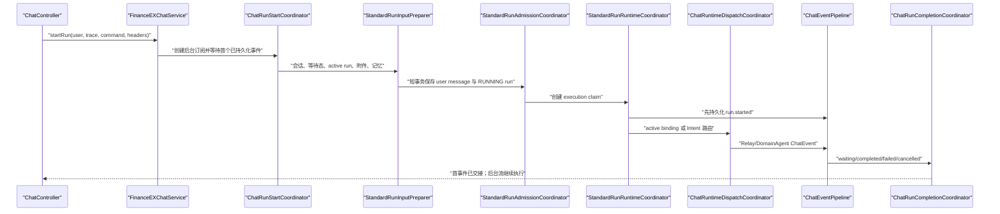

# FinanceEXChatService 开发导读

## 1. 文档用途

本文用于帮助新开发人员定位聊天主流程、状态机、记忆边界、下游 Runtime
及持久化事实。阅读顺序以一次普通 `POST /v1/chat/runs` 为主线。

本项目当前仍是单 Maven 模块。主编排已在现有包结构内拆为若干
Coordinator；HTTP、下游协议、事务入口和 Reactor 调度没有迁移。

## 2. 代码入口

一次普通请求建议按以下顺序阅读：

```text
interfaces.chat.ChatController#startRun
-> interfaces.chat.ChatRequestTranslator#toCommand
-> application.facade.FinanceChatFacade
-> application.service.chat.FinanceEXChatService
-> application.service.chat.FinanceChatOrchestrator#startRun
-> application.service.chat.ChatRunStartCoordinator#startStandard
-> application.service.chat.ChatRunExecutionCoordinator#execute
```

三个 Spring 组合根负责装配上述流程：

- `ChatFlowFoundationConfiguration`：记忆、路由上下文、准入和首事件。
- `ChatEventCoordinatorConfiguration`：事件落库、观察、发布和终态。
- `ChatRuntimeCoordinatorConfiguration`：Intent、Runtime、Interaction 和标准 run。

`FinanceEXChatService` 是稳定 Facade，不承载业务分支。新增流程分支时不要把
实现重新放回 Facade。

## 3. 普通请求执行顺序



关键顺序：

1. `StandardRunInputPreparer` 解析身份、会话和可信附件。
2. `RunMemoryContextAssembler` 在当前 user message 写库前加载 `MemoryContext`。
3. `StandardRunAdmissionCoordinator` 调用既有事务入口保存消息与 run。
4. `ChatRunExecutionCoordinator` 创建 execution claim。
5. `ChatEventPersistenceCoordinator` 持久化 `run.started`。
6. 只有 `run.started` 通过 execution guard 后才进入路由和外部 Runtime。
7. 普通 Runtime 事件经 `ChatEventPipeline` 组批、落库、观察和发布。
8. 终态仍由 `ChatRunTerminalCommitService` 的短事务提交。

不要在以上阶段之间新增 `subscribe()`、`block()`、`join()`、Scheduler 或数据库
查询。此顺序同时承担首事件交接、fencing 和“当前消息不进入短期记忆”的语义。

## 4. Coordinator 职责

| 组件 | 职责 | 不应承担的职责 |
| --- | --- | --- |
| `ChatRunStartCoordinator` | 后台订阅、首事件 handoff、首事件超时补偿 | 路由和数据库业务判断 |
| `InteractionContinuationCoordinator` | claim 前校验、附件准备、续接入口 | Runtime 类型判断 |
| `ChatRunExecutionCoordinator` | 标准 run 三阶段串联 | 具体 Intent/Runtime 协议 |
| `ChatRuntimeDispatchCoordinator` | active route、Intent 结果处理和 Runtime dispatch | 事件 SQL 和终态事务 |
| `DomainAgentRefusalCoordinator` | 结构化拒答、重意图和候选切换 | 普通 DomainAgent 响应归一化 |
| `ChatEventPipeline` | 事件身份校验、批量落库后的观察和发布 | 终态业务内容组装 |
| `ChatRunCompletionCoordinator` | waiting/completed/failed/cancelled 收口 | 首事件和路由 |
| `IntentClarificationContextAssembler` | 澄清 history、附件文本和最终折叠 query | Interaction 状态更新 |
| `RunMemoryContextAssembler` | 获取本轮不可变记忆快照 | RouteMemory 写入 |
| `AppliedRouteRecorder` | 已应用路由记录和同 run 内联 history | RuntimeBinding 创建 |

## 5. 三个状态机

### 5.1 ChatRun

```text
RUNNING
-> CANCELLING -> CANCELLED
-> COMPLETED
-> WAITING_USER
-> FAILED
```

- `RUNNING` 是可写业务事件的执行状态。
- `CANCELLING` 表示 stop 已取得处理权。
- `CANCELLED/COMPLETED/WAITING_USER/FAILED` 都是终态。
- 一个 run 必须且只能提交一个终态事件。

主要事实表：`fin_ex_chat_run_t`、`fin_ex_chat_run_execution_t`、
`fin_ex_chat_event_t`。

### 5.2 Interaction

```text
WAITING -> RESPONDING -> ANSWERED
WAITING/RESPONDING -> CANCELLED
WAITING -> EXPIRED
```

`INTENT_CLARIFICATION` 有一项特殊事实语义：澄清回答与 continuation run
原子 admission 后，Interaction 已是 `ANSWERED`，execution 初始化仍允许该
类型继续启动。其他 Interaction 的 execution 初始化仍要求 `RESPONDING`。

主要事实表：`fin_ex_chat_interaction_request_t`。

### 5.3 RuntimeBinding

```text
ACTIVE -> RESUMABLE
ACTIVE -> CANCELLED
RESUMABLE -> ACTIVE
```

- `ACTIVE`：当前会话可直接续接该 Runtime。
- `RESUMABLE`：不参与 active route，但 Relay 再次被选中时可恢复原 session。
- `CANCELLED`：不得被终态刷新重新激活。

主要事实表：`fin_ex_runtime_binding_t`；Redis 仅是可重建热缓存。

## 6. MemoryContext 与 RouteMemory

两者用途不同，不应合并。

### 6.1 MemoryContext

`MemoryApplicationService#loadForRun` 返回本轮不可变 `MemoryContext`：

- 短期消息上下文。
- 可选长期记忆。
- Intent 使用的 RouteMemory 快照。

调用位置在 admission 前，因此短期记忆不会包含本轮尚未持久化的 user message。普通续问沿当前 leaf
读取；显式父节点、编辑和重新生成则沿目标分支的写入点之前读取，不能回退到当前其他分支。
记忆全部关闭时，现有快速路径返回空上下文，不应新增数据库或长期记忆调用。

短期记忆由 `ShortTermMemoryContextAssembler` 在上层按消费方投影：Agent Runtime 使用独立的
user/assistant 轮次与 Token 预算；Intent 仅在拒答或用户纠偏链路使用独立的 user-only 窗口。
Redis 只是可关闭的紧凑热缓存，缓存容量不足以覆盖消费方窗口时必须回源数据库当前消息路径。
数据库记忆回源有独立的只读事务和 Statement 超时；读取失败时按短退避返回空上下文并继续 run，
不会把普通请求或 route-switch 卡在记忆加载阶段。消息事实写入仍遵循原有严格策略。
后续接入真实 GLM tokenizer 时替换 `MemoryTokenCounter`，不修改 Chat 编排或下游 adapter。

### 6.2 RouteMemory

`RouteMemoryApplicationService` 保存已应用的路由事实，用于后续 Intent history：

- 调用 Intent 前读取历史。
- RuntimeBinding 成功后、调用 Runtime 前记录 route。
- Intent clarification 追加 clarify 事实。
- 同一 run 重路由时由 `AppliedRouteRecorder` 追加内联 history，避免等待异步写回。
- 写入失败为 best-effort，只记录日志，不阻断 Runtime。

RouteMemory 不等于聊天消息历史，也不应写入 run metadata 或 RuntimeBinding。

## 7. Intent、Relay 与 DomainAgent 边界

### Intent

- 入口：`RouteSignalApplicationService`。
- 编排：`ChatRuntimeDispatchCoordinator`。
- `CLARIFY` 创建 Intent Interaction。
- `ROUTE_SINGLE` 绑定 DomainAgent。
- `NO_MATCH/ROUTE_MULTI` 进入 Relay。
- Intent progress 也是 ChatEvent，必须先落库再发布。

### DomainAgent

- `RuntimeBinding.provider=domain-agent`。
- 显式 `targetType=DOMAIN_AGENT` 的直连优先级最高。
- 结构化 `agent.refusal` 由 `DomainAgentRefusalCoordinator` 处理。
- 自动来源可以直接重路由；受保护来源按配置决定是否创建切换确认。
- 拒答过程与新 Agent 输出复用当前业务 assistant，parts 保留完整过程。

### Relay

- `RuntimeBinding.provider=agent-runtime`。
- 通过 `AgentRuntimeExecutor` 和 Relay WebSocket adapter 调用。
- 首次进入使用 `NEW`；已有可恢复 Relay binding 时使用 `RESUME`。
- Relay `RESUME` 是下一个 run 恢复下游会话，不是在途 run 跨实例接管。

## 8. 事件与终态

普通 Relay/DomainAgent 事件的主路径：

```text
下游 frame
-> Runtime normalizer
-> ChatEvent
-> ChatEventPipeline
-> execution guard
-> fin_ex_chat_event_t
-> assistant/run/binding observation
-> Redis/local live publish
```

普通事件可按条数、等待时间和字节数批量落库。控制事件、拒答和终态会先刷新
待处理批次，再立即提交。数据库是 Event Resume 的事实源；Redis Pub/Sub
不保存历史。

终态路径由 `ChatRunCompletionCoordinator` 和
`ChatRunTerminalCommitService` 共同完成，事务内保存：

- 终态 ChatEvent。
- assistant message 和 parts。
- Interaction 状态。
- run/execution 终态。
- 会话消息水位。

## 9. 常见需求定位

| 需求 | 首选修改位置 |
| --- | --- |
| 调整 HTTP 入参或响应 | `interfaces.chat.dto`、`ChatRequestTranslator`、Controller |
| 调整 Intent 请求/history | `RouteSignalApplicationService`、RouteMemory、澄清 assembler |
| 调整路由结果到 Runtime 的选择 | `ChatRuntimeDispatchCoordinator`、`RouteResolutionCoordinator` |
| 调整 DomainAgent 拒答 | `DomainAgentRefusalCoordinator` 及 refusal mapper/factory |
| 调整 Relay wire 协议 | `infrastructure.runtime.relay` |
| 调整 DomainAgent frame 映射 | `infrastructure.runtime.domainagent` |
| 调整事件批量、顺序或发布 | `ChatEventPipeline`、`ChatEventPersistenceCoordinator` |
| 调整终态消息和 parts | `ChatRunCompletionCoordinator`、`AssistantAssembly` |
| 调整事务或锁 | 原 `*CommitService`/Repository；不得放进 Coordinator |
| 调整短期/长期记忆 | `MemoryApplicationService` |
| 调整 Intent route history | `RouteMemoryApplicationService`、`AppliedRouteRecorder` |
| 调整 active binding | `RuntimeBindingApplicationService` |

## 10. 调试入口

建议先取得 `traceId/runId/sessionId`，再按以下顺序检查：

1. `fin_ex_chat_run_t`：run 状态、provider、first/last seq。
2. `fin_ex_chat_run_execution_t`：owner、fencing token、lease 和 execution 状态。
3. `fin_ex_chat_event_t`：事件顺序和最终事实。
4. `fin_ex_runtime_binding_t`：provider、target、routeSource 和状态。
5. `fin_ex_chat_interaction_request_t`：等待态及 continuation run。
6. `fin_ex_chat_message_t`、`fin_ex_chat_message_part_t`：历史消息终态装配。
7. `fin_ex_route_memory_t`：下一轮 Intent 可见 history。

结构化日志优先检索字段：

```text
errorCode reasonCode traceId runId sessionId operation origin retryable
```

常用 `operation`：

```text
chat-run.background
interaction.background
chat-event.identity-guard
chat-event.post-processing
chat-event.batch-post-processing
chat-run.terminal-commit
chat-run.bind-resolved-route
route-memory.schedule
```

## 11. 测试导航

聊天主流程特征测试按工作流分组：

- `ChatRunStartFlowTest`
- `ChatInteractionFlowTest`
- `ChatIntentFlowTest`
- `ChatDomainAgentRefusalFlowTest`
- `ChatEventFlowTest`
- `ChatRuntimeDispatchFlowTest`
- `ChatTerminalFlowTest`

共享内存仓储和测试装配位于：

- `ChatFlowTestSupport`
- `ChatFlowTestFixture`
- `ChatFlowTestAssembler`

Spring Bean 图由 `ChatCoordinatorConfigurationTest` 验证。主流程行为由上述分组
测试覆盖，代码复杂度通过代码评审控制，不在 Maven 构建中增加额外规范门禁。

本地验证使用 JDK 21：

```bash
mvn test
mvn verify
mvn package -DskipTests
node --check local-test-frontend/public/app.js
git diff --check
```
