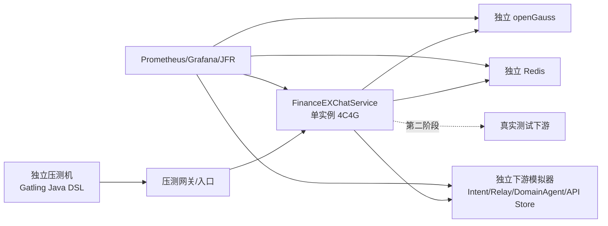

# FinanceEXChatService 单实例压测指导

## 1. 文档目的

本文用于指导测试、开发、数据库和运维人员对 FinanceEXChatService 进行单实例容量测试，最终形成可复现、
可审计的单实例生产配置和容量结论。目标实例固定为 `4 CPU / 4 GiB` Docker 容器，使用 JDK 21。

本文回答以下问题：

- 单实例能够稳定承载多少个同时运行的流式任务。
- 在不同任务时长下，每秒和每分钟能够启动多少个任务。
- 1 MB、10 MB、50 MB 文档分别能够承载多少并发上传和多大吞吐。
- 会话分页、历史消息、消息树、流状态和文档查询能够承载多少 QPS。
- 能够维护多少空闲 WebSocket、活跃订阅和并发 Event Resume。
- 哪组 JVM、数据库连接池、事件线程、批次和业务限流配置最适合 4C4G 实例。

本文不预设最终容量数值。容量只能由指定版本、指定数据规模和指定下游条件下的真实测试结果确定。

## 2. 适用范围与安全边界

### 2.1 适用范围

压测覆盖以下生产链路：

- `POST /v1/chat/runs` 任务准入、意图路由、Relay 和 DomainAgent 流式输出。
- ChatEvent 单条或批量落库、Redis Pub/Sub、WebSocket 推送和 Event Resume。
- run 终态、assistant 消息和 message parts 持久化。
- 会话、消息、消息树、流状态和文档查询。
- API Store multipart 文档上传。
- stop、Interaction continuation、断线恢复和 watchdog 收口。

### 2.2 禁止事项

- 禁止在生产环境执行极限、突发、故障注入和大文件压测。
- 禁止在共享 Redis 上执行 `FLUSHDB` 或无环境前缀的批量删除。
- 禁止使用真实用户问题、真实文档或生产 Cookie。
- 禁止在没有下游负责人授权和限额确认时压测真实下游。
- 禁止把下游限流、网关限流或固定用户限流导致的拒绝误判为 ChatService 容量。
- 禁止只根据“容器未重启”判定测试通过。

## 3. 容量术语和计算规则

| 术语 | 定义 |
|---|---|
| 活跃任务数 | 同时处于 `RUNNING` 或 `CANCELLING` 且仍占用执行资源的 run 数量 |
| 启动吞吐 | 单位时间内成功完成 `/runs` 准入并得到 `run.started` 的任务数量 |
| 稳定容量 | 连续 30 分钟且重复 3 次均满足全部业务和资源阈值的最高档位 |
| 失败拐点 | 第一个持续违反错误率、延迟、资源、队列或一致性阈值的档位 |
| 观察硬上限 | 失败拐点前最后一个能够运行的档位，只用于应急分析 |
| 推荐生产上限 | 用于生产限流和扩容计算的安全容量，不等于观察硬上限 |

推荐生产上限统一按以下公式计算：

```text
recommended = min(stable_capacity * 70%, first_failed_level * 50%)
```

结果向下取 4 的倍数。小于 4 的结果按实际测试值处理，不向上取整。

任务启动吞吐使用 Little's Law 换算：

```text
starts_per_second = active_runs / average_run_duration_seconds
starts_per_minute = starts_per_second * 60
```

示例：稳定活跃任务数为 32，平均任务时长为 60 秒，则理论稳定启动吞吐约为 32 次/分钟。该换算必须再由
开放模型的请求速率测试验证，不能替代真实测试。

## 4. 当前实现基线

以下默认值来自 `src/main/resources/application.yml`。测试开始前必须记录压测环境实际生效值，环境变量覆盖后
不得继续使用本表作为事实值。

| 能力 | 配置键 | 当前默认值 |
|---|---|---:|
| Tomcat 最大连接 | `server.tomcat.max-connections` | 8192 |
| Tomcat 最大线程 | `server.tomcat.threads.max` | 200 |
| Hikari 最大连接 | `spring.datasource.hikari.maximum-pool-size` | 10 |
| Hikari连接获取超时 | `spring.datasource.hikari.connection-timeout` | 500 ms |
| 事件 IO 最大线程 | `financeex.chat-stream.event-io-executor-max-size` | 16 |
| 事件 IO 队列 | `financeex.chat-stream.event-io-executor-queue-capacity` | 10000 |
| 事件批次条数 | `financeex.chat-stream.event-batch-max-size` | 16 |
| 事件批次等待 | `financeex.chat-stream.event-batch-max-wait` | 20 ms |
| 事件批次字节 | `financeex.chat-stream.event-batch-max-bytes` | 256 KB |
| Relay 并发许可 | `financeex.resource-isolation.agent-runtime-max-concurrent` | 64 |
| DomainAgent 并发许可 | `financeex.resource-isolation.domain-agent-max-concurrent` | 64 |
| 文档存储并发许可 | `financeex.resource-isolation.document-storage-max-concurrent` | 32 |
| 单租户活跃 run | `financeex.run-admission.max-concurrent-runs-per-tenant` | 200 |
| 单用户每分钟 run | `financeex.run-admission.max-runs-per-user-per-minute` | 60 |
| 单用户 WebSocket | `financeex.websocket.max-connections-per-user` | 8 |
| 单连接出站队列 | `financeex.websocket.outbound-queue-size` | 256 |
| Servlet WS 队列字节 | `financeex.websocket.servlet-send-queue-max-bytes` | 2 MB |
| live buffer | `financeex.websocket.live-buffer-capacity` | 512 |
| 文档请求上限 | `spring.servlet.multipart.max-file-size` | 50 MB |
| 业务文档上限 | `financeex.document.max-upload-size-bytes` | 52428800 |

容量分析必须考虑以下实现事实：

1. Relay 和 DomainAgent 使用两套独立 semaphore，配置 `64 + 64` 理论上允许 128 个 Runtime 调用，不能把
   单个 `64` 解释为实例总上限。
2. 当前没有跨租户的实例级统一 run 限制。单租户 200 不能保护多租户合计容量。
3. 流式事件先写入 `fin_ex_chat_event_t`，成功后才进入状态观察、Redis 和前端发布。
4. Relay 和 DomainAgent 普通事件按同一 run 组批；控制事件、拒答、Interaction 和终态立即写入。
5. assistant 内容和用户可见 parts 在 run 期间保存在内存，终态时再保存完整 assistant。
6. 当前 message parts 在终态事务内逐条插入。超长任务可能长期占用数据库连接并触发终态事务超时。
7. API Store 上传会把整个文件读取为 `byte[]` 后再构造下游 multipart 请求，大文件并发必须单独测量。
8. WebSocket 空闲连接容量与活跃流式订阅容量是不同指标，不能互相替代。

### 4.1 容量发现与保护性限流

容量发现阶段需要区分“应用达到资源拐点”和“请求被当前配置主动拒绝”：

- Relay-only 测试超过 64 并发前，临时把 `agent-runtime-max-concurrent` 提升到本轮最大目标值。
- DomainAgent-only 测试超过 64 并发前，临时把 `domain-agent-max-concurrent` 提升到本轮最大目标值。
- 50%/50% 混合测试时，两类许可分别覆盖各自计划并发。
- `max-concurrent-runs-per-tenant` 必须不小于本轮总并发目标。
- 使用足够多的用户，避免单用户每分钟 60 次限制先触发。

临时提高限制只用于隔离压测环境，并且必须逐档升压和启用自动停止。容量发现结束后，不得把临时高值直接带入生产；
生产值必须按照第 19.4 节重新计算。由 `RUN_RATE_LIMITED`、Runtime permit 或配置上限产生的预期拒绝只说明保护配置生效，
不能作为实例失败拐点。

## 5. 角色和职责

| 角色 | 职责 |
|---|---|
| 压测负责人 | 锁定版本、环境、场景和停止条件，批准每次升档 |
| 测试人员 | 执行 Gatling 场景、保存原始报告、核对事件完整性 |
| 开发人员 | 提供下游模拟器、解释应用指标和异常日志，不在测试中临时修改逻辑 |
| DBA | 准备快照、统计信息、慢 SQL、锁和数据库资源报告 |
| Redis 运维 | 提供实例指标，确认压测 key 前缀和清理范围 |
| 下游负责人 | 确认真实下游配额、测试账号、停止联系人和压测时间窗 |
| 运维人员 | 固定容器资源、采集 JVM/容器指标、执行重启和故障注入 |

任何升档均由压测负责人确认。触发自动停止条件时，测试人员可以直接停止，无需等待再次批准。

## 6. 测试拓扑



压测机、应用、数据库、Redis 和模拟器不得共享 CPU 或内存。第一阶段使用模拟器测量 ChatService 和事实存储链路；
第二阶段使用真实测试下游验证端到端容量。两阶段结果必须分别记录。

## 7. 环境准备

### 7.1 开始前检查表

- [ ] 应用提交号和镜像 digest 已锁定。
- [ ] 应用只有一个实例。
- [ ] 容器 CPU limit 为 4，memory limit 为 4 GiB。
- [ ] 未配置 swap，节点不存在明显 CPU overcommit。
- [ ] JDK 版本为 21。
- [ ] JVM 初始参数为 `-Xms2g -Xmx2g`。
- [ ] openGauss、Redis 和网络拓扑与生产一致。
- [ ] 数据库 schema 来自当前 `db/init-20260718.sql`。
- [ ] 数据快照已生成，能够在每轮配置测试前恢复。
- [ ] Redis 使用独立 database 或独立环境前缀。
- [ ] 压测身份能够生成不同 tenant/user。
- [ ] Intent、Relay、DomainAgent 和 API Store 模拟器已通过单独容量验证。
- [ ] 企业监控或压测专用指标出口已经启用。
- [ ] 日志、Gatling、Prometheus、数据库和 Redis 时间已同步。
- [ ] 真实下游压测已获得书面授权。
- [ ] 停止联系人和恢复方案已确认。

### 7.2 容器资源核对

Docker 环境示例：

```bash
APP_CONTAINER=financeex-chat

docker inspect "$APP_CONTAINER" \
  --format 'cpuNano={{.HostConfig.NanoCpus}} memory={{.HostConfig.Memory}} swap={{.HostConfig.MemorySwap}}'
docker stats --no-stream "$APP_CONTAINER"
```

期望值：

```text
NanoCpus = 4000000000
Memory   = 4294967296
MemorySwap 与 Memory 相同，或由平台明确禁用 swap
```

Kubernetes 环境示例：

```bash
kubectl -n "$NAMESPACE" get pod "$POD" -o jsonpath='{.spec.containers[0].resources}'
kubectl -n "$NAMESPACE" top pod "$POD"
```

### 7.3 JVM 核对

```bash
docker exec "$APP_CONTAINER" sh -c 'java -version'
docker exec "$APP_CONTAINER" sh -c 'jcmd 1 VM.flags'
docker exec "$APP_CONTAINER" sh -c 'jcmd 1 GC.heap_info'
docker exec "$APP_CONTAINER" sh -c 'jcmd 1 VM.system_properties | grep -E "java.version|java.vm.name"'
```

若 Java 进程 PID 不是 1，先在容器内使用 `jcmd -l` 获取 PID。最终报告必须保存实际 VM flags，不只保存部署文件。

### 7.4 应用健康核对

```bash
BASE_URL=https://performance.example.com
curl -fsS "$BASE_URL/actuator/health"
```

当前默认配置关闭数据库和 Redis health indicator，`UP` 不能证明数据库和 Redis 可用。开始压测前还必须分别执行
数据库连接、Redis `PING`、模拟器健康检查和一个完整的 run smoke test。

## 8. 压测身份

当前 `ApplicationAuthContextProvider` 使用固定身份。直接使用该实现压测时，所有请求都会被识别为同一用户，随后受到：

```text
60 run / user / minute
8 WebSocket / user
```

因此，实例容量压测必须满足以下任一条件：

1. 通过企业测试网关使用足量真实测试账号。
2. 在隔离的 `performance` profile 中启用压测身份适配器。

压测身份适配器建议只接受以下可信请求头：

```text
X-Perf-Tenant-Id
X-Perf-User-Id
X-Perf-User-Account
X-Perf-Auth-Secret
```

约束如下：

- 只有 `performance` profile 可以注册该实现。
- 必须校验 `X-Perf-Auth-Secret`，入口只能由压测网络访问。
- HTTP、SSE 和 WebSocket Upgrade 必须解析为同一个用户。
- 后台 run 只使用入口固化的 `UserContext`，不得在异步线程重新读取请求头。
- 生产环境不得配置压测共享密钥，也不得接受压测身份头。

Gatling feeder 至少准备 1000 组不同用户，用户编号与会话、文档数据保持一一对应。

## 9. 监控与原始数据

### 9.1 指标出口前提

项目当前包含 Spring Boot Actuator，但默认配置没有开放 Prometheus 指标，也没有在本文中假定某个企业指标名称。
正式压测前必须通过企业监控 Agent、JMX Exporter，或仅压测环境启用的 Micrometer Prometheus registry 提供指标。
指标入口只能在内网开放。

采样周期固定为 5 秒。原始时序数据至少保留到容量报告批准完成。

### 9.2 必采指标

| 层级 | 指标 |
|---|---|
| 容器 | CPU usage、CPU throttling、RSS、working set、网络收发、OOM、重启次数 |
| JVM | Heap/Old Gen、after-GC、GC pause、Full GC、Direct Memory、线程、分配速率 |
| Tomcat | HTTP 请求、活动连接、busy threads、WebSocket 连接 |
| Hikari | active、idle、pending、acquire duration、timeout |
| ChatService | active run、Runtime permits、批次条数/字节/等待、事件 IO 队列 |
| 实时通道 | Redis 发布队列、topic queue、WS 发送队列、live buffer overflow、RECOVER_REQUIRED |
| openGauss | CPU、连接、TPS、慢 SQL、锁等待、死锁、WAL、临时文件、缓存命中率 |
| Redis | ops/s、内存、网络、Pub/Sub、blocked clients、command latency |
| 下游 | Intent/Relay/DomainAgent/API Store 延迟、连接、错误率和吞吐 |

任何指标都不得使用 `runId`、`sessionId`、`userId` 或 documentId 作为标签。

### 9.3 JFR 采集

每个拐点档位至少采集一次 10 分钟 JFR：

```bash
docker exec "$APP_CONTAINER" jcmd 1 JFR.start \
  name=capacity settings=profile duration=10m filename=/tmp/capacity.jfr
docker cp "$APP_CONTAINER:/tmp/capacity.jfr" "./artifacts/${RUN_ID}/capacity.jfr"
```

JFR 重点检查：

- CPU 热点和 JSON 序列化开销。
- `byte[]`、Map、parts 和 WebSocket envelope 分配。
- JDBC 阻塞和连接获取等待。
- Reactor boundedElastic、事件 IO 和 WebSocket send executor 状态。
- monitor contention、线程 park 和虚拟线程 pinning。

### 9.4 Prometheus 查询参考

以下为常见 Micrometer/Kubernetes 指标示例。实际环境需替换 namespace、pod、container、job 等标签；企业监控改名后，
在测试记录中保存最终查询表达式。

容器 CPU 核数：

```promql
sum(rate(container_cpu_usage_seconds_total{namespace="$namespace",pod="$pod",container="$container"}[1m]))
```

CPU throttling 比例：

```promql
sum(rate(container_cpu_cfs_throttled_periods_total{namespace="$namespace",pod="$pod",container="$container"}[1m]))
/
sum(rate(container_cpu_cfs_periods_total{namespace="$namespace",pod="$pod",container="$container"}[1m]))
```

容器 working set：

```promql
container_memory_working_set_bytes{namespace="$namespace",pod="$pod",container="$container"}
```

JVM Heap：

```promql
sum(jvm_memory_used_bytes{application="FinanceEXChatService",area="heap"})
sum(jvm_memory_max_bytes{application="FinanceEXChatService",area="heap"})
```

GC pause p99，前提是指标出口启用了 histogram bucket：

```promql
histogram_quantile(
  0.99,
  sum by (le) (rate(jvm_gc_pause_seconds_bucket{application="FinanceEXChatService"}[5m]))
)
```

Hikari 连接：

```promql
hikaricp_connections_active{application="FinanceEXChatService"}
hikaricp_connections_pending{application="FinanceEXChatService"}
hikaricp_connections_max{application="FinanceEXChatService"}
```

HTTP p95，前提是 HTTP server timer 启用了 histogram bucket：

```promql
histogram_quantile(
  0.95,
  sum by (le, uri, method) (
    rate(http_server_requests_seconds_bucket{application="FinanceEXChatService"}[5m])
  )
)
```

如果 event IO queue、Redis publish queue、WebSocket outbound queue 或 Runtime permit 没有可用指标，必须通过企业 Agent
或压测专用低基数 Gauge 补齐后再批准容量。仅依靠 CPU 和 Heap 无法判断这些有界队列是否接近溢出。

### 9.5 数据库和 Redis 快照

每个档位开始、峰值和冷却后各保存一次数据库活动快照。openGauss 版本差异可能导致系统视图字段不同，执行前由 DBA
确认等价视图。

```sql
SELECT state, COUNT(1)
FROM pg_stat_activity
WHERE datname = current_database()
GROUP BY state
ORDER BY state;

SELECT pid, state, wait_event_type, wait_event, query_start
FROM pg_stat_activity
WHERE datname = current_database()
  AND state <> 'idle'
ORDER BY query_start;

SELECT datname, xact_commit, xact_rollback, deadlocks, temp_files, temp_bytes
FROM pg_stat_database
WHERE datname = current_database();
```

若启用了 `pg_stat_statements` 或 openGauss 对应性能视图，按总耗时、平均耗时、调用次数、共享块读取和临时块写入分别
导出 Top 20 SQL。最终报告中的慢 SQL 必须保留归一化 SQL、执行计划和数据规模。

Redis 每个档位保存：

```bash
redis-cli INFO server
redis-cli INFO clients
redis-cli INFO memory
redis-cli INFO stats
redis-cli INFO commandstats
redis-cli INFO keyspace
redis-cli LATENCY LATEST
```

Redis Cluster 需要在所有主节点采集。认证参数通过安全环境变量或企业工具传入，不写入文档、命令历史和报告。

## 10. 测试数据准备

### 10.1 数据分布

固定生成 4 个租户和 1000 个用户：

| 用户比例 | 每用户会话数 | 用途 |
|---:|---:|---|
| 80% | 20 | 普通用户 |
| 19% | 200 | 高频用户 |
| 1% | 5000 | 深分页热点用户 |

数据要求：

- 普通会话包含 20–100 条 user/assistant 消息。
- 热点会话包含 500、1000、2000 层 active path。
- 普通 assistant 包含 8–20 个 parts。
- 压力 assistant 分别包含 200、1000、3000 个 parts。
- 每个用户约 20 条文档记录。
- `app_id` 均匀分布在 4 个值，并保留 null 分组。
- 构造 ACTIVE、ARCHIVED、DELETED 会话。
- run/event/message/part 时间和 sequence 关系必须合法。
- 数据不得使用真实用户信息和真实文件内容。

### 10.2 导入后核对

以下 SQL 仅允许在压测 schema 执行：

```sql
SELECT COUNT(1) AS sessions FROM fin_ex_chat_session_t;
SELECT COUNT(1) AS messages FROM fin_ex_chat_message_t;
SELECT COUNT(1) AS parts FROM fin_ex_chat_message_part_t;
SELECT COUNT(1) AS attachments FROM fin_ex_chat_message_attachment_t;
SELECT COUNT(1) AS runs FROM fin_ex_chat_run_t;
SELECT COUNT(1) AS events FROM fin_ex_chat_event_t;
SELECT COUNT(1) AS documents FROM fin_ex_uploaded_document_t;
SELECT status, COUNT(1) FROM fin_ex_chat_session_t GROUP BY status ORDER BY status;
SELECT app_id, COUNT(1) FROM fin_ex_chat_session_t GROUP BY app_id ORDER BY app_id;
```

生成统计信息：

```sql
ANALYZE fin_ex_chat_session_t;
ANALYZE fin_ex_chat_message_t;
ANALYZE fin_ex_chat_message_part_t;
ANALYZE fin_ex_chat_run_t;
ANALYZE fin_ex_chat_run_execution_t;
ANALYZE fin_ex_chat_event_t;
ANALYZE fin_ex_uploaded_document_t;
ANALYZE fin_ex_runtime_binding_t;
```

保存各表行数、数据库大小、索引大小和统计信息更新时间。随后创建只读基准快照。每组配置测试前必须恢复该快照，
避免前一轮产生的事件和消息改变下一轮查询成本。

## 11. 下游模拟器契约

### 11.1 Intent 模拟器

必须支持：

- `ROUTE_SINGLE` 到固定 DomainAgent。
- `ROUTE_MULTI` 并返回两个候选意图。
- `NO_MATCH`，随后进入 Relay。
- `CLARIFY` 和一次 continuation。
- 50 ms、500 ms、5 s 响应延迟。
- 连接失败、HTTP 5xx、非法 JSON 和空响应。

同一输入必须产生确定结果，避免压测结果因随机路由变化不可复现。

### 11.2 Relay WebSocket 模拟器

必须实现当前协议中的：

- WebSocket Upgrade。
- `config(NEW|RESUME)`。
- `session-ready`。
- `user-message`。
- 可配置速率的业务事件。
- heartbeat 和 heartbeat-response。
- `stop_all_agents` 和 paused 确认。
- 正常完成、等待用户、连接提前关闭、Upgrade 超时和 config 超时。

模拟器必须记录每个连接收到的 config、session mode、run、业务帧数量和关闭原因。

### 11.3 DomainAgent 模拟器

必须支持：

- message delta 和 snapshot。
- thinking、progress、tool、card、reference。
- 小型和接近 256 KB 上限的结构化响应。
- `agent.refusal + FN-EX-CAHT-BIZ-DAG-001`。
- HTTP 4xx/5xx、流中断、无终态关闭和 120 秒超时。

### 11.4 API Store 模拟器

必须实际读取 multipart body，不得在请求头到达后立即返回。响应至少覆盖：

- `docId` EDM 响应。
- `url` S3 响应。
- 同时包含 `docId/url`。
- 完整 `providerDocument` 字段。
- 100 ms、500 ms、2 s、30 s 延迟。
- HTTP 5xx、非法 JSON 和缺失 docId/url。

### 11.5 模拟器容量门禁

在正式应用压测前，单独向模拟器施加目标上限 2 倍的流量。模拟器必须满足：

```text
CPU < 50%
内存无持续增长
错误率 = 0
p99 延迟不超过设定延迟 + 20%
连接和发送队列无持续积压
```

否则本轮只能判定模拟器容量，不能判定 ChatService 容量。

## 12. Gatling 场景约定

### 12.1 工程约定

压测脚本使用独立 Gatling Java DSL 工程，至少包含：

```text
performance-tests/
├── src/test/java/.../simulation
├── src/test/resources/data
├── src/test/resources/bodies
├── conf
└── README.md
```

脚本参数必须从环境变量或 JVM property 读取，不在代码中硬编码服务地址、密码、Cookie 和共享密钥。

### 12.2 普通 run 流程

每个虚拟用户执行：

```text
准备独立用户和 session
-> 建立 WebSocket
-> connect
-> POST /v1/chat/runs
-> 保存 runId/sessionId/firstSeq/streamTopicId
-> subscribe(topicId, afterSeq=firstSeq)
-> 消费并校验事件
-> 等待唯一 run 终态
-> unsubscribe
```

WebSocket 控制帧示例：

```json
{"id":"connect-1","type":"connect","presence":"foreground"}
```

```json
{
  "id": "subscribe-1",
  "type": "subscribe",
  "topicId": "chat-run-run_xxx",
  "afterSeq": 12345
}
```

`firstSeq` 已由 `/runs` 响应确认，正常实时场景使用 `afterSeq=firstSeq`。完整补发验证场景使用
`afterSeq=firstSeq-1`。客户端不能用 `seq + 1` 判断丢包，因为 sequence 是全局单调且允许跨 run 不连续。

### 12.3 Event Resume 流程

活动 run 跨浏览器恢复使用：

```text
GET /v1/chat/sessions/{sessionId}/stream-status
-> 读取 activeRunId 和 activeRunFirstSeq
-> GET /v1/chat/runs/{activeRunId}/events/resume
   ?afterSeq={max(0, activeRunFirstSeq - 1)}
-> 数据库补发
-> live tail
-> done
```

测试客户端按 `(sessionId, sequence)` 去重，只在事件已经成功解析和处理后推进本地水位。heartbeat 和 done 不推进
ChatEvent sequence。

### 12.4 事件采集文件

每轮测试至少输出：

```text
runId, sessionId, eventId, sequence, eventType, receivedAt, source(ws|sse)
```

测试结束后使用该文件与 `fin_ex_chat_event_t` 精确比对，不能只比较事件数量。

### 12.5 Gatling 执行命令

建议所有 Simulation 接受统一参数：

```text
baseUrl、wsUrl、users、concurrency、duration、eventProfile、routeProfile、artifactDir
```

执行示例：

```bash
TEST_ID=normal-mixed-c32-r1

mvn -f performance-tests/pom.xml gatling:test \
  -Dgatling.simulationClass=com.huawei.it.ex.perf.ChatStreamingSimulation \
  -Dperf.baseUrl="$BASE_URL" \
  -Dperf.wsUrl="$WS_URL" \
  -Dperf.concurrency=32 \
  -Dperf.duration=15m \
  -Dperf.eventProfile=normal \
  -Dperf.routeProfile=mixed \
  -Dperf.artifactDir="artifacts/$TEST_ID"
```

上传和查询使用独立 Simulation，不在单接口容量测试中混入其他请求。Gatling 进程必须记录自身 CPU、内存、网络和连接数；
压测机资源达到 70% 时，该档结果无效。

### 12.6 延迟计算口径

| 指标 | 开始点 | 结束点 |
|---|---|---|
| `/runs` 准入延迟 | 客户端发送 HTTP 请求 | 收到包含 `firstSeq` 的完整响应 |
| 事件实时延迟 | 事件携带的服务端时间 | 客户端完成对应 ChatEvent 解析 |
| Resume 补发时间 | 发出 Resume 请求 | 已处理目标 backlog 的最后一条事件 |
| run 完整时长 | 发出 `/runs` 请求 | 客户端收到唯一 run 终态 |
| 上传时长 | 开始发送 multipart body | 收到完整文档响应 |
| 查询时长 | 开始发送请求 | 收到并解析完整响应体 |

客户端和服务端必须使用已同步的时钟。若无法保证跨节点时钟误差小于 10 ms，事件实时延迟改用模拟器发送时间、数据库
持久化时间和客户端接收时间的分段指标，不得直接相减得出结论。

## 13. 通用执行流程

每个测试档位严格执行：

```text
1. 恢复数据库基准快照
2. 清理当前压测环境 Redis key
3. 使用目标配置重启单实例
4. 验证配置、JVM、数据库、Redis和下游
5. 执行一个完整 smoke run
6. 预热 5 分钟
7. 执行正式负载
8. 冷却 5 分钟
9. 导出 Gatling、Prometheus、JFR、日志、数据库和 Redis 数据
10. 执行一致性 SQL 和客户端事件比对
11. 填写本档结果并判定通过/失败
```

保存实际生效配置时必须脱敏数据库密码、Redis 密码、Cookie、Token、AK/SK 和企业鉴权信息。建议记录所有非敏感环境变量、
Spring profile、JVM flags 和配置中心版本，并在报告中说明脱敏规则。

Redis 清理只能针对独立压测前缀。示例：

```bash
REDIS_PATTERN='fin_ex:performance:*'
redis-cli --scan --pattern "$REDIS_PATTERN" \
  | xargs -r -n 100 redis-cli UNLINK
```

如果 Redis 需要认证或使用 Cluster，必须使用企业提供的安全命令和正确节点；不得把密码写入 shell history。

日志导出示例：

```bash
mkdir -p "artifacts/${RUN_ID}"
docker logs --since 30m "$APP_CONTAINER" > "artifacts/${RUN_ID}/application.log" 2>&1
docker stats --no-stream "$APP_CONTAINER" > "artifacts/${RUN_ID}/docker-stats.txt"
```

## 14. 流式任务容量测试

### 14.1 事件模型

| 模型 | 任务时长 | 事件速率 | 普通 payload | 大 payload |
|---|---:|---:|---:|---:|
| Light | 30 s | 3/s | 1 KB | 无 |
| Normal | 60 s | 10/s | 2 KB | 10% 为 16 KB tool/card |
| Heavy | 300 s | 30/s | 4 KB | 5% 为 64 KB tool/card |

建议事件组成：

```text
message.delta       55%
runtime.thinking    15%
runtime.progress    10%
runtime.tool         7%
runtime.metadata     5%
runtime.reference    3%
message.snapshot     3%
runtime.card         2%
```

每个 run 最后发送明确 `message.completed` 和 run 终态。Heavy 模型用于暴露 parts 内存和终态逐条写入压力，
不能用 Light 结果代替。

### 14.2 路由矩阵

每种事件模型分别执行：

1. Relay-only。
2. DomainAgent-only。
3. Relay 50% + DomainAgent 50%。
4. Intent 50 ms。
5. Intent 500 ms。
6. 10% Intent 5 s，其余 50 ms。

功能混入比例：

```text
5%  run 随机 stop
10% WebSocket 中途断开并执行 run Resume
5%  进入 Interaction 并 continuation
20% 复用同一 session，验证 binding 和 Relay RESUME
```

### 14.3 并发阶梯

```text
8 -> 16 -> 24 -> 32 -> 40 -> 48 -> 64 -> 80 -> 96 -> 128
```

每档执行：

```text
预热 5 分钟
测量 15 分钟
冷却 5 分钟
```

达到失败拐点后停止继续升档。拐点前后各一个档位重复 3 次。最高合格档位额外保持 30 分钟，确认队列、Heap、
数据库连接和终态延迟没有持续增长。

### 14.4 启动速率验证

闭合并发模型得到活跃任务容量后，使用开放模型验证启动吞吐。按预计吞吐的：

```text
50% -> 70% -> 100% -> 120%
```

每档保持 15 分钟。每个虚拟用户必须使用独立 session，避免 active-run 唯一约束把同 session 冲突误判成容量不足。

## 15. WebSocket 和 Event Resume 测试

### 15.1 空闲连接

以 50 connections/s 的速率建立连接：

```text
100 -> 500 -> 1000 -> 2000 -> 4000 -> 6000
```

每档保持 15 分钟。分别测试每连接 1、4、8 个订阅。每个用户最多创建 8 个连接；测实例连接容量时优先使用
独立用户，避免先触发单用户限制。

记录：

- Upgrade 成功率和 p95/p99。
- 当前连接数、Heap、RSS、线程和文件描述符。
- idle heartbeat 流量。
- 连接关闭后资源回收时间。

### 15.2 活跃订阅和慢客户端

在 Normal 流式模型下测试：

- 正常消费。
- 每帧延迟 100 ms。
- 每帧延迟 500 ms。
- 每帧延迟 2 s。

验证单连接 256 条/2 MB 发送队列、live buffer 512 条和 `RECOVER_REQUIRED`。慢客户端被关闭属于保护行为，
但不得影响其他正常连接或导致 run 失败。

### 15.3 Resume backlog

为 run 预先生成以下待补事件数量：

```text
10、100、1000、5000
```

并发 SSE 阶梯：

```text
10 -> 25 -> 50 -> 100 -> 200
```

验证：

- DB catch-up 与 live tail 之间没有事件空窗。
- 客户端去重后没有重复事件。
- 补发完成后仍能收到新实时事件和唯一 done。
- `afterSeq=N` 只返回 `sequence > N` 的当前 run 事件。
- Redis Pub/Sub 不保存历史；历史全部来自事件表。

## 16. 文档上传容量测试

### 16.1 文件矩阵

| 文件大小 | 并发档位 | 单档时长 |
|---:|---|---:|
| 1 MB | 1、4、8、16、32 | 10 min |
| 10 MB | 1、2、4、8、16 | 10 min |
| 50 MB | 1、2、4、8、12 | 10 min |

文件内容使用不可压缩随机数据，避免网关压缩或存储优化造成虚高吞吐。每次请求使用不同文件名和 document ID。

### 16.2 下游延迟矩阵

分别使用 API Store：

```text
100 ms、500 ms、2 s
```

30 秒延迟只用于超时和降级测试，不计入正常容量。

### 16.3 通过条件

- 技术错误率不超过 0.1%。
- 上传吞吐在后半段没有持续下降。
- 无 OOM、Full GC、文档 semaphore 泄漏和线程持续增长。
- 结束 5 分钟后 Heap after-GC 回到开始前基线的 110% 以内。
- API Store 模拟器没有先达到 CPU、连接或网络上限。

最终 `FINANCEEX_DOCUMENT_STORAGE_MAX_CONCURRENT` 使用 50 MB 最坏场景稳定并发的 70%，向下取整。不得根据
1 MB 文件容量配置 50 MB 文件并发。

## 17. 普通查询容量测试

### 17.1 接口范围

```text
GET /v1/chat/sessions
GET /v1/chat/sessions/page
GET /v1/chat/sessions/{sessionId}
GET /v1/chat/sessions/{sessionId}/messages
GET /v1/chat/sessions/{sessionId}/messages/tree
GET /v1/chat/sessions/{sessionId}/stream-status
GET /v1/documents
GET /v1/documents/{documentId}
GET /v1/documents/{documentId}/status
```

### 17.2 参数矩阵

- `pageSize/limit`：20、50、200。
- 页码：1、10、100、1000。
- active path 深度：20、100、500、2000。
- assistant parts：10、200、1000、3000。
- `appId`：未传、命中高频分组、命中低频分组。
- 缓存：应用重启后的冷状态、预热后的热状态。

`/messages` 当前还会装配版本信息并读取消息树节点；不能只用 20 条消息的会话测试该接口。
`/sessions/page` 会执行总数统计和页内首条 assistant 摘要查询；必须同时测试首页和深页。

### 17.3 单接口 QPS 阶梯

```text
25 -> 50 -> 100 -> 150 -> 200 -> 300 -> 500 -> 750 -> 1000
```

每档保持 10 分钟，达到停止条件后不继续升档。

### 17.4 混合查询

固定请求比例：

```text
35% sessions/page pageSize=20
10% sessions/page pageSize=200
25% messages limit=50
 5% messages limit=200
10% stream-status
10% document list/detail
 5% session detail
```

先在无活跃 run 时测试，再在推荐流式任务容量的 70% 下重复。生产查询限流必须以混合负载结果为准，不能只使用
单接口最高 QPS。

## 18. 混合、耐久、突发和故障测试

### 18.1 两小时混合测试

```text
活跃 run       = 稳定任务容量的 70%
普通查询 QPS   = 稳定混合查询 QPS 的 50%
上传并发       = 安全上传并发的 50%
空闲 WebSocket = 稳定空闲连接容量的 70%
Relay/DomainAgent = 50%/50%
```

持续 2 小时，必须满足全部正常 SLO。

### 18.2 八小时耐久测试

使用最终候选生产配置和推荐容量的 70%，持续 8 小时。重点检查：

- Heap after-GC 趋势。
- 线程、文件描述符和数据库连接趋势。
- event IO、Redis publish 和 WebSocket queue 趋势。
- active run、execution 和 RuntimeBinding 是否残留。
- watchdog 是否误收口健康 run。
- Redis subscription 和 topic 状态是否持续增长。

任何指标随时间单调增长且冷却后不回落，都必须判为失败或待分析，不能直接批准上线。

### 18.3 Spike

30 秒内从推荐容量 50% 提升到 150%，保持 2 分钟，再降回 50%。允许保护性限流和快速拒绝，但必须满足：

- 不发生 OOM、死锁和容器重启。
- 已准入 run 能够正常闭合。
- 拒绝请求返回明确错误，不留下孤立消息或 active run。
- 降载后 5 分钟内队列和延迟恢复。

### 18.4 故障注入

故障场景单独执行，不计入正常容量：

| 故障 | 注入方式 | 预期 |
|---|---|---|
| Redis 中断 | 阻断 60 s | 数据库事实保留，实时通道提示恢复或断开，恢复后可 Resume |
| 数据库延迟 | 增加 50/200 ms | 短事务有界失败，无永久线程/连接占用 |
| Relay Upgrade 超时 | 不完成 Upgrade | run 在配置时限内失败，连接释放 |
| Relay/Domain 流中断 | 无终态关闭 | 进入既有 run.failed 收口 |
| API Store 延迟 | 延迟 30 s | 请求按既有超时失败，文档许可释放 |
| 应用进程终止 | kill 单实例 | 新请求不可用，stale run 最终由 watchdog 闭合 |

## 19. 配置寻优

每轮只修改当前比较项，其余配置保持完全一致。

### 19.1 Hikari 与事件 IO

测试以下组合：

| 组合 | Hikari | event IO |
|---|---:|---:|
| A | 8 | 8 |
| B | 10 | 16 |
| C | 16 | 16 |
| D | 16 | 24 |

使用 Normal Relay-only、DomainAgent-only 和 50%/50% 场景。选择满足 SLO 且 Hikari pending、数据库 CPU、锁等待和
事件队列最稳定的组合。不得因为短时间吞吐更高而选择会持续增加数据库等待的组合。

### 19.2 事件批次

在上一轮胜出配置上比较：

| 方案 | 条数 | 等待 | 字节 |
|---|---:|---:|---:|
| 低延迟 | 8 | 10 ms | 128 KB |
| 当前默认 | 16 | 20 ms | 256 KB |
| 高吞吐 | 32 | 40 ms | 512 KB |

选择数据库事务数较低且事件落库到前端 p95 仍不超过 300 ms 的方案。三种方案的事件内容、数量和顺序必须一致。

### 19.3 JVM Heap

在胜出连接池和批次配置上比较：

```text
-Xms1536m -Xmx1536m
-Xms2g    -Xmx2g
-Xms2304m -Xmx2304m
```

选择能够通过 Heavy 和 8 小时耐久测试的最小 Heap。不得把全部 4 GiB 分配给 Java Heap，必须为 Direct Memory、
Metaspace、线程栈、企业监控 Agent 和系统库预留空间。

### 19.4 保护性上限

最终稳定任务容量记为 `C`：

```text
runtime_recommended = floor_to_multiple_of_4(
  min(C * 70%, first_failed_level * 50%)
)
```

当前 Relay 和 DomainAgent 是独立 semaphore。若生产比例未知，先按 50%/50% 分配，并保证两者配置之和不超过
`runtime_recommended`。若业务需要允许任一 provider 独占全部容量，应单独设计实例级共享限流，不能通过把两个配置
都设为 `C` 获得严格保护。

单租户 run 上限不得高于实例推荐任务容量。多租户总量仍需要网关或后续实例级限流保护。

## 20. 验收标准和自动停止

### 20.1 正常场景验收标准

| 指标 | 阈值 |
|---|---:|
| 普通查询 p95 | <= 300 ms |
| 普通查询 p99 | <= 1 s |
| `/runs` 准入 p95 | <= 1 s |
| `/runs` 准入 p99 | <= 2 s |
| 已落库事件到客户端 p95 | <= 300 ms |
| 已落库事件到客户端 p99 | <= 1 s |
| 技术错误率 | <= 0.1% |
| 非故障场景 run 终态成功率 | >= 99.9% |
| 事件、消息和终态一致率 | 100% |
| 容器 CPU 平均 | <= 70% |
| 容器 CPU p95 | <= 80% |
| CPU throttling | < 1% |
| Heap after-GC | <= Xmx 70% |
| 容器 RSS | <= 4 GiB 的 85% |
| Full GC | 0 |
| GC pause p99 | < 200 ms |
| Hikari connection timeout | 0 |
| 数据库死锁 | 0 |

上传延迟受文件大小和 API Store 延迟影响，不使用统一 300 ms 阈值。上传容量以成功率、吞吐稳定性、内存和单并发基线
相对退化为主要判定依据。

### 20.2 自动停止条件

出现以下任一情况立即停止当前档位：

- OOM、容器重启或进程退出。
- 技术错误率连续 1 分钟超过 2%。
- Heap after-GC 超过 Xmx 85%。
- Hikari pending 连续 30 秒大于 0。
- 任一关键队列超过容量 80% 持续 30 秒。
- p99 连续 2 分钟超过目标值 10 倍。
- 数据库出现死锁。
- 发现事件缺失、重复终态或消息状态不一致。
- 模拟器或压测机先达到资源上限。

停止后保存现场，不立即清理：导出线程栈、JFR、GC、应用日志、数据库活动会话、锁和 Redis 指标，再进行冷却和恢复。

## 21. 一致性核对

以下 SQL 需要增加本轮 tenant、user 或时间范围条件，避免扫描全部历史数据。

### 21.1 唯一终态

```sql
SELECT run_id, COUNT(1) AS terminal_events
FROM fin_ex_chat_event_t
WHERE event_type IN ('run.completed', 'run.failed', 'run.cancelled')
  AND created_at >= :test_started_at
  AND created_at < :test_finished_at
GROUP BY run_id
HAVING COUNT(1) <> 1;
```

正常完成、失败或取消的测试 run 不应返回记录。明确设计为 `WAITING_USER` 的 run 单独核对，不计入上述终态集合。

### 21.2 run.last_seq

```sql
SELECT r.id, r.last_seq, MAX(e.seq) AS actual_last_seq
FROM fin_ex_chat_run_t r
JOIN fin_ex_chat_event_t e ON e.run_id = r.id
WHERE r.created_at >= :test_started_at
  AND r.created_at < :test_finished_at
GROUP BY r.id, r.last_seq
HAVING r.last_seq IS DISTINCT FROM MAX(e.seq);
```

结果应为空。

### 21.3 completed assistant

```sql
SELECT r.id, r.assistant_message_id
FROM fin_ex_chat_run_t r
LEFT JOIN fin_ex_chat_message_t m
  ON m.id = r.assistant_message_id
 AND m.tenant_id = r.tenant_id
 AND m.user_id = r.user_id
WHERE r.status = 'COMPLETED'
  AND r.assistant_message_id IS NOT NULL
  AND r.created_at >= :test_started_at
  AND r.created_at < :test_finished_at
  AND m.id IS NULL;
```

结果应为空。

### 21.4 残留 execution

```sql
SELECT e.execution_status, COUNT(1)
FROM fin_ex_chat_run_execution_t e
JOIN fin_ex_chat_run_t r ON r.id = e.run_id
WHERE r.created_at >= :test_started_at
  AND r.created_at < :test_finished_at
GROUP BY e.execution_status
ORDER BY e.execution_status;
```

冷却和 watchdog 宽限期结束后，不应存在无对应业务原因的长期 `RUNNING` execution。

### 21.5 客户端与数据库逐事件比对

Gatling 导出的事件清单按 runId 查询：

```sql
SELECT id, session_id, run_id, seq, event_type, created_at
FROM fin_ex_chat_event_t
WHERE run_id = :run_id
ORDER BY seq;
```

比较规则：

- 客户端事件必须全部存在于数据库。
- WebSocket/SSE 合并后按 `(sessionId, sequence)` 去重，集合必须与预期数据库集合一致。
- sequence 只要求递增，不要求连续。
- heartbeat、done 和 WebSocket reply/error envelope 不属于 ChatEvent，不参与数据库集合比较。
- `RECOVER_REQUIRED` 后应从建议水位恢复，并重新执行集合比对。

## 22. 结果记录模板

### 22.1 环境信息

| 项目 | 记录值 |
|---|---|
| 测试编号 | |
| Git commit | |
| 镜像 digest | |
| JDK/VM flags | |
| 容器 CPU/Memory | |
| openGauss 版本与规格 | |
| Redis 版本与规格 | |
| 模拟器版本 | |
| 数据快照 ID | |
| 测试开始/结束时间 | |

### 22.2 流式任务结果

| 模型 | 路由 | 并发 | starts/min | p95 准入 | p95 发布 | 错误率 | CPU | Heap | DB pending | 结论 |
|---|---|---:|---:|---:|---:|---:|---:|---:|---:|---|
| | | | | | | | | | | |

### 22.3 查询结果

| 接口 | 数据规模 | 参数 | QPS | p95 | p99 | 错误率 | DB CPU | 慢 SQL | 结论 |
|---|---|---|---:|---:|---:|---:|---:|---|---|
| | | | | | | | | | |

### 22.4 上传结果

| 文件 | 下游延迟 | 并发 | 成功率 | MB/s | p95 | Heap 峰值 | RSS 峰值 | 回落时间 | 结论 |
|---:|---:|---:|---:|---:|---:|---:|---:|---:|---|
| | | | | | | | | | |

### 22.5 WebSocket/Resume 结果

| 场景 | 连接/并发 | backlog | 成功率 | p95 | Heap | RSS | overflow | 数据一致性 | 结论 |
|---|---:|---:|---:|---:|---:|---:|---:|---:|---|
| | | | | | | | | | |

### 22.6 最终配置

| 配置 | 当前值 | 候选值 | 最终值 | 依据 |
|---|---:|---:|---:|---|
| JVM Xmx | | | | |
| Hikari maximum-pool-size | 10 | | | |
| event IO max-size | 16 | | | |
| event batch max-size | 16 | | | |
| event batch max-wait | 20 ms | | | |
| event batch max-bytes | 256 KB | | | |
| Relay concurrency | 64 | | | |
| DomainAgent concurrency | 64 | | | |
| tenant run concurrency | 200 | | | |
| document concurrency | 32 | | | |
| WebSocket total gateway limit | 未配置 | | | |
| 普通查询 gateway QPS | 未配置 | | | |

## 23. 最终报告必须给出的结论

报告不得只写一个“最大并发”。必须分别给出：

1. Light、Normal、Heavy 下 Relay-only 稳定任务数。
2. Light、Normal、Heavy 下 DomainAgent-only 稳定任务数。
3. 50%/50% 混合稳定任务数。
4. 不同平均时长对应的 starts/s 和 starts/min。
5. 1 MB、10 MB、50 MB 文件的安全并发和 MB/s。
6. 每个普通查询接口和混合查询的稳定 QPS。
7. 空闲 WebSocket、活跃订阅和并发 Resume 上限。
8. 稳定容量、失败拐点、观察硬上限和推荐生产上限。
9. 最终 JVM、Hikari、事件批次、Runtime、文档和网关限流配置。
10. 首要瓶颈、次要瓶颈以及横向扩容是否有效。

如果瓶颈位于 openGauss、Redis、真实下游或网关，必须明确说明增加 ChatService 实例不能直接解决该瓶颈。

## 24. 归档要求

每次正式压测按以下结构归档：

```text
performance-results/{test-id}/
├── environment.txt
├── effective-config.yml
├── gatling/
├── prometheus/
├── jfr/
├── logs/
├── database/
├── redis/
├── event-manifest.csv
├── consistency-check.txt
└── report.md
```

原始报告、配置、日志和一致性结果必须保留。只保留截图、不保留原始数据的测试不能用于确定生产容量。
